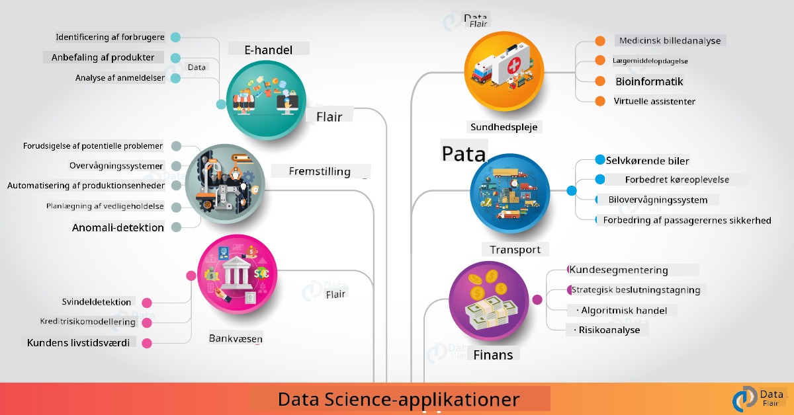

<!--
CO_OP_TRANSLATOR_METADATA:
{
  "original_hash": "f95679140c7cb39c30ccba535cd8f03f",
  "translation_date": "2025-09-04T19:21:10+00:00",
  "source_file": "6-Data-Science-In-Wild/20-Real-World-Examples/README.md",
  "language_code": "da"
}
-->
# Data Science i den Virkelige Verden

|  ](../../sketchnotes/20-DataScience-RealWorld.png) |
| :--------------------------------------------------------------------------------------------------------------: |
|               Data Science i den Virkelige Verden - _Sketchnote af [@nitya](https://twitter.com/nitya)_               |

Vi er næsten ved vejs ende i denne læringsrejse!

Vi startede med definitioner af data science og etik, udforskede forskellige værktøjer og teknikker til dataanalyse og visualisering, gennemgik data science-livscyklussen og kiggede på skalering og automatisering af data science-arbejdsgange med cloud computing-tjenester. Så du tænker sikkert: _"Hvordan kan jeg præcist anvende alt dette i virkelige kontekster?"_

I denne lektion vil vi udforske virkelige anvendelser af data science på tværs af industrier og dykke ned i specifikke eksempler inden for forskning, digitale humaniora og bæredygtighed. Vi vil se på muligheder for studenterprojekter og afslutte med nyttige ressourcer, der kan hjælpe dig med at fortsætte din læringsrejse!

## Quiz før forelæsningen

[Quiz før forelæsningen](https://ff-quizzes.netlify.app/en/ds/)

## Data Science + Industri

Takket være demokratiseringen af AI finder udviklere det nu lettere at designe og integrere AI-drevne beslutningsprocesser og data-drevne indsigter i brugeroplevelser og udviklingsarbejdsgange. Her er nogle eksempler på, hvordan data science "anvendes" i virkelige applikationer på tværs af industrier:

 * [Google Flu Trends](https://www.wired.com/2015/10/can-learn-epic-failure-google-flu-trends/) brugte data science til at korrelere søgetermer med influenzatrends. Selvom tilgangen havde fejl, skabte den opmærksomhed omkring mulighederne (og udfordringerne) ved data-drevne sundhedsprognoser.

 * [UPS Routing Predictions](https://www.technologyreview.com/2018/11/21/139000/how-ups-uses-ai-to-outsmart-bad-weather/) - forklarer, hvordan UPS bruger data science og maskinlæring til at forudsige optimale leveringsruter, med hensyntagen til vejrforhold, trafikmønstre, leveringsfrister og mere.

 * [NYC Taxicab Route Visualization](http://chriswhong.github.io/nyctaxi/) - data indsamlet ved hjælp af [Freedom Of Information Laws](https://chriswhong.com/open-data/foil_nyc_taxi/) hjalp med at visualisere en dag i livet for NYC-taxier, hvilket gav indsigt i, hvordan de navigerer i den travle by, hvor meget de tjener, og varigheden af ture over en 24-timers periode.

 * [Uber Data Science Workbench](https://eng.uber.com/dsw/) - bruger data (om afhentnings- og afleveringssteder, turens varighed, foretrukne ruter osv.) indsamlet fra millioner af Uber-ture *dagligt* til at bygge et dataanalysværktøj, der hjælper med prissætning, sikkerhed, svindelopdagelse og navigationsbeslutninger.

 * [Sports Analytics](https://towardsdatascience.com/scope-of-analytics-in-sports-world-37ed09c39860) - fokuserer på _forudsigende analyse_ (hold- og spilleranalyse - tænk [Moneyball](https://datasciencedegree.wisconsin.edu/blog/moneyball-proves-importance-big-data-big-ideas/) - og fanhåndtering) og _datavisualisering_ (hold- og fandashboards, spil osv.) med applikationer som talentspejderarbejde, sportsvæddemål og lager-/venuehåndtering.

 * [Data Science i Banksektoren](https://data-flair.training/blogs/data-science-in-banking/) - fremhæver værdien af data science i finanssektoren med applikationer, der spænder fra risikomodellering og svindelopdagelse til kundesegmentering, realtidsprognoser og anbefalingssystemer. Forudsigende analyse driver også kritiske målinger som [kreditvurderinger](https://dzone.com/articles/using-big-data-and-predictive-analytics-for-credit).

 * [Data Science i Sundhedssektoren](https://data-flair.training/blogs/data-science-in-healthcare/) - fremhæver applikationer som medicinsk billedbehandling (f.eks. MRI, røntgen, CT-scanning), genomik (DNA-sekventering), lægemiddeludvikling (risikovurdering, succesprognose), forudsigende analyse (patientpleje og forsyningslogistik), sygdomssporing og -forebyggelse osv.

 Billedkredit: [Data Flair: 6 Amazing Data Science Applications ](https://data-flair.training/blogs/data-science-applications/)

Figuren viser andre domæner og eksempler på anvendelse af data science-teknikker. Vil du udforske andre applikationer? Tjek [Review & Self Study](../../../../6-Data-Science-In-Wild/20-Real-World-Examples)-sektionen nedenfor.

## Data Science + Forskning

|  ](../../sketchnotes/20-DataScience-Research.png) |
| :---------------------------------------------------------------------------------------------------------------: |
|              Data Science & Forskning - _Sketchnote af [@nitya](https://twitter.com/nitya)_              |

Mens virkelige applikationer ofte fokuserer på industrielle anvendelser i stor skala, kan _forskningsprojekter_ være nyttige fra to perspektiver:

* _innovationsmuligheder_ - udforsk hurtig prototyping af avancerede koncepter og test af brugeroplevelser for næste generations applikationer.
* _implementeringsudfordringer_ - undersøg potentielle skader eller utilsigtede konsekvenser af data science-teknologier i virkelige kontekster.

For studerende kan disse forskningsprojekter give både lærings- og samarbejdsmuligheder, der kan forbedre din forståelse af emnet og udvide din bevidsthed og engagement med relevante personer eller teams, der arbejder inden for interesseområder. Så hvordan ser forskningsprojekter ud, og hvordan kan de gøre en forskel?

Lad os se på et eksempel - [MIT Gender Shades Study](http://gendershades.org/overview.html) af Joy Buolamwini (MIT Media Labs) med en [signaturforskningsartikel](http://proceedings.mlr.press/v81/buolamwini18a/buolamwini18a.pdf) medforfattet af Timnit Gebru (dengang hos Microsoft Research), der fokuserede på:

 * **Hvad:** Målet med forskningsprojektet var at _evaluere bias i automatiserede ansigtsanalysealgoritmer og datasæt_ baseret på køn og hudtype.
 * **Hvorfor:** Ansigtsanalyse bruges i områder som retshåndhævelse, lufthavnssikkerhed, ansættelsessystemer og mere - kontekster, hvor unøjagtige klassifikationer (f.eks. på grund af bias) kan forårsage potentielle økonomiske og sociale skader for berørte individer eller grupper. Forståelse (og eliminering eller afbødning) af bias er nøglen til retfærdighed i brugen.
 * **Hvordan:** Forskerne erkendte, at eksisterende benchmarks hovedsageligt brugte lysere hudtoner og kuraterede et nyt datasæt (1000+ billeder), der var _mere balanceret_ efter køn og hudtype. Datasættet blev brugt til at evaluere nøjagtigheden af tre kønsklassifikationsprodukter (fra Microsoft, IBM & Face++).

Resultaterne viste, at selvom den samlede klassifikationsnøjagtighed var god, var der en mærkbar forskel i fejlprocenter mellem forskellige undergrupper - med **fejlklassifikation** højere for kvinder eller personer med mørkere hudtoner, hvilket indikerer bias.

**Vigtige Resultater:** Skabte opmærksomhed omkring, at data science har brug for mere _repræsentative datasæt_ (balancerede undergrupper) og mere _inkluderende teams_ (diverse baggrunde) for at genkende og eliminere eller afbøde sådanne bias tidligere i AI-løsninger. Forskningsindsatser som denne er også afgørende for, at mange organisationer kan definere principper og praksis for _ansvarlig AI_ for at forbedre retfærdigheden i deres AI-produkter og -processer.

**Vil du lære om relevante forskningsindsatser hos Microsoft?**

* Tjek [Microsoft Research Projects](https://www.microsoft.com/research/research-area/artificial-intelligence/?facet%5Btax%5D%5Bmsr-research-area%5D%5B%5D=13556&facet%5Btax%5D%5Bmsr-content-type%5D%5B%5D=msr-project) inden for kunstig intelligens.
* Udforsk studenterprojekter fra [Microsoft Research Data Science Summer School](https://www.microsoft.com/en-us/research/academic-program/data-science-summer-school/).
* Tjek [Fairlearn](https://fairlearn.org/) projektet og [Responsible AI](https://www.microsoft.com/en-us/ai/responsible-ai?activetab=pivot1%3aprimaryr6) initiativerne.

## Data Science + Humaniora

|  ](../../sketchnotes/20-DataScience-Humanities.png) |
| :---------------------------------------------------------------------------------------------------------------: |
|              Data Science & Digitale Humaniora - _Sketchnote af [@nitya](https://twitter.com/nitya)_              |

Digitale Humaniora [er blevet defineret](https://digitalhumanities.stanford.edu/about-dh-stanford) som "en samling af praksisser og tilgange, der kombinerer computermetoder med humanistisk undersøgelse". [Stanford-projekter](https://digitalhumanities.stanford.edu/projects) som _"rebooting history"_ og _"poetic thinking"_ illustrerer forbindelsen mellem [Digitale Humaniora og Data Science](https://digitalhumanities.stanford.edu/digital-humanities-and-data-science) - med vægt på teknikker som netværksanalyse, informationsvisualisering, rumlig og tekstanalyse, der kan hjælpe os med at genbesøge historiske og litterære datasæt for at udlede nye indsigter og perspektiver.

*Vil du udforske og udvide et projekt inden for dette område?*

Tjek ["Emily Dickinson and the Meter of Mood"](https://gist.github.com/jlooper/ce4d102efd057137bc000db796bfd671) - et fantastisk eksempel fra [Jen Looper](https://twitter.com/jenlooper), der spørger, hvordan vi kan bruge data science til at genbesøge velkendt poesi og genvurdere dens betydning og bidrag fra dens forfatter i nye kontekster. For eksempel, _kan vi forudsige sæsonen, hvor et digt blev skrevet, ved at analysere dets tone eller sentiment_ - og hvad fortæller dette os om forfatterens sindstilstand i den relevante periode?

For at besvare det spørgsmål følger vi trinnene i vores data science-livscyklus:
 * [`Dataindsamling`](https://gist.github.com/jlooper/ce4d102efd057137bc000db796bfd671#acquiring-the-dataset) - for at indsamle et relevant datasæt til analyse. Muligheder inkluderer brug af en API (f.eks. [Poetry DB API](https://poetrydb.org/index.html)) eller scraping af websider (f.eks. [Project Gutenberg](https://www.gutenberg.org/files/12242/12242-h/12242-h.htm)) ved hjælp af værktøjer som [Scrapy](https://scrapy.org/).
 * [`Databehandling`](https://gist.github.com/jlooper/ce4d102efd057137bc000db796bfd671#clean-the-data) - forklarer, hvordan tekst kan formateres, renses og forenkles ved hjælp af grundlæggende værktøjer som Visual Studio Code og Microsoft Excel.
 * [`Dataanalyse`](https://gist.github.com/jlooper/ce4d102efd057137bc000db796bfd671#working-with-the-data-in-a-notebook) - forklarer, hvordan vi nu kan importere datasættet til "Notebooks" til analyse ved hjælp af Python-pakker (som pandas, numpy og matplotlib) til at organisere og visualisere dataene.
 * [`Sentimentanalyse`](https://gist.github.com/jlooper/ce4d102efd057137bc000db796bfd671#sentiment-analysis-using-cognitive-services) - forklarer, hvordan vi kan integrere cloud-tjenester som Text Analytics ved hjælp af low-code værktøjer som [Power Automate](https://flow.microsoft.com/en-us/) til automatiserede databehandlingsarbejdsgange.

Ved at bruge denne arbejdsgang kan vi udforske sæsonmæssige påvirkninger på digtenes sentiment og hjælpe os med at forme vores egne perspektiver på forfatteren. Prøv det selv - og udvid derefter notebooken til at stille andre spørgsmål eller visualisere dataene på nye måder!

> Du kan bruge nogle af værktøjerne i [Digital Humanities toolkit](https://github.com/Digital-Humanities-Toolkit) til at forfølge disse undersøgelsesveje.

## Data Science + Bæredygtighed

|  ](../../sketchnotes/20-DataScience-Sustainability.png) |
| :---------------------------------------------------------------------------------------------------------------: |
|              Data Science & Bæredygtighed - _Sketchnote af [@nitya](https://twitter.com/nitya)_              |

[2030 Agenda For Sustainable Development](https://sdgs.un.org/2030agenda) - vedtaget af alle FN-medlemmer i 2015 - identificerer 17 mål, herunder dem, der fokuserer på **beskyttelse af planeten** mod nedbrydning og virkningerne af klimaforandringer. [Microsoft Sustainability](https://www.microsoft.com/en-us/sustainability)-initiativet støtter disse mål ved at udforske måder, hvorpå teknologiløsninger kan understøtte og bygge mere bæredygtige fremtider med et [fokus på 4 mål](https://dev.to/azure/a-visual-guide-to-sustainable-software-engineering-53hh) - at være kulstofnegative, vandpositive, nul affald og biodiversitet inden 2030.

At tackle disse udfordringer på en skalerbar og rettidig måde kræver cloud-skala tænkning - og store mængder data. [Planetary Computer](https://planetarycomputer.microsoft.com/)-initiativet tilbyder 4 komponenter til at hjælpe dataforskere og udviklere i denne indsats:

 * [Data Catalog](https://planetarycomputer.microsoft.com/catalog) - med petabytes af Earth Systems-data (gratis og Azure-hostet).
 * [Planetary API](https://planetarycomputer.microsoft.com/docs/reference/stac/) - for at hjælpe brugere med at søge efter relevante data på tværs af rum og tid.
 * [Hub](https://planetarycomputer.microsoft.com/docs/overview/environment/) - administreret miljø for forskere til at behandle massive geospatiale datasæt.
 * [Applications](https://planetarycomputer.microsoft.com/applications) - viser anvendelsessager og værktøjer til bæredygtighedsindsigter.
**Planetary Computer-projektet er i øjeblikket i preview (fra september 2021)** - her er, hvordan du kan komme i gang med at bidrage til bæredygtighedsløsninger ved hjælp af data science.

* [Anmod om adgang](https://planetarycomputer.microsoft.com/account/request) for at starte din udforskning og forbinde med andre.
* [Udforsk dokumentation](https://planetarycomputer.microsoft.com/docs/overview/about) for at forstå understøttede datasæt og API'er.
* Udforsk applikationer som [Ecosystem Monitoring](https://analytics-lab.org/ecosystemmonitoring/) for inspiration til applikationsidéer.

Tænk over, hvordan du kan bruge datavisualisering til at fremhæve eller forstærke relevante indsigter inden for områder som klimaforandringer og skovrydning. Eller overvej, hvordan indsigter kan bruges til at skabe nye brugeroplevelser, der motiverer adfærdsændringer for en mere bæredygtig livsstil.

## Data Science + Studerende

Vi har talt om virkelige anvendelser i industrien og forskningen og udforsket eksempler på data science-applikationer inden for digitale humaniora og bæredygtighed. Så hvordan kan du opbygge dine færdigheder og dele din ekspertise som nybegynder inden for data science?

Her er nogle eksempler på data science-studerende projekter til inspiration.

* [MSR Data Science Summer School](https://www.microsoft.com/en-us/research/academic-program/data-science-summer-school/#!projects) med GitHub [projekter](https://github.com/msr-ds3), der udforsker emner som:
   - [Racial Bias in Police Use of Force](https://www.microsoft.com/en-us/research/video/data-science-summer-school-2019-replicating-an-empirical-analysis-of-racial-differences-in-police-use-of-force/) | [Github](https://github.com/msr-ds3/stop-question-frisk)
   - [Reliability of NYC Subway System](https://www.microsoft.com/en-us/research/video/data-science-summer-school-2018-exploring-the-reliability-of-the-nyc-subway-system/) | [Github](https://github.com/msr-ds3/nyctransit)
* [Digitizing Material Culture: Exploring socio-economic distributions in Sirkap](https://claremont.maps.arcgis.com/apps/Cascade/index.html?appid=bdf2aef0f45a4674ba41cd373fa23afc) - fra [Ornella Altunyan](https://twitter.com/ornelladotcom) og teamet på Claremont, ved brug af [ArcGIS StoryMaps](https://storymaps.arcgis.com/).

## 🚀 Udfordring

Søg efter artikler, der anbefaler data science-projekter, som er begyndervenlige - som [disse 50 emneområder](https://www.upgrad.com/blog/data-science-project-ideas-topics-beginners/) eller [disse 21 projektidéer](https://www.intellspot.com/data-science-project-ideas) eller [disse 16 projekter med kildekode](https://data-flair.training/blogs/data-science-project-ideas/), som du kan dekonstruere og remix. Og glem ikke at blogge om dine læringsrejser og dele dine indsigter med os alle.

## Quiz efter forelæsning

## [Quiz efter forelæsning](https://ff-quizzes.netlify.app/en/ds/)

## Gennemgang & Selvstudie

Vil du udforske flere anvendelsesmuligheder? Her er nogle relevante artikler:
* [17 Data Science Applications and Examples](https://builtin.com/data-science/data-science-applications-examples) - juli 2021
* [11 Breathtaking Data Science Applications in Real World](https://myblindbird.com/data-science-applications-real-world/) - maj 2021
* [Data Science In The Real World](https://towardsdatascience.com/data-science-in-the-real-world/home) - artikelkollektion
* Data Science inden for: [Uddannelse](https://data-flair.training/blogs/data-science-in-education/), [Landbrug](https://data-flair.training/blogs/data-science-in-agriculture/), [Finans](https://data-flair.training/blogs/data-science-in-finance/), [Film](https://data-flair.training/blogs/data-science-at-movies/) og mere.

## Opgave

[Udforsk et Planetary Computer-datasæt](assignment.md)

---

**Ansvarsfraskrivelse**:  
Dette dokument er blevet oversat ved hjælp af AI-oversættelsestjenesten [Co-op Translator](https://github.com/Azure/co-op-translator). Selvom vi bestræber os på at sikre nøjagtighed, skal det bemærkes, at automatiserede oversættelser kan indeholde fejl eller unøjagtigheder. Det originale dokument på dets oprindelige sprog bør betragtes som den autoritative kilde. For kritisk information anbefales professionel menneskelig oversættelse. Vi påtager os ikke ansvar for eventuelle misforståelser eller fejltolkninger, der måtte opstå som følge af brugen af denne oversættelse.