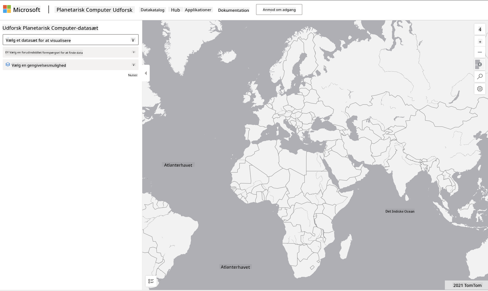

<!--
CO_OP_TRANSLATOR_METADATA:
{
  "original_hash": "d1e05715f9d97de6c4f1fb0c5a4702c0",
  "translation_date": "2025-08-26T21:56:14+00:00",
  "source_file": "6-Data-Science-In-Wild/20-Real-World-Examples/assignment.md",
  "language_code": "da"
}
-->
# Udforsk et Planetary Computer-datasæt

## Instruktioner

I denne lektion talte vi om forskellige anvendelsesområder inden for datavidenskab - med dybdegående eksempler relateret til forskning, bæredygtighed og digitale humaniora. I denne opgave skal du udforske et af disse eksempler mere detaljeret og anvende nogle af dine læringer omkring datavisualiseringer og analyser for at udlede indsigt om bæredygtighedsdata.

Projektet [Planetary Computer](https://planetarycomputer.microsoft.com/) har datasæt og API'er, der kan tilgås med en konto - anmod om en konto, hvis du vil prøve bonusdelen af opgaven. Siden tilbyder også en [Explorer](https://planetarycomputer.microsoft.com/explore)-funktion, som du kan bruge uden at oprette en konto.

`Trin:`
Explorer-grænsefladen (vist på skærmbilledet nedenfor) giver dig mulighed for at vælge et datasæt (fra de tilgængelige muligheder), en forudindstillet forespørgsel (til at filtrere data) og en visningsmulighed (til at skabe en relevant visualisering). I denne opgave er din opgave at:

 1. Læs [Explorer-dokumentationen](https://planetarycomputer.microsoft.com/docs/overview/explorer/) - forstå mulighederne.
 2. Udforsk datasæt [Kataloget](https://planetarycomputer.microsoft.com/catalog) - lær formålet med hvert datasæt.
 3. Brug Explorer - vælg et datasæt, der interesserer dig, vælg en relevant forespørgsel og visningsmulighed.

`Din opgave:`
Undersøg nu den visualisering, der vises i browseren, og besvar følgende:
 * Hvilke _funktioner_ har datasættet?
 * Hvilke _indsigter_ eller resultater giver visualiseringen?
 * Hvad er _implikationerne_ af disse indsigter for projektets bæredygtighedsmål?
 * Hvad er _begrænsningerne_ ved visualiseringen (dvs. hvilken indsigt fik du ikke)?
 * Hvis du kunne få rådataene, hvilke _alternative visualiseringer_ ville du skabe, og hvorfor?

`Bonuspoint:`
Ansøg om en konto - og log ind, når du er blevet godkendt.
 * Brug _Launch Hub_-muligheden til at åbne rådataene i en Notebook.
 * Udforsk dataene interaktivt, og implementer de alternative visualiseringer, du tænkte på.
 * Analyser nu dine brugerdefinerede visualiseringer - var du i stand til at udlede de indsigter, du tidligere gik glip af?

## Vurderingskriterier

Eksemplarisk | Tilstrækkelig | Kræver forbedring
--- | --- | -- |
Alle fem kerne-spørgsmål blev besvaret. Eleven identificerede tydeligt, hvordan nuværende og alternative visualiseringer kunne give indsigt i bæredygtighedsmål eller -resultater. | Eleven besvarede mindst de tre øverste spørgsmål i stor detalje og viste, at de havde praktisk erfaring med Explorer. | Eleven undlod at besvare flere spørgsmål eller gav utilstrækkelige detaljer - hvilket indikerer, at der ikke blev gjort et meningsfuldt forsøg på opgaven. |

---

**Ansvarsfraskrivelse**:  
Dette dokument er blevet oversat ved hjælp af AI-oversættelsestjenesten [Co-op Translator](https://github.com/Azure/co-op-translator). Selvom vi bestræber os på nøjagtighed, skal du være opmærksom på, at automatiserede oversættelser kan indeholde fejl eller unøjagtigheder. Det originale dokument på dets oprindelige sprog bør betragtes som den autoritative kilde. For kritisk information anbefales professionel menneskelig oversættelse. Vi er ikke ansvarlige for eventuelle misforståelser eller fejltolkninger, der måtte opstå som følge af brugen af denne oversættelse.