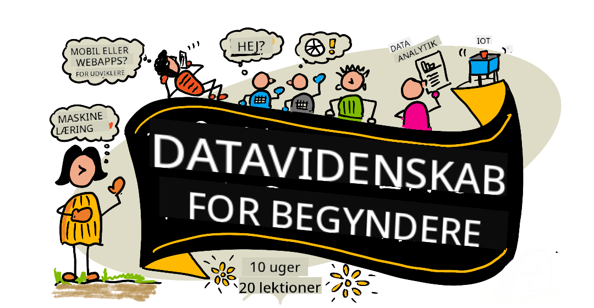

<!--
CO_OP_TRANSLATOR_METADATA:
{
  "original_hash": "7c31d1a22c746b1d0f0582d4f54702ba",
  "translation_date": "2025-12-24T23:44:06+00:00",
  "source_file": "README.md",
  "language_code": "da"
}
-->
# Data Science for Beginners - A Curriculum

Azure Cloud Advocates hos Microsoft er glade for at kunne tilbyde en 10-ugers, 20-lektioners læseplan, der handler om Data Science. Hver lektion indeholder quizzer før og efter lektionen, skriftlige instruktioner til at gennemføre lektionen, en løsning og en opgave. Vores projektbaserede pædagogik gør det muligt at lære ved at bygge — en dokumenteret måde for nye færdigheder at 'sætte sig fast'.

**Stor tak til vores forfattere:** [Jasmine Greenaway](https://www.twitter.com/paladique), [Dmitry Soshnikov](http://soshnikov.com), [Nitya Narasimhan](https://twitter.com/nitya), [Jalen McGee](https://twitter.com/JalenMcG), [Jen Looper](https://twitter.com/jenlooper), [Maud Levy](https://twitter.com/maudstweets), [Tiffany Souterre](https://twitter.com/TiffanySouterre), [Christopher Harrison](https://www.twitter.com/geektrainer).

**🙏 Særlige tak 🙏 til vores [Microsoft Student Ambassador](https://studentambassadors.microsoft.com/) forfattere, anmeldere og indholds-bidragsydere,** især Aaryan Arora, [Aditya Garg](https://github.com/AdityaGarg00), [Alondra Sanchez](https://www.linkedin.com/in/alondra-sanchez-molina/), [Ankita Singh](https://www.linkedin.com/in/ankitasingh007), [Anupam Mishra](https://www.linkedin.com/in/anupam--mishra/), [Arpita Das](https://www.linkedin.com/in/arpitadas01/), ChhailBihari Dubey, [Dibri Nsofor](https://www.linkedin.com/in/dibrinsofor), [Dishita Bhasin](https://www.linkedin.com/in/dishita-bhasin-7065281bb), [Majd Safi](https://www.linkedin.com/in/majd-s/), [Max Blum](https://www.linkedin.com/in/max-blum-6036a1186/), [Miguel Correa](https://www.linkedin.com/in/miguelmque/), [Mohamma Iftekher (Iftu) Ebne Jalal](https://twitter.com/iftu119), [Nawrin Tabassum](https://www.linkedin.com/in/nawrin-tabassum), [Raymond Wangsa Putra](https://www.linkedin.com/in/raymond-wp/), [Rohit Yadav](https://www.linkedin.com/in/rty2423), Samridhi Sharma, [Sanya Sinha](https://www.linkedin.com/mwlite/in/sanya-sinha-13aab1200),
[Sheena Narula](https://www.linkedin.com/in/sheena-narua-n/), [Tauqeer Ahmad](https://www.linkedin.com/in/tauqeerahmad5201/), Yogendrasingh Pawar , [Vidushi Gupta](https://www.linkedin.com/in/vidushi-gupta07/), [Jasleen Sondhi](https://www.linkedin.com/in/jasleen-sondhi/)

||
|:---:|
| Data Science For Beginners - _Sketchnote af [@nitya](https://twitter.com/nitya)_ |

### 🌐 Flersproget support

#### Understøttet via GitHub Action (Automatiseret & Altid opdateret)

<!-- CO-OP TRANSLATOR LANGUAGES TABLE START -->
[Arabisk](../ar/README.md) | [Bengalsk](../bn/README.md) | [Bulgarsk](../bg/README.md) | [Burmesisk (Myanmar)](../my/README.md) | [Kinesisk (forenklet)](../zh/README.md) | [Kinesisk (traditionelt, Hong Kong)](../hk/README.md) | [Kinesisk (traditionelt, Macau)](../mo/README.md) | [Kinesisk (traditionelt, Taiwan)](../tw/README.md) | [Kroatisk](../hr/README.md) | [Tjekkisk](../cs/README.md) | [Dansk](./README.md) | [Hollandsk](../nl/README.md) | [Estisk](../et/README.md) | [Finsk](../fi/README.md) | [Fransk](../fr/README.md) | [Tysk](../de/README.md) | [Græsk](../el/README.md) | [Hebraisk](../he/README.md) | [Hindi](../hi/README.md) | [Ungarsk](../hu/README.md) | [Indonesisk](../id/README.md) | [Italiensk](../it/README.md) | [Japansk](../ja/README.md) | [Kannada](../kn/README.md) | [Koreansk](../ko/README.md) | [Litauisk](../lt/README.md) | [Malaysisk](../ms/README.md) | [Malayalam](../ml/README.md) | [Marathi](../mr/README.md) | [Nepali](../ne/README.md) | [Nigeriansk Pidgin](../pcm/README.md) | [Norsk](../no/README.md) | [Persisk (Farsi)](../fa/README.md) | [Polsk](../pl/README.md) | [Portugisisk (Brasilien)](../br/README.md) | [Portugisisk (Portugal)](../pt/README.md) | [Punjabi (Gurmukhi)](../pa/README.md) | [Rumænsk](../ro/README.md) | [Russisk](../ru/README.md) | [Serbisk (kyrillisk)](../sr/README.md) | [Slovakisk](../sk/README.md) | [Slovensk](../sl/README.md) | [Spansk](../es/README.md) | [Swahili](../sw/README.md) | [Svensk](../sv/README.md) | [Tagalog (filippinsk)](../tl/README.md) | [Tamil](../ta/README.md) | [Telugu](../te/README.md) | [Thai](../th/README.md) | [Tyrkisk](../tr/README.md) | [Ukrainsk](../uk/README.md) | [Urdu](../ur/README.md) | [Vietnamesisk](../vi/README.md)
<!-- CO-OP TRANSLATOR LANGUAGES TABLE END -->

**Hvis du ønsker, at flere oversættelser understøttes, er de understøttede sprog listet [her](https://github.com/Azure/co-op-translator/blob/main/getting_started/supported-languages.md)**

#### Deltag i vores fællesskab 

Vi har en Discord "Learn with AI"-serie i gang — læs mere og deltag hos [Learn with AI Series](https://aka.ms/learnwithai/discord) fra 18 - 30 september, 2025. Du får tips og tricks til brug af GitHub Copilot til Data Science.

# Er du studerende?

Kom i gang med følgende ressourcer:

- [Student Hub-side](https://docs.microsoft.com/en-gb/learn/student-hub?WT.mc_id=academic-77958-bethanycheum) På denne side finder du begynderressourcer, studerendepakker og endda måder at få en gratis certifikatvoucher. Dette er en side, du bør bogmærke og tjekke fra tid til anden, da vi udskifter indhold mindst månedligt.
- [Microsoft Learn Student Ambassadors](https://studentambassadors.microsoft.com?WT.mc_id=academic-77958-bethanycheum) Deltag i et globalt fællesskab af Student Ambassadors; dette kan være din vej ind i Microsoft.

# Kom godt i gang

## 📚 Dokumentation

- **[Installation Guide](INSTALLATION.md)** - Trin-for-trin installationsvejledning for begyndere
- **[Usage Guide](USAGE.md)** - Eksempler og almindelige arbejdsgange
- **[Troubleshooting](TROUBLESHOOTING.md)** - Løsninger på almindelige problemer
- **[Contributing Guide](CONTRIBUTING.md)** - Hvordan du bidrager til dette projekt
- **[For Teachers](for-teachers.md)** - Vejledning til undervisning og ressourcer til klasseværelset

## 👨‍🎓 For studerende
> **Fuldstændige begyndere**: Er du ny inden for data science? Start med vores [begynder-venlige eksempler](examples/README.md)! Disse enkle, godt kommenterede eksempler hjælper dig med at forstå det grundlæggende, før du dykker ned i hele pensum.
> **[Studerende](https://aka.ms/student-page)**: for at bruge denne læseplan på egen hånd, fork hele repoet og gennemfør øvelserne selv, begyndende med en quiz før forelæsningen. Læs derefter forelæsningen og gennemfør resten af aktiviteterne. Forsøg at skabe projekterne ved at forstå lektionerne i stedet for at kopiere løsningskoden; den kode er dog tilgængelig i /solutions-mapperne i hver projektorienterede lektion. En anden idé er at danne en studiegruppe med venner og gennemgå indholdet sammen. Til yderligere studie anbefaler vi [Microsoft Learn](https://docs.microsoft.com/en-us/users/jenlooper-2911/collections/qprpajyoy3x0g7?WT.mc_id=academic-77958-bethanycheum).

**Hurtig start:**
1. Tjek [Installation Guide](INSTALLATION.md) for at sætte dit miljø op
2. Gennemse [Usage Guide](USAGE.md) for at lære, hvordan du arbejder med læseplanen
3. Start med Lektion 1 og arbejd dig igennem sekventielt
4. Deltag i vores [Discord-fællesskab](https://aka.ms/ds4beginners/discord) for support

## 👩‍🏫 For lærere

> **Lærere**: vi har [inkluderet nogle forslag](for-teachers.md) til, hvordan I kan bruge denne læseplan. Vi vil meget gerne have din feedback [i vores diskussionsforum](https://github.com/microsoft/Data-Science-For-Beginners/discussions)!

## Mød teamet

**Gif af** [Mohit Jaisal](https://www.linkedin.com/in/mohitjaisal)
> 🎥 Klik på billedet ovenfor for en video om projektet  de personer, der skabte det!

## Pædagogik

Vi har valgt to pædagogiske principper, mens vi udviklede dette pensum: at sikre, at det er projektbaseret, og at det indeholder hyppige quizzer. Ved afslutningen af denne serie vil eleverne have lært grundlæggende principper inden for datavidenskab, herunder etiske begreber, dataklargøring, forskellige måder at arbejde med data på, datavisualisering, dataanalyse, virkelige anvendelsestilfælde af datavidenskab og mere.

Derudover sætter en lavrisiko-quiz før en lektion elevens intention om at lære et emne, mens en anden quiz efter lektionen sikrer yderligere fastholdelse. Dette pensum er designet til at være fleksibelt og sjovt og kan tages i sin helhed eller delvist. Projekterne starter små og bliver gradvist mere komplekse i slutningen af den 10-ugers cyklus.

> Find vores [Adfærdskodeks](CODE_OF_CONDUCT.md), [Bidrag](CONTRIBUTING.md),  [Oversættelse](TRANSLATIONS.md) retningslinjer. Vi byder din konstruktive feedback velkommen!

## Hver lektion inkluderer:

- Valgfri sketchnote
- Valgfri supplerende video
- Opvarmningsquiz før lektionen
- Skriftlig lektion
- For projektbaserede lektioner, trin-for-trin vejledninger om hvordan man bygger projektet
- Videnstjek
- En udfordring
- Supplerende læsning
- Opgave
- [Quiz efter lektionen](https://ff-quizzes.netlify.app/en/)

> **En note om quizzer**: Alle quizzer findes i Quiz-App mappen, i alt 40 quizzer med tre spørgsmål i hver. De er linket fra lektionerne, men quiz-appen kan køres lokalt eller implementeres til Azure; følg instruktionen i `quiz-app` mappen. De bliver gradvist lokaliseret.

## 🎓 Begyndervenlige eksempler

**Ny til datavidenskab?** Vi har oprettet en særlig [eksempelmappen](examples/README.md) med enkel, velkommenteret kode for at hjælpe dig i gang:

- 🌟 **Hello World** - Dit første datavidenskabsprogram
- 📂 **Indlæsning af data** - Lær at læse og udforske datasæt
- 📊 **Simpel analyse** - Beregn statistik og find mønstre
- 📈 **Grundlæggende visualisering** - Opret diagrammer og grafer
- 🔬 **Reelt projekt** - Fuldt workflow fra start til slut

Hvert eksempel inkluderer detaljerede kommentarer, der forklarer hvert trin, hvilket gør det perfekt til helt nybegyndere!

👉 **[Start med eksemplerne](examples/README.md)** 👈

## Lessons

||
|:---:|
| Data Science for begyndere: køreplan - _Sketchnote af [@nitya](https://twitter.com/nitya)_ |

| Lesson Number | Topic | Lesson Grouping | Learning Objectives | Linked Lesson | Author |
| :-----------: | :----------------------------------------: | :--------------------------------------------------: | :-----------------------------------------------------------------------------------------------------------------------------------------------------------------------: | :---------------------------------------------------------------------: | :----: |
| 01 | Definere datavidenskab | [Introduktion](1-Introduction/README.md) | Lær de grundlæggende begreber bag datavidenskab og hvordan det relaterer sig til kunstig intelligens, maskinlæring og big data. | [lektion](1-Introduction/01-defining-data-science/README.md) [video](https://youtu.be/beZ7Mb_oz9I) | [Dmitry](http://soshnikov.com) |
| 02 | Etik i datavidenskab | [Introduktion](1-Introduction/README.md) | Dataetiske begreber, udfordringer og rammeværk. | [lektion](1-Introduction/02-ethics/README.md) | [Nitya](https://twitter.com/nitya) |
| 03 | Definere data | [Introduktion](1-Introduction/README.md) | Hvordan data klassificeres og dets almindelige kilder. | [lektion](1-Introduction/03-defining-data/README.md) | [Jasmine](https://www.twitter.com/paladique) |
| 04 | Introduktion til statistik og sandsynlighed | [Introduktion](1-Introduction/README.md) | De matematiske teknikker inden for sandsynlighed og statistik til at forstå data. | [lektion](1-Introduction/04-stats-and-probability/README.md) [video](https://youtu.be/Z5Zy85g4Yjw) | [Dmitry](http://soshnikov.com) |
| 05 | Arbejde med relationelle data | [Arbejde med data](2-Working-With-Data/README.md) | Introduktion til relationsdata og det grundlæggende i at udforske og analysere relationsdata med Structured Query Language, også kendt som SQL (udtales “see-quell”). | [lektion](2-Working-With-Data/05-relational-databases/README.md) | [Christopher](https://www.twitter.com/geektrainer) | | |
| 06 | Arbejde med NoSQL-data | [Arbejde med data](2-Working-With-Data/README.md) | Introduktion til ikke-relationelle data, deres forskellige typer og det grundlæggende i at udforske og analysere dokumentdatabaser. | [lektion](2-Working-With-Data/06-non-relational/README.md) | [Jasmine](https://twitter.com/paladique)|
| 07 | Arbejde med Python | [Arbejde med data](2-Working-With-Data/README.md) | Grundlæggende brug af Python til dataudforskning med biblioteker såsom Pandas. Grundlæggende forståelse af Python-programmering anbefales. | [lektion](2-Working-With-Data/07-python/README.md) [video](https://youtu.be/dZjWOGbsN4Y) | [Dmitry](http://soshnikov.com) |
| 08 | Dataforberedelse | [Arbejde med data](2-Working-With-Data/README.md) | Emner om datateknikker til at rense og transformere data for at håndtere udfordringer med manglende, unøjagtige eller ufuldstændige data. | [lektion](2-Working-With-Data/08-data-preparation/README.md) | [Jasmine](https://www.twitter.com/paladique) |
| 09 | Visualisering af mængder | [Datavisualisering](3-Data-Visualization/README.md) | Lær hvordan du bruger Matplotlib til at visualisere fugledata 🦆 | [lektion](3-Data-Visualization/09-visualization-quantities/README.md) | [Jen](https://twitter.com/jenlooper) |
| 10 | Visualisering af datadistributioner | [Datavisualisering](3-Data-Visualization/README.md) | Visualisering af observationer og tendenser inden for et interval. | [lektion](3-Data-Visualization/10-visualization-distributions/README.md) | [Jen](https://twitter.com/jenlooper) |
| 11 | Visualisering af proportioner | [Datavisualisering](3-Data-Visualization/README.md) | Visualisering af diskrete og grupperede procenter. | [lektion](3-Data-Visualization/11-visualization-proportions/README.md) | [Jen](https://twitter.com/jenlooper) |
| 12 | Visualisering af relationer | [Datavisualisering](3-Data-Visualization/README.md) | Visualisering af forbindelser og korrelationer mellem datasæt og deres variabler. | [lektion](3-Data-Visualization/12-visualization-relationships/README.md) | [Jen](https://twitter.com/jenlooper) |
| 13 | Meningsfulde visualiseringer | [Datavisualisering](3-Data-Visualization/README.md) | Teknikker og vejledning til at gøre dine visualiseringer værdifulde for effektiv problemløsning og indsigt. | [lektion](3-Data-Visualization/13-meaningful-visualizations/README.md) | [Jen](https://twitter.com/jenlooper) |
| 14 | Introduktion til datavidenskabens livscyklus | [Livscyklus](4-Data-Science-Lifecycle/README.md) | Introduktion til datavidenskabens livscyklus og dets første trin med at indsamle og udtrække data. | [lektion](4-Data-Science-Lifecycle/14-Introduction/README.md) | [Jasmine](https://twitter.com/paladique) |
| 15 | Analyse | [Livscyklus](4-Data-Science-Lifecycle/README.md) | Denne fase af datavidenskabens livscyklus fokuserer på teknikker til at analysere data. | [lektion](4-Data-Science-Lifecycle/15-analyzing/README.md) | [Jasmine](https://twitter.com/paladique) | | |
| 16 | Kommunikation | [Livscyklus](4-Data-Science-Lifecycle/README.md) | Denne fase af datavidenskabens livscyklus fokuserer på at præsentere indsigterne fra data på en måde, der gør det lettere for beslutningstagere at forstå. | [lektion](4-Data-Science-Lifecycle/16-communication/README.md) | [Jalen](https://twitter.com/JalenMcG) | | |
| 17 | Datavidenskab i skyen | [Skydata](5-Data-Science-In-Cloud/README.md) | Denne serie af lektioner introducerer datavidenskab i skyen og dets fordele. | [lektion](5-Data-Science-In-Cloud/17-Introduction/README.md) | [Tiffany](https://twitter.com/TiffanySouterre) and [Maud](https://twitter.com/maudstweets) |
| 18 | Datavidenskab i skyen | [Skydata](5-Data-Science-In-Cloud/README.md) | Træning af modeller ved hjælp af Low Code-værktøjer. |[lektion](5-Data-Science-In-Cloud/18-Low-Code/README.md) | [Tiffany](https://twitter.com/TiffanySouterre) and [Maud](https://twitter.com/maudstweets) |
| 19 | Datavidenskab i skyen | [Skydata](5-Data-Science-In-Cloud/README.md) | Implementering af modeller med Azure Machine Learning Studio. | [lektion](5-Data-Science-In-Cloud/19-Azure/README.md)| [Tiffany](https://twitter.com/TiffanySouterre) and [Maud](https://twitter.com/maudstweets) |
| 20 | Datavidenskab i praksis | [I praksis](6-Data-Science-In-Wild/README.md) | Datavidenskabsdrevne projekter i den virkelige verden. | [lektion](6-Data-Science-In-Wild/20-Real-World-Examples/README.md) | [Nitya](https://twitter.com/nitya) |

## GitHub Codespaces

Følg disse trin for at åbne dette eksempel i en Codespace:
1. Klik på Code-rullelisten og vælg Open with Codespaces-optionen.
2. Vælg + New codespace nederst i panelet.
For mere info, se [GitHub-dokumentationen](https://docs.github.com/en/codespaces/developing-in-codespaces/creating-a-codespace-for-a-repository#creating-a-codespace).

## VSCode Remote - Containers
Følg disse trin for at åbne dette repo i en container ved hjælp af din lokale maskine og VSCode using  the VS Code Remote - Containers extension:

1. If this is your first time using a development container, please ensure your system meets the pre-reqs (i.e. have Docker installed) in [the getting started documentation](https://code.visualstudio.com/docs/devcontainers/containers#_getting-started).

To use this repository, you can either open the repository in an isolated Docker volume:

**Note**: Under the hood, this will use the Remote-Containers: **Clone Repository in Container Volume...** command to clone the source code in a Docker volume instead of the local filesystem. [Volumes](https://docs.docker.com/storage/volumes/) are the preferred mechanism for persisting container data.

Or open a locally cloned or downloaded version of the repository:

- Clone this repository to your local filesystem.
- Press F1 and select the **Remote-Containers: Open Folder in Container...** command.
- Select the cloned copy of this folder, wait for the container to start, and try things out.

## Offline access

Du kan køre denne dokumentation offline ved at bruge [Docsify](https://docsify.js.org/#/). Fork dette repo, [install Docsify](https://docsify.js.org/#/quickstart) på din lokale maskine,  then in the root folder of this repo, type `docsify serve`. Hjemmesiden vil blive serveret på port 3000 på din localhost: `localhost:3000`.

> Bemærk, notebooks vil ikke blive gengivet via Docsify, så når du har brug for at køre en notebook, gør det separat i VS Code, der kører en Python-kernel.

## Other Curricula

Vores team producerer andre læseplaner! Tjek:

<!-- CO-OP TRANSLATOR OTHER COURSES START -->
### LangChain

---

### Azure / Edge / MCP / Agents

---
 
### Generativ AI-serie

[-9333EA?style=for-the-badge&labelColor=E5E7EB&color=9333EA)](https://github.com/microsoft/Generative-AI-for-beginners-dotnet?WT.mc_id=academic-105485-koreyst)
[-C084FC?style=for-the-badge&labelColor=E5E7EB&color=C084FC)](https://github.com/microsoft/generative-ai-for-beginners-java?WT.mc_id=academic-105485-koreyst)
[-E879F9?style=for-the-badge&labelColor=E5E7EB&color=E879F9)](https://github.com/microsoft/generative-ai-with-javascript?WT.mc_id=academic-105485-koreyst)

---
 
### Kerne-læring

---
 
### Copilot-serie

<!-- CO-OP TRANSLATOR OTHER COURSES END -->

## Få hjælp

**Oplever du problemer?** Se vores [Fejlfindingsguide](TROUBLESHOOTING.md) for løsninger på almindelige problemer.

Hvis du sidder fast eller har spørgsmål om at bygge AI-apps. Deltag i diskussioner med medstuderende og erfarne udviklere om MCP. Det er et støttende fællesskab, hvor spørgsmål er velkomne, og viden deles frit.

Hvis du har produktfeedback eller støder på fejl under udvikling, besøg:

---

<!-- CO-OP TRANSLATOR DISCLAIMER START -->
Ansvarsfraskrivelse:
Dette dokument er blevet oversat ved hjælp af AI-oversættelsestjenesten [Co-op Translator](https://github.com/Azure/co-op-translator). Selvom vi bestræber os på nøjagtighed, bedes du være opmærksom på, at automatiske oversættelser kan indeholde fejl eller unøjagtigheder. Det oprindelige dokument på originalsproget bør betragtes som den autoritative kilde. For kritisk information anbefales en professionel menneskelig oversættelse. Vi påtager os intet ansvar for eventuelle misforståelser eller fejltolkninger, der måtte opstå som følge af brugen af denne oversættelse.
<!-- CO-OP TRANSLATOR DISCLAIMER END -->