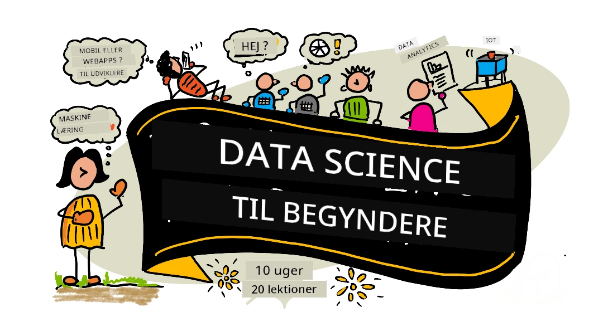
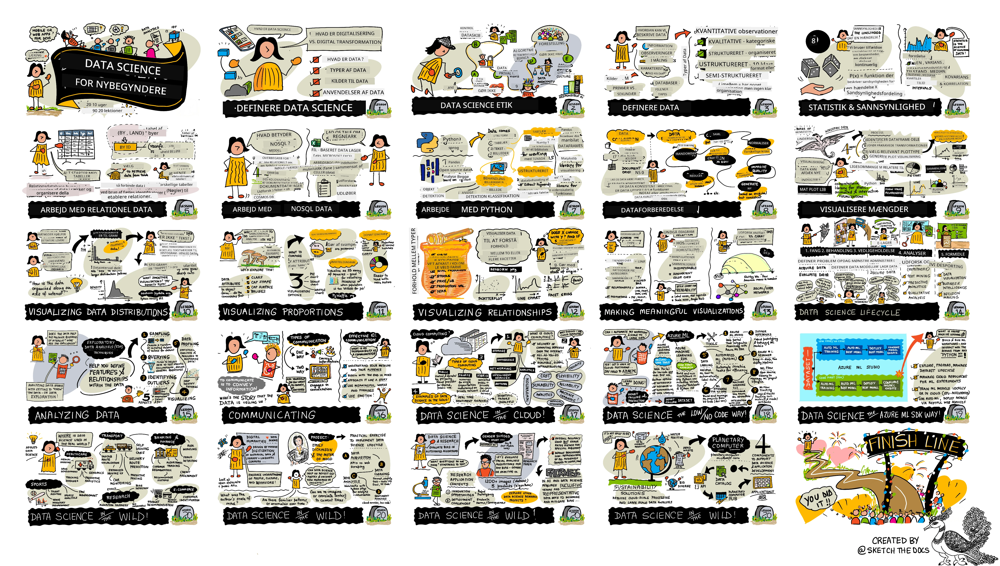

# Data Science for Beginners - Et Curriculum

[](https://github.com/codespaces/new?hide_repo_select=true&ref=main&repo=344191198)

[](https://github.com/microsoft/Data-Science-For-Beginners/blob/master/LICENSE)
[](https://GitHub.com/microsoft/Data-Science-For-Beginners/graphs/contributors/)
[](https://GitHub.com/microsoft/Data-Science-For-Beginners/issues/)
[](https://GitHub.com/microsoft/Data-Science-For-Beginners/pulls/)
[](http://makeapullrequest.com)

[](https://GitHub.com/microsoft/Data-Science-For-Beginners/watchers/)
[](https://GitHub.com/microsoft/Data-Science-For-Beginners/network/)
[](https://GitHub.com/microsoft/Data-Science-For-Beginners/stargazers/)


[](https://discord.gg/nTYy5BXMWG)

[](https://aka.ms/foundry/forum)

Azure Cloud Advocates hos Microsoft er glade for at tilbyde et 10-ugers, 20-lektions curriculum, som handler om Data Science. Hver lektion inkluderer quizzer før og efter lektionen, skriftlige instruktioner til at gennemføre lektionen, en løsning og en opgave. Vores projektbaserede pædagogik gør det muligt for dig at lære, mens du bygger, hvilket er en bevist metode til at få nye færdigheder til at 'sidde fast'.

**Hjertelig tak til vores forfattere:** [Jasmine Greenaway](https://www.twitter.com/paladique), [Dmitry Soshnikov](http://soshnikov.com), [Nitya Narasimhan](https://twitter.com/nitya), [Jalen McGee](https://twitter.com/JalenMcG), [Jen Looper](https://twitter.com/jenlooper), [Maud Levy](https://twitter.com/maudstweets), [Tiffany Souterre](https://twitter.com/TiffanySouterre), [Christopher Harrison](https://www.twitter.com/geektrainer).

**🙏 Særlige tak 🙏 til vores [Microsoft Student Ambassador](https://studentambassadors.microsoft.com/) forfattere, anmeldere og indholdsbidragydere,** især Aaryan Arora, [Aditya Garg](https://github.com/AdityaGarg00), [Alondra Sanchez](https://www.linkedin.com/in/alondra-sanchez-molina/), [Ankita Singh](https://www.linkedin.com/in/ankitasingh007), [Anupam Mishra](https://www.linkedin.com/in/anupam--mishra/), [Arpita Das](https://www.linkedin.com/in/arpitadas01/), ChhailBihari Dubey, [Dibri Nsofor](https://www.linkedin.com/in/dibrinsofor), [Dishita Bhasin](https://www.linkedin.com/in/dishita-bhasin-7065281bb), [Majd Safi](https://www.linkedin.com/in/majd-s/), [Max Blum](https://www.linkedin.com/in/max-blum-6036a1186/), [Miguel Correa](https://www.linkedin.com/in/miguelmque/), [Mohamma Iftekher (Iftu) Ebne Jalal](https://twitter.com/iftu119), [Nawrin Tabassum](https://www.linkedin.com/in/nawrin-tabassum), [Raymond Wangsa Putra](https://www.linkedin.com/in/raymond-wp/), [Rohit Yadav](https://www.linkedin.com/in/rty2423), Samridhi Sharma, [Sanya Sinha](https://www.linkedin.com/mwlite/in/sanya-sinha-13aab1200),
[Sheena Narula](https://www.linkedin.com/in/sheena-narua-n/), [Tauqeer Ahmad](https://www.linkedin.com/in/tauqeerahmad5201/), Yogendrasingh Pawar , [Vidushi Gupta](https://www.linkedin.com/in/vidushi-gupta07/), [Jasleen Sondhi](https://www.linkedin.com/in/jasleen-sondhi/)

||
|:---:|
| Data Science For Beginners - _Sketchnote af [@nitya](https://twitter.com/nitya)_ |

### 🌐 Multi-sprogsunderstøttelse

#### Understøttet via GitHub Action (Automatiseret & Altid Opdateret)

<!-- CO-OP TRANSLATOR LANGUAGES TABLE START -->
[Arabic](../ar/README.md) | [Bengali](../bn/README.md) | [Bulgarian](../bg/README.md) | [Burmese (Myanmar)](../my/README.md) | [Chinese (Simplified)](../zh-CN/README.md) | [Chinese (Traditional, Hong Kong)](../zh-HK/README.md) | [Chinese (Traditional, Macau)](../zh-MO/README.md) | [Chinese (Traditional, Taiwan)](../zh-TW/README.md) | [Croatian](../hr/README.md) | [Czech](../cs/README.md) | [Danish](./README.md) | [Dutch](../nl/README.md) | [Estonian](../et/README.md) | [Finnish](../fi/README.md) | [French](../fr/README.md) | [German](../de/README.md) | [Greek](../el/README.md) | [Hebrew](../he/README.md) | [Hindi](../hi/README.md) | [Hungarian](../hu/README.md) | [Indonesian](../id/README.md) | [Italian](../it/README.md) | [Japanese](../ja/README.md) | [Kannada](../kn/README.md) | [Khmer](../km/README.md) | [Korean](../ko/README.md) | [Lithuanian](../lt/README.md) | [Malay](../ms/README.md) | [Malayalam](../ml/README.md) | [Marathi](../mr/README.md) | [Nepali](../ne/README.md) | [Nigerian Pidgin](../pcm/README.md) | [Norwegian](../no/README.md) | [Persian (Farsi)](../fa/README.md) | [Polish](../pl/README.md) | [Portuguese (Brazil)](../pt-BR/README.md) | [Portuguese (Portugal)](../pt-PT/README.md) | [Punjabi (Gurmukhi)](../pa/README.md) | [Romanian](../ro/README.md) | [Russian](../ru/README.md) | [Serbian (Cyrillic)](../sr/README.md) | [Slovak](../sk/README.md) | [Slovenian](../sl/README.md) | [Spanish](../es/README.md) | [Swahili](../sw/README.md) | [Swedish](../sv/README.md) | [Tagalog (Filipino)](../tl/README.md) | [Tamil](../ta/README.md) | [Telugu](../te/README.md) | [Thai](../th/README.md) | [Turkish](../tr/README.md) | [Ukrainian](../uk/README.md) | [Urdu](../ur/README.md) | [Vietnamese](../vi/README.md)

> **Foretrækker du at klone lokalt?**
>
> Dette repository inkluderer 50+ sprogoversættelser, hvilket øger download-størrelsen betydeligt. For at klone uden oversættelser, brug sparse checkout:
>
> **Bash / macOS / Linux:**
> ```bash
> git clone --filter=blob:none --sparse https://github.com/microsoft/Data-Science-For-Beginners.git
> cd Data-Science-For-Beginners
> git sparse-checkout set --no-cone '/*' '!translations' '!translated_images'
> ```
>
> **CMD (Windows):**
> ```cmd
> git clone --filter=blob:none --sparse https://github.com/microsoft/Data-Science-For-Beginners.git
> cd Data-Science-For-Beginners
> git sparse-checkout set --no-cone "/*" "!translations" "!translated_images"
> ```
>
> Dette giver dig alt, hvad du behøver for at gennemføre kurset med en meget hurtigere download.
<!-- CO-OP TRANSLATOR LANGUAGES TABLE END -->

**Hvis du ønsker at få yderligere oversættelser, er understøttede sprog listet [her](https://github.com/Azure/co-op-translator/blob/main/getting_started/supported-languages.md)**

#### Deltag i Vores Fællesskab 
[](https://discord.gg/nTYy5BXMWG)

Vi har en kontinuerlig Discord-lær med AI-serie, lær mere og deltag hos [Learn with AI Series](https://aka.ms/learnwithai/discord) fra 18. - 30. september 2025. Du vil få tips og tricks til at bruge GitHub Copilot til Data Science.


# Er du studerende?

Kom i gang med følgende ressourcer:

- [Student Hub side](https://docs.microsoft.com/en-gb/learn/student-hub?WT.mc_id=academic-77958-bethanycheum) På denne side finder du begynderressourcer, studenterpakker og endda måder at få en gratis certificeringsvoucher på. Dette er en side, du vil bogmærke og tjekke med jævne mellemrum, da vi skifter indhold mindst månedligt.
- [Microsoft Learn Student Ambassadors](https://studentambassadors.microsoft.com?WT.mc_id=academic-77958-bethanycheum) Bliv medlem af et globalt fællesskab af studenterambassadører, dette kan være din vej ind i Microsoft.

# Kom i gang

## 📚 Dokumentation

- **[Installationsvejledning](INSTALLATION.md)** - Trin-for-trin installationsinstruktioner for begyndere
- **[Brugsvejledning](USAGE.md)** - Eksempler og almindelige arbejdsflows
- **[Fejlfinding](TROUBLESHOOTING.md)** - Løsninger på almindelige problemer
- **[Bidragsvejledning](CONTRIBUTING.md)** - Hvordan man bidrager til dette projekt
- **[For lærere](for-teachers.md)** - Undervisningsvejledning og klasseværelsesressourcer

## 👨‍🎓 For Studerende
> **Komplet begyndere**: Ny til data science? Start med vores [begynder-venlige eksempler](examples/README.md)! Disse enkle og velkommenterede eksempler hjælper dig med at forstå det grundlæggende, før du dykker ned i det fulde curriculum.
> **[Studerende](https://aka.ms/student-page)**: for at bruge dette curriculum på egen hånd, forgrenes hele repoen og gennemfør øvelserne på egen hånd, startende med en quiz før forelæsningen. Læs så forelæsningen og fuldfør resten af aktiviteterne. Prøv at skabe projekterne ved at forstå lektionerne i stedet for at kopiere løsningskoden; dog er den kode tilgængelig i /solutions mapperne i hver projektorienteret lektion. En anden idé er at danne en studiegruppe med venner og gennemgå indholdet sammen. Til yderligere studie anbefaler vi [Microsoft Learn](https://docs.microsoft.com/en-us/users/jenlooper-2911/collections/qprpajyoy3x0g7?WT.mc_id=academic-77958-bethanycheum).

**Hurtig start:**
1. Tjek [Installationsvejledningen](INSTALLATION.md) for at sætte dit miljø op
2. Gennemgå [Brugsvejledningen](USAGE.md) for at lære, hvordan du arbejder med curriculum
3. Start med Lektion 1 og arbejd dig igennem sekventielt
4. Deltag i vores [Discord-fællesskab](https://aka.ms/ds4beginners/discord) for support

## 👩‍🏫 For Lærere
> **Lærere**: vi har [inkluderet nogle forslag](for-teachers.md) til, hvordan man bruger dette pensum. Vi vil meget gerne have jeres feedback [i vores diskussionsforum](https://github.com/microsoft/Data-Science-For-Beginners/discussions)!

## Mød holdet

[](https://youtu.be/8mzavjQSMM4 "Promo video")

**Gif af** [Mohit Jaisal](https://www.linkedin.com/in/mohitjaisal)

> 🎥 Klik på billedet ovenfor for en video om projektet og folkene, der skabte det!

## Pædagogik

Vi har valgt to pædagogiske principper under opbygningen af dette pensum: sikring af, at det er projektbaseret, og at det inkluderer hyppige quizzer. Ved slutningen af denne serie vil eleverne have lært grundlæggende principper inden for datalogi, herunder etiske koncepter, datapreparation, forskellige måder at arbejde med data på, datavisualisering, dataanalyse, virkelige anvendelsessituationer af datalogi og mere.

Derudover sætter en quiz med lav indsats før en lektion elevens intention mod at lære et emne, mens en anden quiz efter lektionen sikrer yderligere fastholdelse. Dette pensum er designet til at være fleksibelt og sjovt og kan tages helt eller delvist. Projekterne starter småt og bliver gradvist mere komplekse ved slutningen af 10-ugers cyklussen.

> Find vores [Adfærdskodeks](CODE_OF_CONDUCT.md), [Bidrag](CONTRIBUTING.md), [Oversættelse](TRANSLATIONS.md) retningslinjer. Vi byder din konstruktive feedback velkommen!

## Hver lektion inkluderer:

- Valgfri skitcenote
- Valgfri supplerende video
- Quiz som opvarmning før lektionen
- Skriftlig lektion
- For projektbaserede lektioner: trin-for-trin vejledninger til at bygge projektet
- Videnstjek
- En udfordring
- Supplerende læsning
- Opgave
- [Quiz efter lektionen](https://ff-quizzes.netlify.app/en/)

> **En note om quizzer**: Alle quizzer findes i Quiz-App mappen, i alt 40 quizzer med tre spørgsmål hver. De er linket inde i lektionerne, men quiz-appen kan køres lokalt eller implementeres til Azure; følg instruktionerne i `quiz-app` mappen. De bliver gradvist lokaliseret.

## 🎓 Begynder-venlige eksempler

**Ny til datalogi?** Vi har oprettet et særligt [eksempelmappen](examples/README.md) med enkel, velkommenteret kode for at hjælpe dig i gang:

- 🌟 **Hej Verden** - Dit første datalogiprogram
- 📂 **Indlæsning af data** - Lær at læse og udforske datasæt
- 📊 **Simpel analyse** - Beregn statistik og find mønstre
- 📈 **Grundlæggende visualisering** - Opret diagrammer og grafer
- 🔬 **Virkelighedsnært projekt** - Fuldfør workflow fra start til slut

Hvert eksempel inkluderer detaljerede kommentarer, der forklarer hvert trin, hvilket gør det perfekt til helt begyndere!

👉 **[Start med eksemplerne](examples/README.md)** 👈

## Lektioner


||
|:---:|
| Data Science For Beginners: Vejkort - _Skitcenote af [@nitya](https://twitter.com/nitya)_ |


| Lektion Nummer | Emne | Lektion Gruppering | Læringsmål | Linket Lektion | Forfatter |
| :-----------: | :----------------------------------------: | :--------------------------------------------------: | :-----------------------------------------------------------------------------------------------------------------------------------------------------------------------: | :---------------------------------------------------------------------: | :----: |
| 01 | Definition af data science | [Introduktion](1-Introduction/README.md) | Lær de grundlæggende koncepter bag datalogi og hvordan det relaterer til kunstig intelligens, maskinlæring og big data. | [lektion](1-Introduction/01-defining-data-science/README.md) [video](https://youtu.be/beZ7Mb_oz9I) | [Dmitry](http://soshnikov.com) |
| 02 | Data Science etik | [Introduktion](1-Introduction/README.md) | Koncepter, udfordringer og rammer for dataetik. | [lektion](1-Introduction/02-ethics/README.md) | [Nitya](https://twitter.com/nitya) |
| 03 | Definition af data | [Introduktion](1-Introduction/README.md) | Hvordan data klassificeres og dets almindelige kilder. | [lektion](1-Introduction/03-defining-data/README.md) | [Jasmine](https://www.twitter.com/paladique) |
| 04 | Introduktion til statistik & sandsynlighed | [Introduktion](1-Introduction/README.md) | Matematiske teknikker inden for sandsynlighed og statistik til forståelse af data. | [lektion](1-Introduction/04-stats-and-probability/README.md) [video](https://youtu.be/Z5Zy85g4Yjw) | [Dmitry](http://soshnikov.com) |
| 05 | Arbejde med relationsdata | [Arbejde med data](2-Working-With-Data/README.md) | Introduktion til relationsdata og grundlæggende utforskning og analyse af relationsdata med Structured Query Language, også kendt som SQL (udtalt "see-quell"). | [lektion](2-Working-With-Data/05-relational-databases/README.md) | [Christopher](https://www.twitter.com/geektrainer) | | |
| 06 | Arbejde med NoSQL data | [Arbejde med data](2-Working-With-Data/README.md) | Introduktion til ikke-relational data, dets forskellige typer og grundlæggende tilgang til at udforske og analysere dokumentdatabaser. | [lektion](2-Working-With-Data/06-non-relational/README.md) | [Jasmine](https://twitter.com/paladique)|
| 07 | Arbejde med Python | [Arbejde med data](2-Working-With-Data/README.md) | Grundlæggende brug af Python til dataudforskning med biblioteker som Pandas. En grundlæggende forståelse af Python programmering anbefales. | [lektion](2-Working-With-Data/07-python/README.md) [video](https://youtu.be/dZjWOGbsN4Y) | [Dmitry](http://soshnikov.com) |
| 08 | Datapreparation | [Arbejde med data](2-Working-With-Data/README.md) | Emner om datateknikker til rengøring og transformation af data til håndtering af udfordringer som manglende, unøjagtige eller ufuldstændige data. | [lektion](2-Working-With-Data/08-data-preparation/README.md) | [Jasmine](https://www.twitter.com/paladique) |
| 09 | Visualisering af mængder | [Datavisualisering](3-Data-Visualization/README.md) | Lær at bruge Matplotlib til at visualisere fugledata 🦆 | [lektion](3-Data-Visualization/09-visualization-quantities/README.md) | [Jen](https://twitter.com/jenlooper) |
| 10 | Visualisering af datafordelinger | [Datavisualisering](3-Data-Visualization/README.md) | Visualisering af observationer og tendenser inden for et interval. | [lektion](3-Data-Visualization/10-visualization-distributions/README.md) | [Jen](https://twitter.com/jenlooper) |
| 11 | Visualisering af proportioner | [Datavisualisering](3-Data-Visualization/README.md) | Visualisering af diskrete og grupperede procentdele. | [lektion](3-Data-Visualization/11-visualization-proportions/README.md) | [Jen](https://twitter.com/jenlooper) |
| 12 | Visualisering af sammenhænge | [Datavisualisering](3-Data-Visualization/README.md) | Visualisering af forbindelser og korrelationer mellem datasæt og deres variabler. | [lektion](3-Data-Visualization/12-visualization-relationships/README.md) | [Jen](https://twitter.com/jenlooper) |
| 13 | Meningsfulde visualiseringer | [Datavisualisering](3-Data-Visualization/README.md) | Teknikker og vejledning til at gøre dine visualiseringer værdifulde for effektiv problemløsning og indsigter. | [lektion](3-Data-Visualization/13-meaningful-visualizations/README.md) | [Jen](https://twitter.com/jenlooper) |
| 14 | Introduktion til data science livscyklus | [Livscyklus](4-Data-Science-Lifecycle/README.md) | Introduktion til data science livscyklussen og dets første trin: at erhverve og udtrække data. | [lektion](4-Data-Science-Lifecycle/14-Introduction/README.md) | [Jasmine](https://twitter.com/paladique) |
| 15 | Analyse | [Livscyklus](4-Data-Science-Lifecycle/README.md) | Denne fase i data science livscyklussen fokuserer på teknikker til at analysere data. | [lektion](4-Data-Science-Lifecycle/15-analyzing/README.md) | [Jasmine](https://twitter.com/paladique) | | |
| 16 | Kommunikation | [Livscyklus](4-Data-Science-Lifecycle/README.md) | Denne fase i data science livscyklussen fokuserer på at præsentere indsigterne fra data på en måde, der gør det lettere for beslutningstagere at forstå. | [lektion](4-Data-Science-Lifecycle/16-communication/README.md) | [Jalen](https://twitter.com/JalenMcG) | | |
| 17 | Data Science i skyen | [Skydata](5-Data-Science-In-Cloud/README.md) | Denne serie af lektioner introducerer datalogi i skyen og dens fordele. | [lektion](5-Data-Science-In-Cloud/17-Introduction/README.md) | [Tiffany](https://twitter.com/TiffanySouterre) og [Maud](https://twitter.com/maudstweets) |
| 18 | Data Science i skyen | [Skydata](5-Data-Science-In-Cloud/README.md) | Træning af modeller ved hjælp af Low Code værktøjer. |[lektion](5-Data-Science-In-Cloud/18-Low-Code/README.md) | [Tiffany](https://twitter.com/TiffanySouterre) og [Maud](https://twitter.com/maudstweets) |
| 19 | Data Science i skyen | [Skydata](5-Data-Science-In-Cloud/README.md) | Implementering af modeller med Azure Machine Learning Studio. | [lektion](5-Data-Science-In-Cloud/19-Azure/README.md)| [Tiffany](https://twitter.com/TiffanySouterre) og [Maud](https://twitter.com/maudstweets) |
| 20 | Data Science i det virkelige liv | [I det fri](6-Data-Science-In-Wild/README.md) | Data science-drevne projekter i den virkelige verden. | [lektion](6-Data-Science-In-Wild/20-Real-World-Examples/README.md) | [Nitya](https://twitter.com/nitya) |

## GitHub Codespaces

Følg disse trin for at åbne dette eksempel i en Codespace:
1. Klik på Kode-rullemenuen og vælg Muligheden Åbn med Codespaces.
2. Vælg + Ny codespace nederst i panelet.
For mere info, se [GitHub dokumentationen](https://docs.github.com/en/codespaces/developing-in-codespaces/creating-a-codespace-for-a-repository#creating-a-codespace).

## VSCode Remote - Containers
Følg disse trin for at åbne dette repo i en container ved brug af din lokale maskine og VSCode med VS Code Remote - Containers udvidelsen:

1. Hvis dette er første gang, du bruger en udviklingscontainer, skal du sikre, at dit system opfylder forudsætningerne (dvs. have Docker installeret) i [kom i gang dokumentationen](https://code.visualstudio.com/docs/devcontainers/containers#_getting-started).

For at bruge dette repository kan du enten åbne repository’et i et isoleret Docker volume:

**Bemærk**: Under motorhjelmen bruges kommandoen Remote-Containers: **Clone Repository in Container Volume...** til at klone koden i et Docker volume i stedet for lokalt filsystem. [Volumes](https://docs.docker.com/storage/volumes/) er den foretrukne mekanisme til at bevare container data.

Eller åbn en lokalt klonet eller downloadet version af repository’et:

- Klon dette repository til dit lokale filsystem.
- Tryk på F1 og vælg kommandoen **Remote-Containers: Open Folder in Container...**.
- Vælg den klonede kopi af denne mappe, vent på containeren starter, og prøv det af.

## Offline adgang

Du kan køre denne dokumentation offline ved at bruge [Docsify](https://docsify.js.org/#/). Fork dette repo, [installer Docsify](https://docsify.js.org/#/quickstart) på din lokale maskine, og skriv derefter i roden af dette repo `docsify serve`. Websiden serveres på port 3000 på din localhost: `localhost:3000`.

> Bemærk, at notebooks ikke renders via Docsify, så når du skal køre en notebook, gør det separat i VS Code med en Python kernel.

## Andre pensum

Vores team producerer andre pensum! Tjek:

<!-- CO-OP TRANSLATOR OTHER COURSES START -->
### LangChain
[](https://aka.ms/langchain4j-for-beginners)
[](https://aka.ms/langchainjs-for-beginners?WT.mc_id=m365-94501-dwahlin)
[](https://github.com/microsoft/langchain-for-beginners?WT.mc_id=m365-94501-dwahlin)
---

### Azure / Edge / MCP / Agenter
[](https://github.com/microsoft/AZD-for-beginners?WT.mc_id=academic-105485-koreyst)
[](https://github.com/microsoft/edgeai-for-beginners?WT.mc_id=academic-105485-koreyst)
[](https://github.com/microsoft/mcp-for-beginners?WT.mc_id=academic-105485-koreyst)
[](https://github.com/microsoft/ai-agents-for-beginners?WT.mc_id=academic-105485-koreyst)

---
 
### Generativ AI Serie
[](https://github.com/microsoft/generative-ai-for-beginners?WT.mc_id=academic-105485-koreyst)
[-9333EA?style=for-the-badge&labelColor=E5E7EB&color=9333EA)](https://github.com/microsoft/Generative-AI-for-beginners-dotnet?WT.mc_id=academic-105485-koreyst)
[-C084FC?style=for-the-badge&labelColor=E5E7EB&color=C084FC)](https://github.com/microsoft/generative-ai-for-beginners-java?WT.mc_id=academic-105485-koreyst)
[-E879F9?style=for-the-badge&labelColor=E5E7EB&color=E879F9)](https://github.com/microsoft/generative-ai-with-javascript?WT.mc_id=academic-105485-koreyst)

---
 
### Kerneudvikling
[](https://aka.ms/ml-beginners?WT.mc_id=academic-105485-koreyst)
[](https://aka.ms/datascience-beginners?WT.mc_id=academic-105485-koreyst)
[](https://aka.ms/ai-beginners?WT.mc_id=academic-105485-koreyst)
[](https://github.com/microsoft/Security-101?WT.mc_id=academic-96948-sayoung)
[](https://aka.ms/webdev-beginners?WT.mc_id=academic-105485-koreyst)
[](https://aka.ms/iot-beginners?WT.mc_id=academic-105485-koreyst)
[](https://github.com/microsoft/xr-development-for-beginners?WT.mc_id=academic-105485-koreyst)

---
 
### Copilot Serie
[](https://aka.ms/GitHubCopilotAI?WT.mc_id=academic-105485-koreyst)
[](https://github.com/microsoft/mastering-github-copilot-for-dotnet-csharp-developers?WT.mc_id=academic-105485-koreyst)
[](https://github.com/microsoft/CopilotAdventures?WT.mc_id=academic-105485-koreyst)
<!-- CO-OP TRANSLATOR OTHER COURSES END -->

## Få Hjælp

**Støder du på problemer?** Tjek vores [Fejlsøgningsguide](TROUBLESHOOTING.md) for løsninger på almindelige problemer.

Hvis du sidder fast eller har spørgsmål om at bygge AI-apps, så deltag i samtaler med medlærende og erfarne udviklere om MCP. Det er et støttende fællesskab, hvor spørgsmål er velkomne, og viden deles frit.

[](https://discord.gg/nTYy5BXMWG)

Hvis du har produktfeedback eller fejl under udvikling, besøg:

[](https://aka.ms/foundry/forum)

---

<!-- CO-OP TRANSLATOR DISCLAIMER START -->
**Ansvarsfraskrivelse**:  
Dette dokument er blevet oversat ved hjælp af AI-oversættelsestjenesten [Co-op Translator](https://github.com/Azure/co-op-translator). Selvom vi bestræber os på nøjagtighed, skal du være opmærksom på, at automatiserede oversættelser kan indeholde fejl eller unøjagtigheder. Det originale dokument på det oprindelige sprog bør betragtes som den autoritative kilde. For kritisk information anbefales professionel menneskelig oversættelse. Vi påtager os intet ansvar for misforståelser eller fejltolkninger, der opstår som følge af brugen af denne oversættelse.
<!-- CO-OP TRANSLATOR DISCLAIMER END -->