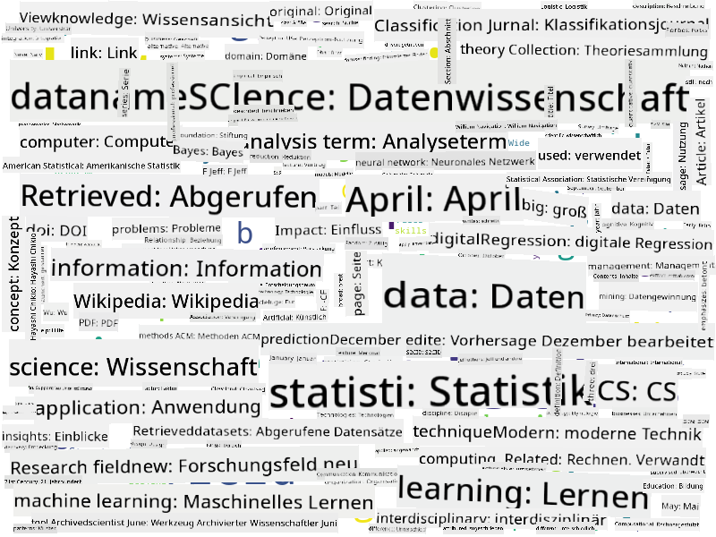

<!--
CO_OP_TRANSLATOR_METADATA:
{
  "original_hash": "2583a9894af7123b2fcae3376b14c035",
  "translation_date": "2025-08-24T21:27:38+00:00",
  "source_file": "1-Introduction/01-defining-data-science/README.md",
  "language_code": "de"
}
-->
## Arten von Daten

Wie bereits erwähnt, sind Daten überall. Wir müssen sie nur auf die richtige Weise erfassen! Es ist hilfreich, zwischen **strukturierten** und **unstrukturierten** Daten zu unterscheiden. Erstere werden typischerweise in einer gut strukturierten Form dargestellt, oft als Tabelle oder mehrere Tabellen, während letztere einfach eine Sammlung von Dateien sind. Manchmal sprechen wir auch von **halbstrukturierten** Daten, die eine gewisse Struktur aufweisen, die jedoch stark variieren kann.

| Strukturiert                                                                | Halbstrukturiert                                                                                 | Unstrukturiert                          |
| ---------------------------------------------------------------------------- | ------------------------------------------------------------------------------------------------ | --------------------------------------- |
| Liste von Personen mit ihren Telefonnummern                                 | Wikipedia-Seiten mit Links                                                                       | Text der Encyclopedia Britannica        |
| Temperatur in allen Räumen eines Gebäudes jede Minute der letzten 20 Jahre  | Sammlung wissenschaftlicher Artikel im JSON-Format mit Autoren, Veröffentlichungsdatum und Abstract | Dateifreigabe mit Unternehmensdokumenten |
| Daten zu Alter und Geschlecht aller Personen, die das Gebäude betreten      | Internetseiten                                                                                   | Rohes Videomaterial von Überwachungskameras |

## Woher man Daten bekommt

Es gibt viele mögliche Quellen für Daten, und es wäre unmöglich, alle aufzuzählen! Dennoch wollen wir einige typische Orte erwähnen, an denen man Daten finden kann:

* **Strukturiert**
  - **Internet der Dinge** (IoT), einschließlich Daten von verschiedenen Sensoren wie Temperatur- oder Drucksensoren, liefert viele nützliche Daten. Zum Beispiel kann ein Bürogebäude mit IoT-Sensoren ausgestattet werden, um Heizung und Beleuchtung automatisch zu steuern und Kosten zu minimieren.
  - **Umfragen**, die wir Nutzer nach einem Kauf oder nach dem Besuch einer Website ausfüllen lassen.
  - **Verhaltensanalysen** können uns beispielsweise helfen zu verstehen, wie tief ein Nutzer in eine Website eintaucht und was der typische Grund für das Verlassen der Seite ist.
* **Unstrukturiert**
  - **Texte** können eine reiche Quelle von Erkenntnissen sein, wie etwa eine allgemeine **Stimmungsbewertung** oder das Extrahieren von Schlüsselwörtern und semantischen Bedeutungen.
  - **Bilder** oder **Videos**. Ein Video von einer Überwachungskamera kann verwendet werden, um den Verkehr auf der Straße zu schätzen und Menschen über mögliche Staus zu informieren.
  - **Protokolle** von Webservern können genutzt werden, um zu verstehen, welche Seiten unserer Website am häufigsten besucht werden und wie lange.
* **Halbstrukturiert**
  - **Soziale Netzwerke** können großartige Datenquellen über Benutzerpersönlichkeiten und die potenzielle Effektivität bei der Verbreitung von Informationen sein.
  - Wenn wir eine Sammlung von Fotos von einer Party haben, können wir versuchen, **Gruppendynamik**-Daten zu extrahieren, indem wir ein Netzwerk von Personen erstellen, die miteinander fotografiert wurden.

Indem man verschiedene mögliche Datenquellen kennt, kann man über verschiedene Szenarien nachdenken, in denen Datenwissenschaftstechniken angewendet werden können, um die Situation besser zu verstehen und Geschäftsprozesse zu verbessern.

## Was man mit Daten machen kann

In der Datenwissenschaft konzentrieren wir uns auf die folgenden Schritte der Datenreise:

Natürlich können je nach den tatsächlichen Daten einige Schritte fehlen (z. B. wenn die Daten bereits in einer Datenbank vorliegen oder wenn kein Modelltraining erforderlich ist), oder einige Schritte können mehrmals wiederholt werden (wie die Datenverarbeitung).

## Digitalisierung und digitale Transformation

In den letzten zehn Jahren haben viele Unternehmen begonnen, die Bedeutung von Daten bei Geschäftsentscheidungen zu erkennen. Um Prinzipien der Datenwissenschaft auf ein Unternehmen anzuwenden, muss zunächst eine Datenerfassung erfolgen, d. h. Geschäftsprozesse müssen in digitale Form übersetzt werden. Dies wird als **Digitalisierung** bezeichnet. Die Anwendung von Datenwissenschaftstechniken auf diese Daten zur Entscheidungsfindung kann zu erheblichen Produktivitätssteigerungen (oder sogar zu einer Neuausrichtung des Geschäfts) führen, was als **digitale Transformation** bezeichnet wird.

Betrachten wir ein Beispiel. Angenommen, wir haben einen Datenwissenschaftskurs (wie diesen hier), den wir online an Studierende vermitteln, und wir möchten Datenwissenschaft nutzen, um ihn zu verbessern. Wie können wir das tun?

Wir könnten damit beginnen, uns zu fragen: "Was kann digitalisiert werden?" Der einfachste Weg wäre, die Zeit zu messen, die jeder Studierende benötigt, um jedes Modul abzuschließen, und das erworbene Wissen durch einen Multiple-Choice-Test am Ende jedes Moduls zu bewerten. Indem wir die Abschlusszeiten aller Studierenden mitteln, können wir herausfinden, welche Module den Studierenden die größten Schwierigkeiten bereiten, und daran arbeiten, sie zu vereinfachen.
Man könnte argumentieren, dass dieser Ansatz nicht ideal ist, da Module unterschiedlich lang sein können. Es wäre wahrscheinlich gerechter, die Zeit durch die Länge des Moduls (in Anzahl der Zeichen) zu teilen und stattdessen diese Werte zu vergleichen.
Wenn wir beginnen, die Ergebnisse von Multiple-Choice-Tests zu analysieren, können wir versuchen herauszufinden, welche Konzepte den Schülern Schwierigkeiten bereiten, und diese Informationen nutzen, um die Inhalte zu verbessern. Dazu müssen wir Tests so gestalten, dass jede Frage einem bestimmten Konzept oder Wissensbereich zugeordnet werden kann.

Wenn wir es noch komplexer machen wollen, können wir die benötigte Zeit für jedes Modul gegen die Alterskategorie der Schüler auftragen. Wir könnten herausfinden, dass es für einige Alterskategorien unangemessen lange dauert, ein Modul abzuschließen, oder dass Schüler abbrechen, bevor sie es beenden. Dies kann uns helfen, Altersempfehlungen für das Modul zu geben und die Unzufriedenheit durch falsche Erwartungen zu minimieren.

## 🚀 Herausforderung

In dieser Herausforderung werden wir versuchen, Konzepte, die für den Bereich der Datenwissenschaft relevant sind, durch die Analyse von Texten zu finden. Wir werden einen Wikipedia-Artikel über Datenwissenschaft nehmen, den Text herunterladen und verarbeiten und dann eine Wortwolke wie diese erstellen:

Besuche [`notebook.ipynb`](../../../../../../../../../1-Introduction/01-defining-data-science/notebook.ipynb ':ignore'), um den Code durchzulesen. Du kannst den Code auch ausführen und sehen, wie er alle Datenumwandlungen in Echtzeit durchführt.

> Wenn du nicht weißt, wie man Code in einem Jupyter Notebook ausführt, schau dir [diesen Artikel](https://soshnikov.com/education/how-to-execute-notebooks-from-github/) an.

## [Quiz nach der Vorlesung](https://purple-hill-04aebfb03.1.azurestaticapps.net/quiz/1)

## Aufgaben

* **Aufgabe 1**: Ändere den obigen Code, um verwandte Konzepte für die Bereiche **Big Data** und **Maschinelles Lernen** zu finden.
* **Aufgabe 2**: [Denke über Szenarien in der Datenwissenschaft nach](assignment.md)

## Credits

Diese Lektion wurde mit ♥️ von [Dmitry Soshnikov](http://soshnikov.com) verfasst.

**Haftungsausschluss**:  
Dieses Dokument wurde mit dem KI-Übersetzungsdienst [Co-op Translator](https://github.com/Azure/co-op-translator) übersetzt. Obwohl wir uns um Genauigkeit bemühen, beachten Sie bitte, dass automatisierte Übersetzungen Fehler oder Ungenauigkeiten enthalten können. Das Originaldokument in seiner ursprünglichen Sprache sollte als maßgebliche Quelle betrachtet werden. Für kritische Informationen wird eine professionelle menschliche Übersetzung empfohlen. Wir übernehmen keine Haftung für Missverständnisse oder Fehlinterpretationen, die sich aus der Nutzung dieser Übersetzung ergeben.