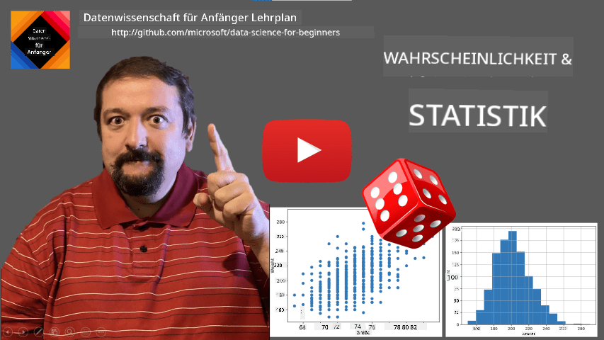
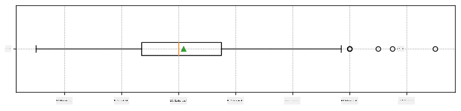
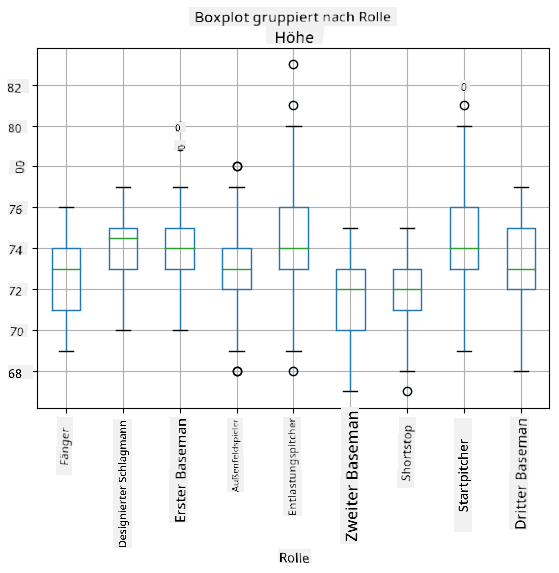
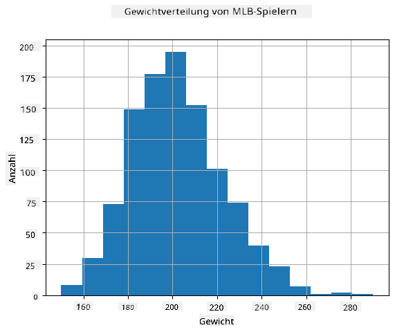
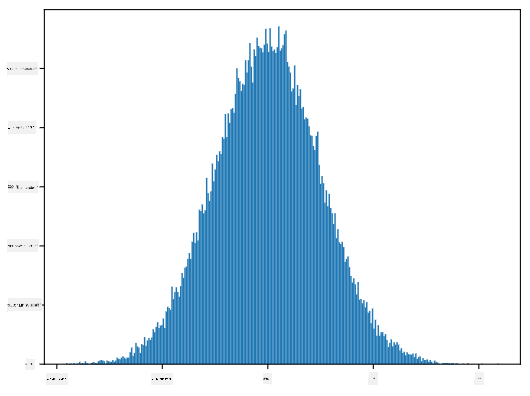
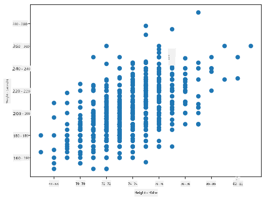

<!--
CO_OP_TRANSLATOR_METADATA:
{
  "original_hash": "8bbb3fa0d4ad61384a3b4b5f7560226f",
  "translation_date": "2025-09-04T14:15:24+00:00",
  "source_file": "1-Introduction/04-stats-and-probability/README.md",
  "language_code": "de"
}
-->
# Eine kurze Einführung in Statistik und Wahrscheinlichkeit

| ](../../sketchnotes/04-Statistics-Probability.png)|
|:---:|
| Statistik und Wahrscheinlichkeit - _Sketchnote von [@nitya](https://twitter.com/nitya)_ |

Statistik und Wahrscheinlichkeitstheorie sind zwei eng miteinander verbundene Bereiche der Mathematik, die für Data Science von großer Bedeutung sind. Es ist möglich, mit Daten zu arbeiten, ohne tiefgehende mathematische Kenntnisse zu haben, aber es ist dennoch besser, zumindest einige grundlegende Konzepte zu kennen. Hier bieten wir eine kurze Einführung, die Ihnen den Einstieg erleichtert.

[](https://youtu.be/Z5Zy85g4Yjw)

## [Quiz vor der Vorlesung](https://purple-hill-04aebfb03.1.azurestaticapps.net/quiz/6)

## Wahrscheinlichkeit und Zufallsvariablen

**Wahrscheinlichkeit** ist eine Zahl zwischen 0 und 1, die angibt, wie wahrscheinlich ein **Ereignis** ist. Sie wird definiert als die Anzahl der positiven Ergebnisse (die zum Ereignis führen), geteilt durch die Gesamtanzahl der Ergebnisse, vorausgesetzt, dass alle Ergebnisse gleich wahrscheinlich sind. Zum Beispiel: Wenn wir einen Würfel werfen, beträgt die Wahrscheinlichkeit, eine gerade Zahl zu erhalten, 3/6 = 0,5.

Wenn wir über Ereignisse sprechen, verwenden wir **Zufallsvariablen**. Zum Beispiel würde die Zufallsvariable, die die Zahl darstellt, die beim Würfeln eines Würfels erhalten wird, Werte von 1 bis 6 annehmen. Die Menge der Zahlen von 1 bis 6 wird als **Stichprobenraum** bezeichnet. Wir können über die Wahrscheinlichkeit sprechen, dass eine Zufallsvariable einen bestimmten Wert annimmt, z. B. P(X=3)=1/6.

Die Zufallsvariable im vorherigen Beispiel wird als **diskret** bezeichnet, da sie einen abzählbaren Stichprobenraum hat, d. h. es gibt separate Werte, die aufgezählt werden können. Es gibt Fälle, in denen der Stichprobenraum ein Bereich von reellen Zahlen oder die gesamte Menge der reellen Zahlen ist. Solche Variablen werden als **kontinuierlich** bezeichnet. Ein gutes Beispiel ist die Ankunftszeit eines Busses.

## Wahrscheinlichkeitsverteilung

Im Fall von diskreten Zufallsvariablen ist es einfach, die Wahrscheinlichkeit jedes Ereignisses durch eine Funktion P(X) zu beschreiben. Für jeden Wert *s* aus dem Stichprobenraum *S* gibt sie eine Zahl zwischen 0 und 1 an, sodass die Summe aller Werte von P(X=s) für alle Ereignisse 1 ergibt.

Die bekannteste diskrete Verteilung ist die **gleichmäßige Verteilung**, bei der es einen Stichprobenraum mit N Elementen gibt, wobei jedes Element die gleiche Wahrscheinlichkeit von 1/N hat.

Es ist schwieriger, die Wahrscheinlichkeitsverteilung einer kontinuierlichen Variablen zu beschreiben, deren Werte aus einem Intervall [a,b] oder der gesamten Menge der reellen Zahlen ℝ stammen. Betrachten Sie den Fall der Ankunftszeit eines Busses. Tatsächlich ist die Wahrscheinlichkeit, dass ein Bus genau zu einer bestimmten Zeit *t* ankommt, gleich 0!

> Jetzt wissen Sie, dass Ereignisse mit einer Wahrscheinlichkeit von 0 passieren – und das sehr oft! Zumindest jedes Mal, wenn der Bus ankommt!

Wir können nur über die Wahrscheinlichkeit sprechen, dass eine Variable in ein bestimmtes Intervall von Werten fällt, z. B. P(t<sub>1</sub>≤X<t<sub>2</sub>). In diesem Fall wird die Wahrscheinlichkeitsverteilung durch eine **Wahrscheinlichkeitsdichtefunktion** p(x) beschrieben, sodass


Ein kontinuierliches Analogon der gleichmäßigen Verteilung wird als **kontinuierlich gleichmäßig** bezeichnet und ist auf ein endliches Intervall definiert. Die Wahrscheinlichkeit, dass der Wert X in ein Intervall der Länge l fällt, ist proportional zu l und steigt bis zu 1.

Eine weitere wichtige Verteilung ist die **Normalverteilung**, über die wir weiter unten ausführlicher sprechen werden.

## Mittelwert, Varianz und Standardabweichung

Angenommen, wir ziehen eine Sequenz von n Stichproben einer Zufallsvariablen X: x<sub>1</sub>, x<sub>2</sub>, ..., x<sub>n</sub>. Wir können den **Mittelwert** (oder **arithmetischen Durchschnitt**) der Sequenz auf traditionelle Weise definieren als (x<sub>1</sub>+x<sub>2</sub>+x<sub>n</sub>)/n. Wenn wir die Größe der Stichprobe erhöhen (d. h. das Limit mit n→∞ nehmen), erhalten wir den Mittelwert (auch **Erwartungswert** genannt) der Verteilung. Wir bezeichnen den Erwartungswert mit **E**(x).

> Es kann gezeigt werden, dass für jede diskrete Verteilung mit Werten {x<sub>1</sub>, x<sub>2</sub>, ..., x<sub>N</sub>} und den entsprechenden Wahrscheinlichkeiten p<sub>1</sub>, p<sub>2</sub>, ..., p<sub>N</sub> der Erwartungswert gleich E(X)=x<sub>1</sub>p<sub>1</sub>+x<sub>2</sub>p<sub>2</sub>+...+x<sub>N</sub>p<sub>N</sub> ist.

Um zu bestimmen, wie weit die Werte gestreut sind, können wir die Varianz σ<sup>2</sup> = ∑(x<sub>i</sub> - μ)<sup>2</sup>/n berechnen, wobei μ der Mittelwert der Sequenz ist. Der Wert σ wird als **Standardabweichung** bezeichnet, und σ<sup>2</sup> wird als **Varianz** bezeichnet.

## Modus, Median und Quartile

Manchmal repräsentiert der Mittelwert nicht angemessen den "typischen" Wert der Daten. Zum Beispiel können einige extreme Werte, die völlig außerhalb des Bereichs liegen, den Mittelwert beeinflussen. Ein weiterer guter Indikator ist der **Median**, ein Wert, bei dem die Hälfte der Datenpunkte niedriger und die andere Hälfte höher ist.

Um die Verteilung der Daten besser zu verstehen, ist es hilfreich, über **Quartile** zu sprechen:

* Erstes Quartil, oder Q1, ist ein Wert, bei dem 25 % der Daten darunter liegen
* Drittes Quartil, oder Q3, ist ein Wert, bei dem 75 % der Daten darunter liegen

Grafisch können wir die Beziehung zwischen Median und Quartilen in einem Diagramm namens **Boxplot** darstellen:


Hier berechnen wir auch den **Interquartilsabstand** IQR=Q3-Q1 und sogenannte **Ausreißer** – Werte, die außerhalb der Grenzen [Q1-1.5*IQR,Q3+1.5*IQR] liegen.

Für eine endliche Verteilung, die eine kleine Anzahl möglicher Werte enthält, ist ein guter "typischer" Wert derjenige, der am häufigsten vorkommt, der sogenannte **Modus**. Er wird häufig auf kategoriale Daten angewendet, wie z. B. Farben. Betrachten Sie eine Situation, in der wir zwei Gruppen von Menschen haben – einige, die stark Rot bevorzugen, und andere, die Blau bevorzugen. Wenn wir Farben durch Zahlen codieren, würde der Mittelwert für eine Lieblingsfarbe irgendwo im orange-grünen Spektrum liegen, was die tatsächliche Präferenz keiner Gruppe widerspiegelt. Der Modus hingegen wäre entweder eine der Farben oder beide Farben, wenn die Anzahl der Personen, die für sie stimmen, gleich ist (in diesem Fall nennen wir die Stichprobe **multimodal**).

## Daten aus der realen Welt

Wenn wir Daten aus dem echten Leben analysieren, sind sie oft keine Zufallsvariablen im eigentlichen Sinne, da wir keine Experimente mit unbekanntem Ergebnis durchführen. Betrachten Sie beispielsweise ein Team von Baseballspielern und deren Körperdaten wie Größe, Gewicht und Alter. Diese Zahlen sind nicht genau zufällig, aber wir können dennoch dieselben mathematischen Konzepte anwenden. Eine Sequenz von Gewichten von Personen kann beispielsweise als eine Sequenz von Werten betrachtet werden, die aus einer Zufallsvariablen gezogen wurden. Unten sehen Sie die Gewichtssequenz tatsächlicher Baseballspieler aus der [Major League Baseball](http://mlb.mlb.com/index.jsp), entnommen aus [diesem Datensatz](http://wiki.stat.ucla.edu/socr/index.php/SOCR_Data_MLB_HeightsWeights) (der Einfachheit halber sind nur die ersten 20 Werte dargestellt):

```
[180.0, 215.0, 210.0, 210.0, 188.0, 176.0, 209.0, 200.0, 231.0, 180.0, 188.0, 180.0, 185.0, 160.0, 180.0, 185.0, 197.0, 189.0, 185.0, 219.0]
```

> **Hinweis**: Um ein Beispiel für die Arbeit mit diesem Datensatz zu sehen, werfen Sie einen Blick auf das [begleitende Notebook](notebook.ipynb). Es gibt auch eine Reihe von Herausforderungen in dieser Lektion, die Sie durch das Hinzufügen von Code zu diesem Notebook abschließen können. Wenn Sie nicht sicher sind, wie man mit Daten arbeitet, machen Sie sich keine Sorgen – wir werden später darauf zurückkommen, wie man mit Python arbeitet. Wenn Sie nicht wissen, wie man Code in Jupyter Notebook ausführt, lesen Sie [diesen Artikel](https://soshnikov.com/education/how-to-execute-notebooks-from-github/).

Hier ist der Boxplot, der Mittelwert, Median und Quartile für unsere Daten zeigt:



Da unsere Daten Informationen über verschiedene Spieler**rollen** enthalten, können wir auch den Boxplot nach Rolle erstellen – dies ermöglicht es uns, eine Vorstellung davon zu bekommen, wie sich die Parameterwerte je nach Rolle unterscheiden. Diesmal betrachten wir die Größe:



Dieses Diagramm deutet darauf hin, dass die Größe von First Basemen im Durchschnitt höher ist als die Größe von Second Basemen. Später in dieser Lektion werden wir lernen, wie wir diese Hypothese formeller testen können und wie wir zeigen können, dass unsere Daten statistisch signifikant sind, um dies zu belegen.

> Wenn wir mit Daten aus der realen Welt arbeiten, gehen wir davon aus, dass alle Datenpunkte Stichproben sind, die aus einer Wahrscheinlichkeitsverteilung gezogen wurden. Diese Annahme ermöglicht es uns, maschinelle Lerntechniken anzuwenden und funktionierende Vorhersagemodelle zu erstellen.

Um zu sehen, wie die Verteilung unserer Daten aussieht, können wir ein Diagramm namens **Histogramm** erstellen. Die X-Achse enthält eine Anzahl verschiedener Gewichtsintervalle (sogenannte **Bins**), und die vertikale Achse zeigt die Anzahl der Male, die unsere Zufallsvariablenstichprobe in einem bestimmten Intervall lag.



Aus diesem Histogramm können Sie sehen, dass alle Werte um einen bestimmten mittleren Gewichtswert zentriert sind und je weiter wir uns von diesem Gewicht entfernen, desto weniger Gewichte dieses Wertes auftreten. Das heißt, es ist sehr unwahrscheinlich, dass das Gewicht eines Baseballspielers stark vom mittleren Gewicht abweicht. Die Varianz der Gewichte zeigt, in welchem Maße sich die Gewichte wahrscheinlich vom Mittelwert unterscheiden.

> Wenn wir die Gewichte anderer Personen, nicht aus der Baseballliga, betrachten, ist die Verteilung wahrscheinlich anders. Die Form der Verteilung bleibt jedoch gleich, aber Mittelwert und Varianz würden sich ändern. Wenn wir unser Modell also auf Baseballspieler trainieren, wird es wahrscheinlich falsche Ergebnisse liefern, wenn es auf Studenten einer Universität angewendet wird, da die zugrunde liegende Verteilung unterschiedlich ist.

## Normalverteilung

Die Verteilung der Gewichte, die wir oben gesehen haben, ist sehr typisch, und viele Messungen aus der realen Welt folgen demselben Verteilungstyp, jedoch mit unterschiedlichem Mittelwert und Varianz. Diese Verteilung wird als **Normalverteilung** bezeichnet und spielt eine sehr wichtige Rolle in der Statistik.

Die Verwendung der Normalverteilung ist eine korrekte Methode, um zufällige Gewichte potenzieller Baseballspieler zu generieren. Sobald wir den mittleren Gewichtswert `mean` und die Standardabweichung `std` kennen, können wir 1000 Gewichtsstichproben auf folgende Weise generieren:
```python
samples = np.random.normal(mean,std,1000)
``` 

Wenn wir das Histogramm der generierten Stichproben zeichnen, sehen wir ein Bild, das dem oben gezeigten sehr ähnlich ist. Und wenn wir die Anzahl der Stichproben und die Anzahl der Bins erhöhen, können wir ein Bild einer Normalverteilung erzeugen, das näher an ideal ist:



*Normalverteilung mit Mittelwert=0 und Standardabweichung=1*

## Konfidenzintervalle

Wenn wir über die Gewichte von Baseballspielern sprechen, gehen wir davon aus, dass es eine bestimmte **Zufallsvariable W** gibt, die der idealen Wahrscheinlichkeitsverteilung der Gewichte aller Baseballspieler entspricht (sogenannte **Population**). Unsere Gewichtssequenz entspricht einer Teilmenge aller Baseballspieler, die wir als **Stichprobe** bezeichnen. Eine interessante Frage ist: Können wir die Parameter der Verteilung von W kennen, d. h. den Mittelwert und die Varianz der Population?

Die einfachste Antwort wäre, den Mittelwert und die Varianz unserer Stichprobe zu berechnen. Es könnte jedoch passieren, dass unsere zufällige Stichprobe die vollständige Population nicht genau repräsentiert. Daher macht es Sinn, über **Konfidenzintervalle** zu sprechen.
> **Konfidenzintervall** ist die Schätzung des wahren Mittelwerts der Grundgesamtheit basierend auf unserer Stichprobe, die mit einer bestimmten Wahrscheinlichkeit (oder einem **Konfidenzniveau**) genau ist.
Angenommen, wir haben eine Stichprobe X<sub>1</sub>, ..., X<sub>n</sub> aus unserer Verteilung. Jedes Mal, wenn wir eine Stichprobe aus unserer Verteilung ziehen, erhalten wir einen anderen Mittelwert μ. Daher kann μ als Zufallsvariable betrachtet werden. Ein **Konfidenzintervall** mit Konfidenz p ist ein Wertepaar (L<sub>p</sub>,R<sub>p</sub>), sodass **P**(L<sub>p</sub>≤μ≤R<sub>p</sub>) = p, d.h. die Wahrscheinlichkeit, dass der gemessene Mittelwert innerhalb des Intervalls liegt, entspricht p.

Es geht über unsere kurze Einführung hinaus, im Detail zu erklären, wie diese Konfidenzintervalle berechnet werden. Weitere Details finden Sie [auf Wikipedia](https://en.wikipedia.org/wiki/Confidence_interval). Kurz gesagt, wir definieren die Verteilung des berechneten Stichprobenmittelwerts relativ zum wahren Mittelwert der Population, die als **Student-Verteilung** bezeichnet wird.

> **Interessante Tatsache**: Die Student-Verteilung ist nach dem Mathematiker William Sealy Gosset benannt, der seine Arbeit unter dem Pseudonym "Student" veröffentlichte. Er arbeitete in der Guinness-Brauerei, und laut einer Version wollte sein Arbeitgeber nicht, dass die Öffentlichkeit erfährt, dass sie statistische Tests zur Bestimmung der Qualität der Rohstoffe verwendeten.

Wenn wir den Mittelwert μ unserer Population mit Konfidenz p schätzen möchten, müssen wir das *(1-p)/2-te Perzentil* einer Student-Verteilung A nehmen, das entweder aus Tabellen entnommen oder mithilfe eingebauter Funktionen statistischer Software (z.B. Python, R usw.) berechnet werden kann. Dann wird das Intervall für μ durch X±A*D/√n gegeben, wobei X der erhaltene Mittelwert der Stichprobe und D die Standardabweichung ist.

> **Hinweis**: Wir lassen auch die Diskussion über ein wichtiges Konzept der [Freiheitsgrade](https://en.wikipedia.org/wiki/Degrees_of_freedom_(statistics)) aus, das im Zusammenhang mit der Student-Verteilung wichtig ist. Sie können auf umfassendere Bücher über Statistik zurückgreifen, um dieses Konzept besser zu verstehen.

Ein Beispiel für die Berechnung des Konfidenzintervalls für Gewichte und Größen finden Sie in den [begleitenden Notebooks](notebook.ipynb).

| p    | Gewichtsmittelwert |
|------|--------------------|
| 0.85 | 201.73±0.94       |
| 0.90 | 201.73±1.08       |
| 0.95 | 201.73±1.28       |

Beachten Sie, dass je höher die Konfidenzwahrscheinlichkeit ist, desto breiter ist das Konfidenzintervall.

## Hypothesentests

In unserem Datensatz der Baseballspieler gibt es verschiedene Spielerrollen, die wie folgt zusammengefasst werden können (sehen Sie sich das [begleitende Notebook](notebook.ipynb) an, um zu sehen, wie diese Tabelle berechnet werden kann):

| Rolle              | Größe       | Gewicht     | Anzahl |
|--------------------|-------------|-------------|--------|
| Catcher           | 72.723684   | 204.328947  | 76     |
| Designated_Hitter | 74.222222   | 220.888889  | 18     |
| First_Baseman     | 74.000000   | 213.109091  | 55     |
| Outfielder        | 73.010309   | 199.113402  | 194    |
| Relief_Pitcher    | 74.374603   | 203.517460  | 315    |
| Second_Baseman    | 71.362069   | 184.344828  | 58     |
| Shortstop         | 71.903846   | 182.923077  | 52     |
| Starting_Pitcher  | 74.719457   | 205.163636  | 221    |
| Third_Baseman     | 73.044444   | 200.955556  | 45     |

Wir können feststellen, dass die durchschnittliche Größe der First Basemen höher ist als die der Second Basemen. Daher könnten wir versucht sein, zu schließen, dass **First Basemen größer sind als Second Basemen**.

> Diese Aussage wird als **Hypothese** bezeichnet, da wir nicht wissen, ob die Tatsache tatsächlich wahr ist oder nicht.

Es ist jedoch nicht immer offensichtlich, ob wir diese Schlussfolgerung ziehen können. Aus der obigen Diskussion wissen wir, dass jeder Mittelwert ein zugehöriges Konfidenzintervall hat, und daher könnte dieser Unterschied nur ein statistischer Fehler sein. Wir benötigen eine formellere Methode, um unsere Hypothese zu testen.

Lassen Sie uns die Konfidenzintervalle separat für die Größen der First und Second Basemen berechnen:

| Konfidenz | First Basemen   | Second Basemen  |
|-----------|-----------------|-----------------|
| 0.85      | 73.62..74.38   | 71.04..71.69    |
| 0.90      | 73.56..74.44   | 70.99..71.73    |
| 0.95      | 73.47..74.53   | 70.92..71.81    |

Wir können sehen, dass die Intervalle unter keiner Konfidenz überlappen. Das beweist unsere Hypothese, dass First Basemen größer sind als Second Basemen.

Formeller gesagt, das Problem, das wir lösen, besteht darin, zu prüfen, ob **zwei Wahrscheinlichkeitsverteilungen gleich sind** oder zumindest die gleichen Parameter haben. Abhängig von der Verteilung müssen wir dafür unterschiedliche Tests verwenden. Wenn wir wissen, dass unsere Verteilungen normal sind, können wir den **[Student t-Test](https://en.wikipedia.org/wiki/Student%27s_t-test)** anwenden.

Im Student t-Test berechnen wir den sogenannten **t-Wert**, der die Differenz zwischen den Mittelwerten unter Berücksichtigung der Varianz angibt. Es wird gezeigt, dass der t-Wert der **Student-Verteilung** folgt, was es uns ermöglicht, den Schwellenwert für ein gegebenes Konfidenzniveau **p** zu erhalten (dies kann berechnet oder in numerischen Tabellen nachgeschlagen werden). Wir vergleichen dann den t-Wert mit diesem Schwellenwert, um die Hypothese zu bestätigen oder abzulehnen.

In Python können wir das **SciPy**-Paket verwenden, das die Funktion `ttest_ind` enthält (zusätzlich zu vielen anderen nützlichen statistischen Funktionen!). Es berechnet den t-Wert für uns und führt auch die Rückwärtssuche des Konfidenz-p-Werts durch, sodass wir nur auf die Konfidenz schauen müssen, um eine Schlussfolgerung zu ziehen.

Zum Beispiel liefert unser Vergleich zwischen den Größen der First und Second Basemen die folgenden Ergebnisse:
```python
from scipy.stats import ttest_ind

tval, pval = ttest_ind(df.loc[df['Role']=='First_Baseman',['Height']], df.loc[df['Role']=='Designated_Hitter',['Height']],equal_var=False)
print(f"T-value = {tval[0]:.2f}\nP-value: {pval[0]}")
```
```
T-value = 7.65
P-value: 9.137321189738925e-12
```
In unserem Fall ist der p-Wert sehr niedrig, was bedeutet, dass es starke Beweise dafür gibt, dass First Basemen größer sind.

Es gibt auch verschiedene andere Arten von Hypothesen, die wir testen möchten, zum Beispiel:
* Um zu beweisen, dass eine gegebene Stichprobe einer bestimmten Verteilung folgt. In unserem Fall haben wir angenommen, dass Größen normal verteilt sind, aber das erfordert eine formale statistische Überprüfung.
* Um zu beweisen, dass der Mittelwert einer Stichprobe einem vordefinierten Wert entspricht.
* Um die Mittelwerte einer Anzahl von Stichproben zu vergleichen (z.B. wie groß ist der Unterschied im Glücksniveau zwischen verschiedenen Altersgruppen).

## Gesetz der großen Zahlen und zentraler Grenzwertsatz

Einer der Gründe, warum die Normalverteilung so wichtig ist, ist der sogenannte **zentrale Grenzwertsatz**. Angenommen, wir haben eine große Stichprobe von unabhängigen N Werten X<sub>1</sub>, ..., X<sub>N</sub>, die aus einer beliebigen Verteilung mit Mittelwert μ und Varianz σ<sup>2</sup> entnommen wurden. Dann, für ausreichend großes N (mit anderen Worten, wenn N→∞), wird der Mittelwert Σ<sub>i</sub>X<sub>i</sub> normal verteilt sein, mit Mittelwert μ und Varianz σ<sup>2</sup>/N.

> Eine andere Möglichkeit, den zentralen Grenzwertsatz zu interpretieren, besteht darin, zu sagen, dass unabhängig von der Verteilung, wenn Sie den Mittelwert einer Summe beliebiger Zufallsvariablen berechnen, Sie am Ende eine Normalverteilung erhalten.

Aus dem zentralen Grenzwertsatz folgt auch, dass, wenn N→∞, die Wahrscheinlichkeit, dass der Stichprobenmittelwert gleich μ ist, 1 wird. Dies ist als **Gesetz der großen Zahlen** bekannt.

## Kovarianz und Korrelation

Eine der Aufgaben der Datenwissenschaft besteht darin, Beziehungen zwischen Daten zu finden. Wir sagen, dass zwei Sequenzen **korrelieren**, wenn sie sich zur gleichen Zeit ähnlich verhalten, d.h. sie steigen/fallen gleichzeitig, oder eine Sequenz steigt, wenn die andere fällt und umgekehrt. Mit anderen Worten, es scheint eine Beziehung zwischen zwei Sequenzen zu geben.

> Korrelation zeigt nicht unbedingt eine kausale Beziehung zwischen zwei Sequenzen an; manchmal können beide Variablen von einer externen Ursache abhängen, oder es kann rein zufällig sein, dass die beiden Sequenzen korrelieren. Eine starke mathematische Korrelation ist jedoch ein guter Hinweis darauf, dass zwei Variablen irgendwie miteinander verbunden sind.

Mathematisch ist das Hauptkonzept, das die Beziehung zwischen zwei Zufallsvariablen zeigt, die **Kovarianz**, die wie folgt berechnet wird: Cov(X,Y) = **E**\[(X-**E**(X))(Y-**E**(Y))\]. Wir berechnen die Abweichung beider Variablen von ihren Mittelwerten und dann das Produkt dieser Abweichungen. Wenn beide Variablen gemeinsam abweichen, ist das Produkt immer ein positiver Wert, der zu einer positiven Kovarianz addiert wird. Wenn beide Variablen nicht synchron abweichen (d.h. eine fällt unter den Durchschnitt, wenn die andere über den Durchschnitt steigt), erhalten wir immer negative Zahlen, die zu einer negativen Kovarianz addiert werden. Wenn die Abweichungen unabhängig sind, summieren sie sich ungefähr zu null.

Der absolute Wert der Kovarianz sagt uns nicht viel darüber aus, wie groß die Korrelation ist, da er von der Größe der tatsächlichen Werte abhängt. Um sie zu normalisieren, können wir die Kovarianz durch die Standardabweichung beider Variablen teilen, um die **Korrelation** zu erhalten. Das Gute daran ist, dass die Korrelation immer im Bereich von [-1,1] liegt, wobei 1 eine starke positive Korrelation zwischen Werten anzeigt, -1 eine starke negative Korrelation und 0 keine Korrelation (Variablen sind unabhängig).

**Beispiel**: Wir können die Korrelation zwischen Gewichten und Größen von Baseballspielern aus dem oben genannten Datensatz berechnen:
```python
print(np.corrcoef(weights,heights))
```
Als Ergebnis erhalten wir eine **Korrelationsmatrix** wie diese:
```
array([[1.        , 0.52959196],
       [0.52959196, 1.        ]])
```

> Die Korrelationsmatrix C kann für jede Anzahl von Eingabesequenzen S<sub>1</sub>, ..., S<sub>n</sub> berechnet werden. Der Wert von C<sub>ij</sub> ist die Korrelation zwischen S<sub>i</sub> und S<sub>j</sub>, und die Diagonalelemente sind immer 1 (was auch die Selbstkorrelation von S<sub>i</sub> ist).

In unserem Fall zeigt der Wert 0.53 an, dass es eine gewisse Korrelation zwischen dem Gewicht und der Größe einer Person gibt. Wir können auch das Streudiagramm eines Wertes gegen den anderen erstellen, um die Beziehung visuell zu sehen:



> Weitere Beispiele für Korrelation und Kovarianz finden Sie im [begleitenden Notebook](notebook.ipynb).

## Fazit

In diesem Abschnitt haben wir gelernt:

* grundlegende statistische Eigenschaften von Daten, wie Mittelwert, Varianz, Modus und Quartile
* verschiedene Verteilungen von Zufallsvariablen, einschließlich der Normalverteilung
* wie man Korrelationen zwischen verschiedenen Eigenschaften findet
* wie man mathematische und statistische Methoden verwendet, um Hypothesen zu beweisen
* wie man Konfidenzintervalle für Zufallsvariablen basierend auf Stichproben berechnet

Obwohl dies definitiv keine vollständige Liste der Themen ist, die innerhalb der Wahrscheinlichkeit und Statistik existieren, sollte es ausreichen, um Ihnen einen guten Einstieg in diesen Kurs zu geben.

## 🚀 Herausforderung

Verwenden Sie den Beispielcode im Notebook, um andere Hypothesen zu testen:
1. First Basemen sind älter als Second Basemen
2. First Basemen sind größer als Third Basemen
3. Shortstops sind größer als Second Basemen

## [Quiz nach der Vorlesung](https://ff-quizzes.netlify.app/en/ds/)

## Überprüfung & Selbststudium

Wahrscheinlichkeit und Statistik ist ein so breites Thema, dass es einen eigenen Kurs verdient. Wenn Sie tiefer in die Theorie eintauchen möchten, können Sie einige der folgenden Bücher lesen:

1. [Carlos Fernandez-Granda](https://cims.nyu.edu/~cfgranda/) von der New York University hat großartige Vorlesungsnotizen [Probability and Statistics for Data Science](https://cims.nyu.edu/~cfgranda/pages/stuff/probability_stats_for_DS.pdf) (online verfügbar)
1. [Peter und Andrew Bruce. Practical Statistics for Data Scientists.](https://www.oreilly.com/library/view/practical-statistics-for/9781491952955/) [[Beispielcode in R](https://github.com/andrewgbruce/statistics-for-data-scientists)].
1. [James D. Miller. Statistics for Data Science](https://www.packtpub.com/product/statistics-for-data-science/9781788290678) [[Beispielcode in R](https://github.com/PacktPublishing/Statistics-for-Data-Science)]

## Aufgabe

[Small Diabetes Study](assignment.md)

## Credits

Diese Lektion wurde mit ♥️ von [Dmitry Soshnikov](http://soshnikov.com) erstellt.

---

**Haftungsausschluss**:  
Dieses Dokument wurde mit dem KI-Übersetzungsdienst [Co-op Translator](https://github.com/Azure/co-op-translator) übersetzt. Obwohl wir uns um Genauigkeit bemühen, beachten Sie bitte, dass automatisierte Übersetzungen Fehler oder Ungenauigkeiten enthalten können. Das Originaldokument in seiner ursprünglichen Sprache sollte als maßgebliche Quelle betrachtet werden. Für kritische Informationen wird eine professionelle menschliche Übersetzung empfohlen. Wir übernehmen keine Haftung für Missverständnisse oder Fehlinterpretationen, die sich aus der Nutzung dieser Übersetzung ergeben.