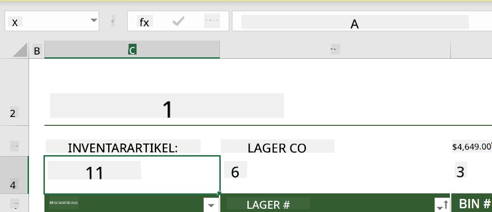
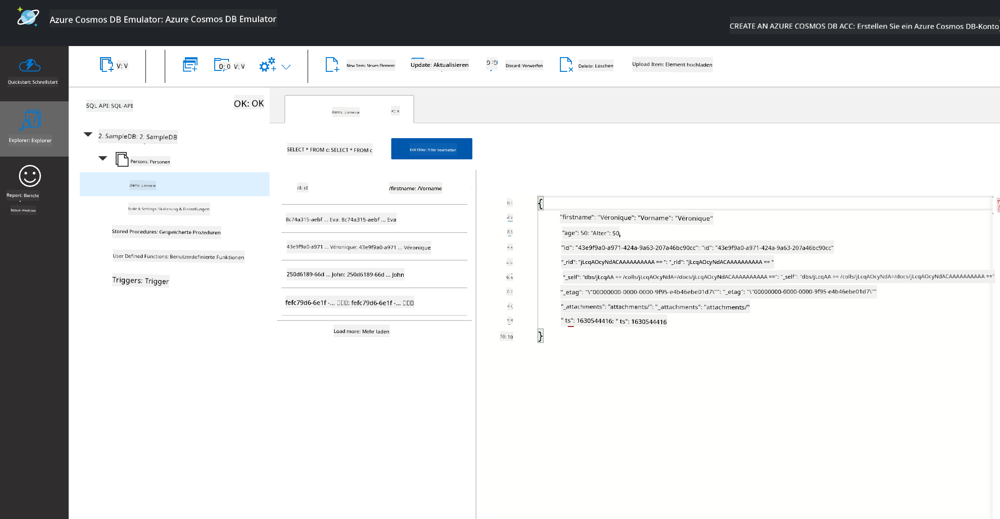

<!--
CO_OP_TRANSLATOR_METADATA:
{
  "original_hash": "54c5a1c74aecb69d2f9099300a4b7eea",
  "translation_date": "2025-09-04T14:07:01+00:00",
  "source_file": "2-Working-With-Data/06-non-relational/README.md",
  "language_code": "de"
}
-->
# Arbeiten mit Daten: Nicht-relationale Daten

| ](../../sketchnotes/06-NoSQL.png)|
|:---:|
|Arbeiten mit NoSQL-Daten - _Sketchnote von [@nitya](https://twitter.com/nitya)_ |

## [Quiz vor der Vorlesung](https://purple-hill-04aebfb03.1.azurestaticapps.net/quiz/10)

Daten sind nicht auf relationale Datenbanken beschränkt. Diese Lektion konzentriert sich auf nicht-relationale Daten und behandelt die Grundlagen von Tabellenkalkulationen und NoSQL.

## Tabellenkalkulationen

Tabellenkalkulationen sind eine beliebte Methode, um Daten zu speichern und zu analysieren, da sie weniger Aufwand für die Einrichtung und den Einstieg erfordern. In dieser Lektion lernen Sie die grundlegenden Bestandteile einer Tabellenkalkulation sowie Formeln und Funktionen kennen. Die Beispiele werden mit Microsoft Excel veranschaulicht, aber die meisten Teile und Themen haben ähnliche Namen und Schritte im Vergleich zu anderer Tabellenkalkulationssoftware.


Eine Tabellenkalkulation ist eine Datei und wird im Dateisystem eines Computers, Geräts oder cloudbasierten Dateisystems zugänglich sein. Die Software selbst kann browserbasiert oder eine Anwendung sein, die auf einem Computer installiert oder als App heruntergeladen werden muss. In Excel werden diese Dateien auch als **Arbeitsmappen** definiert, und diese Terminologie wird im weiteren Verlauf dieser Lektion verwendet.

Eine Arbeitsmappe enthält ein oder mehrere **Arbeitsblätter**, die durch Tabs gekennzeichnet sind. Innerhalb eines Arbeitsblatts befinden sich Rechtecke, die als **Zellen** bezeichnet werden und die eigentlichen Daten enthalten. Eine Zelle ist der Schnittpunkt einer Zeile und einer Spalte, wobei die Spalten mit alphabetischen Zeichen und die Zeilen numerisch gekennzeichnet sind. Einige Tabellenkalkulationen enthalten Kopfzeilen in den ersten Zeilen, um die Daten in einer Zelle zu beschreiben.

Mit diesen grundlegenden Elementen einer Excel-Arbeitsmappe verwenden wir ein Beispiel aus [Microsoft Templates](https://templates.office.com/), das sich auf ein Inventar konzentriert, um einige zusätzliche Teile einer Tabellenkalkulation zu erläutern.

### Verwaltung eines Inventars

Die Tabellenkalkulationsdatei namens "InventoryExample" ist eine formatierte Tabelle von Artikeln innerhalb eines Inventars, die drei Arbeitsblätter enthält, deren Tabs mit "Inventory List", "Inventory Pick List" und "Bin Lookup" beschriftet sind. Zeile 4 des Arbeitsblatts "Inventory List" ist die Kopfzeile, die den Wert jeder Zelle in der Kopfspalte beschreibt.


Es gibt Fälle, in denen der Wert einer Zelle von den Werten anderer Zellen abhängt, um ihren Wert zu generieren. Die Inventarliste-Tabelle verfolgt die Kosten jedes Artikels im Inventar, aber was ist, wenn wir den Gesamtwert des Inventars wissen möchten? [**Formeln**](https://support.microsoft.com/en-us/office/overview-of-formulas-34519a4e-1e8d-4f4b-84d4-d642c4f63263) führen Aktionen auf Zellenwerten aus und werden verwendet, um die Kosten des Inventars in diesem Beispiel zu berechnen. Diese Tabelle verwendet eine Formel in der Spalte "Inventory Value", um den Wert jedes Artikels zu berechnen, indem die Menge unter der Kopfzeile "QTY" und die Kosten unter der Kopfzeile "COST" multipliziert werden. Durch Doppelklicken oder Hervorheben einer Zelle wird die Formel angezeigt. Sie werden feststellen, dass Formeln mit einem Gleichheitszeichen beginnen, gefolgt von der Berechnung oder Operation.



Wir können eine weitere Formel verwenden, um alle Werte der Spalte "Inventory Value" zusammenzuzählen und den Gesamtwert zu erhalten. Dies könnte durch das Addieren jeder Zelle berechnet werden, aber das kann eine mühsame Aufgabe sein. Excel verfügt über [**Funktionen**](https://support.microsoft.com/en-us/office/sum-function-043e1c7d-7726-4e80-8f32-07b23e057f89), oder vordefinierte Formeln, um Berechnungen auf Zellenwerten durchzuführen. Funktionen benötigen Argumente, die die erforderlichen Werte sind, um diese Berechnungen durchzuführen. Wenn Funktionen mehr als ein Argument benötigen, müssen diese in einer bestimmten Reihenfolge aufgelistet werden, sonst berechnet die Funktion möglicherweise nicht den korrekten Wert. Dieses Beispiel verwendet die SUM-Funktion und verwendet die Werte der Spalte "Inventory Value" als Argument, um die Summe zu berechnen, die unter Zeile 3, Spalte B (auch als B3 bezeichnet) aufgeführt ist.

## NoSQL

NoSQL ist ein Sammelbegriff für die verschiedenen Möglichkeiten, nicht-relationale Daten zu speichern, und kann als "non-SQL", "non-relational" oder "not only SQL" interpretiert werden. Diese Art von Datenbanksystemen kann in vier Typen kategorisiert werden.


> Quelle von [Michał Białecki Blog](https://www.michalbialecki.com/2018/03/18/azure-cosmos-db-key-value-database-cloud/)

[Key-Value](https://docs.microsoft.com/en-us/azure/architecture/data-guide/big-data/non-relational-data#keyvalue-data-stores)-Datenbanken verknüpfen eindeutige Schlüssel, die eine eindeutige Kennung darstellen, mit einem Wert. Diese Paare werden mithilfe einer [Hash-Tabelle](https://www.hackerearth.com/practice/data-structures/hash-tables/basics-of-hash-tables/tutorial/) mit einer geeigneten Hash-Funktion gespeichert.


> Quelle von [Microsoft](https://docs.microsoft.com/en-us/azure/cosmos-db/graph/graph-introduction#graph-database-by-example)

[Graph](https://docs.microsoft.com/en-us/azure/architecture/data-guide/big-data/non-relational-data#graph-data-stores)-Datenbanken beschreiben Beziehungen in Daten und werden als Sammlung von Knoten und Kanten dargestellt. Ein Knoten repräsentiert eine Entität, etwas, das in der realen Welt existiert, wie ein Student oder ein Kontoauszug. Kanten repräsentieren die Beziehung zwischen zwei Entitäten. Jeder Knoten und jede Kante hat Eigenschaften, die zusätzliche Informationen über die Knoten und Kanten liefern.


[Spaltenbasierte](https://docs.microsoft.com/en-us/azure/architecture/data-guide/big-data/non-relational-data#columnar-data-stores) Datenspeicher organisieren Daten in Spalten und Zeilen wie eine relationale Datenstruktur, aber jede Spalte ist in Gruppen unterteilt, die als Spaltenfamilie bezeichnet werden, wobei alle Daten unter einer Spalte miteinander verbunden sind und als Einheit abgerufen und geändert werden können.

### Dokumenten-Datenspeicher mit Azure Cosmos DB

[Dokumenten](https://docs.microsoft.com/en-us/azure/architecture/data-guide/big-data/non-relational-data#document-data-stores)-Datenspeicher basieren auf dem Konzept eines Key-Value-Datenspeichers und bestehen aus einer Reihe von Feldern und Objekten. In diesem Abschnitt werden Dokumentendatenbanken mit dem Cosmos DB Emulator untersucht.

Eine Cosmos DB-Datenbank entspricht der Definition von "Not Only SQL", wobei die Dokumentendatenbank von Cosmos DB auf SQL angewiesen ist, um die Daten abzufragen. Die [vorherige Lektion](../05-relational-databases/README.md) über SQL behandelt die Grundlagen der Sprache, und wir können einige der gleichen Abfragen hier auf eine Dokumentendatenbank anwenden. Wir verwenden den Cosmos DB Emulator, der es uns ermöglicht, eine Dokumentendatenbank lokal auf einem Computer zu erstellen und zu erkunden. Lesen Sie mehr über den Emulator [hier](https://docs.microsoft.com/en-us/azure/cosmos-db/local-emulator?tabs=ssl-netstd21).

Ein Dokument ist eine Sammlung von Feldern und Objektwerten, wobei die Felder beschreiben, was der Objektwert darstellt. Unten ist ein Beispiel für ein Dokument.

```json
{
    "firstname": "Eva",
    "age": 44,
    "id": "8c74a315-aebf-4a16-bb38-2430a9896ce5",
    "_rid": "bHwDAPQz8s0BAAAAAAAAAA==",
    "_self": "dbs/bHwDAA==/colls/bHwDAPQz8s0=/docs/bHwDAPQz8s0BAAAAAAAAAA==/",
    "_etag": "\"00000000-0000-0000-9f95-010a691e01d7\"",
    "_attachments": "attachments/",
    "_ts": 1630544034
}
```

Die interessanten Felder in diesem Dokument sind: `firstname`, `id` und `age`. Die restlichen Felder mit den Unterstrichen wurden von Cosmos DB generiert.

#### Daten erkunden mit dem Cosmos DB Emulator

Sie können den Emulator [für Windows hier herunterladen](https://aka.ms/cosmosdb-emulator). Informationen dazu, wie Sie den Emulator für macOS und Linux ausführen können, finden Sie in dieser [Dokumentation](https://docs.microsoft.com/en-us/azure/cosmos-db/local-emulator?tabs=ssl-netstd21#run-on-linux-macos).

Der Emulator öffnet ein Browserfenster, in dem die Explorer-Ansicht es ermöglicht, Dokumente zu erkunden.


Wenn Sie mitmachen, klicken Sie auf "Start with Sample", um eine Beispieldatenbank namens SampleDB zu generieren. Wenn Sie SampleDB erweitern, indem Sie auf den Pfeil klicken, finden Sie einen Container namens `Persons`. Ein Container enthält eine Sammlung von Elementen, die die Dokumente innerhalb des Containers sind. Sie können die vier einzelnen Dokumente unter `Items` erkunden.



#### Dokumentendaten mit dem Cosmos DB Emulator abfragen

Wir können die Beispieldaten auch abfragen, indem wir auf die Schaltfläche "New SQL Query" klicken (zweite Schaltfläche von links).

`SELECT * FROM c` gibt alle Dokumente im Container zurück. Fügen wir eine WHERE-Klausel hinzu und finden alle Personen unter 40 Jahren.

`SELECT * FROM c where c.age < 40`


Die Abfrage gibt zwei Dokumente zurück. Beachten Sie, dass der Alterswert für jedes Dokument kleiner als 40 ist.

#### JSON und Dokumente

Wenn Sie mit JavaScript Object Notation (JSON) vertraut sind, werden Sie feststellen, dass Dokumente ähnlich wie JSON aussehen. Es gibt eine Datei namens `PersonsData.json` in diesem Verzeichnis mit weiteren Daten, die Sie über die Schaltfläche `Upload Item` in den Container `Persons` im Emulator hochladen können.

In den meisten Fällen können APIs, die JSON-Daten zurückgeben, direkt übertragen und in Dokumentendatenbanken gespeichert werden. Unten ist ein weiteres Dokument, das Tweets vom Microsoft Twitter-Konto darstellt, die mithilfe der Twitter-API abgerufen und dann in Cosmos DB eingefügt wurden.

```json
{
    "created_at": "2021-08-31T19:03:01.000Z",
    "id": "1432780985872142341",
    "text": "Blank slate. Like this tweet if you’ve ever painted in Microsoft Paint before. https://t.co/cFeEs8eOPK",
    "_rid": "dhAmAIUsA4oHAAAAAAAAAA==",
    "_self": "dbs/dhAmAA==/colls/dhAmAIUsA4o=/docs/dhAmAIUsA4oHAAAAAAAAAA==/",
    "_etag": "\"00000000-0000-0000-9f84-a0958ad901d7\"",
    "_attachments": "attachments/",
    "_ts": 1630537000
```

Die interessanten Felder in diesem Dokument sind: `created_at`, `id` und `text`.

## 🚀 Herausforderung

Es gibt eine Datei namens `TwitterData.json`, die Sie in die SampleDB-Datenbank hochladen können. Es wird empfohlen, sie in einem separaten Container hinzuzufügen. Dies kann wie folgt durchgeführt werden:

1. Klicken Sie auf die Schaltfläche "New Container" oben rechts.
1. Wählen Sie die bestehende Datenbank (SampleDB) aus und erstellen Sie eine Container-ID für den Container.
1. Setzen Sie den Partition Key auf `/id`.
1. Klicken Sie auf OK (Sie können die restlichen Informationen in dieser Ansicht ignorieren, da es sich um einen kleinen Datensatz handelt, der lokal auf Ihrem Computer läuft).
1. Öffnen Sie Ihren neuen Container und laden Sie die Twitter-Daten-Datei mit der Schaltfläche `Upload Item` hoch.

Versuchen Sie, einige SELECT-Abfragen auszuführen, um die Dokumente zu finden, die Microsoft im Textfeld enthalten. Tipp: Versuchen Sie, das [LIKE-Schlüsselwort](https://docs.microsoft.com/en-us/azure/cosmos-db/sql/sql-query-keywords#using-like-with-the--wildcard-character) zu verwenden.

## [Quiz nach der Vorlesung](https://ff-quizzes.netlify.app/en/ds/)

## Überprüfung & Selbststudium

- Es gibt einige zusätzliche Formatierungen und Funktionen, die zu dieser Tabellenkalkulation hinzugefügt wurden, die in dieser Lektion nicht behandelt werden. Microsoft hat eine [große Bibliothek mit Dokumentationen und Videos](https://support.microsoft.com/excel) zu Excel, falls Sie mehr lernen möchten.

- Diese Architektur-Dokumentation beschreibt die Eigenschaften der verschiedenen Arten von nicht-relationalen Daten: [Nicht-relationale Daten und NoSQL](https://docs.microsoft.com/en-us/azure/architecture/data-guide/big-data/non-relational-data)

- Cosmos DB ist eine cloudbasierte nicht-relationale Datenbank, die auch die verschiedenen NoSQL-Typen speichern kann, die in dieser Lektion erwähnt wurden. Erfahren Sie mehr über diese Typen in diesem [Cosmos DB Microsoft Learn Modul](https://docs.microsoft.com/en-us/learn/paths/work-with-nosql-data-in-azure-cosmos-db/)

## Aufgabe

[Soda Profits](assignment.md)

---

**Haftungsausschluss**:  
Dieses Dokument wurde mithilfe des KI-Übersetzungsdienstes [Co-op Translator](https://github.com/Azure/co-op-translator) übersetzt. Obwohl wir uns um Genauigkeit bemühen, weisen wir darauf hin, dass automatisierte Übersetzungen Fehler oder Ungenauigkeiten enthalten können. Das Originaldokument in seiner ursprünglichen Sprache sollte als maßgebliche Quelle betrachtet werden. Für kritische Informationen wird eine professionelle menschliche Übersetzung empfohlen. Wir übernehmen keine Haftung für Missverständnisse oder Fehlinterpretationen, die aus der Nutzung dieser Übersetzung entstehen.