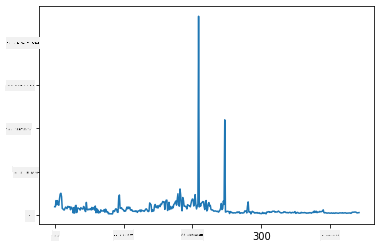
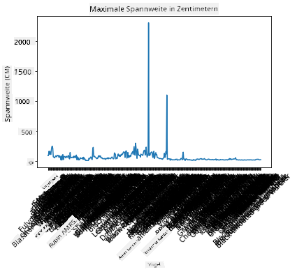
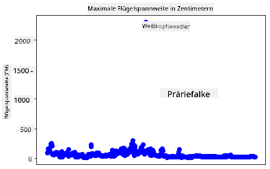
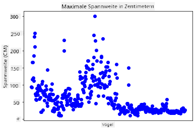
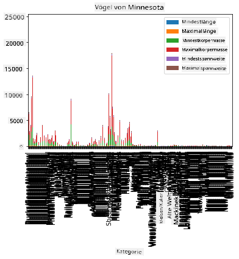
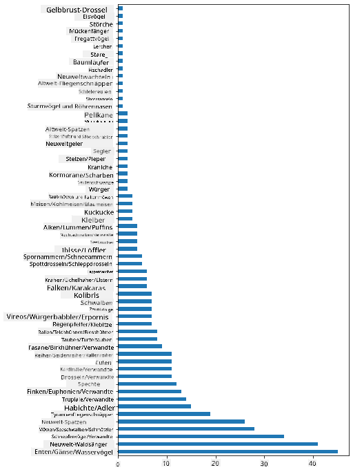
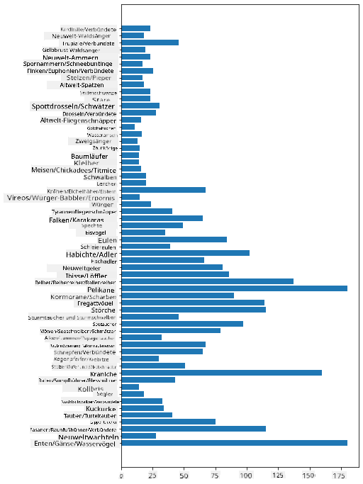
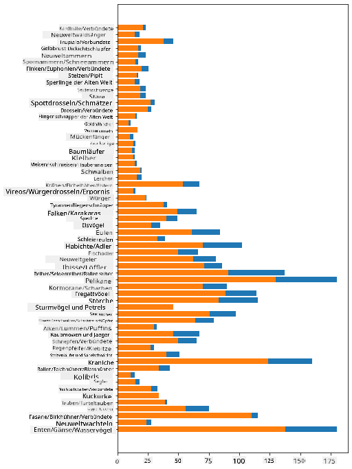

<!--
CO_OP_TRANSLATOR_METADATA:
{
  "original_hash": "69b32b6789a91f796ebc7a02f5575e03",
  "translation_date": "2025-09-04T14:13:07+00:00",
  "source_file": "3-Data-Visualization/09-visualization-quantities/README.md",
  "language_code": "de"
}
-->
# Visualisierung von Mengen

| ](../../sketchnotes/09-Visualizing-Quantities.png)|
|:---:|
| Visualisierung von Mengen - _Sketchnote von [@nitya](https://twitter.com/nitya)_ |

In dieser Lektion wirst du lernen, wie man eine der vielen verfügbaren Python-Bibliotheken verwendet, um interessante Visualisierungen rund um das Konzept der Menge zu erstellen. Mit einem bereinigten Datensatz über die Vögel von Minnesota kannst du viele interessante Fakten über die lokale Tierwelt entdecken.  
## [Quiz vor der Vorlesung](https://purple-hill-04aebfb03.1.azurestaticapps.net/quiz/16)

## Beobachte die Spannweite mit Matplotlib

Eine ausgezeichnete Bibliothek, um sowohl einfache als auch komplexe Diagramme und Grafiken verschiedener Art zu erstellen, ist [Matplotlib](https://matplotlib.org/stable/index.html). Allgemein umfasst der Prozess des Plottens von Daten mit diesen Bibliotheken die Identifikation der Teile deines DataFrames, die du ansprechen möchtest, die Durchführung notwendiger Transformationen dieser Daten, die Zuweisung von x- und y-Achsenwerten, die Entscheidung, welche Art von Diagramm angezeigt werden soll, und schließlich das Anzeigen des Diagramms. Matplotlib bietet eine große Vielfalt an Visualisierungen, aber für diese Lektion konzentrieren wir uns auf die am besten geeigneten für die Visualisierung von Mengen: Liniendiagramme, Streudiagramme und Balkendiagramme.

> ✅ Wähle das Diagramm, das am besten zur Struktur deiner Daten und der Geschichte, die du erzählen möchtest, passt.  
> - Um Trends im Zeitverlauf zu analysieren: Linie  
> - Um Werte zu vergleichen: Balken, Säule, Kreis, Streudiagramm  
> - Um zu zeigen, wie Teile zu einem Ganzen gehören: Kreis  
> - Um die Verteilung von Daten zu zeigen: Streudiagramm, Balken  
> - Um Trends zu zeigen: Linie, Säule  
> - Um Beziehungen zwischen Werten zu zeigen: Linie, Streudiagramm, Blase  

Wenn du einen Datensatz hast und herausfinden möchtest, wie viel von einem bestimmten Element enthalten ist, besteht eine der ersten Aufgaben darin, die Werte zu inspizieren.  

✅ Es gibt sehr gute 'Cheat Sheets' für Matplotlib [hier](https://matplotlib.org/cheatsheets/cheatsheets.pdf).

## Erstelle ein Liniendiagramm über die Spannweitenwerte von Vögeln

Öffne die Datei `notebook.ipynb` im Hauptverzeichnis dieses Lektionenordners und füge eine Zelle hinzu.

> Hinweis: Die Daten befinden sich im Hauptverzeichnis dieses Repos im Ordner `/data`.

```python
import pandas as pd
import matplotlib.pyplot as plt
birds = pd.read_csv('../../data/birds.csv')
birds.head()
```  
Diese Daten sind eine Mischung aus Text und Zahlen:

|      | Name                         | ScientificName         | Category              | Order        | Family   | Genus       | ConservationStatus | MinLength | MaxLength | MinBodyMass | MaxBodyMass | MinWingspan | MaxWingspan |
| ---: | :--------------------------- | :--------------------- | :-------------------- | :----------- | :------- | :---------- | :----------------- | --------: | --------: | ----------: | ----------: | ----------: | ----------: |
|    0 | Black-bellied whistling-duck | Dendrocygna autumnalis | Ducks/Geese/Waterfowl | Anseriformes | Anatidae | Dendrocygna | LC                 |        47 |        56 |         652 |        1020 |          76 |          94 |
|    1 | Fulvous whistling-duck       | Dendrocygna bicolor    | Ducks/Geese/Waterfowl | Anseriformes | Anatidae | Dendrocygna | LC                 |        45 |        53 |         712 |        1050 |          85 |          93 |
|    2 | Snow goose                   | Anser caerulescens     | Ducks/Geese/Waterfowl | Anseriformes | Anatidae | Anser       | LC                 |        64 |        79 |        2050 |        4050 |         135 |         165 |
|    3 | Ross's goose                 | Anser rossii           | Ducks/Geese/Waterfowl | Anseriformes | Anatidae | Anser       | LC                 |      57.3 |        64 |        1066 |        1567 |         113 |         116 |
|    4 | Greater white-fronted goose  | Anser albifrons        | Ducks/Geese/Waterfowl | Anseriformes | Anatidae | Anser       | LC                 |        64 |        81 |        1930 |        3310 |         130 |         165 |

Beginnen wir damit, einige der numerischen Daten mit einem einfachen Liniendiagramm zu plotten. Angenommen, du möchtest die maximale Spannweite dieser interessanten Vögel betrachten.

```python
wingspan = birds['MaxWingspan'] 
wingspan.plot()
```  


Was fällt dir sofort auf? Es scheint mindestens einen Ausreißer zu geben – das ist eine beeindruckende Spannweite! Eine Spannweite von 2300 Zentimetern entspricht 23 Metern – gibt es Pterodaktylen in Minnesota? Lass uns das untersuchen.

Während du in Excel schnell sortieren könntest, um diese Ausreißer zu finden, die wahrscheinlich Tippfehler sind, setze den Visualisierungsprozess fort, indem du direkt im Diagramm arbeitest.

Füge Beschriftungen zur x-Achse hinzu, um zu zeigen, um welche Vogelarten es sich handelt:

```
plt.title('Max Wingspan in Centimeters')
plt.ylabel('Wingspan (CM)')
plt.xlabel('Birds')
plt.xticks(rotation=45)
x = birds['Name'] 
y = birds['MaxWingspan']

plt.plot(x, y)

plt.show()
```  


Selbst mit einer Drehung der Beschriftungen um 45 Grad sind es zu viele, um sie zu lesen. Versuchen wir eine andere Strategie: Beschrifte nur die Ausreißer und platziere die Beschriftungen innerhalb des Diagramms. Du kannst ein Streudiagramm verwenden, um mehr Platz für die Beschriftung zu schaffen:

```python
plt.title('Max Wingspan in Centimeters')
plt.ylabel('Wingspan (CM)')
plt.tick_params(axis='both',which='both',labelbottom=False,bottom=False)

for i in range(len(birds)):
    x = birds['Name'][i]
    y = birds['MaxWingspan'][i]
    plt.plot(x, y, 'bo')
    if birds['MaxWingspan'][i] > 500:
        plt.text(x, y * (1 - 0.05), birds['Name'][i], fontsize=12)
    
plt.show()
```  
Was passiert hier? Du hast `tick_params` verwendet, um die unteren Beschriftungen auszublenden, und dann eine Schleife über deinen Vogel-Datensatz erstellt. Indem du das Diagramm mit kleinen runden blauen Punkten (`bo`) geplottet hast, hast du nach Vögeln mit einer maximalen Spannweite von über 500 gesucht und deren Beschriftung neben dem Punkt angezeigt, falls dies zutraf. Du hast die Beschriftungen auf der y-Achse leicht versetzt (`y * (1 - 0.05)`) und den Vogelnamen als Beschriftung verwendet.

Was hast du entdeckt?

  
## Filtere deine Daten

Sowohl der Weißkopfseeadler als auch der Präriefalke scheinen, obwohl wahrscheinlich sehr große Vögel, falsch beschriftet zu sein, mit einer zusätzlichen `0` in ihrer maximalen Spannweite. Es ist unwahrscheinlich, dass du einem Weißkopfseeadler mit einer Spannweite von 25 Metern begegnest, aber falls doch, lass es uns wissen! Lass uns einen neuen DataFrame ohne diese beiden Ausreißer erstellen:

```python
plt.title('Max Wingspan in Centimeters')
plt.ylabel('Wingspan (CM)')
plt.xlabel('Birds')
plt.tick_params(axis='both',which='both',labelbottom=False,bottom=False)
for i in range(len(birds)):
    x = birds['Name'][i]
    y = birds['MaxWingspan'][i]
    if birds['Name'][i] not in ['Bald eagle', 'Prairie falcon']:
        plt.plot(x, y, 'bo')
plt.show()
```  

Durch das Herausfiltern von Ausreißern sind deine Daten jetzt kohärenter und verständlicher.



Jetzt, da wir einen bereinigten Datensatz zumindest in Bezug auf die Spannweite haben, lass uns mehr über diese Vögel herausfinden.

Während Linien- und Streudiagramme Informationen über Datenwerte und deren Verteilungen anzeigen können, möchten wir über die in diesem Datensatz enthaltenen Werte nachdenken. Du könntest Visualisierungen erstellen, um die folgenden Fragen zur Menge zu beantworten:

> Wie viele Kategorien von Vögeln gibt es und wie viele gibt es in jeder Kategorie?  
> Wie viele Vögel sind ausgestorben, gefährdet, selten oder häufig?  
> Wie viele gibt es von den verschiedenen Gattungen und Ordnungen in der Terminologie von Linnaeus?  
## Erkunde Balkendiagramme

Balkendiagramme sind praktisch, wenn du Gruppierungen von Daten anzeigen möchtest. Lass uns die Kategorien von Vögeln in diesem Datensatz untersuchen, um zu sehen, welche am häufigsten vorkommt.

Erstelle im Notebook eine grundlegende Balkengrafik.

✅ Hinweis: Du kannst entweder die beiden Ausreißer-Vögel, die wir im vorherigen Abschnitt identifiziert haben, herausfiltern, den Tippfehler in ihrer Spannweite korrigieren oder sie für diese Übungen, die nicht von Spannweitenwerten abhängen, beibehalten.

Wenn du ein Balkendiagramm erstellen möchtest, kannst du die Daten auswählen, auf die du dich konzentrieren möchtest. Balkendiagramme können aus Rohdaten erstellt werden:

```python
birds.plot(x='Category',
        kind='bar',
        stacked=True,
        title='Birds of Minnesota')

```  


Dieses Balkendiagramm ist jedoch unleserlich, da es zu viele nicht gruppierte Daten gibt. Du musst nur die Daten auswählen, die du plotten möchtest, also lass uns die Länge der Vögel basierend auf ihrer Kategorie betrachten.

Filtere deine Daten, um nur die Kategorie der Vögel einzuschließen.

✅ Beachte, dass du Pandas verwendest, um die Daten zu verwalten, und dann Matplotlib für die Diagrammerstellung.

Da es viele Kategorien gibt, kannst du dieses Diagramm vertikal anzeigen und seine Höhe anpassen, um alle Daten darzustellen:

```python
category_count = birds.value_counts(birds['Category'].values, sort=True)
plt.rcParams['figure.figsize'] = [6, 12]
category_count.plot.barh()
```  


Dieses Balkendiagramm zeigt eine gute Übersicht über die Anzahl der Vögel in jeder Kategorie. Auf einen Blick siehst du, dass die größte Anzahl von Vögeln in dieser Region zur Kategorie Enten/Gänse/Wasservögel gehört. Minnesota ist das 'Land der 10.000 Seen', daher ist das nicht überraschend!

✅ Probiere einige andere Zählungen in diesem Datensatz aus. Überrascht dich etwas?

## Daten vergleichen

Du kannst verschiedene Vergleiche von gruppierten Daten ausprobieren, indem du neue Achsen erstellst. Versuche einen Vergleich der Maximalen Länge eines Vogels basierend auf seiner Kategorie:

```python
maxlength = birds['MaxLength']
plt.barh(y=birds['Category'], width=maxlength)
plt.rcParams['figure.figsize'] = [6, 12]
plt.show()
```  


Hier überrascht nichts: Kolibris haben die geringste maximale Länge im Vergleich zu Pelikanen oder Gänsen. Es ist gut, wenn Daten logisch erscheinen!

Du kannst interessantere Visualisierungen von Balkendiagrammen erstellen, indem du Daten überlagerst. Lass uns die minimale und maximale Länge einer bestimmten Vogelkategorie überlagern:

```python
minLength = birds['MinLength']
maxLength = birds['MaxLength']
category = birds['Category']

plt.barh(category, maxLength)
plt.barh(category, minLength)

plt.show()
```  
In diesem Diagramm kannst du den Bereich pro Vogelkategorie der minimalen und maximalen Länge sehen. Du kannst sicher sagen, dass laut diesen Daten: Je größer der Vogel, desto größer ist sein Längenbereich. Faszinierend!



## 🚀 Herausforderung

Dieser Vogeldatensatz bietet eine Fülle von Informationen über verschiedene Vogelarten innerhalb eines bestimmten Ökosystems. Suche im Internet nach anderen vogelbezogenen Datensätzen. Übe, Diagramme und Grafiken zu diesen Vögeln zu erstellen, um Fakten zu entdecken, die dir bisher nicht bewusst waren.

## [Quiz nach der Vorlesung](https://ff-quizzes.netlify.app/en/ds/)

## Rückblick & Selbststudium

Diese erste Lektion hat dir einige Informationen darüber gegeben, wie man Matplotlib verwendet, um Mengen zu visualisieren. Recherchiere andere Möglichkeiten, mit Datensätzen für Visualisierungen zu arbeiten. [Plotly](https://github.com/plotly/plotly.py) ist eine, die wir in diesen Lektionen nicht behandeln werden, also schau dir an, was sie zu bieten hat.  
## Aufgabe

[Linien, Streudiagramme und Balken](assignment.md)  

---

**Haftungsausschluss**:  
Dieses Dokument wurde mit dem KI-Übersetzungsdienst [Co-op Translator](https://github.com/Azure/co-op-translator) übersetzt. Obwohl wir uns um Genauigkeit bemühen, beachten Sie bitte, dass automatisierte Übersetzungen Fehler oder Ungenauigkeiten enthalten können. Das Originaldokument in seiner ursprünglichen Sprache sollte als maßgebliche Quelle betrachtet werden. Für kritische Informationen wird eine professionelle menschliche Übersetzung empfohlen. Wir übernehmen keine Haftung für Missverständnisse oder Fehlinterpretationen, die sich aus der Nutzung dieser Übersetzung ergeben.