<!--
CO_OP_TRANSLATOR_METADATA:
{
  "original_hash": "87faccac113d772551486a67a607153e",
  "translation_date": "2025-08-24T22:35:48+00:00",
  "source_file": "3-Data-Visualization/10-visualization-distributions/README.md",
  "language_code": "de"
}
-->
# Visualisierung von Verteilungen

| ](../../sketchnotes/10-Visualizing-Distributions.png)|
|:---:|
| Visualisierung von Verteilungen - _Sketchnote von [@nitya](https://twitter.com/nitya)_ |

Im vorherigen Kapitel hast du einige interessante Fakten über einen Datensatz zu den Vögeln von Minnesota gelernt. Du hast fehlerhafte Daten durch die Visualisierung von Ausreißern entdeckt und die Unterschiede zwischen Vogelkategorien anhand ihrer maximalen Länge betrachtet.

## [Quiz vor der Lektion](https://purple-hill-04aebfb03.1.azurestaticapps.net/quiz/18)
## Erkunde den Vogeldatensatz

Eine weitere Möglichkeit, Daten zu analysieren, besteht darin, ihre Verteilung zu betrachten, also wie die Daten entlang einer Achse organisiert sind. Vielleicht möchtest du beispielsweise die allgemeine Verteilung der maximalen Flügelspannweite oder des maximalen Körpergewichts der Vögel von Minnesota in diesem Datensatz kennenlernen.

Lass uns einige Fakten über die Verteilungen der Daten in diesem Datensatz entdecken. Importiere in der Datei _notebook.ipynb_ im Hauptverzeichnis dieses Kapitelordners Pandas, Matplotlib und deine Daten:

```python
import pandas as pd
import matplotlib.pyplot as plt
birds = pd.read_csv('../../data/birds.csv')
birds.head()
```

|      | Name                         | Wissenschaftlicher Name | Kategorie             | Ordnung      | Familie  | Gattung     | Schutzstatus         | MinLänge | MaxLänge | MinKörpergewicht | MaxKörpergewicht | MinFlügelspannweite | MaxFlügelspannweite |
| ---: | :--------------------------- | :---------------------- | :-------------------- | :----------- | :------- | :---------- | :------------------- | --------: | --------: | ---------------: | ---------------: | ------------------: | ------------------: |
|    0 | Schwarzbauch-Pfeifente       | Dendrocygna autumnalis  | Enten/Gänse/Wasservögel | Anseriformes | Anatidae | Dendrocygna | LC                   |        47 |        56 |             652  |            1020  |                76   |                94   |
|    1 | Fahlpfeifente                | Dendrocygna bicolor     | Enten/Gänse/Wasservögel | Anseriformes | Anatidae | Dendrocygna | LC                   |        45 |        53 |             712  |            1050  |                85   |                93   |
|    2 | Schneegans                   | Anser caerulescens      | Enten/Gänse/Wasservögel | Anseriformes | Anatidae | Anser       | LC                   |        64 |        79 |            2050  |            4050  |               135   |               165   |
|    3 | Zwerggans                    | Anser rossii            | Enten/Gänse/Wasservögel | Anseriformes | Anatidae | Anser       | LC                   |      57.3 |        64 |            1066  |            1567  |               113   |               116   |
|    4 | Blässgans                    | Anser albifrons         | Enten/Gänse/Wasservögel | Anseriformes | Anatidae | Anser       | LC                   |        64 |        81 |            1930  |            3310  |               130   |               165   |

Im Allgemeinen kannst du die Verteilung der Daten schnell mit einem Streudiagramm betrachten, wie wir es im vorherigen Kapitel gemacht haben:

```python
birds.plot(kind='scatter',x='MaxLength',y='Order',figsize=(12,8))

plt.title('Max Length per Order')
plt.ylabel('Order')
plt.xlabel('Max Length')

plt.show()
```
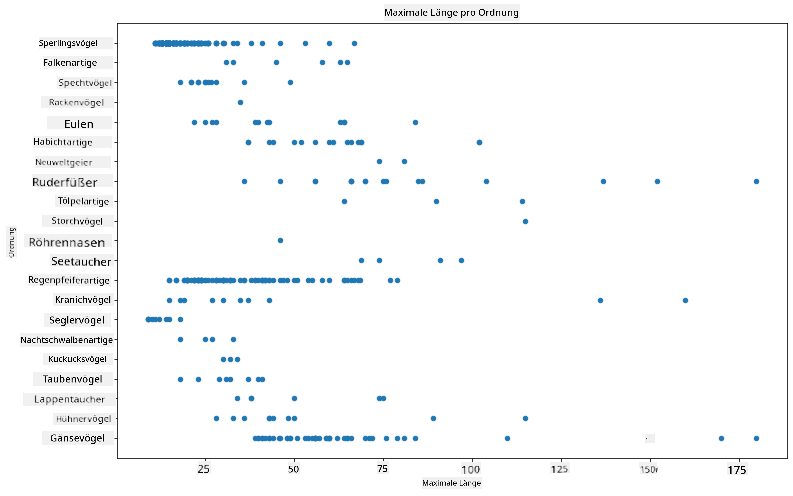

Dies gibt einen Überblick über die allgemeine Verteilung der Körperlänge pro Vogelordnung, ist jedoch nicht die optimale Darstellung für echte Verteilungen. Diese Aufgabe wird normalerweise durch die Erstellung eines Histogramms gelöst.

## Arbeiten mit Histogrammen

Matplotlib bietet sehr gute Möglichkeiten, Datenverteilungen mit Histogrammen zu visualisieren. Diese Art von Diagramm ähnelt einem Balkendiagramm, bei dem die Verteilung durch das Auf und Ab der Balken sichtbar wird. Um ein Histogramm zu erstellen, benötigst du numerische Daten. Um ein Histogramm zu erstellen, kannst du ein Diagramm mit der Art 'hist' für Histogramm zeichnen. Dieses Diagramm zeigt die Verteilung der MaxKörperGewicht-Werte für den gesamten Datensatz. Indem die Daten in kleinere Intervalle (Bins) unterteilt werden, kann die Verteilung der Werte angezeigt werden:

```python
birds['MaxBodyMass'].plot(kind = 'hist', bins = 10, figsize = (12,12))
plt.show()
```
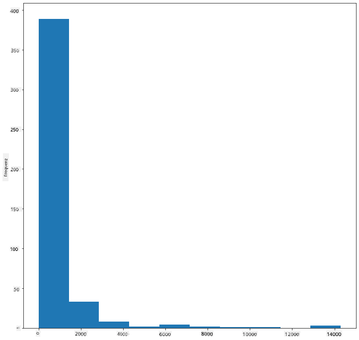

Wie du sehen kannst, fallen die meisten der über 400 Vögel in diesem Datensatz in den Bereich unter 2000 für ihr maximales Körpergewicht. Erhalte mehr Einblicke in die Daten, indem du den `bins`-Parameter auf eine höhere Zahl, beispielsweise 30, änderst:

```python
birds['MaxBodyMass'].plot(kind = 'hist', bins = 30, figsize = (12,12))
plt.show()
```
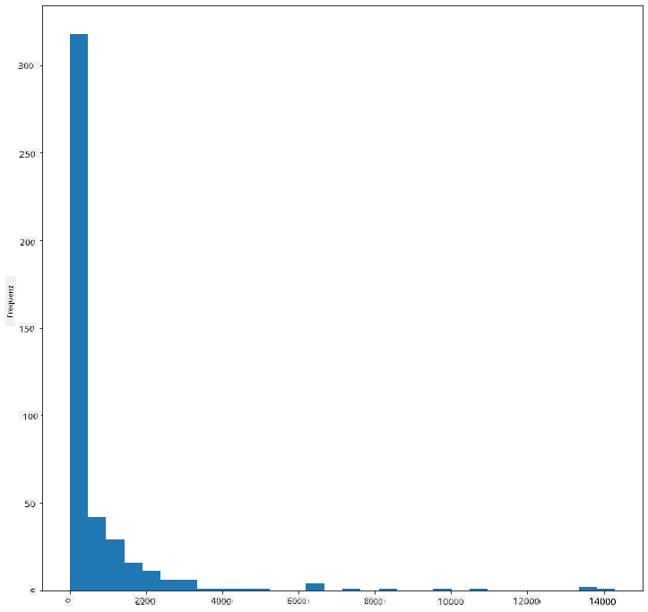

Dieses Diagramm zeigt die Verteilung etwas detaillierter. Ein weniger nach links verzerrtes Diagramm könnte erstellt werden, indem du sicherstellst, dass du nur Daten innerhalb eines bestimmten Bereichs auswählst:

Filtere deine Daten, um nur die Vögel zu erhalten, deren Körpergewicht unter 60 liegt, und zeige 40 `bins`:

```python
filteredBirds = birds[(birds['MaxBodyMass'] > 1) & (birds['MaxBodyMass'] < 60)]      
filteredBirds['MaxBodyMass'].plot(kind = 'hist',bins = 40,figsize = (12,12))
plt.show()     
```
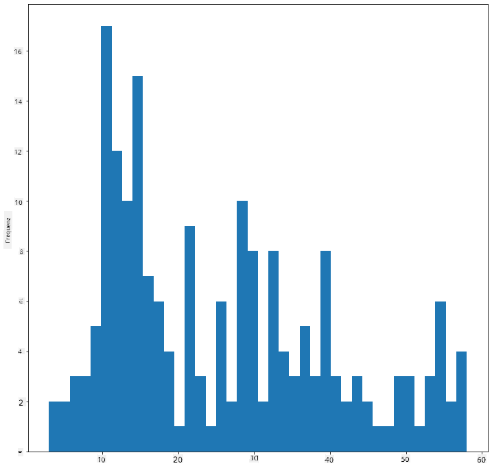

✅ Probiere einige andere Filter und Datenpunkte aus. Um die vollständige Verteilung der Daten zu sehen, entferne den `['MaxBodyMass']`-Filter, um beschriftete Verteilungen anzuzeigen.

Das Histogramm bietet auch einige schöne Farb- und Beschriftungsverbesserungen, die du ausprobieren kannst:

Erstelle ein 2D-Histogramm, um die Beziehung zwischen zwei Verteilungen zu vergleichen. Lass uns `MaxBodyMass` mit `MaxLength` vergleichen. Matplotlib bietet eine integrierte Möglichkeit, Konvergenzen mit helleren Farben anzuzeigen:

```python
x = filteredBirds['MaxBodyMass']
y = filteredBirds['MaxLength']

fig, ax = plt.subplots(tight_layout=True)
hist = ax.hist2d(x, y)
```
Es scheint eine erwartete Korrelation zwischen diesen beiden Elementen entlang einer erwarteten Achse zu geben, mit einem besonders starken Konvergenzpunkt:

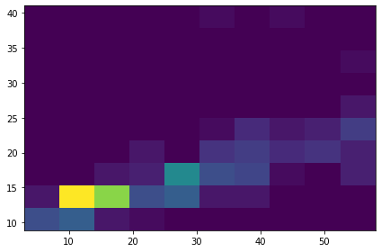

Histogramme funktionieren standardmäßig gut für numerische Daten. Was ist, wenn du Verteilungen basierend auf Textdaten sehen möchtest? 
## Erkunde den Datensatz für Verteilungen basierend auf Textdaten 

Dieser Datensatz enthält auch gute Informationen über die Vogelkategorie sowie deren Gattung, Art und Familie sowie deren Schutzstatus. Lass uns diese Schutzstatusinformationen genauer betrachten. Wie ist die Verteilung der Vögel nach ihrem Schutzstatus?

> ✅ In dem Datensatz werden mehrere Abkürzungen verwendet, um den Schutzstatus zu beschreiben. Diese Abkürzungen stammen aus den [IUCN Red List Categories](https://www.iucnredlist.org/), einer Organisation, die den Status von Arten katalogisiert.
> 
> - CR: Kritisch gefährdet
> - EN: Gefährdet
> - EX: Ausgestorben
> - LC: Nicht gefährdet
> - NT: Potenziell gefährdet
> - VU: Verletzlich

Diese Werte sind textbasiert, daher musst du eine Transformation durchführen, um ein Histogramm zu erstellen. Verwende den gefiltertenBirds-Datenrahmen, um dessen Schutzstatus zusammen mit der minimalen Flügelspannweite anzuzeigen. Was siehst du?

```python
x1 = filteredBirds.loc[filteredBirds.ConservationStatus=='EX', 'MinWingspan']
x2 = filteredBirds.loc[filteredBirds.ConservationStatus=='CR', 'MinWingspan']
x3 = filteredBirds.loc[filteredBirds.ConservationStatus=='EN', 'MinWingspan']
x4 = filteredBirds.loc[filteredBirds.ConservationStatus=='NT', 'MinWingspan']
x5 = filteredBirds.loc[filteredBirds.ConservationStatus=='VU', 'MinWingspan']
x6 = filteredBirds.loc[filteredBirds.ConservationStatus=='LC', 'MinWingspan']

kwargs = dict(alpha=0.5, bins=20)

plt.hist(x1, **kwargs, color='red', label='Extinct')
plt.hist(x2, **kwargs, color='orange', label='Critically Endangered')
plt.hist(x3, **kwargs, color='yellow', label='Endangered')
plt.hist(x4, **kwargs, color='green', label='Near Threatened')
plt.hist(x5, **kwargs, color='blue', label='Vulnerable')
plt.hist(x6, **kwargs, color='gray', label='Least Concern')

plt.gca().set(title='Conservation Status', ylabel='Min Wingspan')
plt.legend();
```

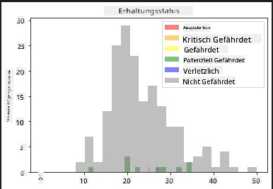

Es scheint keine gute Korrelation zwischen minimaler Flügelspannweite und Schutzstatus zu geben. Teste andere Elemente des Datensatzes mit dieser Methode. Du kannst auch verschiedene Filter ausprobieren. Findest du eine Korrelation?

## Dichte-Diagramme

Du hast vielleicht bemerkt, dass die Histogramme, die wir bisher betrachtet haben, 'gestuft' sind und nicht glatt in einem Bogen verlaufen. Um ein glatteres Dichte-Diagramm zu zeigen, kannst du ein Dichte-Diagramm ausprobieren.

Um mit Dichte-Diagrammen zu arbeiten, solltest du dich mit einer neuen Plot-Bibliothek vertraut machen, [Seaborn](https://seaborn.pydata.org/generated/seaborn.kdeplot.html). 

Lade Seaborn und probiere ein einfaches Dichte-Diagramm aus:

```python
import seaborn as sns
import matplotlib.pyplot as plt
sns.kdeplot(filteredBirds['MinWingspan'])
plt.show()
```
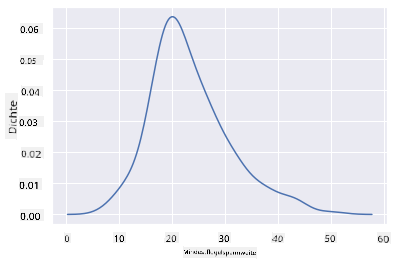

Du kannst sehen, wie das Diagramm das vorherige für die minimale Flügelspannweite widerspiegelt; es ist nur etwas glatter. Laut der Dokumentation von Seaborn "kann KDE im Vergleich zu einem Histogramm ein Diagramm erzeugen, das weniger überladen und besser interpretierbar ist, insbesondere wenn mehrere Verteilungen gezeichnet werden. Es hat jedoch das Potenzial, Verzerrungen einzuführen, wenn die zugrunde liegende Verteilung begrenzt oder nicht glatt ist. Wie bei einem Histogramm hängt die Qualität der Darstellung auch von der Auswahl guter Glättungsparameter ab." [Quelle](https://seaborn.pydata.org/generated/seaborn.kdeplot.html) Mit anderen Worten, Ausreißer werden wie immer deine Diagramme negativ beeinflussen.

Wenn du die gezackte MaxKörperGewicht-Linie im zweiten Diagramm, das du erstellt hast, erneut betrachten möchtest, könntest du sie sehr gut glätten, indem du sie mit dieser Methode neu erstellst:

```python
sns.kdeplot(filteredBirds['MaxBodyMass'])
plt.show()
```
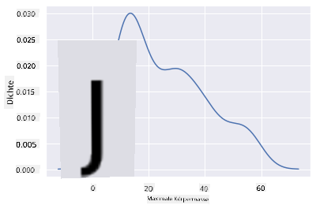

Wenn du eine glatte, aber nicht zu glatte Linie möchtest, bearbeite den `bw_adjust`-Parameter: 

```python
sns.kdeplot(filteredBirds['MaxBodyMass'], bw_adjust=.2)
plt.show()
```
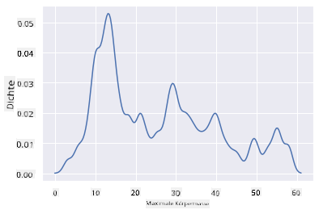

✅ Lies über die verfügbaren Parameter für diese Art von Diagramm und experimentiere!

Diese Art von Diagramm bietet wunderschön erklärende Visualisierungen. Mit wenigen Codezeilen kannst du beispielsweise die Dichte des maximalen Körpergewichts pro Vogelordnung anzeigen:

```python
sns.kdeplot(
   data=filteredBirds, x="MaxBodyMass", hue="Order",
   fill=True, common_norm=False, palette="crest",
   alpha=.5, linewidth=0,
)
```

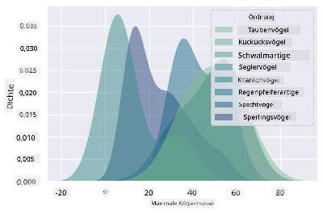

Du kannst auch die Dichte mehrerer Variablen in einem Diagramm abbilden. Teste die maximale und minimale Länge eines Vogels im Vergleich zu seinem Schutzstatus:

```python
sns.kdeplot(data=filteredBirds, x="MinLength", y="MaxLength", hue="ConservationStatus")
```

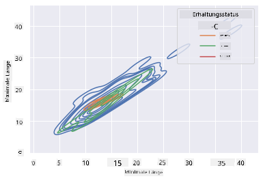

Vielleicht lohnt es sich zu untersuchen, ob die Ansammlung von 'Verletzlichen' Vögeln basierend auf ihrer Länge bedeutungsvoll ist oder nicht.

## 🚀 Herausforderung

Histogramme sind eine anspruchsvollere Art von Diagramm als einfache Streudiagramme, Balkendiagramme oder Liniendiagramme. Suche im Internet nach guten Beispielen für die Verwendung von Histogrammen. Wie werden sie verwendet, was zeigen sie und in welchen Bereichen oder Forschungsgebieten werden sie häufig eingesetzt?

## [Quiz nach der Lektion](https://purple-hill-04aebfb03.1.azurestaticapps.net/quiz/19)

## Rückblick & Selbststudium

In dieser Lektion hast du Matplotlib verwendet und begonnen, mit Seaborn zu arbeiten, um anspruchsvollere Diagramme zu erstellen. Recherchiere über `kdeplot` in Seaborn, eine "kontinuierliche Wahrscheinlichkeitsdichtekurve in einer oder mehreren Dimensionen". Lies die [Dokumentation](https://seaborn.pydata.org/generated/seaborn.kdeplot.html), um zu verstehen, wie es funktioniert.

## Aufgabe

[Wende deine Fähigkeiten an](assignment.md)

**Haftungsausschluss**:  
Dieses Dokument wurde mit dem KI-Übersetzungsdienst [Co-op Translator](https://github.com/Azure/co-op-translator) übersetzt. Obwohl wir uns um Genauigkeit bemühen, beachten Sie bitte, dass automatisierte Übersetzungen Fehler oder Ungenauigkeiten enthalten können. Das Originaldokument in seiner ursprünglichen Sprache sollte als maßgebliche Quelle betrachtet werden. Für kritische Informationen wird eine professionelle menschliche Übersetzung empfohlen. Wir übernehmen keine Haftung für Missverständnisse oder Fehlinterpretationen, die sich aus der Nutzung dieser Übersetzung ergeben.