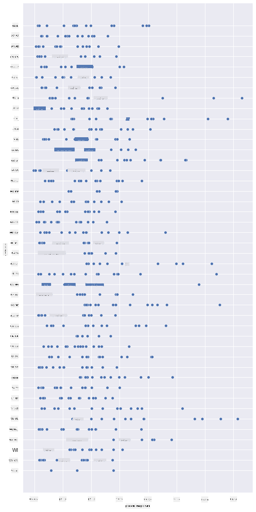
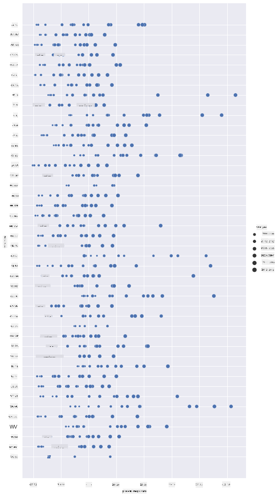
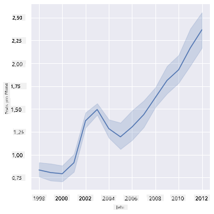
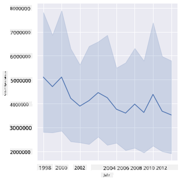
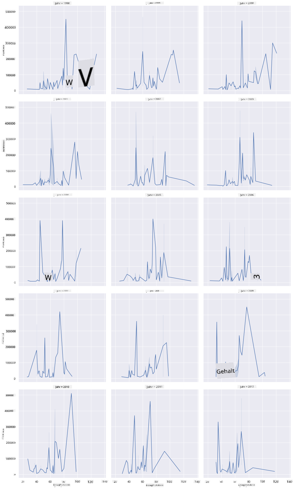
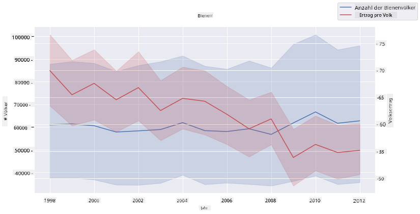

<!--
CO_OP_TRANSLATOR_METADATA:
{
  "original_hash": "0764fd4077f3f04a1d968ec371227744",
  "translation_date": "2025-09-06T11:26:33+00:00",
  "source_file": "3-Data-Visualization/12-visualization-relationships/README.md",
  "language_code": "de"
}
-->
# Beziehungen visualisieren: Alles über Honig 🍯

| ](../../sketchnotes/12-Visualizing-Relationships.png)|
|:---:|
|Beziehungen visualisieren - _Sketchnote von [@nitya](https://twitter.com/nitya)_ |

Im Rahmen unseres naturbezogenen Forschungsfokus entdecken wir interessante Visualisierungen, um die Beziehungen zwischen verschiedenen Honigsorten darzustellen, basierend auf einem Datensatz des [United States Department of Agriculture](https://www.nass.usda.gov/About_NASS/index.php).

Dieser Datensatz mit etwa 600 Einträgen zeigt die Honigproduktion in vielen US-Bundesstaaten. So können Sie beispielsweise die Anzahl der Bienenvölker, den Ertrag pro Volk, die Gesamtproduktion, Lagerbestände, den Preis pro Pfund und den Wert des produzierten Honigs in einem bestimmten Bundesstaat von 1998 bis 2012 betrachten, wobei jede Zeile ein Jahr pro Bundesstaat darstellt.

Es wäre interessant, die Beziehung zwischen der jährlichen Produktion eines Bundesstaates und beispielsweise dem Honigpreis in diesem Bundesstaat zu visualisieren. Alternativ könnten Sie die Beziehung zwischen den Erträgen pro Volk in verschiedenen Bundesstaaten darstellen. Dieser Zeitraum umfasst das verheerende 'CCD' oder 'Colony Collapse Disorder', das erstmals 2006 beobachtet wurde (http://npic.orst.edu/envir/ccd.html), was diesen Datensatz besonders relevant macht. 🐝

## [Quiz vor der Lektion](https://ff-quizzes.netlify.app/en/ds/quiz/22)

In dieser Lektion können Sie Seaborn verwenden, eine Bibliothek, die Sie bereits kennen, um Beziehungen zwischen Variablen zu visualisieren. Besonders interessant ist die Funktion `relplot` von Seaborn, die Streudiagramme und Liniendiagramme ermöglicht, um schnell '[statistische Beziehungen](https://seaborn.pydata.org/tutorial/relational.html?highlight=relationships)' zu visualisieren. Dies hilft Datenwissenschaftlern, besser zu verstehen, wie Variablen miteinander in Beziehung stehen.

## Streudiagramme

Verwenden Sie ein Streudiagramm, um zu zeigen, wie sich der Honigpreis Jahr für Jahr in den einzelnen Bundesstaaten entwickelt hat. Seaborn gruppiert mit `relplot` bequem die Daten der Bundesstaaten und zeigt Datenpunkte sowohl für kategoriale als auch numerische Daten an.

Beginnen wir mit dem Import der Daten und Seaborn:

```python
import pandas as pd
import matplotlib.pyplot as plt
import seaborn as sns
honey = pd.read_csv('../../data/honey.csv')
honey.head()
```
Sie werden feststellen, dass die Honigdaten mehrere interessante Spalten enthalten, darunter Jahr und Preis pro Pfund. Lassen Sie uns diese Daten nach US-Bundesstaat gruppiert erkunden:

| state | numcol | yieldpercol | totalprod | stocks   | priceperlb | prodvalue | year |
| ----- | ------ | ----------- | --------- | -------- | ---------- | --------- | ---- |
| AL    | 16000  | 71          | 1136000   | 159000   | 0.72       | 818000    | 1998 |
| AZ    | 55000  | 60          | 3300000   | 1485000  | 0.64       | 2112000   | 1998 |
| AR    | 53000  | 65          | 3445000   | 1688000  | 0.59       | 2033000   | 1998 |
| CA    | 450000 | 83          | 37350000  | 12326000 | 0.62       | 23157000  | 1998 |
| CO    | 27000  | 72          | 1944000   | 1594000  | 0.7        | 1361000   | 1998 |

Erstellen Sie ein einfaches Streudiagramm, um die Beziehung zwischen dem Preis pro Pfund Honig und seinem Herkunftsbundesstaat darzustellen. Machen Sie die `y`-Achse hoch genug, um alle Bundesstaaten anzuzeigen:

```python
sns.relplot(x="priceperlb", y="state", data=honey, height=15, aspect=.5);
```


Zeigen Sie nun dieselben Daten mit einer honigfarbenen Farbpalette, um zu zeigen, wie sich der Preis im Laufe der Jahre entwickelt. Sie können dies tun, indem Sie einen 'hue'-Parameter hinzufügen, der die Veränderung Jahr für Jahr darstellt:

> ✅ Erfahren Sie mehr über die [Farbpaletten, die Sie in Seaborn verwenden können](https://seaborn.pydata.org/tutorial/color_palettes.html) - probieren Sie ein schönes Regenbogen-Farbschema aus!

```python
sns.relplot(x="priceperlb", y="state", hue="year", palette="YlOrBr", data=honey, height=15, aspect=.5);
```


Mit dieser Farbänderung können Sie deutlich sehen, dass es im Laufe der Jahre eine starke Entwicklung des Honigpreises pro Pfund gibt. Wenn Sie beispielsweise einen Bundesstaat wie Arizona auswählen, können Sie ein Muster von Preissteigerungen Jahr für Jahr mit wenigen Ausnahmen erkennen:

| state | numcol | yieldpercol | totalprod | stocks  | priceperlb | prodvalue | year |
| ----- | ------ | ----------- | --------- | ------- | ---------- | --------- | ---- |
| AZ    | 55000  | 60          | 3300000   | 1485000 | 0.64       | 2112000   | 1998 |
| AZ    | 52000  | 62          | 3224000   | 1548000 | 0.62       | 1999000   | 1999 |
| AZ    | 40000  | 59          | 2360000   | 1322000 | 0.73       | 1723000   | 2000 |
| AZ    | 43000  | 59          | 2537000   | 1142000 | 0.72       | 1827000   | 2001 |
| AZ    | 38000  | 63          | 2394000   | 1197000 | 1.08       | 2586000   | 2002 |
| AZ    | 35000  | 72          | 2520000   | 983000  | 1.34       | 3377000   | 2003 |
| AZ    | 32000  | 55          | 1760000   | 774000  | 1.11       | 1954000   | 2004 |
| AZ    | 36000  | 50          | 1800000   | 720000  | 1.04       | 1872000   | 2005 |
| AZ    | 30000  | 65          | 1950000   | 839000  | 0.91       | 1775000   | 2006 |
| AZ    | 30000  | 64          | 1920000   | 902000  | 1.26       | 2419000   | 2007 |
| AZ    | 25000  | 64          | 1600000   | 336000  | 1.26       | 2016000   | 2008 |
| AZ    | 20000  | 52          | 1040000   | 562000  | 1.45       | 1508000   | 2009 |
| AZ    | 24000  | 77          | 1848000   | 665000  | 1.52       | 2809000   | 2010 |
| AZ    | 23000  | 53          | 1219000   | 427000  | 1.55       | 1889000   | 2011 |
| AZ    | 22000  | 46          | 1012000   | 253000  | 1.79       | 1811000   | 2012 |

Eine andere Möglichkeit, diese Entwicklung zu visualisieren, ist die Verwendung von Größe anstelle von Farbe. Für farbenblinde Benutzer könnte dies eine bessere Option sein. Bearbeiten Sie Ihre Visualisierung, um die Preissteigerung durch eine Zunahme des Punktumfangs darzustellen:

```python
sns.relplot(x="priceperlb", y="state", size="year", data=honey, height=15, aspect=.5);
```
Sie können sehen, wie die Größe der Punkte allmählich zunimmt.



Ist dies ein einfacher Fall von Angebot und Nachfrage? Aufgrund von Faktoren wie Klimawandel und dem Zusammenbruch von Bienenvölkern gibt es Jahr für Jahr weniger Honig zu kaufen, und daher steigen die Preise?

Um eine Korrelation zwischen einigen der Variablen in diesem Datensatz zu entdecken, lassen Sie uns einige Liniendiagramme erkunden.

## Liniendiagramme

Frage: Gibt es einen klaren Anstieg des Honigpreises pro Pfund Jahr für Jahr? Dies können Sie am einfachsten durch ein einzelnes Liniendiagramm herausfinden:

```python
sns.relplot(x="year", y="priceperlb", kind="line", data=honey);
```
Antwort: Ja, mit einigen Ausnahmen um das Jahr 2003:



✅ Da Seaborn die Daten um eine Linie aggregiert, zeigt es "die mehrfachen Messungen bei jedem x-Wert, indem es den Mittelwert und das 95%-Konfidenzintervall um den Mittelwert herum darstellt". [Quelle](https://seaborn.pydata.org/tutorial/relational.html). Dieses zeitaufwändige Verhalten kann durch Hinzufügen von `ci=None` deaktiviert werden.

Frage: Nun, können wir im Jahr 2003 auch einen Anstieg des Honigangebots sehen? Was passiert, wenn Sie die Gesamtproduktion Jahr für Jahr betrachten?

```python
sns.relplot(x="year", y="totalprod", kind="line", data=honey);
```



Antwort: Nicht wirklich. Wenn Sie die Gesamtproduktion betrachten, scheint sie in diesem Jahr tatsächlich gestiegen zu sein, obwohl die Honigproduktion im Allgemeinen in diesen Jahren rückläufig ist.

Frage: In diesem Fall, was könnte den Preisanstieg von Honig um das Jahr 2003 verursacht haben?

Um dies herauszufinden, können Sie ein Facet Grid erkunden.

## Facet Grids

Facet Grids nehmen eine Facette Ihres Datensatzes (in unserem Fall können Sie 'Jahr' wählen, um zu vermeiden, dass zu viele Facetten erstellt werden). Seaborn kann dann für jede dieser Facetten Ihrer gewählten x- und y-Koordinaten eine Grafik erstellen, um den Vergleich zu erleichtern. Fällt das Jahr 2003 in diesem Vergleich auf?

Erstellen Sie ein Facet Grid, indem Sie weiterhin `relplot` verwenden, wie in der [Seaborn-Dokumentation](https://seaborn.pydata.org/generated/seaborn.FacetGrid.html?highlight=facetgrid#seaborn.FacetGrid) empfohlen.

```python
sns.relplot(
    data=honey, 
    x="yieldpercol", y="numcol",
    col="year", 
    col_wrap=3,
    kind="line"
    )
```
In dieser Visualisierung können Sie den Ertrag pro Volk und die Anzahl der Bienenvölker Jahr für Jahr nebeneinander vergleichen, mit einer Wrap-Einstellung von 3 für die Spalten:



Für diesen Datensatz fällt nichts Besonderes in Bezug auf die Anzahl der Bienenvölker und deren Ertrag Jahr für Jahr und Bundesstaat für Bundesstaat auf. Gibt es eine andere Möglichkeit, eine Korrelation zwischen diesen beiden Variablen zu finden?

## Dual-Line-Diagramme

Versuchen Sie ein Multiline-Diagramm, indem Sie zwei Liniendiagramme übereinander legen, Seaborns 'despine' verwenden, um die oberen und rechten Achsen zu entfernen, und `ax.twinx` [abgeleitet von Matplotlib](https://matplotlib.org/stable/api/_as_gen/matplotlib.axes.Axes.twinx.html) verwenden. Twinx ermöglicht es einem Diagramm, die x-Achse zu teilen und zwei y-Achsen anzuzeigen. Zeigen Sie den Ertrag pro Volk und die Anzahl der Bienenvölker übereinandergelegt an:

```python
fig, ax = plt.subplots(figsize=(12,6))
lineplot = sns.lineplot(x=honey['year'], y=honey['numcol'], data=honey, 
                        label = 'Number of bee colonies', legend=False)
sns.despine()
plt.ylabel('# colonies')
plt.title('Honey Production Year over Year');

ax2 = ax.twinx()
lineplot2 = sns.lineplot(x=honey['year'], y=honey['yieldpercol'], ax=ax2, color="r", 
                         label ='Yield per colony', legend=False) 
sns.despine(right=False)
plt.ylabel('colony yield')
ax.figure.legend();
```


Während nichts um das Jahr 2003 besonders auffällt, können wir diese Lektion mit einer etwas erfreulicheren Note abschließen: Obwohl die Anzahl der Bienenvölker insgesamt abnimmt, stabilisiert sich die Anzahl der Bienenvölker, auch wenn ihr Ertrag pro Volk sinkt.

Go, bees, go!

🐝❤️
## 🚀 Herausforderung

In dieser Lektion haben Sie mehr über andere Anwendungen von Streudiagrammen und Liniendiagrammen, einschließlich Facet Grids, gelernt. Fordern Sie sich selbst heraus, ein Facet Grid mit einem anderen Datensatz zu erstellen, vielleicht einem, den Sie vor diesen Lektionen verwendet haben. Beachten Sie, wie lange sie zur Erstellung benötigen und wie Sie darauf achten müssen, wie viele Grids Sie mit diesen Techniken zeichnen.

## [Quiz nach der Lektion](https://ff-quizzes.netlify.app/en/ds/quiz/23)

## Überprüfung & Selbststudium

Liniendiagramme können einfach oder ziemlich komplex sein. Lesen Sie ein wenig in der [Seaborn-Dokumentation](https://seaborn.pydata.org/generated/seaborn.lineplot.html) über die verschiedenen Möglichkeiten, wie Sie sie erstellen können. Versuchen Sie, die Liniendiagramme, die Sie in dieser Lektion erstellt haben, mit anderen in den Dokumenten aufgeführten Methoden zu verbessern.
## Aufgabe

[Tauchen Sie in den Bienenstock ein](assignment.md)

---

**Haftungsausschluss**:  
Dieses Dokument wurde mit dem KI-Übersetzungsdienst [Co-op Translator](https://github.com/Azure/co-op-translator) übersetzt. Obwohl wir uns um Genauigkeit bemühen, beachten Sie bitte, dass automatisierte Übersetzungen Fehler oder Ungenauigkeiten enthalten können. Das Originaldokument in seiner ursprünglichen Sprache sollte als maßgebliche Quelle betrachtet werden. Für kritische Informationen wird eine professionelle menschliche Übersetzung empfohlen. Wir übernehmen keine Haftung für Missverständnisse oder Fehlinterpretationen, die sich aus der Nutzung dieser Übersetzung ergeben.