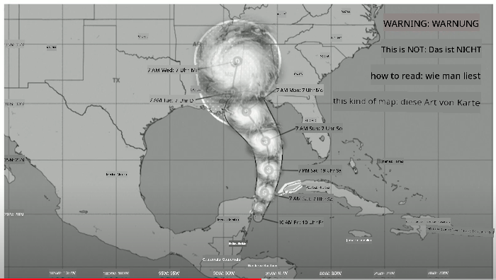
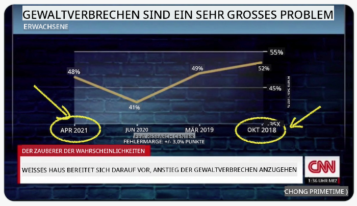
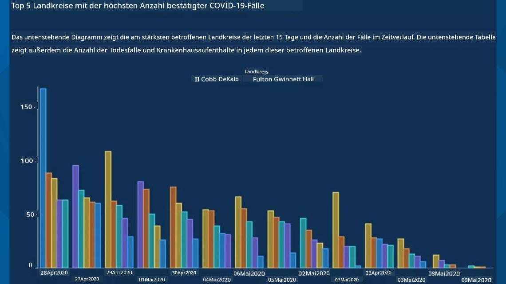
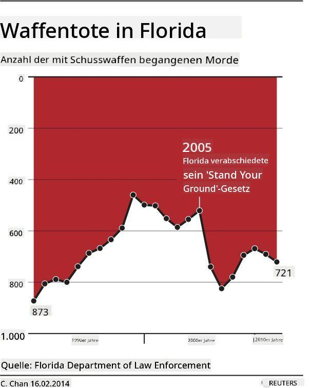
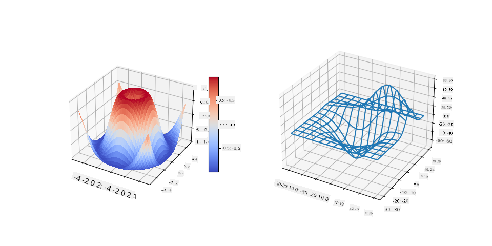
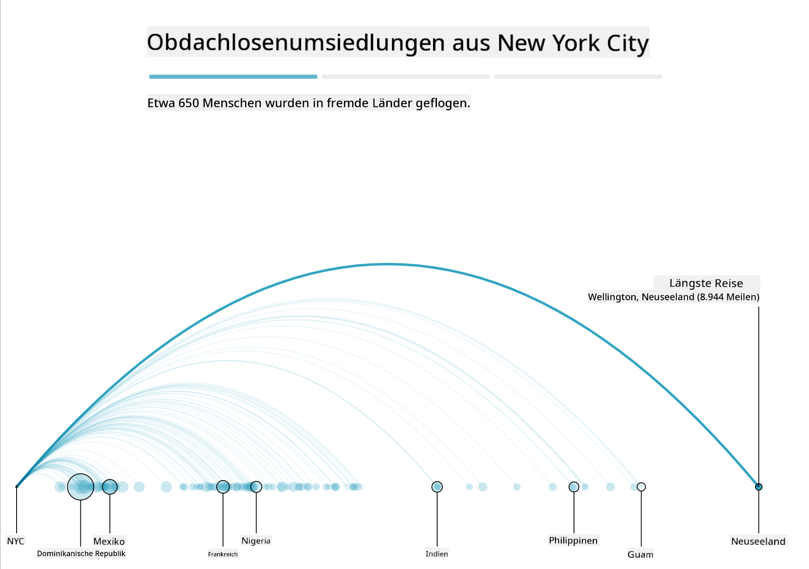
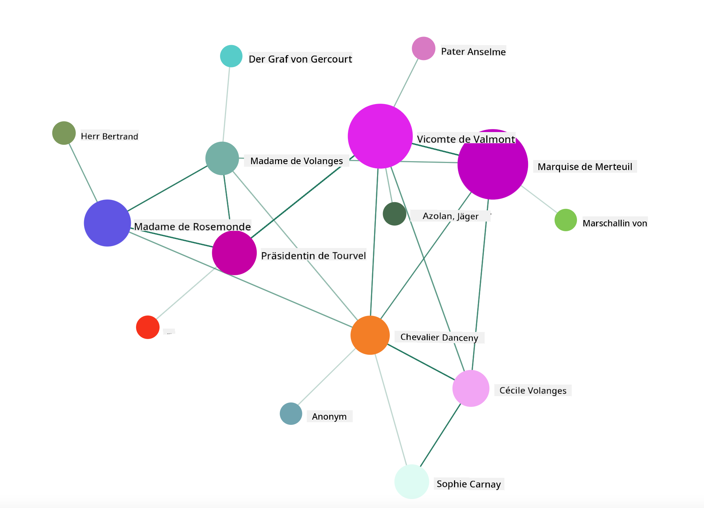

<!--
CO_OP_TRANSLATOR_METADATA:
{
  "original_hash": "0b380bb6d34102bb061eb41de23d9834",
  "translation_date": "2025-09-04T14:13:36+00:00",
  "source_file": "3-Data-Visualization/13-meaningful-visualizations/README.md",
  "language_code": "de"
}
-->
# Sinnvolle Visualisierungen erstellen

| ](../../sketchnotes/13-MeaningfulViz.png)|
|:---:|
| Sinnvolle Visualisierungen - _Sketchnote von [@nitya](https://twitter.com/nitya)_ |

> "Wenn man Daten lange genug quält, gestehen sie alles." -- [Ronald Coase](https://en.wikiquote.org/wiki/Ronald_Coase)

Eine der grundlegenden Fähigkeiten eines Data Scientists ist die Fähigkeit, eine sinnvolle Datenvisualisierung zu erstellen, die hilft, Fragen zu beantworten. Bevor Sie Ihre Daten visualisieren, müssen Sie sicherstellen, dass sie bereinigt und vorbereitet wurden, wie Sie es in den vorherigen Lektionen getan haben. Danach können Sie entscheiden, wie Sie die Daten am besten präsentieren.

In dieser Lektion werden Sie Folgendes lernen:

1. Wie man den richtigen Diagrammtyp auswählt
2. Wie man irreführende Diagramme vermeidet
3. Wie man mit Farben arbeitet
4. Wie man Diagramme für bessere Lesbarkeit gestaltet
5. Wie man animierte oder 3D-Diagrammlösungen erstellt
6. Wie man kreative Visualisierungen entwickelt

## [Quiz vor der Lektion](https://purple-hill-04aebfb03.1.azurestaticapps.net/quiz/24)

## Den richtigen Diagrammtyp auswählen

In den vorherigen Lektionen haben Sie mit Matplotlib und Seaborn verschiedene interessante Datenvisualisierungen erstellt. Im Allgemeinen können Sie den [richtigen Diagrammtyp](https://chartio.com/learn/charts/how-to-select-a-data-vizualization/) für Ihre Fragestellung anhand dieser Tabelle auswählen:

| Sie möchten:               | Sie sollten verwenden:          |
| -------------------------- | ------------------------------- |
| Datenverläufe über Zeit zeigen | Linie                         |
| Kategorien vergleichen      | Balken, Kreisdiagramm           |
| Summen vergleichen          | Kreisdiagramm, gestapelter Balken |
| Beziehungen zeigen          | Streuung, Linie, Facette, doppelte Linie |
| Verteilungen zeigen         | Streuung, Histogramm, Boxplot   |
| Proportionen zeigen         | Kreisdiagramm, Donut, Waffeldiagramm |

> ✅ Je nach Zusammensetzung Ihrer Daten müssen Sie diese möglicherweise von Text in numerische Werte umwandeln, damit ein bestimmtes Diagramm unterstützt wird.

## Täuschung vermeiden

Selbst wenn ein Data Scientist sorgfältig den richtigen Diagrammtyp für die richtigen Daten auswählt, gibt es viele Möglichkeiten, wie Daten so dargestellt werden können, dass sie eine bestimmte Aussage unterstützen, oft auf Kosten der Datenintegrität. Es gibt viele Beispiele für irreführende Diagramme und Infografiken!

[](https://www.youtube.com/watch?v=oX74Nge8Wkw "How charts lie")

> 🎥 Klicken Sie auf das Bild oben für einen Vortrag über irreführende Diagramme

Dieses Diagramm kehrt die X-Achse um, um das Gegenteil der Wahrheit basierend auf dem Datum zu zeigen:



[Dieses Diagramm](https://media.firstcoastnews.com/assets/WTLV/images/170ae16f-4643-438f-b689-50d66ca6a8d8/170ae16f-4643-438f-b689-50d66ca6a8d8_1140x641.jpg) ist noch irreführender, da der Blick nach rechts gelenkt wird, um zu schließen, dass die COVID-Fälle in den verschiedenen Bezirken im Laufe der Zeit zurückgegangen sind. Tatsächlich wurden die Daten jedoch so umgeordnet, dass ein täuschender Abwärtstrend entsteht.



Dieses berüchtigte Beispiel verwendet Farbe UND eine umgekehrte Y-Achse, um zu täuschen: Statt zu zeigen, dass die Zahl der Waffentoten nach der Verabschiedung waffenfreundlicher Gesetze gestiegen ist, wird der Betrachter getäuscht, das Gegenteil zu glauben:



Dieses seltsame Diagramm zeigt, wie Proportionen manipuliert werden können, mit komischem Effekt:


Das Vergleichen von Unvergleichbarem ist ein weiterer fragwürdiger Trick. Es gibt eine [wunderbare Website](https://tylervigen.com/spurious-correlations), die 'spurious correlations' zeigt, also 'Fakten', die Dinge wie die Scheidungsrate in Maine und den Margarineverbrauch korrelieren. Eine Reddit-Gruppe sammelt auch die [hässlichen Anwendungen](https://www.reddit.com/r/dataisugly/top/?t=all) von Daten.

Es ist wichtig zu verstehen, wie leicht das Auge durch irreführende Diagramme getäuscht werden kann. Selbst wenn die Absicht des Data Scientists gut ist, kann die Wahl eines schlechten Diagrammtyps, wie eines Kreisdiagramms mit zu vielen Kategorien, täuschend sein.

## Farbe

Wie im 'Florida gun violence'-Diagramm oben gesehen, kann Farbe eine zusätzliche Bedeutungsebene zu Diagrammen hinzufügen, insbesondere bei solchen, die nicht mit Bibliotheken wie Matplotlib und Seaborn erstellt wurden, die verschiedene geprüfte Farbpaletten enthalten. Wenn Sie ein Diagramm von Hand erstellen, sollten Sie sich ein wenig mit [Farblehre](https://colormatters.com/color-and-design/basic-color-theory) beschäftigen.

> ✅ Beachten Sie bei der Gestaltung von Diagrammen, dass Barrierefreiheit ein wichtiger Aspekt der Visualisierung ist. Einige Ihrer Nutzer könnten farbenblind sein - wird Ihr Diagramm für Nutzer mit Sehbehinderungen gut angezeigt?

Seien Sie vorsichtig bei der Auswahl von Farben für Ihr Diagramm, da Farben Bedeutungen vermitteln können, die Sie möglicherweise nicht beabsichtigen. Die 'pink ladies' im 'Höhen'-Diagramm oben vermitteln eine deutlich 'feminine' zugeschriebene Bedeutung, die zur Absurdität des Diagramms beiträgt.

Während [Farbbedeutungen](https://colormatters.com/color-symbolism/the-meanings-of-colors) in verschiedenen Teilen der Welt unterschiedlich sein können und je nach Farbton variieren, umfassen allgemeine Farbbedeutungen:

| Farbe  | Bedeutung            |
| ------ | -------------------- |
| rot    | Macht                |
| blau   | Vertrauen, Loyalität |
| gelb   | Glück, Vorsicht      |
| grün   | Ökologie, Glück, Neid|
| lila   | Freude               |
| orange | Lebendigkeit         |

Wenn Sie beauftragt werden, ein Diagramm mit benutzerdefinierten Farben zu erstellen, stellen Sie sicher, dass Ihre Diagramme sowohl barrierefrei sind als auch die Farben mit der beabsichtigten Bedeutung übereinstimmen.

## Diagramme für bessere Lesbarkeit gestalten

Diagramme sind nicht sinnvoll, wenn sie nicht lesbar sind! Nehmen Sie sich einen Moment Zeit, um die Breite und Höhe Ihres Diagramms so zu gestalten, dass es gut zu Ihren Daten passt. Wenn eine Variable (wie alle 50 Bundesstaaten) angezeigt werden muss, stellen Sie sie möglichst vertikal auf der Y-Achse dar, um ein horizontal scrollendes Diagramm zu vermeiden.

Beschriften Sie Ihre Achsen, stellen Sie bei Bedarf eine Legende bereit und bieten Sie Tooltips für ein besseres Verständnis der Daten.

Wenn Ihre Daten textlastig und ausführlich auf der X-Achse sind, können Sie den Text für bessere Lesbarkeit anwinkeln. [Matplotlib](https://matplotlib.org/stable/tutorials/toolkits/mplot3d.html) bietet 3D-Diagramme, wenn Ihre Daten dies unterstützen. Mit `mpl_toolkits.mplot3d` können anspruchsvolle Datenvisualisierungen erstellt werden.



## Animation und 3D-Diagrammdarstellung

Einige der besten Datenvisualisierungen heutzutage sind animiert. Shirley Wu hat erstaunliche Visualisierungen mit D3 erstellt, wie '[film flowers](http://bl.ocks.org/sxywu/raw/d612c6c653fb8b4d7ff3d422be164a5d/)', bei denen jede Blume eine Visualisierung eines Films darstellt. Ein weiteres Beispiel für den Guardian ist 'bussed out', eine interaktive Erfahrung, die Visualisierungen mit Greensock und D3 sowie ein Scrollytelling-Artikelformat kombiniert, um zu zeigen, wie NYC mit seinem Obdachlosenproblem umgeht, indem Menschen aus der Stadt herausgebracht werden.



> "Bussed Out: How America Moves its Homeless" vom [Guardian](https://www.theguardian.com/us-news/ng-interactive/2017/dec/20/bussed-out-america-moves-homeless-people-country-study). Visualisierungen von Nadieh Bremer & Shirley Wu

Obwohl diese Lektion nicht ausreicht, um diese leistungsstarken Visualisierungsbibliotheken im Detail zu lehren, versuchen Sie sich an D3 in einer Vue.js-App, um eine Visualisierung des Buches "Gefährliche Liebschaften" als animiertes soziales Netzwerk anzuzeigen.

> "Les Liaisons Dangereuses" ist ein Briefroman, also ein Roman, der als eine Reihe von Briefen präsentiert wird. Geschrieben 1782 von Choderlos de Laclos, erzählt er die Geschichte der bösartigen, moralisch bankrotten sozialen Manöver zweier rivalisierender Protagonisten der französischen Aristokratie im späten 18. Jahrhundert, des Vicomte de Valmont und der Marquise de Merteuil. Beide kommen am Ende zu Fall, nicht ohne zuvor erheblichen sozialen Schaden angerichtet zu haben. Der Roman entfaltet sich als eine Reihe von Briefen, die an verschiedene Personen in ihrem Umfeld geschrieben wurden, um Rache zu planen oder einfach Ärger zu machen. Erstellen Sie eine Visualisierung dieser Briefe, um die Hauptakteure der Erzählung visuell zu entdecken.

Sie werden eine Web-App fertigstellen, die eine animierte Ansicht dieses sozialen Netzwerks anzeigt. Sie verwendet eine Bibliothek, die erstellt wurde, um eine [Netzwerkvisualisierung](https://github.com/emiliorizzo/vue-d3-network) mit Vue.js und D3 zu erstellen. Wenn die App läuft, können Sie die Knoten auf dem Bildschirm ziehen, um die Daten neu zu ordnen.



## Projekt: Erstellen Sie ein Diagramm, das ein Netzwerk mit D3.js zeigt

> Dieser Lektionenordner enthält einen `solution`-Ordner, in dem Sie das fertige Projekt als Referenz finden können.

1. Folgen Sie den Anweisungen in der README.md-Datei im Stammverzeichnis des Starter-Ordners. Stellen Sie sicher, dass NPM und Node.js auf Ihrem Computer laufen, bevor Sie die Abhängigkeiten Ihres Projekts installieren.

2. Öffnen Sie den `starter/src`-Ordner. Sie finden einen `assets`-Ordner, in dem sich eine .json-Datei mit allen Briefen des Romans befindet, nummeriert, mit einer 'to'- und 'from'-Annotation.

3. Vervollständigen Sie den Code in `components/Nodes.vue`, um die Visualisierung zu aktivieren. Suchen Sie nach der Methode `createLinks()` und fügen Sie die folgende verschachtelte Schleife hinzu.

Schleifen Sie durch das .json-Objekt, um die 'to'- und 'from'-Daten für die Briefe zu erfassen und das `links`-Objekt aufzubauen, damit die Visualisierungsbibliothek es verwenden kann:

```javascript
//loop through letters
      let f = 0;
      let t = 0;
      for (var i = 0; i < letters.length; i++) {
          for (var j = 0; j < characters.length; j++) {
              
            if (characters[j] == letters[i].from) {
              f = j;
            }
            if (characters[j] == letters[i].to) {
              t = j;
            }
        }
        this.links.push({ sid: f, tid: t });
      }
  ```

Führen Sie Ihre App aus dem Terminal aus (npm run serve) und genießen Sie die Visualisierung!

## 🚀 Herausforderung

Machen Sie eine Internet-Tour, um irreführende Visualisierungen zu entdecken. Wie täuscht der Autor den Nutzer, und ist es absichtlich? Versuchen Sie, die Visualisierungen zu korrigieren, um zu zeigen, wie sie aussehen sollten.

## [Quiz nach der Lektion](https://ff-quizzes.netlify.app/en/ds/)

## Überprüfung & Selbststudium

Hier sind einige Artikel über irreführende Datenvisualisierungen:

https://gizmodo.com/how-to-lie-with-data-visualization-1563576606

http://ixd.prattsi.org/2017/12/visual-lies-usability-in-deceptive-data-visualizations/

Schauen Sie sich diese interessanten Visualisierungen für historische Objekte und Artefakte an:

https://handbook.pubpub.org/

Lesen Sie diesen Artikel darüber, wie Animationen Ihre Visualisierungen verbessern können:

https://medium.com/@EvanSinar/use-animation-to-supercharge-data-visualization-cd905a882ad4

## Aufgabe

[Erstellen Sie Ihre eigene benutzerdefinierte Visualisierung](assignment.md)

---

**Haftungsausschluss**:  
Dieses Dokument wurde mit dem KI-Übersetzungsdienst [Co-op Translator](https://github.com/Azure/co-op-translator) übersetzt. Obwohl wir uns um Genauigkeit bemühen, weisen wir darauf hin, dass automatisierte Übersetzungen Fehler oder Ungenauigkeiten enthalten können. Das Originaldokument in seiner ursprünglichen Sprache sollte als maßgebliche Quelle betrachtet werden. Für kritische Informationen wird eine professionelle menschliche Übersetzung empfohlen. Wir übernehmen keine Haftung für Missverständnisse oder Fehlinterpretationen, die sich aus der Nutzung dieser Übersetzung ergeben.