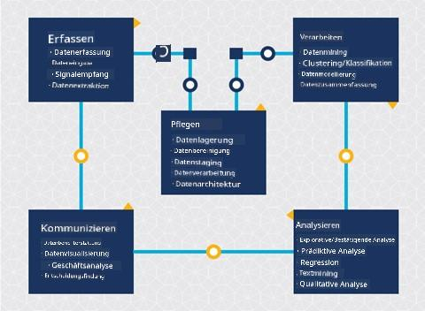
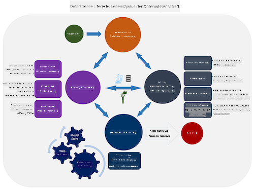
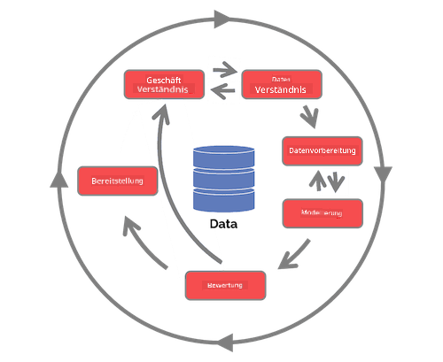

<!--
CO_OP_TRANSLATOR_METADATA:
{
  "original_hash": "79ca8a5a3135e94d2d43f56ba62d5205",
  "translation_date": "2025-09-04T14:10:54+00:00",
  "source_file": "4-Data-Science-Lifecycle/14-Introduction/README.md",
  "language_code": "de"
}
-->
# Einführung in den Lebenszyklus der Datenwissenschaft

| ](../../sketchnotes/14-DataScience-Lifecycle.png)|
|:---:|
| Einführung in den Lebenszyklus der Datenwissenschaft - _Sketchnote von [@nitya](https://twitter.com/nitya)_ |

## [Quiz vor der Vorlesung](https://red-water-0103e7a0f.azurestaticapps.net/quiz/26)

An diesem Punkt haben Sie wahrscheinlich erkannt, dass Datenwissenschaft ein Prozess ist. Dieser Prozess kann in fünf Phasen unterteilt werden:

- Erfassen
- Verarbeiten
- Analysieren
- Kommunizieren
- Warten

Diese Lektion konzentriert sich auf drei Teile des Lebenszyklus: Erfassen, Verarbeiten und Warten.

> Foto von [Berkeley School of Information](https://ischoolonline.berkeley.edu/data-science/what-is-data-science/)

## Erfassen

Die erste Phase des Lebenszyklus ist sehr wichtig, da die nächsten Phasen davon abhängen. Sie besteht praktisch aus zwei Phasen, die zu einer zusammengefasst sind: Daten erfassen und den Zweck sowie die Probleme definieren, die angegangen werden müssen.  
Das Definieren der Projektziele erfordert ein tieferes Verständnis des Problems oder der Fragestellung. Zunächst müssen wir diejenigen identifizieren und einbeziehen, deren Problem gelöst werden soll. Dies können Stakeholder eines Unternehmens oder Sponsoren des Projekts sein, die dabei helfen können, zu bestimmen, wer oder was von diesem Projekt profitieren wird und was sie benötigen und warum. Ein gut definiertes Ziel sollte messbar und quantifizierbar sein, um ein akzeptables Ergebnis zu definieren.

Fragen, die ein Datenwissenschaftler stellen könnte:
- Wurde dieses Problem schon einmal angegangen? Was wurde entdeckt?
- Ist der Zweck und das Ziel allen Beteiligten klar?
- Gibt es Unklarheiten und wie können diese reduziert werden?
- Welche Einschränkungen gibt es?
- Wie könnte das Endergebnis aussehen?
- Wie viele Ressourcen (Zeit, Personal, Rechenleistung) stehen zur Verfügung?

Als Nächstes geht es darum, die benötigten Daten zu identifizieren, zu sammeln und schließlich zu erkunden, um die definierten Ziele zu erreichen. In diesem Schritt der Datenerfassung müssen Datenwissenschaftler auch die Menge und Qualität der Daten bewerten. Dies erfordert eine gewisse Datenexploration, um sicherzustellen, dass die erfassten Daten das Erreichen des gewünschten Ergebnisses unterstützen.

Fragen, die ein Datenwissenschaftler zu den Daten stellen könnte:
- Welche Daten stehen mir bereits zur Verfügung?
- Wer besitzt diese Daten?
- Welche Datenschutzbedenken gibt es?
- Habe ich genug Daten, um dieses Problem zu lösen?
- Sind die Daten von akzeptabler Qualität für dieses Problem?
- Wenn ich durch diese Daten zusätzliche Informationen entdecke, sollten wir dann die Ziele ändern oder neu definieren?

## Verarbeiten

Die Verarbeitungsphase des Lebenszyklus konzentriert sich darauf, Muster in den Daten zu entdecken sowie Modelle zu erstellen. Einige Techniken, die in der Verarbeitungsphase verwendet werden, erfordern statistische Methoden, um die Muster aufzudecken. Typischerweise wäre dies eine mühsame Aufgabe für einen Menschen bei einem großen Datensatz, weshalb Computer eingesetzt werden, um den Prozess zu beschleunigen. In dieser Phase überschneiden sich Datenwissenschaft und maschinelles Lernen. Wie Sie in der ersten Lektion gelernt haben, ist maschinelles Lernen der Prozess des Erstellens von Modellen, um die Daten zu verstehen. Modelle sind eine Darstellung der Beziehung zwischen Variablen in den Daten, die helfen, Ergebnisse vorherzusagen.

Häufige Techniken, die in dieser Phase verwendet werden, sind im ML für Anfänger-Curriculum behandelt. Folgen Sie den Links, um mehr darüber zu erfahren:

- [Klassifikation](https://github.com/microsoft/ML-For-Beginners/tree/main/4-Classification): Organisieren von Daten in Kategorien für eine effizientere Nutzung.
- [Clustering](https://github.com/microsoft/ML-For-Beginners/tree/main/5-Clustering): Gruppieren von Daten in ähnliche Gruppen.
- [Regression](https://github.com/microsoft/ML-For-Beginners/tree/main/2-Regression): Bestimmen der Beziehungen zwischen Variablen, um Werte vorherzusagen oder zu prognostizieren.

## Warten

Im Diagramm des Lebenszyklus haben Sie vielleicht bemerkt, dass die Wartung zwischen Erfassen und Verarbeiten liegt. Wartung ist ein fortlaufender Prozess des Verwalten, Speicherns und Sicherens der Daten während des gesamten Projektverlaufs und sollte während des gesamten Projekts berücksichtigt werden.

### Daten speichern

Überlegungen dazu, wie und wo die Daten gespeichert werden, können die Kosten der Speicherung sowie die Leistung beeinflussen, wie schnell die Daten abgerufen werden können. Solche Entscheidungen werden wahrscheinlich nicht allein von einem Datenwissenschaftler getroffen, aber sie könnten Entscheidungen darüber treffen, wie sie mit den Daten arbeiten, basierend darauf, wie sie gespeichert sind.

Hier sind einige Aspekte moderner Datenspeichersysteme, die diese Entscheidungen beeinflussen können:

**On-Premise vs. Off-Premise vs. Public oder Private Cloud**

On-Premise bezieht sich auf das Hosting und Verwalten der Daten auf eigener Hardware, wie z. B. einem Server mit Festplatten, die die Daten speichern, während Off-Premise auf Hardware zurückgreift, die nicht im eigenen Besitz ist, wie z. B. ein Rechenzentrum. Die Public Cloud ist eine beliebte Wahl für die Speicherung von Daten, die keine Kenntnisse darüber erfordert, wie oder wo genau die Daten gespeichert sind, wobei "public" sich auf eine einheitliche zugrunde liegende Infrastruktur bezieht, die von allen Nutzern der Cloud geteilt wird. Einige Organisationen haben strenge Sicherheitsrichtlinien, die erfordern, dass sie vollständigen Zugriff auf die Hardware haben, auf der die Daten gehostet werden, und nutzen daher eine Private Cloud, die eigene Cloud-Dienste bereitstellt. Sie werden mehr über Daten in der Cloud in [späteren Lektionen](https://github.com/microsoft/Data-Science-For-Beginners/tree/main/5-Data-Science-In-Cloud) lernen.

**Cold vs. Hot Data**

Beim Training Ihrer Modelle benötigen Sie möglicherweise mehr Trainingsdaten. Wenn Sie mit Ihrem Modell zufrieden sind, werden weitere Daten eintreffen, damit das Modell seinen Zweck erfüllen kann. In jedem Fall steigen die Kosten für die Speicherung und den Zugriff auf Daten, je mehr davon angesammelt wird. Das Trennen von selten genutzten Daten, bekannt als Cold Data, von häufig genutzten Hot Data kann eine günstigere Speicheroption durch Hardware- oder Softwaredienste sein. Wenn Cold Data abgerufen werden muss, kann es etwas länger dauern als bei Hot Data.

### Daten verwalten

Während Sie mit Daten arbeiten, könnten Sie feststellen, dass einige der Daten bereinigt werden müssen, indem einige der in der Lektion über [Datenvorbereitung](https://github.com/microsoft/Data-Science-For-Beginners/tree/main/2-Working-With-Data/08-data-preparation) behandelten Techniken angewendet werden, um genaue Modelle zu erstellen. Wenn neue Daten eintreffen, müssen dieselben Anwendungen angewendet werden, um die Konsistenz der Qualität zu erhalten. Einige Projekte beinhalten die Verwendung eines automatisierten Tools zur Bereinigung, Aggregation und Kompression, bevor die Daten an ihren endgültigen Speicherort verschoben werden. Azure Data Factory ist ein Beispiel für eines dieser Tools.

### Daten sichern

Eines der Hauptziele der Datensicherung ist sicherzustellen, dass diejenigen, die mit den Daten arbeiten, die Kontrolle darüber haben, was gesammelt wird und in welchem Kontext es verwendet wird. Die Sicherung von Daten umfasst die Einschränkung des Zugriffs auf diejenigen, die ihn benötigen, die Einhaltung lokaler Gesetze und Vorschriften sowie die Wahrung ethischer Standards, wie in der [Ethik-Lektion](https://github.com/microsoft/Data-Science-For-Beginners/tree/main/1-Introduction/02-ethics) behandelt.

Hier sind einige Maßnahmen, die ein Team mit Blick auf die Sicherheit ergreifen könnte:
- Sicherstellen, dass alle Daten verschlüsselt sind
- Kunden Informationen darüber bereitstellen, wie ihre Daten verwendet werden
- Datenzugriff für Personen entfernen, die das Projekt verlassen haben
- Nur bestimmten Projektmitgliedern erlauben, die Daten zu ändern

## 🚀 Herausforderung

Es gibt viele Versionen des Lebenszyklus der Datenwissenschaft, bei denen jeder Schritt unterschiedliche Namen und eine unterschiedliche Anzahl von Phasen haben kann, aber die gleichen Prozesse enthält, die in dieser Lektion erwähnt wurden.

Erforschen Sie den [Team Data Science Process Lebenszyklus](https://docs.microsoft.com/en-us/azure/architecture/data-science-process/lifecycle) und den [Cross-industry standard process for data mining](https://www.datascience-pm.com/crisp-dm-2/). Nennen Sie drei Gemeinsamkeiten und Unterschiede zwischen den beiden.

|Team Data Science Process (TDSP)|Cross-industry standard process for data mining (CRISP-DM)|
|--|--|
| |  |
| Bild von [Microsoft](https://docs.microsoft.comazure/architecture/data-science-process/lifecycle) | Bild von [Data Science Process Alliance](https://www.datascience-pm.com/crisp-dm-2/) |

## [Quiz nach der Vorlesung](https://ff-quizzes.netlify.app/en/ds/)

## Überprüfung & Selbststudium

Die Anwendung des Lebenszyklus der Datenwissenschaft umfasst mehrere Rollen und Aufgaben, wobei sich einige auf bestimmte Teile jeder Phase konzentrieren können. Der Team Data Science Process bietet einige Ressourcen, die die Arten von Rollen und Aufgaben erklären, die jemand in einem Projekt haben könnte.

* [Team Data Science Process Rollen und Aufgaben](https://docs.microsoft.com/en-us/azure/architecture/data-science-process/roles-tasks)
* [Datenwissenschaftliche Aufgaben ausführen: Exploration, Modellierung und Bereitstellung](https://docs.microsoft.com/en-us/azure/architecture/data-science-process/execute-data-science-tasks)

## Aufgabe

[Bewertung eines Datensatzes](assignment.md)

---

**Haftungsausschluss**:  
Dieses Dokument wurde mithilfe des KI-Übersetzungsdienstes [Co-op Translator](https://github.com/Azure/co-op-translator) übersetzt. Obwohl wir uns um Genauigkeit bemühen, weisen wir darauf hin, dass automatisierte Übersetzungen Fehler oder Ungenauigkeiten enthalten können. Das Originaldokument in seiner ursprünglichen Sprache sollte als maßgebliche Quelle betrachtet werden. Für kritische Informationen wird eine professionelle menschliche Übersetzung empfohlen. Wir übernehmen keine Haftung für Missverständnisse oder Fehlinterpretationen, die sich aus der Nutzung dieser Übersetzung ergeben.