<!--
CO_OP_TRANSLATOR_METADATA:
{
  "original_hash": "39f3b3a9d873eaa522c2e792ce0ca503",
  "translation_date": "2025-09-04T14:04:01+00:00",
  "source_file": "5-Data-Science-In-Cloud/18-Low-Code/README.md",
  "language_code": "de"
}
-->
# Data Science in der Cloud: Der "Low Code/No Code"-Ansatz

| ](../../sketchnotes/18-DataScience-Cloud.png)|
|:---:|
| Data Science in der Cloud: Low Code - _Sketchnote von [@nitya](https://twitter.com/nitya)_ |

Inhaltsverzeichnis:

- [Data Science in der Cloud: Der "Low Code/No Code"-Ansatz](../../../../5-Data-Science-In-Cloud/18-Low-Code)
  - [Quiz vor der Vorlesung](../../../../5-Data-Science-In-Cloud/18-Low-Code)
  - [1. Einführung](../../../../5-Data-Science-In-Cloud/18-Low-Code)
    - [1.1 Was ist Azure Machine Learning?](../../../../5-Data-Science-In-Cloud/18-Low-Code)
    - [1.2 Das Herzinsuffizienz-Vorhersageprojekt:](../../../../5-Data-Science-In-Cloud/18-Low-Code)
    - [1.3 Der Herzinsuffizienz-Datensatz:](../../../../5-Data-Science-In-Cloud/18-Low-Code)
  - [2. Low Code/No Code Training eines Modells in Azure ML Studio](../../../../5-Data-Science-In-Cloud/18-Low-Code)
    - [2.1 Erstellen eines Azure ML-Arbeitsbereichs](../../../../5-Data-Science-In-Cloud/18-Low-Code)
    - [2.2 Compute-Ressourcen](../../../../5-Data-Science-In-Cloud/18-Low-Code)
      - [2.2.1 Auswahl der richtigen Optionen für Compute-Ressourcen](../../../../5-Data-Science-In-Cloud/18-Low-Code)
      - [2.2.2 Erstellen eines Compute-Clusters](../../../../5-Data-Science-In-Cloud/18-Low-Code)
    - [2.3 Laden des Datensatzes](../../../../5-Data-Science-In-Cloud/18-Low-Code)
    - [2.4 Low Code/No Code Training mit AutoML](../../../../5-Data-Science-In-Cloud/18-Low-Code)
  - [3. Low Code/No Code Modellbereitstellung und Nutzung von Endpunkten](../../../../5-Data-Science-In-Cloud/18-Low-Code)
    - [3.1 Modellbereitstellung](../../../../5-Data-Science-In-Cloud/18-Low-Code)
    - [3.2 Nutzung von Endpunkten](../../../../5-Data-Science-In-Cloud/18-Low-Code)
  - [🚀 Herausforderung](../../../../5-Data-Science-In-Cloud/18-Low-Code)
  - [Quiz nach der Vorlesung](../../../../5-Data-Science-In-Cloud/18-Low-Code)
  - [Überblick & Selbststudium](../../../../5-Data-Science-In-Cloud/18-Low-Code)
  - [Aufgabe](../../../../5-Data-Science-In-Cloud/18-Low-Code)
  
## [Quiz vor der Vorlesung](https://ff-quizzes.netlify.app/en/ds/)

## 1. Einführung
### 1.1 Was ist Azure Machine Learning?

Die Azure-Cloud-Plattform umfasst mehr als 200 Produkte und Cloud-Dienste, die Ihnen helfen, neue Lösungen zu entwickeln. Datenwissenschaftler investieren viel Zeit in die Erkundung und Vorverarbeitung von Daten sowie in das Testen verschiedener Modelltrainingsalgorithmen, um präzise Modelle zu erstellen. Diese Aufgaben sind zeitaufwendig und führen oft zu einer ineffizienten Nutzung teurer Hardware.

[Azure ML](https://docs.microsoft.com/azure/machine-learning/overview-what-is-azure-machine-learning?WT.mc_id=academic-77958-bethanycheum&ocid=AID3041109) ist eine cloudbasierte Plattform zum Erstellen und Betreiben von Machine-Learning-Lösungen in Azure. Sie bietet eine Vielzahl von Funktionen, die Datenwissenschaftler dabei unterstützen, Daten vorzubereiten, Modelle zu trainieren, prädiktive Dienste zu veröffentlichen und deren Nutzung zu überwachen. Besonders wichtig ist, dass sie die Effizienz steigert, indem viele zeitaufwendige Aufgaben beim Modelltraining automatisiert werden. Zudem ermöglicht sie die Nutzung skalierbarer Cloud-Compute-Ressourcen, um große Datenmengen zu verarbeiten und Kosten nur bei tatsächlicher Nutzung zu verursachen.

Azure ML bietet alle Werkzeuge, die Entwickler und Datenwissenschaftler für ihre Machine-Learning-Workflows benötigen, darunter:

- **Azure Machine Learning Studio**: Ein Webportal in Azure Machine Learning für Low-Code- und No-Code-Optionen zur Modellierung, Bereitstellung, Automatisierung, Nachverfolgung und Verwaltung von Ressourcen. Das Studio integriert sich nahtlos mit dem Azure Machine Learning SDK.
- **Jupyter Notebooks**: Schnelles Prototyping und Testen von ML-Modellen.
- **Azure Machine Learning Designer**: Ermöglicht das Drag-and-Drop von Modulen, um Experimente zu erstellen und Pipelines in einer Low-Code-Umgebung bereitzustellen.
- **Automatisierte Machine-Learning-Oberfläche (AutoML)**: Automatisiert iterative Aufgaben der Modellentwicklung und ermöglicht die Erstellung von ML-Modellen mit hoher Skalierbarkeit, Effizienz und Produktivität, ohne die Modellqualität zu beeinträchtigen.
- **Datenkennzeichnung**: Ein unterstütztes ML-Tool zur automatischen Kennzeichnung von Daten.
- **Machine-Learning-Erweiterung für Visual Studio Code**: Bietet eine vollständige Entwicklungsumgebung für die Erstellung und Verwaltung von ML-Projekten.
- **Machine-Learning-CLI**: Bietet Befehle zur Verwaltung von Azure ML-Ressourcen über die Befehlszeile.
- **Integration mit Open-Source-Frameworks** wie PyTorch, TensorFlow, Scikit-learn und viele mehr für das Training, die Bereitstellung und die Verwaltung des gesamten Machine-Learning-Prozesses.
- **MLflow**: Eine Open-Source-Bibliothek zur Verwaltung des Lebenszyklus von Machine-Learning-Experimenten. **MLFlow Tracking** ist eine Komponente von MLflow, die Trainingslaufmetriken und Modellartefakte unabhängig von der Umgebung des Experiments protokolliert und nachverfolgt.

### 1.2 Das Herzinsuffizienz-Vorhersageprojekt:

Es steht außer Frage, dass das Erstellen von Projekten der beste Weg ist, um Ihre Fähigkeiten und Ihr Wissen zu testen. In dieser Lektion werden wir zwei verschiedene Ansätze zur Erstellung eines Data-Science-Projekts zur Vorhersage von Herzinsuffizienz in Azure ML Studio untersuchen: den Low-Code/No-Code-Ansatz und die Nutzung des Azure ML SDK, wie im folgenden Schema dargestellt:

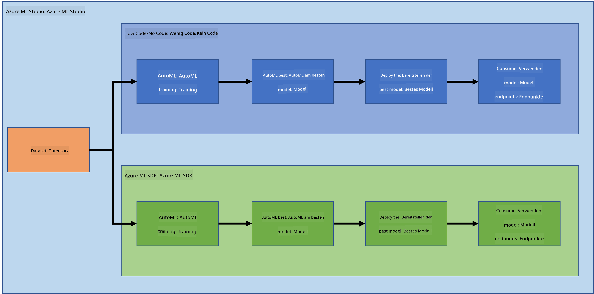

Jeder Ansatz hat seine eigenen Vor- und Nachteile. Der Low-Code/No-Code-Ansatz ist einfacher zu starten, da er die Interaktion mit einer grafischen Benutzeroberfläche (GUI) erfordert und keine Vorkenntnisse in der Programmierung notwendig sind. Diese Methode ermöglicht ein schnelles Testen der Projektumsetzbarkeit und die Erstellung eines Proof of Concept (POC). Wenn das Projekt jedoch wächst und produktionsreif werden soll, ist es nicht praktikabel, Ressourcen über die GUI zu erstellen. Hier wird es entscheidend, das Azure ML SDK programmatisch zu nutzen, um alles zu automatisieren – von der Ressourcenerstellung bis zur Modellbereitstellung.

|                   | Low Code/No Code | Azure ML SDK              |
|-------------------|------------------|---------------------------|
| Code-Kenntnisse   | Nicht erforderlich | Erforderlich              |
| Entwicklungszeit  | Schnell und einfach | Abhängig von Code-Kenntnissen |
| Produktionsreife  | Nein               | Ja                       |

### 1.3 Der Herzinsuffizienz-Datensatz: 

Herz-Kreislauf-Erkrankungen (CVDs) sind weltweit die häufigste Todesursache und machen 31 % aller Todesfälle aus. Umwelt- und Verhaltensrisikofaktoren wie Tabakkonsum, ungesunde Ernährung und Fettleibigkeit, körperliche Inaktivität und schädlicher Alkoholkonsum könnten als Merkmale für Schätzmodelle verwendet werden. Die Fähigkeit, die Wahrscheinlichkeit der Entwicklung einer CVD abzuschätzen, könnte von großem Nutzen sein, um Angriffe bei Hochrisikopersonen zu verhindern.

Kaggle hat einen [Herzinsuffizienz-Datensatz](https://www.kaggle.com/andrewmvd/heart-failure-clinical-data) öffentlich zugänglich gemacht, den wir für dieses Projekt verwenden werden. Sie können den Datensatz jetzt herunterladen. Es handelt sich um einen tabellarischen Datensatz mit 13 Spalten (12 Merkmalen und 1 Zielvariable) und 299 Zeilen. 

|    | Variablenname             | Typ            | Beschreibung                                               | Beispiel           |
|----|---------------------------|-----------------|-----------------------------------------------------------|-------------------|
| 1  | age                       | numerisch       | Alter des Patienten                                       | 25                |
| 2  | anaemia                   | boolean         | Verringerung der roten Blutkörperchen oder des Hämoglobins | 0 oder 1          |
| 3  | creatinine_phosphokinase  | numerisch       | CPK-Enzymgehalt im Blut                                   | 542               |
| 4  | diabetes                  | boolean         | Ob der Patient Diabetes hat                               | 0 oder 1          |
| 5  | ejection_fraction         | numerisch       | Prozentsatz des Blutes, das bei jeder Kontraktion das Herz verlässt | 45                |
| 6  | high_blood_pressure       | boolean         | Ob der Patient Bluthochdruck hat                         | 0 oder 1          |
| 7  | platelets                 | numerisch       | Blutplättchen im Blut                                     | 149000            |
| 8  | serum_creatinine          | numerisch       | Serumkreatininspiegel im Blut                            | 0.5               |
| 9  | serum_sodium              | numerisch       | Serumnatriumspiegel im Blut                              | jun               |
| 10 | sex                       | boolean         | Frau oder Mann                                            | 0 oder 1          |
| 11 | smoking                   | boolean         | Ob der Patient raucht                                     | 0 oder 1          |
| 12 | time                      | numerisch       | Nachbeobachtungszeitraum (Tage)                          | 4                 |
|----|---------------------------|-----------------|-----------------------------------------------------------|-------------------|
| 21 | DEATH_EVENT [Ziel]        | boolean         | Ob der Patient während des Nachbeobachtungszeitraums stirbt | 0 oder 1          |

Sobald Sie den Datensatz haben, können wir mit dem Projekt in Azure beginnen.

## 2. Low Code/No Code Training eines Modells in Azure ML Studio
### 2.1 Erstellen eines Azure ML-Arbeitsbereichs
Um ein Modell in Azure ML zu trainieren, müssen Sie zunächst einen Azure ML-Arbeitsbereich erstellen. Der Arbeitsbereich ist die oberste Ressource für Azure Machine Learning und bietet einen zentralen Ort, um mit allen Artefakten zu arbeiten, die Sie bei der Nutzung von Azure Machine Learning erstellen. Der Arbeitsbereich führt eine Historie aller Trainingsläufe, einschließlich Protokollen, Metriken, Ausgaben und einer Momentaufnahme Ihrer Skripte. Diese Informationen können Sie nutzen, um zu bestimmen, welcher Trainingslauf das beste Modell liefert. [Erfahren Sie mehr](https://docs.microsoft.com/azure/machine-learning/concept-workspace?WT.mc_id=academic-77958-bethanycheum&ocid=AID3041109)

Es wird empfohlen, den aktuellsten Browser zu verwenden, der mit Ihrem Betriebssystem kompatibel ist. Die folgenden Browser werden unterstützt:

- Microsoft Edge (Die neue Version von Microsoft Edge, nicht die Legacy-Version)
- Safari (neueste Version, nur Mac)
- Chrome (neueste Version)
- Firefox (neueste Version)

Um Azure Machine Learning zu nutzen, erstellen Sie einen Arbeitsbereich in Ihrem Azure-Abonnement. Sie können diesen Arbeitsbereich dann verwenden, um Daten, Compute-Ressourcen, Code, Modelle und andere Artefakte zu verwalten, die mit Ihren Machine-Learning-Arbeitslasten zusammenhängen.

> **_HINWEIS:_** Ihr Azure-Abonnement wird für die Datenspeicherung geringfügig belastet, solange der Azure Machine Learning-Arbeitsbereich in Ihrem Abonnement existiert. Daher empfehlen wir, den Arbeitsbereich zu löschen, wenn Sie ihn nicht mehr verwenden.

1. Melden Sie sich im [Azure-Portal](https://ms.portal.azure.com/) mit den Microsoft-Anmeldedaten an, die mit Ihrem Azure-Abonnement verknüpft sind.
2. Wählen Sie **＋Ressource erstellen**
   
   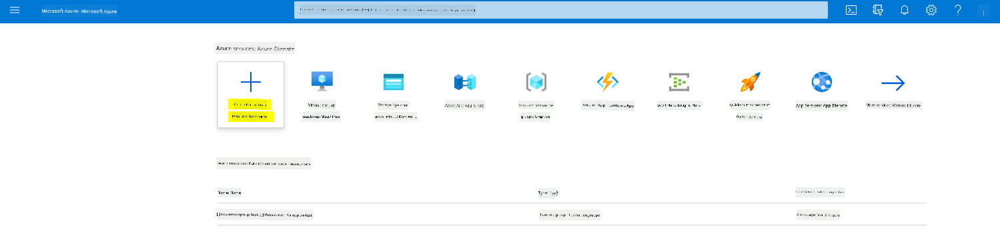

   Suchen Sie nach Machine Learning und wählen Sie die Kachel Machine Learning aus.

   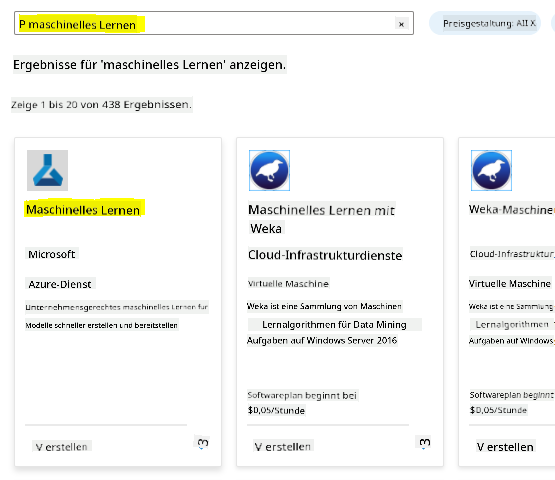

   Klicken Sie auf die Schaltfläche "Erstellen".

   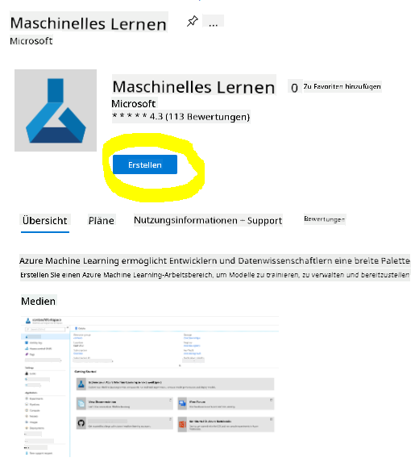

   Füllen Sie die Einstellungen wie folgt aus:
   - Abonnement: Ihr Azure-Abonnement
   - Ressourcengruppe: Erstellen oder wählen Sie eine Ressourcengruppe aus
   - Arbeitsbereichsname: Geben Sie einen eindeutigen Namen für Ihren Arbeitsbereich ein
   - Region: Wählen Sie die geografische Region, die Ihnen am nächsten liegt
   - Speicherkonto: Beachten Sie das standardmäßig neue Speicherkonto, das für Ihren Arbeitsbereich erstellt wird
   - Schlüssel-Tresor: Beachten Sie den standardmäßig neuen Schlüssel-Tresor, der für Ihren Arbeitsbereich erstellt wird
   - Application Insights: Beachten Sie die standardmäßig neue Application Insights-Ressource, die für Ihren Arbeitsbereich erstellt wird
   - Container-Registry: Keine (eine wird automatisch erstellt, wenn Sie zum ersten Mal ein Modell in einem Container bereitstellen)

    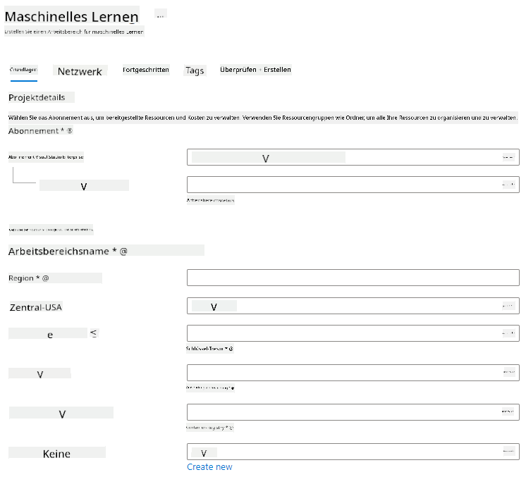

   - Klicken Sie auf "Erstellen + Überprüfen" und anschließend auf die Schaltfläche "Erstellen".
3. Warten Sie, bis Ihr Arbeitsbereich erstellt wurde (dies kann einige Minuten dauern). Gehen Sie dann im Portal zu ihm. Sie können ihn über den Azure-Dienst Machine Learning finden.
4. Auf der Übersichtsseite Ihres Arbeitsbereichs starten Sie Azure Machine Learning Studio (oder öffnen Sie einen neuen Browser-Tab und navigieren Sie zu https://ml.azure.com) und melden sich mit Ihrem Microsoft-Konto bei Azure Machine Learning Studio an. Falls erforderlich, wählen Sie Ihr Azure-Verzeichnis und -Abonnement sowie Ihren Azure Machine Learning-Arbeitsbereich aus.
   
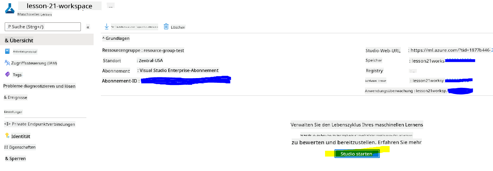

5. In Azure Machine Learning Studio können Sie das ☰-Symbol oben links umschalten, um die verschiedenen Seiten der Benutzeroberfläche anzuzeigen. Sie können diese Seiten verwenden, um die Ressourcen in Ihrem Arbeitsbereich zu verwalten.

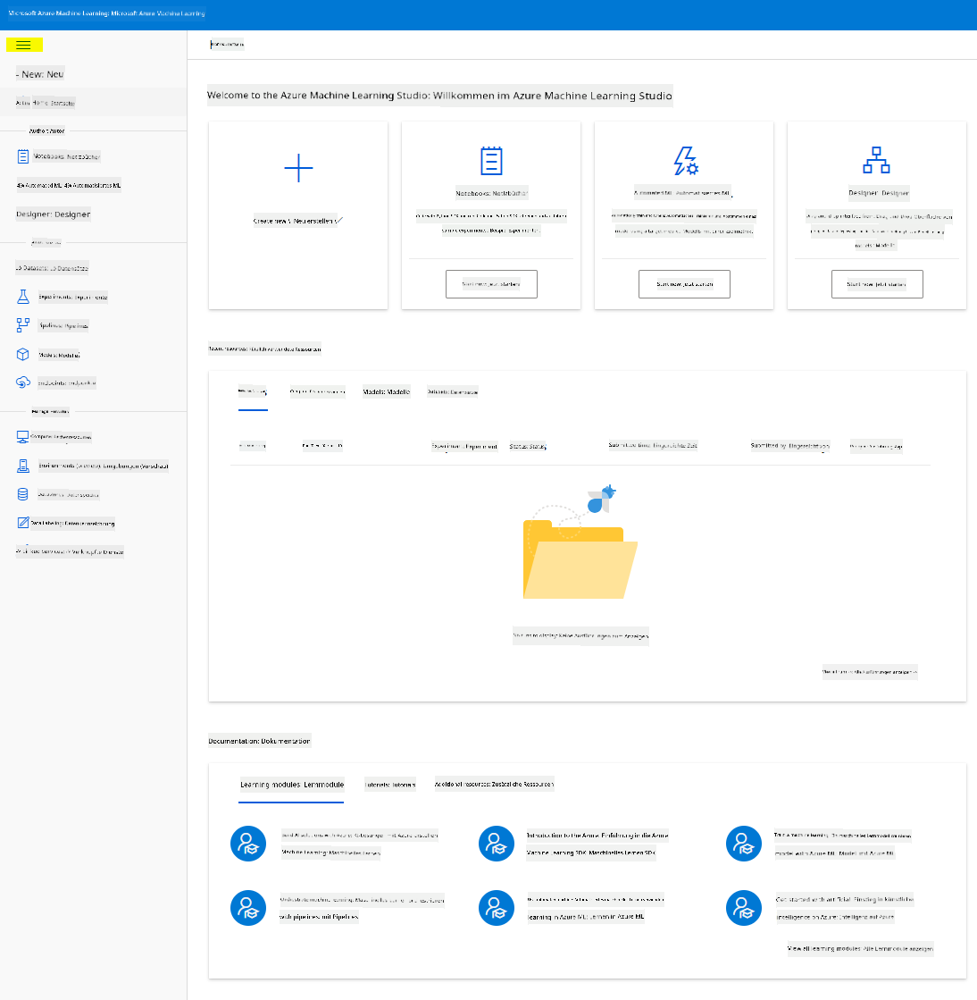

Sie können Ihren Arbeitsbereich über das Azure-Portal verwalten, aber für Datenwissenschaftler und Machine-Learning-Betriebsingenieure bietet Azure Machine Learning Studio eine fokussiertere Benutzeroberfläche zur Verwaltung von Arbeitsbereichsressourcen.

### 2.2 Compute-Ressourcen

Compute-Ressourcen sind cloudbasierte Ressourcen, auf denen Sie Modelltrainings- und Datenexplorationsprozesse ausführen können. Es gibt vier Arten von Compute-Ressourcen, die Sie erstellen können:

- **Compute-Instanzen**: Entwicklungsarbeitsstationen, die Datenwissenschaftler nutzen können, um mit Daten und Modellen zu arbeiten. Dies umfasst die Erstellung einer virtuellen Maschine (VM) und das Starten einer Notebook-Instanz. Sie können dann ein Modell trainieren, indem Sie einen Compute-Cluster aus dem Notebook aufrufen.
- **Compute-Cluster**: Skalierbare Cluster von VMs für die bedarfsorientierte Verarbeitung von Experimentcode. Sie benötigen sie, wenn Sie ein Modell trainieren. Compute-Cluster können auch spezialisierte GPU- oder CPU-Ressourcen nutzen.
- **Inference-Cluster**: Bereitstellungsziele für prädiktive Dienste, die Ihre trainierten Modelle verwenden.
- **Angeschlossene Compute-Ressourcen**: Verknüpft mit bestehenden Azure-Compute-Ressourcen, wie virtuellen Maschinen oder Azure-Databricks-Clustern.

#### 2.2.1 Die richtigen Optionen für Ihre Compute-Ressourcen wählen

Es gibt einige wichtige Faktoren, die bei der Erstellung einer Compute-Ressource zu berücksichtigen sind, und diese Entscheidungen können entscheidend sein.

**Benötigen Sie eine CPU oder GPU?**

Eine CPU (Central Processing Unit) ist die elektronische Schaltung, die Anweisungen eines Computerprogramms ausführt. Eine GPU (Graphics Processing Unit) ist eine spezialisierte elektronische Schaltung, die grafikbezogenen Code mit sehr hoher Geschwindigkeit ausführen kann.

Der Hauptunterschied zwischen CPU- und GPU-Architektur besteht darin, dass eine CPU darauf ausgelegt ist, eine Vielzahl von Aufgaben schnell zu erledigen (gemessen an der CPU-Taktgeschwindigkeit), jedoch begrenzt ist in der Anzahl der gleichzeitig laufenden Aufgaben. GPUs sind für paralleles Rechnen konzipiert und daher viel besser für Aufgaben des Deep Learnings geeignet.

| CPU                                     | GPU                         |
|-----------------------------------------|-----------------------------|
| Weniger teuer                           | Teurer                     |
| Niedrigere Parallelität                 | Höhere Parallelität         |
| Langsamer beim Training von Deep-Learning-Modellen | Optimal für Deep Learning   |

**Clustergröße**

Größere Cluster sind teurer, bieten jedoch eine bessere Reaktionsfähigkeit. Wenn Sie also Zeit haben, aber nicht genug Geld, sollten Sie mit einem kleinen Cluster beginnen. Umgekehrt, wenn Sie Geld haben, aber wenig Zeit, sollten Sie mit einem größeren Cluster starten.

**VM-Größe**

Je nach Ihren zeitlichen und budgetären Einschränkungen können Sie die Größe Ihres RAMs, Ihrer Festplatte, die Anzahl der Kerne und die Taktgeschwindigkeit variieren. Das Erhöhen all dieser Parameter ist kostspieliger, führt jedoch zu einer besseren Leistung.

**Dedizierte oder Low-Priority-Instanzen?**

Eine Low-Priority-Instanz bedeutet, dass sie unterbrechbar ist: Microsoft Azure kann diese Ressourcen nehmen und einer anderen Aufgabe zuweisen, wodurch ein Job unterbrochen wird. Eine dedizierte Instanz, also nicht unterbrechbar, bedeutet, dass der Job niemals ohne Ihre Zustimmung beendet wird. Dies ist eine weitere Überlegung zwischen Zeit und Geld, da unterbrechbare Instanzen günstiger sind als dedizierte.

#### 2.2.2 Erstellen eines Compute-Clusters

Im [Azure ML-Arbeitsbereich](https://ml.azure.com/), den wir zuvor erstellt haben, gehen Sie zu Compute, und Sie können die verschiedenen Compute-Ressourcen sehen, die wir gerade besprochen haben (z. B. Compute-Instanzen, Compute-Cluster, Inferenz-Cluster und angeschlossene Compute-Ressourcen). Für dieses Projekt benötigen wir einen Compute-Cluster für das Modelltraining. Klicken Sie im Studio auf das Menü "Compute", dann auf die Registerkarte "Compute-Cluster" und klicken Sie auf die Schaltfläche "+ Neu", um einen Compute-Cluster zu erstellen.

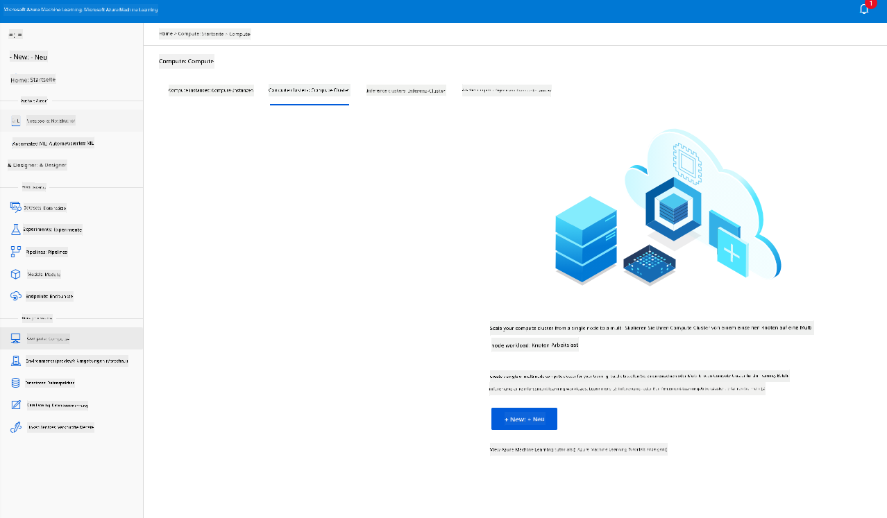

1. Wählen Sie Ihre Optionen: Dediziert vs. Low Priority, CPU oder GPU, VM-Größe und Anzahl der Kerne (Sie können die Standardeinstellungen für dieses Projekt beibehalten).
2. Klicken Sie auf die Schaltfläche "Weiter".

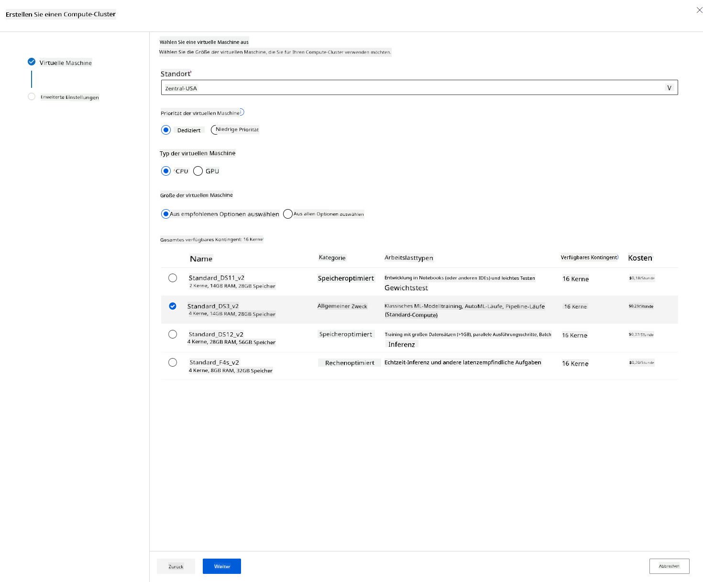

3. Geben Sie dem Cluster einen Namen.
4. Wählen Sie Ihre Optionen: Mindest-/Maximale Anzahl von Knoten, Leerlaufsekunden vor dem Herunterskalieren, SSH-Zugriff. Beachten Sie, dass Sie Geld sparen, wenn die Mindestanzahl der Knoten 0 ist und der Cluster im Leerlauf ist. Beachten Sie, dass je höher die maximale Anzahl der Knoten ist, desto kürzer wird das Training. Die empfohlene maximale Anzahl von Knoten beträgt 3.  
5. Klicken Sie auf die Schaltfläche "Erstellen". Dieser Schritt kann einige Minuten dauern.

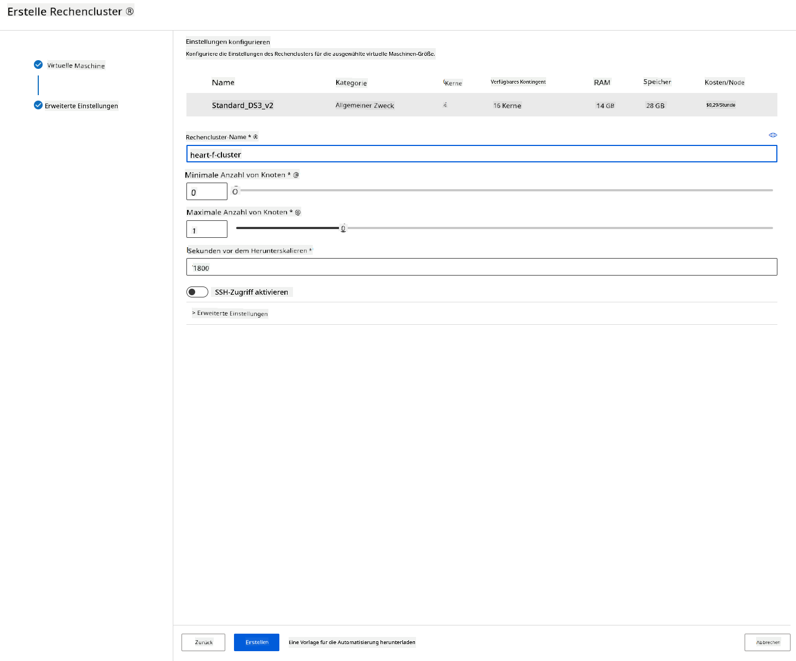

Super! Jetzt, da wir einen Compute-Cluster haben, müssen wir die Daten in Azure ML Studio laden.

### 2.3 Laden des Datensatzes

1. Im [Azure ML-Arbeitsbereich](https://ml.azure.com/), den wir zuvor erstellt haben, klicken Sie im linken Menü auf "Datasets" und dann auf die Schaltfläche "+ Dataset erstellen", um einen Datensatz zu erstellen. Wählen Sie die Option "Von lokalen Dateien" und wählen Sie den Kaggle-Datensatz aus, den wir zuvor heruntergeladen haben.
   
   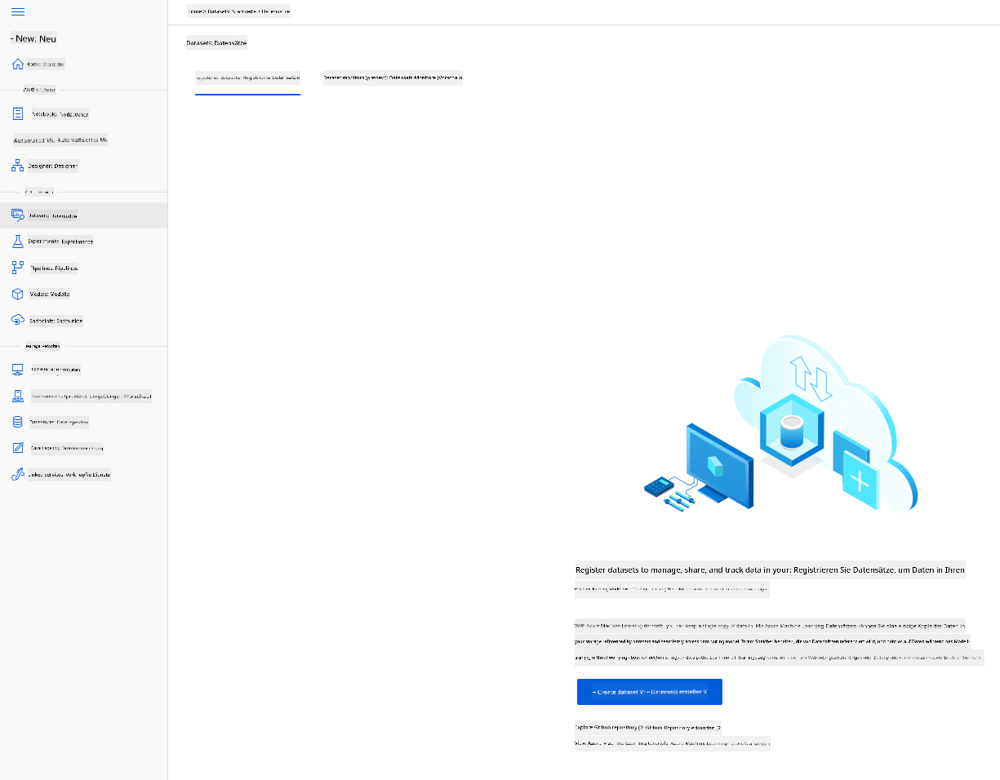

2. Geben Sie Ihrem Datensatz einen Namen, einen Typ und eine Beschreibung. Klicken Sie auf "Weiter". Laden Sie die Daten aus Dateien hoch. Klicken Sie auf "Weiter".
   
   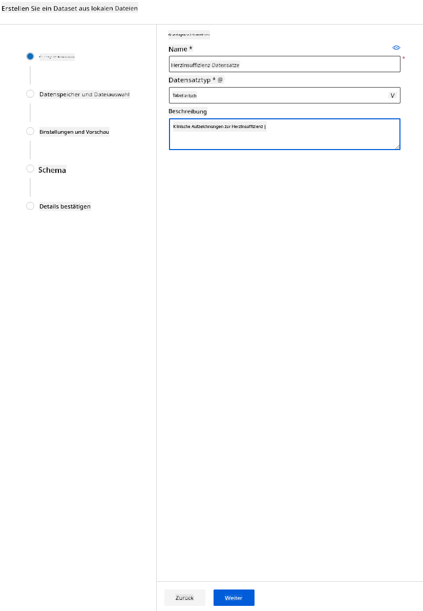

3. Ändern Sie im Schema den Datentyp zu Boolean für die folgenden Merkmale: Anämie, Diabetes, Bluthochdruck, Geschlecht, Rauchen und DEATH_EVENT. Klicken Sie auf "Weiter" und dann auf "Erstellen".
   
   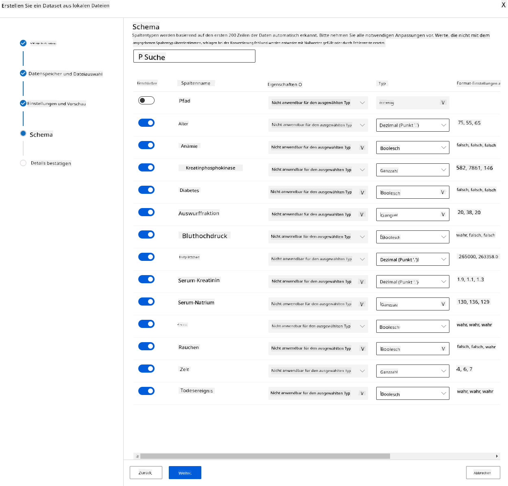

Super! Jetzt, da der Datensatz vorhanden ist und der Compute-Cluster erstellt wurde, können wir mit dem Training des Modells beginnen!

### 2.4 Low-Code/No-Code-Training mit AutoML

Die Entwicklung traditioneller Machine-Learning-Modelle ist ressourcenintensiv, erfordert umfangreiches Fachwissen und Zeit, um Dutzende von Modellen zu erstellen und zu vergleichen. 
Automatisiertes Machine Learning (AutoML) ist der Prozess der Automatisierung der zeitaufwändigen, iterativen Aufgaben der Entwicklung von Machine-Learning-Modellen. Es ermöglicht Datenwissenschaftlern, Analysten und Entwicklern, ML-Modelle mit hoher Skalierbarkeit, Effizienz und Produktivität zu erstellen, während die Modellqualität erhalten bleibt. Es verkürzt die Zeit, die benötigt wird, um produktionsreife ML-Modelle zu erhalten, mit großer Leichtigkeit und Effizienz. [Mehr erfahren](https://docs.microsoft.com/azure/machine-learning/concept-automated-ml?WT.mc_id=academic-77958-bethanycheum&ocid=AID3041109)

1. Im [Azure ML-Arbeitsbereich](https://ml.azure.com/), den wir zuvor erstellt haben, klicken Sie im linken Menü auf "Automated ML" und wählen Sie den Datensatz aus, den Sie gerade hochgeladen haben. Klicken Sie auf "Weiter".

   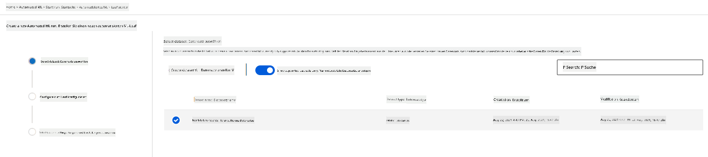

2. Geben Sie einen neuen Experimentnamen, die Zielspalte (DEATH_EVENT) und den Compute-Cluster ein, den wir erstellt haben. Klicken Sie auf "Weiter".
   
   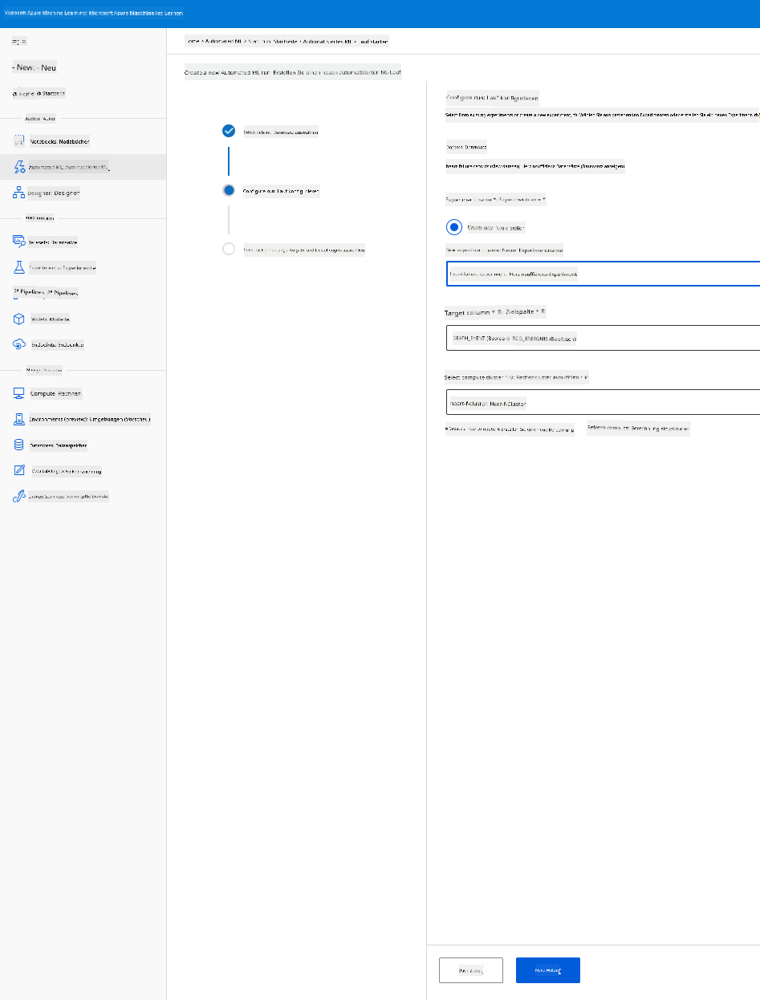

3. Wählen Sie "Klassifikation" und klicken Sie auf "Fertigstellen". Dieser Schritt kann je nach Größe Ihres Compute-Clusters zwischen 30 Minuten und 1 Stunde dauern.
    
    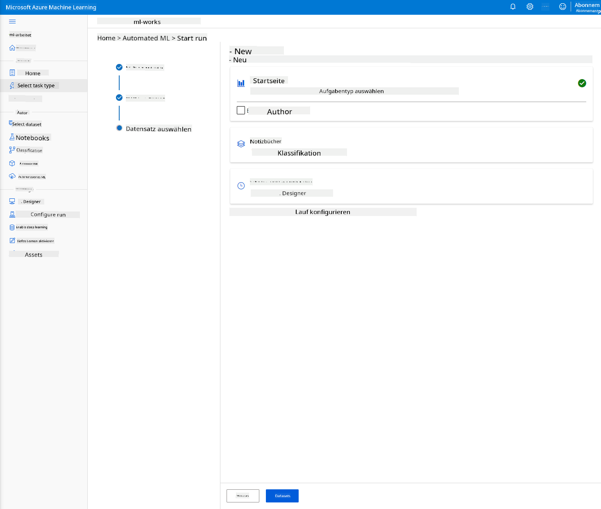

4. Sobald der Lauf abgeschlossen ist, klicken Sie auf die Registerkarte "Automated ML", klicken Sie auf Ihren Lauf und klicken Sie auf den Algorithmus in der Karte "Best model summary".
    
    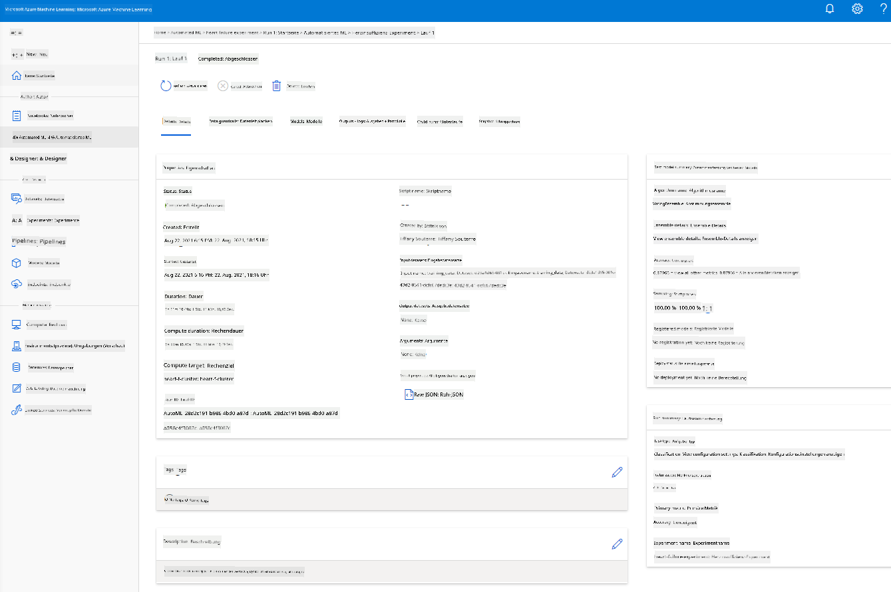

Hier können Sie eine detaillierte Beschreibung des besten Modells sehen, das AutoML generiert hat. Sie können auch andere Modelle im Tab "Models" erkunden. Nehmen Sie sich ein paar Minuten Zeit, um die Modelle in den Erklärungen (Vorschau-Button) zu erkunden. Sobald Sie das Modell ausgewählt haben, das Sie verwenden möchten (hier wählen wir das beste Modell, das von AutoML ausgewählt wurde), sehen wir, wie wir es bereitstellen können.

## 3. Low-Code/No-Code-Modellbereitstellung und Endpunktverbrauch
### 3.1 Modellbereitstellung

Die automatisierte Machine-Learning-Oberfläche ermöglicht es Ihnen, das beste Modell in wenigen Schritten als Webdienst bereitzustellen. Die Bereitstellung ist die Integration des Modells, sodass es Vorhersagen basierend auf neuen Daten treffen und potenzielle Chancen identifizieren kann. Für dieses Projekt bedeutet die Bereitstellung als Webdienst, dass medizinische Anwendungen das Modell nutzen können, um Live-Vorhersagen über das Herzinfarktrisiko ihrer Patienten zu treffen.

Klicken Sie in der Beschreibung des besten Modells auf die Schaltfläche "Deploy".
    
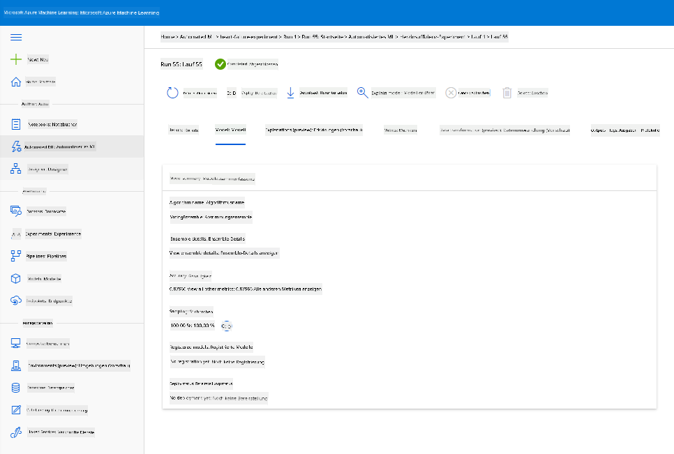

15. Geben Sie ihm einen Namen, eine Beschreibung, den Computertyp (Azure Container Instance), aktivieren Sie die Authentifizierung und klicken Sie auf "Deploy". Dieser Schritt kann etwa 20 Minuten dauern. Der Bereitstellungsprozess umfasst mehrere Schritte, darunter die Registrierung des Modells, die Generierung von Ressourcen und deren Konfiguration für den Webdienst. Eine Statusmeldung erscheint unter "Deploy status". Wählen Sie regelmäßig "Aktualisieren", um den Bereitstellungsstatus zu überprüfen. Es ist bereitgestellt und läuft, wenn der Status "Healthy" ist.

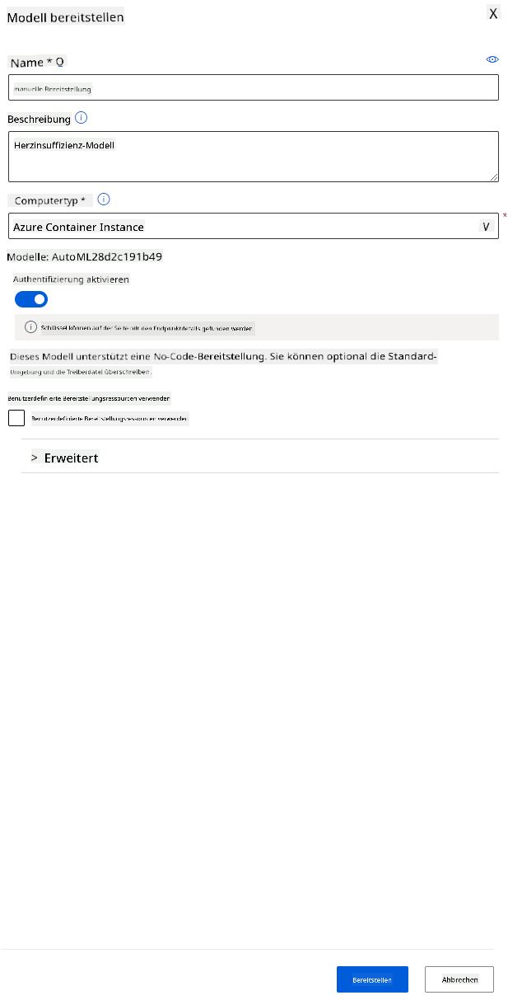

16. Sobald es bereitgestellt wurde, klicken Sie auf die Registerkarte "Endpoint" und klicken Sie auf den Endpunkt, den Sie gerade bereitgestellt haben. Hier finden Sie alle Details, die Sie über den Endpunkt wissen müssen.

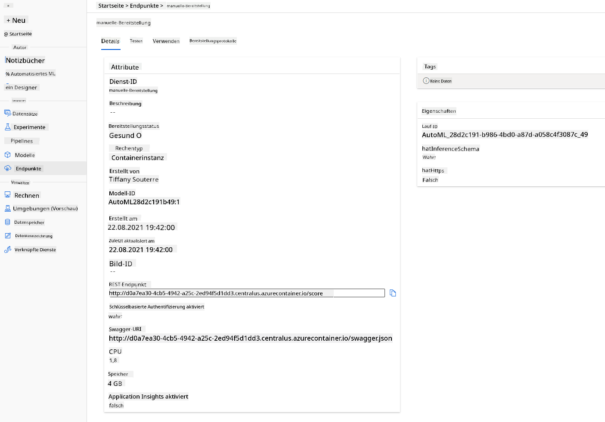

Fantastisch! Jetzt, da wir ein Modell bereitgestellt haben, können wir mit dem Verbrauch des Endpunkts beginnen.

### 3.2 Endpunktverbrauch

Klicken Sie auf die Registerkarte "Consume". Hier finden Sie den REST-Endpunkt und ein Python-Skript in der Verbrauchsoption. Nehmen Sie sich Zeit, um den Python-Code zu lesen.

Dieses Skript kann direkt von Ihrem lokalen Computer ausgeführt werden und wird Ihren Endpunkt konsumieren.

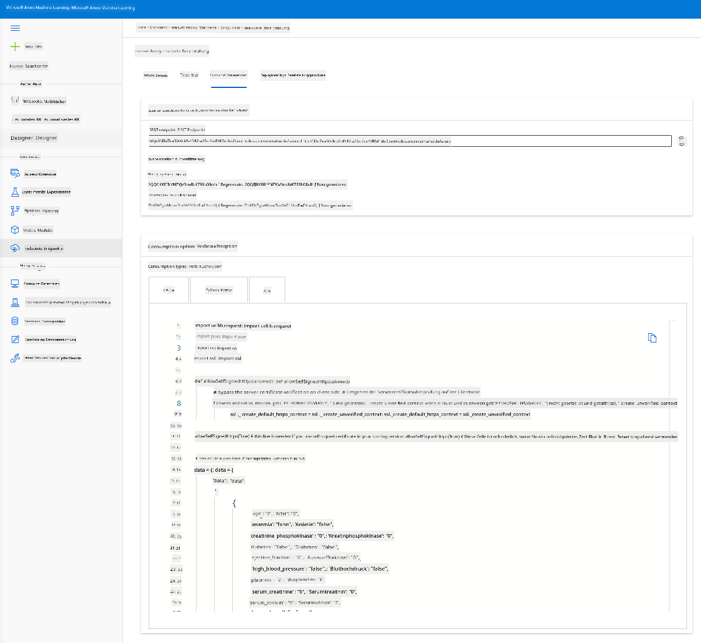

Schauen Sie sich diese zwei Zeilen Code genauer an: 

```python
url = 'http://98e3715f-xxxx-xxxx-xxxx-9ec22d57b796.centralus.azurecontainer.io/score'
api_key = '' # Replace this with the API key for the web service
```
Die Variable `url` ist der REST-Endpunkt, der in der Registerkarte "Consume" zu finden ist, und die Variable `api_key` ist der Primärschlüssel, der ebenfalls in der Registerkarte "Consume" zu finden ist (nur wenn Sie die Authentifizierung aktiviert haben). So kann das Skript den Endpunkt konsumieren.

18. Wenn Sie das Skript ausführen, sollten Sie die folgende Ausgabe sehen:
    ```python
    b'"{\\"result\\": [true]}"'
    ```
Das bedeutet, dass die Vorhersage eines Herzversagens für die angegebenen Daten wahr ist. Das macht Sinn, denn wenn Sie die automatisch generierten Daten im Skript genauer betrachten, ist alles standardmäßig auf 0 und falsch gesetzt. Sie können die Daten mit folgendem Eingabebeispiel ändern:

```python
data = {
    "data":
    [
        {
            'age': "0",
            'anaemia': "false",
            'creatinine_phosphokinase': "0",
            'diabetes': "false",
            'ejection_fraction': "0",
            'high_blood_pressure': "false",
            'platelets': "0",
            'serum_creatinine': "0",
            'serum_sodium': "0",
            'sex': "false",
            'smoking': "false",
            'time': "0",
        },
        {
            'age': "60",
            'anaemia': "false",
            'creatinine_phosphokinase': "500",
            'diabetes': "false",
            'ejection_fraction': "38",
            'high_blood_pressure': "false",
            'platelets': "260000",
            'serum_creatinine': "1.40",
            'serum_sodium': "137",
            'sex': "false",
            'smoking': "false",
            'time': "130",
        },
    ],
}
```
Das Skript sollte zurückgeben:
    ```python
    b'"{\\"result\\": [true, false]}"'
    ```

Herzlichen Glückwunsch! Sie haben gerade das bereitgestellte Modell konsumiert und es auf Azure ML trainiert!

> **_HINWEIS:_** Sobald Sie mit dem Projekt fertig sind, vergessen Sie nicht, alle Ressourcen zu löschen.
## 🚀 Herausforderung

Schauen Sie sich die Modellerklärungen und Details an, die AutoML für die besten Modelle generiert hat. Versuchen Sie zu verstehen, warum das beste Modell besser ist als die anderen. Welche Algorithmen wurden verglichen? Was sind die Unterschiede zwischen ihnen? Warum ist das beste Modell in diesem Fall besser?

## [Quiz nach der Vorlesung](https://ff-quizzes.netlify.app/en/ds/)

## Überprüfung & Selbststudium

In dieser Lektion haben Sie gelernt, wie Sie ein Modell trainieren, bereitstellen und konsumieren, um das Herzinfarktrisiko in einer Low-Code/No-Code-Umgebung in der Cloud vorherzusagen. Wenn Sie es noch nicht getan haben, tauchen Sie tiefer in die Modellerklärungen ein, die AutoML für die besten Modelle generiert hat, und versuchen Sie zu verstehen, warum das beste Modell besser ist als die anderen.

Sie können weiter in Low-Code/No-Code AutoML eintauchen, indem Sie diese [Dokumentation](https://docs.microsoft.com/azure/machine-learning/tutorial-first-experiment-automated-ml?WT.mc_id=academic-77958-bethanycheum&ocid=AID3041109) lesen.

## Aufgabe

[Low-Code/No-Code Data Science Projekt auf Azure ML](assignment.md)

---

**Haftungsausschluss**:  
Dieses Dokument wurde mit dem KI-Übersetzungsdienst [Co-op Translator](https://github.com/Azure/co-op-translator) übersetzt. Obwohl wir uns um Genauigkeit bemühen, beachten Sie bitte, dass automatisierte Übersetzungen Fehler oder Ungenauigkeiten enthalten können. Das Originaldokument in seiner ursprünglichen Sprache sollte als maßgebliche Quelle betrachtet werden. Für kritische Informationen wird eine professionelle menschliche Übersetzung empfohlen. Wir übernehmen keine Haftung für Missverständnisse oder Fehlinterpretationen, die sich aus der Nutzung dieser Übersetzung ergeben.