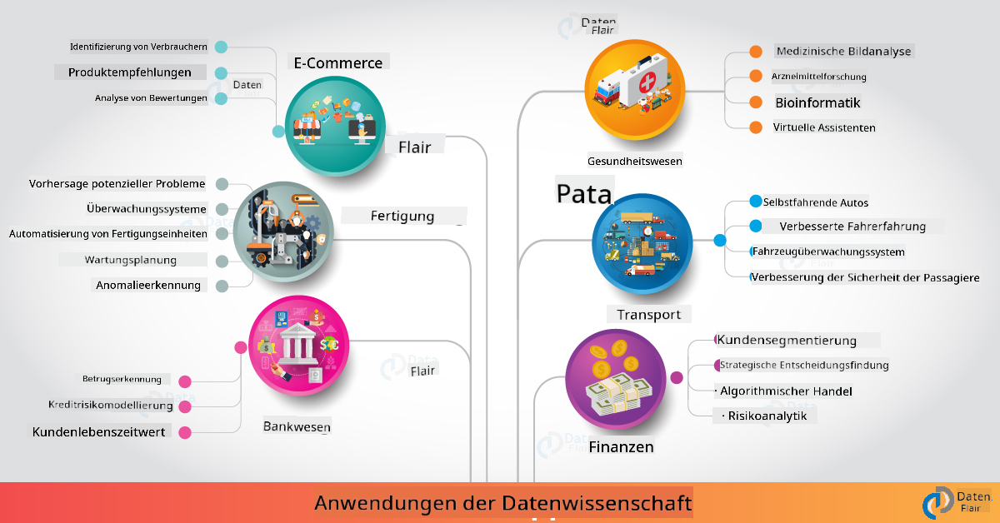

<!--
CO_OP_TRANSLATOR_METADATA:
{
  "original_hash": "0f67a4139454816631526779a456b734",
  "translation_date": "2025-09-06T18:12:40+00:00",
  "source_file": "6-Data-Science-In-Wild/20-Real-World-Examples/README.md",
  "language_code": "de"
}
-->
# Datenwissenschaft in der realen Welt

|  ](../../sketchnotes/20-DataScience-RealWorld.png) |
| :--------------------------------------------------------------------------------------------------------------: |
|               Datenwissenschaft in der realen Welt - _Sketchnote von [@nitya](https://twitter.com/nitya)_               |

Wir sind fast am Ende dieser Lernreise angekommen!

Wir haben mit Definitionen von Datenwissenschaft und Ethik begonnen, verschiedene Werkzeuge und Techniken für Datenanalyse und -visualisierung erkundet, den Lebenszyklus der Datenwissenschaft überprüft und uns mit der Skalierung und Automatisierung von Datenwissenschafts-Workflows mithilfe von Cloud-Computing-Diensten beschäftigt. Jetzt fragen Sie sich wahrscheinlich: _"Wie genau kann ich all diese Erkenntnisse auf reale Kontexte anwenden?"_

In dieser Lektion werden wir reale Anwendungen der Datenwissenschaft in verschiedenen Branchen untersuchen und spezifische Beispiele aus den Bereichen Forschung, digitale Geisteswissenschaften und Nachhaltigkeit betrachten. Wir werden Möglichkeiten für Studentenprojekte beleuchten und mit nützlichen Ressourcen abschließen, die Ihnen helfen, Ihre Lernreise fortzusetzen!

## Quiz vor der Vorlesung

## [Quiz vor der Vorlesung](https://ff-quizzes.netlify.app/en/ds/quiz/38)

## Datenwissenschaft + Industrie

Dank der Demokratisierung von KI finden Entwickler es jetzt einfacher, KI-gesteuerte Entscheidungsfindung und datengestützte Erkenntnisse in Benutzererfahrungen und Entwicklungs-Workflows zu integrieren. Hier sind einige Beispiele dafür, wie Datenwissenschaft in der Industrie "angewendet" wird:

 * [Google Flu Trends](https://www.wired.com/2015/10/can-learn-epic-failure-google-flu-trends/) nutzte Datenwissenschaft, um Suchbegriffe mit Grippe-Trends zu korrelieren. Obwohl der Ansatz Schwächen hatte, machte er auf die Möglichkeiten (und Herausforderungen) datengestützter Gesundheitsvorhersagen aufmerksam.

 * [UPS Routing Predictions](https://www.technologyreview.com/2018/11/21/139000/how-ups-uses-ai-to-outsmart-bad-weather/) - erklärt, wie UPS Datenwissenschaft und maschinelles Lernen nutzt, um optimale Lieferwege vorherzusagen, unter Berücksichtigung von Wetterbedingungen, Verkehrsaufkommen, Lieferfristen und mehr.

 * [NYC Taxicab Route Visualization](http://chriswhong.github.io/nyctaxi/) - Daten, die mithilfe von [Freedom Of Information Laws](https://chriswhong.com/open-data/foil_nyc_taxi/) gesammelt wurden, halfen dabei, einen Tag im Leben von NYC-Taxis zu visualisieren. Dies ermöglicht ein besseres Verständnis dafür, wie sie sich durch die geschäftige Stadt bewegen, wie viel Geld sie verdienen und wie lange Fahrten über einen Zeitraum von 24 Stunden dauern.

 * [Uber Data Science Workbench](https://eng.uber.com/dsw/) - nutzt Daten (zu Abhol- und Absetzorten, Fahrtdauer, bevorzugten Routen usw.), die täglich aus Millionen von Uber-Fahrten gesammelt werden, um ein Datenanalysetool zu entwickeln, das bei Preisgestaltung, Sicherheit, Betrugserkennung und Navigationsentscheidungen hilft.

 * [Sportanalytik](https://towardsdatascience.com/scope-of-analytics-in-sports-world-37ed09c39860) - konzentriert sich auf _prädiktive Analytik_ (Team- und Spieleranalyse - denken Sie an [Moneyball](https://datasciencedegree.wisconsin.edu/blog/moneyball-proves-importance-big-data-big-ideas/) - und Fanmanagement) und _Datenvisualisierung_ (Team- und Fan-Dashboards, Spiele usw.) mit Anwendungen wie Talentsuche, Sportwetten und Inventar-/Verwaltungsmanagement von Veranstaltungsorten.

 * [Datenwissenschaft im Bankwesen](https://data-flair.training/blogs/data-science-in-banking/) - hebt den Wert der Datenwissenschaft in der Finanzbranche hervor, mit Anwendungen von Risikomodellierung und Betrugserkennung bis hin zu Kundensegmentierung, Echtzeitvorhersagen und Empfehlungssystemen. Prädiktive Analytik treibt auch wichtige Maßnahmen wie [Kreditbewertungen](https://dzone.com/articles/using-big-data-and-predictive-analytics-for-credit) voran.

 * [Datenwissenschaft im Gesundheitswesen](https://data-flair.training/blogs/data-science-in-healthcare/) - hebt Anwendungen wie medizinische Bildgebung (z. B. MRT, Röntgen, CT-Scan), Genomik (DNA-Sequenzierung), Arzneimittelentwicklung (Risikobewertung, Erfolgsvorhersage), prädiktive Analytik (Patientenversorgung & Logistik), Krankheitsüberwachung und -prävention hervor.

 Bildnachweis: [Data Flair: 6 Amazing Data Science Applications ](https://data-flair.training/blogs/data-science-applications/)

Die Abbildung zeigt weitere Bereiche und Beispiele für die Anwendung von Datenwissenschaftstechniken. Möchten Sie weitere Anwendungen erkunden? Schauen Sie sich den Abschnitt [Review & Self Study](../../../../6-Data-Science-In-Wild/20-Real-World-Examples) unten an.

## Datenwissenschaft + Forschung

|  ](../../sketchnotes/20-DataScience-Research.png) |
| :---------------------------------------------------------------------------------------------------------------: |
|              Datenwissenschaft & Forschung - _Sketchnote von [@nitya](https://twitter.com/nitya)_              |

Während reale Anwendungen oft auf groß angelegte industrielle Anwendungsfälle abzielen, können _Forschungsprojekte_ aus zwei Perspektiven nützlich sein:

* _Innovationsmöglichkeiten_ - schnelle Prototypenentwicklung fortschrittlicher Konzepte und Tests von Benutzererfahrungen für Anwendungen der nächsten Generation.
* _Herausforderungen bei der Implementierung_ - Untersuchung potenzieller Schäden oder unbeabsichtigter Konsequenzen von Datenwissenschaftstechnologien in realen Kontexten.

Für Studenten können diese Forschungsprojekte sowohl Lern- als auch Kooperationsmöglichkeiten bieten, die Ihr Verständnis des Themas verbessern und Ihr Bewusstsein sowie Ihre Interaktion mit relevanten Personen oder Teams in Interessensgebieten erweitern. Wie sehen Forschungsprojekte aus und welchen Einfluss können sie haben?

Schauen wir uns ein Beispiel an - die [MIT Gender Shades Studie](http://gendershades.org/overview.html) von Joy Buolamwini (MIT Media Labs) mit einem [signifikanten Forschungsartikel](http://proceedings.mlr.press/v81/buolamwini18a/buolamwini18a.pdf), der zusammen mit Timnit Gebru (damals bei Microsoft Research) verfasst wurde und sich auf Folgendes konzentrierte:

 * **Was:** Ziel des Forschungsprojekts war es, _Bias in automatisierten Gesichtsanalysealgorithmen und Datensätzen_ basierend auf Geschlecht und Hauttyp zu bewerten.
 * **Warum:** Gesichtsanalyse wird in Bereichen wie Strafverfolgung, Flughafensicherheit, Einstellungssystemen und mehr eingesetzt - Kontexte, in denen ungenaue Klassifikationen (z. B. aufgrund von Bias) potenzielle wirtschaftliche und soziale Schäden für betroffene Einzelpersonen oder Gruppen verursachen können. Das Verständnis (und die Beseitigung oder Minderung) von Bias ist entscheidend für Fairness in der Nutzung.
 * **Wie:** Die Forscher erkannten, dass bestehende Benchmarks überwiegend hellhäutige Probanden verwendeten, und kuratierten einen neuen Datensatz (1000+ Bilder), der _ausgewogener_ nach Geschlecht und Hauttyp war. Der Datensatz wurde verwendet, um die Genauigkeit von drei Geschlechtsklassifikationsprodukten (von Microsoft, IBM & Face++) zu bewerten.

Die Ergebnisse zeigten, dass die Gesamtklassifikationsgenauigkeit zwar gut war, es jedoch deutliche Unterschiede in den Fehlerraten zwischen verschiedenen Untergruppen gab - mit **Fehlklassifikationen** häufiger bei Frauen oder Personen mit dunklerer Hautfarbe, was auf Bias hinweist.

**Wichtige Ergebnisse:** Es wurde deutlich, dass die Datenwissenschaft mehr _repräsentative Datensätze_ (ausgewogene Untergruppen) und mehr _inklusive Teams_ (diverse Hintergründe) benötigt, um solche Biases früher in KI-Lösungen zu erkennen und zu beseitigen oder zu mindern. Forschungsbemühungen wie diese sind auch entscheidend dafür, dass viele Organisationen Prinzipien und Praktiken für _verantwortungsvolle KI_ definieren, um Fairness in ihren KI-Produkten und -Prozessen zu verbessern.

**Möchten Sie mehr über relevante Forschungsbemühungen bei Microsoft erfahren?**

* Schauen Sie sich [Microsoft Research Projects](https://www.microsoft.com/research/research-area/artificial-intelligence/?facet%5Btax%5D%5Bmsr-research-area%5D%5B%5D=13556&facet%5Btax%5D%5Bmsr-content-type%5D%5B%5D=msr-project) zu Künstlicher Intelligenz an.
* Erkunden Sie Studentenprojekte von der [Microsoft Research Data Science Summer School](https://www.microsoft.com/en-us/research/academic-program/data-science-summer-school/).
* Schauen Sie sich das [Fairlearn](https://fairlearn.org/) Projekt und die [Responsible AI](https://www.microsoft.com/en-us/ai/responsible-ai?activetab=pivot1%3aprimaryr6) Initiativen an.

## Datenwissenschaft + Geisteswissenschaften

|  ](../../sketchnotes/20-DataScience-Humanities.png) |
| :---------------------------------------------------------------------------------------------------------------: |
|              Datenwissenschaft & Digitale Geisteswissenschaften - _Sketchnote von [@nitya](https://twitter.com/nitya)_              |

Digitale Geisteswissenschaften [wurden definiert](https://digitalhumanities.stanford.edu/about-dh-stanford) als "eine Sammlung von Praktiken und Ansätzen, die computergestützte Methoden mit geisteswissenschaftlicher Forschung kombinieren". [Stanford-Projekte](https://digitalhumanities.stanford.edu/projects) wie _"Rebooting History"_ und _"Poetic Thinking"_ illustrieren die Verbindung zwischen [Digital Humanities und Datenwissenschaft](https://digitalhumanities.stanford.edu/digital-humanities-and-data-science) - mit Schwerpunkt auf Techniken wie Netzwerkanalyse, Informationsvisualisierung, räumliche und Textanalyse, die uns helfen können, historische und literarische Datensätze neu zu betrachten, um neue Erkenntnisse und Perspektiven zu gewinnen.

*Möchten Sie ein Projekt in diesem Bereich erkunden und erweitern?*

Schauen Sie sich ["Emily Dickinson and the Meter of Mood"](https://gist.github.com/jlooper/ce4d102efd057137bc000db796bfd671) an - ein großartiges Beispiel von [Jen Looper](https://twitter.com/jenlooper), das fragt, wie wir Datenwissenschaft nutzen können, um vertraute Poesie neu zu betrachten und ihre Bedeutung sowie die Beiträge ihrer Autorin in neuen Kontexten zu bewerten. Zum Beispiel: _Können wir die Jahreszeit vorhersagen, in der ein Gedicht verfasst wurde, indem wir seinen Ton oder seine Stimmung analysieren_ - und was sagt uns das über den Geisteszustand der Autorin in der relevanten Zeit?

Um diese Frage zu beantworten, folgen wir den Schritten des Lebenszyklus der Datenwissenschaft:
 * [`Datenerfassung`](https://gist.github.com/jlooper/ce4d102efd057137bc000db796bfd671#acquiring-the-dataset) - um einen relevanten Datensatz für die Analyse zu sammeln. Optionen umfassen die Nutzung einer API (z. B. [Poetry DB API](https://poetrydb.org/index.html)) oder das Scrapen von Webseiten (z. B. [Project Gutenberg](https://www.gutenberg.org/files/12242/12242-h/12242-h.htm)) mit Tools wie [Scrapy](https://scrapy.org/).
 * [`Datenbereinigung`](https://gist.github.com/jlooper/ce4d102efd057137bc000db796bfd671#clean-the-data) - erklärt, wie Text formatiert, bereinigt und vereinfacht werden kann, mithilfe grundlegender Tools wie Visual Studio Code und Microsoft Excel.
 * [`Datenanalyse`](https://gist.github.com/jlooper/ce4d102efd057137bc000db796bfd671#working-with-the-data-in-a-notebook) - erklärt, wie wir den Datensatz jetzt in "Notebooks" für die Analyse importieren können, mithilfe von Python-Paketen (wie pandas, numpy und matplotlib), um die Daten zu organisieren und zu visualisieren.
 * [`Stimmungsanalyse`](https://gist.github.com/jlooper/ce4d102efd057137bc000db796bfd671#sentiment-analysis-using-cognitive-services) - erklärt, wie wir Cloud-Dienste wie Text Analytics integrieren können, mithilfe von Low-Code-Tools wie [Power Automate](https://flow.microsoft.com/en-us/) für automatisierte Datenverarbeitungs-Workflows.

Mit diesem Workflow können wir die saisonalen Auswirkungen auf die Stimmung der Gedichte untersuchen und uns eigene Perspektiven auf die Autorin schaffen. Probieren Sie es selbst aus - erweitern Sie dann das Notebook, um andere Fragen zu stellen oder die Daten auf neue Weise zu visualisieren!

> Sie können einige der Tools im [Digital Humanities Toolkit](https://github.com/Digital-Humanities-Toolkit) nutzen, um diese Forschungsansätze weiterzuverfolgen.

## Datenwissenschaft + Nachhaltigkeit

|  ](../../sketchnotes/20-DataScience-Sustainability.png) |
| :---------------------------------------------------------------------------------------------------------------: |
|              Datenwissenschaft & Nachhaltigkeit - _Sketchnote von [@nitya](https://twitter.com/nitya)_              |

Die [Agenda 2030 für nachhaltige Entwicklung](https://sdgs.un.org/2030agenda) - 2015 von allen Mitgliedern der Vereinten Nationen verabschiedet - identifiziert 17 Ziele, darunter solche, die sich auf den **Schutz des Planeten** vor Degradierung und den Auswirkungen des Klimawandels konzentrieren. Die [Microsoft Nachhaltigkeitsinitiative](https://www.microsoft.com/en-us/sustainability) unterstützt diese Ziele, indem sie untersucht, wie technologische Lösungen nachhaltigere Zukünfte fördern können, mit einem [Fokus auf 4 Ziele](https://dev.to/azure/a-visual-guide-to-sustainable-software-engineering-53hh) - bis 2030 kohlenstoffnegativ, wasserpositiv, abfallfrei und biodivers zu sein.

Die Bewältigung dieser Herausforderungen auf skalierbare und zeitnahe Weise erfordert Cloud-Denken und groß angelegte Daten. Die [Planetary Computer](https://planetarycomputer.microsoft.com/) Initiative bietet 4 Komponenten, die Datenwissenschaftler und Entwickler bei dieser Aufgabe unterstützen:

 * [Datenkatalog](https://planetarycomputer.microsoft.com/catalog) - mit Petabytes an Erd-System-Daten (kostenlos & Azure-gehostet).
 * [Planetary API](https://planetarycomputer.microsoft.com/docs/reference/stac/) - um Nutzern zu helfen, relevante Daten über Raum und Zeit hinweg zu suchen.
 * [Hub](https://planetarycomputer.microsoft.com/docs/overview/environment/) - verwaltete Umgebung für Wissenschaftler zur Verarbeitung massiver geospatialer Datensätze.
 * [Anwendungen](https://planetarycomputer.microsoft.com/applications) - zeigen Anwendungsfälle und Tools für Nachhaltigkeitserkenntnisse.
**Das Planetary Computer Projekt befindet sich derzeit in der Vorschau (Stand September 2021)** - hier erfahren Sie, wie Sie mit Datenwissenschaft zur Entwicklung nachhaltiger Lösungen beitragen können.

* [Zugang beantragen](https://planetarycomputer.microsoft.com/account/request), um mit der Erkundung zu beginnen und sich mit Gleichgesinnten zu vernetzen.
* [Dokumentation erkunden](https://planetarycomputer.microsoft.com/docs/overview/about), um unterstützte Datensätze und APIs zu verstehen.
* Anwendungen wie [Ecosystem Monitoring](https://analytics-lab.org/ecosystemmonitoring/) erkunden, um Inspiration für Anwendungsideen zu erhalten.

Denken Sie darüber nach, wie Sie Datenvisualisierung nutzen können, um relevante Erkenntnisse in Bereichen wie Klimawandel und Abholzung sichtbar zu machen oder zu verstärken. Oder überlegen Sie, wie Erkenntnisse genutzt werden können, um neue Benutzererlebnisse zu schaffen, die Verhaltensänderungen für ein nachhaltigeres Leben motivieren.

## Datenwissenschaft + Studierende

Wir haben über reale Anwendungen in Industrie und Forschung gesprochen und Beispiele für Datenwissenschaftsanwendungen in den digitalen Geisteswissenschaften und der Nachhaltigkeit untersucht. Wie können Sie also Ihre Fähigkeiten entwickeln und Ihr Wissen als Anfänger*innen in der Datenwissenschaft teilen?

Hier sind einige Beispiele für Datenwissenschaftsprojekte von Studierenden, die Sie inspirieren können:

* [MSR Data Science Summer School](https://www.microsoft.com/en-us/research/academic-program/data-science-summer-school/#!projects) mit GitHub [Projekten](https://github.com/msr-ds3), die Themen wie folgende erforschen:
    - [Rassistische Vorurteile bei Polizeigewalt](https://www.microsoft.com/en-us/research/video/data-science-summer-school-2019-replicating-an-empirical-analysis-of-racial-differences-in-police-use-of-force/) | [Github](https://github.com/msr-ds3/stop-question-frisk)
    - [Zuverlässigkeit des U-Bahn-Systems in NYC](https://www.microsoft.com/en-us/research/video/data-science-summer-school-2018-exploring-the-reliability-of-the-nyc-subway-system/) | [Github](https://github.com/msr-ds3/nyctransit)
* [Digitalisierung materieller Kultur: Untersuchung sozioökonomischer Verteilungen in Sirkap](https://claremont.maps.arcgis.com/apps/Cascade/index.html?appid=bdf2aef0f45a4674ba41cd373fa23afc) - von [Ornella Altunyan](https://twitter.com/ornelladotcom) und ihrem Team in Claremont, unter Verwendung von [ArcGIS StoryMaps](https://storymaps.arcgis.com/).

## 🚀 Herausforderung

Suchen Sie nach Artikeln, die Datenwissenschaftsprojekte empfehlen, die für Anfänger*innen geeignet sind - wie [diese 50 Themenbereiche](https://www.upgrad.com/blog/data-science-project-ideas-topics-beginners/) oder [diese 21 Projektideen](https://www.intellspot.com/data-science-project-ideas) oder [diese 16 Projekte mit Quellcode](https://data-flair.training/blogs/data-science-project-ideas/), die Sie analysieren und neu kombinieren können. Und vergessen Sie nicht, über Ihre Lernreisen zu bloggen und Ihre Erkenntnisse mit uns allen zu teilen.

## Quiz nach der Vorlesung

## [Quiz nach der Vorlesung](https://ff-quizzes.netlify.app/en/ds/quiz/39)

## Überprüfung & Selbststudium

Möchten Sie weitere Anwendungsfälle erkunden? Hier sind einige relevante Artikel:
* [17 Anwendungen und Beispiele für Datenwissenschaft](https://builtin.com/data-science/data-science-applications-examples) - Juli 2021
* [11 beeindruckende Anwendungen der Datenwissenschaft in der realen Welt](https://myblindbird.com/data-science-applications-real-world/) - Mai 2021
* [Datenwissenschaft in der realen Welt](https://towardsdatascience.com/data-science-in-the-real-world/home) - Artikelsammlung
* [12 reale Anwendungen der Datenwissenschaft mit Beispielen](https://www.scaler.com/blog/data-science-applications/) - Mai 2024
* Datenwissenschaft in: [Bildung](https://data-flair.training/blogs/data-science-in-education/), [Landwirtschaft](https://data-flair.training/blogs/data-science-in-agriculture/), [Finanzen](https://data-flair.training/blogs/data-science-in-finance/), [Filme](https://data-flair.training/blogs/data-science-at-movies/), [Gesundheitswesen](https://onlinedegrees.sandiego.edu/data-science-health-care/) und mehr.

## Aufgabe

[Erkunden Sie einen Planetary Computer-Datensatz](assignment.md)

---

**Haftungsausschluss**:  
Dieses Dokument wurde mithilfe des KI-Übersetzungsdienstes [Co-op Translator](https://github.com/Azure/co-op-translator) übersetzt. Obwohl wir uns um Genauigkeit bemühen, weisen wir darauf hin, dass automatisierte Übersetzungen Fehler oder Ungenauigkeiten enthalten können. Das Originaldokument in seiner ursprünglichen Sprache sollte als maßgebliche Quelle betrachtet werden. Für kritische Informationen wird eine professionelle menschliche Übersetzung empfohlen. Wir übernehmen keine Haftung für Missverständnisse oder Fehlinterpretationen, die sich aus der Nutzung dieser Übersetzung ergeben.