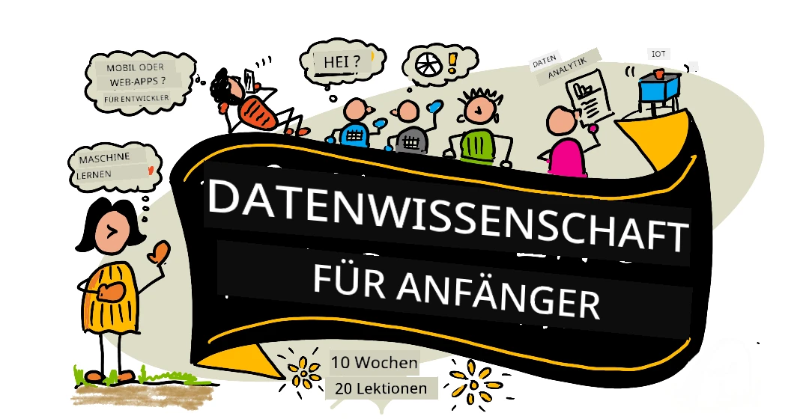
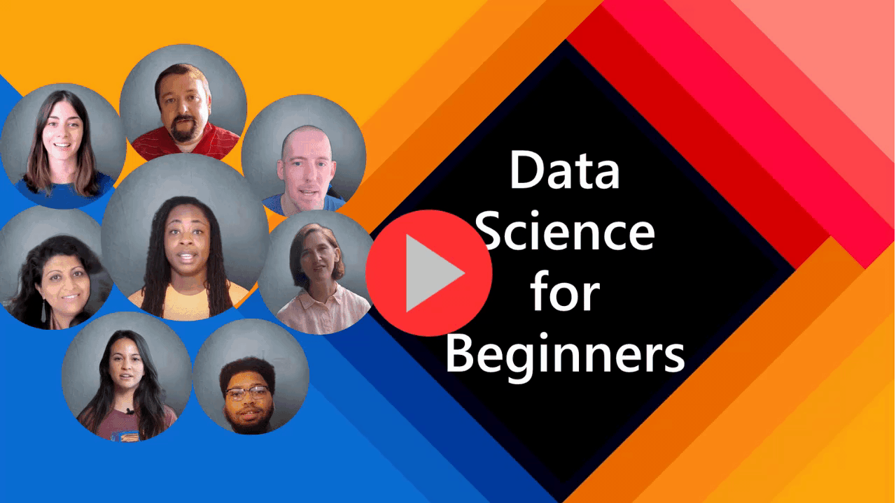
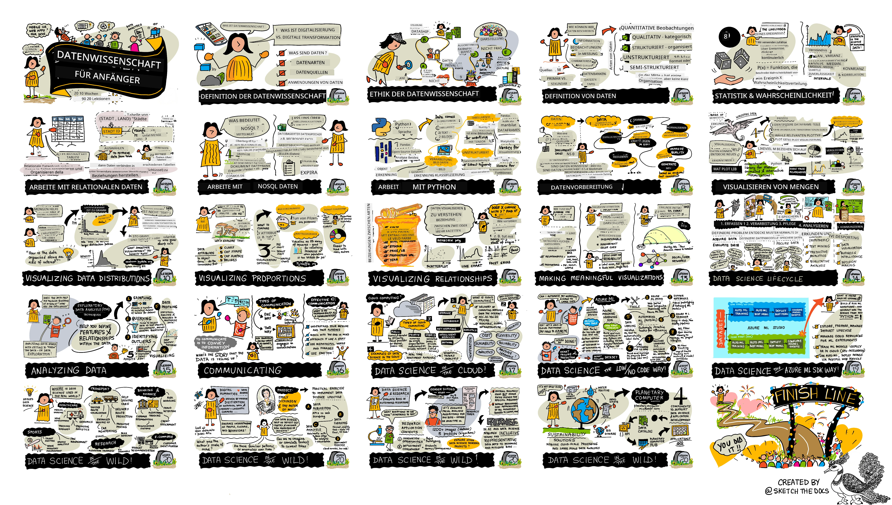

# Data Science für Einsteiger - Ein Lehrplan

[](https://github.com/codespaces/new?hide_repo_select=true&ref=main&repo=344191198)

[](https://github.com/microsoft/Data-Science-For-Beginners/blob/master/LICENSE)
[](https://GitHub.com/microsoft/Data-Science-For-Beginners/graphs/contributors/)
[](https://GitHub.com/microsoft/Data-Science-For-Beginners/issues/)
[](https://GitHub.com/microsoft/Data-Science-For-Beginners/pulls/)
[](http://makeapullrequest.com)

[](https://GitHub.com/microsoft/Data-Science-For-Beginners/watchers/)
[](https://GitHub.com/microsoft/Data-Science-For-Beginners/network/)
[](https://GitHub.com/microsoft/Data-Science-For-Beginners/stargazers/)


[](https://discord.gg/nTYy5BXMWG)

[](https://aka.ms/foundry/forum)

Die Azure Cloud Advocates bei Microsoft freuen sich, einen 10-wöchigen Lehrplan mit 20 Lektionen rund um Data Science anzubieten. Jede Lektion beinhaltet Vor- und Nachquiz, schriftliche Anweisungen zum Abschluss der Lektion, eine Lösung und eine Aufgabe. Unsere projektorientierte Pädagogik ermöglicht es Ihnen, während des Lernens zu bauen, eine bewährte Methode, damit neue Fähigkeiten „haften bleiben“.

**Herzlichen Dank an unsere Autoren:** [Jasmine Greenaway](https://www.twitter.com/paladique), [Dmitry Soshnikov](http://soshnikov.com), [Nitya Narasimhan](https://twitter.com/nitya), [Jalen McGee](https://twitter.com/JalenMcG), [Jen Looper](https://twitter.com/jenlooper), [Maud Levy](https://twitter.com/maudstweets), [Tiffany Souterre](https://twitter.com/TiffanySouterre), [Christopher Harrison](https://www.twitter.com/geektrainer).

**🙏 Besonderer Dank 🙏 an unsere [Microsoft Student Ambassador](https://studentambassadors.microsoft.com/) Autoren, Gutachter und Inhaltsbeiträge,** insbesondere Aaryan Arora, [Aditya Garg](https://github.com/AdityaGarg00), [Alondra Sanchez](https://www.linkedin.com/in/alondra-sanchez-molina/), [Ankita Singh](https://www.linkedin.com/in/ankitasingh007), [Anupam Mishra](https://www.linkedin.com/in/anupam--mishra/), [Arpita Das](https://www.linkedin.com/in/arpitadas01/), ChhailBihari Dubey, [Dibri Nsofor](https://www.linkedin.com/in/dibrinsofor), [Dishita Bhasin](https://www.linkedin.com/in/dishita-bhasin-7065281bb), [Majd Safi](https://www.linkedin.com/in/majd-s/), [Max Blum](https://www.linkedin.com/in/max-blum-6036a1186/), [Miguel Correa](https://www.linkedin.com/in/miguelmque/), [Mohamma Iftekher (Iftu) Ebne Jalal](https://twitter.com/iftu119), [Nawrin Tabassum](https://www.linkedin.com/in/nawrin-tabassum), [Raymond Wangsa Putra](https://www.linkedin.com/in/raymond-wp/), [Rohit Yadav](https://www.linkedin.com/in/rty2423), Samridhi Sharma, [Sanya Sinha](https://www.linkedin.com/mwlite/in/sanya-sinha-13aab1200),
[Sheena Narula](https://www.linkedin.com/in/sheena-narua-n/), [Tauqeer Ahmad](https://www.linkedin.com/in/tauqeerahmad5201/), Yogendrasingh Pawar , [Vidushi Gupta](https://www.linkedin.com/in/vidushi-gupta07/), [Jasleen Sondhi](https://www.linkedin.com/in/jasleen-sondhi/)

||
|:---:|
| Data Science für Einsteiger - _Sketchnote von [@nitya](https://twitter.com/nitya)_ |

### 🌐 Mehrsprachige Unterstützung

#### Unterstützt über GitHub Action (Automatisiert & immer aktuell)

<!-- CO-OP TRANSLATOR LANGUAGES TABLE START -->
[Arabisch](../ar/README.md) | [Bengalisch](../bn/README.md) | [Bulgarisch](../bg/README.md) | [Burmese (Myanmar)](../my/README.md) | [Chinesisch (Vereinfacht)](../zh-CN/README.md) | [Chinesisch (Traditionell, Hongkong)](../zh-HK/README.md) | [Chinesisch (Traditionell, Macau)](../zh-MO/README.md) | [Chinesisch (Traditionell, Taiwan)](../zh-TW/README.md) | [Kroatisch](../hr/README.md) | [Tschechisch](../cs/README.md) | [Dänisch](../da/README.md) | [Niederländisch](../nl/README.md) | [Estnisch](../et/README.md) | [Finnisch](../fi/README.md) | [Französisch](../fr/README.md) | [Deutsch](./README.md) | [Griechisch](../el/README.md) | [Hebräisch](../he/README.md) | [Hindi](../hi/README.md) | [Ungarisch](../hu/README.md) | [Indonesisch](../id/README.md) | [Italienisch](../it/README.md) | [Japanisch](../ja/README.md) | [Kannada](../kn/README.md) | [Khmer](../km/README.md) | [Koreanisch](../ko/README.md) | [Litauisch](../lt/README.md) | [Malaiisch](../ms/README.md) | [Malayalam](../ml/README.md) | [Marathi](../mr/README.md) | [Nepalesisch](../ne/README.md) | [Nigerianisches Pidgin](../pcm/README.md) | [Norwegisch](../no/README.md) | [Persisch (Farsi)](../fa/README.md) | [Polnisch](../pl/README.md) | [Portugiesisch (Brasilien)](../pt-BR/README.md) | [Portugiesisch (Portugal)](../pt-PT/README.md) | [Punjabi (Gurmukhi)](../pa/README.md) | [Rumänisch](../ro/README.md) | [Russisch](../ru/README.md) | [Serbisch (Kyrillisch)](../sr/README.md) | [Slowakisch](../sk/README.md) | [Slowenisch](../sl/README.md) | [Spanisch](../es/README.md) | [Swahili](../sw/README.md) | [Schwedisch](../sv/README.md) | [Tagalog (Filipino)](../tl/README.md) | [Tamil](../ta/README.md) | [Telugu](../te/README.md) | [Thailändisch](../th/README.md) | [Türkisch](../tr/README.md) | [Ukrainisch](../uk/README.md) | [Urdu](../ur/README.md) | [Vietnamesisch](../vi/README.md)

> **Bevorzugen Sie einen lokalen Klon?**
>
> Dieses Repository enthält über 50 Sprachübersetzungen, was die Download-Größe deutlich erhöht. Um ohne Übersetzungen zu klonen, verwenden Sie Sparse Checkout:
>
> **Bash / macOS / Linux:**
> ```bash
> git clone --filter=blob:none --sparse https://github.com/microsoft/Data-Science-For-Beginners.git
> cd Data-Science-For-Beginners
> git sparse-checkout set --no-cone '/*' '!translations' '!translated_images'
> ```
>
> **CMD (Windows):**
> ```cmd
> git clone --filter=blob:none --sparse https://github.com/microsoft/Data-Science-For-Beginners.git
> cd Data-Science-For-Beginners
> git sparse-checkout set --no-cone "/*" "!translations" "!translated_images"
> ```
>
> Damit erhalten Sie alles, was Sie für den Kurs benötigen, mit einem viel schnelleren Download.
<!-- CO-OP TRANSLATOR LANGUAGES TABLE END -->

**Falls Sie zusätzliche Übersetzungs-sprachen wünschen, sind diese [hier](https://github.com/Azure/co-op-translator/blob/main/getting_started/supported-languages.md) aufgelistet**

#### Werden Sie Teil unserer Community  
[](https://discord.gg/nTYy5BXMWG)

Wir haben eine Discord-Lernreihe mit AI laufend, erfahren Sie mehr und machen Sie mit bei [Learn with AI Series](https://aka.ms/learnwithai/discord) vom 18. bis 30. September 2025. Sie erhalten Tipps und Tricks zur Nutzung von GitHub Copilot für Data Science.


# Sind Sie Student?

Beginnen Sie mit den folgenden Ressourcen:

- [Student Hub Seite](https://docs.microsoft.com/en-gb/learn/student-hub?WT.mc_id=academic-77958-bethanycheum) Auf dieser Seite finden Sie Anfängerressourcen, Studentensets und sogar Möglichkeiten, ein kostenloses Zertifikatgutschein zu erhalten. Diese Seite sollten Sie sich als Lesezeichen setzen und von Zeit zu Zeit überprüfen, da wir den Inhalt mindestens monatlich wechseln.
- [Microsoft Learn Student Ambassadors](https://studentambassadors.microsoft.com?WT.mc_id=academic-77958-bethanycheum) Treten Sie einer globalen Community von Student Ambassadors bei, dies könnte Ihr Weg zu Microsoft sein.

# Erste Schritte

## 📚 Dokumentation

- **[Installationsanleitung](INSTALLATION.md)** - Schritt-für-Schritt-Anweisungen für Anfänger
- **[Nutzungsanleitung](USAGE.md)** - Beispiele und typische Abläufe
- **[Fehlerbehebung](TROUBLESHOOTING.md)** - Lösungen für häufige Probleme
- **[Beitragsleitfaden](CONTRIBUTING.md)** - Wie man zu diesem Projekt beiträgt
- **[Für Lehrer](for-teachers.md)** - Lehranleitungen und Unterrichtsmaterialien

## 👨‍🎓 Für Studenten
> **Absolute Anfänger**: Neu in Data Science? Beginnen Sie mit unseren [anfängerfreundlichen Beispielen](examples/README.md)! Diese einfachen, gut kommentierten Beispiele helfen Ihnen, die Grundlagen zu verstehen, bevor Sie in den vollständigen Lehrplan eintauchen.
> **[Studenten](https://aka.ms/student-page)**: um diesen Lehrplan selbstständig zu nutzen, forken Sie das ganze Repository und bearbeiten Sie die Übungen eigenständig, beginnend mit einem Vorlesungsquiz. Lesen Sie dann die Vorlesung und absolvieren Sie die weiteren Aktivitäten. Versuchen Sie, die Projekte zu erstellen, indem Sie die Lektionen verstehen, statt den Lösungscode zu kopieren; dieser Code ist jedoch in den /solutions-Ordnern jeder projektorientierten Lektion verfügbar. Eine weitere Idee ist, eine Lerngruppe mit Freunden zu bilden und den Inhalt gemeinsam durchzugehen. Für weiteres Studium empfehlen wir [Microsoft Learn](https://docs.microsoft.com/en-us/users/jenlooper-2911/collections/qprpajyoy3x0g7?WT.mc_id=academic-77958-bethanycheum).

**Schnellstart:**
1. Lesen Sie die [Installationsanleitung](INSTALLATION.md), um Ihre Umgebung einzurichten
2. Überprüfen Sie die [Nutzungsanleitung](USAGE.md), um zu lernen, wie man mit dem Lehrplan arbeitet
3. Beginnen Sie mit Lektion 1 und arbeiten Sie sich der Reihe nach durch
4. Treten Sie unserer [Discord-Community](https://aka.ms/ds4beginners/discord) für Unterstützung bei

## 👩‍🏫 Für Lehrer
> **Lehrkräfte**: Wir haben [einige Vorschläge](for-teachers.md) aufgenommen, wie Sie dieses Curriculum nutzen können. Wir würden uns über Ihr Feedback [in unserem Diskussionsforum](https://github.com/microsoft/Data-Science-For-Beginners/discussions) sehr freuen!

## Lernen Sie das Team kennen

[](https://youtu.be/8mzavjQSMM4 "Promo-Video")

**Gif von** [Mohit Jaisal](https://www.linkedin.com/in/mohitjaisal)

> 🎥 Klicken Sie auf das Bild oben für ein Video über das Projekt und die Leute, die es erstellt haben!

## Pädagogik

Wir haben beim Erstellen dieses Curriculums zwei pädagogische Grundsätze gewählt: sicherzustellen, dass es projektbasiert ist und dass es häufige Quizze beinhaltet. Am Ende dieser Reihe werden die Lernenden grundlegende Prinzipien der Datenwissenschaft gelernt haben, einschließlich ethischer Konzepte, Datenvorbereitung, verschiedener Arbeitsweisen mit Daten, Datenvisualisierung, Datenanalyse, Anwendungsfälle der Datenwissenschaft in der Praxis und mehr.

Zusätzlich setzt ein Quiz vor der Unterrichtsstunde eine Lernabsicht beim Lernenden, während ein zweites Quiz nach dem Unterricht die weitere Behaltensleistung sicherstellt. Dieses Curriculum wurde so gestaltet, dass es flexibel und unterhaltsam ist und ganz oder teilweise durchlaufen werden kann. Die Projekte starten klein und werden bis zum Ende des 10-Wochen-Zyklus zunehmend komplexer.

> Finden Sie unseren [Verhaltenskodex](CODE_OF_CONDUCT.md), [Beitragsleitfäden](CONTRIBUTING.md), [Übersetzungsleitfäden](TRANSLATIONS.md). Wir freuen uns über Ihr konstruktives Feedback!

## Jede Lektion beinhaltet:

- Optionale Sketchnote
- Optionales ergänzendes Video
- Aufwärmquiz vor der Lektion
- Schriftliche Lektion
- Für projektbasierte Lektionen Schritt-für-Schritt-Anleitungen zum Bau des Projekts
- Wissensüberprüfungen
- Eine Herausforderung
- Ergänzende Lektüre
- Aufgabe
- [Quiz nach der Lektion](https://ff-quizzes.netlify.app/en/)

> **Ein Hinweis zu den Quizzen**: Alle Quizze befinden sich im Ordner Quiz-App, insgesamt 40 Quizze mit jeweils drei Fragen. Sie sind aus den Lektionen verlinkt, aber die Quiz-App kann lokal ausgeführt oder auf Azure bereitgestellt werden; folgen Sie den Anweisungen im `quiz-app`-Ordner. Sie werden zunehmend lokalisiert.

## 🎓 Beispiele für Einsteiger:innen

**Neu in der Datenwissenschaft?** Wir haben ein spezielles [Beispielverzeichnis](examples/README.md) mit einfachem, gut kommentiertem Code erstellt, um dir den Einstieg zu erleichtern:

- 🌟 **Hello World** - Dein erstes Datenwissenschaftsprogramm
- 📂 **Daten laden** - Lernen, Datensätze zu lesen und zu erkunden
- 📊 **Einfache Analyse** - Statistiken berechnen und Muster finden
- 📈 **Grundlegende Visualisierung** - Diagramme und Grafiken erstellen
- 🔬 **Praxisprojekt** - Kompletten Workflow von Anfang bis Ende durchlaufen

Jedes Beispiel enthält ausführliche Kommentare, die jeden Schritt erklären – perfekt für absolute Anfänger:innen!

👉 **[Starte mit den Beispielen](examples/README.md)** 👈

## Lektionen


||
|:---:|
| Data Science For Beginners: Roadmap - _Sketchnote von [@nitya](https://twitter.com/nitya)_ |


| Lektion Nummer | Thema | Lektion Gruppierung | Lernziele | Verlinkte Lektion | Autor |
| :-----------: | :----------------------------------------: | :--------------------------------------------------: | :-----------------------------------------------------------------------------------------------------------------------------------------------------------------------: | :---------------------------------------------------------------------: | :----: |
| 01 | Definition von Data Science | [Einführung](1-Introduction/README.md) | Erlerne die Grundkonzepte der Datenwissenschaft und wie sie mit künstlicher Intelligenz, maschinellem Lernen und Big Data zusammenhängt. | [Lektion](1-Introduction/01-defining-data-science/README.md) [Video](https://youtu.be/beZ7Mb_oz9I) | [Dmitry](http://soshnikov.com) |
| 02 | Ethik der Datenwissenschaft | [Einführung](1-Introduction/README.md) | Konzepte, Herausforderungen & Rahmenwerke der Datenethik. | [Lektion](1-Introduction/02-ethics/README.md) | [Nitya](https://twitter.com/nitya) |
| 03 | Definition von Daten | [Einführung](1-Introduction/README.md) | Wie Daten klassifiziert werden und deren gängige Quellen. | [Lektion](1-Introduction/03-defining-data/README.md) | [Jasmine](https://www.twitter.com/paladique) |
| 04 | Einführung in Statistik & Wahrscheinlichkeit | [Einführung](1-Introduction/README.md) | Mathematische Techniken der Wahrscheinlichkeit und Statistik zum Verständnis von Daten. | [Lektion](1-Introduction/04-stats-and-probability/README.md) [Video](https://youtu.be/Z5Zy85g4Yjw) | [Dmitry](http://soshnikov.com) |
| 05 | Arbeiten mit relationalen Daten | [Arbeiten mit Daten](2-Working-With-Data/README.md) | Einführung in relationale Daten und die Grundlagen der Erkundung und Analyse relationaler Daten mit der Structured Query Language, auch bekannt als SQL (ausgesprochen „see-quell“). | [Lektion](2-Working-With-Data/05-relational-databases/README.md) | [Christopher](https://www.twitter.com/geektrainer) | | |
| 06 | Arbeiten mit NoSQL-Daten | [Arbeiten mit Daten](2-Working-With-Data/README.md) | Einführung in nicht-relationale Daten, deren verschiedene Typen und die Grundlagen der Erkundung und Analyse von Dokumentdatenbanken. | [Lektion](2-Working-With-Data/06-non-relational/README.md) | [Jasmine](https://twitter.com/paladique)|
| 07 | Arbeiten mit Python | [Arbeiten mit Daten](2-Working-With-Data/README.md) | Grundlagen der Verwendung von Python zur Datenexploration mit Bibliotheken wie Pandas. Grundlegendes Verständnis der Python-Programmierung wird empfohlen. | [Lektion](2-Working-With-Data/07-python/README.md) [Video](https://youtu.be/dZjWOGbsN4Y) | [Dmitry](http://soshnikov.com) |
| 08 | Datenvorbereitung | [Arbeiten mit Daten](2-Working-With-Data/README.md) | Themen zu Datenmethoden zum Bereinigen und Transformieren von Daten, um Herausforderungen wie fehlende, ungenaue oder unvollständige Daten zu bewältigen. | [Lektion](2-Working-With-Data/08-data-preparation/README.md) | [Jasmine](https://www.twitter.com/paladique) |
| 09 | Visualisierung von Mengen | [Datenvisualisierung](3-Data-Visualization/README.md) | Lernen, wie man mit Matplotlib Vogeldaten 🦆 visualisiert | [Lektion](3-Data-Visualization/09-visualization-quantities/README.md) | [Jen](https://twitter.com/jenlooper) |
| 10 | Visualisierung von Datenverteilungen | [Datenvisualisierung](3-Data-Visualization/README.md) | Visualisierung von Beobachtungen und Trends innerhalb eines Intervalls. | [Lektion](3-Data-Visualization/10-visualization-distributions/README.md) | [Jen](https://twitter.com/jenlooper) |
| 11 | Visualisierung von Anteilen | [Datenvisualisierung](3-Data-Visualization/README.md) | Visualisierung diskreter und gruppierter Prozentsätze. | [Lektion](3-Data-Visualization/11-visualization-proportions/README.md) | [Jen](https://twitter.com/jenlooper) |
| 12 | Visualisierung von Beziehungen | [Datenvisualisierung](3-Data-Visualization/README.md) | Visualisierung von Verbindungen und Korrelationen zwischen Datensätzen und deren Variablen. | [Lektion](3-Data-Visualization/12-visualization-relationships/README.md) | [Jen](https://twitter.com/jenlooper) |
| 13 | Sinnvolle Visualisierungen | [Datenvisualisierung](3-Data-Visualization/README.md) | Techniken und Leitfäden, um deine Visualisierungen wertvoll für effektives Problemlösen und Erkenntnisse zu machen. | [Lektion](3-Data-Visualization/13-meaningful-visualizations/README.md) | [Jen](https://twitter.com/jenlooper) |
| 14 | Einführung in den Lebenszyklus der Datenwissenschaft | [Lebenszyklus](4-Data-Science-Lifecycle/README.md) | Einführung in den Lebenszyklus der Datenwissenschaft und dessen ersten Schritt des Erfassens und Extrahierens von Daten. | [Lektion](4-Data-Science-Lifecycle/14-Introduction/README.md) | [Jasmine](https://twitter.com/paladique) |
| 15 | Analysieren | [Lebenszyklus](4-Data-Science-Lifecycle/README.md) | Diese Phase des Datenwissenschafts-Lebenszyklus konzentriert sich auf Techniken zur Analyse von Daten. | [Lektion](4-Data-Science-Lifecycle/15-analyzing/README.md) | [Jasmine](https://twitter.com/paladique) | | |
| 16 | Kommunikation | [Lebenszyklus](4-Data-Science-Lifecycle/README.md) | Diese Phase des Datenwissenschafts-Lebenszyklus konzentriert sich darauf, die Erkenntnisse aus den Daten so zu präsentieren, dass Entscheidungsträger sie leichter verstehen können. | [Lektion](4-Data-Science-Lifecycle/16-communication/README.md) | [Jalen](https://twitter.com/JalenMcG) | | |
| 17 | Datenwissenschaft in der Cloud | [Cloud-Daten](5-Data-Science-In-Cloud/README.md) | Diese Serie von Lektionen führt in die Datenwissenschaft in der Cloud und deren Vorteile ein. | [Lektion](5-Data-Science-In-Cloud/17-Introduction/README.md) | [Tiffany](https://twitter.com/TiffanySouterre) und [Maud](https://twitter.com/maudstweets) |
| 18 | Datenwissenschaft in der Cloud | [Cloud-Daten](5-Data-Science-In-Cloud/README.md) | Modelle trainieren mit Low-Code-Werkzeugen. |[Lektion](5-Data-Science-In-Cloud/18-Low-Code/README.md) | [Tiffany](https://twitter.com/TiffanySouterre) und [Maud](https://twitter.com/maudstweets) |
| 19 | Datenwissenschaft in der Cloud | [Cloud-Daten](5-Data-Science-In-Cloud/README.md) | Modelle bereitstellen mit Azure Machine Learning Studio. | [Lektion](5-Data-Science-In-Cloud/19-Azure/README.md)| [Tiffany](https://twitter.com/TiffanySouterre) und [Maud](https://twitter.com/maudstweets) |
| 20 | Datenwissenschaft im Einsatz | [Im Einsatz](6-Data-Science-In-Wild/README.md) | Datenwissenschaftlich getriebene Projekte in der realen Welt. | [Lektion](6-Data-Science-In-Wild/20-Real-World-Examples/README.md) | [Nitya](https://twitter.com/nitya) |

## GitHub Codespaces

Folgen Sie diesen Schritten, um dieses Beispiel in einem Codespace zu öffnen:
1. Klicken Sie auf das Menü "Code" und wählen Sie die Option "Open with Codespaces" (Mit Codespaces öffnen).
2. Wählen Sie unten im Bereich "+ New codespace" (Neuen Codespace).
Für weitere Informationen lesen Sie die [GitHub-Dokumentation](https://docs.github.com/en/codespaces/developing-in-codespaces/creating-a-codespace-for-a-repository#creating-a-codespace).

## VSCode Remote - Containers
Folgen Sie diesen Schritten, um dieses Repo mit Ihrem lokalen Rechner und VSCode unter Verwendung der Erweiterung VS Code Remote - Containers in einem Container zu öffnen:

1. Wenn Sie zum ersten Mal einen Entwicklungscontainer verwenden, stellen Sie sicher, dass Ihr System die Voraussetzungen erfüllt (z.B. Docker installiert ist) in der [Einstiegsanleitung](https://code.visualstudio.com/docs/devcontainers/containers#_getting-started).

Um dieses Repository zu nutzen, können Sie entweder das Repository in einem isolierten Docker-Volume öffnen:

**Hinweis**: Intern wird der Befehl „Remote-Containers: **Clone Repository in Container Volume...**“ verwendet, um den Quellcode in einem Docker-Volume statt im lokalen Dateisystem zu klonen. [Volumes](https://docs.docker.com/storage/volumes/) sind der bevorzugte Mechanismus, um Containerdaten zu speichern.

Oder öffnen Sie eine lokal geklonte oder heruntergeladene Version des Repositories:

- Klonen Sie dieses Repository auf Ihr lokales Dateisystem.
- Drücken Sie F1 und wählen Sie den Befehl **Remote-Containers: Open Folder in Container...**.
- Wählen Sie die geklonte Kopie dieses Ordners, warten Sie, bis der Container startet, und probieren Sie es aus.

## Offline-Zugriff

Sie können diese Dokumentation offline mit [Docsify](https://docsify.js.org/#/) ausführen. Forken Sie dieses Repo, [installieren Docsify](https://docsify.js.org/#/quickstart) auf Ihrem lokalen Rechner, und geben Sie dann im Stammverzeichnis dieses Repos `docsify serve` ein. Die Website wird auf Port 3000 an Ihrem lokalen Host unter `localhost:3000` bereitgestellt.

> Hinweis: Notebooks werden über Docsify nicht gerendert, daher führen Sie Notebooks bei Bedarf separat in VS Code mit einem Python-Kernel aus.

## Andere Curricula

Unser Team produziert weitere Curricula! Schauen Sie sich an:

<!-- CO-OP TRANSLATOR OTHER COURSES START -->
### LangChain
[](https://aka.ms/langchain4j-for-beginners)
[](https://aka.ms/langchainjs-for-beginners?WT.mc_id=m365-94501-dwahlin)
[](https://github.com/microsoft/langchain-for-beginners?WT.mc_id=m365-94501-dwahlin)
---

### Azure / Edge / MCP / Agents
[](https://github.com/microsoft/AZD-for-beginners?WT.mc_id=academic-105485-koreyst)
[](https://github.com/microsoft/edgeai-for-beginners?WT.mc_id=academic-105485-koreyst)
[](https://github.com/microsoft/mcp-for-beginners?WT.mc_id=academic-105485-koreyst)
[](https://github.com/microsoft/ai-agents-for-beginners?WT.mc_id=academic-105485-koreyst)

---
 
### Generative KI Serie
[](https://github.com/microsoft/generative-ai-for-beginners?WT.mc_id=academic-105485-koreyst)
[-9333EA?style=for-the-badge&labelColor=E5E7EB&color=9333EA)](https://github.com/microsoft/Generative-AI-for-beginners-dotnet?WT.mc_id=academic-105485-koreyst)
[-C084FC?style=for-the-badge&labelColor=E5E7EB&color=C084FC)](https://github.com/microsoft/generative-ai-for-beginners-java?WT.mc_id=academic-105485-koreyst)
[-E879F9?style=for-the-badge&labelColor=E5E7EB&color=E879F9)](https://github.com/microsoft/generative-ai-with-javascript?WT.mc_id=academic-105485-koreyst)

---
 
### Kernlernen
[](https://aka.ms/ml-beginners?WT.mc_id=academic-105485-koreyst)
[](https://aka.ms/datascience-beginners?WT.mc_id=academic-105485-koreyst)
[](https://aka.ms/ai-beginners?WT.mc_id=academic-105485-koreyst)
[](https://github.com/microsoft/Security-101?WT.mc_id=academic-96948-sayoung)
[](https://aka.ms/webdev-beginners?WT.mc_id=academic-105485-koreyst)
[](https://aka.ms/iot-beginners?WT.mc_id=academic-105485-koreyst)
[](https://github.com/microsoft/xr-development-for-beginners?WT.mc_id=academic-105485-koreyst)

---
 
### Copilot Serie
[](https://aka.ms/GitHubCopilotAI?WT.mc_id=academic-105485-koreyst)
[](https://github.com/microsoft/mastering-github-copilot-for-dotnet-csharp-developers?WT.mc_id=academic-105485-koreyst)
[](https://github.com/microsoft/CopilotAdventures?WT.mc_id=academic-105485-koreyst)
<!-- CO-OP TRANSLATOR OTHER COURSES END -->

## Hilfe bekommen

**Probleme?** Sieh dir unseren [Problemlösungsleitfaden](TROUBLESHOOTING.md) für Lösungen bei häufigen Problemen an.

Wenn du feststeckst oder Fragen zum Erstellen von KI-Anwendungen hast, schließe dich anderen Lernenden und erfahrenen Entwicklern in Diskussionen über MCP an. Es ist eine unterstützende Gemeinschaft, in der Fragen willkommen sind und Wissen frei geteilt wird.

[](https://discord.gg/nTYy5BXMWG)

Wenn du Produktfeedback oder Fehler beim Erstellen hast, besuche:

[](https://aka.ms/foundry/forum)

---

<!-- CO-OP TRANSLATOR DISCLAIMER START -->
**Haftungsausschluss**:  
Dieses Dokument wurde mit dem KI-Übersetzungsdienst [Co-op Translator](https://github.com/Azure/co-op-translator) übersetzt. Obwohl wir uns um Genauigkeit bemühen, beachten Sie bitte, dass automatisierte Übersetzungen Fehler oder Ungenauigkeiten enthalten können. Das Originaldokument in seiner Ursprungssprache gilt als maßgebliche Quelle. Für kritische Informationen wird eine professionelle menschliche Übersetzung empfohlen. Wir übernehmen keine Haftung für Missverständnisse oder Fehlinterpretationen, die aus der Verwendung dieser Übersetzung entstehen.
<!-- CO-OP TRANSLATOR DISCLAIMER END -->