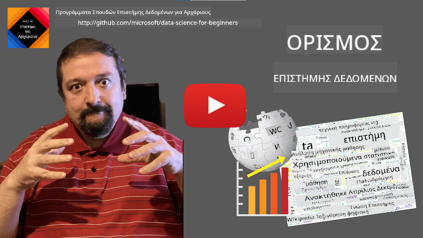
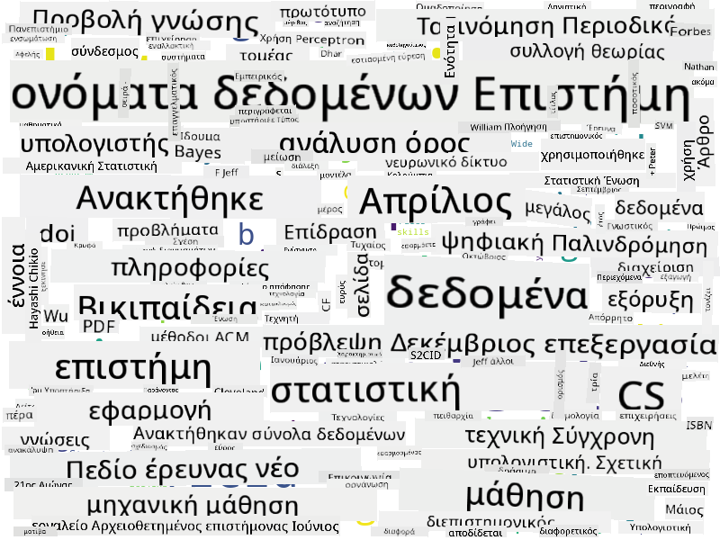

<!--
CO_OP_TRANSLATOR_METADATA:
{
  "original_hash": "43212cc1ac137b7bb1dcfb37ca06b0f4",
  "translation_date": "2025-10-25T18:53:00+00:00",
  "source_file": "1-Introduction/01-defining-data-science/README.md",
  "language_code": "el"
}
-->
# Ορισμός της Επιστήμης Δεδομένων

|  ](../../sketchnotes/01-Definitions.png) |
| :----------------------------------------------------------------------------------------------------: |
|              Ορισμός της Επιστήμης Δεδομένων - _Σκίτσο από [@nitya](https://twitter.com/nitya)_               |

---

## [Προ-διάλεξη κουίζ](https://ff-quizzes.netlify.app/en/ds/quiz/0)

## Τι είναι τα Δεδομένα;
Στην καθημερινή μας ζωή, είμαστε συνεχώς περιτριγυρισμένοι από δεδομένα. Το κείμενο που διαβάζετε τώρα είναι δεδομένα. Η λίστα με τους αριθμούς τηλεφώνου των φίλων σας στο smartphone σας είναι δεδομένα, όπως και η τρέχουσα ώρα που εμφανίζεται στο ρολόι σας. Ως άνθρωποι, λειτουργούμε φυσικά με δεδομένα, μετρώντας τα χρήματα που έχουμε ή γράφοντας γράμματα στους φίλους μας.

Ωστόσο, τα δεδομένα έγιναν πολύ πιο σημαντικά με τη δημιουργία των υπολογιστών. Ο κύριος ρόλος των υπολογιστών είναι να εκτελούν υπολογισμούς, αλλά χρειάζονται δεδομένα για να λειτουργήσουν. Επομένως, πρέπει να κατανοήσουμε πώς οι υπολογιστές αποθηκεύουν και επεξεργάζονται δεδομένα.

Με την εμφάνιση του Διαδικτύου, ο ρόλος των υπολογιστών ως συσκευές διαχείρισης δεδομένων αυξήθηκε. Αν το σκεφτείτε, χρησιμοποιούμε πλέον τους υπολογιστές όλο και περισσότερο για επεξεργασία και επικοινωνία δεδομένων, παρά για πραγματικούς υπολογισμούς. Όταν γράφουμε ένα e-mail σε έναν φίλο ή αναζητούμε πληροφορίες στο Διαδίκτυο - ουσιαστικά δημιουργούμε, αποθηκεύουμε, μεταδίδουμε και επεξεργαζόμαστε δεδομένα.
> Μπορείτε να θυμηθείτε την τελευταία φορά που χρησιμοποιήσατε υπολογιστές για να κάνετε πραγματικά έναν υπολογισμό;

## Τι είναι η Επιστήμη Δεδομένων;

Σύμφωνα με τη [Wikipedia](https://en.wikipedia.org/wiki/Data_science), η **Επιστήμη Δεδομένων** ορίζεται ως *ένα επιστημονικό πεδίο που χρησιμοποιεί επιστημονικές μεθόδους για την εξαγωγή γνώσης και πληροφοριών από δομημένα και μη δομημένα δεδομένα, και την εφαρμογή γνώσης και χρήσιμων πληροφοριών από δεδομένα σε ένα ευρύ φάσμα εφαρμογών*. 

Αυτός ο ορισμός υπογραμμίζει τα εξής σημαντικά σημεία της επιστήμης δεδομένων:

* Ο κύριος στόχος της επιστήμης δεδομένων είναι να **εξάγει γνώση** από δεδομένα, με άλλα λόγια - να **κατανοήσει** τα δεδομένα, να βρει κάποιες κρυφές σχέσεις και να δημιουργήσει ένα **μοντέλο**.
* Η επιστήμη δεδομένων χρησιμοποιεί **επιστημονικές μεθόδους**, όπως η πιθανότητα και η στατιστική. Στην πραγματικότητα, όταν ο όρος *επιστήμη δεδομένων* εισήχθη για πρώτη φορά, κάποιοι υποστήριξαν ότι η επιστήμη δεδομένων ήταν απλώς ένα νέο μοντέρνο όνομα για τη στατιστική. Σήμερα είναι προφανές ότι το πεδίο είναι πολύ ευρύτερο.    
* Η αποκτηθείσα γνώση πρέπει να εφαρμόζεται για την παραγωγή **χρήσιμων πληροφοριών**, δηλαδή πρακτικών πληροφοριών που μπορούν να εφαρμοστούν σε πραγματικές επιχειρηματικές καταστάσεις.
* Πρέπει να μπορούμε να λειτουργούμε τόσο με **δομημένα** όσο και με **μη δομημένα** δεδομένα. Θα επιστρέψουμε για να συζητήσουμε τους διαφορετικούς τύπους δεδομένων αργότερα στο μάθημα.
* Η **εφαρμογή σε διάφορους τομείς** είναι μια σημαντική έννοια, και οι επιστήμονες δεδομένων συχνά χρειάζονται τουλάχιστον κάποιο βαθμό εξειδίκευσης στον τομέα του προβλήματος, για παράδειγμα: χρηματοοικονομικά, ιατρική, μάρκετινγκ, κ.λπ.

> Ένα άλλο σημαντικό στοιχείο της Επιστήμης Δεδομένων είναι ότι μελετά πώς μπορούν να συλλεχθούν, να αποθηκευτούν και να επεξεργαστούν δεδομένα χρησιμοποιώντας υπολογιστές. Ενώ η στατιστική μας δίνει μαθηματικά θεμέλια, η επιστήμη δεδομένων εφαρμόζει μαθηματικές έννοιες για να αντλήσει πραγματικά πληροφορίες από τα δεδομένα.

Μία από τις προσεγγίσεις (που αποδίδεται στον [Jim Gray](https://en.wikipedia.org/wiki/Jim_Gray_(computer_scientist))) για να δούμε την επιστήμη δεδομένων είναι να τη θεωρήσουμε ως ένα ξεχωριστό παράδειγμα επιστήμης:
* **Εμπειρική**, στην οποία βασιζόμαστε κυρίως σε παρατηρήσεις και αποτελέσματα πειραμάτων
* **Θεωρητική**, όπου νέες έννοιες προκύπτουν από την υπάρχουσα επιστημονική γνώση
* **Υπολογιστική**, όπου ανακαλύπτουμε νέες αρχές βάσει κάποιων υπολογιστικών πειραμάτων
* **Βασισμένη στα Δεδομένα**, που βασίζεται στην ανακάλυψη σχέσεων και μοτίβων στα δεδομένα  

## Άλλα Σχετικά Πεδία

Επειδή τα δεδομένα είναι πανταχού παρόντα, η επιστήμη δεδομένων είναι επίσης ένα ευρύ πεδίο που αγγίζει πολλές άλλες επιστήμες.

<dl>
<dt>Βάσεις Δεδομένων</dt>
<dd>
Ένα κρίσιμο ζήτημα είναι <b>πώς να αποθηκεύσουμε</b> τα δεδομένα, δηλαδή πώς να τα δομήσουμε με τρόπο που να επιτρέπει ταχύτερη επεξεργασία. Υπάρχουν διαφορετικοί τύποι βάσεων δεδομένων που αποθηκεύουν δομημένα και μη δομημένα δεδομένα, τα οποία <a href="../../2-Working-With-Data/README.md">θα εξετάσουμε στο μάθημά μας</a>.
</dd>
<dt>Μεγάλα Δεδομένα</dt>
<dd>
Συχνά χρειάζεται να αποθηκεύσουμε και να επεξεργαστούμε πολύ μεγάλες ποσότητες δεδομένων με σχετικά απλή δομή. Υπάρχουν ειδικές προσεγγίσεις και εργαλεία για την αποθήκευση αυτών των δεδομένων με κατανεμημένο τρόπο σε ένα σύμπλεγμα υπολογιστών και την αποτελεσματική επεξεργασία τους.
</dd>
<dt>Μηχανική Μάθηση</dt>
<dd>
Ένας τρόπος να κατανοήσουμε τα δεδομένα είναι να <b>δημιουργήσουμε ένα μοντέλο</b> που θα μπορεί να προβλέψει το επιθυμητό αποτέλεσμα. Η ανάπτυξη μοντέλων από δεδομένα ονομάζεται <b>μηχανική μάθηση</b>. Μπορείτε να δείτε το <a href="https://aka.ms/ml-beginners">Πρόγραμμα Σπουδών Μηχανικής Μάθησης για Αρχάριους</a> για να μάθετε περισσότερα.
</dd>
<dt>Τεχνητή Νοημοσύνη</dt>
<dd>
Ένας τομέας της μηχανικής μάθησης γνωστός ως τεχνητή νοημοσύνη (AI) βασίζεται επίσης στα δεδομένα και περιλαμβάνει τη δημιουργία πολύπλοκων μοντέλων που μιμούνται τις ανθρώπινες διαδικασίες σκέψης. Οι μέθοδοι AI συχνά μας επιτρέπουν να μετατρέπουμε μη δομημένα δεδομένα (π.χ. φυσική γλώσσα) σε δομημένες πληροφορίες. 
</dd>
<dt>Οπτικοποίηση</dt>
<dd>
Οι τεράστιες ποσότητες δεδομένων είναι ακατανόητες για έναν άνθρωπο, αλλά μόλις δημιουργήσουμε χρήσιμες οπτικοποιήσεις χρησιμοποιώντας αυτά τα δεδομένα, μπορούμε να κατανοήσουμε καλύτερα τα δεδομένα και να βγάλουμε συμπεράσματα. Επομένως, είναι σημαντικό να γνωρίζουμε πολλούς τρόπους οπτικοποίησης πληροφοριών - κάτι που θα καλύψουμε στην <a href="../../3-Data-Visualization/README.md">Ενότητα 3</a> του μαθήματός μας. Σχετικά πεδία περιλαμβάνουν επίσης τα <b>Infographics</b> και τη γενική <b>Αλληλεπίδραση Ανθρώπου-Υπολογιστή</b>. 
</dd>
</dl>

## Τύποι Δεδομένων

Όπως έχουμε ήδη αναφέρει, τα δεδομένα είναι παντού. Απλώς πρέπει να τα καταγράψουμε με τον σωστό τρόπο! Είναι χρήσιμο να διακρίνουμε μεταξύ **δομημένων** και **μη δομημένων** δεδομένων. Τα πρώτα συνήθως παρουσιάζονται σε κάποια καλά δομημένη μορφή, συχνά ως πίνακας ή αριθμός πινάκων, ενώ τα δεύτερα είναι απλώς μια συλλογή αρχείων. Μερικές φορές μπορούμε επίσης να μιλήσουμε για **ημι-δομημένα** δεδομένα, που έχουν κάποιο είδος δομής που μπορεί να διαφέρει σημαντικά.

| Δομημένα                                                                   | Ημι-δομημένα                                                                                | Μη δομημένα                            |
| ---------------------------------------------------------------------------- | ---------------------------------------------------------------------------------------------- | --------------------------------------- |
| Λίστα ανθρώπων με τους αριθμούς τηλεφώνου τους                                      | Σελίδες Wikipedia με συνδέσμους                                                                     | Κείμενο της Εγκυκλοπαίδειας Britannica        |
| Θερμοκρασία σε όλα τα δωμάτια ενός κτιρίου κάθε λεπτό για τα τελευταία 20 χρόνια | Συλλογή επιστημονικών άρθρων σε μορφή JSON με συγγραφείς, ημερομηνία δημοσίευσης και περίληψη | Αρχεία με εταιρικά έγγραφα     |
| Δεδομένα για την ηλικία και το φύλο όλων των ανθρώπων που εισέρχονται στο κτίριο                  | Σελίδες Διαδικτύου                                                                                 | Ακατέργαστο βίντεο από κάμερα παρακολούθησης |

## Από πού να βρείτε Δεδομένα

Υπάρχουν πολλές πιθανές πηγές δεδομένων, και θα ήταν αδύνατο να τις απαριθμήσουμε όλες! Ωστόσο, ας αναφέρουμε μερικά από τα τυπικά μέρη όπου μπορείτε να βρείτε δεδομένα:

* **Δομημένα**
  - **Internet of Things** (IoT), συμπεριλαμβανομένων δεδομένων από διάφορους αισθητήρες, όπως αισθητήρες θερμοκρασίας ή πίεσης, παρέχει πολλά χρήσιμα δεδομένα. Για παράδειγμα, αν ένα κτίριο γραφείων είναι εξοπλισμένο με αισθητήρες IoT, μπορούμε να ελέγξουμε αυτόματα τη θέρμανση και τον φωτισμό για να ελαχιστοποιήσουμε το κόστος. 
  - **Έρευνες** που ζητάμε από τους χρήστες να συμπληρώσουν μετά από μια αγορά ή μετά από επίσκεψη σε έναν ιστότοπο.
  - **Ανάλυση συμπεριφοράς** μπορεί, για παράδειγμα, να μας βοηθήσει να κατανοήσουμε πόσο βαθιά εισέρχεται ένας χρήστης σε έναν ιστότοπο και ποιος είναι ο τυπικός λόγος για την αποχώρηση από τον ιστότοπο.
* **Μη δομημένα**
  - **Κείμενα** μπορούν να αποτελέσουν πλούσια πηγή πληροφοριών, όπως συνολική **βαθμολογία συναισθήματος**, ή εξαγωγή λέξεων-κλειδιών και σημασιολογικής έννοιας.
  - **Εικόνες** ή **Βίντεο**. Ένα βίντεο από μια κάμερα παρακολούθησης μπορεί να χρησιμοποιηθεί για να εκτιμήσει την κυκλοφορία στον δρόμο και να ενημερώσει τους ανθρώπους για πιθανές κυκλοφοριακές συμφόρησεις.
  - **Αρχεία καταγραφής** από διακομιστές ιστού μπορούν να χρησιμοποιηθούν για να κατανοήσουμε ποιες σελίδες του ιστότοπού μας επισκέπτονται πιο συχνά και για πόσο χρόνο.
* Ημι-δομημένα
  - **Γραφήματα Κοινωνικών Δικτύων** μπορούν να αποτελέσουν εξαιρετικές πηγές δεδομένων για τις προσωπικότητες των χρηστών και την πιθανή αποτελεσματικότητα στη διάδοση πληροφοριών.
  - Όταν έχουμε μια συλλογή φωτογραφιών από ένα πάρτι, μπορούμε να προσπαθήσουμε να εξαγάγουμε δεδομένα **Δυναμικής Ομάδας** δημιουργώντας ένα γράφημα ανθρώπων που βγάζουν φωτογραφίες μαζί.

Γνωρίζοντας τις διαφορετικές πιθανές πηγές δεδομένων, μπορείτε να προσπαθήσετε να σκεφτείτε διαφορετικά σενάρια όπου οι τεχνικές επιστήμης δεδομένων μπορούν να εφαρμοστούν για να κατανοήσετε καλύτερα την κατάσταση και να βελτιώσετε τις επιχειρηματικές διαδικασίες. 

## Τι μπορείτε να κάνετε με τα Δεδομένα

Στην Επιστήμη Δεδομένων, επικεντρωνόμαστε στα εξής βήματα της πορείας των δεδομένων:

<dl>
<dt>1) Απόκτηση Δεδομένων</dt>
<dd>
Το πρώτο βήμα είναι η συλλογή των δεδομένων. Ενώ σε πολλές περιπτώσεις μπορεί να είναι μια απλή διαδικασία, όπως δεδομένα που φτάνουν σε μια βάση δεδομένων από μια εφαρμογή ιστού, μερικές φορές χρειάζεται να χρησιμοποιήσουμε ειδικές τεχνικές. Για παράδειγμα, τα δεδομένα από αισθητήρες IoT μπορεί να είναι υπερβολικά, και είναι καλή πρακτική να χρησιμοποιούμε ενδιάμεσους σταθμούς αποθήκευσης όπως το IoT Hub για να συλλέξουμε όλα τα δεδομένα πριν από την περαιτέρω επεξεργασία.
</dd>
<dt>2) Αποθήκευση Δεδομένων</dt>
<dd>
Η αποθήκευση δεδομένων μπορεί να είναι πρόκληση, ειδικά αν μιλάμε για μεγάλα δεδομένα. Όταν αποφασίζουμε πώς να αποθηκεύσουμε δεδομένα, έχει νόημα να προβλέψουμε τον τρόπο με τον οποίο θα θέλαμε να αναζητήσουμε τα δεδομένα στο μέλλον. Υπάρχουν διάφοροι τρόποι αποθήκευσης δεδομένων:
<ul>
<li>Μια σχεσιακή βάση δεδομένων αποθηκεύει μια συλλογή πινάκων και χρησιμοποιεί μια ειδική γλώσσα που ονομάζεται SQL για την αναζήτησή τους. Συνήθως, οι πίνακες οργανώνονται σε διαφορετικές ομάδες που ονομάζονται σχήματα. Σε πολλές περιπτώσεις, χρειάζεται να μετατρέψουμε τα δεδομένα από την αρχική τους μορφή για να ταιριάζουν στο σχήμα.</li>
<li><a href="https://en.wikipedia.org/wiki/NoSQL">Μια NoSQL</a> βάση δεδομένων, όπως η <a href="https://azure.microsoft.com/services/cosmos-db/?WT.mc_id=academic-77958-bethanycheum">CosmosDB</a>, δεν επιβάλλει σχήματα στα δεδομένα και επιτρέπει την αποθήκευση πιο σύνθετων δεδομένων, για παράδειγμα, ιεραρχικών εγγράφων JSON ή γραφημάτων. Ωστόσο, οι βάσεις δεδομένων NoSQL δεν έχουν τις πλούσιες δυνατότητες αναζήτησης της SQL και δεν μπορούν να επιβάλλουν την ακεραιότητα των σχέσεων, δηλαδή κανόνες για το πώς δομούνται τα δεδομένα στους πίνακες και πώς συνδέονται μεταξύ τους.</li>
<li><a href="https://en.wikipedia.org/wiki/Data_lake">Η αποθήκευση Data Lake</a> χρησιμοποιείται για μεγάλες συλλογές δεδομένων σε ακατέργαστη, μη δομημένη μορφή. Οι λίμνες δεδομένων χρησιμοποιούνται συχνά με μεγάλα δεδομένα, όπου όλα τα δεδομένα δεν μπορούν να χωρέσουν σε μία μηχανή και πρέπει να αποθηκευτούν και να επεξεργαστούν από ένα σύμπλεγμα διακομιστών. Το <a href="https://en.wikipedia.org/wiki/Apache_Parquet">Parquet</a> είναι η μορφή δεδομένων που χρησιμοποιείται συχνά σε συνδυασμό με μεγάλα δεδομένα.</li> 
</ul>
</dd>
<dt>3) Επεξεργασία Δεδομένων</dt>
<dd>
Αυτό είναι το πιο συναρπαστικό μέρος της πορείας των δεδομένων, που περιλαμβάνει τη μετατροπή των δεδομένων από την αρχική τους μορφή σε μορφή που μπορεί να χρησιμοποιηθεί για οπτικοποίηση/εκπαίδευση μοντέλου. Όταν ασχολούμαστε με μη δομημένα δεδομένα όπως κείμενα ή εικόνες, μπορεί να χρειαστεί να χρησιμοποιήσουμε κάποιες τεχνικές AI για να εξαγάγουμε <b>χαρακτηριστικά</b> από τα δεδομένα, μετατρέποντάς τα έτσι σε δομημένη μορφή.
</dd>

> Μπορεί να υποστηρίξετε ότι αυτή η προσέγγιση δεν είναι ιδανική, επειδή τα modules μπορεί να έχουν διαφορετικά μήκη. Ίσως είναι πιο δίκαιο να διαιρέσουμε τον χρόνο με το μήκος του module (σε αριθμό χαρακτήρων) και να συγκρίνουμε αυτές τις τιμές αντίστοιχα.

Όταν αρχίζουμε να αναλύουμε τα αποτελέσματα των τεστ πολλαπλών επιλογών, μπορούμε να προσπαθήσουμε να προσδιορίσουμε ποιες έννοιες δυσκολεύονται να κατανοήσουν οι μαθητές και να χρησιμοποιήσουμε αυτές τις πληροφορίες για να βελτιώσουμε το περιεχόμενο. Για να το κάνουμε αυτό, πρέπει να σχεδιάσουμε τα τεστ με τέτοιο τρόπο ώστε κάθε ερώτηση να αντιστοιχεί σε μια συγκεκριμένη έννοια ή κομμάτι γνώσης.

Αν θέλουμε να γίνουμε ακόμα πιο περίπλοκοι, μπορούμε να σχεδιάσουμε τον χρόνο που απαιτείται για κάθε module σε σχέση με την ηλικιακή κατηγορία των μαθητών. Ίσως ανακαλύψουμε ότι για ορισμένες ηλικιακές κατηγορίες απαιτείται υπερβολικά πολύς χρόνος για την ολοκλήρωση του module ή ότι οι μαθητές εγκαταλείπουν πριν το ολοκληρώσουν. Αυτό μπορεί να μας βοηθήσει να παρέχουμε συστάσεις ηλικίας για το module και να ελαχιστοποιήσουμε την δυσαρέσκεια των ανθρώπων από λανθασμένες προσδοκίες.

## 🚀 Πρόκληση

Σε αυτή την πρόκληση, θα προσπαθήσουμε να βρούμε έννοιες σχετικές με τον τομέα της Επιστήμης Δεδομένων εξετάζοντας κείμενα. Θα πάρουμε ένα άρθρο από τη Wikipedia για την Επιστήμη Δεδομένων, θα κατεβάσουμε και θα επεξεργαστούμε το κείμενο και στη συνέχεια θα δημιουργήσουμε ένα σύννεφο λέξεων όπως αυτό:

Επισκεφθείτε το [`notebook.ipynb`](../../../../1-Introduction/01-defining-data-science/notebook.ipynb ':ignore') για να διαβάσετε τον κώδικα. Μπορείτε επίσης να εκτελέσετε τον κώδικα και να δείτε πώς πραγματοποιεί όλες τις μετατροπές δεδομένων σε πραγματικό χρόνο.

> Αν δεν ξέρετε πώς να εκτελέσετε κώδικα σε ένα Jupyter Notebook, ρίξτε μια ματιά σε [αυτό το άρθρο](https://soshnikov.com/education/how-to-execute-notebooks-from-github/).

## [Κουίζ μετά το μάθημα](https://ff-quizzes.netlify.app/en/ds/quiz/1)

## Εργασίες

* **Εργασία 1**: Τροποποιήστε τον παραπάνω κώδικα για να βρείτε σχετικές έννοιες για τους τομείς του **Big Data** και της **Μηχανικής Μάθησης**
* **Εργασία 2**: [Σκεφτείτε Σενάρια Επιστήμης Δεδομένων](assignment.md)

## Ευχαριστίες

Αυτό το μάθημα έχει δημιουργηθεί με ♥️ από τον [Dmitry Soshnikov](http://soshnikov.com)

---

**Αποποίηση ευθύνης**:  
Αυτό το έγγραφο έχει μεταφραστεί χρησιμοποιώντας την υπηρεσία αυτόματης μετάφρασης [Co-op Translator](https://github.com/Azure/co-op-translator). Παρόλο που καταβάλλουμε προσπάθειες για ακρίβεια, παρακαλούμε να έχετε υπόψη ότι οι αυτόματες μεταφράσεις ενδέχεται να περιέχουν λάθη ή ανακρίβειες. Το πρωτότυπο έγγραφο στη μητρική του γλώσσα θα πρέπει να θεωρείται η αυθεντική πηγή. Για κρίσιμες πληροφορίες, συνιστάται επαγγελματική ανθρώπινη μετάφραση. Δεν φέρουμε ευθύνη για τυχόν παρεξηγήσεις ή εσφαλμένες ερμηνείες που προκύπτουν από τη χρήση αυτής της μετάφρασης.