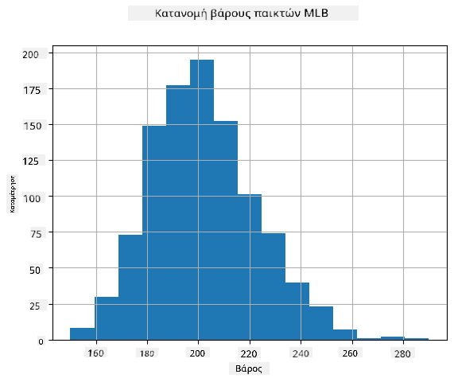

<!--
CO_OP_TRANSLATOR_METADATA:
{
  "original_hash": "ce95884566a74db72572cd51f0cb25ad",
  "translation_date": "2025-09-06T13:33:29+00:00",
  "source_file": "1-Introduction/04-stats-and-probability/README.md",
  "language_code": "el"
}
-->
# Μια Σύντομη Εισαγωγή στη Στατιστική και την Πιθανότητα

| ](../../sketchnotes/04-Statistics-Probability.png)|
|:---:|
| Στατιστική και Θεωρία Πιθανοτήτων - _Σκίτσο από [@nitya](https://twitter.com/nitya)_ |

Η Στατιστική και η Θεωρία Πιθανοτήτων είναι δύο στενά συνδεδεμένοι κλάδοι των Μαθηματικών που είναι εξαιρετικά σημαντικοί για την Επιστήμη Δεδομένων. Είναι δυνατόν να δουλέψουμε με δεδομένα χωρίς βαθιά γνώση μαθηματικών, αλλά είναι καλύτερο να γνωρίζουμε τουλάχιστον κάποιες βασικές έννοιες. Εδώ θα παρουσιάσουμε μια σύντομη εισαγωγή που θα σας βοηθήσει να ξεκινήσετε.

[](https://youtu.be/Z5Zy85g4Yjw)

## [Κουίζ πριν το μάθημα](https://ff-quizzes.netlify.app/en/ds/quiz/6)

## Πιθανότητα και Τυχαίες Μεταβλητές

**Πιθανότητα** είναι ένας αριθμός μεταξύ 0 και 1 που εκφράζει πόσο πιθανό είναι ένα **γεγονός**. Ορίζεται ως ο αριθμός των θετικών αποτελεσμάτων (που οδηγούν στο γεγονός), διαιρεμένος με τον συνολικό αριθμό αποτελεσμάτων, δεδομένου ότι όλα τα αποτελέσματα είναι εξίσου πιθανά. Για παράδειγμα, όταν ρίχνουμε ένα ζάρι, η πιθανότητα να φέρουμε έναν ζυγό αριθμό είναι 3/6 = 0.5.

Όταν μιλάμε για γεγονότα, χρησιμοποιούμε **τυχαίες μεταβλητές**. Για παράδειγμα, η τυχαία μεταβλητή που αντιπροσωπεύει τον αριθμό που προκύπτει όταν ρίχνουμε ένα ζάρι θα παίρνει τιμές από 1 έως 6. Το σύνολο των αριθμών από 1 έως 6 ονομάζεται **χώρος δειγμάτων**. Μπορούμε να μιλήσουμε για την πιθανότητα μιας τυχαίας μεταβλητής να πάρει μια συγκεκριμένη τιμή, για παράδειγμα P(X=3)=1/6.

Η τυχαία μεταβλητή στο προηγούμενο παράδειγμα ονομάζεται **διακριτή**, επειδή έχει έναν μετρήσιμο χώρο δειγμάτων, δηλαδή υπάρχουν ξεχωριστές τιμές που μπορούν να απαριθμηθούν. Υπάρχουν περιπτώσεις όπου ο χώρος δειγμάτων είναι ένα εύρος πραγματικών αριθμών ή το σύνολο των πραγματικών αριθμών. Τέτοιες μεταβλητές ονομάζονται **συνεχείς**. Ένα καλό παράδειγμα είναι η ώρα άφιξης του λεωφορείου.

## Κατανομή Πιθανότητας

Στην περίπτωση των διακριτών τυχαίων μεταβλητών, είναι εύκολο να περιγράψουμε την πιθανότητα κάθε γεγονότος με μια συνάρτηση P(X). Για κάθε τιμή *s* από τον χώρο δειγμάτων *S*, θα δίνει έναν αριθμό από 0 έως 1, έτσι ώστε το άθροισμα όλων των τιμών του P(X=s) για όλα τα γεγονότα να είναι 1.

Η πιο γνωστή διακριτή κατανομή είναι η **ομοιόμορφη κατανομή**, στην οποία υπάρχει ένας χώρος δειγμάτων με Ν στοιχεία, με ίση πιθανότητα 1/Ν για καθένα από αυτά.

Είναι πιο δύσκολο να περιγράψουμε την κατανομή πιθανότητας μιας συνεχούς μεταβλητής, με τιμές που προέρχονται από κάποιο διάστημα [a,b] ή το σύνολο των πραγματικών αριθμών ℝ. Σκεφτείτε την περίπτωση της ώρας άφιξης του λεωφορείου. Στην πραγματικότητα, για κάθε ακριβή ώρα άφιξης *t*, η πιθανότητα να φτάσει το λεωφορείο ακριβώς εκείνη την ώρα είναι 0!

> Τώρα ξέρετε ότι γεγονότα με πιθανότητα 0 συμβαίνουν, και μάλιστα πολύ συχνά! Τουλάχιστον κάθε φορά που φτάνει το λεωφορείο!

Μπορούμε μόνο να μιλήσουμε για την πιθανότητα μιας μεταβλητής να πέσει σε ένα δεδομένο διάστημα τιμών, π.χ. P(t<sub>1</sub>≤X<t<sub>2</sub>). Σε αυτή την περίπτωση, η κατανομή πιθανότητας περιγράφεται από μια **συνάρτηση πυκνότητας πιθανότητας** p(x), έτσι ώστε


Ένα συνεχές ανάλογο της ομοιόμορφης κατανομής ονομάζεται **συνεχής ομοιόμορφη**, η οποία ορίζεται σε ένα πεπερασμένο διάστημα. Η πιθανότητα ότι η τιμή X πέφτει σε ένα διάστημα μήκους l είναι ανάλογη του l και φτάνει μέχρι το 1.

Μια άλλη σημαντική κατανομή είναι η **κανονική κατανομή**, για την οποία θα μιλήσουμε πιο αναλυτικά παρακάτω.

## Μέση Τιμή, Διασπορά και Τυπική Απόκλιση

Ας υποθέσουμε ότι παίρνουμε μια ακολουθία n δειγμάτων μιας τυχαίας μεταβλητής X: x<sub>1</sub>, x<sub>2</sub>, ..., x<sub>n</sub>. Μπορούμε να ορίσουμε τη **μέση τιμή** (ή **αριθμητικό μέσο**) της ακολουθίας με τον παραδοσιακό τρόπο ως (x<sub>1</sub>+x<sub>2</sub>+x<sub>n</sub>)/n. Καθώς αυξάνουμε το μέγεθος του δείγματος (δηλαδή παίρνουμε το όριο με n→∞), θα προκύψει η μέση τιμή (επίσης ονομάζεται **προσδοκία**) της κατανομής. Θα συμβολίσουμε την προσδοκία με **E**(x).

> Μπορεί να αποδειχθεί ότι για οποιαδήποτε διακριτή κατανομή με τιμές {x<sub>1</sub>, x<sub>2</sub>, ..., x<sub>N</sub>} και αντίστοιχες πιθανότητες p<sub>1</sub>, p<sub>2</sub>, ..., p<sub>N</sub>, η προσδοκία θα ισούται με E(X)=x<sub>1</sub>p<sub>1</sub>+x<sub>2</sub>p<sub>2</sub>+...+x<sub>N</sub>p<sub>N</sub>.

Για να προσδιορίσουμε πόσο διασκορπισμένες είναι οι τιμές, μπορούμε να υπολογίσουμε τη διασπορά σ<sup>2</sup> = ∑(x<sub>i</sub> - μ)<sup>2</sup>/n, όπου μ είναι η μέση τιμή της ακολουθίας. Η τιμή σ ονομάζεται **τυπική απόκλιση**, και το σ<sup>2</sup> ονομάζεται **διασπορά**.

## Τρόπος, Διάμεσος και Τεταρτημόρια

Μερικές φορές, η μέση τιμή δεν αντιπροσωπεύει επαρκώς την "τυπική" τιμή για τα δεδομένα. Για παράδειγμα, όταν υπάρχουν μερικές ακραίες τιμές που είναι εντελώς εκτός εύρους, μπορούν να επηρεάσουν τη μέση τιμή. Μια άλλη καλή ένδειξη είναι η **διάμεσος**, μια τιμή τέτοια ώστε το μισό των δεδομένων να είναι χαμηλότερο από αυτήν και το άλλο μισό - υψηλότερο.

Για να κατανοήσουμε καλύτερα την κατανομή των δεδομένων, είναι χρήσιμο να μιλήσουμε για **τεταρτημόρια**:

* Το πρώτο τεταρτημόριο, ή Q1, είναι μια τιμή τέτοια ώστε το 25% των δεδομένων να είναι κάτω από αυτήν
* Το τρίτο τεταρτημόριο, ή Q3, είναι μια τιμή τέτοια ώστε το 75% των δεδομένων να είναι κάτω από αυτήν

Γραφικά μπορούμε να αναπαραστήσουμε τη σχέση μεταξύ διαμέσου και τεταρτημορίων σε ένα διάγραμμα που ονομάζεται **κουτίγραμμα**:


Εδώ υπολογίζουμε επίσης το **εύρος μεταξύ τεταρτημορίων** IQR=Q3-Q1, και τις λεγόμενες **ακραίες τιμές** - τιμές που βρίσκονται εκτός των ορίων [Q1-1.5*IQR,Q3+1.5*IQR].

Για μια πεπερασμένη κατανομή που περιέχει μικρό αριθμό πιθανών τιμών, μια καλή "τυπική" τιμή είναι αυτή που εμφανίζεται πιο συχνά, η οποία ονομάζεται **τρόπος**. Χρησιμοποιείται συχνά για κατηγοριοποιημένα δεδομένα, όπως χρώματα. Σκεφτείτε μια κατάσταση όπου έχουμε δύο ομάδες ανθρώπων - κάποιους που προτιμούν έντονα το κόκκινο και άλλους που προτιμούν το μπλε. Αν κωδικοποιήσουμε τα χρώματα με αριθμούς, η μέση τιμή για το αγαπημένο χρώμα θα ήταν κάπου στο πορτοκαλί-πράσινο φάσμα, κάτι που δεν υποδεικνύει την πραγματική προτίμηση καμίας ομάδας. Ωστόσο, ο τρόπος θα ήταν είτε ένα από τα χρώματα είτε και τα δύο χρώματα, αν ο αριθμός των ανθρώπων που τα προτιμούν είναι ίσος (σε αυτή την περίπτωση ονομάζουμε το δείγμα **πολυτροπικό**).

## Δεδομένα από τον Πραγματικό Κόσμο

Όταν αναλύουμε δεδομένα από την πραγματική ζωή, συχνά δεν είναι τυχαίες μεταβλητές με την αυστηρή έννοια, δηλαδή δεν διεξάγουμε πειράματα με άγνωστο αποτέλεσμα. Για παράδειγμα, σκεφτείτε μια ομάδα παικτών μπέιζμπολ και τα σωματικά τους δεδομένα, όπως ύψος, βάρος και ηλικία. Αυτοί οι αριθμοί δεν είναι ακριβώς τυχαίοι, αλλά μπορούμε να εφαρμόσουμε τις ίδιες μαθηματικές έννοιες. Για παράδειγμα, μια ακολουθία βαρών ανθρώπων μπορεί να θεωρηθεί ως ακολουθία τιμών που προέρχονται από κάποια τυχαία μεταβλητή. Παρακάτω είναι η ακολουθία βαρών πραγματικών παικτών μπέιζμπολ από [Major League Baseball](http://mlb.mlb.com/index.jsp), που προέρχεται από [αυτό το σύνολο δεδομένων](http://wiki.stat.ucla.edu/socr/index.php/SOCR_Data_MLB_HeightsWeights) (για ευκολία, εμφανίζονται μόνο οι πρώτες 20 τιμές):

```
[180.0, 215.0, 210.0, 210.0, 188.0, 176.0, 209.0, 200.0, 231.0, 180.0, 188.0, 180.0, 185.0, 160.0, 180.0, 185.0, 197.0, 189.0, 185.0, 219.0]
```

> **Σημείωση**: Για να δείτε το παράδειγμα εργασίας με αυτό το σύνολο δεδομένων, ρίξτε μια ματιά στο [συνοδευτικό σημειωματάριο](notebook.ipynb). Υπάρχουν επίσης αρκετές προκλήσεις σε όλο το μάθημα, και μπορείτε να τις ολοκληρώσετε προσθέτοντας κάποιον κώδικα σε αυτό το σημειωματάριο. Αν δεν είστε σίγουροι πώς να εργαστείτε με δεδομένα, μην ανησυχείτε - θα επιστρέψουμε στην εργασία με δεδομένα χρησιμοποιώντας Python αργότερα. Αν δεν ξέρετε πώς να εκτελέσετε κώδικα σε Jupyter Notebook, δείτε [αυτό το άρθρο](https://soshnikov.com/education/how-to-execute-notebooks-from-github/).

Ακολουθεί το κουτίγραμμα που δείχνει τη μέση τιμή, τη διάμεσο και τα τεταρτημόρια για τα δεδομένα μας:


Επειδή τα δεδομένα μας περιέχουν πληροφορίες για διαφορετικούς **ρόλους** παικτών, μπορούμε επίσης να δημιουργήσουμε κουτίγραμμα ανά ρόλο - αυτό θα μας επιτρέψει να κατανοήσουμε πώς οι τιμές των παραμέτρων διαφέρουν ανάλογα με τους ρόλους. Αυτή τη φορά θα εξετάσουμε το ύψος:


Αυτό το διάγραμμα υποδεικνύει ότι, κατά μέσο όρο, το ύψος των πρώτων βασικών παικτών είναι μεγαλύτερο από το ύψος των δεύτερων βασικών παικτών. Αργότερα σε αυτό το μάθημα θα μάθουμε πώς μπορούμε να ελέγξουμε αυτή την υπόθεση πιο επίσημα και πώς να δείξουμε ότι τα δεδομένα μας είναι στατιστικά σημαντικά για να το αποδείξουν.

> Όταν εργαζόμαστε με δεδομένα από τον πραγματικό κόσμο, υποθέτουμε ότι όλα τα σημεία δεδομένων είναι δείγματα που προέρχονται από κάποια κατανομή πιθανότητας. Αυτή η υπόθεση μας επιτρέπει να εφαρμόσουμε τεχνικές μηχανικής μάθησης και να δημιουργήσουμε λειτουργικά προβλεπτικά μοντέλα.

Για να δούμε ποια είναι η κατανομή των δεδομένων μας, μπορούμε να σχεδιάσουμε ένα γράφημα που ονομάζεται **ιστόγραμμα**. Ο άξονας Χ θα περιέχει έναν αριθμό διαφορετικών διαστημάτων βάρους (τα λεγόμενα **bins**), και ο κάθετος άξονας θα δείχνει τον αριθμό των φορών που το δείγμα της τυχαίας μεταβλητής μας ήταν μέσα σε ένα δεδομένο διάστημα.



Από αυτό το ιστόγραμμα μπορείτε να δείτε ότι όλες οι τιμές είναι συγκεντρωμένες γύρω από μια συγκεκριμένη μέση τιμή βάρους, και όσο πιο μακριά πηγαίνουμε από αυτή τη μέση τιμή - τόσο λιγότερα βάρη αυτής της τιμής συναντώνται. Δηλαδή, είναι πολύ απίθανο το βάρος ενός παίκτη μπέιζμπολ να είναι πολύ διαφορετικό από τη μέση τιμή. Η διασπορά των βαρών δείχνει την έκταση στην οποία τα βάρη είναι πιθανό να διαφέρουν από τη μέση τιμή.

> Αν πάρουμε βάρη άλλων ανθρώπων, όχι από τη λίγκα μπέιζμπολ, η κατανομή είναι πιθανό να είναι διαφορετική. Ωστόσο, το σχήμα της κατανομής θα είναι το ίδιο, αλλά η μέση τιμή και η διασπορά θα αλλάξουν. Έτσι, αν εκπαιδεύσουμε το μοντέλο μας σε παίκτες μπέιζμπολ, είναι πιθανό να δώσει λανθασμένα αποτελέσματα όταν εφαρμοστεί σε φοιτητές πανεπιστημίου, επειδή η υποκείμενη κατανομή είναι διαφορετική.

## Κανονική Κατανομή

Η κατανομή των βαρών που είδαμε παραπάνω είναι πολύ τυπική, και πολλές μετρήσεις από τον πραγματικό κόσμο ακολουθούν τον ίδιο τύπο κατανομής, αλλά με διαφορετική μέση τιμή και διασπορά. Αυτή η κατανομή ονομάζεται **κανονική κατανομή**, και παίζει πολύ σημαντικό ρόλο στη στατιστική.

Η χρήση της κανονικής κατανομής είναι ο σωστός τρόπος για να δημιουργήσουμε τυχαία βάρη πιθανών παικτών μπέιζμπολ. Μόλις γνωρίζουμε τη μέση τιμή βάρους `mean` και την τυπική απόκλιση `std`, μπορούμε να δημιουργήσουμε 1000 δείγματα βάρους με τον εξής τρόπο:
```python
samples = np.random.normal(mean,std,1000)
``` 

Αν σχεδιάσουμε το ιστόγραμμα των παραγόμενων δειγμάτων, θα δούμε μια εικόνα πολύ παρόμοια με αυτή που φαίνεται παραπάνω. Και αν αυξήσουμε τον αριθμό των δειγμάτων και τον αριθμό των bins, μπορούμε να δημιουργήσουμε μια εικόνα της κανονικής κατανομής που είναι πιο κοντά στο ιδανικό:


*Κανονική Κατανομή με mean=0 και std.dev=1*

## Διαστήματα Εμπιστοσύνης

Όταν μιλάμε για βάρη παικτών μπέιζμπολ, υποθέτουμε ότι υπάρχει μια συγκεκριμένη **τυχαία μεταβλητή W** που αντιστοιχεί στην ιδανική κατανομή πιθανότητας των βαρών όλων των παικτών μπέιζμπολ (η λεγόμενη **πληθυσμός**). Η ακολουθία των βαρών μας αντιστοιχεί σε ένα υποσύνολο όλων των παικτών μπέιζμπολ που ονομάζουμε

1</sub>, ..., X<sub>n</sub> από τη διανομή μας. Κάθε φορά που παίρνουμε ένα δείγμα από τη διανομή μας, καταλήγουμε με διαφορετική μέση τιμή μ. Έτσι, το μ μπορεί να θεωρηθεί ως τυχαία μεταβλητή. Ένα **διάστημα εμπιστοσύνης** με εμπιστοσύνη p είναι ένα ζεύγος τιμών (L<sub>p</sub>,R<sub>p</sub>), τέτοιο ώστε **P**(L<sub>p</sub>≤μ≤R<sub>p</sub>) = p, δηλαδή η πιθανότητα η μετρημένη μέση τιμή να βρίσκεται εντός του διαστήματος ισούται με p.

Πηγαίνει πέρα από την σύντομη εισαγωγή μας να συζητήσουμε λεπτομερώς πώς υπολογίζονται αυτά τα διαστήματα εμπιστοσύνης. Περισσότερες λεπτομέρειες μπορείτε να βρείτε [στη Wikipedia](https://en.wikipedia.org/wiki/Confidence_interval). Εν συντομία, ορίζουμε τη διανομή της υπολογισμένης μέσης τιμής δείγματος σε σχέση με την πραγματική μέση τιμή του πληθυσμού, η οποία ονομάζεται **διανομή Student**.

> **Ενδιαφέρον γεγονός**: Η διανομή Student πήρε το όνομά της από τον μαθηματικό William Sealy Gosset, ο οποίος δημοσίευσε την εργασία του με το ψευδώνυμο "Student". Εργαζόταν στη ζυθοποιία Guinness και, σύμφωνα με μία εκδοχή, ο εργοδότης του δεν ήθελε το ευρύ κοινό να γνωρίζει ότι χρησιμοποιούσαν στατιστικά τεστ για να καθορίσουν την ποιότητα των πρώτων υλών.

Αν θέλουμε να εκτιμήσουμε τη μέση τιμή μ του πληθυσμού μας με εμπιστοσύνη p, πρέπει να πάρουμε το *(1-p)/2-ο εκατοστημόριο* μιας διανομής Student A, το οποίο μπορεί είτε να ληφθεί από πίνακες είτε να υπολογιστεί χρησιμοποιώντας κάποιες ενσωματωμένες λειτουργίες λογισμικού στατιστικής (π.χ. Python, R, κλπ.). Τότε το διάστημα για το μ θα δίνεται από X±A*D/√n, όπου X είναι η μέση τιμή του δείγματος που αποκτήθηκε, D είναι η τυπική απόκλιση.

> **Σημείωση**: Παραλείπουμε επίσης τη συζήτηση μιας σημαντικής έννοιας των [βαθμών ελευθερίας](https://en.wikipedia.org/wiki/Degrees_of_freedom_(statistics)), η οποία είναι σημαντική σε σχέση με τη διανομή Student. Μπορείτε να ανατρέξετε σε πιο ολοκληρωμένα βιβλία στατιστικής για να κατανοήσετε αυτήν την έννοια βαθύτερα.

Ένα παράδειγμα υπολογισμού διαστήματος εμπιστοσύνης για βάρη και ύψη δίνεται στα [συνοδευτικά σημειωματάρια](notebook.ipynb).

| p | Μέση τιμή βάρους |
|-----|-----------|
| 0.85 | 201.73±0.94 |
| 0.90 | 201.73±1.08 |
| 0.95 | 201.73±1.28 |

Παρατηρήστε ότι όσο μεγαλύτερη είναι η πιθανότητα εμπιστοσύνης, τόσο ευρύτερο είναι το διάστημα εμπιστοσύνης.

## Έλεγχος Υποθέσεων

Στο σύνολο δεδομένων των παικτών του μπέιζμπολ, υπάρχουν διαφορετικοί ρόλοι παικτών, που μπορούν να συνοψιστούν παρακάτω (δείτε το [συνοδευτικό σημειωματάριο](notebook.ipynb) για να δείτε πώς μπορεί να υπολογιστεί αυτός ο πίνακας):

| Ρόλος | Ύψος | Βάρος | Πλήθος |
|------|--------|--------|-------|
| Catcher | 72.723684 | 204.328947 | 76 |
| Designated_Hitter | 74.222222 | 220.888889 | 18 |
| First_Baseman | 74.000000 | 213.109091 | 55 |
| Outfielder | 73.010309 | 199.113402 | 194 |
| Relief_Pitcher | 74.374603 | 203.517460 | 315 |
| Second_Baseman | 71.362069 | 184.344828 | 58 |
| Shortstop | 71.903846 | 182.923077 | 52 |
| Starting_Pitcher | 74.719457 | 205.163636 | 221 |
| Third_Baseman | 73.044444 | 200.955556 | 45 |

Μπορούμε να παρατηρήσουμε ότι η μέση τιμή ύψους των πρώτων βασικών είναι μεγαλύτερη από αυτή των δεύτερων βασικών. Έτσι, μπορεί να μπείτε στον πειρασμό να συμπεράνετε ότι **οι πρώτοι βασικοί είναι ψηλότεροι από τους δεύτερους βασικούς**.

> Αυτή η δήλωση ονομάζεται **υπόθεση**, επειδή δεν γνωρίζουμε αν το γεγονός είναι πραγματικά αληθές ή όχι.

Ωστόσο, δεν είναι πάντα προφανές αν μπορούμε να κάνουμε αυτό το συμπέρασμα. Από τη συζήτηση παραπάνω γνωρίζουμε ότι κάθε μέση τιμή έχει ένα σχετικό διάστημα εμπιστοσύνης, και έτσι αυτή η διαφορά μπορεί να είναι απλώς ένα στατιστικό σφάλμα. Χρειαζόμαστε έναν πιο επίσημο τρόπο για να ελέγξουμε την υπόθεσή μας.

Ας υπολογίσουμε τα διαστήματα εμπιστοσύνης ξεχωριστά για τα ύψη των πρώτων και δεύτερων βασικών:

| Εμπιστοσύνη | Πρώτοι Βασικοί | Δεύτεροι Βασικοί |
|------------|---------------|----------------|
| 0.85 | 73.62..74.38 | 71.04..71.69 |
| 0.90 | 73.56..74.44 | 70.99..71.73 |
| 0.95 | 73.47..74.53 | 70.92..71.81 |

Μπορούμε να δούμε ότι υπό καμία εμπιστοσύνη τα διαστήματα δεν επικαλύπτονται. Αυτό αποδεικνύει την υπόθεσή μας ότι οι πρώτοι βασικοί είναι ψηλότεροι από τους δεύτερους βασικούς.

Πιο επίσημα, το πρόβλημα που λύνουμε είναι να δούμε αν **δύο διανομές πιθανότητας είναι ίδιες**, ή τουλάχιστον έχουν τα ίδια παραμέτρους. Ανάλογα με τη διανομή, πρέπει να χρησιμοποιήσουμε διαφορετικά τεστ για αυτό. Αν γνωρίζουμε ότι οι διανομές μας είναι κανονικές, μπορούμε να εφαρμόσουμε **[Student t-test](https://en.wikipedia.org/wiki/Student%27s_t-test)**.

Στο Student t-test, υπολογίζουμε την λεγόμενη **t-τιμή**, η οποία υποδεικνύει τη διαφορά μεταξύ των μέσων, λαμβάνοντας υπόψη τη διακύμανση. Έχει αποδειχθεί ότι η t-τιμή ακολουθεί **διανομή Student**, η οποία μας επιτρέπει να πάρουμε την τιμή κατωφλίου για ένα δεδομένο επίπεδο εμπιστοσύνης **p** (αυτό μπορεί να υπολογιστεί ή να αναζητηθεί στους αριθμητικούς πίνακες). Στη συνέχεια συγκρίνουμε την t-τιμή με αυτό το κατώφλι για να εγκρίνουμε ή να απορρίψουμε την υπόθεση.

Στην Python, μπορούμε να χρησιμοποιήσουμε το πακέτο **SciPy**, το οποίο περιλαμβάνει τη συνάρτηση `ttest_ind` (εκτός από πολλές άλλες χρήσιμες στατιστικές συναρτήσεις!). Υπολογίζει την t-τιμή για εμάς και επίσης κάνει την αντίστροφη αναζήτηση της τιμής εμπιστοσύνης p, ώστε να μπορούμε απλώς να κοιτάξουμε την εμπιστοσύνη για να βγάλουμε το συμπέρασμα.

Για παράδειγμα, η σύγκρισή μας μεταξύ των υψών των πρώτων και δεύτερων βασικών μας δίνει τα εξής αποτελέσματα: 
```python
from scipy.stats import ttest_ind

tval, pval = ttest_ind(df.loc[df['Role']=='First_Baseman',['Height']], df.loc[df['Role']=='Designated_Hitter',['Height']],equal_var=False)
print(f"T-value = {tval[0]:.2f}\nP-value: {pval[0]}")
```
```
T-value = 7.65
P-value: 9.137321189738925e-12
```
Στην περίπτωσή μας, η τιμή p είναι πολύ χαμηλή, που σημαίνει ότι υπάρχουν ισχυρά στοιχεία που υποστηρίζουν ότι οι πρώτοι βασικοί είναι ψηλότεροι.

Υπάρχουν επίσης διαφορετικοί άλλοι τύποι υποθέσεων που μπορεί να θέλουμε να ελέγξουμε, για παράδειγμα:
* Να αποδείξουμε ότι ένα δεδομένο δείγμα ακολουθεί κάποια διανομή. Στην περίπτωσή μας έχουμε υποθέσει ότι τα ύψη κατανέμονται κανονικά, αλλά αυτό χρειάζεται επίσημη στατιστική επαλήθευση.
* Να αποδείξουμε ότι η μέση τιμή ενός δείγματος αντιστοιχεί σε κάποια προκαθορισμένη τιμή
* Να συγκρίνουμε τις μέσες τιμές ενός αριθμού δειγμάτων (π.χ. ποια είναι η διαφορά στα επίπεδα ευτυχίας μεταξύ διαφορετικών ηλικιακών ομάδων)

## Νόμος των Μεγάλων Αριθμών και Κεντρικό Οριακό Θεώρημα

Ένας από τους λόγους που η κανονική διανομή είναι τόσο σημαντική είναι το λεγόμενο **κεντρικό οριακό θεώρημα**. Υποθέστε ότι έχουμε ένα μεγάλο δείγμα ανεξάρτητων τιμών N X<sub>1</sub>, ..., X<sub>N</sub>, που δειγματοληπτούνται από οποιαδήποτε διανομή με μέση τιμή μ και διακύμανση σ<sup>2</sup>. Τότε, για αρκετά μεγάλο N (με άλλα λόγια, όταν N→∞), η μέση τιμή Σ<sub>i</sub>X<sub>i</sub> θα κατανέμεται κανονικά, με μέση τιμή μ και διακύμανση σ<sup>2</sup>/N.

> Ένας άλλος τρόπος να ερμηνεύσουμε το κεντρικό οριακό θεώρημα είναι να πούμε ότι ανεξάρτητα από τη διανομή, όταν υπολογίζετε τη μέση τιμή ενός αθροίσματος οποιωνδήποτε τυχαίων μεταβλητών καταλήγετε σε κανονική διανομή.

Από το κεντρικό οριακό θεώρημα προκύπτει επίσης ότι, όταν N→∞, η πιθανότητα η μέση τιμή του δείγματος να είναι ίση με μ γίνεται 1. Αυτό είναι γνωστό ως **ο νόμος των μεγάλων αριθμών**.

## Συνδιακύμανση και Συσχέτιση

Ένα από τα πράγματα που κάνει η Επιστήμη Δεδομένων είναι να βρίσκει σχέσεις μεταξύ δεδομένων. Λέμε ότι δύο ακολουθίες **συσχετίζονται** όταν παρουσιάζουν παρόμοια συμπεριφορά την ίδια στιγμή, δηλαδή είτε αυξάνονται/μειώνονται ταυτόχρονα, είτε μία ακολουθία αυξάνεται όταν η άλλη μειώνεται και αντίστροφα. Με άλλα λόγια, φαίνεται να υπάρχει κάποια σχέση μεταξύ δύο ακολουθιών.

> Η συσχέτιση δεν υποδεικνύει απαραίτητα αιτιακή σχέση μεταξύ δύο ακολουθιών· μερικές φορές και οι δύο μεταβλητές μπορεί να εξαρτώνται από κάποια εξωτερική αιτία ή μπορεί να είναι καθαρά τυχαίο το ότι οι δύο ακολουθίες συσχετίζονται. Ωστόσο, η ισχυρή μαθηματική συσχέτιση είναι μια καλή ένδειξη ότι δύο μεταβλητές συνδέονται κάπως.

Μαθηματικά, η κύρια έννοια που δείχνει τη σχέση μεταξύ δύο τυχαίων μεταβλητών είναι η **συνδιακύμανση**, η οποία υπολογίζεται ως εξής: Cov(X,Y) = **E**\[(X-**E**(X))(Y-**E**(Y))\]. Υπολογίζουμε την απόκλιση και των δύο μεταβλητών από τις μέσες τιμές τους και στη συνέχεια το γινόμενο αυτών των αποκλίσεων. Αν και οι δύο μεταβλητές αποκλίνουν μαζί, το γινόμενο θα είναι πάντα θετική τιμή, που θα προστίθεται σε θετική συνδιακύμανση. Αν και οι δύο μεταβλητές αποκλίνουν εκτός συγχρονισμού (δηλαδή μία πέφτει κάτω από τον μέσο όρο όταν η άλλη ανεβαίνει πάνω από τον μέσο όρο), θα έχουμε πάντα αρνητικούς αριθμούς, που θα προστίθενται σε αρνητική συνδιακύμανση. Αν οι αποκλίσεις δεν εξαρτώνται, θα προστίθενται περίπου στο μηδέν.

Η απόλυτη τιμή της συνδιακύμανσης δεν μας λέει πολλά για το πόσο μεγάλη είναι η συσχέτιση, επειδή εξαρτάται από το μέγεθος των πραγματικών τιμών. Για να την κανονικοποιήσουμε, μπορούμε να διαιρέσουμε τη συνδιακύμανση με την τυπική απόκλιση και των δύο μεταβλητών, για να πάρουμε τη **συσχέτιση**. Το καλό είναι ότι η συσχέτιση είναι πάντα στο εύρος [-1,1], όπου το 1 υποδεικνύει ισχυρή θετική συσχέτιση μεταξύ των τιμών, το -1 ισχυρή αρνητική συσχέτιση και το 0 καμία συσχέτιση (οι μεταβλητές είναι ανεξάρτητες).

**Παράδειγμα**: Μπορούμε να υπολογίσουμε τη συσχέτιση μεταξύ βαρών και υψών των παικτών μπέιζμπολ από το σύνολο δεδομένων που αναφέρθηκε παραπάνω:
```python
print(np.corrcoef(weights,heights))
```
Ως αποτέλεσμα, παίρνουμε **πίνακα συσχέτισης** όπως αυτόν:
```
array([[1.        , 0.52959196],
       [0.52959196, 1.        ]])
```

> Ο πίνακας συσχέτισης C μπορεί να υπολογιστεί για οποιονδήποτε αριθμό εισαγωγικών ακολουθιών S<sub>1</sub>, ..., S<sub>n</sub>. Η τιμή του C<sub>ij</sub> είναι η συσχέτιση μεταξύ S<sub>i</sub> και S<sub>j</sub>, και τα διαγώνια στοιχεία είναι πάντα 1 (που είναι επίσης η αυτοσυσχέτιση του S<sub>i</sub>).

Στην περίπτωσή μας, η τιμή 0.53 υποδεικνύει ότι υπάρχει κάποια συσχέτιση μεταξύ του βάρους και του ύψους ενός ατόμου. Μπορούμε επίσης να κάνουμε το διάγραμμα διασποράς μιας τιμής έναντι της άλλης για να δούμε τη σχέση οπτικά:


> Περισσότερα παραδείγματα συσχέτισης και συνδιακύμανσης μπορείτε να βρείτε στο [συνοδευτικό σημειωματάριο](notebook.ipynb).

## Συμπέρασμα

Σε αυτήν την ενότητα, μάθαμε:

* βασικές στατιστικές ιδιότητες δεδομένων, όπως μέση τιμή, διακύμανση, τρόπος και τεταρτημόρια
* διαφορετικές διανομές τυχαίων μεταβλητών, συμπεριλαμβανομένης της κανονικής διανομής
* πώς να βρούμε συσχέτιση μεταξύ διαφορετικών ιδιοτήτων
* πώς να χρησιμοποιήσουμε τον αξιόπιστο μηχανισμό των μαθηματικών και της στατιστικής για να αποδείξουμε κάποιες υποθέσεις
* πώς να υπολογίσουμε διαστήματα εμπιστοσύνης για τυχαία μεταβλητή δεδομένου δείγματος δεδομένων

Ενώ αυτή σίγουρα δεν είναι εξαντλητική λίστα θεμάτων που υπάρχουν μέσα στην πιθανότητα και τη στατιστική, θα πρέπει να είναι αρκετή για να σας δώσει μια καλή αρχή σε αυτό το μάθημα.

## 🚀 Πρόκληση

Χρησιμοποιήστε τον δείγμα κώδικα στο σημειωματάριο για να ελέγξετε άλλες υποθέσεις ότι: 
1. Οι πρώτοι βασικοί είναι μεγαλύτεροι σε ηλικία από τους δεύτερους βασικούς
2. Οι πρώτοι βασικοί είναι ψηλότεροι από τους τρίτους βασικούς
3. Οι shortstops είναι ψηλότεροι από τους δεύτερους βασικούς

## [Κουίζ μετά το μάθημα](https://ff-quizzes.netlify.app/en/ds/quiz/7)

## Ανασκόπηση & Αυτομελέτη

Η πιθανότητα και η στατιστική είναι τόσο ευρύ θέμα που αξίζει το δικό της μάθημα. Αν ενδιαφέρεστε να εμβαθύνετε στη θεωρία, ίσως θέλετε να συνεχίσετε την ανάγνωση μερικών από τα παρακάτω βιβλία:

1. [Carlos Fernandez-Granda](https://cims.nyu.edu/~cfgranda/) από το Πανεπιστήμιο της Νέας Υόρκης έχει εξαιρετικές σημειώσεις διαλέξεων [Probability and Statistics for Data Science](https://cims.nyu.edu/~cfgranda/pages/stuff/probability_stats_for_DS.pdf) (διαθέσιμες online)
1. [Peter and Andrew Bruce. Practical Statistics for Data

---

**Αποποίηση ευθύνης**:  
Αυτό το έγγραφο έχει μεταφραστεί χρησιμοποιώντας την υπηρεσία αυτόματης μετάφρασης [Co-op Translator](https://github.com/Azure/co-op-translator). Παρόλο που καταβάλλουμε προσπάθειες για ακρίβεια, παρακαλούμε να έχετε υπόψη ότι οι αυτόματες μεταφράσεις ενδέχεται να περιέχουν σφάλματα ή ανακρίβειες. Το πρωτότυπο έγγραφο στη μητρική του γλώσσα θα πρέπει να θεωρείται η αυθεντική πηγή. Για κρίσιμες πληροφορίες, συνιστάται επαγγελματική ανθρώπινη μετάφραση. Δεν φέρουμε ευθύνη για τυχόν παρεξηγήσεις ή εσφαλμένες ερμηνείες που προκύπτουν από τη χρήση αυτής της μετάφρασης.