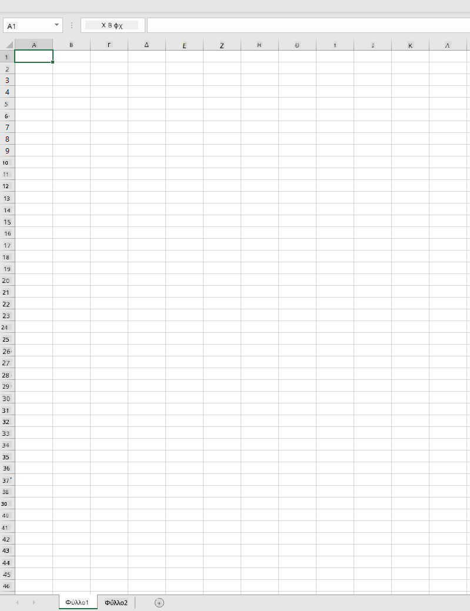
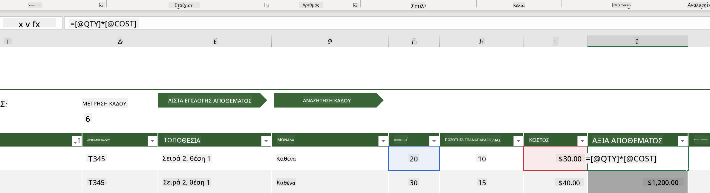
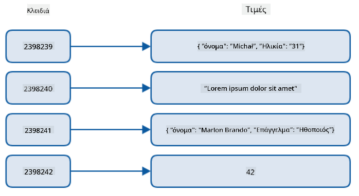
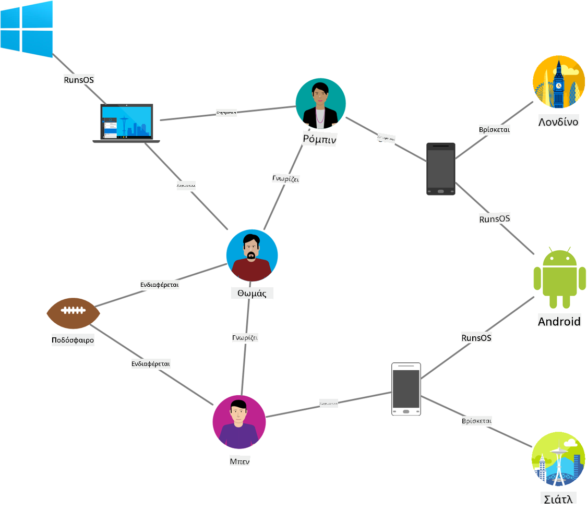
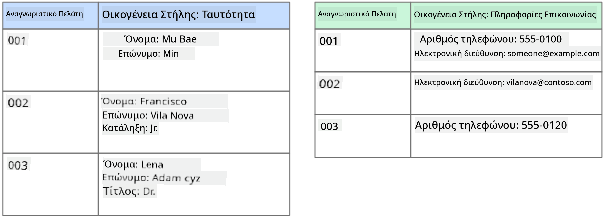
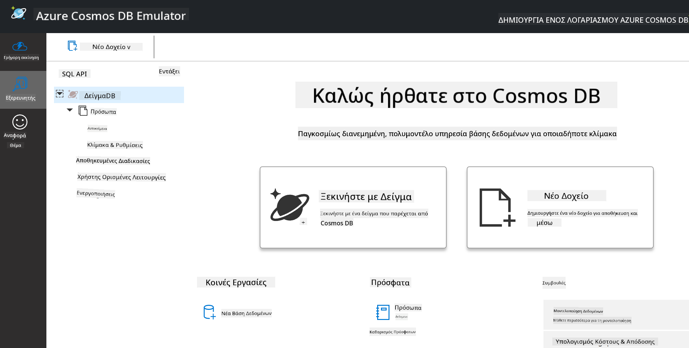
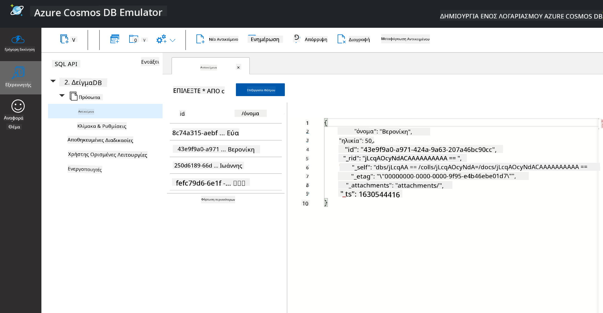
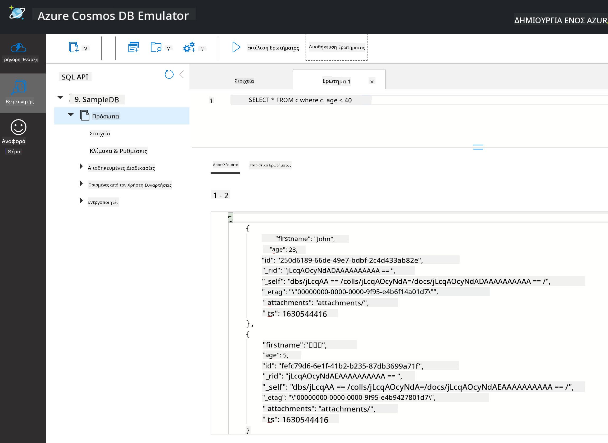

<!--
CO_OP_TRANSLATOR_METADATA:
{
  "original_hash": "54c5a1c74aecb69d2f9099300a4b7eea",
  "translation_date": "2025-09-04T18:25:41+00:00",
  "source_file": "2-Working-With-Data/06-non-relational/README.md",
  "language_code": "el"
}
-->
# Εργασία με Δεδομένα: Μη Σχεσιακά Δεδομένα

| ](../../sketchnotes/06-NoSQL.png)|
|:---:|
|Εργασία με Δεδομένα NoSQL - _Σκίτσο από [@nitya](https://twitter.com/nitya)_ |

## [Προ-Διάλεξης Κουίζ](https://purple-hill-04aebfb03.1.azurestaticapps.net/quiz/10)

Τα δεδομένα δεν περιορίζονται μόνο σε σχεσιακές βάσεις δεδομένων. Αυτό το μάθημα επικεντρώνεται στα μη σχεσιακά δεδομένα και θα καλύψει τα βασικά των υπολογιστικών φύλλων και του NoSQL.

## Υπολογιστικά Φύλλα

Τα υπολογιστικά φύλλα είναι ένας δημοφιλής τρόπος αποθήκευσης και εξερεύνησης δεδομένων, καθώς απαιτούν λιγότερη προετοιμασία για να ξεκινήσετε. Σε αυτό το μάθημα θα μάθετε τα βασικά στοιχεία ενός υπολογιστικού φύλλου, καθώς και τις φόρμουλες και τις συναρτήσεις. Τα παραδείγματα θα παρουσιαστούν με το Microsoft Excel, αλλά τα περισσότερα μέρη και θέματα θα έχουν παρόμοια ονόματα και βήματα σε σύγκριση με άλλα λογισμικά υπολογιστικών φύλλων.



Ένα υπολογιστικό φύλλο είναι ένα αρχείο και θα είναι προσβάσιμο στο σύστημα αρχείων ενός υπολογιστή, συσκευής ή σύστημα αρχείων βασισμένο στο cloud. Το ίδιο το λογισμικό μπορεί να είναι βασισμένο σε πρόγραμμα περιήγησης ή εφαρμογή που πρέπει να εγκατασταθεί σε έναν υπολογιστή ή να κατεβεί ως εφαρμογή. Στο Excel αυτά τα αρχεία ορίζονται επίσης ως **workbooks** και αυτή η ορολογία θα χρησιμοποιηθεί για το υπόλοιπο του μαθήματος.

Ένα workbook περιέχει ένα ή περισσότερα **worksheets**, όπου κάθε φύλλο εργασίας έχει ετικέτες με καρτέλες. Μέσα σε ένα φύλλο εργασίας υπάρχουν ορθογώνια που ονομάζονται **cells**, τα οποία περιέχουν τα πραγματικά δεδομένα. Ένα κελί είναι η τομή μιας γραμμής και μιας στήλης, όπου οι στήλες έχουν ετικέτες με αλφαβητικούς χαρακτήρες και οι γραμμές αριθμούνται. Ορισμένα υπολογιστικά φύλλα περιέχουν επικεφαλίδες στις πρώτες γραμμές για να περιγράψουν τα δεδομένα σε ένα κελί.

Με αυτά τα βασικά στοιχεία ενός workbook Excel, θα χρησιμοποιήσουμε ένα παράδειγμα από τα [Microsoft Templates](https://templates.office.com/) που επικεντρώνεται σε ένα απόθεμα για να εξετάσουμε μερικά επιπλέον μέρη ενός υπολογιστικού φύλλου.

### Διαχείριση Αποθέματος

Το αρχείο υπολογιστικού φύλλου με όνομα "InventoryExample" είναι ένα μορφοποιημένο υπολογιστικό φύλλο αντικειμένων μέσα σε ένα απόθεμα που περιέχει τρία φύλλα εργασίας, όπου οι καρτέλες έχουν ετικέτες "Inventory List", "Inventory Pick List" και "Bin Lookup". Η γραμμή 4 του φύλλου εργασίας Inventory List είναι η επικεφαλίδα, η οποία περιγράφει την τιμή κάθε κελιού στη στήλη επικεφαλίδας.



Υπάρχουν περιπτώσεις όπου ένα κελί εξαρτάται από τις τιμές άλλων κελιών για να δημιουργήσει την τιμή του. Το υπολογιστικό φύλλο Inventory List παρακολουθεί το κόστος κάθε αντικειμένου στο απόθεμά του, αλλά τι γίνεται αν χρειαστεί να γνωρίζουμε την αξία όλων των αντικειμένων στο απόθεμα; Οι [**φόρμουλες**](https://support.microsoft.com/en-us/office/overview-of-formulas-34519a4e-1e8d-4f4b-84d4-d642c4f63263) εκτελούν ενέργειες στα δεδομένα κελιών και χρησιμοποιούνται για τον υπολογισμό του κόστους του αποθέματος σε αυτό το παράδειγμα. Αυτό το υπολογιστικό φύλλο χρησιμοποιεί μια φόρμουλα στη στήλη Inventory Value για να υπολογίσει την αξία κάθε αντικειμένου πολλαπλασιάζοντας την ποσότητα κάτω από την επικεφαλίδα QTY και το κόστος κάτω από την επικεφαλίδα COST. Κάνοντας διπλό κλικ ή επισημαίνοντας ένα κελί θα εμφανιστεί η φόρμουλα. Θα παρατηρήσετε ότι οι φόρμουλες ξεκινούν με ένα ίσον, ακολουθούμενο από τον υπολογισμό ή τη λειτουργία.


Μπορούμε να χρησιμοποιήσουμε μια άλλη φόρμουλα για να προσθέσουμε όλες τις τιμές του Inventory Value μαζί για να βρούμε τη συνολική αξία. Αυτό θα μπορούσε να υπολογιστεί προσθέτοντας κάθε κελί για να δημιουργηθεί το άθροισμα, αλλά αυτό μπορεί να είναι μια κουραστική εργασία. Το Excel διαθέτει [**συναρτήσεις**](https://support.microsoft.com/en-us/office/sum-function-043e1c7d-7726-4e80-8f32-07b23e057f89), ή προκαθορισμένες φόρμουλες για την εκτέλεση υπολογισμών στις τιμές κελιών. Οι συναρτήσεις απαιτούν ορίσματα, τα οποία είναι οι απαραίτητες τιμές που χρησιμοποιούνται για την εκτέλεση αυτών των υπολογισμών. Όταν οι συναρτήσεις απαιτούν περισσότερα από ένα ορίσματα, πρέπει να παρατίθενται με συγκεκριμένη σειρά, διαφορετικά η συνάρτηση μπορεί να μην υπολογίσει τη σωστή τιμή. Αυτό το παράδειγμα χρησιμοποιεί τη συνάρτηση SUM και χρησιμοποιεί τις τιμές του Inventory Value ως όρισμα για να προσθέσει τη συνολική αξία που αναφέρεται στη γραμμή 3, στήλη B (επίσης αναφέρεται ως B3).

## NoSQL

Το NoSQL είναι ένας γενικός όρος για τους διαφορετικούς τρόπους αποθήκευσης μη σχεσιακών δεδομένων και μπορεί να ερμηνευθεί ως "μη-SQL", "μη-σχεσιακό" ή "όχι μόνο SQL". Αυτοί οι τύποι συστημάτων βάσεων δεδομένων μπορούν να κατηγοριοποιηθούν σε 4 τύπους.


> Πηγή από [Michał Białecki Blog](https://www.michalbialecki.com/2018/03/18/azure-cosmos-db-key-value-database-cloud/)

Οι [βάσεις δεδομένων key-value](https://docs.microsoft.com/en-us/azure/architecture/data-guide/big-data/non-relational-data#keyvalue-data-stores) συνδυάζουν μοναδικά κλειδιά, τα οποία είναι μοναδικοί αναγνωριστές που συνδέονται με μια τιμή. Αυτά τα ζεύγη αποθηκεύονται χρησιμοποιώντας έναν [πίνακα κατακερματισμού](https://www.hackerearth.com/practice/data-structures/hash-tables/basics-of-hash-tables/tutorial/) με μια κατάλληλη συνάρτηση κατακερματισμού.


> Πηγή από [Microsoft](https://docs.microsoft.com/en-us/azure/cosmos-db/graph/graph-introduction#graph-database-by-example)

Οι [βάσεις δεδομένων γραφήματος](https://docs.microsoft.com/en-us/azure/architecture/data-guide/big-data/non-relational-data#graph-data-stores) περιγράφουν σχέσεις στα δεδομένα και αναπαρίστανται ως συλλογή κόμβων και ακμών. Ένας κόμβος αντιπροσωπεύει μια οντότητα, κάτι που υπάρχει στον πραγματικό κόσμο, όπως ένας φοιτητής ή μια τραπεζική δήλωση. Οι ακμές αντιπροσωπεύουν τη σχέση μεταξύ δύο οντοτήτων. Κάθε κόμβος και ακμή έχουν ιδιότητες που παρέχουν πρόσθετες πληροφορίες για κάθε κόμβο και ακμή.



Οι [βάσεις δεδομένων στηλών](https://docs.microsoft.com/en-us/azure/architecture/data-guide/big-data/non-relational-data#columnar-data-stores) οργανώνουν δεδομένα σε στήλες και γραμμές όπως μια σχεσιακή δομή δεδομένων, αλλά κάθε στήλη διαιρείται σε ομάδες που ονομάζονται οικογένεια στηλών, όπου όλα τα δεδομένα κάτω από μία στήλη είναι σχετικά και μπορούν να ανακτηθούν και να τροποποιηθούν ως μία μονάδα.

### Βάσεις Δεδομένων Εγγράφων με το Azure Cosmos DB

Οι [βάσεις δεδομένων εγγράφων](https://docs.microsoft.com/en-us/azure/architecture/data-guide/big-data/non-relational-data#document-data-stores) βασίζονται στην έννοια μιας βάσης δεδομένων key-value και αποτελούνται από μια σειρά πεδίων και αντικειμένων. Αυτή η ενότητα θα εξερευνήσει τις βάσεις δεδομένων εγγράφων με τον εξομοιωτή Cosmos DB.

Μια βάση δεδομένων Cosmos DB ταιριάζει στον ορισμό του "Όχι Μόνο SQL", όπου η βάση δεδομένων εγγράφων του Cosmos DB βασίζεται στη SQL για την αναζήτηση δεδομένων. Το [προηγούμενο μάθημα](../05-relational-databases/README.md) για τη SQL καλύπτει τα βασικά της γλώσσας και θα μπορέσουμε να εφαρμόσουμε μερικές από τις ίδιες αναζητήσεις σε μια βάση δεδομένων εγγράφων εδώ. Θα χρησιμοποιήσουμε τον εξομοιωτή Cosmos DB, ο οποίος μας επιτρέπει να δημιουργήσουμε και να εξερευνήσουμε μια βάση δεδομένων εγγράφων τοπικά σε έναν υπολογιστή. Διαβάστε περισσότερα για τον εξομοιωτή [εδώ](https://docs.microsoft.com/en-us/azure/cosmos-db/local-emulator?tabs=ssl-netstd21).

Ένα έγγραφο είναι μια συλλογή πεδίων και τιμών αντικειμένων, όπου τα πεδία περιγράφουν τι αντιπροσωπεύει η τιμή του αντικειμένου. Παρακάτω είναι ένα παράδειγμα εγγράφου.

```json
{
    "firstname": "Eva",
    "age": 44,
    "id": "8c74a315-aebf-4a16-bb38-2430a9896ce5",
    "_rid": "bHwDAPQz8s0BAAAAAAAAAA==",
    "_self": "dbs/bHwDAA==/colls/bHwDAPQz8s0=/docs/bHwDAPQz8s0BAAAAAAAAAA==/",
    "_etag": "\"00000000-0000-0000-9f95-010a691e01d7\"",
    "_attachments": "attachments/",
    "_ts": 1630544034
}
```

Τα πεδία ενδιαφέροντος σε αυτό το έγγραφο είναι: `firstname`, `id`, και `age`. Τα υπόλοιπα πεδία με τις υπογραμμίσεις δημιουργήθηκαν από το Cosmos DB.

#### Εξερεύνηση Δεδομένων με τον Εξομοιωτή Cosmos DB

Μπορείτε να κατεβάσετε και να εγκαταστήσετε τον εξομοιωτή [για Windows εδώ](https://aka.ms/cosmosdb-emulator). Ανατρέξτε σε αυτήν την [τεκμηρίωση](https://docs.microsoft.com/en-us/azure/cosmos-db/local-emulator?tabs=ssl-netstd21#run-on-linux-macos) για επιλογές σχετικά με το πώς να εκτελέσετε τον εξομοιωτή για macOS και Linux.

Ο εξομοιωτής ανοίγει ένα παράθυρο προγράμματος περιήγησης, όπου η προβολή Explorer σας επιτρέπει να εξερευνήσετε έγγραφα.



Αν ακολουθείτε, κάντε κλικ στο "Start with Sample" για να δημιουργήσετε μια δείγματική βάση δεδομένων που ονομάζεται SampleDB. Αν επεκτείνετε το SampleDB κάνοντας κλικ στο βέλος, θα βρείτε ένα container που ονομάζεται `Persons`. Ένα container περιέχει μια συλλογή αντικειμένων, τα οποία είναι τα έγγραφα μέσα στο container. Μπορείτε να εξερευνήσετε τα τέσσερα μεμονωμένα έγγραφα κάτω από `Items`.



#### Αναζήτηση Δεδομένων Εγγράφων με τον Εξομοιωτή Cosmos DB

Μπορούμε επίσης να αναζητήσουμε τα δείγματα δεδομένων κάνοντας κλικ στο κουμπί νέας SQL Query (δεύτερο κουμπί από αριστερά).

`SELECT * FROM c` επιστρέφει όλα τα έγγραφα στο container. Ας προσθέσουμε μια where clause και να βρούμε όλους όσους είναι κάτω των 40 ετών.

`SELECT * FROM c where c.age < 40`



Η αναζήτηση επιστρέφει δύο έγγραφα, παρατηρήστε ότι η τιμή age για κάθε έγγραφο είναι μικρότερη από 40.

#### JSON και Έγγραφα

Αν είστε εξοικειωμένοι με το JavaScript Object Notation (JSON), θα παρατηρήσετε ότι τα έγγραφα μοιάζουν με JSON. Υπάρχει ένα αρχείο `PersonsData.json` σε αυτόν τον κατάλογο με περισσότερα δεδομένα που μπορείτε να ανεβάσετε στο container Persons στον εξομοιωτή μέσω του κουμπιού `Upload Item`.

Στις περισσότερες περιπτώσεις, τα APIs που επιστρέφουν δεδομένα JSON μπορούν να μεταφερθούν απευθείας και να αποθηκευτούν σε βάσεις δεδομένων εγγράφων. Παρακάτω είναι ένα άλλο έγγραφο, το οποίο αντιπροσωπεύει tweets από τον λογαριασμό Twitter της Microsoft που ανακτήθηκαν χρησιμοποιώντας το Twitter API και στη συνέχεια εισήχθησαν στο Cosmos DB.

```json
{
    "created_at": "2021-08-31T19:03:01.000Z",
    "id": "1432780985872142341",
    "text": "Blank slate. Like this tweet if you’ve ever painted in Microsoft Paint before. https://t.co/cFeEs8eOPK",
    "_rid": "dhAmAIUsA4oHAAAAAAAAAA==",
    "_self": "dbs/dhAmAA==/colls/dhAmAIUsA4o=/docs/dhAmAIUsA4oHAAAAAAAAAA==/",
    "_etag": "\"00000000-0000-0000-9f84-a0958ad901d7\"",
    "_attachments": "attachments/",
    "_ts": 1630537000
```

Τα πεδία ενδιαφέροντος σε αυτό το έγγραφο είναι: `created_at`, `id`, και `text`.

## 🚀 Πρόκληση

Υπάρχει ένα αρχείο `TwitterData.json` που μπορείτε να ανεβάσετε στη βάση δεδομένων SampleDB. Συνιστάται να το προσθέσετε σε ξεχωριστό container. Αυτό μπορεί να γίνει:

1. Κάνοντας κλικ στο κουμπί νέου container στην επάνω δεξιά γωνία
1. Επιλέγοντας την υπάρχουσα βάση δεδομένων (SampleDB) και δημιουργώντας ένα container id για το container
1. Ορίζοντας το partition key σε `/id`
1. Κάνοντας κλικ στο OK (μπορείτε να αγνοήσετε τις υπόλοιπες πληροφορίες σε αυτήν την προβολή, καθώς πρόκειται για ένα μικρό dataset που εκτελείται τοπικά στον υπολογιστή σας)
1. Ανοίξτε το νέο σας container και ανεβάστε το αρχείο Twitter Data με το κουμπί `Upload Item`

Προσπαθήστε να εκτελέσετε μερικές αναζητήσεις SELECT για να βρείτε τα έγγραφα που έχουν τη λέξη Microsoft στο πεδίο text. Υπόδειξη: δοκιμάστε να χρησιμοποιήσετε τη [λέξη-κλειδί LIKE](https://docs.microsoft.com/en-us/azure/cosmos-db/sql/sql-query-keywords#using-like-with-the--wildcard-character).

## [Μετά-Διάλεξης Κουίζ](https://ff-quizzes.netlify.app/en/ds/)

## Ανασκόπηση & Αυτομελέτη

- Υπάρχουν μερικές πρόσθετες μορφοποιήσεις και λειτουργίες που προστέθηκαν σε αυτό το υπολογιστικό φύλλο, τις οποίες αυτό το μάθημα δεν καλύπτει. Η Microsoft διαθέτει μια [μεγάλη βιβλιοθήκη τεκμηρίωσης και βίντεο](https://support.microsoft.com/excel) για το Excel αν ενδιαφέρεστε να μάθετε περισσότερα.

- Αυτή η αρχιτεκτονική τεκμηρίωση περιγράφει τα χαρακτηριστικά στους διαφορετικούς τύπους μη σχεσιακών δεδομένων: [Μη Σχεσιακά Δεδομένα και NoSQL](https://docs.microsoft.com/en-us/azure/architecture/data-guide/big-data/non-relational-data)

- Το Cosmos DB είναι μια βάση δεδομένων μη σχεσιακού τύπου βασισμένη στο cloud που μπορεί επίσης να αποθηκεύσει τους διαφορετικούς τύπους NoSQL που αναφέρονται σε αυτό το μάθημα. Μάθετε περισσότερα για αυτούς τους τύπους σε αυτό το [Cosmos DB Microsoft Learn Module](https://docs.microsoft.com/en-us/learn/paths/work-with-nosql-data-in-azure-cosmos-db/)

## Εργασία

[Soda Profits](assignment.md)

---

**Αποποίηση ευθύνης**:  
Αυτό το έγγραφο έχει μεταφραστεί χρησιμοποιώντας την υπηρεσία αυτόματης μετάφρασης [Co-op Translator](https://github.com/Azure/co-op-translator). Παρόλο που καταβάλλουμε προσπάθειες για ακρίβεια, παρακαλούμε να έχετε υπόψη ότι οι αυτοματοποιημένες μεταφράσεις ενδέχεται να περιέχουν λάθη ή ανακρίβειες. Το πρωτότυπο έγγραφο στη μητρική του γλώσσα θα πρέπει να θεωρείται η αυθεντική πηγή. Για κρίσιμες πληροφορίες, συνιστάται επαγγελματική ανθρώπινη μετάφραση. Δεν φέρουμε ευθύνη για τυχόν παρεξηγήσεις ή εσφαλμένες ερμηνείες που προκύπτουν από τη χρήση αυτής της μετάφρασης.