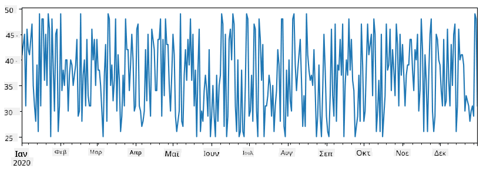
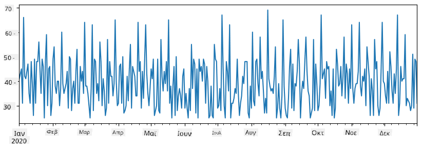
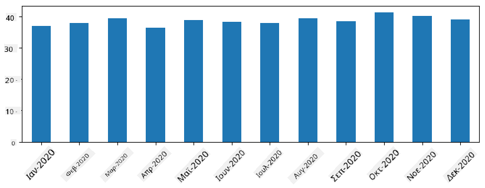
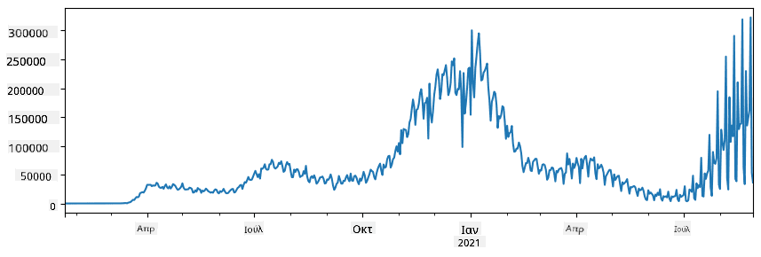
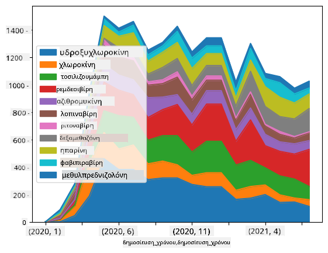

<!--
CO_OP_TRANSLATOR_METADATA:
{
  "original_hash": "116c5d361fbe812e59a73f37ce721d36",
  "translation_date": "2025-08-26T20:59:57+00:00",
  "source_file": "2-Working-With-Data/07-python/README.md",
  "language_code": "el"
}
-->
# Εργασία με Δεδομένα: Python και η Βιβλιοθήκη Pandas

|  ](../../sketchnotes/07-WorkWithPython.png) |
| :-------------------------------------------------------------------------------------------------------: |
|                 Εργασία με Python - _Σκίτσο από [@nitya](https://twitter.com/nitya)_                     |

[](https://youtu.be/dZjWOGbsN4Y)

Ενώ οι βάσεις δεδομένων προσφέρουν πολύ αποδοτικούς τρόπους αποθήκευσης και αναζήτησης δεδομένων μέσω γλωσσών ερωτημάτων, ο πιο ευέλικτος τρόπος επεξεργασίας δεδομένων είναι η συγγραφή του δικού σας προγράμματος για τη διαχείριση των δεδομένων. Σε πολλές περιπτώσεις, μια ερώτηση σε βάση δεδομένων μπορεί να είναι πιο αποτελεσματική. Ωστόσο, σε περιπτώσεις όπου απαιτείται πιο σύνθετη επεξεργασία δεδομένων, αυτό δεν μπορεί να γίνει εύκολα με SQL.  
Η επεξεργασία δεδομένων μπορεί να προγραμματιστεί σε οποιαδήποτε γλώσσα προγραμματισμού, αλλά υπάρχουν ορισμένες γλώσσες που είναι πιο κατάλληλες για εργασία με δεδομένα. Οι επιστήμονες δεδομένων συνήθως προτιμούν μία από τις παρακάτω γλώσσες:

* **[Python](https://www.python.org/)**, μια γλώσσα γενικού σκοπού, που συχνά θεωρείται μία από τις καλύτερες επιλογές για αρχάριους λόγω της απλότητάς της. Η Python διαθέτει πολλές πρόσθετες βιβλιοθήκες που μπορούν να σας βοηθήσουν να λύσετε πολλά πρακτικά προβλήματα, όπως η εξαγωγή δεδομένων από αρχεία ZIP ή η μετατροπή εικόνων σε αποχρώσεις του γκρι. Εκτός από την επιστήμη δεδομένων, η Python χρησιμοποιείται συχνά και για ανάπτυξη ιστοσελίδων.  
* **[R](https://www.r-project.org/)** είναι ένα παραδοσιακό εργαλείο που αναπτύχθηκε με γνώμονα την επεξεργασία στατιστικών δεδομένων. Διαθέτει επίσης μια μεγάλη αποθήκη βιβλιοθηκών (CRAN), καθιστώντας το μια καλή επιλογή για επεξεργασία δεδομένων. Ωστόσο, το R δεν είναι γλώσσα γενικού σκοπού και σπάνια χρησιμοποιείται εκτός του τομέα της επιστήμης δεδομένων.  
* **[Julia](https://julialang.org/)** είναι μια άλλη γλώσσα που αναπτύχθηκε ειδικά για την επιστήμη δεδομένων. Σχεδιάστηκε για να προσφέρει καλύτερη απόδοση από την Python, καθιστώντας την ένα εξαιρετικό εργαλείο για επιστημονικά πειράματα.

Σε αυτό το μάθημα, θα επικεντρωθούμε στη χρήση της Python για απλή επεξεργασία δεδομένων. Θα υποθέσουμε ότι έχετε βασική εξοικείωση με τη γλώσσα. Αν θέλετε μια πιο βαθιά εισαγωγή στην Python, μπορείτε να ανατρέξετε σε μία από τις παρακάτω πηγές:

* [Μάθετε Python με Διασκεδαστικό Τρόπο μέσω Turtle Graphics και Fractals](https://github.com/shwars/pycourse) - Γρήγορο εισαγωγικό μάθημα στην Python μέσω GitHub  
* [Κάντε τα Πρώτα σας Βήματα με την Python](https://docs.microsoft.com/en-us/learn/paths/python-first-steps/?WT.mc_id=academic-77958-bethanycheum) - Διαδρομή μάθησης στο [Microsoft Learn](http://learn.microsoft.com/?WT.mc_id=academic-77958-bethanycheum)

Τα δεδομένα μπορούν να έχουν πολλές μορφές. Σε αυτό το μάθημα, θα εξετάσουμε τρεις μορφές δεδομένων - **δεδομένα σε πίνακες**, **κείμενο** και **εικόνες**.

Θα επικεντρωθούμε σε μερικά παραδείγματα επεξεργασίας δεδομένων, αντί να σας δώσουμε μια πλήρη επισκόπηση όλων των σχετικών βιβλιοθηκών. Αυτό θα σας επιτρέψει να κατανοήσετε τις βασικές δυνατότητες και να ξέρετε πού να βρείτε λύσεις στα προβλήματά σας όταν τις χρειαστείτε.

> **Η πιο χρήσιμη συμβουλή**. Όταν χρειάζεται να εκτελέσετε μια συγκεκριμένη λειτουργία σε δεδομένα και δεν ξέρετε πώς να το κάνετε, δοκιμάστε να το αναζητήσετε στο διαδίκτυο. Το [Stackoverflow](https://stackoverflow.com/) περιέχει συνήθως πολλά χρήσιμα δείγματα κώδικα σε Python για πολλές τυπικές εργασίες.

## [Κουίζ πριν το μάθημα](https://purple-hill-04aebfb03.1.azurestaticapps.net/quiz/12)

## Δεδομένα σε Πίνακες και Dataframes

Έχετε ήδη συναντήσει δεδομένα σε πίνακες όταν μιλήσαμε για σχεσιακές βάσεις δεδομένων. Όταν έχετε πολλά δεδομένα που περιέχονται σε πολλούς διαφορετικούς συνδεδεμένους πίνακες, είναι λογικό να χρησιμοποιήσετε SQL για να εργαστείτε με αυτά. Ωστόσο, υπάρχουν πολλές περιπτώσεις όπου έχουμε έναν πίνακα δεδομένων και θέλουμε να αποκτήσουμε κάποια **κατανόηση** ή **συμπεράσματα** για αυτά τα δεδομένα, όπως η κατανομή, η συσχέτιση μεταξύ τιμών κ.λπ. Στην επιστήμη δεδομένων, υπάρχουν πολλές περιπτώσεις όπου πρέπει να εκτελέσουμε κάποιους μετασχηματισμούς στα αρχικά δεδομένα, ακολουθούμενους από οπτικοποίηση. Και τα δύο αυτά βήματα μπορούν να γίνουν εύκολα με τη χρήση της Python.

Υπάρχουν δύο πιο χρήσιμες βιβλιοθήκες στην Python που μπορούν να σας βοηθήσουν να διαχειριστείτε δεδομένα σε πίνακες:
* **[Pandas](https://pandas.pydata.org/)** σας επιτρέπει να διαχειρίζεστε τα λεγόμενα **Dataframes**, τα οποία είναι ανάλογα με τους σχεσιακούς πίνακες. Μπορείτε να έχετε ονομασμένες στήλες και να εκτελείτε διάφορες λειτουργίες σε γραμμές, στήλες και γενικά στα dataframes.  
* **[Numpy](https://numpy.org/)** είναι μια βιβλιοθήκη για εργασία με **tensors**, δηλαδή πολυδιάστατους **πίνακες**. Οι πίνακες έχουν τιμές του ίδιου υποκείμενου τύπου, είναι πιο απλοί από τα dataframes, αλλά προσφέρουν περισσότερες μαθηματικές λειτουργίες και δημιουργούν λιγότερη επιβάρυνση.

Υπάρχουν επίσης μερικές άλλες βιβλιοθήκες που πρέπει να γνωρίζετε:
* **[Matplotlib](https://matplotlib.org/)** είναι μια βιβλιοθήκη που χρησιμοποιείται για οπτικοποίηση δεδομένων και σχεδίαση γραφημάτων  
* **[SciPy](https://www.scipy.org/)** είναι μια βιβλιοθήκη με πρόσθετες επιστημονικές λειτουργίες. Την έχουμε ήδη συναντήσει όταν μιλήσαμε για πιθανότητες και στατιστική.

Ακολουθεί ένα κομμάτι κώδικα που θα χρησιμοποιούσατε συνήθως για να εισάγετε αυτές τις βιβλιοθήκες στην αρχή του προγράμματος Python:
```python
import numpy as np
import pandas as pd
import matplotlib.pyplot as plt
from scipy import ... # you need to specify exact sub-packages that you need
``` 

Η Pandas επικεντρώνεται σε μερικές βασικές έννοιες.

### Series 

Η **Series** είναι μια ακολουθία τιμών, παρόμοια με μια λίστα ή έναν πίνακα numpy. Η κύρια διαφορά είναι ότι η series έχει επίσης έναν **δείκτη**, και όταν εκτελούμε λειτουργίες σε series (π.χ., προσθέτουμε), ο δείκτης λαμβάνεται υπόψη. Ο δείκτης μπορεί να είναι τόσο απλός όσο ένας ακέραιος αριθμός γραμμής (είναι ο προεπιλεγμένος δείκτης όταν δημιουργούμε μια series από λίστα ή πίνακα), ή μπορεί να έχει μια πιο σύνθετη δομή, όπως ένα χρονικό διάστημα.

> **Σημείωση**: Υπάρχει εισαγωγικός κώδικας Pandas στο συνοδευτικό notebook [`notebook.ipynb`](notebook.ipynb). Εδώ παραθέτουμε μόνο μερικά παραδείγματα, και σίγουρα μπορείτε να εξερευνήσετε το πλήρες notebook.

Ας δούμε ένα παράδειγμα: θέλουμε να αναλύσουμε τις πωλήσεις του καταστήματος παγωτών μας. Ας δημιουργήσουμε μια σειρά αριθμών πωλήσεων (αριθμός αντικειμένων που πωλήθηκαν κάθε μέρα) για μια χρονική περίοδο:

```python
start_date = "Jan 1, 2020"
end_date = "Mar 31, 2020"
idx = pd.date_range(start_date,end_date)
print(f"Length of index is {len(idx)}")
items_sold = pd.Series(np.random.randint(25,50,size=len(idx)),index=idx)
items_sold.plot()
```


Τώρα, ας υποθέσουμε ότι κάθε εβδομάδα οργανώνουμε ένα πάρτι για φίλους και παίρνουμε επιπλέον 10 πακέτα παγωτού για το πάρτι. Μπορούμε να δημιουργήσουμε μια άλλη σειρά, με δείκτη ανά εβδομάδα, για να το δείξουμε αυτό:
```python
additional_items = pd.Series(10,index=pd.date_range(start_date,end_date,freq="W"))
```
Όταν προσθέτουμε τις δύο σειρές μαζί, παίρνουμε το συνολικό αριθμό:
```python
total_items = items_sold.add(additional_items,fill_value=0)
total_items.plot()
```


> **Σημείωση** ότι δεν χρησιμοποιούμε την απλή σύνταξη `total_items+additional_items`. Αν το κάναμε, θα λαμβάναμε πολλές τιμές `NaN` (*Not a Number*) στη σειρά που προκύπτει. Αυτό συμβαίνει επειδή υπάρχουν ελλιπείς τιμές για ορισμένα σημεία του δείκτη στη σειρά `additional_items`, και η πρόσθεση του `NaN` με οτιδήποτε άλλο δίνει `NaN`. Έτσι, πρέπει να καθορίσουμε την παράμετρο `fill_value` κατά την πρόσθεση.

Με τις χρονικές σειρές, μπορούμε επίσης να κάνουμε **επαναδειγματοληψία** της σειράς με διαφορετικά χρονικά διαστήματα. Για παράδειγμα, αν θέλουμε να υπολογίσουμε τον μέσο όγκο πωλήσεων μηνιαίως, μπορούμε να χρησιμοποιήσουμε τον παρακάτω κώδικα:
```python
monthly = total_items.resample("1M").mean()
ax = monthly.plot(kind='bar')
```


### DataFrame

Ένα DataFrame είναι ουσιαστικά μια συλλογή από series με τον ίδιο δείκτη. Μπορούμε να συνδυάσουμε πολλές series μαζί σε ένα DataFrame:
```python
a = pd.Series(range(1,10))
b = pd.Series(["I","like","to","play","games","and","will","not","change"],index=range(0,9))
df = pd.DataFrame([a,b])
```
Αυτό θα δημιουργήσει έναν οριζόντιο πίνακα όπως αυτόν:
|     | 0   | 1    | 2   | 3   | 4      | 5   | 6      | 7    | 8    |
| --- | --- | ---- | --- | --- | ------ | --- | ------ | ---- | ---- |
| 0   | 1   | 2    | 3   | 4   | 5      | 6   | 7      | 8    | 9    |
| 1   | I   | like | to  | use | Python | and | Pandas | very | much |

Μπορούμε επίσης να χρησιμοποιήσουμε Series ως στήλες και να καθορίσουμε ονόματα στηλών χρησιμοποιώντας λεξικό:
```python
df = pd.DataFrame({ 'A' : a, 'B' : b })
```
Αυτό θα μας δώσει έναν πίνακα όπως αυτόν:

|     | A   | B      |
| --- | --- | ------ |
| 0   | 1   | I      |
| 1   | 2   | like   |
| 2   | 3   | to     |
| 3   | 4   | use    |
| 4   | 5   | Python |
| 5   | 6   | and    |
| 6   | 7   | Pandas |
| 7   | 8   | very   |
| 8   | 9   | much   |

**Σημείωση** ότι μπορούμε επίσης να πάρουμε αυτή τη διάταξη πίνακα κάνοντας μετατροπή του προηγούμενου πίνακα, π.χ., γράφοντας 
```python
df = pd.DataFrame([a,b]).T..rename(columns={ 0 : 'A', 1 : 'B' })
```
Εδώ το `.T` σημαίνει τη λειτουργία μετατροπής του DataFrame, δηλαδή την αλλαγή γραμμών και στηλών, και η λειτουργία `rename` μας επιτρέπει να μετονομάσουμε τις στήλες ώστε να ταιριάζουν με το προηγούμενο παράδειγμα.

Ακολουθούν μερικές από τις πιο σημαντικές λειτουργίες που μπορούμε να εκτελέσουμε σε DataFrames:

**Επιλογή στηλών**. Μπορούμε να επιλέξουμε μεμονωμένες στήλες γράφοντας `df['A']` - αυτή η λειτουργία επιστρέφει μια Series. Μπορούμε επίσης να επιλέξουμε ένα υποσύνολο στηλών σε ένα άλλο DataFrame γράφοντας `df[['B','A']]` - αυτό επιστρέφει ένα άλλο DataFrame.

**Φιλτράρισμα** μόνο ορισμένων γραμμών βάσει κριτηρίων. Για παράδειγμα, για να αφήσουμε μόνο γραμμές με τη στήλη `A` μεγαλύτερη από 5, μπορούμε να γράψουμε `df[df['A']>5]`.

> **Σημείωση**: Ο τρόπος που λειτουργεί το φιλτράρισμα είναι ο εξής. Η έκφραση `df['A']<5` επιστρέφει μια boolean σειρά, η οποία υποδεικνύει αν η έκφραση είναι `True` ή `False` για κάθε στοιχείο της αρχικής σειράς `df['A']`. Όταν η boolean σειρά χρησιμοποιείται ως δείκτης, επιστρέφει ένα υποσύνολο γραμμών στο DataFrame. Έτσι, δεν είναι δυνατό να χρησιμοποιήσετε αυθαίρετες boolean εκφράσεις της Python, για παράδειγμα, το να γράψετε `df[df['A']>5 and df['A']<7]` θα ήταν λάθος. Αντίθετα, θα πρέπει να χρησιμοποιήσετε την ειδική λειτουργία `&` στις boolean σειρές, γράφοντας `df[(df['A']>5) & (df['A']<7)]` (*οι παρενθέσεις είναι σημαντικές εδώ*).

**Δημιουργία νέων υπολογιζόμενων στηλών**. Μπορούμε εύκολα να δημιουργήσουμε νέες υπολογιζόμενες στήλες για το DataFrame μας χρησιμοποιώντας διαισθητικές εκφράσεις όπως αυτή:
```python
df['DivA'] = df['A']-df['A'].mean() 
``` 
Αυτό το παράδειγμα υπολογίζει την απόκλιση της A από τη μέση τιμή της. Αυτό που συμβαίνει εδώ είναι ότι υπολογίζουμε μια σειρά και στη συνέχεια την αναθέτουμε στην αριστερή πλευρά, δημιουργώντας μια άλλη στήλη. Έτσι, δεν μπορούμε να χρησιμοποιήσουμε λειτουργίες που δεν είναι συμβατές με τις σειρές, για παράδειγμα, ο παρακάτω κώδικας είναι λάθος:
```python
# Wrong code -> df['ADescr'] = "Low" if df['A'] < 5 else "Hi"
df['LenB'] = len(df['B']) # <- Wrong result
``` 
Το τελευταίο παράδειγμα, αν και συντακτικά σωστό, μας δίνει λάθος αποτέλεσμα, επειδή αναθέτει το μήκος της σειράς `B` σε όλες τις τιμές της στήλης, και όχι το μήκος των μεμονωμένων στοιχείων όπως σκοπεύαμε.

Αν χρειαστεί να υπολογίσουμε σύνθετες εκφράσεις όπως αυτή, μπορούμε να χρησιμοποιήσουμε τη λειτουργία `apply`. Το τελευταίο παράδειγμα μπορεί να γραφτεί ως εξής:
```python
df['LenB'] = df['B'].apply(lambda x : len(x))
# or 
df['LenB'] = df['B'].apply(len)
```

Μετά τις παραπάνω λειτουργίες, θα καταλήξουμε στο παρακάτω DataFrame:

|     | A   | B      | DivA | LenB |
| --- | --- | ------ | ---- | ---- |
| 0   | 1   | I      | -4.0 | 1    |
| 1   | 2   | like   | -3.0 | 4    |
| 2   | 3   | to     | -2.0 | 2    |
| 3   | 4   | use    | -1.0 | 3    |
| 4   | 5   | Python | 0.0  | 6    |
| 5   | 6   | and    | 1.0  | 3    |
| 6   | 7   | Pandas | 2.0  | 6    |
| 7   | 8   | very   | 3.0  | 4    |
| 8   | 9   | much   | 4.0  | 4    |

**Επιλογή γραμμών βάσει αριθμών** μπορεί να γίνει χρησιμοποιώντας τη δομή `iloc`. Για παράδειγμα, για να επιλέξουμε τις πρώτες 5 γραμμές από το DataFrame:
```python
df.iloc[:5]
```

**Ομαδοποίηση** χρησιμοποιείται συχνά για να πάρουμε ένα αποτέλεσμα παρόμοιο με τους *συγκεντρωτικούς πίνακες* στο Excel. Ας υποθέσουμε ότι θέλουμε να υπολογίσουμε τη μέση τιμή της στήλης `A` για κάθε δεδομένο αριθμό του `LenB`. Τότε μπορούμε να ομαδοποιήσουμε το DataFrame μας κατά `LenB` και να καλέσουμε τη λειτουργία `mean`:
```python
df.groupby(by='LenB').mean()
```
Αν χρειαστεί να υπολογίσουμε τη μέση τιμή και τον αριθμό των στοιχείων στην ομάδα, τότε μπορούμε να χρησιμοποιήσουμε τη
Έχουμε δει πόσο εύκολο είναι να δημιουργήσουμε Series και DataFrames από αντικείμενα Python. Ωστόσο, τα δεδομένα συνήθως έρχονται με τη μορφή ενός αρχείου κειμένου ή ενός πίνακα Excel. Ευτυχώς, το Pandas μας προσφέρει έναν απλό τρόπο να φορτώσουμε δεδομένα από τον δίσκο. Για παράδειγμα, η ανάγνωση ενός αρχείου CSV είναι τόσο απλή όσο αυτό:
```python
df = pd.read_csv('file.csv')
```
Θα δούμε περισσότερα παραδείγματα φόρτωσης δεδομένων, συμπεριλαμβανομένης της ανάκτησής τους από εξωτερικούς ιστότοπους, στην ενότητα "Πρόκληση".

### Εκτύπωση και Οπτικοποίηση

Ένας Data Scientist συχνά πρέπει να εξερευνήσει τα δεδομένα, επομένως είναι σημαντικό να μπορεί να τα οπτικοποιήσει. Όταν το DataFrame είναι μεγάλο, πολλές φορές θέλουμε απλώς να βεβαιωθούμε ότι κάνουμε τα πάντα σωστά εκτυπώνοντας τις πρώτες λίγες γραμμές. Αυτό μπορεί να γίνει καλώντας τη μέθοδο `df.head()`. Εάν το εκτελείτε από το Jupyter Notebook, θα εκτυπώσει το DataFrame σε μια ωραία ταμπουλαρισμένη μορφή.

Έχουμε επίσης δει τη χρήση της συνάρτησης `plot` για την οπτικοποίηση ορισμένων στηλών. Ενώ η `plot` είναι πολύ χρήσιμη για πολλές εργασίες και υποστηρίζει πολλούς διαφορετικούς τύπους γραφημάτων μέσω της παραμέτρου `kind=`, μπορείτε πάντα να χρησιμοποιήσετε τη βιβλιοθήκη `matplotlib` για να σχεδιάσετε κάτι πιο περίπλοκο. Θα καλύψουμε την οπτικοποίηση δεδομένων λεπτομερώς σε ξεχωριστά μαθήματα του μαθήματος.

Αυτή η επισκόπηση καλύπτει τις πιο σημαντικές έννοιες του Pandas, ωστόσο, η βιβλιοθήκη είναι πολύ πλούσια και δεν υπάρχει όριο σε αυτά που μπορείτε να κάνετε με αυτήν! Ας εφαρμόσουμε τώρα αυτή τη γνώση για την επίλυση ενός συγκεκριμένου προβλήματος.

## 🚀 Πρόκληση 1: Ανάλυση της Εξάπλωσης του COVID

Το πρώτο πρόβλημα στο οποίο θα επικεντρωθούμε είναι η μοντελοποίηση της εξάπλωσης της επιδημίας του COVID-19. Για να το κάνουμε αυτό, θα χρησιμοποιήσουμε τα δεδομένα για τον αριθμό των μολυσμένων ατόμων σε διάφορες χώρες, που παρέχονται από το [Center for Systems Science and Engineering](https://systems.jhu.edu/) (CSSE) του [Johns Hopkins University](https://jhu.edu/). Το σύνολο δεδομένων είναι διαθέσιμο σε αυτό το [GitHub Repository](https://github.com/CSSEGISandData/COVID-19).

Επειδή θέλουμε να δείξουμε πώς να χειριζόμαστε δεδομένα, σας προσκαλούμε να ανοίξετε το [`notebook-covidspread.ipynb`](notebook-covidspread.ipynb) και να το διαβάσετε από την αρχή μέχρι το τέλος. Μπορείτε επίσης να εκτελέσετε τα κελιά και να κάνετε κάποιες προκλήσεις που έχουμε αφήσει για εσάς στο τέλος.



> Αν δεν ξέρετε πώς να εκτελέσετε κώδικα στο Jupyter Notebook, ρίξτε μια ματιά σε αυτό το [άρθρο](https://soshnikov.com/education/how-to-execute-notebooks-from-github/).

## Εργασία με Μη Δομημένα Δεδομένα

Ενώ τα δεδομένα συχνά έρχονται σε ταμπουλαρισμένη μορφή, σε ορισμένες περιπτώσεις πρέπει να χειριστούμε λιγότερο δομημένα δεδομένα, όπως κείμενο ή εικόνες. Σε αυτή την περίπτωση, για να εφαρμόσουμε τις τεχνικές επεξεργασίας δεδομένων που έχουμε δει παραπάνω, πρέπει με κάποιο τρόπο να **εξάγουμε** δομημένα δεδομένα. Εδώ είναι μερικά παραδείγματα:

* Εξαγωγή λέξεων-κλειδιών από κείμενο και ανάλυση της συχνότητάς τους
* Χρήση νευρωνικών δικτύων για την εξαγωγή πληροφοριών σχετικά με αντικείμενα σε εικόνες
* Λήψη πληροφοριών για τα συναισθήματα ανθρώπων από ροές βίντεο

## 🚀 Πρόκληση 2: Ανάλυση Επιστημονικών Άρθρων για τον COVID

Σε αυτή την πρόκληση, θα συνεχίσουμε με το θέμα της πανδημίας COVID και θα επικεντρωθούμε στην επεξεργασία επιστημονικών άρθρων για το θέμα. Υπάρχει το [CORD-19 Dataset](https://www.kaggle.com/allen-institute-for-ai/CORD-19-research-challenge) με περισσότερα από 7000 (τη στιγμή της συγγραφής) άρθρα για τον COVID, διαθέσιμα με μεταδεδομένα και περιλήψεις (και για περίπου τα μισά από αυτά παρέχεται και το πλήρες κείμενο).

Ένα πλήρες παράδειγμα ανάλυσης αυτού του συνόλου δεδομένων χρησιμοποιώντας την υπηρεσία [Text Analytics for Health](https://docs.microsoft.com/azure/cognitive-services/text-analytics/how-tos/text-analytics-for-health/?WT.mc_id=academic-77958-bethanycheum) περιγράφεται σε αυτό το [blog post](https://soshnikov.com/science/analyzing-medical-papers-with-azure-and-text-analytics-for-health/). Θα συζητήσουμε μια απλοποιημένη έκδοση αυτής της ανάλυσης.

> **NOTE**: Δεν παρέχουμε αντίγραφο του συνόλου δεδομένων ως μέρος αυτού του αποθετηρίου. Ίσως χρειαστεί πρώτα να κατεβάσετε το αρχείο [`metadata.csv`](https://www.kaggle.com/allen-institute-for-ai/CORD-19-research-challenge?select=metadata.csv) από αυτό το [σύνολο δεδομένων στο Kaggle](https://www.kaggle.com/allen-institute-for-ai/CORD-19-research-challenge). Ενδέχεται να απαιτείται εγγραφή στο Kaggle. Μπορείτε επίσης να κατεβάσετε το σύνολο δεδομένων χωρίς εγγραφή [από εδώ](https://ai2-semanticscholar-cord-19.s3-us-west-2.amazonaws.com/historical_releases.html), αλλά θα περιλαμβάνει όλα τα πλήρη κείμενα εκτός από το αρχείο μεταδεδομένων.

Ανοίξτε το [`notebook-papers.ipynb`](notebook-papers.ipynb) και διαβάστε το από την αρχή μέχρι το τέλος. Μπορείτε επίσης να εκτελέσετε τα κελιά και να κάνετε κάποιες προκλήσεις που έχουμε αφήσει για εσάς στο τέλος.



## Επεξεργασία Δεδομένων Εικόνας

Πρόσφατα, έχουν αναπτυχθεί πολύ ισχυρά μοντέλα AI που μας επιτρέπουν να κατανοούμε εικόνες. Υπάρχουν πολλές εργασίες που μπορούν να λυθούν χρησιμοποιώντας προεκπαιδευμένα νευρωνικά δίκτυα ή υπηρεσίες cloud. Μερικά παραδείγματα περιλαμβάνουν:

* **Ταξινόμηση Εικόνων**, που μπορεί να σας βοηθήσει να κατηγοριοποιήσετε την εικόνα σε μία από τις προκαθορισμένες κατηγορίες. Μπορείτε εύκολα να εκπαιδεύσετε τους δικούς σας ταξινομητές εικόνων χρησιμοποιώντας υπηρεσίες όπως το [Custom Vision](https://azure.microsoft.com/services/cognitive-services/custom-vision-service/?WT.mc_id=academic-77958-bethanycheum)
* **Ανίχνευση Αντικειμένων** για την ανίχνευση διαφορετικών αντικειμένων στην εικόνα. Υπηρεσίες όπως το [computer vision](https://azure.microsoft.com/services/cognitive-services/computer-vision/?WT.mc_id=academic-77958-bethanycheum) μπορούν να ανιχνεύσουν έναν αριθμό κοινών αντικειμένων, και μπορείτε να εκπαιδεύσετε ένα μοντέλο [Custom Vision](https://azure.microsoft.com/services/cognitive-services/custom-vision-service/?WT.mc_id=academic-77958-bethanycheum) για να ανιχνεύσετε συγκεκριμένα αντικείμενα ενδιαφέροντος.
* **Ανίχνευση Προσώπων**, συμπεριλαμβανομένης της ηλικίας, του φύλου και της ανίχνευσης συναισθημάτων. Αυτό μπορεί να γίνει μέσω του [Face API](https://azure.microsoft.com/services/cognitive-services/face/?WT.mc_id=academic-77958-bethanycheum).

Όλες αυτές οι υπηρεσίες cloud μπορούν να κληθούν χρησιμοποιώντας [Python SDKs](https://docs.microsoft.com/samples/azure-samples/cognitive-services-python-sdk-samples/cognitive-services-python-sdk-samples/?WT.mc_id=academic-77958-bethanycheum), και έτσι μπορούν εύκολα να ενσωματωθούν στη ροή εργασίας εξερεύνησης δεδομένων σας.

Εδώ είναι μερικά παραδείγματα εξερεύνησης δεδομένων από πηγές δεδομένων εικόνας:
* Στο blog post [How to Learn Data Science without Coding](https://soshnikov.com/azure/how-to-learn-data-science-without-coding/) εξερευνούμε φωτογραφίες από το Instagram, προσπαθώντας να κατανοήσουμε τι κάνει τους ανθρώπους να δίνουν περισσότερα likes σε μια φωτογραφία. Πρώτα εξάγουμε όσο το δυνατόν περισσότερες πληροφορίες από τις εικόνες χρησιμοποιώντας το [computer vision](https://azure.microsoft.com/services/cognitive-services/computer-vision/?WT.mc_id=academic-77958-bethanycheum), και στη συνέχεια χρησιμοποιούμε το [Azure Machine Learning AutoML](https://docs.microsoft.com/azure/machine-learning/concept-automated-ml/?WT.mc_id=academic-77958-bethanycheum) για να δημιουργήσουμε ένα ερμηνεύσιμο μοντέλο.
* Στο [Facial Studies Workshop](https://github.com/CloudAdvocacy/FaceStudies) χρησιμοποιούμε το [Face API](https://azure.microsoft.com/services/cognitive-services/face/?WT.mc_id=academic-77958-bethanycheum) για να εξάγουμε συναισθήματα από ανθρώπους σε φωτογραφίες από εκδηλώσεις, προκειμένου να προσπαθήσουμε να κατανοήσουμε τι κάνει τους ανθρώπους χαρούμενους.

## Συμπέρασμα

Είτε έχετε ήδη δομημένα είτε μη δομημένα δεδομένα, χρησιμοποιώντας Python μπορείτε να εκτελέσετε όλα τα βήματα που σχετίζονται με την επεξεργασία και κατανόηση δεδομένων. Είναι πιθανώς ο πιο ευέλικτος τρόπος επεξεργασίας δεδομένων, και αυτός είναι ο λόγος που η πλειοψηφία των data scientists χρησιμοποιεί την Python ως το κύριο εργαλείο τους. Η εκμάθηση της Python σε βάθος είναι πιθανώς μια καλή ιδέα αν είστε σοβαροί για το ταξίδι σας στην επιστήμη δεδομένων!

## [Κουίζ μετά το μάθημα](https://purple-hill-04aebfb03.1.azurestaticapps.net/quiz/13)

## Ανασκόπηση & Αυτομελέτη

**Βιβλία**
* [Wes McKinney. Python for Data Analysis: Data Wrangling with Pandas, NumPy, and IPython](https://www.amazon.com/gp/product/1491957662)

**Διαδικτυακοί Πόροι**
* Επίσημο [10 λεπτά με το Pandas](https://pandas.pydata.org/pandas-docs/stable/user_guide/10min.html) tutorial
* [Τεκμηρίωση για την Οπτικοποίηση στο Pandas](https://pandas.pydata.org/pandas-docs/stable/user_guide/visualization.html)

**Μάθηση Python**
* [Μάθετε Python με Διασκεδαστικό Τρόπο με Turtle Graphics και Fractals](https://github.com/shwars/pycourse)
* [Κάντε τα Πρώτα σας Βήματα με την Python](https://docs.microsoft.com/learn/paths/python-first-steps/?WT.mc_id=academic-77958-bethanycheum) Learning Path στο [Microsoft Learn](http://learn.microsoft.com/?WT.mc_id=academic-77958-bethanycheum)

## Εργασία

[Εκτελέστε πιο λεπτομερή μελέτη δεδομένων για τις παραπάνω προκλήσεις](assignment.md)

## Ευχαριστίες

Αυτό το μάθημα έχει δημιουργηθεί με ♥️ από τον [Dmitry Soshnikov](http://soshnikov.com)

---

**Αποποίηση Ευθύνης**:  
Αυτό το έγγραφο έχει μεταφραστεί χρησιμοποιώντας την υπηρεσία αυτόματης μετάφρασης [Co-op Translator](https://github.com/Azure/co-op-translator). Παρόλο που καταβάλλουμε προσπάθειες για ακρίβεια, παρακαλούμε να έχετε υπόψη ότι οι αυτόματες μεταφράσεις ενδέχεται να περιέχουν λάθη ή ανακρίβειες. Το πρωτότυπο έγγραφο στη μητρική του γλώσσα θα πρέπει να θεωρείται η αυθεντική πηγή. Για κρίσιμες πληροφορίες, συνιστάται επαγγελματική ανθρώπινη μετάφραση. Δεν φέρουμε ευθύνη για τυχόν παρεξηγήσεις ή εσφαλμένες ερμηνείες που προκύπτουν από τη χρήση αυτής της μετάφρασης.