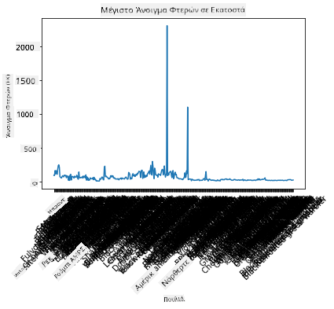
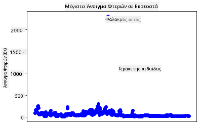
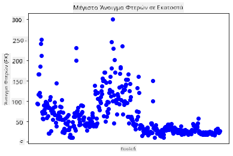
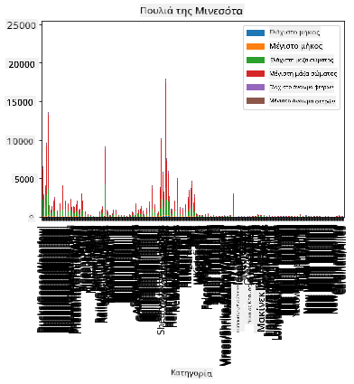
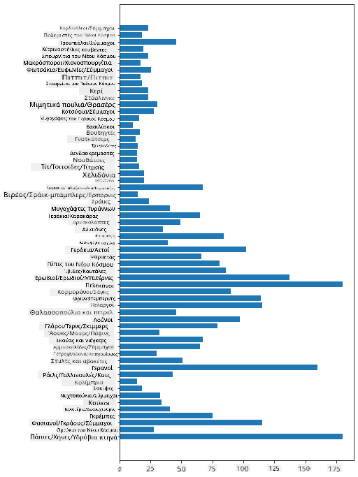
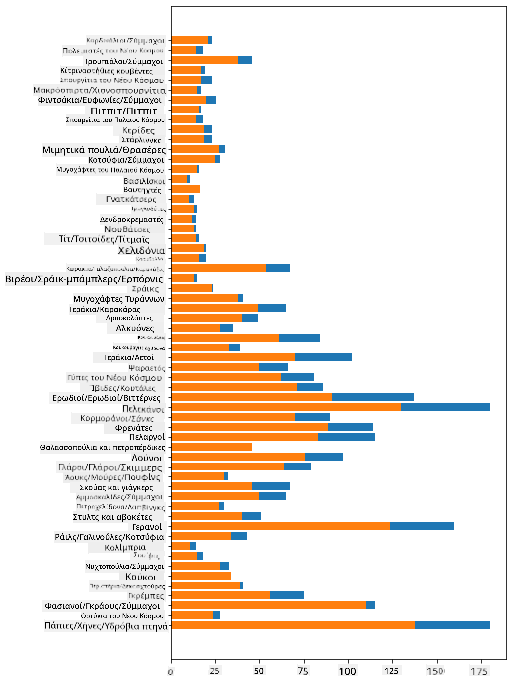

<!--
CO_OP_TRANSLATOR_METADATA:
{
  "original_hash": "69b32b6789a91f796ebc7a02f5575e03",
  "translation_date": "2025-09-04T18:35:04+00:00",
  "source_file": "3-Data-Visualization/09-visualization-quantities/README.md",
  "language_code": "el"
}
-->
# Οπτικοποίηση Ποσοτήτων

| ](../../sketchnotes/09-Visualizing-Quantities.png)|
|:---:|
| Οπτικοποίηση Ποσοτήτων - _Σκίτσο από [@nitya](https://twitter.com/nitya)_ |

Σε αυτό το μάθημα θα εξερευνήσετε πώς να χρησιμοποιήσετε μία από τις πολλές διαθέσιμες βιβλιοθήκες Python για να μάθετε πώς να δημιουργείτε ενδιαφέρουσες οπτικοποιήσεις γύρω από την έννοια της ποσότητας. Χρησιμοποιώντας ένα καθαρισμένο σύνολο δεδομένων για τα πουλιά της Μινεσότα, μπορείτε να μάθετε πολλά ενδιαφέροντα πράγματα για την τοπική άγρια ζωή.  
## [Προ-μάθημα κουίζ](https://purple-hill-04aebfb03.1.azurestaticapps.net/quiz/16)

## Παρατηρήστε το άνοιγμα φτερών με το Matplotlib

Μια εξαιρετική βιβλιοθήκη για τη δημιουργία τόσο απλών όσο και σύνθετων γραφημάτων και διαγραμμάτων διαφόρων ειδών είναι το [Matplotlib](https://matplotlib.org/stable/index.html). Σε γενικές γραμμές, η διαδικασία σχεδίασης δεδομένων χρησιμοποιώντας αυτές τις βιβλιοθήκες περιλαμβάνει τον εντοπισμό των τμημάτων του dataframe που θέλετε να στοχεύσετε, την εκτέλεση οποιωνδήποτε μετασχηματισμών στα δεδομένα που είναι απαραίτητοι, την ανάθεση τιμών στους άξονες x και y, την απόφαση για το είδος του γραφήματος που θα εμφανιστεί και στη συνέχεια την εμφάνιση του γραφήματος. Το Matplotlib προσφέρει μια μεγάλη ποικιλία οπτικοποιήσεων, αλλά για αυτό το μάθημα, ας επικεντρωθούμε σε εκείνες που είναι πιο κατάλληλες για την οπτικοποίηση ποσότητας: γραφήματα γραμμών, scatterplots και ραβδογράμματα.

> ✅ Χρησιμοποιήστε το καλύτερο γράφημα που ταιριάζει στη δομή των δεδομένων σας και την ιστορία που θέλετε να πείτε.  
> - Για ανάλυση τάσεων με την πάροδο του χρόνου: γραμμή  
> - Για σύγκριση τιμών: ράβδος, στήλη, πίτα, scatterplot  
> - Για να δείξετε πώς τα μέρη σχετίζονται με το σύνολο: πίτα  
> - Για να δείξετε την κατανομή των δεδομένων: scatterplot, ράβδος  
> - Για να δείξετε τάσεις: γραμμή, στήλη  
> - Για να δείξετε σχέσεις μεταξύ τιμών: γραμμή, scatterplot, bubble  

Εάν έχετε ένα σύνολο δεδομένων και χρειάζεται να ανακαλύψετε πόσο από ένα συγκεκριμένο στοιχείο περιλαμβάνεται, μία από τις πρώτες εργασίες που έχετε να κάνετε είναι να επιθεωρήσετε τις τιμές του.

✅ Υπάρχουν πολύ καλές 'cheat sheets' διαθέσιμες για το Matplotlib [εδώ](https://matplotlib.org/cheatsheets/cheatsheets.pdf).

## Δημιουργήστε ένα γράφημα γραμμής για τις τιμές ανοίγματος φτερών των πουλιών

Ανοίξτε το αρχείο `notebook.ipynb` στη ρίζα του φακέλου αυτού του μαθήματος και προσθέστε ένα κελί.

> Σημείωση: τα δεδομένα είναι αποθηκευμένα στη ρίζα αυτού του αποθετηρίου στον φάκελο `/data`.

```python
import pandas as pd
import matplotlib.pyplot as plt
birds = pd.read_csv('../../data/birds.csv')
birds.head()
```  
Αυτά τα δεδομένα είναι ένας συνδυασμός κειμένου και αριθμών:

|      | Όνομα                        | Επιστημονικό Όνομα     | Κατηγορία             | Τάξη         | Οικογένεια | Γένος       | Κατάσταση Διατήρησης | Ελάχιστο Μήκος | Μέγιστο Μήκος | Ελάχιστη Μάζα Σώματος | Μέγιστη Μάζα Σώματος | Ελάχιστο Άνοιγμα Φτερών | Μέγιστο Άνοιγμα Φτερών |
| ---: | :--------------------------- | :--------------------- | :-------------------- | :----------- | :------- | :---------- | :----------------- | --------: | --------: | ----------: | ----------: | ----------: | ----------: |
|    0 | Μαυροκοιλιά πάπια            | Dendrocygna autumnalis | Πάπιες/Χήνες/Υδρόβια | Anseriformes | Anatidae | Dendrocygna | LC                 |        47 |        56 |         652 |        1020 |          76 |          94 |
|    1 | Καστανόχρωμη πάπια           | Dendrocygna bicolor    | Πάπιες/Χήνες/Υδρόβια | Anseriformes | Anatidae | Dendrocygna | LC                 |        45 |        53 |         712 |        1050 |          85 |          93 |
|    2 | Χήνα του χιονιού             | Anser caerulescens     | Πάπιες/Χήνες/Υδρόβια | Anseriformes | Anatidae | Anser       | LC                 |        64 |        79 |        2050 |        4050 |         135 |         165 |
|    3 | Χήνα του Ross                | Anser rossii           | Πάπιες/Χήνες/Υδρόβια | Anseriformes | Anatidae | Anser       | LC                 |      57.3 |        64 |        1066 |        1567 |         113 |         116 |
|    4 | Μεγαλόλευκη χήνα             | Anser albifrons        | Πάπιες/Χήνες/Υδρόβια | Anseriformes | Anatidae | Anser       | LC                 |        64 |        81 |        1930 |        3310 |         130 |         165 |

Ας ξεκινήσουμε σχεδιάζοντας μερικά από τα αριθμητικά δεδομένα χρησιμοποιώντας ένα βασικό γράφημα γραμμής. Υποθέστε ότι θέλετε μια εικόνα του μέγιστου ανοίγματος φτερών για αυτά τα ενδιαφέροντα πουλιά.

```python
wingspan = birds['MaxWingspan'] 
wingspan.plot()
```  


Τι παρατηρείτε αμέσως; Φαίνεται να υπάρχει τουλάχιστον μία ακραία τιμή - αυτό είναι αρκετά μεγάλο άνοιγμα φτερών! Ένα άνοιγμα φτερών 2300 εκατοστών ισοδυναμεί με 23 μέτρα - υπάρχουν Πτερόδακτυλοι που περιφέρονται στη Μινεσότα; Ας ερευνήσουμε.

Ενώ θα μπορούσατε να κάνετε μια γρήγορη ταξινόμηση στο Excel για να βρείτε αυτές τις ακραίες τιμές, οι οποίες πιθανότατα είναι τυπογραφικά λάθη, συνεχίστε τη διαδικασία οπτικοποίησης δουλεύοντας από μέσα στο γράφημα.

Προσθέστε ετικέτες στον άξονα x για να δείξετε τι είδους πουλιά εξετάζονται:

```
plt.title('Max Wingspan in Centimeters')
plt.ylabel('Wingspan (CM)')
plt.xlabel('Birds')
plt.xticks(rotation=45)
x = birds['Name'] 
y = birds['MaxWingspan']

plt.plot(x, y)

plt.show()
```  


Ακόμα και με την περιστροφή των ετικετών στις 45 μοίρες, υπάρχουν πάρα πολλές για να διαβαστούν. Ας δοκιμάσουμε μια διαφορετική στρατηγική: ετικέτα μόνο τις ακραίες τιμές και τοποθετήστε τις ετικέτες μέσα στο γράφημα. Μπορείτε να χρησιμοποιήσετε ένα scatter chart για να δημιουργήσετε περισσότερο χώρο για την επισήμανση:

```python
plt.title('Max Wingspan in Centimeters')
plt.ylabel('Wingspan (CM)')
plt.tick_params(axis='both',which='both',labelbottom=False,bottom=False)

for i in range(len(birds)):
    x = birds['Name'][i]
    y = birds['MaxWingspan'][i]
    plt.plot(x, y, 'bo')
    if birds['MaxWingspan'][i] > 500:
        plt.text(x, y * (1 - 0.05), birds['Name'][i], fontsize=12)
    
plt.show()
```  
Τι συμβαίνει εδώ; Χρησιμοποιήσατε `tick_params` για να κρύψετε τις κάτω ετικέτες και στη συνέχεια δημιουργήσατε έναν βρόχο πάνω από το σύνολο δεδομένων των πουλιών σας. Σχεδιάζοντας το γράφημα με μικρές στρογγυλές μπλε κουκκίδες χρησιμοποιώντας `bo`, ελέγξατε για οποιοδήποτε πουλί με μέγιστο άνοιγμα φτερών πάνω από 500 και εμφανίσατε την ετικέτα του δίπλα στην κουκκίδα αν ισχύει. Μετατοπίσατε τις ετικέτες λίγο στον άξονα y (`y * (1 - 0.05)`) και χρησιμοποιήσατε το όνομα του πουλιού ως ετικέτα.

Τι ανακαλύψατε;

  
## Φιλτράρετε τα δεδομένα σας

Τόσο ο Αμερικανικός Αετός όσο και το Γεράκι της Πεδιάδας, ενώ πιθανότατα είναι πολύ μεγάλα πουλιά, φαίνεται να έχουν λανθασμένες ετικέτες, με ένα επιπλέον `0` να έχει προστεθεί στο μέγιστο άνοιγμα φτερών τους. Είναι απίθανο να συναντήσετε έναν Αμερικανικό Αετό με άνοιγμα φτερών 25 μέτρα, αλλά αν συμβεί, παρακαλώ ενημερώστε μας! Ας δημιουργήσουμε ένα νέο dataframe χωρίς αυτά τα δύο ακραία δεδομένα:

```python
plt.title('Max Wingspan in Centimeters')
plt.ylabel('Wingspan (CM)')
plt.xlabel('Birds')
plt.tick_params(axis='both',which='both',labelbottom=False,bottom=False)
for i in range(len(birds)):
    x = birds['Name'][i]
    y = birds['MaxWingspan'][i]
    if birds['Name'][i] not in ['Bald eagle', 'Prairie falcon']:
        plt.plot(x, y, 'bo')
plt.show()
```  

Φιλτράροντας τις ακραίες τιμές, τα δεδομένα σας είναι τώρα πιο συνεκτικά και κατανοητά.



Τώρα που έχουμε ένα καθαρότερο σύνολο δεδομένων τουλάχιστον όσον αφορά το άνοιγμα φτερών, ας ανακαλύψουμε περισσότερα για αυτά τα πουλιά.

Ενώ τα γραφήματα γραμμών και scatter μπορούν να εμφανίσουν πληροφορίες σχετικά με τις τιμές δεδομένων και τις κατανομές τους, θέλουμε να σκεφτούμε τις τιμές που ενυπάρχουν σε αυτό το σύνολο δεδομένων. Θα μπορούσατε να δημιουργήσετε οπτικοποιήσεις για να απαντήσετε στις ακόλουθες ερωτήσεις σχετικά με την ποσότητα:

> Πόσες κατηγορίες πουλιών υπάρχουν και ποιοι είναι οι αριθμοί τους;  
> Πόσα πουλιά είναι εξαφανισμένα, απειλούμενα, σπάνια ή κοινά;  
> Πόσα υπάρχουν από τα διάφορα γένη και τάξεις στην ορολογία του Linnaeus;  
## Εξερευνήστε τα ραβδογράμματα

Τα ραβδογράμματα είναι πρακτικά όταν χρειάζεται να δείξετε ομαδοποιήσεις δεδομένων. Ας εξερευνήσουμε τις κατηγορίες των πουλιών που υπάρχουν σε αυτό το σύνολο δεδομένων για να δούμε ποια είναι η πιο κοινή ανά αριθμό.

Στο αρχείο notebook, δημιουργήστε ένα βασικό ραβδόγραμμα.

✅ Σημείωση, μπορείτε είτε να φιλτράρετε τα δύο ακραία πουλιά που εντοπίσαμε στην προηγούμενη ενότητα, να διορθώσετε το τυπογραφικό λάθος στο άνοιγμα φτερών τους, είτε να τα αφήσετε για αυτές τις ασκήσεις που δεν εξαρτώνται από τις τιμές ανοίγματος φτερών.

Εάν θέλετε να δημιουργήσετε ένα ραβδόγραμμα, μπορείτε να επιλέξετε τα δεδομένα στα οποία θέλετε να εστιάσετε. Τα ραβδογράμματα μπορούν να δημιουργηθούν από ακατέργαστα δεδομένα:

```python
birds.plot(x='Category',
        kind='bar',
        stacked=True,
        title='Birds of Minnesota')

```  


Αυτό το ραβδόγραμμα, ωστόσο, είναι δυσανάγνωστο επειδή υπάρχουν πάρα πολλά μη ομαδοποιημένα δεδομένα. Πρέπει να επιλέξετε μόνο τα δεδομένα που θέλετε να σχεδιάσετε, οπότε ας δούμε το μήκος των πουλιών με βάση την κατηγορία τους.

Φιλτράρετε τα δεδομένα σας ώστε να περιλαμβάνουν μόνο την κατηγορία του πουλιού.

✅ Παρατηρήστε ότι χρησιμοποιείτε Pandas για τη διαχείριση των δεδομένων και στη συνέχεια αφήνετε το Matplotlib να κάνει τη σχεδίαση.

Επειδή υπάρχουν πολλές κατηγορίες, μπορείτε να εμφανίσετε αυτό το γράφημα κάθετα και να προσαρμόσετε το ύψος του για να ληφθούν υπόψη όλα τα δεδομένα:

```python
category_count = birds.value_counts(birds['Category'].values, sort=True)
plt.rcParams['figure.figsize'] = [6, 12]
category_count.plot.barh()
```  


Αυτό το ραβδόγραμμα δείχνει μια καλή εικόνα του αριθμού των πουλιών σε κάθε κατηγορία. Με μια ματιά, βλέπετε ότι ο μεγαλύτερος αριθμός πουλιών σε αυτήν την περιοχή ανήκει στην κατηγορία Πάπιες/Χήνες/Υδρόβια. Η Μινεσότα είναι η 'γη των 10.000 λιμνών', οπότε αυτό δεν είναι έκπληξη!

✅ Δοκιμάστε μερικές άλλες μετρήσεις σε αυτό το σύνολο δεδομένων. Σας εκπλήσσει κάτι;

## Σύγκριση δεδομένων

Μπορείτε να δοκιμάσετε διαφορετικές συγκρίσεις ομαδοποιημένων δεδομένων δημιουργώντας νέους άξονες. Δοκιμάστε μια σύγκριση του MaxLength ενός πουλιού, με βάση την κατηγορία του:

```python
maxlength = birds['MaxLength']
plt.barh(y=birds['Category'], width=maxlength)
plt.rcParams['figure.figsize'] = [6, 12]
plt.show()
```  


Τίποτα δεν είναι εκπληκτικό εδώ: τα κολιμπρί έχουν το μικρότερο MaxLength σε σύγκριση με τους Πελεκάνους ή τις Χήνες. Είναι καλό όταν τα δεδομένα έχουν λογική!

Μπορείτε να δημιουργήσετε πιο ενδιαφέρουσες οπτικοποιήσεις ραβδογραμμάτων υπερθέτοντας δεδομένα. Ας υπερθέσουμε το Ελάχιστο και Μέγιστο Μήκος σε μια δεδομένη κατηγορία πουλιού:

```python
minLength = birds['MinLength']
maxLength = birds['MaxLength']
category = birds['Category']

plt.barh(category, maxLength)
plt.barh(category, minLength)

plt.show()
```  
Σε αυτό το γράφημα, μπορείτε να δείτε το εύρος ανά κατηγορία πουλιού του Ελάχιστου Μήκους και του Μέγιστου Μήκους. Μπορείτε να πείτε με ασφάλεια ότι, δεδομένων αυτών των δεδομένων, όσο μεγαλύτερο το πουλί, τόσο μεγαλύτερο το εύρος μήκους του. Εντυπωσιακό!



## 🚀 Πρόκληση

Αυτό το σύνολο δεδομένων για τα πουλιά προσφέρει μια πληθώρα πληροφοριών για διαφορετικούς τύπους πουλιών μέσα σε ένα συγκεκριμένο οικοσύστημα. Ψάξτε στο διαδίκτυο και δείτε αν μπορείτε να βρείτε άλλα σύνολα δεδομένων που αφορούν πουλιά. Εξασκηθείτε στη δημιουργία γραφημάτων και διαγραμμάτων γύρω από αυτά τα πουλιά για να ανακαλύψετε γεγονότα που δεν γνωρίζατε.

## [Μετά το μάθημα κουίζ](https://ff-quizzes.netlify.app/en/ds/)

## Ανασκόπηση & Αυτομελέτη

Αυτό το πρώτο μάθημα σας έδωσε κάποιες πληροφορίες για το πώς να χρησιμοποιείτε το Matplotlib για την οπτικοποίηση ποσοτήτων. Κάντε κάποια έρευνα γύρω από άλλους τρόπους εργασίας με σύνολα δεδομένων για οπτικοποίηση. Το [Plotly](https://github.com/plotly/plotly.py) είναι ένα που δεν θα καλύψουμε σε αυτά τα μαθήματα, οπότε ρίξτε μια ματιά σε αυτά που μπορεί να προσφέρει.  
## Εργασία

[Γραμμές, Scatter και Ράβδοι](assignment.md)

---

**Αποποίηση ευθύνης**:  
Αυτό το έγγραφο έχει μεταφραστεί χρησιμοποιώντας την υπηρεσία αυτόματης μετάφρασης AI [Co-op Translator](https://github.com/Azure/co-op-translator). Παρόλο που καταβάλλουμε προσπάθειες για ακρίβεια, παρακαλούμε να έχετε υπόψη ότι οι αυτόματες μεταφράσεις ενδέχεται να περιέχουν λάθη ή ανακρίβειες. Το πρωτότυπο έγγραφο στη μητρική του γλώσσα θα πρέπει να θεωρείται η αυθεντική πηγή. Για κρίσιμες πληροφορίες, συνιστάται επαγγελματική ανθρώπινη μετάφραση. Δεν φέρουμε ευθύνη για τυχόν παρεξηγήσεις ή εσφαλμένες ερμηνείες που προκύπτουν από τη χρήση αυτής της μετάφρασης.