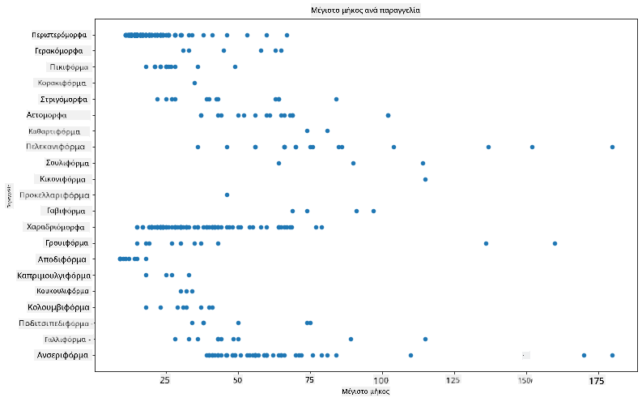
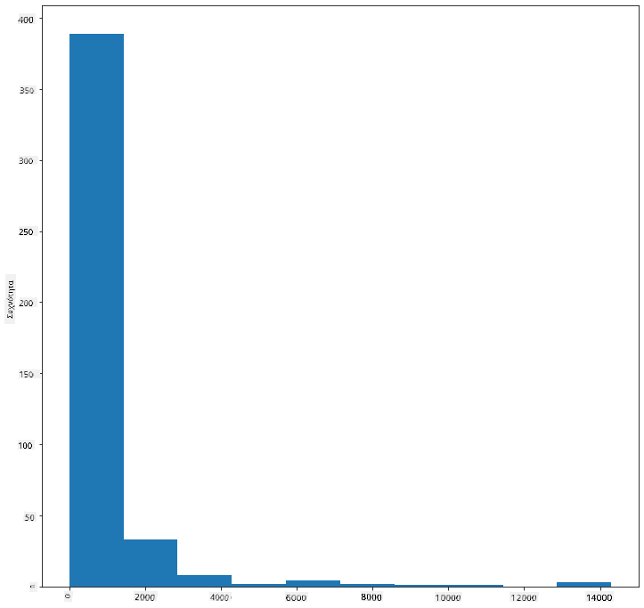
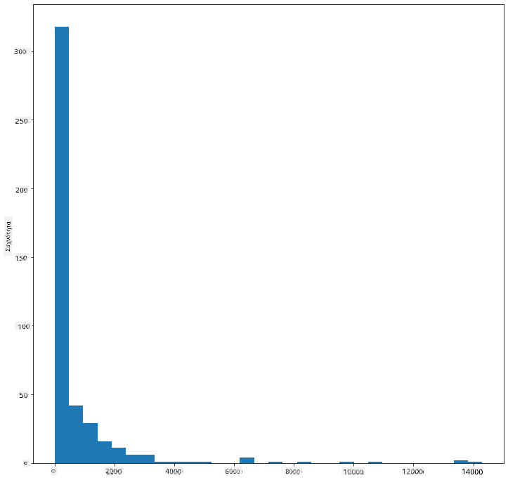
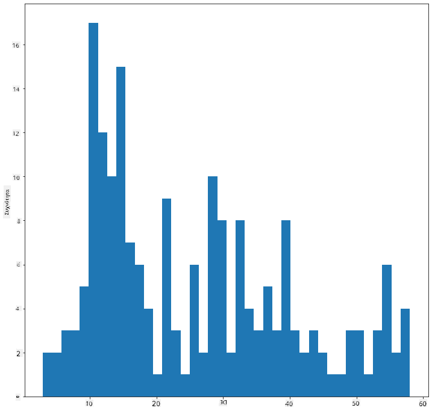
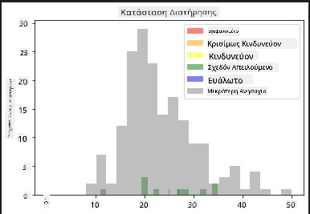
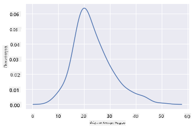
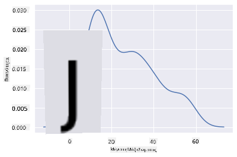
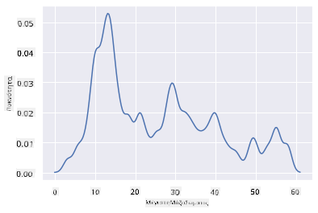
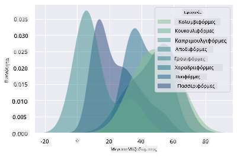
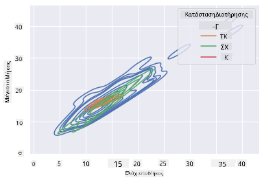

<!--
CO_OP_TRANSLATOR_METADATA:
{
  "original_hash": "87faccac113d772551486a67a607153e",
  "translation_date": "2025-08-26T22:47:30+00:00",
  "source_file": "3-Data-Visualization/10-visualization-distributions/README.md",
  "language_code": "el"
}
-->
# Οπτικοποίηση Κατανομών

| ](../../sketchnotes/10-Visualizing-Distributions.png)|
|:---:|
| Οπτικοποίηση Κατανομών - _Σκίτσο από [@nitya](https://twitter.com/nitya)_ |

Στο προηγούμενο μάθημα, μάθατε μερικά ενδιαφέροντα στοιχεία για ένα σύνολο δεδομένων σχετικά με τα πουλιά της Μινεσότα. Εντοπίσατε λανθασμένα δεδομένα οπτικοποιώντας ακραίες τιμές και εξετάσατε τις διαφορές μεταξύ των κατηγοριών πουλιών βάσει του μέγιστου μήκους τους.

## [Προ-μάθημα κουίζ](https://purple-hill-04aebfb03.1.azurestaticapps.net/quiz/18)
## Εξερεύνηση του συνόλου δεδομένων για τα πουλιά

Ένας άλλος τρόπος να εμβαθύνετε στα δεδομένα είναι να εξετάσετε την κατανομή τους, δηλαδή πώς οργανώνονται τα δεδομένα κατά μήκος ενός άξονα. Ίσως, για παράδειγμα, θέλετε να μάθετε για τη γενική κατανομή, για αυτό το σύνολο δεδομένων, του μέγιστου άνοιγματος φτερών ή της μέγιστης μάζας σώματος των πουλιών της Μινεσότα.

Ας ανακαλύψουμε μερικά στοιχεία για τις κατανομές των δεδομένων σε αυτό το σύνολο δεδομένων. Στο αρχείο _notebook.ipynb_ που βρίσκεται στη ρίζα του φακέλου αυτού του μαθήματος, εισάγετε Pandas, Matplotlib και τα δεδομένα σας:

```python
import pandas as pd
import matplotlib.pyplot as plt
birds = pd.read_csv('../../data/birds.csv')
birds.head()
```

|      | Όνομα                        | Επιστημονικό Όνομα     | Κατηγορία             | Τάξη         | Οικογένεια | Γένος       | Κατάσταση Διατήρησης | Ελάχιστο Μήκος | Μέγιστο Μήκος | Ελάχιστη Μάζα Σώματος | Μέγιστη Μάζα Σώματος | Ελάχιστο Άνοιγμα Φτερών | Μέγιστο Άνοιγμα Φτερών |
| ---: | :--------------------------- | :--------------------- | :-------------------- | :----------- | :------- | :---------- | :----------------- | --------: | --------: | ----------: | ----------: | ----------: | ----------: |
|    0 | Μαυροκοιλιάτικη σφυριχτή πάπια | Dendrocygna autumnalis | Πάπιες/Χήνες/Υδρόβια Πουλιά | Anseriformes | Anatidae | Dendrocygna | LC                 |        47 |        56 |         652 |        1020 |          76 |          94 |
|    1 | Καστανόχρωμη σφυριχτή πάπια   | Dendrocygna bicolor    | Πάπιες/Χήνες/Υδρόβια Πουλιά | Anseriformes | Anatidae | Dendrocygna | LC                 |        45 |        53 |         712 |        1050 |          85 |          93 |
|    2 | Χήνα του χιονιού              | Anser caerulescens     | Πάπιες/Χήνες/Υδρόβια Πουλιά | Anseriformes | Anatidae | Anser       | LC                 |        64 |        79 |        2050 |        4050 |         135 |         165 |
|    3 | Χήνα του Ross                | Anser rossii           | Πάπιες/Χήνες/Υδρόβια Πουλιά | Anseriformes | Anatidae | Anser       | LC                 |      57.3 |        64 |        1066 |        1567 |         113 |         116 |
|    4 | Μεγαλόλευκη χήνα             | Anser albifrons        | Πάπιες/Χήνες/Υδρόβια Πουλιά | Anseriformes | Anatidae | Anser       | LC                 |        64 |        81 |        1930 |        3310 |         130 |         165 |

Γενικά, μπορείτε να δείτε γρήγορα τον τρόπο με τον οποίο κατανέμονται τα δεδομένα χρησιμοποιώντας ένα διάγραμμα διασποράς, όπως κάναμε στο προηγούμενο μάθημα:

```python
birds.plot(kind='scatter',x='MaxLength',y='Order',figsize=(12,8))

plt.title('Max Length per Order')
plt.ylabel('Order')
plt.xlabel('Max Length')

plt.show()
```


Αυτό δίνει μια επισκόπηση της γενικής κατανομής του μήκους σώματος ανά Τάξη πουλιών, αλλά δεν είναι ο βέλτιστος τρόπος για να εμφανιστούν οι πραγματικές κατανομές. Αυτή η εργασία συνήθως γίνεται με τη δημιουργία ενός Ιστογράμματος.
## Εργασία με Ιστογράμματα

Το Matplotlib προσφέρει πολύ καλούς τρόπους για την οπτικοποίηση της κατανομής δεδομένων χρησιμοποιώντας Ιστογράμματα. Αυτός ο τύπος γραφήματος μοιάζει με γράφημα στηλών, όπου η κατανομή φαίνεται μέσω της ανόδου και της πτώσης των στηλών. Για να δημιουργήσετε ένα Ιστόγραμμα, χρειάζεστε αριθμητικά δεδομένα. Για να δημιουργήσετε ένα Ιστόγραμμα, μπορείτε να σχεδιάσετε ένα γράφημα ορίζοντας τον τύπο ως 'hist' για Ιστόγραμμα. Αυτό το γράφημα δείχνει την κατανομή της MaxBodyMass για το εύρος των αριθμητικών δεδομένων του συνόλου δεδομένων. Διαιρώντας τον πίνακα δεδομένων που του δίνεται σε μικρότερα διαστήματα, μπορεί να εμφανίσει την κατανομή των τιμών των δεδομένων:

```python
birds['MaxBodyMass'].plot(kind = 'hist', bins = 10, figsize = (12,12))
plt.show()
```


Όπως μπορείτε να δείτε, τα περισσότερα από τα 400+ πουλιά σε αυτό το σύνολο δεδομένων βρίσκονται στο εύρος κάτω από 2000 για τη Μέγιστη Μάζα Σώματος. Αποκτήστε περισσότερη εικόνα για τα δεδομένα αλλάζοντας την παράμετρο `bins` σε μεγαλύτερο αριθμό, όπως 30:

```python
birds['MaxBodyMass'].plot(kind = 'hist', bins = 30, figsize = (12,12))
plt.show()
```


Αυτό το γράφημα δείχνει την κατανομή με λίγο πιο λεπτομερή τρόπο. Ένα γράφημα λιγότερο κεκλιμένο προς τα αριστερά θα μπορούσε να δημιουργηθεί διασφαλίζοντας ότι επιλέγετε μόνο δεδομένα εντός ενός συγκεκριμένου εύρους:

Φιλτράρετε τα δεδομένα σας για να λάβετε μόνο εκείνα τα πουλιά των οποίων η μάζα σώματος είναι κάτω από 60, και δείξτε 40 `bins`:

```python
filteredBirds = birds[(birds['MaxBodyMass'] > 1) & (birds['MaxBodyMass'] < 60)]      
filteredBirds['MaxBodyMass'].plot(kind = 'hist',bins = 40,figsize = (12,12))
plt.show()     
```


✅ Δοκιμάστε μερικά άλλα φίλτρα και σημεία δεδομένων. Για να δείτε την πλήρη κατανομή των δεδομένων, αφαιρέστε το φίλτρο `['MaxBodyMass']` για να εμφανίσετε κατανομές με ετικέτες.

Το Ιστόγραμμα προσφέρει επίσης ωραίες βελτιώσεις χρώματος και ετικετών για να δοκιμάσετε:

Δημιουργήστε ένα 2D Ιστόγραμμα για να συγκρίνετε τη σχέση μεταξύ δύο κατανομών. Ας συγκρίνουμε το `MaxBodyMass` με το `MaxLength`. Το Matplotlib προσφέρει έναν ενσωματωμένο τρόπο να δείξει τη σύγκλιση χρησιμοποιώντας πιο φωτεινά χρώματα:

```python
x = filteredBirds['MaxBodyMass']
y = filteredBirds['MaxLength']

fig, ax = plt.subplots(tight_layout=True)
hist = ax.hist2d(x, y)
```
Φαίνεται να υπάρχει μια αναμενόμενη συσχέτιση μεταξύ αυτών των δύο στοιχείων κατά μήκος ενός αναμενόμενου άξονα, με ένα ιδιαίτερα ισχυρό σημείο σύγκλισης:


Τα Ιστογράμματα λειτουργούν καλά από προεπιλογή για αριθμητικά δεδομένα. Τι γίνεται αν χρειαστεί να δείτε κατανομές σύμφωνα με δεδομένα κειμένου; 
## Εξερεύνηση του συνόλου δεδομένων για κατανομές χρησιμοποιώντας δεδομένα κειμένου 

Αυτό το σύνολο δεδομένων περιλαμβάνει επίσης καλές πληροφορίες σχετικά με την κατηγορία του πουλιού, το γένος, το είδος και την οικογένειά του, καθώς και την κατάσταση διατήρησής του. Ας εμβαθύνουμε σε αυτές τις πληροφορίες διατήρησης. Ποια είναι η κατανομή των πουλιών σύμφωνα με την κατάσταση διατήρησής τους;

> ✅ Στο σύνολο δεδομένων, χρησιμοποιούνται αρκετά ακρωνύμια για να περιγράψουν την κατάσταση διατήρησης. Αυτά τα ακρωνύμια προέρχονται από τις [Κατηγορίες Κόκκινης Λίστας της IUCN](https://www.iucnredlist.org/), έναν οργανισμό που καταγράφει την κατάσταση των ειδών.
> 
> - CR: Κρίσιμα Απειλούμενο
> - EN: Απειλούμενο
> - EX: Εξαφανισμένο
> - LC: Ελάχιστη Ανησυχία
> - NT: Σχεδόν Απειλούμενο
> - VU: Ευάλωτο

Αυτές είναι τιμές βασισμένες σε κείμενο, οπότε θα χρειαστεί να κάνετε μια μετατροπή για να δημιουργήσετε ένα Ιστόγραμμα. Χρησιμοποιώντας το dataframe filteredBirds, εμφανίστε την κατάσταση διατήρησής του μαζί με το Ελάχιστο Άνοιγμα Φτερών. Τι παρατηρείτε; 

```python
x1 = filteredBirds.loc[filteredBirds.ConservationStatus=='EX', 'MinWingspan']
x2 = filteredBirds.loc[filteredBirds.ConservationStatus=='CR', 'MinWingspan']
x3 = filteredBirds.loc[filteredBirds.ConservationStatus=='EN', 'MinWingspan']
x4 = filteredBirds.loc[filteredBirds.ConservationStatus=='NT', 'MinWingspan']
x5 = filteredBirds.loc[filteredBirds.ConservationStatus=='VU', 'MinWingspan']
x6 = filteredBirds.loc[filteredBirds.ConservationStatus=='LC', 'MinWingspan']

kwargs = dict(alpha=0.5, bins=20)

plt.hist(x1, **kwargs, color='red', label='Extinct')
plt.hist(x2, **kwargs, color='orange', label='Critically Endangered')
plt.hist(x3, **kwargs, color='yellow', label='Endangered')
plt.hist(x4, **kwargs, color='green', label='Near Threatened')
plt.hist(x5, **kwargs, color='blue', label='Vulnerable')
plt.hist(x6, **kwargs, color='gray', label='Least Concern')

plt.gca().set(title='Conservation Status', ylabel='Min Wingspan')
plt.legend();
```



Δεν φαίνεται να υπάρχει καλή συσχέτιση μεταξύ του ελάχιστου ανοίγματος φτερών και της κατάστασης διατήρησης. Δοκιμάστε άλλα στοιχεία του συνόλου δεδομένων χρησιμοποιώντας αυτή τη μέθοδο. Μπορείτε να δοκιμάσετε διαφορετικά φίλτρα επίσης. Βρίσκετε κάποια συσχέτιση;

## Γραφήματα Πυκνότητας

Ίσως να παρατηρήσατε ότι τα Ιστογράμματα που έχουμε δει μέχρι τώρα είναι 'βηματικά' και δεν ρέουν ομαλά σε ένα τόξο. Για να δείξετε ένα πιο ομαλό γράφημα πυκνότητας, μπορείτε να δοκιμάσετε ένα γράφημα πυκνότητας.

Για να εργαστείτε με γραφήματα πυκνότητας, εξοικειωθείτε με μια νέα βιβλιοθήκη γραφημάτων, [Seaborn](https://seaborn.pydata.org/generated/seaborn.kdeplot.html). 

Φορτώνοντας το Seaborn, δοκιμάστε ένα βασικό γράφημα πυκνότητας:

```python
import seaborn as sns
import matplotlib.pyplot as plt
sns.kdeplot(filteredBirds['MinWingspan'])
plt.show()
```


Μπορείτε να δείτε πώς το γράφημα αντικατοπτρίζει το προηγούμενο για τα δεδομένα Ελάχιστου Ανοίγματος Φτερών· είναι απλώς λίγο πιο ομαλό. Σύμφωνα με την τεκμηρίωση του Seaborn, "Σε σχέση με ένα Ιστόγραμμα, το KDE μπορεί να παράγει ένα γράφημα που είναι λιγότερο φορτωμένο και πιο κατανοητό, ειδικά όταν σχεδιάζονται πολλαπλές κατανομές. Αλλά έχει τη δυνατότητα να εισάγει παραμορφώσεις εάν η υποκείμενη κατανομή είναι περιορισμένη ή μη ομαλή. Όπως ένα Ιστόγραμμα, η ποιότητα της αναπαράστασης εξαρτάται επίσης από την επιλογή καλών παραμέτρων εξομάλυνσης." [πηγή](https://seaborn.pydata.org/generated/seaborn.kdeplot.html) Με άλλα λόγια, οι ακραίες τιμές, όπως πάντα, θα κάνουν τα γραφήματά σας να συμπεριφέρονται άσχημα.

Αν θέλατε να επανεξετάσετε εκείνη τη γραμμή MaxBodyMass που ήταν τραχιά στο δεύτερο γράφημα που δημιουργήσατε, θα μπορούσατε να την εξομαλύνετε πολύ καλά αναδημιουργώντας την με αυτή τη μέθοδο:

```python
sns.kdeplot(filteredBirds['MaxBodyMass'])
plt.show()
```


Αν θέλατε μια ομαλή, αλλά όχι υπερβολικά ομαλή γραμμή, επεξεργαστείτε την παράμετρο `bw_adjust`: 

```python
sns.kdeplot(filteredBirds['MaxBodyMass'], bw_adjust=.2)
plt.show()
```


✅ Διαβάστε για τις διαθέσιμες παραμέτρους για αυτόν τον τύπο γραφήματος και πειραματιστείτε!

Αυτός ο τύπος γραφήματος προσφέρει όμορφες επεξηγηματικές οπτικοποιήσεις. Με λίγες γραμμές κώδικα, για παράδειγμα, μπορείτε να δείξετε την πυκνότητα μέγιστης μάζας σώματος ανά Τάξη πουλιών:

```python
sns.kdeplot(
   data=filteredBirds, x="MaxBodyMass", hue="Order",
   fill=True, common_norm=False, palette="crest",
   alpha=.5, linewidth=0,
)
```



Μπορείτε επίσης να χαρτογραφήσετε την πυκνότητα πολλών μεταβλητών σε ένα γράφημα. Δοκιμάστε το MaxLength και το MinLength ενός πουλιού σε σύγκριση με την κατάσταση διατήρησής τους:

```python
sns.kdeplot(data=filteredBirds, x="MinLength", y="MaxLength", hue="ConservationStatus")
```



Ίσως αξίζει να ερευνήσετε αν η συγκέντρωση των 'Ευάλωτων' πουλιών σύμφωνα με τα μήκη τους είναι σημαντική ή όχι.

## 🚀 Πρόκληση

Τα Ιστογράμματα είναι ένας πιο εξελιγμένος τύπος γραφήματος από τα βασικά γραφήματα διασποράς, γραφήματα στηλών ή γραφήματα γραμμών. Ψάξτε στο διαδίκτυο για να βρείτε καλά παραδείγματα χρήσης Ιστογραμμάτων. Πώς χρησιμοποιούνται, τι δείχνουν και σε ποιους τομείς ή περιοχές έρευνας τείνουν να χρησιμοποιούνται;

## [Μετά-μάθημα κουίζ](https://purple-hill-04aebfb03.1.azurestaticapps.net/quiz/19)

## Ανασκόπηση & Αυτομελέτη

Σε αυτό το μάθημα, χρησιμοποιήσατε το Matplotlib και αρχίσατε να εργάζεστε με το Seaborn για να δημιουργήσετε πιο εξελιγμένα γραφήματα. Κάντε έρευνα για το `kdeplot` στο Seaborn, μια "συνεχής καμπύλη πυκνότητας πιθανότητας σε μία ή περισσότερες διαστάσεις". Διαβάστε την [τεκμηρίωση](https://seaborn.pydata.org/generated/seaborn.kdeplot.html) για να κατανοήσετε πώς λειτουργεί.

## Εργασία

[Εφαρμόστε τις δεξιότητές σας](assignment.md)

---

**Αποποίηση Ευθύνης**:  
Αυτό το έγγραφο έχει μεταφραστεί χρησιμοποιώντας την υπηρεσία αυτόματης μετάφρασης [Co-op Translator](https://github.com/Azure/co-op-translator). Παρόλο που καταβάλλουμε προσπάθειες για ακρίβεια, παρακαλούμε να έχετε υπόψη ότι οι αυτόματες μεταφράσεις ενδέχεται να περιέχουν σφάλματα ή ανακρίβειες. Το πρωτότυπο έγγραφο στη μητρική του γλώσσα θα πρέπει να θεωρείται η αυθεντική πηγή. Για κρίσιμες πληροφορίες, συνιστάται επαγγελματική ανθρώπινη μετάφραση. Δεν φέρουμε ευθύνη για τυχόν παρεξηγήσεις ή εσφαλμένες ερμηνείες που προκύπτουν από τη χρήση αυτής της μετάφρασης.