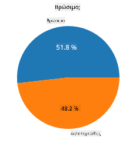
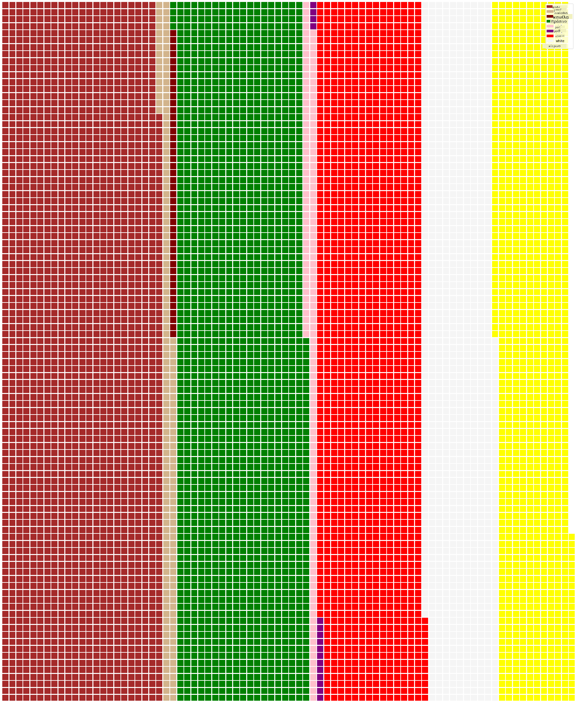

<!--
CO_OP_TRANSLATOR_METADATA:
{
  "original_hash": "cc490897ee2d276870472bcb31602d03",
  "translation_date": "2025-09-04T18:34:23+00:00",
  "source_file": "3-Data-Visualization/11-visualization-proportions/README.md",
  "language_code": "el"
}
-->
# Οπτικοποίηση Αναλογιών

| ](../../sketchnotes/11-Visualizing-Proportions.png)|
|:---:|
|Οπτικοποίηση Αναλογιών - _Σκίτσο από [@nitya](https://twitter.com/nitya)_ |

Σε αυτό το μάθημα, θα χρησιμοποιήσετε ένα διαφορετικό σύνολο δεδομένων με θέμα τη φύση για να οπτικοποιήσετε αναλογίες, όπως πόσα διαφορετικά είδη μανιταριών υπάρχουν σε ένα δεδομένο σύνολο δεδομένων. Ας εξερευνήσουμε αυτά τα συναρπαστικά μανιτάρια χρησιμοποιώντας ένα σύνολο δεδομένων από την Audubon που περιλαμβάνει λεπτομέρειες για 23 είδη μανιταριών με πτυχές στις οικογένειες Agaricus και Lepiota. Θα πειραματιστείτε με ενδιαφέρουσες οπτικοποιήσεις όπως:

- Γραφήματα πίτας 🥧
- Γραφήματα ντόνατ 🍩
- Γραφήματα βάφλας 🧇

> 💡 Ένα πολύ ενδιαφέρον έργο που ονομάζεται [Charticulator](https://charticulator.com) από τη Microsoft Research προσφέρει μια δωρεάν διεπαφή drag and drop για οπτικοποιήσεις δεδομένων. Σε ένα από τα μαθήματά τους χρησιμοποιούν επίσης αυτό το σύνολο δεδομένων για μανιτάρια! Έτσι, μπορείτε να εξερευνήσετε τα δεδομένα και να μάθετε τη βιβλιοθήκη ταυτόχρονα: [Charticulator tutorial](https://charticulator.com/tutorials/tutorial4.html).

## [Κουίζ μετά το μάθημα](https://ff-quizzes.netlify.app/en/ds/)

## Γνωρίστε τα μανιτάρια σας 🍄

Τα μανιτάρια είναι πολύ ενδιαφέροντα. Ας εισάγουμε ένα σύνολο δεδομένων για να τα μελετήσουμε:

```python
import pandas as pd
import matplotlib.pyplot as plt
mushrooms = pd.read_csv('../../data/mushrooms.csv')
mushrooms.head()
```
Εκτυπώνεται ένας πίνακας με εξαιρετικά δεδομένα για ανάλυση:

| class     | cap-shape | cap-surface | cap-color | bruises | odor    | gill-attachment | gill-spacing | gill-size | gill-color | stalk-shape | stalk-root | stalk-surface-above-ring | stalk-surface-below-ring | stalk-color-above-ring | stalk-color-below-ring | veil-type | veil-color | ring-number | ring-type | spore-print-color | population | habitat |
| --------- | --------- | ----------- | --------- | ------- | ------- | --------------- | ------------ | --------- | ---------- | ----------- | ---------- | ------------------------ | ------------------------ | ---------------------- | ---------------------- | --------- | ---------- | ----------- | --------- | ----------------- | ---------- | ------- |
| Δηλητηριώδες | Κυρτό    | Λείο        | Καφέ      | Μώλωπες | Δριμύ   | Ελεύθερο        | Κοντά        | Στενό     | Μαύρο      | Διευρυνόμενο | Ίσο        | Λείο                     | Λείο                     | Λευκό                  | Λευκό                  | Μερικό    | Λευκό      | Ένα         | Κρεμαστό  | Μαύρο             | Σκόρπιο    | Αστικό  |
| Βρώσιμο    | Κυρτό    | Λείο        | Κίτρινο   | Μώλωπες | Αμύγδαλο | Ελεύθερο        | Κοντά        | Ευρύ      | Μαύρο      | Διευρυνόμενο | Κλαμπ      | Λείο                     | Λείο                     | Λευκό                  | Λευκό                  | Μερικό    | Λευκό      | Ένα         | Κρεμαστό  | Καφέ              | Πολλά      | Χορτάρι |
| Βρώσιμο    | Καμπάνα  | Λείο        | Λευκό     | Μώλωπες | Γλυκάνισο | Ελεύθερο        | Κοντά        | Ευρύ      | Καφέ       | Διευρυνόμενο | Κλαμπ      | Λείο                     | Λείο                     | Λευκό                  | Λευκό                  | Μερικό    | Λευκό      | Ένα         | Κρεμαστό  | Καφέ              | Πολλά      | Λιβάδια |
| Δηλητηριώδες | Κυρτό    | Λεπιδωτό    | Λευκό     | Μώλωπες | Δριμύ   | Ελεύθερο        | Κοντά        | Στενό     | Καφέ       | Διευρυνόμενο | Ίσο        | Λείο                     | Λείο                     | Λευκό                  | Λευκό                  | Μερικό    | Λευκό      | Ένα         | Κρεμαστό  | Μαύρο             | Σκόρπιο    | Αστικό  |

Αμέσως παρατηρείτε ότι όλα τα δεδομένα είναι κειμενικά. Θα πρέπει να μετατρέψετε αυτά τα δεδομένα για να μπορέσετε να τα χρησιμοποιήσετε σε ένα γράφημα. Τα περισσότερα από τα δεδομένα, στην πραγματικότητα, αναπαρίστανται ως αντικείμενο:

```python
print(mushrooms.select_dtypes(["object"]).columns)
```

Η έξοδος είναι:

```output
Index(['class', 'cap-shape', 'cap-surface', 'cap-color', 'bruises', 'odor',
       'gill-attachment', 'gill-spacing', 'gill-size', 'gill-color',
       'stalk-shape', 'stalk-root', 'stalk-surface-above-ring',
       'stalk-surface-below-ring', 'stalk-color-above-ring',
       'stalk-color-below-ring', 'veil-type', 'veil-color', 'ring-number',
       'ring-type', 'spore-print-color', 'population', 'habitat'],
      dtype='object')
```
Πάρτε αυτά τα δεδομένα και μετατρέψτε τη στήλη 'class' σε κατηγορία:

```python
cols = mushrooms.select_dtypes(["object"]).columns
mushrooms[cols] = mushrooms[cols].astype('category')
```

```python
edibleclass=mushrooms.groupby(['class']).count()
edibleclass
```

Τώρα, αν εκτυπώσετε τα δεδομένα των μανιταριών, μπορείτε να δείτε ότι έχουν ομαδοποιηθεί σε κατηγορίες σύμφωνα με την κατηγορία δηλητηριώδες/βρώσιμο:

|           | cap-shape | cap-surface | cap-color | bruises | odor | gill-attachment | gill-spacing | gill-size | gill-color | stalk-shape | ... | stalk-surface-below-ring | stalk-color-above-ring | stalk-color-below-ring | veil-type | veil-color | ring-number | ring-type | spore-print-color | population | habitat |
| --------- | --------- | ----------- | --------- | ------- | ---- | --------------- | ------------ | --------- | ---------- | ----------- | --- | ------------------------ | ---------------------- | ---------------------- | --------- | ---------- | ----------- | --------- | ----------------- | ---------- | ------- |
| class     |           |             |           |         |      |                 |              |           |            |             |     |                          |                        |                        |           |            |             |           |                   |            |         |
| Βρώσιμο    | 4208      | 4208        | 4208      | 4208    | 4208 | 4208            | 4208         | 4208      | 4208       | 4208        | ... | 4208                     | 4208                   | 4208                   | 4208      | 4208       | 4208        | 4208      | 4208              | 4208       | 4208    |
| Δηλητηριώδες | 3916      | 3916        | 3916      | 3916    | 3916 | 3916            | 3916         | 3916      | 3916       | 3916        | ... | 3916                     | 3916                   | 3916                   | 3916      | 3916       | 3916        | 3916      | 3916              | 3916       | 3916    |

Αν ακολουθήσετε τη σειρά που παρουσιάζεται σε αυτόν τον πίνακα για να δημιουργήσετε τις ετικέτες κατηγορίας, μπορείτε να φτιάξετε ένα γράφημα πίτας:

## Πίτα!

```python
labels=['Edible','Poisonous']
plt.pie(edibleclass['population'],labels=labels,autopct='%.1f %%')
plt.title('Edible?')
plt.show()
```
Ιδού, ένα γράφημα πίτας που δείχνει τις αναλογίες αυτών των δεδομένων σύμφωνα με αυτές τις δύο κατηγορίες μανιταριών. Είναι αρκετά σημαντικό να διατηρήσετε τη σωστή σειρά των ετικετών, ειδικά εδώ, οπότε βεβαιωθείτε ότι έχετε επαληθεύσει τη σειρά με την οποία δημιουργείται ο πίνακας ετικετών!



## Ντόνατ!

Ένα κάπως πιο οπτικά ενδιαφέρον γράφημα πίτας είναι το γράφημα ντόνατ, το οποίο είναι ένα γράφημα πίτας με μια τρύπα στη μέση. Ας δούμε τα δεδομένα μας χρησιμοποιώντας αυτή τη μέθοδο.

Δείτε τους διάφορους βιότοπους όπου μεγαλώνουν τα μανιτάρια:

```python
habitat=mushrooms.groupby(['habitat']).count()
habitat
```
Εδώ, ομαδοποιείτε τα δεδομένα σας ανά βιότοπο. Υπάρχουν 7 καταγεγραμμένοι, οπότε χρησιμοποιήστε αυτούς ως ετικέτες για το γράφημα ντόνατ:

```python
labels=['Grasses','Leaves','Meadows','Paths','Urban','Waste','Wood']

plt.pie(habitat['class'], labels=labels,
        autopct='%1.1f%%', pctdistance=0.85)
  
center_circle = plt.Circle((0, 0), 0.40, fc='white')
fig = plt.gcf()

fig.gca().add_artist(center_circle)
  
plt.title('Mushroom Habitats')
  
plt.show()
```


Αυτός ο κώδικας σχεδιάζει ένα γράφημα και έναν κεντρικό κύκλο, και στη συνέχεια προσθέτει αυτόν τον κεντρικό κύκλο στο γράφημα. Επεξεργαστείτε το πλάτος του κεντρικού κύκλου αλλάζοντας το `0.40` σε άλλη τιμή.

Τα γραφήματα ντόνατ μπορούν να τροποποιηθούν με διάφορους τρόπους για να αλλάξουν οι ετικέτες. Οι ετικέτες, ειδικότερα, μπορούν να τονιστούν για καλύτερη αναγνωσιμότητα. Μάθετε περισσότερα στις [τεκμηριώσεις](https://matplotlib.org/stable/gallery/pie_and_polar_charts/pie_and_donut_labels.html?highlight=donut).

Τώρα που ξέρετε πώς να ομαδοποιείτε τα δεδομένα σας και να τα εμφανίζετε ως πίτα ή ντόνατ, μπορείτε να εξερευνήσετε άλλους τύπους γραφημάτων. Δοκιμάστε ένα γράφημα βάφλας, το οποίο είναι απλώς ένας διαφορετικός τρόπος εξερεύνησης ποσοτήτων.

## Βάφλες!

Ένα γράφημα τύπου 'βάφλας' είναι ένας διαφορετικός τρόπος οπτικοποίησης ποσοτήτων ως δισδιάστατος πίνακας τετραγώνων. Δοκιμάστε να οπτικοποιήσετε τις διαφορετικές ποσότητες χρωμάτων καπέλων μανιταριών σε αυτό το σύνολο δεδομένων. Για να το κάνετε αυτό, πρέπει να εγκαταστήσετε μια βοηθητική βιβλιοθήκη που ονομάζεται [PyWaffle](https://pypi.org/project/pywaffle/) και να χρησιμοποιήσετε το Matplotlib:

```python
pip install pywaffle
```

Επιλέξτε ένα τμήμα των δεδομένων σας για ομαδοποίηση:

```python
capcolor=mushrooms.groupby(['cap-color']).count()
capcolor
```

Δημιουργήστε ένα γράφημα βάφλας δημιουργώντας ετικέτες και στη συνέχεια ομαδοποιώντας τα δεδομένα σας:

```python
import pandas as pd
import matplotlib.pyplot as plt
from pywaffle import Waffle
  
data ={'color': ['brown', 'buff', 'cinnamon', 'green', 'pink', 'purple', 'red', 'white', 'yellow'],
    'amount': capcolor['class']
     }
  
df = pd.DataFrame(data)
  
fig = plt.figure(
    FigureClass = Waffle,
    rows = 100,
    values = df.amount,
    labels = list(df.color),
    figsize = (30,30),
    colors=["brown", "tan", "maroon", "green", "pink", "purple", "red", "whitesmoke", "yellow"],
)
```

Χρησιμοποιώντας ένα γράφημα βάφλας, μπορείτε να δείτε ξεκάθαρα τις αναλογίες των χρωμάτων καπέλων σε αυτό το σύνολο δεδομένων μανιταριών. Ενδιαφέρον είναι ότι υπάρχουν πολλά μανιτάρια με πράσινα καπέλα!



✅ Το PyWaffle υποστηρίζει εικονίδια μέσα στα γραφήματα που χρησιμοποιούν οποιοδήποτε εικονίδιο διαθέσιμο στο [Font Awesome](https://fontawesome.com/). Κάντε πειράματα για να δημιουργήσετε ένα ακόμη πιο ενδιαφέρον γράφημα βάφλας χρησιμοποιώντας εικονίδια αντί για τετράγωνα.

Σε αυτό το μάθημα, μάθατε τρεις τρόπους για να οπτικοποιήσετε αναλογίες. Πρώτα, πρέπει να ομαδοποιήσετε τα δεδομένα σας σε κατηγορίες και στη συνέχεια να αποφασίσετε ποιος είναι ο καλύτερος τρόπος για να εμφανίσετε τα δεδομένα - πίτα, ντόνατ ή βάφλα. Όλα είναι νόστιμα και προσφέρουν στον χρήστη μια άμεση εικόνα ενός συνόλου δεδομένων.

## 🚀 Πρόκληση

Δοκιμάστε να αναδημιουργήσετε αυτά τα νόστιμα γραφήματα στο [Charticulator](https://charticulator.com).

## [Κουίζ μετά το μάθημα](https://purple-hill-04aebfb03.1.azurestaticapps.net/quiz/21)

## Ανασκόπηση & Αυτομελέτη

Μερικές φορές δεν είναι προφανές πότε να χρησιμοποιήσετε ένα γράφημα πίτας, ντόνατ ή βάφλας. Ακολουθούν μερικά άρθρα για να διαβάσετε σχετικά με αυτό το θέμα:

https://www.beautiful.ai/blog/battle-of-the-charts-pie-chart-vs-donut-chart

https://medium.com/@hypsypops/pie-chart-vs-donut-chart-showdown-in-the-ring-5d24fd86a9ce

https://www.mit.edu/~mbarker/formula1/f1help/11-ch-c6.htm

https://medium.datadriveninvestor.com/data-visualization-done-the-right-way-with-tableau-waffle-chart-fdf2a19be402

Κάντε έρευνα για να βρείτε περισσότερες πληροφορίες σχετικά με αυτή τη δύσκολη απόφαση.

## Εργασία

[Δοκιμάστε το στο Excel](assignment.md)

---

**Αποποίηση ευθύνης**:  
Αυτό το έγγραφο έχει μεταφραστεί χρησιμοποιώντας την υπηρεσία αυτόματης μετάφρασης [Co-op Translator](https://github.com/Azure/co-op-translator). Παρόλο που καταβάλλουμε προσπάθειες για ακρίβεια, παρακαλούμε να έχετε υπόψη ότι οι αυτοματοποιημένες μεταφράσεις ενδέχεται να περιέχουν λάθη ή ανακρίβειες. Το πρωτότυπο έγγραφο στη μητρική του γλώσσα θα πρέπει να θεωρείται η αυθεντική πηγή. Για κρίσιμες πληροφορίες, συνιστάται επαγγελματική ανθρώπινη μετάφραση. Δεν φέρουμε ευθύνη για τυχόν παρεξηγήσεις ή εσφαλμένες ερμηνείες που προκύπτουν από τη χρήση αυτής της μετάφρασης.