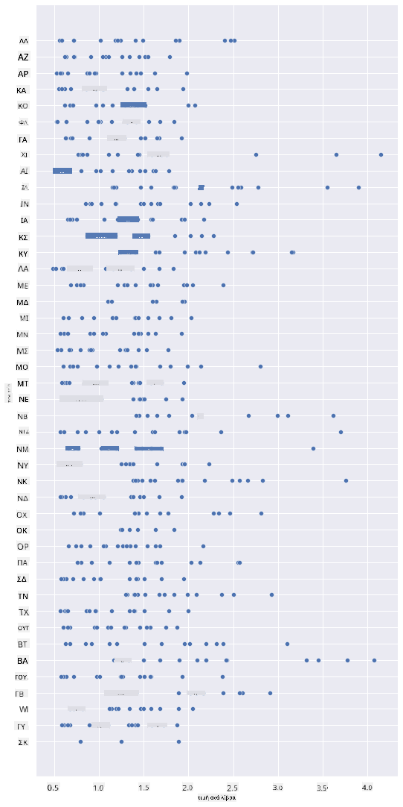
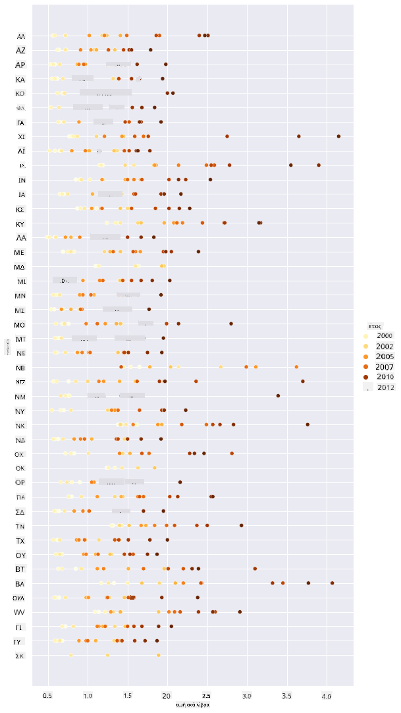
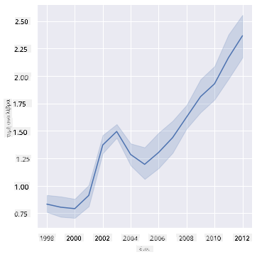
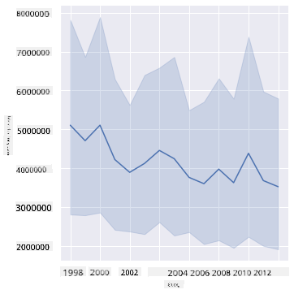
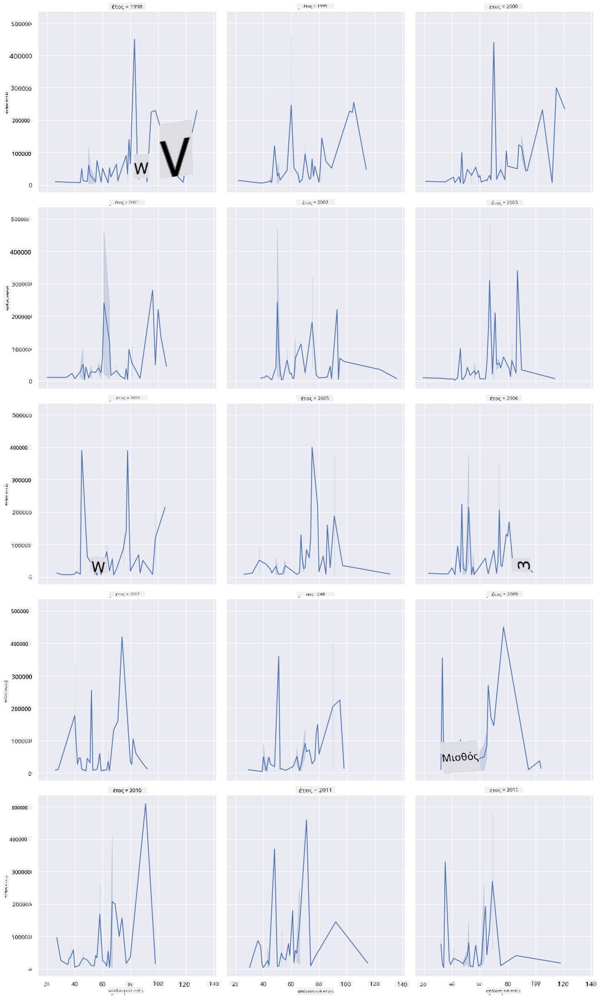
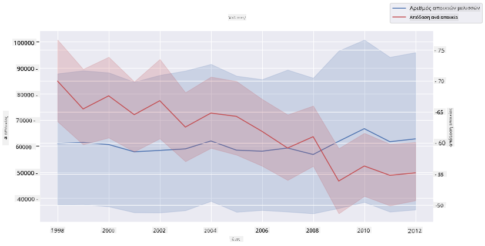

<!--
CO_OP_TRANSLATOR_METADATA:
{
  "original_hash": "cad419b574d5c35eaa417e9abfdcb0c8",
  "translation_date": "2025-08-26T22:51:33+00:00",
  "source_file": "3-Data-Visualization/12-visualization-relationships/README.md",
  "language_code": "el"
}
-->
# Οπτικοποίηση Σχέσεων: Όλα για το Μέλι 🍯

| ](../../sketchnotes/12-Visualizing-Relationships.png)|
|:---:|
|Οπτικοποίηση Σχέσεων - _Σκίτσο από [@nitya](https://twitter.com/nitya)_ |

Συνεχίζοντας με τη φυσική θεματολογία της έρευνάς μας, ας ανακαλύψουμε ενδιαφέρουσες οπτικοποιήσεις για να δείξουμε τις σχέσεις μεταξύ διαφόρων τύπων μελιού, σύμφωνα με ένα σύνολο δεδομένων που προέρχεται από το [Υπουργείο Γεωργίας των Ηνωμένων Πολιτειών](https://www.nass.usda.gov/About_NASS/index.php).

Αυτό το σύνολο δεδομένων, που περιλαμβάνει περίπου 600 στοιχεία, παρουσιάζει την παραγωγή μελιού σε πολλές πολιτείες των Η.Π.Α. Για παράδειγμα, μπορείτε να εξετάσετε τον αριθμό των αποικιών, την απόδοση ανά αποικία, τη συνολική παραγωγή, τα αποθέματα, την τιμή ανά λίβρα και την αξία του παραγόμενου μελιού σε μια συγκεκριμένη πολιτεία από το 1998 έως το 2012, με μία γραμμή ανά έτος για κάθε πολιτεία.

Θα ήταν ενδιαφέρον να οπτικοποιήσουμε τη σχέση μεταξύ της παραγωγής μιας πολιτείας ανά έτος και, για παράδειγμα, της τιμής του μελιού σε αυτή την πολιτεία. Εναλλακτικά, θα μπορούσατε να οπτικοποιήσετε τη σχέση μεταξύ της απόδοσης μελιού ανά αποικία στις πολιτείες. Αυτή η χρονική περίοδος περιλαμβάνει την καταστροφική «Διαταραχή Κατάρρευσης Αποικιών» (CCD), που παρατηρήθηκε για πρώτη φορά το 2006 (http://npic.orst.edu/envir/ccd.html), καθιστώντας το ένα συγκινητικό σύνολο δεδομένων για μελέτη. 🐝

## [Κουίζ πριν το μάθημα](https://purple-hill-04aebfb03.1.azurestaticapps.net/quiz/22)

Σε αυτό το μάθημα, μπορείτε να χρησιμοποιήσετε τη βιβλιοθήκη Seaborn, την οποία έχετε χρησιμοποιήσει ξανά, ως μια εξαιρετική επιλογή για την οπτικοποίηση σχέσεων μεταξύ μεταβλητών. Ιδιαίτερα ενδιαφέρουσα είναι η χρήση της συνάρτησης `relplot` του Seaborn, που επιτρέπει τη δημιουργία διαγραμμάτων διασποράς και γραμμών για γρήγορη οπτικοποίηση των '[στατιστικών σχέσεων](https://seaborn.pydata.org/tutorial/relational.html?highlight=relationships)', βοηθώντας τον επιστήμονα δεδομένων να κατανοήσει καλύτερα πώς σχετίζονται οι μεταβλητές μεταξύ τους.

## Διαγράμματα Διασποράς

Χρησιμοποιήστε ένα διάγραμμα διασποράς για να δείξετε πώς εξελίχθηκε η τιμή του μελιού, χρόνο με τον χρόνο, ανά πολιτεία. Το Seaborn, χρησιμοποιώντας το `relplot`, ομαδοποιεί βολικά τα δεδομένα ανά πολιτεία και εμφανίζει σημεία δεδομένων για κατηγορικά και αριθμητικά δεδομένα.

Ας ξεκινήσουμε εισάγοντας τα δεδομένα και το Seaborn:

```python
import pandas as pd
import matplotlib.pyplot as plt
import seaborn as sns
honey = pd.read_csv('../../data/honey.csv')
honey.head()
```
Παρατηρείτε ότι τα δεδομένα για το μέλι περιλαμβάνουν αρκετές ενδιαφέρουσες στήλες, όπως το έτος και την τιμή ανά λίβρα. Ας εξερευνήσουμε αυτά τα δεδομένα, ομαδοποιημένα ανά πολιτεία των Η.Π.Α.:

| state | numcol | yieldpercol | totalprod | stocks   | priceperlb | prodvalue | year |
| ----- | ------ | ----------- | --------- | -------- | ---------- | --------- | ---- |
| AL    | 16000  | 71          | 1136000   | 159000   | 0.72       | 818000    | 1998 |
| AZ    | 55000  | 60          | 3300000   | 1485000  | 0.64       | 2112000   | 1998 |
| AR    | 53000  | 65          | 3445000   | 1688000  | 0.59       | 2033000   | 1998 |
| CA    | 450000 | 83          | 37350000  | 12326000 | 0.62       | 23157000  | 1998 |
| CO    | 27000  | 72          | 1944000   | 1594000  | 0.7        | 1361000   | 1998 |

Δημιουργήστε ένα βασικό διάγραμμα διασποράς για να δείξετε τη σχέση μεταξύ της τιμής ανά λίβρα μελιού και της πολιτείας προέλευσής του. Κάντε τον άξονα `y` αρκετά ψηλό ώστε να εμφανίζονται όλες οι πολιτείες:

```python
sns.relplot(x="priceperlb", y="state", data=honey, height=15, aspect=.5);
```


Τώρα, δείξτε τα ίδια δεδομένα με μια χρωματική παλέτα που θυμίζει μέλι, για να δείξετε πώς εξελίσσεται η τιμή με την πάροδο των ετών. Μπορείτε να το κάνετε αυτό προσθέτοντας μια παράμετρο 'hue' για να δείξετε την αλλαγή, χρόνο με τον χρόνο:

> ✅ Μάθετε περισσότερα για τις [χρωματικές παλέτες που μπορείτε να χρησιμοποιήσετε στο Seaborn](https://seaborn.pydata.org/tutorial/color_palettes.html) - δοκιμάστε μια όμορφη παλέτα ουράνιου τόξου!

```python
sns.relplot(x="priceperlb", y="state", hue="year", palette="YlOrBr", data=honey, height=15, aspect=.5);
```


Με αυτή την αλλαγή χρωματικής παλέτας, μπορείτε να δείτε ότι υπάρχει προφανώς μια ισχυρή πρόοδος με την πάροδο των ετών όσον αφορά την τιμή του μελιού ανά λίβρα. Πράγματι, αν κοιτάξετε ένα δείγμα δεδομένων για να το επαληθεύσετε (επιλέξτε, για παράδειγμα, την πολιτεία της Αριζόνα), μπορείτε να δείτε ένα μοτίβο αύξησης της τιμής χρόνο με τον χρόνο, με λίγες εξαιρέσεις:

| state | numcol | yieldpercol | totalprod | stocks  | priceperlb | prodvalue | year |
| ----- | ------ | ----------- | --------- | ------- | ---------- | --------- | ---- |
| AZ    | 55000  | 60          | 3300000   | 1485000 | 0.64       | 2112000   | 1998 |
| AZ    | 52000  | 62          | 3224000   | 1548000 | 0.62       | 1999000   | 1999 |
| AZ    | 40000  | 59          | 2360000   | 1322000 | 0.73       | 1723000   | 2000 |
| AZ    | 43000  | 59          | 2537000   | 1142000 | 0.72       | 1827000   | 2001 |
| AZ    | 38000  | 63          | 2394000   | 1197000 | 1.08       | 2586000   | 2002 |
| AZ    | 35000  | 72          | 2520000   | 983000  | 1.34       | 3377000   | 2003 |
| AZ    | 32000  | 55          | 1760000   | 774000  | 1.11       | 1954000   | 2004 |
| AZ    | 36000  | 50          | 1800000   | 720000  | 1.04       | 1872000   | 2005 |
| AZ    | 30000  | 65          | 1950000   | 839000  | 0.91       | 1775000   | 2006 |
| AZ    | 30000  | 64          | 1920000   | 902000  | 1.26       | 2419000   | 2007 |
| AZ    | 25000  | 64          | 1600000   | 336000  | 1.26       | 2016000   | 2008 |
| AZ    | 20000  | 52          | 1040000   | 562000  | 1.45       | 1508000   | 2009 |
| AZ    | 24000  | 77          | 1848000   | 665000  | 1.52       | 2809000   | 2010 |
| AZ    | 23000  | 53          | 1219000   | 427000  | 1.55       | 1889000   | 2011 |
| AZ    | 22000  | 46          | 1012000   | 253000  | 1.79       | 1811000   | 2012 |

Ένας άλλος τρόπος να οπτικοποιήσετε αυτή την πρόοδο είναι να χρησιμοποιήσετε το μέγεθος αντί για το χρώμα. Για χρήστες με αχρωματοψία, αυτό μπορεί να είναι μια καλύτερη επιλογή. Επεξεργαστείτε την οπτικοποίησή σας ώστε να δείξετε την αύξηση της τιμής μέσω της αύξησης της περιφέρειας των κουκκίδων:

```python
sns.relplot(x="priceperlb", y="state", size="year", data=honey, height=15, aspect=.5);
```
Μπορείτε να δείτε το μέγεθος των κουκκίδων να αυξάνεται σταδιακά.


Είναι αυτό μια απλή περίπτωση προσφοράς και ζήτησης; Λόγω παραγόντων όπως η κλιματική αλλαγή και η κατάρρευση αποικιών, υπάρχει λιγότερο διαθέσιμο μέλι για αγορά χρόνο με τον χρόνο, και έτσι η τιμή αυξάνεται;

Για να ανακαλύψουμε μια συσχέτιση μεταξύ ορισμένων μεταβλητών αυτού του συνόλου δεδομένων, ας εξερευνήσουμε μερικά διαγράμματα γραμμών.

## Διαγράμματα Γραμμών

Ερώτηση: Υπάρχει σαφής αύξηση της τιμής του μελιού ανά λίβρα χρόνο με τον χρόνο; Μπορείτε να το ανακαλύψετε εύκολα δημιουργώντας ένα απλό διάγραμμα γραμμών:

```python
sns.relplot(x="year", y="priceperlb", kind="line", data=honey);
```
Απάντηση: Ναι, με κάποιες εξαιρέσεις γύρω στο έτος 2003:



✅ Επειδή το Seaborn συγκεντρώνει δεδομένα γύρω από μία γραμμή, εμφανίζει «τις πολλαπλές μετρήσεις σε κάθε τιμή x σχεδιάζοντας τον μέσο όρο και το διάστημα εμπιστοσύνης 95% γύρω από τον μέσο όρο». [Πηγή](https://seaborn.pydata.org/tutorial/relational.html). Αυτή η χρονοβόρα συμπεριφορά μπορεί να απενεργοποιηθεί προσθέτοντας `ci=None`.

Ερώτηση: Λοιπόν, το 2003 μπορούμε επίσης να δούμε μια αύξηση στην προσφορά μελιού; Τι γίνεται αν κοιτάξετε τη συνολική παραγωγή χρόνο με τον χρόνο;

```python
sns.relplot(x="year", y="totalprod", kind="line", data=honey);
```



Απάντηση: Όχι ακριβώς. Αν κοιτάξετε τη συνολική παραγωγή, φαίνεται ότι αυξήθηκε εκείνη τη χρονιά, παρόλο που γενικά η ποσότητα του παραγόμενου μελιού μειώνεται κατά τη διάρκεια αυτών των ετών.

Ερώτηση: Σε αυτή την περίπτωση, τι θα μπορούσε να προκάλεσε αυτή την αύξηση στην τιμή του μελιού γύρω στο 2003;

Για να το ανακαλύψετε, μπορείτε να εξερευνήσετε ένα πλέγμα όψεων.

## Πλέγματα Όψεων

Τα πλέγματα όψεων λαμβάνουν μία όψη του συνόλου δεδομένων σας (στην περίπτωσή μας, μπορείτε να επιλέξετε το 'έτος' για να αποφύγετε την παραγωγή υπερβολικά πολλών όψεων). Το Seaborn μπορεί στη συνέχεια να δημιουργήσει ένα διάγραμμα για καθεμία από αυτές τις όψεις των επιλεγμένων συντεταγμένων x και y για πιο εύκολη οπτική σύγκριση. Ξεχωρίζει το 2003 σε αυτό το είδος σύγκρισης;

Δημιουργήστε ένα πλέγμα όψεων συνεχίζοντας να χρησιμοποιείτε το `relplot`, όπως συνιστάται από την [τεκμηρίωση του Seaborn](https://seaborn.pydata.org/generated/seaborn.FacetGrid.html?highlight=facetgrid#seaborn.FacetGrid).

```python
sns.relplot(
    data=honey, 
    x="yieldpercol", y="numcol",
    col="year", 
    col_wrap=3,
    kind="line"
```
Σε αυτή την οπτικοποίηση, μπορείτε να συγκρίνετε την απόδοση ανά αποικία και τον αριθμό των αποικιών χρόνο με τον χρόνο, δίπλα-δίπλα, με το περιτύλιγμα να έχει οριστεί στο 3 για τις στήλες:



Για αυτό το σύνολο δεδομένων, τίποτα ιδιαίτερο δεν ξεχωρίζει όσον αφορά τον αριθμό των αποικιών και την απόδοσή τους, χρόνο με τον χρόνο και πολιτεία με πολιτεία. Υπάρχει διαφορετικός τρόπος να βρείτε μια συσχέτιση μεταξύ αυτών των δύο μεταβλητών;

## Διπλά Διαγράμματα Γραμμών

Δοκιμάστε ένα διάγραμμα πολλαπλών γραμμών, τοποθετώντας δύο διαγράμματα γραμμών το ένα πάνω στο άλλο, χρησιμοποιώντας το `despine` του Seaborn για να αφαιρέσετε τις πάνω και δεξιές γραμμές, και χρησιμοποιώντας το `ax.twinx` [που προέρχεται από το Matplotlib](https://matplotlib.org/stable/api/_as_gen/matplotlib.axes.Axes.twinx.html). Το Twinx επιτρέπει σε ένα διάγραμμα να μοιράζεται τον άξονα x και να εμφανίζει δύο άξονες y. Επομένως, εμφανίστε την απόδοση ανά αποικία και τον αριθμό των αποικιών, τοποθετημένα το ένα πάνω στο άλλο:

```python
fig, ax = plt.subplots(figsize=(12,6))
lineplot = sns.lineplot(x=honey['year'], y=honey['numcol'], data=honey, 
                        label = 'Number of bee colonies', legend=False)
sns.despine()
plt.ylabel('# colonies')
plt.title('Honey Production Year over Year');

ax2 = ax.twinx()
lineplot2 = sns.lineplot(x=honey['year'], y=honey['yieldpercol'], ax=ax2, color="r", 
                         label ='Yield per colony', legend=False) 
sns.despine(right=False)
plt.ylabel('colony yield')
ax.figure.legend();
```


Ενώ τίποτα δεν ξεχωρίζει ιδιαίτερα γύρω στο έτος 2003, αυτό μας επιτρέπει να κλείσουμε το μάθημα με μια πιο αισιόδοξη νότα: ενώ υπάρχει συνολικά μια μείωση στον αριθμό των αποικιών, ο αριθμός των αποικιών σταθεροποιείται, ακόμα κι αν η απόδοση ανά αποικία μειώνεται.

Πάμε, μέλισσες, πάμε!

🐝❤️
## 🚀 Πρόκληση

Σε αυτό το μάθημα, μάθατε λίγο περισσότερα για άλλες χρήσεις διαγραμμάτων διασποράς και πλεγμάτων γραμμών, συμπεριλαμβανομένων των πλεγμάτων όψεων. Προκαλέστε τον εαυτό σας να δημιουργήσει ένα πλέγμα όψεων χρησιμοποιώντας ένα διαφορετικό σύνολο δεδομένων, ίσως κάποιο που χρησιμοποιήσατε πριν από αυτά τα μαθήματα. Σημειώστε πόσο χρόνο χρειάζονται για να δημιουργηθούν και πόσο προσεκτικοί πρέπει να είστε σχετικά με το πόσα πλέγματα χρειάζεται να σχεδιάσετε χρησιμοποιώντας αυτές τις τεχνικές.
## [Κουίζ μετά το μάθημα](https://purple-hill-04aebfb03.1.azurestaticapps.net/quiz/23)

## Ανασκόπηση & Αυτομελέτη

Τα διαγράμματα γραμμών μπορούν να είναι απλά ή αρκετά περίπλοκα. Κάντε λίγη ανάγνωση στην [τεκμηρίωση του Seaborn](https://seaborn.pydata.org/generated/seaborn.lineplot.html) σχετικά με τους διάφορους τρόπους με τους οποίους μπορείτε να τα δημιουργήσετε. Προσπαθήστε να βελτιώσετε τα διαγράμματα γραμμών που δημιουργήσατε σε αυτό το μάθημα με άλλες μεθόδους που αναφέρονται στην τεκμηρίωση.
## Εργασία

[Βουτήξτε στην κυψέλη](assignment.md)

---

**Αποποίηση ευθύνης**:  
Αυτό το έγγραφο έχει μεταφραστεί χρησιμοποιώντας την υπηρεσία αυτόματης μετάφρασης [Co-op Translator](https://github.com/Azure/co-op-translator). Παρόλο που καταβάλλουμε προσπάθειες για ακρίβεια, παρακαλούμε να έχετε υπόψη ότι οι αυτοματοποιημένες μεταφράσεις ενδέχεται να περιέχουν λάθη ή ανακρίβειες. Το πρωτότυπο έγγραφο στη μητρική του γλώσσα θα πρέπει να θεωρείται η αυθεντική πηγή. Για κρίσιμες πληροφορίες, συνιστάται επαγγελματική ανθρώπινη μετάφραση. Δεν φέρουμε ευθύνη για τυχόν παρεξηγήσεις ή εσφαλμένες ερμηνείες που προκύπτουν από τη χρήση αυτής της μετάφρασης.