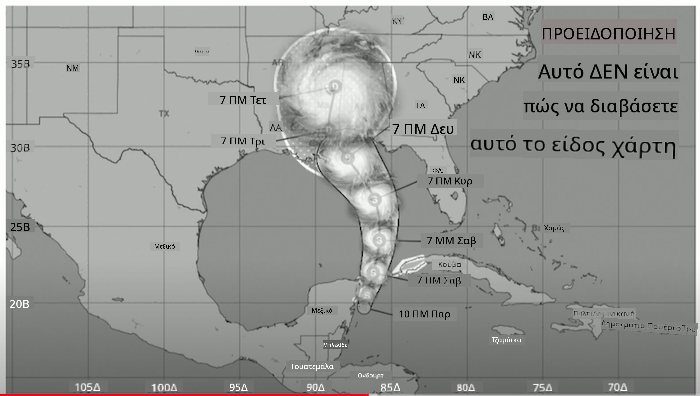
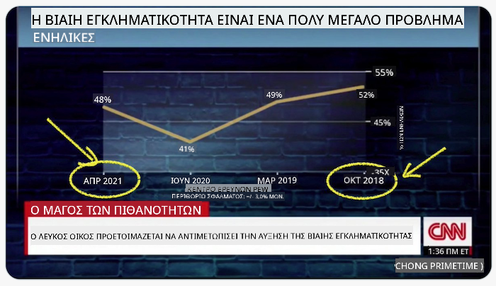
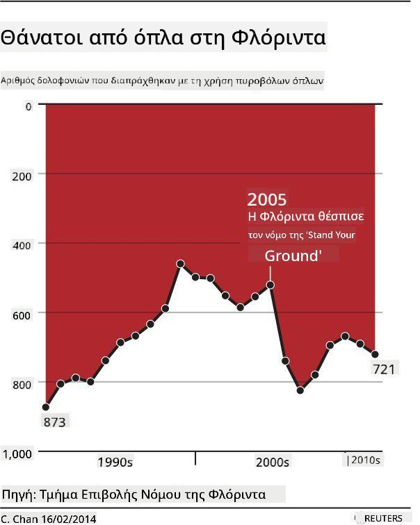
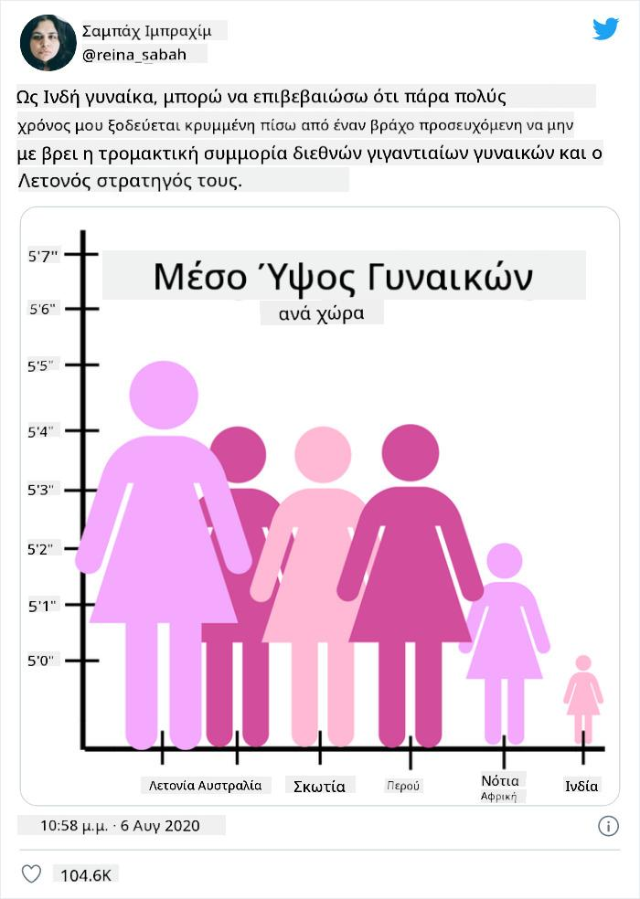
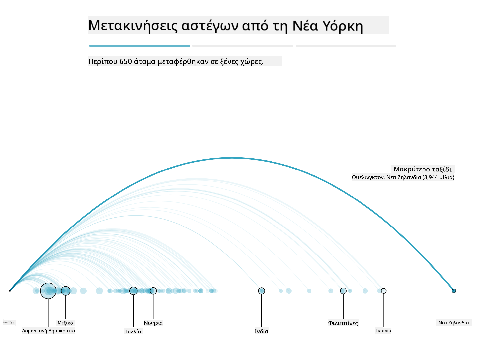
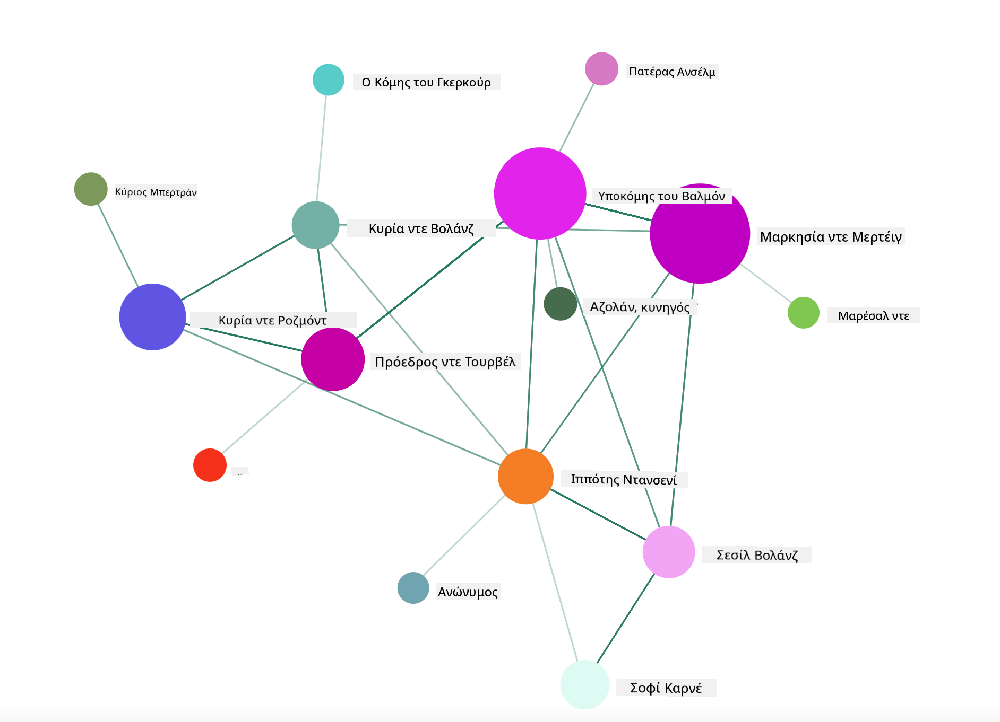

<!--
CO_OP_TRANSLATOR_METADATA:
{
  "original_hash": "0b380bb6d34102bb061eb41de23d9834",
  "translation_date": "2025-09-04T18:35:49+00:00",
  "source_file": "3-Data-Visualization/13-meaningful-visualizations/README.md",
  "language_code": "el"
}
-->
# Δημιουργία Σημαντικών Οπτικοποιήσεων

| ](../../sketchnotes/13-MeaningfulViz.png)|
|:---:|
| Σημαντικές Οπτικοποιήσεις - _Σκίτσο από [@nitya](https://twitter.com/nitya)_ |

> "Αν βασανίσεις τα δεδομένα αρκετά, θα ομολογήσουν οτιδήποτε" -- [Ronald Coase](https://en.wikiquote.org/wiki/Ronald_Coase)

Μία από τις βασικές δεξιότητες ενός επιστήμονα δεδομένων είναι η ικανότητα να δημιουργεί μια σημαντική οπτικοποίηση δεδομένων που βοηθά στην απάντηση ερωτήσεων. Πριν οπτικοποιήσετε τα δεδομένα σας, πρέπει να βεβαιωθείτε ότι έχουν καθαριστεί και προετοιμαστεί, όπως κάνατε σε προηγούμενα μαθήματα. Μετά από αυτό, μπορείτε να αρχίσετε να αποφασίζετε πώς να παρουσιάσετε καλύτερα τα δεδομένα.

Σε αυτό το μάθημα, θα εξετάσετε:

1. Πώς να επιλέξετε τον σωστό τύπο γραφήματος
2. Πώς να αποφύγετε παραπλανητικά γραφήματα
3. Πώς να δουλέψετε με χρώμα
4. Πώς να διαμορφώσετε τα γραφήματά σας για ευανάγνωστοτητα
5. Πώς να δημιουργήσετε λύσεις με κινούμενα ή 3D γραφήματα
6. Πώς να δημιουργήσετε μια δημιουργική οπτικοποίηση

## [Προ-μάθημα Quiz](https://purple-hill-04aebfb03.1.azurestaticapps.net/quiz/24)

## Επιλέξτε τον σωστό τύπο γραφήματος

Σε προηγούμενα μαθήματα, πειραματιστήκατε με τη δημιουργία όλων των ειδών ενδιαφέρουσες οπτικοποιήσεις δεδομένων χρησιμοποιώντας Matplotlib και Seaborn για γραφήματα. Γενικά, μπορείτε να επιλέξετε τον [σωστό τύπο γραφήματος](https://chartio.com/learn/charts/how-to-select-a-data-vizualization/) για την ερώτηση που θέτετε χρησιμοποιώντας αυτόν τον πίνακα:

| Χρειάζεστε να:             | Πρέπει να χρησιμοποιήσετε:      |
| -------------------------- | ------------------------------- |
| Δείξετε τάσεις δεδομένων με την πάροδο του χρόνου | Γραμμή                          |
| Συγκρίνετε κατηγορίες      | Ράβδος, Πίτα                    |
| Συγκρίνετε σύνολα          | Πίτα, Σωρευτική Ράβδος          |
| Δείξετε σχέσεις            | Scatter, Γραμμή, Facet, Διπλή Γραμμή |
| Δείξετε κατανομές          | Scatter, Ιστόγραμμα, Κουτί      |
| Δείξετε αναλογίες          | Πίτα, Donut, Waffle             |

> ✅ Ανάλογα με τη σύνθεση των δεδομένων σας, ίσως χρειαστεί να τα μετατρέψετε από κείμενο σε αριθμητικά για να υποστηρίξετε έναν συγκεκριμένο τύπο γραφήματος.

## Αποφύγετε την παραπλάνηση

Ακόμα κι αν ένας επιστήμονας δεδομένων είναι προσεκτικός στην επιλογή του σωστού γραφήματος για τα σωστά δεδομένα, υπάρχουν πολλοί τρόποι με τους οποίους τα δεδομένα μπορούν να παρουσιαστούν με τρόπο που να αποδεικνύει ένα σημείο, συχνά εις βάρος της αλήθειας των δεδομένων. Υπάρχουν πολλά παραδείγματα παραπλανητικών γραφημάτων και πληροφοριακών γραφικών!

[](https://www.youtube.com/watch?v=oX74Nge8Wkw "Πώς Ψεύδονται τα Γραφήματα")

> 🎥 Κάντε κλικ στην εικόνα παραπάνω για μια ομιλία συνεδρίου σχετικά με παραπλανητικά γραφήματα

Αυτό το γράφημα αντιστρέφει τον άξονα X για να δείξει το αντίθετο της αλήθειας, βάσει ημερομηνίας:



[Αυτό το γράφημα](https://media.firstcoastnews.com/assets/WTLV/images/170ae16f-4643-438f-b689-50d66ca6a8d8/170ae16f-4643-438f-b689-50d66ca6a8d8_1140x641.jpg) είναι ακόμα πιο παραπλανητικό, καθώς το μάτι τραβιέται προς τα δεξιά για να συμπεράνει ότι, με την πάροδο του χρόνου, τα κρούσματα COVID έχουν μειωθεί στις διάφορες κομητείες. Στην πραγματικότητα, αν κοιτάξετε προσεκτικά τις ημερομηνίες, θα διαπιστώσετε ότι έχουν αναδιαταχθεί για να δώσουν αυτήν την παραπλανητική πτωτική τάση.


Αυτό το διαβόητο παράδειγμα χρησιμοποιεί χρώμα ΚΑΙ έναν αναστραμμένο άξονα Y για να παραπλανήσει: αντί να συμπεράνουμε ότι οι θάνατοι από όπλα αυξήθηκαν μετά την ψήφιση νομοθεσίας φιλικής προς τα όπλα, στην πραγματικότητα το μάτι ξεγελιέται να πιστέψει ότι συνέβη το αντίθετο:



Αυτό το παράξενο γράφημα δείχνει πώς η αναλογία μπορεί να χειραγωγηθεί, με ξεκαρδιστικό αποτέλεσμα:



Η σύγκριση του ασύγκριτου είναι ακόμα ένα ύπουλο κόλπο. Υπάρχει ένας [υπέροχος ιστότοπος](https://tylervigen.com/spurious-correlations) γεμάτος 'ψευδείς συσχετίσεις' που εμφανίζει 'γεγονότα' που συσχετίζουν πράγματα όπως το ποσοστό διαζυγίων στο Maine και την κατανάλωση μαργαρίνης. Μια ομάδα στο Reddit συλλέγει επίσης τις [άσχημες χρήσεις](https://www.reddit.com/r/dataisugly/top/?t=all) των δεδομένων.

Είναι σημαντικό να κατανοήσουμε πόσο εύκολα το μάτι μπορεί να ξεγελαστεί από παραπλανητικά γραφήματα. Ακόμα κι αν η πρόθεση του επιστήμονα δεδομένων είναι καλή, η επιλογή ενός κακού τύπου γραφήματος, όπως ένα γράφημα πίτας που δείχνει πάρα πολλές κατηγορίες, μπορεί να είναι παραπλανητική.

## Χρώμα

Είδατε στο γράφημα 'Florida gun violence' παραπάνω πώς το χρώμα μπορεί να προσφέρει ένα επιπλέον επίπεδο νοήματος στα γραφήματα, ειδικά σε αυτά που δεν έχουν σχεδιαστεί χρησιμοποιώντας βιβλιοθήκες όπως το Matplotlib και το Seaborn, οι οποίες διαθέτουν διάφορες εγκεκριμένες βιβλιοθήκες χρωμάτων και παλέτες. Αν φτιάχνετε ένα γράφημα χειροκίνητα, κάντε μια μικρή μελέτη της [θεωρίας χρωμάτων](https://colormatters.com/color-and-design/basic-color-theory).

> ✅ Να έχετε υπόψη σας, όταν σχεδιάζετε γραφήματα, ότι η προσβασιμότητα είναι μια σημαντική πτυχή της οπτικοποίησης. Μερικοί από τους χρήστες σας μπορεί να έχουν αχρωματοψία - εμφανίζεται το γράφημά σας καλά για χρήστες με προβλήματα όρασης;

Να είστε προσεκτικοί όταν επιλέγετε χρώματα για το γράφημά σας, καθώς το χρώμα μπορεί να μεταφέρει νόημα που ίσως δεν σκοπεύατε. Οι 'ροζ κυρίες' στο γράφημα 'ύψος' παραπάνω μεταφέρουν μια ξεκάθαρα 'θηλυκή' αποδιδόμενη σημασία που προσθέτει στην παραδοξότητα του ίδιου του γραφήματος.

Ενώ [η σημασία των χρωμάτων](https://colormatters.com/color-symbolism/the-meanings-of-colors) μπορεί να είναι διαφορετική σε διαφορετικά μέρη του κόσμου και τείνει να αλλάζει ανάλογα με την απόχρωσή τους, γενικά οι σημασίες των χρωμάτων περιλαμβάνουν:

| Χρώμα  | Σημασία             |
| ------ | ------------------- |
| κόκκινο | δύναμη              |
| μπλε    | εμπιστοσύνη, πίστη  |
| κίτρινο | ευτυχία, προσοχή    |
| πράσινο | οικολογία, τύχη, φθόνος |
| μωβ    | ευτυχία             |
| πορτοκαλί | ζωντάνια          |

Αν σας ανατεθεί να δημιουργήσετε ένα γράφημα με προσαρμοσμένα χρώματα, βεβαιωθείτε ότι τα γραφήματά σας είναι προσβάσιμα και ότι το χρώμα που επιλέγετε συμπίπτει με το νόημα που προσπαθείτε να μεταφέρετε.

## Διαμόρφωση των γραφημάτων σας για ευανάγνωστοτητα

Τα γραφήματα δεν είναι σημαντικά αν δεν είναι ευανάγνωστα! Αφιερώστε λίγο χρόνο για να εξετάσετε τη διαμόρφωση του πλάτους και του ύψους του γραφήματός σας ώστε να κλιμακώνονται καλά με τα δεδομένα σας. Αν μια μεταβλητή (όπως όλες οι 50 πολιτείες) πρέπει να εμφανιστεί, δείξτε τις κάθετα στον άξονα Y αν είναι δυνατόν, ώστε να αποφύγετε ένα γράφημα που απαιτεί οριζόντια κύλιση.

Επισημάνετε τους άξονες σας, παρέχετε έναν θρύλο αν είναι απαραίτητο και προσφέρετε αναδυόμενες πληροφορίες για καλύτερη κατανόηση των δεδομένων.

Αν τα δεδομένα σας είναι κείμενο και εκτενή στον άξονα X, μπορείτε να γωνιάσετε το κείμενο για καλύτερη ευανάγνωστοτητα. Το [Matplotlib](https://matplotlib.org/stable/tutorials/toolkits/mplot3d.html) προσφέρει 3D σχεδιασμό, αν τα δεδομένα σας το υποστηρίζουν. Μπορούν να παραχθούν εξελιγμένες οπτικοποιήσεις δεδομένων χρησιμοποιώντας `mpl_toolkits.mplot3d`.


## Κινούμενα και 3D γραφήματα

Μερικές από τις καλύτερες οπτικοποιήσεις δεδομένων σήμερα είναι κινούμενες. Η Shirley Wu έχει εκπληκτικές δημιουργίες με D3, όπως '[film flowers](http://bl.ocks.org/sxywu/raw/d612c6c653fb8b4d7ff3d422be164a5d/)', όπου κάθε λουλούδι είναι μια οπτικοποίηση μιας ταινίας. Ένα άλλο παράδειγμα για τον Guardian είναι το 'bussed out', μια διαδραστική εμπειρία που συνδυάζει οπτικοποιήσεις με Greensock και D3, καθώς και ένα άρθρο σε μορφή scrollytelling για να δείξει πώς η Νέα Υόρκη διαχειρίζεται το πρόβλημα των αστέγων, μεταφέροντας ανθρώπους εκτός πόλης.



> "Bussed Out: Πώς η Αμερική Μετακινεί τους Άστεγους" από [τον Guardian](https://www.theguardian.com/us-news/ng-interactive/2017/dec/20/bussed-out-america-moves-homeless-people-country-study). Οπτικοποιήσεις από Nadieh Bremer & Shirley Wu

Αν και αυτό το μάθημα δεν είναι αρκετό για να διδάξει σε βάθος αυτές τις ισχυρές βιβλιοθήκες οπτικοποίησης, δοκιμάστε το D3 σε μια εφαρμογή Vue.js χρησιμοποιώντας μια βιβλιοθήκη για να εμφανίσετε μια οπτικοποίηση του βιβλίου "Επικίνδυνες Σχέσεις" ως ένα κινούμενο κοινωνικό δίκτυο.

> "Les Liaisons Dangereuses" είναι ένα επιστολικό μυθιστόρημα, ή ένα μυθιστόρημα που παρουσιάζεται ως σειρά επιστολών. Γραμμένο το 1782 από τον Choderlos de Laclos, αφηγείται την ιστορία των μοχθηρών, ηθικά χρεοκοπημένων κοινωνικών ελιγμών δύο αντιμαχόμενων πρωταγωνιστών της γαλλικής αριστοκρατίας στα τέλη του 18ου αιώνα, του Vicomte de Valmont και της Marquise de Merteuil. Και οι δύο βρίσκουν το τέλος τους, αλλά όχι χωρίς να προκαλέσουν μεγάλη κοινωνική ζημιά. Το μυθιστόρημα ξεδιπλώνεται ως μια σειρά επιστολών γραμμένων σε διάφορους ανθρώπους στον κύκλο τους, σχεδιάζοντας εκδίκηση ή απλώς για να προκαλέσουν προβλήματα. Δημιουργήστε μια οπτικοποίηση αυτών των επιστολών για να ανακαλύψετε τους κύριους πρωταγωνιστές της αφήγησης, οπτικά.

Θα ολοκληρώσετε μια εφαρμογή ιστού που θα εμφανίζει μια κινούμενη προβολή αυτού του κοινωνικού δικτύου. Χρησιμοποιεί μια βιβλιοθήκη που δημιουργήθηκε για να δημιουργήσει μια [οπτικοποίηση ενός δικτύου](https://github.com/emiliorizzo/vue-d3-network) χρησιμοποιώντας Vue.js και D3. Όταν η εφαρμογή λειτουργεί, μπορείτε να μετακινήσετε τους κόμβους στην οθόνη για να ανακατέψετε τα δεδομένα.



## Έργο: Δημιουργήστε ένα γράφημα για να δείξετε ένα δίκτυο χρησιμοποιώντας D3.js

> Αυτός ο φάκελος μαθήματος περιλαμβάνει έναν φάκελο `solution` όπου μπορείτε να βρείτε το ολοκληρωμένο έργο, για αναφορά.

1. Ακολουθήστε τις οδηγίες στο αρχείο README.md στον φάκελο εκκίνησης. Βεβαιωθείτε ότι έχετε NPM και Node.js εγκατεστημένα στον υπολογιστή σας πριν εγκαταστήσετε τις εξαρτήσεις του έργου σας.

2. Ανοίξτε τον φάκελο `starter/src`. Θα βρείτε έναν φάκελο `assets` όπου υπάρχει ένα αρχείο .json με όλες τις επιστολές του μυθιστορήματος, αριθμημένες, με σημειώσεις 'to' και 'from'.

3. Ολοκληρώστε τον κώδικα στο `components/Nodes.vue` για να ενεργοποιήσετε την οπτικοποίηση. Αναζητήστε τη μέθοδο που ονομάζεται `createLinks()` και προσθέστε την ακόλουθη εμφωλευμένη επανάληψη.

Διατρέξτε το αντικείμενο .json για να καταγράψετε τα δεδομένα 'to' και 'from' για τις επιστολές και να δημιουργήσετε το αντικείμενο `links` ώστε η βιβλιοθήκη οπτικοποίησης να μπορεί να το καταναλώσει:

```javascript
//loop through letters
      let f = 0;
      let t = 0;
      for (var i = 0; i < letters.length; i++) {
          for (var j = 0; j < characters.length; j++) {
              
            if (characters[j] == letters[i].from) {
              f = j;
            }
            if (characters[j] == letters[i].to) {
              t = j;
            }
        }
        this.links.push({ sid: f, tid: t });
      }
  ```

Εκτελέστε την εφαρμογή σας από το τερματικό (npm run serve) και απολαύστε την οπτικοποίηση!

## 🚀 Πρόκληση

Κάντε μια περιήγηση στο διαδίκτυο για να ανακαλύψετε παραπλανητικές οπτικοποιήσεις. Πώς ξεγελά ο συγγραφέας τον χρήστη και είναι σκόπιμο; Δοκιμάστε να διορθώσετε τις οπτικοποιήσεις για να δείξετε πώς πρέπει να φαίνονται.

## [Quiz μετά το μάθημα](https://ff-quizzes.netlify.app/en/ds/)

## Ανασκόπηση & Αυτομελέτη

Διαβάστε τα παρακάτω άρθρα σχετικά με παραπλανητικές οπτικοποιήσεις δεδομένων:

https://gizmodo.com/how-to-lie-with-data-visualization-1563576606

http://ixd.prattsi.org/2017/12/visual-lies-usability-in-deceptive-data-visualizations/

Δείτε αυτές τις ενδιαφέρουσες οπτικοποιήσεις για ιστορικά αντικείμενα και τεχνουργήματα:

https://handbook.pubpub.org/

Διαβάστε αυτό το άρθρο σχετικά με το πώς η κινούμενη εικόνα μπορεί να ενισχύσει τις οπτικοποιήσεις σας:

https://medium.com/@EvanSinar/use-animation-to-supercharge-data-visualization-cd905a882ad4

## Εργασία

[Δημιουργήστε τη δική σας προσαρμοσμένη οπτικοποίηση](assignment.md)

---

**Αποποίηση ευθύνης**:  
Αυτό το έγγραφο έχει μεταφραστεί χρησιμοποιώντας την υπηρεσία αυτόματης μετάφρασης [Co-op Translator](https://github.com/Azure/co-op-translator). Παρόλο που καταβάλλουμε προσπάθειες για ακρίβεια, παρακαλούμε να έχετε υπόψη ότι οι αυτοματοποιημένες μεταφράσεις ενδέχεται να περιέχουν σφάλματα ή ανακρίβειες. Το πρωτότυπο έγγραφο στη μητρική του γλώσσα θα πρέπει να θεωρείται η αυθεντική πηγή. Για κρίσιμες πληροφορίες, συνιστάται επαγγελματική ανθρώπινη μετάφραση. Δεν φέρουμε ευθύνη για τυχόν παρεξηγήσεις ή εσφαλμένες ερμηνείες που προκύπτουν από τη χρήση αυτής της μετάφρασης.