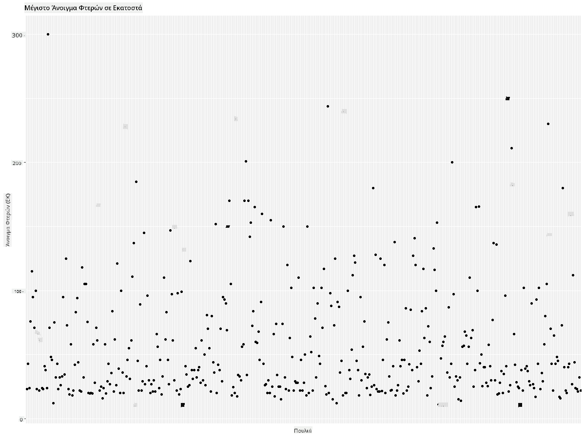

<!--
CO_OP_TRANSLATOR_METADATA:
{
  "original_hash": "22acf28f518a4769ea14fa42f4734b9f",
  "translation_date": "2025-08-26T23:03:35+00:00",
  "source_file": "3-Data-Visualization/R/09-visualization-quantities/README.md",
  "language_code": "el"
}
-->
# Οπτικοποίηση Ποσοτήτων
| ](https://github.com/microsoft/Data-Science-For-Beginners/blob/main/sketchnotes/09-Visualizing-Quantities.png)|
|:---:|
| Οπτικοποίηση Ποσοτήτων - _Σκίτσο από [@nitya](https://twitter.com/nitya)_ |

Σε αυτό το μάθημα θα εξερευνήσετε πώς να χρησιμοποιήσετε κάποιες από τις πολλές διαθέσιμες βιβλιοθήκες πακέτων R για να μάθετε πώς να δημιουργείτε ενδιαφέρουσες οπτικοποιήσεις γύρω από την έννοια της ποσότητας. Χρησιμοποιώντας ένα καθαρισμένο σύνολο δεδομένων για τα πουλιά της Μινεσότα, μπορείτε να μάθετε πολλά ενδιαφέροντα στοιχεία για την τοπική άγρια ζωή.  
## [Προ-μάθημα κουίζ](https://purple-hill-04aebfb03.1.azurestaticapps.net/quiz/16)

## Παρατηρήστε το άνοιγμα φτερών με το ggplot2
Μια εξαιρετική βιβλιοθήκη για τη δημιουργία τόσο απλών όσο και σύνθετων γραφημάτων και διαγραμμάτων διαφόρων ειδών είναι το [ggplot2](https://cran.r-project.org/web/packages/ggplot2/index.html). Σε γενικές γραμμές, η διαδικασία σχεδίασης δεδομένων χρησιμοποιώντας αυτές τις βιβλιοθήκες περιλαμβάνει την αναγνώριση των τμημάτων του dataframe που θέλετε να στοχεύσετε, την εκτέλεση τυχόν μετασχηματισμών στα δεδομένα που είναι απαραίτητοι, την ανάθεση τιμών στους άξονες x και y, την απόφαση για το είδος του γραφήματος που θα εμφανιστεί και στη συνέχεια την εμφάνιση του γραφήματος.

Το `ggplot2` είναι ένα σύστημα για τη δηλωτική δημιουργία γραφικών, βασισμένο στη Γραμματική των Γραφικών. Η [Γραμματική των Γραφικών](https://en.wikipedia.org/wiki/Ggplot2) είναι ένα γενικό σχήμα για την οπτικοποίηση δεδομένων που διασπά τα γραφήματα σε σημασιολογικά στοιχεία όπως κλίμακες και επίπεδα. Με άλλα λόγια, η ευκολία δημιουργίας γραφημάτων και διαγραμμάτων για μονομεταβλητά ή πολυμεταβλητά δεδομένα με λίγο κώδικα καθιστά το `ggplot2` το πιο δημοφιλές πακέτο για οπτικοποιήσεις στο R. Ο χρήστης λέει στο `ggplot2` πώς να αντιστοιχίσει τις μεταβλητές στις αισθητικές παραμέτρους, τα γραφικά στοιχεία που θα χρησιμοποιηθούν, και το `ggplot2` αναλαμβάνει τα υπόλοιπα.

> ✅ Γράφημα = Δεδομένα + Αισθητική + Γεωμετρία  
> - Δεδομένα αναφέρονται στο σύνολο δεδομένων  
> - Αισθητική υποδεικνύει τις μεταβλητές που θα μελετηθούν (μεταβλητές x και y)  
> - Γεωμετρία αναφέρεται στον τύπο του γραφήματος (γραμμικό διάγραμμα, ραβδόγραμμα κ.λπ.)  

Επιλέξτε την καλύτερη γεωμετρία (τύπο γραφήματος) ανάλογα με τα δεδομένα σας και την ιστορία που θέλετε να διηγηθείτε μέσω του γραφήματος.

> - Για ανάλυση τάσεων: γραμμικό, στήλες  
> - Για σύγκριση τιμών: ραβδόγραμμα, στήλες, πίτα, διάγραμμα διασποράς  
> - Για να δείξετε πώς τα μέρη σχετίζονται με το σύνολο: πίτα  
> - Για να δείξετε την κατανομή δεδομένων: διάγραμμα διασποράς, ραβδόγραμμα  
> - Για να δείξετε σχέσεις μεταξύ τιμών: γραμμικό, διάγραμμα διασποράς, φούσκα  

✅ Μπορείτε επίσης να δείτε αυτό το περιγραφικό [cheatsheet](https://nyu-cdsc.github.io/learningr/assets/data-visualization-2.1.pdf) για το ggplot2.

## Δημιουργήστε ένα γραμμικό διάγραμμα για τις τιμές ανοίγματος φτερών των πουλιών

Ανοίξτε την κονσόλα R και εισάγετε το σύνολο δεδομένων.  
> Σημείωση: Το σύνολο δεδομένων είναι αποθηκευμένο στη ρίζα αυτού του αποθετηρίου στον φάκελο `/data`.

Ας εισάγουμε το σύνολο δεδομένων και να παρατηρήσουμε την κεφαλή (τις πρώτες 5 γραμμές) των δεδομένων.

```r
birds <- read.csv("../../data/birds.csv",fileEncoding="UTF-8-BOM")
head(birds)
```  
Η κεφαλή των δεδομένων έχει έναν συνδυασμό κειμένου και αριθμών:

|      | Όνομα                         | Επιστημονικό Όνομα     | Κατηγορία              | Τάξη         | Οικογένεια | Γένος       | Κατάσταση Διατήρησης | Ελάχιστο Μήκος | Μέγιστο Μήκος | Ελάχιστη Μάζα Σώματος | Μέγιστη Μάζα Σώματος | Ελάχιστο Άνοιγμα Φτερών | Μέγιστο Άνοιγμα Φτερών |
| ---: | :--------------------------- | :--------------------- | :-------------------- | :----------- | :------- | :---------- | :----------------- | --------: | --------: | ----------: | ----------: | ----------: | ----------: |
|    0 | Μαυροκοιλιά πάπια             | Dendrocygna autumnalis | Πάπιες/Χήνες/Υδρόβια | Anseriformes | Anatidae | Dendrocygna | LC                 |        47 |        56 |         652 |        1020 |          76 |          94 |
|    1 | Καστανόχρωμη πάπια            | Dendrocygna bicolor    | Πάπιες/Χήνες/Υδρόβια | Anseriformes | Anatidae | Dendrocygna | LC                 |        45 |        53 |         712 |        1050 |          85 |          93 |
|    2 | Χήνα χιονιού                  | Anser caerulescens     | Πάπιες/Χήνες/Υδρόβια | Anseriformes | Anatidae | Anser       | LC                 |        64 |        79 |        2050 |        4050 |         135 |         165 |
|    3 | Χήνα του Ross                 | Anser rossii           | Πάπιες/Χήνες/Υδρόβια | Anseriformes | Anatidae | Anser       | LC                 |      57.3 |        64 |        1066 |        1567 |         113 |         116 |
|    4 | Μεγαλόλευκη χήνα              | Anser albifrons        | Πάπιες/Χήνες/Υδρόβια | Anseriformes | Anatidae | Anser       | LC                 |        64 |        81 |        1930 |        3310 |         130 |         165 |

Ας ξεκινήσουμε σχεδιάζοντας κάποια από τα αριθμητικά δεδομένα χρησιμοποιώντας ένα βασικό γραμμικό διάγραμμα. Υποθέστε ότι θέλετε μια εικόνα του μέγιστου ανοίγματος φτερών για αυτά τα ενδιαφέροντα πουλιά.

```r
install.packages("ggplot2")
library("ggplot2")
ggplot(data=birds, aes(x=Name, y=MaxWingspan,group=1)) +
  geom_line() 
```  
Εδώ, εγκαθιστάτε το πακέτο `ggplot2` και στη συνέχεια το εισάγετε στον χώρο εργασίας χρησιμοποιώντας την εντολή `library("ggplot2")`. Για να σχεδιάσετε οποιοδήποτε διάγραμμα στο ggplot, χρησιμοποιείται η συνάρτηση `ggplot()` και καθορίζετε το σύνολο δεδομένων, τις μεταβλητές x και y ως χαρακτηριστικά. Σε αυτή την περίπτωση, χρησιμοποιούμε τη συνάρτηση `geom_line()` καθώς σκοπεύουμε να σχεδιάσουμε ένα γραμμικό διάγραμμα.


Τι παρατηρείτε αμέσως; Φαίνεται να υπάρχει τουλάχιστον μία ακραία τιμή - αυτό είναι αρκετά μεγάλο άνοιγμα φτερών! Ένα άνοιγμα φτερών άνω των 2000 εκατοστών ισοδυναμεί με πάνω από 20 μέτρα - υπάρχουν Πτερόδακτυλοι που περιφέρονται στη Μινεσότα; Ας ερευνήσουμε.

Παρόλο που θα μπορούσατε να κάνετε μια γρήγορη ταξινόμηση στο Excel για να βρείτε αυτές τις ακραίες τιμές, οι οποίες πιθανότατα είναι τυπογραφικά λάθη, συνεχίστε τη διαδικασία οπτικοποίησης δουλεύοντας μέσα από το διάγραμμα.

Προσθέστε ετικέτες στον άξονα x για να δείξετε τι είδους πουλιά εξετάζονται:

```r
ggplot(data=birds, aes(x=Name, y=MaxWingspan,group=1)) +
  geom_line() +
  theme(axis.text.x = element_text(angle = 45, hjust=1))+
  xlab("Birds") +
  ylab("Wingspan (CM)") +
  ggtitle("Max Wingspan in Centimeters")
```  
Καθορίζουμε τη γωνία στο `theme` και καθορίζουμε τις ετικέτες των αξόνων x και y στα `xlab()` και `ylab()` αντίστοιχα. Το `ggtitle()` δίνει ένα όνομα στο γράφημα/διάγραμμα.


Ακόμα και με την περιστροφή των ετικετών στις 45 μοίρες, υπάρχουν πάρα πολλές για να διαβαστούν. Ας δοκιμάσουμε μια διαφορετική στρατηγική: ετικέτα μόνο για τις ακραίες τιμές και τοποθέτηση των ετικετών μέσα στο διάγραμμα. Μπορείτε να χρησιμοποιήσετε ένα διάγραμμα διασποράς για να δημιουργήσετε περισσότερο χώρο για την επισήμανση:

```r
ggplot(data=birds, aes(x=Name, y=MaxWingspan,group=1)) +
  geom_point() +
  geom_text(aes(label=ifelse(MaxWingspan>500,as.character(Name),'')),hjust=0,vjust=0) + 
  theme(axis.title.x=element_blank(), axis.text.x=element_blank(), axis.ticks.x=element_blank())
  ylab("Wingspan (CM)") +
  ggtitle("Max Wingspan in Centimeters") + 
```  
Τι συμβαίνει εδώ; Χρησιμοποιήσατε τη συνάρτηση `geom_point()` για να σχεδιάσετε σημεία διασποράς. Με αυτό, προσθέσατε ετικέτες για τα πουλιά που είχαν `MaxWingspan > 500` και επίσης αποκρύψατε τις ετικέτες στον άξονα x για να αποσυμφορήσετε το διάγραμμα.

Τι ανακαλύπτετε;


## Φιλτράρετε τα δεδομένα σας

Τόσο ο Αμερικανικός Αετός όσο και το Γεράκι της Πεδιάδας, ενώ πιθανότατα είναι πολύ μεγάλα πουλιά, φαίνεται να έχουν λανθασμένες ετικέτες, με ένα επιπλέον 0 να έχει προστεθεί στο μέγιστο άνοιγμα φτερών τους. Είναι απίθανο να συναντήσετε έναν Αμερικανικό Αετό με άνοιγμα φτερών 25 μέτρων, αλλά αν συμβεί, παρακαλώ ενημερώστε μας! Ας δημιουργήσουμε ένα νέο dataframe χωρίς αυτές τις δύο ακραίες τιμές:

```r
birds_filtered <- subset(birds, MaxWingspan < 500)

ggplot(data=birds_filtered, aes(x=Name, y=MaxWingspan,group=1)) +
  geom_point() +
  ylab("Wingspan (CM)") +
  xlab("Birds") +
  ggtitle("Max Wingspan in Centimeters") + 
  geom_text(aes(label=ifelse(MaxWingspan>500,as.character(Name),'')),hjust=0,vjust=0) +
  theme(axis.text.x=element_blank(), axis.ticks.x=element_blank())
```  
Δημιουργήσαμε ένα νέο dataframe `birds_filtered` και στη συνέχεια σχεδιάσαμε ένα διάγραμμα διασποράς. Φιλτράροντας τις ακραίες τιμές, τα δεδομένα σας είναι τώρα πιο συνεκτικά και κατανοητά.



Τώρα που έχουμε ένα καθαρότερο σύνολο δεδομένων τουλάχιστον όσον αφορά το άνοιγμα φτερών, ας ανακαλύψουμε περισσότερα για αυτά τα πουλιά.

Ενώ τα γραμμικά και τα διαγράμματα διασποράς μπορούν να εμφανίσουν πληροφορίες σχετικά με τις τιμές δεδομένων και τις κατανομές τους, θέλουμε να σκεφτούμε τις τιμές που ενυπάρχουν σε αυτό το σύνολο δεδομένων. Θα μπορούσατε να δημιουργήσετε οπτικοποιήσεις για να απαντήσετε στις ακόλουθες ερωτήσεις σχετικά με την ποσότητα:

> Πόσες κατηγορίες πουλιών υπάρχουν και ποιοι είναι οι αριθμοί τους;  
> Πόσα πουλιά είναι εξαφανισμένα, απειλούμενα, σπάνια ή κοινά;  
> Πόσα υπάρχουν από τα διάφορα γένη και τάξεις στην ορολογία του Linnaeus;  
## Εξερευνήστε ραβδογράμματα

Τα ραβδογράμματα είναι πρακτικά όταν χρειάζεται να δείξετε ομαδοποιήσεις δεδομένων. Ας εξερευνήσουμε τις κατηγορίες πουλιών που υπάρχουν σε αυτό το σύνολο δεδομένων για να δούμε ποια είναι η πιο κοινή ανά αριθμό.  
Ας δημιουργήσουμε ένα ραβδόγραμμα με φιλτραρισμένα δεδομένα.

```r
install.packages("dplyr")
install.packages("tidyverse")

library(lubridate)
library(scales)
library(dplyr)
library(ggplot2)
library(tidyverse)

birds_filtered %>% group_by(Category) %>%
  summarise(n=n(),
  MinLength = mean(MinLength),
  MaxLength = mean(MaxLength),
  MinBodyMass = mean(MinBodyMass),
  MaxBodyMass = mean(MaxBodyMass),
  MinWingspan=mean(MinWingspan),
  MaxWingspan=mean(MaxWingspan)) %>% 
  gather("key", "value", - c(Category, n)) %>%
  ggplot(aes(x = Category, y = value, group = key, fill = key)) +
  geom_bar(stat = "identity") +
  scale_fill_manual(values = c("#D62728", "#FF7F0E", "#8C564B","#2CA02C", "#1F77B4", "#9467BD")) +                   
  xlab("Category")+ggtitle("Birds of Minnesota")

```  
Στο παρακάτω απόσπασμα, εγκαθιστούμε τα πακέτα [dplyr](https://www.rdocumentation.org/packages/dplyr/versions/0.7.8) και [lubridate](https://www.rdocumentation.org/packages/lubridate/versions/1.8.0) για να βοηθήσουμε στη διαχείριση και ομαδοποίηση δεδομένων προκειμένου να σχεδιάσουμε ένα στοίβαγμα ραβδογράμματος. Πρώτα, ομαδοποιείτε τα δεδομένα ανά `Category` του πουλιού και στη συνέχεια συνοψίζετε τις στήλες `MinLength`, `MaxLength`, `MinBodyMass`, `MaxBodyMass`, `MinWingspan`, `MaxWingspan`. Στη συνέχεια, σχεδιάζετε το ραβδόγραμμα χρησιμοποιώντας το πακέτο `ggplot2` και καθορίζετε τα χρώματα για τις διαφορετικές κατηγορίες και τις ετικέτες.


Αυτό το ραβδόγραμμα, ωστόσο, είναι δυσανάγνωστο επειδή υπάρχουν πάρα πολλά μη ομαδοποιημένα δεδομένα. Χρειάζεται να επιλέξετε μόνο τα δεδομένα που θέλετε να σχεδιάσετε, οπότε ας δούμε το μήκος των πουλιών με βάση την κατηγορία τους.

Φιλτράρετε τα δεδομένα σας ώστε να περιλαμβάνουν μόνο την κατηγορία του πουλιού.

Επειδή υπάρχουν πολλές κατηγορίες, μπορείτε να εμφανίσετε αυτό το διάγραμμα κάθετα και να προσαρμόσετε το ύψος του για να ληφθούν υπόψη όλα τα δεδομένα:

```r
birds_count<-dplyr::count(birds_filtered, Category, sort = TRUE)
birds_count$Category <- factor(birds_count$Category, levels = birds_count$Category)
ggplot(birds_count,aes(Category,n))+geom_bar(stat="identity")+coord_flip()
```  
Πρώτα μετράτε μοναδικές τιμές στη στήλη `Category` και στη συνέχεια τις ταξινομείτε σε ένα νέο dataframe `birds_count`. Αυτά τα ταξινομημένα δεδομένα στη συνέχεια λαμβάνονται υπόψη στο ίδιο επίπεδο ώστε να σχεδιαστούν με ταξινομημένο τρόπο. Χρησιμοποιώντας το `ggplot2` σχεδιάζετε στη συνέχεια τα δεδομένα σε ένα ραβδόγραμμα. Το `coord_flip()` σχεδιάζει οριζόντιες μπάρες.


Αυτό το ραβδόγραμμα δείχνει μια καλή εικόνα του αριθμού των πουλιών σε κάθε κατηγορία. Με μια ματιά, βλέπετε ότι ο μεγαλύτερος αριθμός πουλιών σε αυτή την περιοχή ανήκει στην κατηγορία Πάπιες/Χήνες/Υδρόβια. Η Μινεσότα είναι η "γη των 10.000 λιμνών", οπότε αυτό δεν είναι έκπληξη!

✅ Δοκιμάστε μερικές άλλες μετρήσεις σε αυτό το σύνολο δεδομένων. Σας εκπλήσσει κάτι;

## Σύγκριση δεδομένων

Μπορείτε να δοκιμάσετε διαφορετικές συγκρίσεις ομαδοποιημένων δεδομένων δημιουργώντας νέους άξονες. Δοκιμάστε μια σύγκριση του MaxLength ενός πουλιού, με βάση την κατηγορία του:

```r
birds_grouped <- birds_filtered %>%
  group_by(Category) %>%
  summarise(
  MaxLength = max(MaxLength, na.rm = T),
  MinLength = max(MinLength, na.rm = T)
           ) %>%
  arrange(Category)
  
ggplot(birds_grouped,aes(Category,MaxLength))+geom_bar(stat="identity")+coord_flip()
```  
Ομαδοποιούμε τα δεδομένα `birds_filtered` ανά `Category` και στη συνέχεια σχεδιάζουμε ένα ραβδόγραμμα.


Τίποτα δεν είναι εκπληκτικό εδώ: τα κολιμπρί έχουν το μικρότερο MaxLength σε σύγκριση με τους Πελεκάνους ή τις Χήνες. Είναι καλό όταν τα δεδομένα έχουν λογική!

Μπορείτε να δημιουργήσετε πιο ενδιαφέρουσες οπτικοποιήσεις ραβδογραμμάτων υπερθέτοντας δεδομένα. Ας υπερθέσουμε το Ελάχιστο και Μέγιστο Μήκος σε μια δεδομένη κατηγορία πουλιού:

```r
ggplot(data=birds_grouped, aes(x=Category)) +
  geom_bar(aes(y=MaxLength), stat="identity", position ="identity",  fill='blue') +
  geom_bar(aes(y=MinLength), stat="identity", position="identity", fill='orange')+
  coord_flip()
```  


## 🚀 Πρόκληση

Αυτό το σύνολο δεδομένων για τα πουλιά προσφέρει πλούτο πληροφοριών για διαφορετικούς τύπους πουλιών μέσα σε ένα συγκεκριμένο οικοσύστημα. Ψάξτε στο διαδίκτυο και δείτε αν μπορείτε να βρείτε άλλα σύνολα δεδομένων που αφορούν πουλιά. Εξασκηθείτε στη δημιουργία γραφημάτων και διαγραμμάτων γύρω από αυτά τα πουλιά για να ανακαλύψετε γεγονότα που δεν γνωρίζατε.

## [Μετά το μάθημα κουίζ](https://purple-hill-04aebfb03.1.azurestaticapps.net/quiz/17)

## Ανασκόπηση & Αυτομελέτη

Αυτό το πρώτο μάθημα σας έδωσε κάποιες πληροφορίες για το πώς να χρησιμοποιήσετε

---

**Αποποίηση ευθύνης**:  
Αυτό το έγγραφο έχει μεταφραστεί χρησιμοποιώντας την υπηρεσία αυτόματης μετάφρασης [Co-op Translator](https://github.com/Azure/co-op-translator). Παρόλο που καταβάλλουμε προσπάθειες για ακρίβεια, παρακαλούμε να έχετε υπόψη ότι οι αυτοματοποιημένες μεταφράσεις ενδέχεται να περιέχουν σφάλματα ή ανακρίβειες. Το πρωτότυπο έγγραφο στη μητρική του γλώσσα θα πρέπει να θεωρείται η αυθεντική πηγή. Για κρίσιμες πληροφορίες, συνιστάται επαγγελματική ανθρώπινη μετάφραση. Δεν φέρουμε ευθύνη για τυχόν παρεξηγήσεις ή εσφαλμένες ερμηνείες που προκύπτουν από τη χρήση αυτής της μετάφρασης.