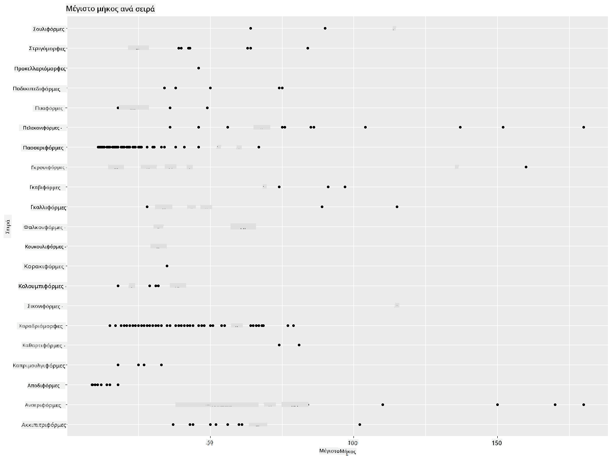
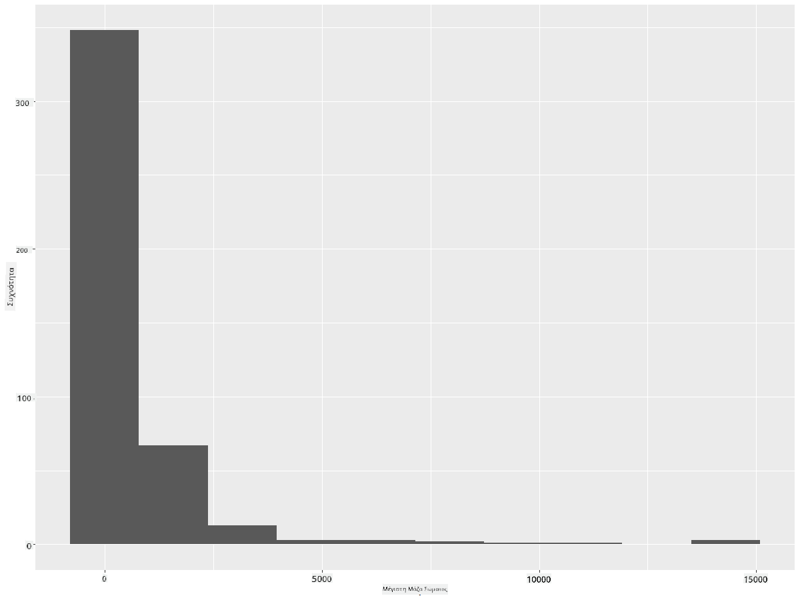
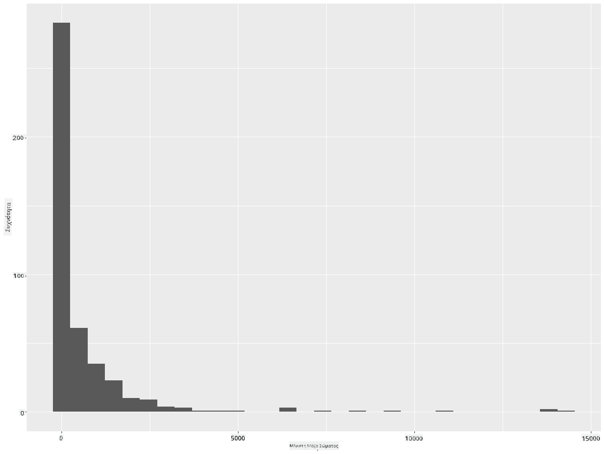
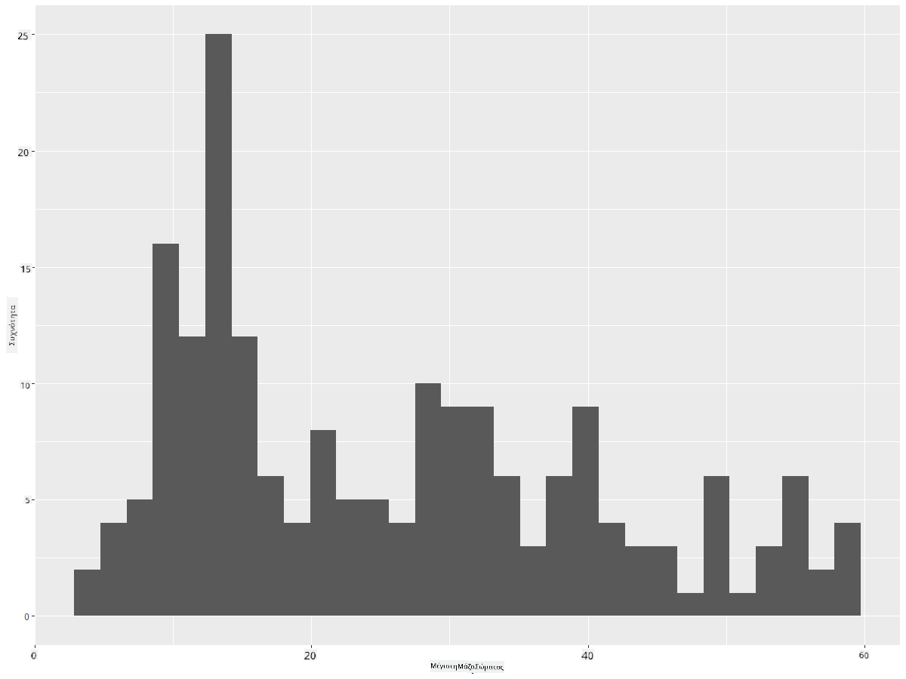
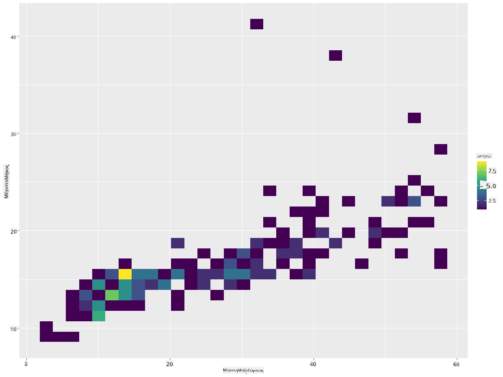
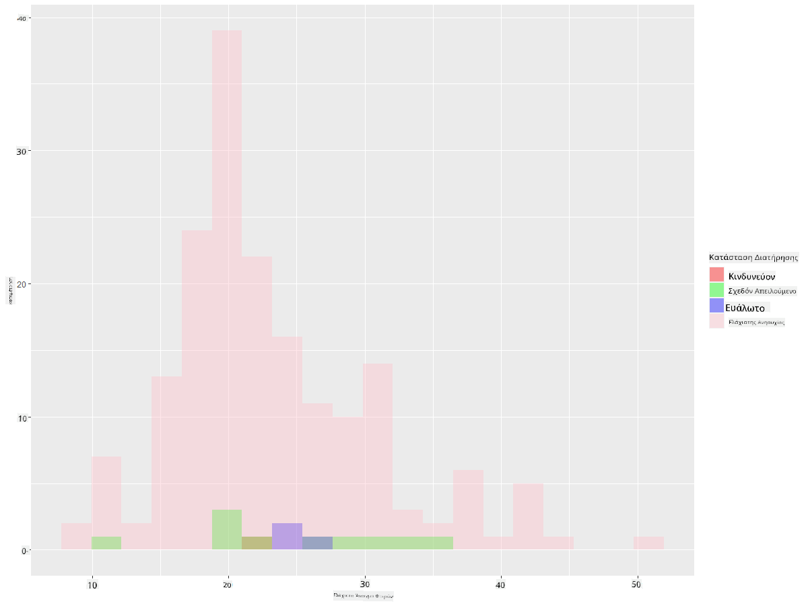
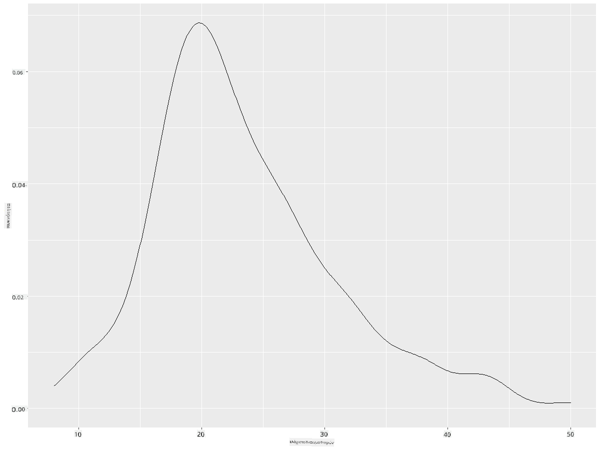
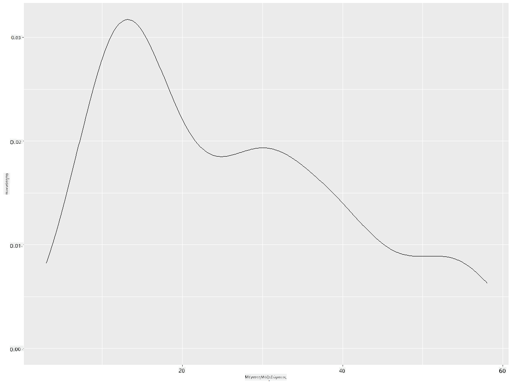
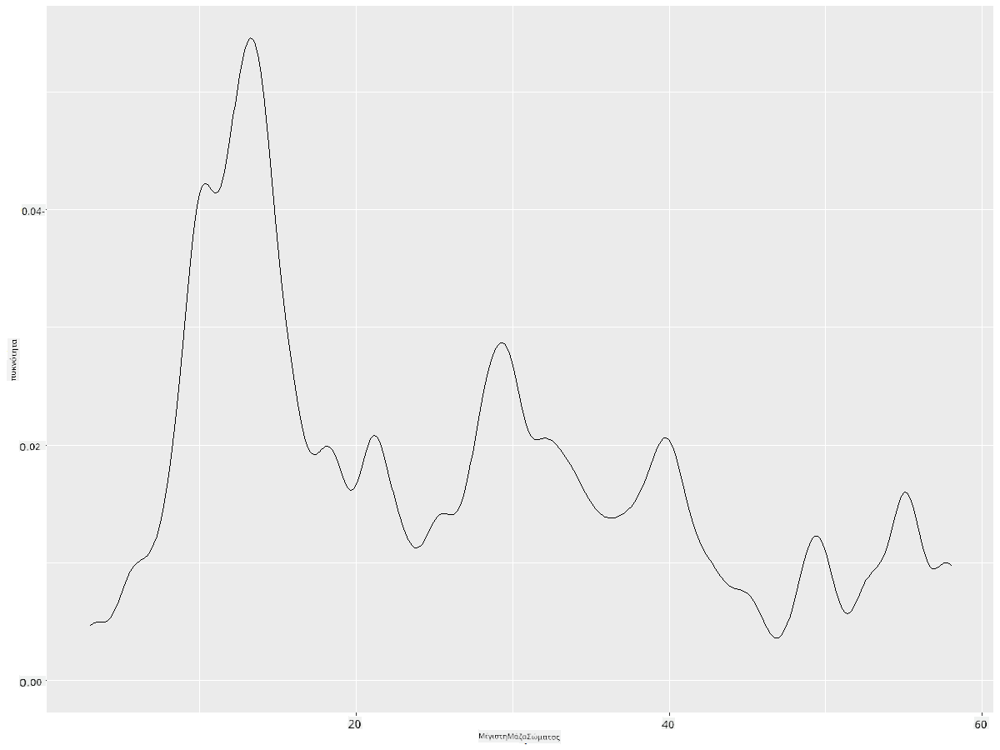
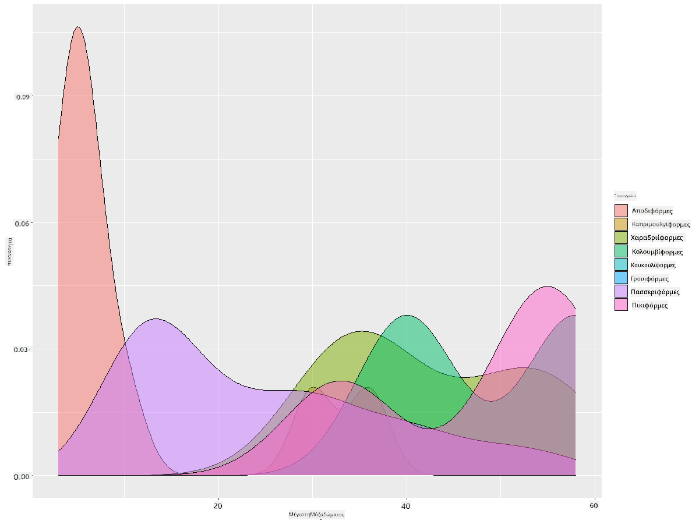

<!--
CO_OP_TRANSLATOR_METADATA:
{
  "original_hash": "ea67c0c40808fd723594de6896c37ccf",
  "translation_date": "2025-08-26T22:55:49+00:00",
  "source_file": "3-Data-Visualization/R/10-visualization-distributions/README.md",
  "language_code": "el"
}
-->
# Οπτικοποίηση Κατανομών

| ](https://github.com/microsoft/Data-Science-For-Beginners/blob/main/sketchnotes/10-Visualizing-Distributions.png)|
|:---:|
| Οπτικοποίηση Κατανομών - _Σκίτσο από [@nitya](https://twitter.com/nitya)_ |

Στο προηγούμενο μάθημα, μάθατε μερικά ενδιαφέροντα στοιχεία για ένα σύνολο δεδομένων σχετικά με τα πουλιά της Μινεσότα. Εντοπίσατε κάποια λανθασμένα δεδομένα οπτικοποιώντας ακραίες τιμές και εξετάσατε τις διαφορές μεταξύ κατηγοριών πουλιών με βάση το μέγιστο μήκος τους.

## [Κουίζ πριν το μάθημα](https://purple-hill-04aebfb03.1.azurestaticapps.net/quiz/18)
## Εξερεύνηση του συνόλου δεδομένων για τα πουλιά

Ένας άλλος τρόπος να εμβαθύνετε στα δεδομένα είναι εξετάζοντας την κατανομή τους, δηλαδή πώς οργανώνονται τα δεδομένα κατά μήκος ενός άξονα. Ίσως, για παράδειγμα, θέλετε να μάθετε για τη γενική κατανομή, για αυτό το σύνολο δεδομένων, του μέγιστου ανοίγματος φτερών ή της μέγιστης μάζας σώματος των πουλιών της Μινεσότα.

Ας ανακαλύψουμε μερικά στοιχεία για τις κατανομές των δεδομένων σε αυτό το σύνολο δεδομένων. Στην κονσόλα R, εισάγετε το `ggplot2` και τη βάση δεδομένων. Αφαιρέστε τις ακραίες τιμές από τη βάση δεδομένων όπως κάνατε στο προηγούμενο θέμα.

```r
library(ggplot2)

birds <- read.csv("../../data/birds.csv",fileEncoding="UTF-8-BOM")

birds_filtered <- subset(birds, MaxWingspan < 500)
head(birds_filtered)
```
|      | Όνομα                        | Επιστημονικό Όνομα     | Κατηγορία             | Τάξη         | Οικογένεια | Γένος       | Κατάσταση Διατήρησης | Ελάχ. Μήκος | Μέγ. Μήκος | Ελάχ. Μάζα Σώματος | Μέγ. Μάζα Σώματος | Ελάχ. Άνοιγμα Φτερών | Μέγ. Άνοιγμα Φτερών |
| ---: | :--------------------------- | :--------------------- | :-------------------- | :----------- | :--------- | :---------- | :------------------- | -----------: | ----------: | ------------------: | -----------------: | -------------------: | -------------------: |
|    0 | Μαυροκοιλιάς σφυριχτόπαπια   | Dendrocygna autumnalis | Πάπιες/Χήνες/Υδρόβια | Anseriformes | Anatidae   | Dendrocygna | LC                   |        47    |        56   |         652         |        1020        |          76          |          94          |
|    1 | Καστανόχρωμη σφυριχτόπαπια   | Dendrocygna bicolor    | Πάπιες/Χήνες/Υδρόβια | Anseriformes | Anatidae   | Dendrocygna | LC                   |        45    |        53   |         712         |        1050        |          85          |          93          |
|    2 | Χήνα του χιονιού             | Anser caerulescens     | Πάπιες/Χήνες/Υδρόβια | Anseriformes | Anatidae   | Anser       | LC                   |        64    |        79   |        2050         |        4050        |         135          |         165          |
|    3 | Χήνα του Ross                | Anser rossii           | Πάπιες/Χήνες/Υδρόβια | Anseriformes | Anatidae   | Anser       | LC                   |      57.3    |        64   |        1066         |        1567        |         113          |         116          |
|    4 | Μεγαλόσωμη λευκομέτωπη χήνα | Anser albifrons        | Πάπιες/Χήνες/Υδρόβια | Anseriformes | Anatidae   | Anser       | LC                   |        64    |        81   |        1930         |        3310        |         130          |         165          |

Γενικά, μπορείτε να δείτε γρήγορα πώς κατανέμονται τα δεδομένα χρησιμοποιώντας ένα διάγραμμα διασποράς, όπως κάναμε στο προηγούμενο μάθημα:

```r
ggplot(data=birds_filtered, aes(x=Order, y=MaxLength,group=1)) +
  geom_point() +
  ggtitle("Max Length per order") + coord_flip()
```


Αυτό δίνει μια γενική εικόνα της κατανομής του μήκους σώματος ανά Τάξη πουλιών, αλλά δεν είναι ο βέλτιστος τρόπος για να εμφανιστούν οι πραγματικές κατανομές. Αυτή η εργασία συνήθως γίνεται με τη δημιουργία Ιστογραμμάτων.
## Εργασία με Ιστογράμματα

Το `ggplot2` προσφέρει εξαιρετικούς τρόπους για την οπτικοποίηση της κατανομής δεδομένων χρησιμοποιώντας Ιστογράμματα. Αυτός ο τύπος γραφήματος μοιάζει με γράφημα ράβδων, όπου η κατανομή φαίνεται μέσω της ανόδου και της πτώσης των ράβδων. Για να δημιουργήσετε ένα Ιστόγραμμα, χρειάζεστε αριθμητικά δεδομένα. Για να το δημιουργήσετε, μπορείτε να σχεδιάσετε ένα γράφημα ορίζοντας τον τύπο ως 'hist' για Ιστόγραμμα. Αυτό το γράφημα δείχνει την κατανομή της MaxBodyMass για όλο το εύρος αριθμητικών δεδομένων του συνόλου:

```r
ggplot(data = birds_filtered, aes(x = MaxBodyMass)) + 
  geom_histogram(bins=10)+ylab('Frequency')
```


Όπως βλέπετε, τα περισσότερα από τα 400+ πουλιά σε αυτό το σύνολο δεδομένων βρίσκονται στο εύρος κάτω από 2000 για τη Μέγιστη Μάζα Σώματος. Αποκτήστε περισσότερη εικόνα για τα δεδομένα αλλάζοντας την παράμετρο `bins` σε μεγαλύτερο αριθμό, όπως 30:

```r
ggplot(data = birds_filtered, aes(x = MaxBodyMass)) + geom_histogram(bins=30)+ylab('Frequency')
```



Αυτό το γράφημα δείχνει την κατανομή με λίγο πιο λεπτομερή τρόπο. Ένα γράφημα λιγότερο προκατειλημμένο προς τα αριστερά θα μπορούσε να δημιουργηθεί διασφαλίζοντας ότι επιλέγετε μόνο δεδομένα εντός ενός συγκεκριμένου εύρους:

Φιλτράρετε τα δεδομένα σας για να πάρετε μόνο τα πουλιά των οποίων η μάζα σώματος είναι κάτω από 60 και δείξτε 30 `bins`:

```r
birds_filtered_1 <- subset(birds_filtered, MaxBodyMass > 1 & MaxBodyMass < 60)
ggplot(data = birds_filtered_1, aes(x = MaxBodyMass)) + 
  geom_histogram(bins=30)+ylab('Frequency')
```



✅ Δοκιμάστε άλλα φίλτρα και σημεία δεδομένων. Για να δείτε την πλήρη κατανομή των δεδομένων, αφαιρέστε το φίλτρο `['MaxBodyMass']` για να εμφανίσετε κατανομές με ετικέτες.

Το Ιστόγραμμα προσφέρει επίσης ωραίες βελτιώσεις χρωμάτων και ετικετών για να δοκιμάσετε:

Δημιουργήστε ένα 2D Ιστόγραμμα για να συγκρίνετε τη σχέση μεταξύ δύο κατανομών. Ας συγκρίνουμε το `MaxBodyMass` με το `MaxLength`. Το `ggplot2` προσφέρει έναν ενσωματωμένο τρόπο να δείξει τη σύγκλιση χρησιμοποιώντας πιο φωτεινά χρώματα:

```r
ggplot(data=birds_filtered_1, aes(x=MaxBodyMass, y=MaxLength) ) +
  geom_bin2d() +scale_fill_continuous(type = "viridis")
```
Φαίνεται να υπάρχει μια αναμενόμενη συσχέτιση μεταξύ αυτών των δύο στοιχείων κατά μήκος ενός αναμενόμενου άξονα, με ένα ιδιαίτερα ισχυρό σημείο σύγκλισης:



Τα Ιστογράμματα λειτουργούν καλά από προεπιλογή για αριθμητικά δεδομένα. Τι γίνεται αν χρειαστεί να δείτε κατανομές σύμφωνα με δεδομένα κειμένου; 
## Εξερεύνηση του συνόλου δεδομένων για κατανομές χρησιμοποιώντας δεδομένα κειμένου 

Αυτό το σύνολο δεδομένων περιλαμβάνει επίσης καλές πληροφορίες σχετικά με την κατηγορία των πουλιών, το γένος, το είδος και την οικογένειά τους, καθώς και την κατάσταση διατήρησής τους. Ας εμβαθύνουμε σε αυτές τις πληροφορίες διατήρησης. Ποια είναι η κατανομή των πουλιών σύμφωνα με την κατάσταση διατήρησής τους;

> ✅ Στο σύνολο δεδομένων, χρησιμοποιούνται αρκετά ακρωνύμια για να περιγράψουν την κατάσταση διατήρησης. Αυτά τα ακρωνύμια προέρχονται από τις [Κατηγορίες Κόκκινης Λίστας της IUCN](https://www.iucnredlist.org/), έναν οργανισμό που καταγράφει την κατάσταση των ειδών.
> 
> - CR: Κρισίμως Κινδυνεύοντα
> - EN: Κινδυνεύοντα
> - EX: Εξαφανισμένα
> - LC: Ελάχιστης Ανησυχίας
> - NT: Σχεδόν Απειλούμενα
> - VU: Ευάλωτα

Αυτές είναι τιμές βασισμένες σε κείμενο, οπότε θα χρειαστεί να κάνετε μια μετατροπή για να δημιουργήσετε ένα Ιστόγραμμα. Χρησιμοποιώντας το dataframe `filteredBirds`, εμφανίστε την κατάσταση διατήρησης μαζί με το Ελάχιστο Άνοιγμα Φτερών. Τι παρατηρείτε; 

```r
birds_filtered_1$ConservationStatus[birds_filtered_1$ConservationStatus == 'EX'] <- 'x1' 
birds_filtered_1$ConservationStatus[birds_filtered_1$ConservationStatus == 'CR'] <- 'x2'
birds_filtered_1$ConservationStatus[birds_filtered_1$ConservationStatus == 'EN'] <- 'x3'
birds_filtered_1$ConservationStatus[birds_filtered_1$ConservationStatus == 'NT'] <- 'x4'
birds_filtered_1$ConservationStatus[birds_filtered_1$ConservationStatus == 'VU'] <- 'x5'
birds_filtered_1$ConservationStatus[birds_filtered_1$ConservationStatus == 'LC'] <- 'x6'

ggplot(data=birds_filtered_1, aes(x = MinWingspan, fill = ConservationStatus)) +
  geom_histogram(position = "identity", alpha = 0.4, bins = 20) +
  scale_fill_manual(name="Conservation Status",values=c("red","green","blue","pink"),labels=c("Endangered","Near Threathened","Vulnerable","Least Concern"))
```



Δεν φαίνεται να υπάρχει καλή συσχέτιση μεταξύ του ελάχιστου ανοίγματος φτερών και της κατάστασης διατήρησης. Δοκιμάστε άλλα στοιχεία του συνόλου δεδομένων χρησιμοποιώντας αυτή τη μέθοδο. Μπορείτε να δοκιμάσετε διαφορετικά φίλτρα επίσης. Βρίσκετε κάποια συσχέτιση;

## Διαγράμματα Πυκνότητας

Ίσως έχετε παρατηρήσει ότι τα Ιστογράμματα που έχουμε δει μέχρι τώρα είναι "σκαλοπάτια" και δεν ρέουν ομαλά σε μια καμπύλη. Για να δείξετε ένα πιο ομαλό διάγραμμα πυκνότητας, μπορείτε να δοκιμάσετε ένα διάγραμμα πυκνότητας.

Ας δουλέψουμε τώρα με διαγράμματα πυκνότητας!

```r
ggplot(data = birds_filtered_1, aes(x = MinWingspan)) + 
  geom_density()
```


Μπορείτε να δείτε πώς το διάγραμμα αντικατοπτρίζει το προηγούμενο για τα δεδομένα Ελάχιστου Ανοίγματος Φτερών· είναι απλώς λίγο πιο ομαλό. Αν θέλατε να επανεξετάσετε εκείνη τη "σκαλοπάτια" γραμμή της MaxBodyMass στο δεύτερο διάγραμμα που δημιουργήσατε, θα μπορούσατε να την εξομαλύνετε πολύ καλά αναδημιουργώντας την με αυτή τη μέθοδο:

```r
ggplot(data = birds_filtered_1, aes(x = MaxBodyMass)) + 
  geom_density()
```


Αν θέλατε μια ομαλή, αλλά όχι υπερβολικά ομαλή γραμμή, επεξεργαστείτε την παράμετρο `adjust`: 

```r
ggplot(data = birds_filtered_1, aes(x = MaxBodyMass)) + 
  geom_density(adjust = 1/5)
```


✅ Διαβάστε για τις διαθέσιμες παραμέτρους για αυτόν τον τύπο διαγράμματος και πειραματιστείτε!

Αυτός ο τύπος γραφήματος προσφέρει όμορφα επεξηγηματικές οπτικοποιήσεις. Με λίγες γραμμές κώδικα, για παράδειγμα, μπορείτε να δείξετε την πυκνότητα μέγιστης μάζας σώματος ανά Τάξη πουλιών:

```r
ggplot(data=birds_filtered_1,aes(x = MaxBodyMass, fill = Order)) +
  geom_density(alpha=0.5)
```


## 🚀 Πρόκληση

Τα Ιστογράμματα είναι ένας πιο εξελιγμένος τύπος γραφήματος από τα βασικά διαγράμματα διασποράς, ράβδων ή γραμμών. Κάντε μια αναζήτηση στο διαδίκτυο για να βρείτε καλά παραδείγματα χρήσης Ιστογραμμάτων. Πώς χρησιμοποιούνται, τι δείχνουν και σε ποιους τομείς ή πεδία έρευνας τείνουν να χρησιμοποιούνται;

## [Κουίζ μετά το μάθημα](https://purple-hill-04aebfb03.1.azurestaticapps.net/quiz/19)

## Ανασκόπηση & Αυτομελέτη

Σε αυτό το μάθημα, χρησιμοποιήσατε το `ggplot2` και αρχίσατε να δημιουργείτε πιο εξελιγμένα γραφήματα. Κάντε κάποια έρευνα για το `geom_density_2d()`, μια "συνεχή καμπύλη πιθανότητας πυκνότητας σε μία ή περισσότερες διαστάσεις". Διαβάστε [την τεκμηρίωση](https://ggplot2.tidyverse.org/reference/geom_density_2d.html) για να κατανοήσετε πώς λειτουργεί.

## Εργασία

[Εφαρμόστε τις δεξιότητές σας](assignment.md)

---

**Αποποίηση ευθύνης**:  
Αυτό το έγγραφο έχει μεταφραστεί χρησιμοποιώντας την υπηρεσία αυτόματης μετάφρασης [Co-op Translator](https://github.com/Azure/co-op-translator). Παρόλο που καταβάλλουμε προσπάθειες για ακρίβεια, παρακαλούμε να έχετε υπόψη ότι οι αυτοματοποιημένες μεταφράσεις ενδέχεται να περιέχουν σφάλματα ή ανακρίβειες. Το πρωτότυπο έγγραφο στη μητρική του γλώσσα θα πρέπει να θεωρείται η αυθεντική πηγή. Για κρίσιμες πληροφορίες, συνιστάται επαγγελματική ανθρώπινη μετάφραση. Δεν φέρουμε ευθύνη για τυχόν παρεξηγήσεις ή εσφαλμένες ερμηνείες που προκύπτουν από τη χρήση αυτής της μετάφρασης.