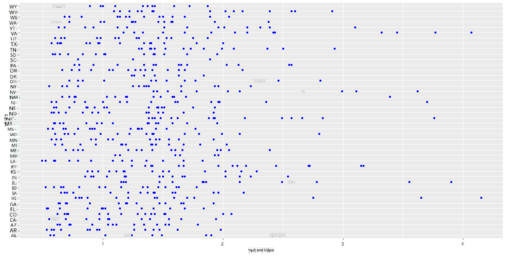
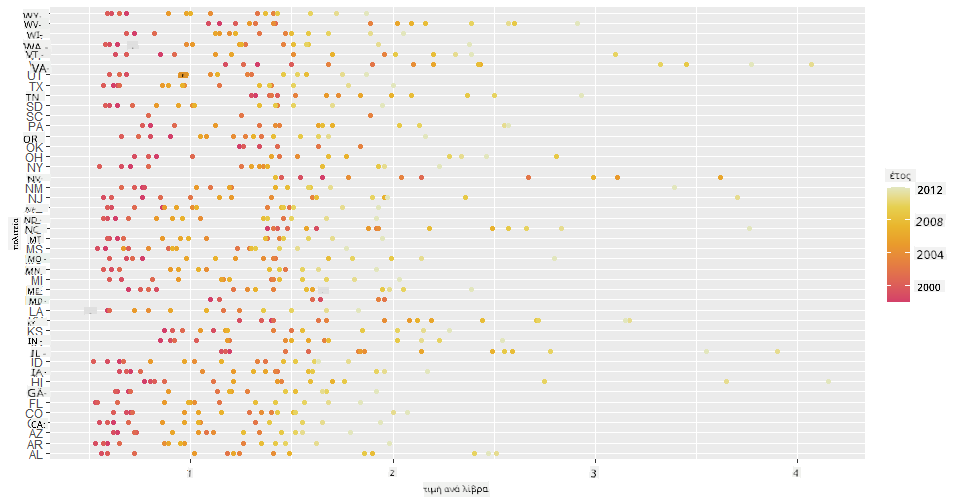
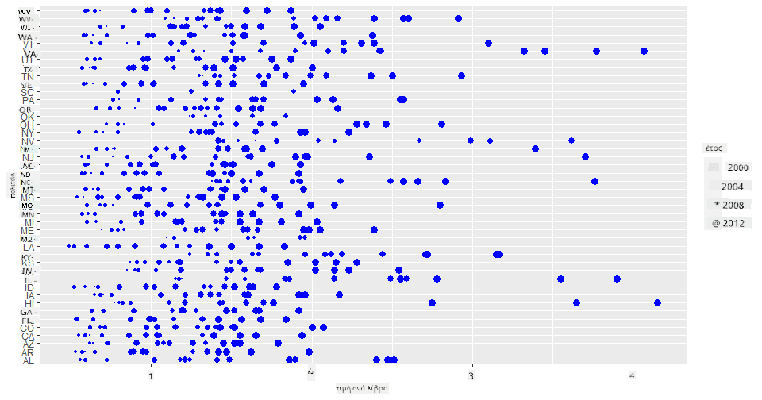
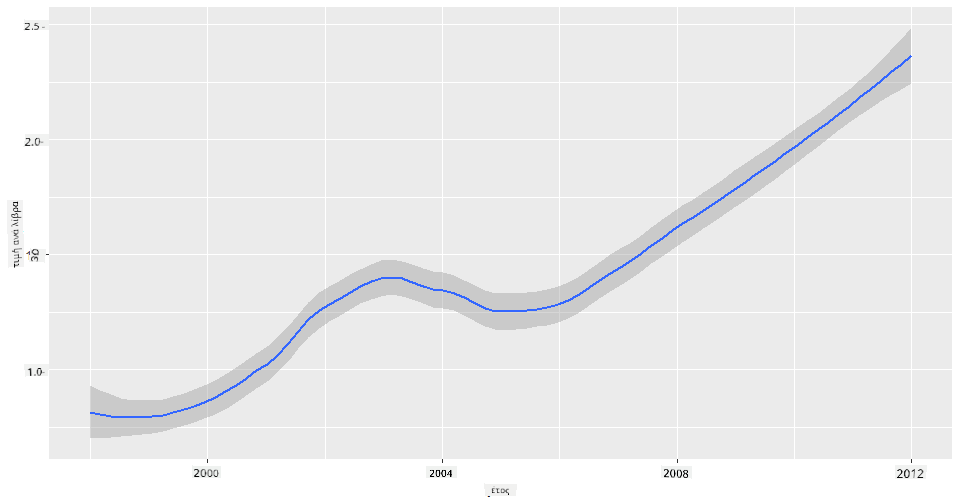
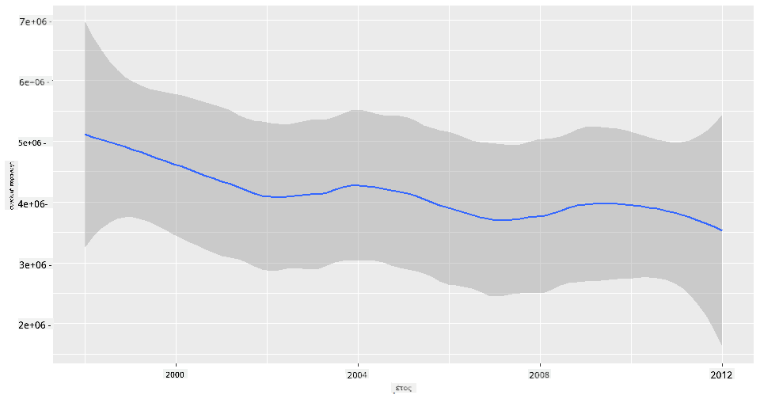
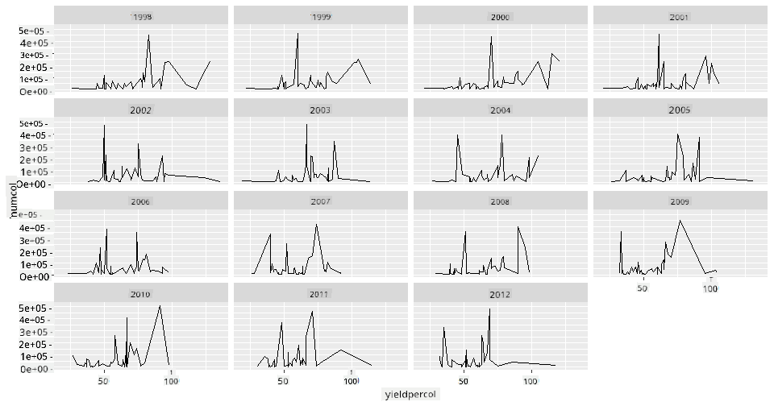
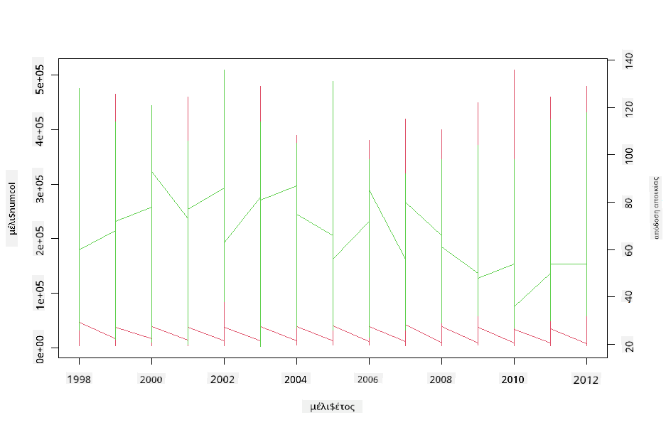

<!--
CO_OP_TRANSLATOR_METADATA:
{
  "original_hash": "a33c5d4b4156a2b41788d8720b6f724c",
  "translation_date": "2025-08-26T22:59:59+00:00",
  "source_file": "3-Data-Visualization/R/12-visualization-relationships/README.md",
  "language_code": "el"
}
-->
# Οπτικοποίηση Σχέσεων: Όλα για το Μέλι 🍯

| ](../../../sketchnotes/12-Visualizing-Relationships.png)|
|:---:|
|Οπτικοποίηση Σχέσεων - _Σκίτσο από [@nitya](https://twitter.com/nitya)_ |

Συνεχίζοντας με τη φύση ως επίκεντρο της έρευνάς μας, ας ανακαλύψουμε ενδιαφέρουσες οπτικοποιήσεις για να δείξουμε τις σχέσεις μεταξύ διαφόρων τύπων μελιού, σύμφωνα με ένα σύνολο δεδομένων που προέρχεται από το [Υπουργείο Γεωργίας των Ηνωμένων Πολιτειών](https://www.nass.usda.gov/About_NASS/index.php).

Αυτό το σύνολο δεδομένων, που περιλαμβάνει περίπου 600 εγγραφές, παρουσιάζει την παραγωγή μελιού σε πολλές πολιτείες των Η.Π.Α. Για παράδειγμα, μπορείτε να εξετάσετε τον αριθμό των αποικιών, την απόδοση ανά αποικία, τη συνολική παραγωγή, τα αποθέματα, την τιμή ανά λίβρα και την αξία του παραγόμενου μελιού σε μια δεδομένη πολιτεία από το 1998 έως το 2012, με μία γραμμή ανά έτος για κάθε πολιτεία.

Θα ήταν ενδιαφέρον να οπτικοποιήσουμε τη σχέση μεταξύ της παραγωγής μιας πολιτείας ανά έτος και, για παράδειγμα, της τιμής του μελιού σε αυτή την πολιτεία. Εναλλακτικά, θα μπορούσατε να οπτικοποιήσετε τη σχέση μεταξύ της απόδοσης μελιού ανά αποικία στις πολιτείες. Αυτή η χρονική περίοδος περιλαμβάνει την καταστροφική «Διαταραχή Κατάρρευσης Αποικιών» (CCD), που παρατηρήθηκε για πρώτη φορά το 2006 (http://npic.orst.edu/envir/ccd.html), καθιστώντας το ένα συγκινητικό σύνολο δεδομένων για μελέτη. 🐝

## [Κουίζ πριν το μάθημα](https://purple-hill-04aebfb03.1.azurestaticapps.net/quiz/22)

Σε αυτό το μάθημα, μπορείτε να χρησιμοποιήσετε το ggplot2, το οποίο έχετε χρησιμοποιήσει ξανά, ως μια εξαιρετική βιβλιοθήκη για την οπτικοποίηση σχέσεων μεταξύ μεταβλητών. Ιδιαίτερα ενδιαφέρουσα είναι η χρήση των `geom_point` και `qplot` του ggplot2, που επιτρέπουν τη δημιουργία διαγραμμάτων διασποράς και γραμμών για γρήγορη οπτικοποίηση των '[στατιστικών σχέσεων](https://ggplot2.tidyverse.org/)', βοηθώντας τον επιστήμονα δεδομένων να κατανοήσει καλύτερα πώς σχετίζονται οι μεταβλητές μεταξύ τους.

## Διαγράμματα Διασποράς

Χρησιμοποιήστε ένα διάγραμμα διασποράς για να δείξετε πώς εξελίχθηκε η τιμή του μελιού, χρόνο με τον χρόνο, ανά πολιτεία. Το ggplot2, χρησιμοποιώντας τα `ggplot` και `geom_point`, ομαδοποιεί εύκολα τα δεδομένα ανά πολιτεία και εμφανίζει σημεία δεδομένων για κατηγορικά και αριθμητικά δεδομένα.

Ας ξεκινήσουμε εισάγοντας τα δεδομένα και τη βιβλιοθήκη Seaborn:

```r
honey=read.csv('../../data/honey.csv')
head(honey)
```
Παρατηρείτε ότι τα δεδομένα για το μέλι περιλαμβάνουν αρκετές ενδιαφέρουσες στήλες, όπως το έτος και την τιμή ανά λίβρα. Ας εξερευνήσουμε αυτά τα δεδομένα, ομαδοποιημένα ανά πολιτεία των Η.Π.Α.:

| πολιτεία | αποικίες | απόδοση/αποικία | συνολική παραγωγή | αποθέματα | τιμή/λίβρα | αξία παραγωγής | έτος |
| -------- | -------- | --------------- | ----------------- | --------- | ---------- | ------------- | ---- |
| AL       | 16000    | 71              | 1136000           | 159000    | 0.72       | 818000        | 1998 |
| AZ       | 55000    | 60              | 3300000           | 1485000   | 0.64       | 2112000       | 1998 |
| AR       | 53000    | 65              | 3445000           | 1688000   | 0.59       | 2033000       | 1998 |
| CA       | 450000   | 83              | 37350000          | 12326000  | 0.62       | 23157000      | 1998 |
| CO       | 27000    | 72              | 1944000           | 1594000   | 0.7        | 1361000       | 1998 |
| FL       | 230000   | 98              | 22540000          | 4508000   | 0.64       | 14426000      | 1998 |

Δημιουργήστε ένα βασικό διάγραμμα διασποράς για να δείξετε τη σχέση μεταξύ της τιμής ανά λίβρα μελιού και της πολιτείας προέλευσής του. Κάντε τον άξονα `y` αρκετά ψηλό ώστε να εμφανίζονται όλες οι πολιτείες:

```r
library(ggplot2)
ggplot(honey, aes(x = priceperlb, y = state)) +
  geom_point(colour = "blue")
```


Τώρα, δείξτε τα ίδια δεδομένα με μια χρωματική παλέτα που θυμίζει μέλι, για να δείξετε πώς εξελίσσεται η τιμή με την πάροδο των ετών. Μπορείτε να το κάνετε αυτό προσθέτοντας την παράμετρο 'scale_color_gradientn' για να δείξετε την αλλαγή, χρόνο με τον χρόνο:

> ✅ Μάθετε περισσότερα για το [scale_color_gradientn](https://www.rdocumentation.org/packages/ggplot2/versions/0.9.1/topics/scale_colour_gradientn) - δοκιμάστε ένα όμορφο χρωματικό φάσμα ουράνιου τόξου!

```r
ggplot(honey, aes(x = priceperlb, y = state, color=year)) +
  geom_point()+scale_color_gradientn(colours = colorspace::heat_hcl(7))
```


Με αυτή την αλλαγή χρωματικής παλέτας, μπορείτε να δείτε ότι υπάρχει προφανώς μια ισχυρή εξέλιξη με την πάροδο των ετών όσον αφορά την τιμή του μελιού ανά λίβρα. Πράγματι, αν κοιτάξετε ένα δείγμα δεδομένων για να το επαληθεύσετε (επιλέξτε, για παράδειγμα, την Αριζόνα), μπορείτε να δείτε ένα μοτίβο αύξησης της τιμής χρόνο με τον χρόνο, με λίγες εξαιρέσεις:

| πολιτεία | αποικίες | απόδοση/αποικία | συνολική παραγωγή | αποθέματα | τιμή/λίβρα | αξία παραγωγής | έτος |
| -------- | -------- | --------------- | ----------------- | --------- | ---------- | ------------- | ---- |
| AZ       | 55000    | 60              | 3300000           | 1485000   | 0.64       | 2112000       | 1998 |
| AZ       | 52000    | 62              | 3224000           | 1548000   | 0.62       | 1999000       | 1999 |
| AZ       | 40000    | 59              | 2360000           | 1322000   | 0.73       | 1723000       | 2000 |
| AZ       | 43000    | 59              | 2537000           | 1142000   | 0.72       | 1827000       | 2001 |
| AZ       | 38000    | 63              | 2394000           | 1197000   | 1.08       | 2586000       | 2002 |
| AZ       | 35000    | 72              | 2520000           | 983000    | 1.34       | 3377000       | 2003 |
| AZ       | 32000    | 55              | 1760000           | 774000    | 1.11       | 1954000       | 2004 |
| AZ       | 36000    | 50              | 1800000           | 720000    | 1.04       | 1872000       | 2005 |
| AZ       | 30000    | 65              | 1950000           | 839000    | 0.91       | 1775000       | 2006 |
| AZ       | 30000    | 64              | 1920000           | 902000    | 1.26       | 2419000       | 2007 |
| AZ       | 25000    | 64              | 1600000           | 336000    | 1.26       | 2016000       | 2008 |
| AZ       | 20000    | 52              | 1040000           | 562000    | 1.45       | 1508000       | 2009 |
| AZ       | 24000    | 77              | 1848000           | 665000    | 1.52       | 2809000       | 2010 |
| AZ       | 23000    | 53              | 1219000           | 427000    | 1.55       | 1889000       | 2011 |
| AZ       | 22000    | 46              | 1012000           | 253000    | 1.79       | 1811000       | 2012 |

Ένας άλλος τρόπος να οπτικοποιήσετε αυτή την εξέλιξη είναι να χρησιμοποιήσετε το μέγεθος αντί για το χρώμα. Για χρήστες με αχρωματοψία, αυτό μπορεί να είναι μια καλύτερη επιλογή. Επεξεργαστείτε την οπτικοποίησή σας ώστε να δείξετε την αύξηση της τιμής μέσω της αύξησης της περιφέρειας των κουκκίδων:

```r
ggplot(honey, aes(x = priceperlb, y = state)) +
  geom_point(aes(size = year),colour = "blue") +
  scale_size_continuous(range = c(0.25, 3))
```
Μπορείτε να δείτε το μέγεθος των κουκκίδων να αυξάνεται σταδιακά.



Είναι αυτό μια απλή περίπτωση προσφοράς και ζήτησης; Λόγω παραγόντων όπως η κλιματική αλλαγή και η κατάρρευση αποικιών, υπάρχει λιγότερο διαθέσιμο μέλι για αγορά χρόνο με τον χρόνο, και έτσι αυξάνεται η τιμή;

Για να ανακαλύψουμε μια συσχέτιση μεταξύ ορισμένων μεταβλητών σε αυτό το σύνολο δεδομένων, ας εξερευνήσουμε μερικά διαγράμματα γραμμών.

## Διαγράμματα Γραμμών

Ερώτηση: Υπάρχει σαφής αύξηση της τιμής του μελιού ανά λίβρα χρόνο με τον χρόνο; Μπορείτε να το ανακαλύψετε πιο εύκολα δημιουργώντας ένα απλό διάγραμμα γραμμών:

```r
qplot(honey$year,honey$priceperlb, geom='smooth', span =0.5, xlab = "year",ylab = "priceperlb")
```
Απάντηση: Ναι, με κάποιες εξαιρέσεις γύρω στο 2003:



Ερώτηση: Λοιπόν, το 2003 μπορούμε επίσης να δούμε μια αύξηση στην προσφορά μελιού; Τι γίνεται αν κοιτάξετε τη συνολική παραγωγή χρόνο με τον χρόνο;

```python
qplot(honey$year,honey$totalprod, geom='smooth', span =0.5, xlab = "year",ylab = "totalprod")
```



Απάντηση: Όχι ακριβώς. Αν κοιτάξετε τη συνολική παραγωγή, φαίνεται να έχει αυξηθεί εκείνη τη χρονιά, παρόλο που γενικά η ποσότητα του παραγόμενου μελιού μειώνεται κατά τη διάρκεια αυτών των ετών.

Ερώτηση: Σε αυτή την περίπτωση, τι θα μπορούσε να έχει προκαλέσει αυτή την αύξηση στην τιμή του μελιού γύρω στο 2003;

Για να το ανακαλύψετε, μπορείτε να εξερευνήσετε ένα πλέγμα όψεων.

## Πλέγματα Όψεων

Τα πλέγματα όψεων λαμβάνουν μία όψη του συνόλου δεδομένων σας (στην περίπτωσή μας, μπορείτε να επιλέξετε το 'έτος' για να αποφύγετε την παραγωγή υπερβολικά πολλών όψεων). Το Seaborn μπορεί στη συνέχεια να δημιουργήσει ένα διάγραμμα για καθεμία από αυτές τις όψεις των επιλεγμένων συντεταγμένων x και y για πιο εύκολη οπτική σύγκριση. Ξεχωρίζει το 2003 σε αυτό το είδος σύγκρισης;

Δημιουργήστε ένα πλέγμα όψεων χρησιμοποιώντας το `facet_wrap`, όπως συνιστά η [τεκμηρίωση του ggplot2](https://ggplot2.tidyverse.org/reference/facet_wrap.html).

```r
ggplot(honey, aes(x=yieldpercol, y = numcol,group = 1)) + 
  geom_line() + facet_wrap(vars(year))
```
Σε αυτή την οπτικοποίηση, μπορείτε να συγκρίνετε την απόδοση ανά αποικία και τον αριθμό των αποικιών χρόνο με τον χρόνο, δίπλα-δίπλα, με το περιτύλιγμα να έχει οριστεί στις 3 στήλες:



Για αυτό το σύνολο δεδομένων, τίποτα ιδιαίτερο δεν ξεχωρίζει όσον αφορά τον αριθμό των αποικιών και την απόδοσή τους, χρόνο με τον χρόνο και πολιτεία με πολιτεία. Υπάρχει διαφορετικός τρόπος να βρείτε μια συσχέτιση μεταξύ αυτών των δύο μεταβλητών;

## Διπλά Διαγράμματα Γραμμών

Δοκιμάστε ένα διάγραμμα πολλαπλών γραμμών, τοποθετώντας δύο διαγράμματα γραμμών το ένα πάνω στο άλλο, χρησιμοποιώντας τις `par` και `plot` συναρτήσεις της R. Θα σχεδιάσουμε το έτος στον άξονα x και θα εμφανίσουμε δύο άξονες y. Έτσι, εμφανίστε την απόδοση ανά αποικία και τον αριθμό των αποικιών, τοποθετημένα το ένα πάνω στο άλλο:

```r
par(mar = c(5, 4, 4, 4) + 0.3)              
plot(honey$year, honey$numcol, pch = 16, col = 2,type="l")              
par(new = TRUE)                             
plot(honey$year, honey$yieldpercol, pch = 17, col = 3,              
     axes = FALSE, xlab = "", ylab = "",type="l")
axis(side = 4, at = pretty(range(y2)))      
mtext("colony yield", side = 4, line = 3)   
```


Ενώ τίποτα δεν τραβάει την προσοχή γύρω στο 2003, αυτό μας επιτρέπει να κλείσουμε το μάθημα με μια πιο αισιόδοξη νότα: ενώ υπάρχει συνολικά μείωση στον αριθμό των αποικιών, ο αριθμός των αποικιών σταθεροποιείται, ακόμα κι αν η απόδοση ανά αποικία μειώνεται.

Πάμε, μέλισσες, πάμε!

🐝❤️
## 🚀 Πρόκληση

Σε αυτό το μάθημα, μάθατε περισσότερα για άλλες χρήσεις διαγραμμάτων διασποράς και πλεγμάτων γραμμών, συμπεριλαμβανομένων των πλεγμάτων όψεων. Προκαλέστε τον εαυτό σας να δημιουργήσετε ένα πλέγμα όψεων χρησιμοποιώντας ένα διαφορετικό σύνολο δεδομένων, ίσως κάποιο που χρησιμοποιήσατε πριν από αυτά τα μαθήματα. Σημειώστε πόσο χρόνο χρειάζονται για να δημιουργηθούν και πόσο προσεκτικοί πρέπει να είστε σχετικά με το πόσα πλέγματα χρειάζεται να σχεδιάσετε χρησιμοποιώντας αυτές τις τεχνικές.
## [Κουίζ μετά το μάθημα](https://purple-hill-04aebfb03.1.azurestaticapps.net/quiz/23)

## Ανασκόπηση & Αυτομελέτη

Τα διαγράμματα γραμμών μπορούν να είναι απλά ή αρκετά περίπλοκα. Κάντε λίγη ανάγνωση στην [τεκμηρίωση του ggplot2](https://ggplot2.tidyverse.org/reference/geom_path.html#:~:text=geom_line()%20connects%20them%20in,which%20cases%20are%20connected%20together) σχετικά με τους διάφορους τρόπους που μπορείτε να τα δημιουργήσετε. Προσπαθήστε να βελτιώσετε τα διαγράμματα γραμμών που δημιουργήσατε σε αυτό το μάθημα με άλλες μεθόδους που αναφέρονται στην τεκμηρίωση.
## Εργασία

[Εξερευνήστε την κυψέλη](assignment.md)

---

**Αποποίηση ευθύνης**:  
Αυτό το έγγραφο έχει μεταφραστεί χρησιμοποιώντας την υπηρεσία αυτόματης μετάφρασης [Co-op Translator](https://github.com/Azure/co-op-translator). Παρόλο που καταβάλλουμε προσπάθειες για ακρίβεια, παρακαλούμε να έχετε υπόψη ότι οι αυτοματοποιημένες μεταφράσεις ενδέχεται να περιέχουν λάθη ή ανακρίβειες. Το πρωτότυπο έγγραφο στη μητρική του γλώσσα θα πρέπει να θεωρείται η αυθεντική πηγή. Για κρίσιμες πληροφορίες, συνιστάται επαγγελματική ανθρώπινη μετάφραση. Δεν φέρουμε ευθύνη για τυχόν παρεξηγήσεις ή εσφαλμένες ερμηνείες που προκύπτουν από τη χρήση αυτής της μετάφρασης.