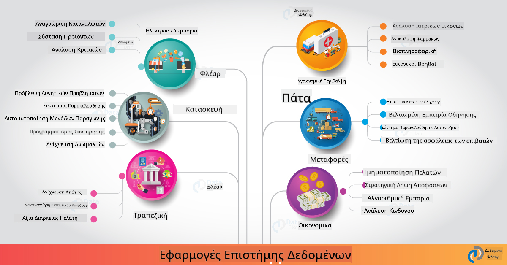

<!--
CO_OP_TRANSLATOR_METADATA:
{
  "original_hash": "0f67a4139454816631526779a456b734",
  "translation_date": "2025-09-06T18:30:19+00:00",
  "source_file": "6-Data-Science-In-Wild/20-Real-World-Examples/README.md",
  "language_code": "el"
}
-->
# Επιστήμη Δεδομένων στον Πραγματικό Κόσμο

|  ](../../sketchnotes/20-DataScience-RealWorld.png) |
| :--------------------------------------------------------------------------------------------------------------: |
|               Επιστήμη Δεδομένων στον Πραγματικό Κόσμο - _Σκίτσο από [@nitya](https://twitter.com/nitya)_               |

Φτάνουμε σχεδόν στο τέλος αυτού του ταξιδιού μάθησης!

Ξεκινήσαμε με τους ορισμούς της επιστήμης δεδομένων και της ηθικής, εξερευνήσαμε διάφορα εργαλεία και τεχνικές για ανάλυση και οπτικοποίηση δεδομένων, ανασκοπήσαμε τον κύκλο ζωής της επιστήμης δεδομένων και εξετάσαμε την κλιμάκωση και αυτοματοποίηση των ροών εργασίας επιστήμης δεδομένων με υπηρεσίες υπολογιστικού νέφους. Οπότε, πιθανότατα αναρωτιέστε: _"Πώς ακριβώς μπορώ να συνδέσω όλες αυτές τις γνώσεις με πραγματικά πλαίσια;"_

Σε αυτό το μάθημα, θα εξερευνήσουμε εφαρμογές της επιστήμης δεδομένων στον πραγματικό κόσμο σε διάφορους κλάδους και θα εμβαθύνουμε σε συγκεκριμένα παραδείγματα στους τομείς της έρευνας, των ψηφιακών ανθρωπιστικών επιστημών και της βιωσιμότητας. Θα δούμε ευκαιρίες για φοιτητικά έργα και θα ολοκληρώσουμε με χρήσιμους πόρους για να συνεχίσετε το ταξίδι μάθησης σας!

## Ερωτηματολόγιο πριν το μάθημα

## [Ερωτηματολόγιο πριν το μάθημα](https://ff-quizzes.netlify.app/en/ds/quiz/38)

## Επιστήμη Δεδομένων + Βιομηχανία

Χάρη στη δημοκρατικοποίηση της Τεχνητής Νοημοσύνης, οι προγραμματιστές βρίσκουν πλέον ευκολότερο να σχεδιάσουν και να ενσωματώσουν αποφάσεις που βασίζονται στην ΤΝ και πληροφορίες που βασίζονται σε δεδομένα στις εμπειρίες χρηστών και στις ροές εργασίας ανάπτυξης. Ακολουθούν μερικά παραδείγματα για το πώς η επιστήμη δεδομένων "εφαρμόζεται" σε πραγματικές εφαρμογές στη βιομηχανία:

 * [Google Flu Trends](https://www.wired.com/2015/10/can-learn-epic-failure-google-flu-trends/) χρησιμοποίησε την επιστήμη δεδομένων για να συσχετίσει όρους αναζήτησης με τάσεις γρίπης. Παρόλο που η προσέγγιση είχε αδυναμίες, ανέδειξε τις δυνατότητες (και τις προκλήσεις) των προβλέψεων υγειονομικής περίθαλψης που βασίζονται σε δεδομένα.

 * [UPS Routing Predictions](https://www.technologyreview.com/2018/11/21/139000/how-ups-uses-ai-to-outsmart-bad-weather/) - εξηγεί πώς η UPS χρησιμοποιεί την επιστήμη δεδομένων και τη μηχανική μάθηση για να προβλέψει βέλτιστες διαδρομές παράδοσης, λαμβάνοντας υπόψη τις καιρικές συνθήκες, τα μοτίβα κυκλοφορίας, τις προθεσμίες παράδοσης και άλλα.

 * [NYC Taxicab Route Visualization](http://chriswhong.github.io/nyctaxi/) - δεδομένα που συλλέχθηκαν μέσω [Νόμων Ελευθερίας Πληροφοριών](https://chriswhong.com/open-data/foil_nyc_taxi/) βοήθησαν στην οπτικοποίηση μιας ημέρας στη ζωή των ταξί της Νέας Υόρκης, βοηθώντας μας να κατανοήσουμε πώς περιηγούνται στην πολυσύχναστη πόλη, τα χρήματα που κερδίζουν και τη διάρκεια των ταξιδιών σε κάθε 24ωρη περίοδο.

 * [Uber Data Science Workbench](https://eng.uber.com/dsw/) - χρησιμοποιεί δεδομένα (για τοποθεσίες παραλαβής και αποβίβασης, διάρκεια ταξιδιού, προτιμώμενες διαδρομές κ.λπ.) που συλλέγονται από εκατομμύρια ταξίδια Uber *καθημερινά* για να δημιουργήσει ένα εργαλείο ανάλυσης δεδομένων που βοηθά στη διαμόρφωση τιμών, την ασφάλεια, την ανίχνευση απάτης και τις αποφάσεις πλοήγησης.

 * [Ανάλυση Δεδομένων στον Αθλητισμό](https://towardsdatascience.com/scope-of-analytics-in-sports-world-37ed09c39860) - επικεντρώνεται στην _προβλεπτική ανάλυση_ (ανάλυση ομάδας και παικτών - σκεφτείτε [Moneyball](https://datasciencedegree.wisconsin.edu/blog/moneyball-proves-importance-big-data-big-ideas/) - και διαχείριση οπαδών) και στην _οπτικοποίηση δεδομένων_ (πίνακες ελέγχου ομάδας και οπαδών, παιχνίδια κ.λπ.) με εφαρμογές όπως η ανίχνευση ταλέντων, ο τζόγος στον αθλητισμό και η διαχείριση αποθεμάτων/χώρων.

 * [Επιστήμη Δεδομένων στις Τράπεζες](https://data-flair.training/blogs/data-science-in-banking/) - αναδεικνύει την αξία της επιστήμης δεδομένων στον χρηματοοικονομικό κλάδο με εφαρμογές που κυμαίνονται από μοντελοποίηση κινδύνου και ανίχνευση απάτης, έως τμηματοποίηση πελατών, πρόβλεψη σε πραγματικό χρόνο και συστήματα συστάσεων. Η προβλεπτική ανάλυση οδηγεί επίσης κρίσιμα μέτρα όπως [πιστωτικές βαθμολογίες](https://dzone.com/articles/using-big-data-and-predictive-analytics-for-credit).

 * [Επιστήμη Δεδομένων στην Υγειονομική Περίθαλψη](https://data-flair.training/blogs/data-science-in-healthcare/) - αναδεικνύει εφαρμογές όπως η ιατρική απεικόνιση (π.χ., MRI, ακτινογραφία, CT-Scan), η γονιδιωματική (αλληλούχιση DNA), η ανάπτυξη φαρμάκων (αξιολόγηση κινδύνου, πρόβλεψη επιτυχίας), η προβλεπτική ανάλυση (φροντίδα ασθενών και εφοδιαστική), η παρακολούθηση και πρόληψη ασθενειών κ.λπ.

 Πηγή Εικόνας: [Data Flair: 6 Amazing Data Science Applications ](https://data-flair.training/blogs/data-science-applications/)

Η εικόνα δείχνει άλλους τομείς και παραδείγματα για την εφαρμογή τεχνικών επιστήμης δεδομένων. Θέλετε να εξερευνήσετε άλλες εφαρμογές; Δείτε την ενότητα [Ανασκόπηση & Αυτομελέτη](../../../../6-Data-Science-In-Wild/20-Real-World-Examples) παρακάτω.

## Επιστήμη Δεδομένων + Έρευνα

|  ](../../sketchnotes/20-DataScience-Research.png) |
| :---------------------------------------------------------------------------------------------------------------: |
|              Επιστήμη Δεδομένων & Έρευνα - _Σκίτσο από [@nitya](https://twitter.com/nitya)_              |

Ενώ οι εφαρμογές στον πραγματικό κόσμο συχνά επικεντρώνονται σε περιπτώσεις χρήσης στη βιομηχανία σε μεγάλη κλίμακα, οι εφαρμογές και τα έργα _έρευνας_ μπορούν να είναι χρήσιμα από δύο προοπτικές:

* _ευκαιρίες καινοτομίας_ - εξερεύνηση γρήγορης δημιουργίας πρωτοτύπων προηγμένων εννοιών και δοκιμή εμπειριών χρήστη για εφαρμογές επόμενης γενιάς.
* _προκλήσεις ανάπτυξης_ - διερεύνηση πιθανών βλαβών ή ακούσιων συνεπειών των τεχνολογιών επιστήμης δεδομένων σε πραγματικά πλαίσια.

Για τους φοιτητές, αυτά τα ερευνητικά έργα μπορούν να προσφέρουν τόσο ευκαιρίες μάθησης όσο και συνεργασίας που μπορούν να βελτιώσουν την κατανόησή σας για το θέμα και να διευρύνουν την επίγνωσή σας και τη δέσμευσή σας με σχετικούς ανθρώπους ή ομάδες που εργάζονται σε τομείς ενδιαφέροντος. Πώς μοιάζουν λοιπόν τα ερευνητικά έργα και πώς μπορούν να έχουν αντίκτυπο;

Ας δούμε ένα παράδειγμα - τη [Μελέτη Gender Shades του MIT](http://gendershades.org/overview.html) από την Joy Buolamwini (MIT Media Labs) με ένα [εμβληματικό ερευνητικό άρθρο](http://proceedings.mlr.press/v81/buolamwini18a/buolamwini18a.pdf) που συνυπογράφεται με την Timnit Gebru (τότε στη Microsoft Research) που επικεντρώθηκε σε:

 * **Τι:** Ο στόχος του ερευνητικού έργου ήταν να _αξιολογήσει την προκατάληψη που υπάρχει στους αυτοματοποιημένους αλγόριθμους ανάλυσης προσώπου και στα σύνολα δεδομένων_ με βάση το φύλο και τον τύπο δέρματος.
 * **Γιατί:** Η ανάλυση προσώπου χρησιμοποιείται σε τομείς όπως η επιβολή του νόμου, η ασφάλεια αεροδρομίων, τα συστήματα πρόσληψης και άλλα - πλαίσια όπου οι ανακριβείς ταξινομήσεις (π.χ., λόγω προκατάληψης) μπορούν να προκαλέσουν πιθανές οικονομικές και κοινωνικές βλάβες στα επηρεαζόμενα άτομα ή ομάδες. Η κατανόηση (και η εξάλειψη ή ο μετριασμός) των προκαταλήψεων είναι το κλειδί για τη δικαιοσύνη στη χρήση.
 * **Πώς:** Οι ερευνητές αναγνώρισαν ότι τα υπάρχοντα σημεία αναφοράς χρησιμοποιούσαν κυρίως άτομα με ανοιχτόχρωμο δέρμα και δημιούργησαν ένα νέο σύνολο δεδομένων (1000+ εικόνες) που ήταν _πιο ισορροπημένο_ ως προς το φύλο και τον τύπο δέρματος. Το σύνολο δεδομένων χρησιμοποιήθηκε για την αξιολόγηση της ακρίβειας τριών προϊόντων ταξινόμησης φύλου (από Microsoft, IBM & Face++).

Τα αποτελέσματα έδειξαν ότι, παρόλο που η συνολική ακρίβεια ταξινόμησης ήταν καλή, υπήρχε αξιοσημείωτη διαφορά στα ποσοστά σφάλματος μεταξύ διαφόρων υποομάδων - με **λανθασμένη ταξινόμηση φύλου** να είναι υψηλότερη για γυναίκες ή άτομα με πιο σκούρους τύπους δέρματος, ενδεικτική προκατάληψης.

**Κύρια Αποτελέσματα:** Αναδείχθηκε η ανάγκη η επιστήμη δεδομένων να έχει πιο _αντιπροσωπευτικά σύνολα δεδομένων_ (ισορροπημένες υποομάδες) και πιο _συμπεριληπτικές ομάδες_ (ποικίλα υπόβαθρα) για να αναγνωρίζουν και να εξαλείφουν ή να μετριάζουν τέτοιες προκαταλήψεις νωρίτερα στις λύσεις ΤΝ. Ερευνητικές προσπάθειες όπως αυτή είναι επίσης καθοριστικές για τον καθορισμό αρχών και πρακτικών για _υπεύθυνη ΤΝ_ σε πολλές οργανώσεις, ώστε να βελτιωθεί η δικαιοσύνη στα προϊόντα και τις διαδικασίες ΤΝ τους.

**Θέλετε να μάθετε για σχετικές ερευνητικές προσπάθειες στη Microsoft;**

* Δείτε [Ερευνητικά Έργα της Microsoft](https://www.microsoft.com/research/research-area/artificial-intelligence/?facet%5Btax%5D%5Bmsr-research-area%5D%5B%5D=13556&facet%5Btax%5D%5Bmsr-content-type%5D%5B%5D=msr-project) στην Τεχνητή Νοημοσύνη.
* Εξερευνήστε φοιτητικά έργα από το [Microsoft Research Data Science Summer School](https://www.microsoft.com/en-us/research/academic-program/data-science-summer-school/).
* Δείτε το έργο [Fairlearn](https://fairlearn.org/) και τις πρωτοβουλίες [Υπεύθυνης ΤΝ](https://www.microsoft.com/en-us/ai/responsible-ai?activetab=pivot1%3aprimaryr6).

## Επιστήμη Δεδομένων + Ανθρωπιστικές Επιστήμες

|  ](../../sketchnotes/20-DataScience-Humanities.png) |
| :---------------------------------------------------------------------------------------------------------------: |
|              Επιστήμη Δεδομένων & Ψηφιακές Ανθρωπιστικές Επιστήμες - _Σκίτσο από [@nitya](https://twitter.com/nitya)_              |

Οι Ψηφιακές Ανθρωπιστικές Επιστήμες [έχουν οριστεί](https://digitalhumanities.stanford.edu/about-dh-stanford) ως "μια συλλογή πρακτικών και προσεγγίσεων που συνδυάζουν υπολογιστικές μεθόδους με ανθρωπιστική έρευνα". [Έργα του Stanford](https://digitalhumanities.stanford.edu/projects) όπως _"rebooting history"_ και _"poetic thinking"_ αναδεικνύουν τη σύνδεση μεταξύ [Ψηφιακών Ανθρωπιστικών Επιστημών και Επιστήμης Δεδομένων](https://digitalhumanities.stanford.edu/digital-humanities-and-data-science) - τονίζοντας τεχνικές όπως η ανάλυση δικτύων, η οπτικοποίηση πληροφοριών, η χωρική και η ανάλυση κειμένου που μπορούν να μας βοηθήσουν να επανεξετάσουμε ιστορικά και λογοτεχνικά σύνολα δεδομένων για να αντλήσουμε νέες γνώσεις και προοπτικές.

*Θέλετε να εξερευνήσετε και να επεκτείνετε ένα έργο σε αυτόν τον τομέα;*

Δείτε το ["Emily Dickinson and the Meter of Mood"](https://gist.github.com/jlooper/ce4d102efd057137bc000db796bfd671) - ένα εξαιρετικό παράδειγμα από την [Jen Looper](https://twitter.com/jenlooper) που θέτει το ερώτημα πώς μπορούμε να χρησιμοποιήσουμε την επιστήμη δεδομένων για να επανεξετάσουμε γνωστή ποίηση και να επαναξιολογήσουμε τη σημασία της και τη συμβολή της συγγραφέως σε νέα πλαίσια. Για παράδειγμα, _μπορούμε να προβλέψουμε την εποχή κατά την οποία γράφτηκε ένα ποίημα αναλύοντας τον τόνο ή το συναίσθημά του_ - και τι μας λέει αυτό για την ψυχική κατάσταση της συγγραφέως κατά τη σχετική περίοδο;

Για να απαντήσουμε σε αυτή την ερώτηση, ακολουθούμε τα βήματα του κύκλου ζωής της επιστήμης δεδομένων:
 * [`Απόκτηση Δεδομένων`](https://gist.github.com/jlooper/ce4d102efd057137bc000db796bfd671#acquiring-the-dataset) - για τη συλλογή ενός σχετικού συνόλου δεδομένων για ανάλυση. Οι επιλογές περιλαμβάνουν τη χρήση ενός API (π.χ., [Poetry DB API](https://poetrydb.org/index.html)) ή την εξαγωγή δεδομένων από ιστοσελίδες (π.χ., [Project Gutenberg](https://www.gutenberg.org/files/12242/12242-h/12242-h.htm)) χρησιμοποιώντας εργαλεία όπως το [Scrapy](https://scrapy.org/).
 * [`Καθαρισμός Δεδομένων`](https://gist.github.com/jlooper/ce4d102efd057137bc000db796bfd671#clean-the-data) - εξηγεί πώς το κείμενο μπορεί να μορφοποιηθεί, να καθαριστεί και να απλοποιηθεί χρησιμοποιώντας βασικά εργαλεία όπως το Visual Studio Code και το Microsoft Excel.
 * [`Ανάλυση Δεδομένων`](https://gist.github.com/jlooper/ce4d102efd057137bc000db796bfd671#working-with-the-data-in-a-notebook) - εξηγεί πώς μπορούμε τώρα να εισάγουμε το σύνολο δεδομένων σε "Notebooks" για ανάλυση χρησιμοποιώντας πακέτα Python (όπως pandas, numpy και matplotlib) για την οργάνωση και την οπτικοποίηση των δεδομένων.
 * [`Ανάλυση Συναισθημάτων`](https://gist.github.com/jlooper/ce4d102efd057137bc000db796bfd671#sentiment-analysis-using-cognitive-services) - εξηγεί πώς μπορούμε να ενσωματώσουμε υπηρεσίες υπολογιστικού νέφους όπως το Text Analytics, χρησιμοποιώντας εργα
**Το Project Planetary Computer βρίσκεται αυτή τη στιγμή σε προεπισκόπηση (από τον Σεπτέμβριο του 2021)** - δείτε πώς μπορείτε να ξεκινήσετε να συμβάλλετε σε λύσεις βιωσιμότητας χρησιμοποιώντας την επιστήμη δεδομένων.

* [Αιτηθείτε πρόσβαση](https://planetarycomputer.microsoft.com/account/request) για να ξεκινήσετε την εξερεύνηση και να συνδεθείτε με άλλους.
* [Εξερευνήστε την τεκμηρίωση](https://planetarycomputer.microsoft.com/docs/overview/about) για να κατανοήσετε τα υποστηριζόμενα σύνολα δεδομένων και APIs.
* Εξερευνήστε εφαρμογές όπως το [Ecosystem Monitoring](https://analytics-lab.org/ecosystemmonitoring/) για έμπνευση σχετικά με ιδέες εφαρμογών.

Σκεφτείτε πώς μπορείτε να χρησιμοποιήσετε την οπτικοποίηση δεδομένων για να αποκαλύψετε ή να ενισχύσετε σημαντικές πληροφορίες σε τομείς όπως η κλιματική αλλαγή και η αποψίλωση των δασών. Ή σκεφτείτε πώς αυτές οι πληροφορίες μπορούν να χρησιμοποιηθούν για τη δημιουργία νέων εμπειριών χρήστη που ενθαρρύνουν αλλαγές συμπεριφοράς για μια πιο βιώσιμη ζωή.

## Επιστήμη Δεδομένων + Φοιτητές

Έχουμε μιλήσει για εφαρμογές στον πραγματικό κόσμο στη βιομηχανία και την έρευνα, και έχουμε εξερευνήσει παραδείγματα εφαρμογών επιστήμης δεδομένων στις ψηφιακές ανθρωπιστικές επιστήμες και τη βιωσιμότητα. Πώς λοιπόν μπορείτε να αναπτύξετε τις δεξιότητές σας και να μοιραστείτε την εξειδίκευσή σας ως αρχάριοι στην επιστήμη δεδομένων;

Ακολουθούν μερικά παραδείγματα φοιτητικών projects επιστήμης δεδομένων για έμπνευση.

 * [MSR Data Science Summer School](https://www.microsoft.com/en-us/research/academic-program/data-science-summer-school/#!projects) με GitHub [projects](https://github.com/msr-ds3) που εξερευνούν θέματα όπως:
    - [Ρατσιστική προκατάληψη στη χρήση βίας από την αστυνομία](https://www.microsoft.com/en-us/research/video/data-science-summer-school-2019-replicating-an-empirical-analysis-of-racial-differences-in-police-use-of-force/) | [Github](https://github.com/msr-ds3/stop-question-frisk)
    - [Αξιοπιστία του συστήματος μετρό της Νέας Υόρκης](https://www.microsoft.com/en-us/research/video/data-science-summer-school-2018-exploring-the-reliability-of-the-nyc-subway-system/) | [Github](https://github.com/msr-ds3/nyctransit)
 * [Ψηφιοποίηση Υλικού Πολιτισμού: Εξερεύνηση κοινωνικοοικονομικών κατανομών στο Sirkap](https://claremont.maps.arcgis.com/apps/Cascade/index.html?appid=bdf2aef0f45a4674ba41cd373fa23afc) - από την [Ornella Altunyan](https://twitter.com/ornelladotcom) και την ομάδα της στο Claremont, χρησιμοποιώντας [ArcGIS StoryMaps](https://storymaps.arcgis.com/).

## 🚀 Πρόκληση

Αναζητήστε άρθρα που προτείνουν projects επιστήμης δεδομένων φιλικά προς αρχάριους - όπως [αυτές οι 50 θεματικές περιοχές](https://www.upgrad.com/blog/data-science-project-ideas-topics-beginners/) ή [αυτές οι 21 ιδέες projects](https://www.intellspot.com/data-science-project-ideas) ή [αυτά τα 16 projects με πηγαίο κώδικα](https://data-flair.training/blogs/data-science-project-ideas/) που μπορείτε να αναλύσετε και να επανασυνθέσετε. Και μην ξεχάσετε να γράψετε στο blog σας για τις μαθησιακές σας διαδρομές και να μοιραστείτε τις γνώσεις σας με όλους μας.

## Κουίζ μετά τη διάλεξη

## [Κουίζ μετά τη διάλεξη](https://ff-quizzes.netlify.app/en/ds/quiz/39)

## Ανασκόπηση & Αυτομελέτη

Θέλετε να εξερευνήσετε περισσότερες περιπτώσεις χρήσης; Ακολουθούν μερικά σχετικά άρθρα:
 * [17 Εφαρμογές και Παραδείγματα Επιστήμης Δεδομένων](https://builtin.com/data-science/data-science-applications-examples) - Ιούλιος 2021
 * [11 Εντυπωσιακές Εφαρμογές Επιστήμης Δεδομένων στον Πραγματικό Κόσμο](https://myblindbird.com/data-science-applications-real-world/) - Μάιος 2021
 * [Η Επιστήμη Δεδομένων στον Πραγματικό Κόσμο](https://towardsdatascience.com/data-science-in-the-real-world/home) - Συλλογή Άρθρων
 * [12 Εφαρμογές Επιστήμης Δεδομένων στον Πραγματικό Κόσμο με Παραδείγματα](https://www.scaler.com/blog/data-science-applications/) - Μάιος 2024
 * Επιστήμη Δεδομένων σε: [Εκπαίδευση](https://data-flair.training/blogs/data-science-in-education/), [Γεωργία](https://data-flair.training/blogs/data-science-in-agriculture/), [Χρηματοοικονομικά](https://data-flair.training/blogs/data-science-in-finance/), [Ταινίες](https://data-flair.training/blogs/data-science-at-movies/), [Υγειονομική Περίθαλψη](https://onlinedegrees.sandiego.edu/data-science-health-care/) & άλλα.

## Εργασία

[Εξερευνήστε Ένα Σύνολο Δεδομένων του Planetary Computer](assignment.md)

---

**Αποποίηση ευθύνης**:  
Αυτό το έγγραφο έχει μεταφραστεί χρησιμοποιώντας την υπηρεσία αυτόματης μετάφρασης [Co-op Translator](https://github.com/Azure/co-op-translator). Παρόλο που καταβάλλουμε προσπάθειες για ακρίβεια, παρακαλούμε να έχετε υπόψη ότι οι αυτόματες μεταφράσεις ενδέχεται να περιέχουν σφάλματα ή ανακρίβειες. Το πρωτότυπο έγγραφο στη μητρική του γλώσσα θα πρέπει να θεωρείται η αυθεντική πηγή. Για κρίσιμες πληροφορίες, συνιστάται επαγγελματική ανθρώπινη μετάφραση. Δεν φέρουμε ευθύνη για τυχόν παρεξηγήσεις ή εσφαλμένες ερμηνείες που προκύπτουν από τη χρήση αυτής της μετάφρασης.