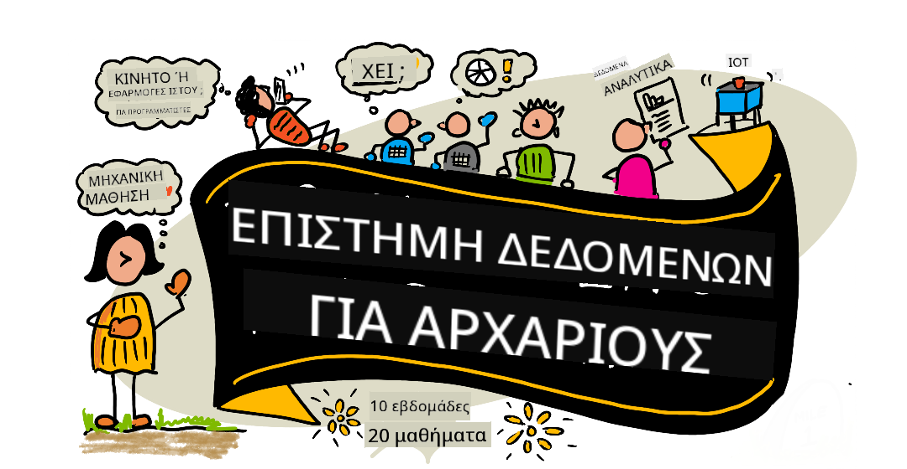

<!--
CO_OP_TRANSLATOR_METADATA:
{
  "original_hash": "7c31d1a22c746b1d0f0582d4f54702ba",
  "translation_date": "2025-12-24T23:35:16+00:00",
  "source_file": "README.md",
  "language_code": "el"
}
-->
# Data Science for Beginners - A Curriculum

Οι Azure Cloud Advocates στη Microsoft είναι στην ευχάριστη θέση να προσφέρουν ένα πρόγραμμα 10 εβδομάδων, 20 μαθημάτων όλο για την Επιστήμη Δεδομένων. Κάθε μάθημα περιλαμβάνει προ-μάθημα και μετα-μάθημα κουίζ, γραπτές οδηγίες για την ολοκλήρωση του μαθήματος, μια λύση και μια ανάθεση. Η παιδαγωγική μας βασισμένη σε έργα σας επιτρέπει να μαθαίνετε ενώ χτίζετε, ένας αποδεδειγμένος τρόπος για να "καθίσουν" οι νέες δεξιότητες.

**Θερμές ευχαριστίες στους συγγραφείς μας:** [Jasmine Greenaway](https://www.twitter.com/paladique), [Dmitry Soshnikov](http://soshnikov.com), [Nitya Narasimhan](https://twitter.com/nitya), [Jalen McGee](https://twitter.com/JalenMcG), [Jen Looper](https://twitter.com/jenlooper), [Maud Levy](https://twitter.com/maudstweets), [Tiffany Souterre](https://twitter.com/TiffanySouterre), [Christopher Harrison](https://www.twitter.com/geektrainer).

**🙏 Ειδικές ευχαριστίες 🙏 σε συγγραφείς, κριτές και συνεισφέροντες περιεχομένου από το πρόγραμμα [Microsoft Student Ambassador](https://studentambassadors.microsoft.com/),** ειδικότερα Aaryan Arora, [Aditya Garg](https://github.com/AdityaGarg00), [Alondra Sanchez](https://www.linkedin.com/in/alondra-sanchez-molina/), [Ankita Singh](https://www.linkedin.com/in/ankitasingh007), [Anupam Mishra](https://www.linkedin.com/in/anupam--mishra/), [Arpita Das](https://www.linkedin.com/in/arpitadas01/), ChhailBihari Dubey, [Dibri Nsofor](https://www.linkedin.com/in/dibrinsofor), [Dishita Bhasin](https://www.linkedin.com/in/dishita-bhasin-7065281bb), [Majd Safi](https://www.linkedin.com/in/majd-s/), [Max Blum](https://www.linkedin.com/in/max-blum-6036a1186/), [Miguel Correa](https://www.linkedin.com/in/miguelmque/), [Mohamma Iftekher (Iftu) Ebne Jalal](https://twitter.com/iftu119), [Nawrin Tabassum](https://www.linkedin.com/in/nawrin-tabassum), [Raymond Wangsa Putra](https://www.linkedin.com/in/raymond-wp/), [Rohit Yadav](https://www.linkedin.com/in/rty2423), Samridhi Sharma, [Sanya Sinha](https://www.linkedin.com/mwlite/in/sanya-sinha-13aab1200),
[Sheena Narula](https://www.linkedin.com/in/sheena-narua-n/), [Tauqeer Ahmad](https://www.linkedin.com/in/tauqeerahmad5201/), Yogendrasingh Pawar , [Vidushi Gupta](https://www.linkedin.com/in/vidushi-gupta07/), [Jasleen Sondhi](https://www.linkedin.com/in/jasleen-sondhi/)

||
|:---:|
| Επιστήμη Δεδομένων για Αρχάριους - _Σκίτσο από [@nitya](https://twitter.com/nitya)_ |

### 🌐 Υποστήριξη πολλαπλών γλωσσών

#### Υποστηρίζεται μέσω GitHub Action (Αυτοματοποιημένο & Πάντα Ενημερωμένο)

<!-- CO-OP TRANSLATOR LANGUAGES TABLE START -->
[Αραβικά](../ar/README.md) | [Μπενγκάλι](../bn/README.md) | [Βουλγαρικά](../bg/README.md) | [Βιρμανικά (Μυανμάρ)](../my/README.md) | [Κινέζικα (Απλοποιημένα)](../zh/README.md) | [Κινέζικα (Παραδοσιακά, Χονγκ Κονγκ)](../hk/README.md) | [Κινέζικα (Παραδοσιακά, Μακάο)](../mo/README.md) | [Κινέζικα (Παραδοσιακά, Ταϊβάν)](../tw/README.md) | [Κροατικά](../hr/README.md) | [Τσέχικα](../cs/README.md) | [Δανικά](../da/README.md) | [Ολλανδικά](../nl/README.md) | [Εσθονικά](../et/README.md) | [Φινλανδικά](../fi/README.md) | [Γαλλικά](../fr/README.md) | [Γερμανικά](../de/README.md) | [Ελληνικά](./README.md) | [Εβραϊκά](../he/README.md) | [Χίντι](../hi/README.md) | [Ουγγρικά](../hu/README.md) | [Ινδονησιακά](../id/README.md) | [Ιταλικά](../it/README.md) | [Ιαπωνικά](../ja/README.md) | [Κανάντα](../kn/README.md) | [Κορεατικά](../ko/README.md) | [Λιθουανικά](../lt/README.md) | [Μαλαικά](../ms/README.md) | [Μαλαγιάλαμ](../ml/README.md) | [Μαράθι](../mr/README.md) | [Νεπάλι](../ne/README.md) | [Νιγηριανό Πίτζιν](../pcm/README.md) | [Νορβηγικά](../no/README.md) | [Περσικά (Φαρσί)](../fa/README.md) | [Πολωνικά](../pl/README.md) | [Πορτογαλικά (Βραζιλίας)](../br/README.md) | [Πορτογαλικά (Πορτογαλίας)](../pt/README.md) | [Πουντζάμπι (Gurmukhi)](../pa/README.md) | [Ρουμανικά](../ro/README.md) | [Ρωσικά](../ru/README.md) | [Σερβικά (Κυριλλικά)](../sr/README.md) | [Σλοβακικά](../sk/README.md) | [Σλοβενικά](../sl/README.md) | [Ισπανικά](../es/README.md) | [Σουαχίλι](../sw/README.md) | [Σουηδικά](../sv/README.md) | [Ταγκαλόγκ (Φιλιππινέζικα)](../tl/README.md) | [Ταμίλ](../ta/README.md) | [Τελούγκου](../te/README.md) | [Ταϊλανδικά](../th/README.md) | [Τουρκικά](../tr/README.md) | [Ουκρανικά](../uk/README.md) | [Ουρντού](../ur/README.md) | [Βιετναμέζικα](../vi/README.md)
<!-- CO-OP TRANSLATOR LANGUAGES TABLE END -->

**Εάν επιθυμείτε πρόσθετες μεταφράσεις, οι υποστηριζόμενες γλώσσες αναφέρονται [εδώ](https://github.com/Azure/co-op-translator/blob/main/getting_started/supported-languages.md)**

#### Ελάτε στην κοινότητά μας 

Διεξάγουμε μια σειρά στο Discord με τίτλο «Μάθηση με AI», μάθετε περισσότερα και ελάτε μαζί μας στη [Σειρά Μάθησης με AI](https://aka.ms/learnwithai/discord) από τις 18 έως τις 30 Σεπτεμβρίου 2025. Θα λάβετε συμβουλές και κόλπα για τη χρήση του GitHub Copilot για την Επιστήμη Δεδομένων.

# Είσαι φοιτητής;

Ξεκίνα με τους ακόλουθους πόρους:

- [Σελίδα Student Hub](https://docs.microsoft.com/en-gb/learn/student-hub?WT.mc_id=academic-77958-bethanycheum) Σε αυτή τη σελίδα, θα βρείτε πόρους για αρχάριους, πακέτα για φοιτητές και ακόμη τρόπους να αποκτήσετε ένα δωρεάν κουπόνι πιστοποίησης. Αυτή είναι μια σελίδα που θέλετε να σελιδοδείξετε και να ελέγχετε από καιρό σε καιρό καθώς αλλάζουμε το περιεχόμενο τουλάχιστον μηνιαίως.
- [Microsoft Learn Student Ambassadors](https://studentambassadors.microsoft.com?WT.mc_id=academic-77958-bethanycheum) Εγγραφείτε σε μια παγκόσμια κοινότητα φοιτητών πρεσβευτών, αυτό μπορεί να είναι ο τρόπος σας για να μπείτε στη Microsoft.

# Ξεκινώντας

## 📚 Τεκμηρίωση

- **[Οδηγός Εγκατάστασης](INSTALLATION.md)** - Οδηγίες εγκατάστασης βήμα προς βήμα για αρχάριους
- **[Οδηγός Χρήσης](USAGE.md)** - Παραδείγματα και κοινά ροή εργασίας
- **[Αντιμετώπιση Προβλημάτων](TROUBLESHOOTING.md)** - Λύσεις για κοινά ζητήματα
- **[Οδηγός Συνεισφοράς](CONTRIBUTING.md)** - Πώς να συνεισφέρετε σε αυτό το έργο
- **[Για Εκπαιδευτικούς](for-teachers.md)** - Οδηγίες διδασκαλίας και πόροι για την τάξη

## 👨‍🎓 Για Φοιτητές
> **Πλήρως Αρχάριοι**: Νέος στην επιστήμη των δεδομένων; Ξεκίνα με τα [παραδείγματα για αρχάριους](examples/README.md)! Αυτά τα απλά, καλά σχολιασμένα παραδείγματα θα σας βοηθήσουν να κατανοήσετε τα βασικά πριν βουτήξετε στο πλήρες πρόγραμμα σπουδών.
> **[Φοιτητές](https://aka.ms/student-page)**: για να χρησιμοποιήσετε αυτό το πρόγραμμα σπουδών μόνοι σας, κάντε fork ολόκληρο το repo και ολοκληρώστε τις ασκήσεις μόνοι σας, ξεκινώντας με ένα προ-μάθημα κουίζ. Στη συνέχεια διαβάστε το μάθημα και ολοκληρώστε τις υπόλοιπες δραστηριότητες. Προσπαθήστε να δημιουργήσετε τα έργα κατανοώντας τα μαθήματα αντί να αντιγράψετε τον κώδικα λύσης· ωστόσο, αυτός ο κώδικας είναι διαθέσιμος στους φακέλους /solutions σε κάθε μάθημα προσανατολισμένο σε έργα. Μια άλλη ιδέα είναι να σχηματίσετε μια ομάδα μελέτης με φίλους και να περάσετε το περιεχόμενο μαζί. Για περαιτέρω μελέτη, προτείνουμε το [Microsoft Learn](https://docs.microsoft.com/en-us/users/jenlooper-2911/collections/qprpajyoy3x0g7?WT.mc_id=academic-77958-bethanycheum).

**Γρήγορη εκκίνηση:**
1. Ελέγξτε τον [Οδηγό Εγκατάστασης](INSTALLATION.md) για να ρυθμίσετε το περιβάλλον σας
2. Ανασκοπήστε τον [Οδηγό Χρήσης](USAGE.md) για να μάθετε πώς να εργάζεστε με το πρόγραμμα σπουδών
3. Ξεκινήστε με το Μάθημα 1 και προχωρήστε κατά σειρά
4. Ελάτε στην [κοινότητα μας στο Discord](https://aka.ms/ds4beginners/discord) για υποστήριξη

## 👩‍🏫 Για Εκπαιδευτικούς

> **Εκπαιδευτικοί**: έχουμε [περιλάβει μερικές προτάσεις](for-teachers.md) σχετικά με το πώς να χρησιμοποιήσετε αυτό το πρόγραμμα σπουδών. Θα θέλαμε πολύ τα σχόλιά σας [στο φόρουμ συζητήσεών μας](https://github.com/microsoft/Data-Science-For-Beginners/discussions)!

## Γνωρίστε την Ομάδα

**Gif από** [Mohit Jaisal](https://www.linkedin.com/in/mohitjaisal)
> 🎥 Κάντε κλικ στην εικόνα παραπάνω για ένα βίντεο σχετικά με το έργο και τους ανθρώπους που το δημιούργησαν!

## Παιδαγωγική

Έχουμε επιλέξει δύο παιδαγωγικές αρχές κατά την ανάπτυξη αυτού του προγράμματος σπουδών: να είναι βασισμένο σε έργα και να περιλαμβάνει συχνά κουίζ. Μέχρι το τέλος αυτής της σειράς, οι μαθητές θα έχουν μάθει βασικές αρχές της επιστήμης δεδομένων, συμπεριλαμβανομένων ηθικών εννοιών, προετοιμασίας δεδομένων, διαφορετικών τρόπων εργασίας με δεδομένα, οπτικοποίησης δεδομένων, ανάλυσης δεδομένων, πραγματικών εφαρμογών της επιστήμης δεδομένων και άλλα.

Επιπλέον, ένα κουίζ χαμηλού ρίσκου πριν το μάθημα θέτει την πρόθεση του μαθητή για την εκμάθηση ενός θέματος, ενώ ένα δεύτερο κουίζ μετά το μάθημα εξασφαλίζει περαιτέρω διατήρηση. Αυτό το πρόγραμμα σπουδών σχεδιάστηκε για να είναι ευέλικτο και διασκεδαστικό και μπορεί να ληφθεί ολόκληρο ή μεμονωμένα. Τα έργα ξεκινούν μικρά και γίνονται ολοένα και πιο σύνθετα μέχρι το τέλος του κύκλου των 10 εβδομάδων.

> Βρείτε τον [Κώδικα Συμπεριφοράς](CODE_OF_CONDUCT.md), τις [Οδηγίες Συμμετοχής](CONTRIBUTING.md), τις [Οδηγίες Μετάφρασης](TRANSLATIONS.md). Καλωσορίζουμε τις εποικοδομητικές σας παρατηρήσεις!

## Κάθε μάθημα περιλαμβάνει:

- Προαιρετικό σκιτσο-σημείωμα
- Προαιρετικό συμπληρωματικό βίντεο
- Κουίζ προθέρμανσης πριν το μάθημα
- Γραπτό μάθημα
- Για μαθήματα με βάση έργα, βήμα-βήμα οδηγίες για το πώς να κατασκευάσετε το έργο
- Έλεγχοι γνώσεων
- Μία πρόκληση
- Συμπληρωματική ανάγνωση
- Ανάθεση
- [Κουίζ μετά το μάθημα](https://ff-quizzes.netlify.app/en/)

> **Μία σημείωση σχετικά με τα κουίζ**: Όλα τα κουίζ περιέχονται στο φάκελο Quiz-App, συνολικά 40 κουίζ με τρεις ερωτήσεις το καθένα. Συνδέονται από τα μαθήματα, αλλά η εφαρμογή κουίζ μπορεί να εκτελεστεί τοπικά ή να αναπτυχθεί στο Azure· ακολουθήστε τις οδηγίες στο φάκελο `quiz-app`. Το περιεχόμενο τοπικοποιείται σταδιακά.

## 🎓 Παραδείγματα Φιλικά για Αρχάριους

**Νεοεισερχόμενος στην Επιστήμη Δεδομένων;** Δημιουργήσαμε έναν ειδικό [φάκελο παραδειγμάτων](examples/README.md) με απλό, καλά σχολιασμένο κώδικα για να σας βοηθήσει να ξεκινήσετε:

- 🌟 **Hello World** - Το πρώτο σας πρόγραμμα επιστήμης δεδομένων
- 📂 **Φόρτωση Δεδομένων** - Μάθετε να διαβάζετε και να εξερευνάτε σύνολα δεδομένων
- 📊 **Απλή Ανάλυση** - Υπολογίστε στατιστικά και βρείτε πρότυπα
- 📈 **Βασική Οπτικοποίηση** - Δημιουργήστε διαγράμματα και γραφήματα
- 🔬 **Πραγματικό Έργο** - Πλήρης ροή εργασίας από την αρχή έως το τέλος

Κάθε παράδειγμα περιλαμβάνει λεπτομερή σχόλια που εξηγούν κάθε βήμα, καθιστώντας το ιδανικό για απόλυτους αρχάριους!

👉 **[Ξεκινήστε με τα παραδείγματα](examples/README.md)** 👈

## Μαθήματα

||
|:---:|
| Επιστήμη Δεδομένων για Αρχάριους: Οδικός χάρτης - _Σκιτσο-σημείωση από [@nitya](https://twitter.com/nitya)_ |

| Αριθμός Μαθήματος | Θέμα | Ομαδοποίηση Μαθήματος | Στόχοι Μάθησης | Συνδεδεμένο Μάθημα | Συγγραφέας |
| :-----------: | :----------------------------------------: | :--------------------------------------------------: | :-----------------------------------------------------------------------------------------------------------------------------------------------------------------------: | :---------------------------------------------------------------------: | :----: |
| 01 | Ορισμός της Επιστήμης Δεδομένων | [Εισαγωγή](1-Introduction/README.md) | Μάθετε τις βασικές έννοιες της επιστήμης δεδομένων και πώς σχετίζεται με την τεχνητή νοημοσύνη, τη μηχανική μάθηση και τα big data. | [μάθημα](1-Introduction/01-defining-data-science/README.md) [βίντεο](https://youtu.be/beZ7Mb_oz9I) | [Dmitry](http://soshnikov.com) |
| 02 | Ηθική στην Επιστήμη Δεδομένων | [Εισαγωγή](1-Introduction/README.md) | Έννοιες ηθικής στα δεδομένα, προκλήσεις & πλαίσια. | [μάθημα](1-Introduction/02-ethics/README.md) | [Nitya](https://twitter.com/nitya) |
| 03 | Ορισμός των Δεδομένων | [Εισαγωγή](1-Introduction/README.md) | Πώς ταξινομούνται τα δεδομένα και οι κοινές τους πηγές. | [μάθημα](1-Introduction/03-defining-data/README.md) | [Jasmine](https://www.twitter.com/paladique) |
| 04 | Εισαγωγή στη Στατιστική & την Πιθανοθεωρία | [Εισαγωγή](1-Introduction/README.md) | Οι μαθηματικές τεχνικές της πιθανοθεωρίας και της στατιστικής για την κατανόηση των δεδομένων. | [μάθημα](1-Introduction/04-stats-and-probability/README.md) [βίντεο](https://youtu.be/Z5Zy85g4Yjw) | [Dmitry](http://soshnikov.com) |
| 05 | Εργασία με Σχεσιακά Δεδομένα | [Εργασία με Δεδομένα](2-Working-With-Data/README.md) | Εισαγωγή στα σχεσιακά δεδομένα και τα βασικά της εξερεύνησης και ανάλυσης σχεσιακών δεδομένων με τη Structured Query Language, γνωστή και ως SQL (προφέρεται “σι-κουελ”). | [μάθημα](2-Working-With-Data/05-relational-databases/README.md) | [Christopher](https://www.twitter.com/geektrainer) | | |
| 06 | Εργασία με NoSQL Δεδομένα | [Εργασία με Δεδομένα](2-Working-With-Data/README.md) | Εισαγωγή στα μη σχεσιακά δεδομένα, τους διάφορους τύπους τους και τα βασικά της εξερεύνησης και ανάλυσης βάσεων δεδομένων τύπου εγγράφου. | [μάθημα](2-Working-With-Data/06-non-relational/README.md) | [Jasmine](https://twitter.com/paladique)|
| 07 | Εργασία με Python | [Εργασία με Δεδομένα](2-Working-With-Data/README.md) | Βασικά της χρήσης της Python για εξερεύνηση δεδομένων με βιβλιοθήκες όπως η Pandas. Συνιστάται βασική κατανόηση του προγραμματισμού σε Python. | [μάθημα](2-Working-With-Data/07-python/README.md) [βίντεο](https://youtu.be/dZjWOGbsN4Y) | [Dmitry](http://soshnikov.com) |
| 08 | Προετοιμασία Δεδομένων | [Εργασία με Δεδομένα](2-Working-With-Data/README.md) | Θέματα τεχνικών καθαρισμού και μετασχηματισμού των δεδομένων για την αντιμετώπιση προκλήσεων όπως ελλείπουσες, ανακριβείς ή ελλιπείς τιμές. | [μάθημα](2-Working-With-Data/08-data-preparation/README.md) | [Jasmine](https://www.twitter.com/paladique) |
| 09 | Οπτικοποίηση Ποσοτήτων | [Οπτικοποίηση Δεδομένων](3-Data-Visualization/README.md) | Μάθετε πώς να χρησιμοποιείτε το Matplotlib για να οπτικοποιήσετε δεδομένα για πτηνά 🦆 | [μάθημα](3-Data-Visualization/09-visualization-quantities/README.md) | [Jen](https://twitter.com/jenlooper) |
| 10 | Οπτικοποίηση Κατανομών Δεδομένων | [Οπτικοποίηση Δεδομένων](3-Data-Visualization/README.md) | Οπτικοποίηση παρατηρήσεων και τάσεων εντός ενός διαστήματος. | [μάθημα](3-Data-Visualization/10-visualization-distributions/README.md) | [Jen](https://twitter.com/jenlooper) |
| 11 | Οπτικοποίηση Ποσοστών | [Οπτικοποίηση Δεδομένων](3-Data-Visualization/README.md) | Οπτικοποίηση διακριτών και ομαδοποιημένων ποσοστών. | [μάθημα](3-Data-Visualization/11-visualization-proportions/README.md) | [Jen](https://twitter.com/jenlooper) |
| 12 | Οπτικοποίηση Σχέσεων | [Οπτικοποίηση Δεδομένων](3-Data-Visualization/README.md) | Οπτικοποίηση συνδέσεων και συσχετίσεων μεταξύ συνόλων δεδομένων και των μεταβλητών τους. | [μάθημα](3-Data-Visualization/12-visualization-relationships/README.md) | [Jen](https://twitter.com/jenlooper) |
| 13 | Σημαντικές Οπτικοποιήσεις | [Οπτικοποίηση Δεδομένων](3-Data-Visualization/README.md) | Τεχνικές και οδηγίες για τη δημιουργία οπτικοποιήσεων που είναι πολύτιμες για αποτελεσματική επίλυση προβλημάτων και εξαγωγή συμπερασμάτων. | [μάθημα](3-Data-Visualization/13-meaningful-visualizations/README.md) | [Jen](https://twitter.com/jenlooper) |
| 14 | Εισαγωγή στον κύκλο ζωής της επιστήμης δεδομένων | [Κύκλος Ζωής](4-Data-Science-Lifecycle/README.md) | Εισαγωγή στον κύκλο ζωής της επιστήμης δεδομένων και το πρώτο του βήμα της απόκτησης και εξαγωγής δεδομένων. | [μάθημα](4-Data-Science-Lifecycle/14-Introduction/README.md) | [Jasmine](https://twitter.com/paladique) |
| 15 | Ανάλυση | [Κύκλος Ζωής](4-Data-Science-Lifecycle/README.md) | Αυτό το στάδιο του κύκλου ζωής της επιστήμης δεδομένων επικεντρώνεται σε τεχνικές ανάλυσης δεδομένων. | [μάθημα](4-Data-Science-Lifecycle/15-analyzing/README.md) | [Jasmine](https://twitter.com/paladique) | | |
| 16 | Επικοινωνία | [Κύκλος Ζωής](4-Data-Science-Lifecycle/README.md) | Αυτό το στάδιο του κύκλου ζωής της επιστήμης δεδομένων επικεντρώνεται στην παρουσίαση των ευρημάτων από τα δεδομένα με τρόπο που διευκολύνει τους λήπτες αποφάσεων να κατανοήσουν. | [μάθημα](4-Data-Science-Lifecycle/16-communication/README.md) | [Jalen](https://twitter.com/JalenMcG) | | |
| 17 | Επιστήμη Δεδομένων στο Cloud | [Δεδομένα στο Cloud](5-Data-Science-In-Cloud/README.md) | Αυτή η σειρά μαθημάτων εισάγει την επιστήμη δεδομένων στο cloud και τα οφέλη της. | [μάθημα](5-Data-Science-In-Cloud/17-Introduction/README.md) | [Tiffany](https://twitter.com/TiffanySouterre) and [Maud](https://twitter.com/maudstweets) |
| 18 | Επιστήμη Δεδομένων στο Cloud | [Δεδομένα στο Cloud](5-Data-Science-In-Cloud/README.md) | Εκπαίδευση μοντέλων χρησιμοποιώντας εργαλεία Low Code. |[μάθημα](5-Data-Science-In-Cloud/18-Low-Code/README.md) | [Tiffany](https://twitter.com/TiffanySouterre) and [Maud](https://twitter.com/maudstweets) |
| 19 | Επιστήμη Δεδομένων στο Cloud | [Δεδομένα στο Cloud](5-Data-Science-In-Cloud/README.md) | Ανάπτυξη μοντέλων με Azure Machine Learning Studio. | [μάθημα](5-Data-Science-In-Cloud/19-Azure/README.md)| [Tiffany](https://twitter.com/TiffanySouterre) and [Maud](https://twitter.com/maudstweets) |
| 20 | Επιστήμη Δεδομένων στον Πραγματικό Κόσμο | [Στον Πραγματικό Κόσμο](6-Data-Science-In-Wild/README.md) | Έργα καθοδηγούμενα από την επιστήμη δεδομένων στον πραγματικό κόσμο. | [μάθημα](6-Data-Science-In-Wild/20-Real-World-Examples/README.md) | [Nitya](https://twitter.com/nitya) |

## GitHub Codespaces

Ακολουθήστε αυτά τα βήματα για να ανοίξετε αυτό το δείγμα σε ένα Codespace:
1. Κάντε κλικ στο αναπτυσσόμενο μενού Code και επιλέξτε την επιλογή Open with Codespaces.
2. Επιλέξτε + New codespace στο κάτω μέρος του παραθύρου.
Για περισσότερες πληροφορίες, δείτε την [τεκμηρίωση του GitHub](https://docs.github.com/en/codespaces/developing-in-codespaces/creating-a-codespace-for-a-repository#creating-a-codespace).

## VSCode Remote - Containers
Ακολουθήστε αυτά τα βήματα για να ανοίξετε αυτό το αποθετήριο σε ένα container χρησιμοποιώντας τη τοπική σας μηχανή και το VSCode χρησιμοποιώντας την επέκταση VS Code Remote - Containers:

1. Εάν είναι η πρώτη φορά που χρησιμοποιείτε ένα development container, βεβαιωθείτε ότι το σύστημά σας πληροί τις προϋποθέσεις (π.χ. έχετε εγκατεστημένο το Docker) στην [τεκμηρίωση εκκίνησης](https://code.visualstudio.com/docs/devcontainers/containers#_getting-started).

Για να χρησιμοποιήσετε αυτό το αποθετήριο, μπορείτε είτε να ανοίξετε το αποθετήριο σε έναν απομονωμένο όγκο Docker:

**Σημείωση**: Στο παρασκήνιο, αυτό θα χρησιμοποιήσει την εντολή Remote-Containers: **Clone Repository in Container Volume...** για να κλωνοποιήσει τον πηγαίο κώδικα σε έναν όγκο Docker αντί του τοπικού συστήματος αρχείων. [Volumes](https://docs.docker.com/storage/volumes/) είναι ο προτιμώμενος μηχανισμός για τη διατήρηση των δεδομένων του container.

Ή ανοίξτε μια τοπικά κλωνοποιημένη ή ληφθείσα έκδοση του αποθετηρίου:

- Κλωνοποιήστε αυτό το αποθετήριο στο τοπικό σας σύστημα αρχείων.
- Πατήστε F1 και επιλέξτε την εντολή **Remote-Containers: Open Folder in Container...**.
- Επιλέξτε το κλωνοποιημένο αντίγραφο αυτού του φακέλου, περιμένετε να ξεκινήσει το container και δοκιμάστε.

## Offline access

Μπορείτε να εκτελέσετε αυτή την τεκμηρίωση εκτός σύνδεσης χρησιμοποιώντας το [Docsify](https://docsify.js.org/#/). Fork αυτό το repo, [εγκαταστήσετε το Docsify](https://docsify.js.org/#/quickstart) στη τοπική σας μηχανή, στη συνέχεια στον ριζικό φάκελο αυτού του αποθετηρίου πληκτρολογήστε `docsify serve`. Ο ιστότοπος θα σερβίρεται στην θύρα 3000 στον τοπικό σας διακομιστή: `localhost:3000`.

> Σημείωση, τα σημειωματάρια (notebooks) δεν θα αποδοθούν μέσω του Docsify, οπότε όταν χρειαστεί να εκτελέσετε ένα σημειωματάριο, κάντε το ξεχωριστά στο VS Code εκτελώντας έναν Python kernel.

## Άλλα Προγράμματα Σπουδών

Η ομάδα μας παράγει και άλλα προγράμματα σπουδών! Δείτε:

<!-- CO-OP TRANSLATOR OTHER COURSES START -->
### LangChain

---

### Azure / Edge / MCP / Agents

---
 
### Σειρά Γενετικής AI

[-9333EA?style=for-the-badge&labelColor=E5E7EB&color=9333EA)](https://github.com/microsoft/Generative-AI-for-beginners-dotnet?WT.mc_id=academic-105485-koreyst)
[-C084FC?style=for-the-badge&labelColor=E5E7EB&color=C084FC)](https://github.com/microsoft/generative-ai-for-beginners-java?WT.mc_id=academic-105485-koreyst)
[-E879F9?style=for-the-badge&labelColor=E5E7EB&color=E879F9)](https://github.com/microsoft/generative-ai-with-javascript?WT.mc_id=academic-105485-koreyst)

---
 
### Βασική Μάθηση

---
 
### Σειρά Copilot

<!-- CO-OP TRANSLATOR OTHER COURSES END -->

## Λήψη Βοήθειας

**Αν αντιμετωπίζετε προβλήματα;** Δείτε τον [Οδηγό Επίλυσης Προβλημάτων](TROUBLESHOOTING.md) για λύσεις σε συνήθη προβλήματα.

Εάν κολλήσετε ή έχετε οποιεσδήποτε ερωτήσεις σχετικά με την κατασκευή εφαρμογών AI, συμμετάσχετε με άλλους μαθητευόμενους και έμπειρους προγραμματιστές στις συζητήσεις για το MCP. Είναι μια υποστηρικτική κοινότητα όπου οι ερωτήσεις είναι ευπρόσδεκτες και οι γνώσεις μοιράζονται ελεύθερα.

Εάν έχετε σχόλια για το προϊόν ή σφάλματα κατά την κατασκευή, επισκεφτείτε:

---

<!-- CO-OP TRANSLATOR DISCLAIMER START -->
**Αποποίηση ευθυνών**:
Το παρόν έγγραφο έχει μεταφραστεί με χρήση της υπηρεσίας μετάφρασης τεχνητής νοημοσύνης [Co-op Translator](https://github.com/Azure/co-op-translator). Παρόλο που επιδιώκουμε την ακρίβεια, παρακαλούμε να έχετε υπόψη ότι οι αυτοματοποιημένες μεταφράσεις ενδέχεται να περιέχουν σφάλματα ή ανακρίβειες. Το πρωτότυπο έγγραφο στην αρχική του γλώσσα πρέπει να θεωρείται η αυθεντική πηγή. Για κρίσιμες πληροφορίες, συνιστάται επαγγελματική ανθρώπινη μετάφραση. Δεν φέρουμε ευθύνη για τυχόν παρεξηγήσεις ή λανθασμένες ερμηνείες που προκύπτουν από τη χρήση αυτής της μετάφρασης.
<!-- CO-OP TRANSLATOR DISCLAIMER END -->