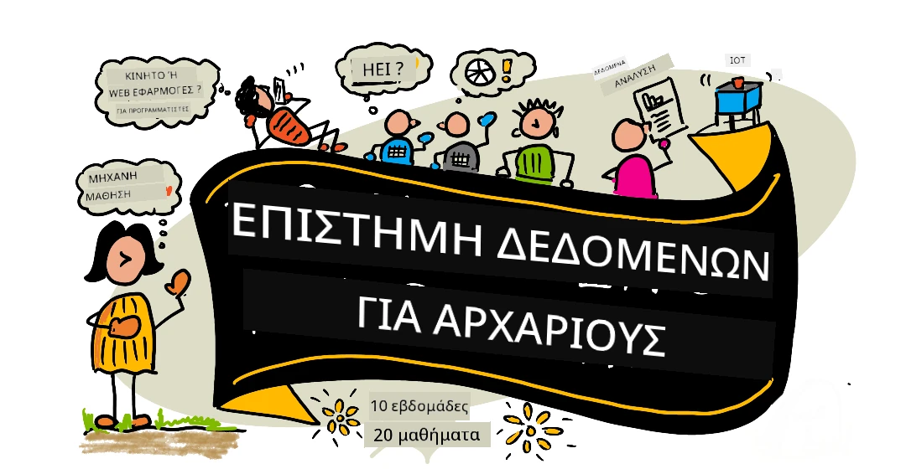
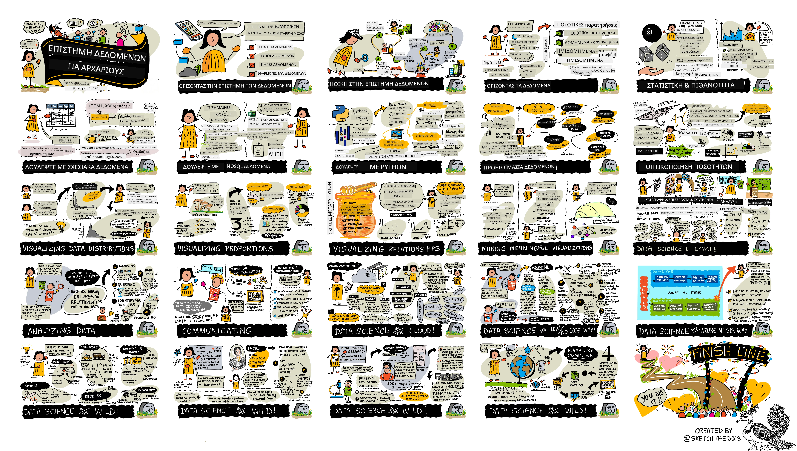

# Επιστήμη Δεδομένων για Αρχάριους - Ένα Αναλυτικό Πρόγραμμα Σπουδών

[](https://github.com/codespaces/new?hide_repo_select=true&ref=main&repo=344191198)

[](https://github.com/microsoft/Data-Science-For-Beginners/blob/master/LICENSE)
[](https://GitHub.com/microsoft/Data-Science-For-Beginners/graphs/contributors/)
[](https://GitHub.com/microsoft/Data-Science-For-Beginners/issues/)
[](https://GitHub.com/microsoft/Data-Science-For-Beginners/pulls/)
[](http://makeapullrequest.com)

[](https://GitHub.com/microsoft/Data-Science-For-Beginners/watchers/)
[](https://GitHub.com/microsoft/Data-Science-For-Beginners/network/)
[](https://GitHub.com/microsoft/Data-Science-For-Beginners/stargazers/)


[](https://discord.gg/nTYy5BXMWG)

[](https://aka.ms/foundry/forum)

Οι Azure Cloud Advocates στη Microsoft είναι χαρούμενοι να προσφέρουν ένα πρόγραμμα σπουδών 10 εβδομάδων, 20 μαθημάτων, που αφορά την Επιστήμη Δεδομένων. Κάθε μάθημα περιλαμβάνει προ-μάθημα και μετα-μάθημα κουίζ, γραπτές οδηγίες για να ολοκληρώσετε το μάθημα, μια λύση και μια άσκηση. Η παιδαγωγική μας με επίκεντρο τα έργα σας επιτρέπει να μαθαίνετε δημιουργώντας, ένας αποδεδειγμένος τρόπος για να «εγκατασταθούν» νέες δεξιότητες.

**Ειλικρινείς ευχαριστίες στους συγγραφείς μας:** [Jasmine Greenaway](https://www.twitter.com/paladique), [Dmitry Soshnikov](http://soshnikov.com), [Nitya Narasimhan](https://twitter.com/nitya), [Jalen McGee](https://twitter.com/JalenMcG), [Jen Looper](https://twitter.com/jenlooper), [Maud Levy](https://twitter.com/maudstweets), [Tiffany Souterre](https://twitter.com/TiffanySouterre), [Christopher Harrison](https://www.twitter.com/geektrainer).

**🙏 Ιδιαίτερες ευχαριστίες 🙏 στους συγγραφείς, κριτές και συνεισφέροντες περιεχομένου [Πρεσβευτές Φοιτητών Microsoft](https://studentambassadors.microsoft.com/),** ειδικά στους Aaryan Arora, [Aditya Garg](https://github.com/AdityaGarg00), [Alondra Sanchez](https://www.linkedin.com/in/alondra-sanchez-molina/), [Ankita Singh](https://www.linkedin.com/in/ankitasingh007), [Anupam Mishra](https://www.linkedin.com/in/anupam--mishra/), [Arpita Das](https://www.linkedin.com/in/arpitadas01/), ChhailBihari Dubey, [Dibri Nsofor](https://www.linkedin.com/in/dibrinsofor), [Dishita Bhasin](https://www.linkedin.com/in/dishita-bhasin-7065281bb), [Majd Safi](https://www.linkedin.com/in/majd-s/), [Max Blum](https://www.linkedin.com/in/max-blum-6036a1186/), [Miguel Correa](https://www.linkedin.com/in/miguelmque/), [Mohamma Iftekher (Iftu) Ebne Jalal](https://twitter.com/iftu119), [Nawrin Tabassum](https://www.linkedin.com/in/nawrin-tabassum), [Raymond Wangsa Putra](https://www.linkedin.com/in/raymond-wp/), [Rohit Yadav](https://www.linkedin.com/in/rty2423), Samridhi Sharma, [Sanya Sinha](https://www.linkedin.com/mwlite/in/sanya-sinha-13aab1200),
[Sheena Narula](https://www.linkedin.com/in/sheena-narua-n/), [Tauqeer Ahmad](https://www.linkedin.com/in/tauqeerahmad5201/), Yogendrasingh Pawar , [Vidushi Gupta](https://www.linkedin.com/in/vidushi-gupta07/), [Jasleen Sondhi](https://www.linkedin.com/in/jasleen-sondhi/)

||
|:---:|
| Επιστήμη Δεδομένων για Αρχάριους - _Συντομογραφία από [@nitya](https://twitter.com/nitya)_ |

### 🌐 Υποστήριξη Πολλών Γλωσσών

#### Υποστηρίζεται μέσω GitHub Action (Αυτοματοποιημένο & Πάντα Ενημερωμένο)

<!-- CO-OP TRANSLATOR LANGUAGES TABLE START -->
[Αραβικά](../ar/README.md) | [Μπενγκάλι](../bn/README.md) | [Βουλγαρικά](../bg/README.md) | [Βιρμανικά (Μιανμάρ)](../my/README.md) | [Κινέζικα (Απλοποιημένα)](../zh-CN/README.md) | [Κινέζικα (Παραδοσιακά, Χονγκ Κονγκ)](../zh-HK/README.md) | [Κινέζικα (Παραδοσιακά, Μακάου)](../zh-MO/README.md) | [Κινέζικα (Παραδοσιακά, Ταϊβάν)](../zh-TW/README.md) | [Κροατικά](../hr/README.md) | [Τσέχικα](../cs/README.md) | [Δανέζικα](../da/README.md) | [Ολλανδικά](../nl/README.md) | [Εσθονικά](../et/README.md) | [Φινλανδικά](../fi/README.md) | [Γαλλικά](../fr/README.md) | [Γερμανικά](../de/README.md) | [Ελληνικά](./README.md) | [Εβραϊκά](../he/README.md) | [Χίντι](../hi/README.md) | [Ουγγρικά](../hu/README.md) | [Ινδονησιακά](../id/README.md) | [Ιταλικά](../it/README.md) | [Ιαπωνικά](../ja/README.md) | [Κανάντα](../kn/README.md) | [Χμερ](../km/README.md) | [Κορεατικά](../ko/README.md) | [Λιθουανικά](../lt/README.md) | [Μαλάι](../ms/README.md) | [Μαλαγιαλάμ](../ml/README.md) | [Μαραθί](../mr/README.md) | [Νεπαλικά](../ne/README.md) | [Νιγηριανά Πίνγκιν](../pcm/README.md) | [Νορβηγικά](../no/README.md) | [Περσικά (Φαρσί)](../fa/README.md) | [Πολωνικά](../pl/README.md) | [Πορτογαλικά (Βραζιλία)](../pt-BR/README.md) | [Πορτογαλικά (Πορτογαλία)](../pt-PT/README.md) | [Πουντζάμπι (Γκουρμούκι)](../pa/README.md) | [Ρουμανικά](../ro/README.md) | [Ρωσικά](../ru/README.md) | [Σερβικά (Κυριλλική)](../sr/README.md) | [Σλοβακικά](../sk/README.md) | [Σλοβενικά](../sl/README.md) | [Ισπανικά](../es/README.md) | [Σουαχίλι](../sw/README.md) | [Σουηδικά](../sv/README.md) | [Ταγκαλόγκ (Φιλιππινέζικα)](../tl/README.md) | [Ταμίλ](../ta/README.md) | [Τελούγκου](../te/README.md) | [Ταϊλανδικά](../th/README.md) | [Τουρκικά](../tr/README.md) | [Ουκρανικά](../uk/README.md) | [Ουρντού](../ur/README.md) | [Βιετναμέζικα](../vi/README.md)

> **Προτιμάτε να κάνετε κλωνοποίηση τοπικά;**
>
> Αυτό το αποθετήριο περιλαμβάνει πάνω από 50 μεταφράσεις γλωσσών, γεγονός που αυξάνει σημαντικά το μέγεθος λήψης. Για να κλωνοποιήσετε χωρίς τις μεταφράσεις, χρησιμοποιήστε το sparse checkout:
>
> **Bash / macOS / Linux:**
> ```bash
> git clone --filter=blob:none --sparse https://github.com/microsoft/Data-Science-For-Beginners.git
> cd Data-Science-For-Beginners
> git sparse-checkout set --no-cone '/*' '!translations' '!translated_images'
> ```
>
> **CMD (Windows):**
> ```cmd
> git clone --filter=blob:none --sparse https://github.com/microsoft/Data-Science-For-Beginners.git
> cd Data-Science-For-Beginners
> git sparse-checkout set --no-cone "/*" "!translations" "!translated_images"
> ```
>
> Αυτό σας παρέχει ό,τι χρειάζεται για να ολοκληρώσετε το μάθημα με πολύ πιο γρήγορη λήψη.
<!-- CO-OP TRANSLATOR LANGUAGES TABLE END -->

**Αν θέλετε να υποστηριχθούν πρόσθετες γλώσσες μετάφρασης, αυτές αναγράφονται [εδώ](https://github.com/Azure/co-op-translator/blob/main/getting_started/supported-languages.md)**

#### Ενταχθείτε στην Κοινότητά μας  
[](https://discord.gg/nTYy5BXMWG)

Διεξάγουμε μια σειρά Discord για μάθηση με AI, μάθετε περισσότερα και συμμετέχετε στο [Learn with AI Series](https://aka.ms/learnwithai/discord) από 18 έως 30 Σεπτεμβρίου 2025. Θα λάβετε συμβουλές και κόλπα για τη χρήση του GitHub Copilot για Επιστήμη Δεδομένων.


# Είσαι φοιτητής;

Ξεκίνα με τους ακόλουθους πόρους:

- [Σελίδα Κέντρου Φοιτητών](https://docs.microsoft.com/en-gb/learn/student-hub?WT.mc_id=academic-77958-bethanycheum) Σε αυτή τη σελίδα, θα βρεις πόρους για αρχάριους, πακέτα φοιτητών και ακόμη και τρόπους να αποκτήσεις έναν δωρεάν κουπόνι πιστοποίησης. Είναι μια σελίδα που θέλεις να αποθηκεύσεις και να ελέγχεις περιοδικά καθώς ανανεώνουμε το περιεχόμενο τουλάχιστον μηνιαίως.
- [Microsoft Learn Student Ambassadors](https://studentambassadors.microsoft.com?WT.mc_id=academic-77958-bethanycheum) Εντάξου σε μια παγκόσμια κοινότητα φοιτητών-πρεσβευτών, αυτό θα μπορούσε να είναι ο τρόπος σου για να μπεις στη Microsoft.

# Ξεκινώντας

## 📚 Τεκμηρίωση

- **[Οδηγός Εγκατάστασης](INSTALLATION.md)** - Οδηγίες βήμα προς βήμα για αρχάριους
- **[Οδηγός Χρήσης](USAGE.md)** - Παραδείγματα και συνηθισμένες ροές εργασίας
- **[Αντιμετώπιση Προβλημάτων](TROUBLESHOOTING.md)** - Λύσεις σε συνηθισμένα ζητήματα
- **[Οδηγός Συνεισφοράς](CONTRIBUTING.md)** - Πώς να συνεισφέρετε σε αυτό το έργο
- **[Για Εκπαιδευτικούς](for-teachers.md)** - Καθοδήγηση διδασκαλίας και πόροι για την τάξη

## 👨‍🎓 Για Φοιτητές
> **Απόλυτοι Αρχάριοι**: Νέοι στην επιστήμη δεδομένων; Ξεκινήστε με τα [φιλικά προς αρχάριους παραδείγματα](examples/README.md)! Αυτά τα απλά, καλά σχολιασμένα παραδείγματα θα σας βοηθήσουν να κατανοήσετε τα βασικά πριν βουτήξετε ολόκληρο το πρόγραμμα σπουδών.
> **[Φοιτητές](https://aka.ms/student-page)**: για να χρησιμοποιήσετε αυτό το πρόγραμμα σπουδών μόνοι σας, κάντε fork ολόκληρου του αποθετηρίου και ολοκληρώστε τις ασκήσεις μόνοι, ξεκινώντας με ένα προ-διάλεξη κουίζ. Έπειτα διαβάστε τη διάλεξη και ολοκληρώστε τις υπόλοιπες δραστηριότητες. Προσπαθήστε να δημιουργήσετε τα έργα κατανοώντας τα μαθήματα αντί να αντιγράφετε τον κώδικα λύσης· ωστόσο, αυτός ο κώδικας είναι διαθέσιμος στους φακέλους /solutions σε κάθε μάθημα προσανατολισμένο σε έργο. Μια άλλη ιδέα είναι να σχηματίσετε μια ομάδα μελέτης με φίλους και να περάσετε μαζί το περιεχόμενο. Για περαιτέρω μελέτη, προτείνουμε το [Microsoft Learn](https://docs.microsoft.com/en-us/users/jenlooper-2911/collections/qprpajyoy3x0g7?WT.mc_id=academic-77958-bethanycheum).

**Γρήγορη εκκίνηση:**
1. Δείτε τον [Οδηγό Εγκατάστασης](INSTALLATION.md) για να ρυθμίσετε το περιβάλλον σας
2. Εξετάστε τον [Οδηγό Χρήσης](USAGE.md) για να μάθετε πώς να δουλεύετε με το πρόγραμμα σπουδών
3. Ξεκινήστε με το Μάθημα 1 και προχωρήστε διαδοχικά
4. Ενταχθείτε στην [κοινότητα Discord](https://aka.ms/ds4beginners/discord) για υποστήριξη

## 👩‍🏫 Για Εκπαιδευτικούς
> **Καθηγητές**: έχουμε [συμπεριλάβει μερικές προτάσεις](for-teachers.md) για το πώς να χρησιμοποιήσετε αυτό το πρόγραμμα σπουδών. Θα θέλαμε τα σχόλιά σας [στο φόρουμ συζητήσεών μας](https://github.com/microsoft/Data-Science-For-Beginners/discussions)!

## Γνωρίστε την Ομάδα

[](https://youtu.be/8mzavjQSMM4 "Βίντεο προώθησης")

**Gif από** [Mohit Jaisal](https://www.linkedin.com/in/mohitjaisal)

> 🎥 Κάντε κλικ στην παραπάνω εικόνα για ένα βίντεο σχετικά με το έργο και τους ανθρώπους που το δημιούργησαν!

## Παιδαγωγική

Έχουμε επιλέξει δύο παιδαγωγικές αρχές κατά την κατασκευή αυτού του προγράμματος σπουδών: να βασίζεται σε έργα και να περιλαμβάνει συχνά κουίζ. Μέχρι το τέλος αυτής της σειράς, οι μαθητές θα έχουν μάθει βασικές αρχές της επιστήμης των δεδομένων, συμπεριλαμβανομένων ηθικών εννοιών, προετοιμασίας δεδομένων, διαφορετικών τρόπων εργασίας με δεδομένα, οπτικοποίησης δεδομένων, ανάλυσης δεδομένων, πραγματικών εφαρμογών της επιστήμης των δεδομένων και άλλα.

Επιπλέον, ένα κουίζ χαμηλής σημασίας πριν από το μάθημα θέτει την πρόθεση του μαθητή προς τη μάθηση ενός θέματος, ενώ ένα δεύτερο κουίζ μετά το μάθημα διασφαλίζει περαιτέρω διατήρηση. Αυτό το πρόγραμμα σπουδών σχεδιάστηκε να είναι ευέλικτο και διασκεδαστικό και μπορεί να ακολουθηθεί ολόκληρο ή εν μέρει. Τα έργα ξεκινούν μικρά και γίνονται όλο και πιο περίπλοκα μέχρι το τέλος του δεκαβδομαδιαίου κύκλου.

> Βρείτε τον [Κώδικα Συμπεριφοράς](CODE_OF_CONDUCT.md), [Οδηγίες Συμβολής](CONTRIBUTING.md), [Μετάφρασης](TRANSLATIONS.md). Καλωσορίζουμε τα εποικοδομητικά σχόλιά σας!

## Κάθε μάθημα περιλαμβάνει:

- Προαιρετικό σχηματικό σημείωμα
- Προαιρετικό συμπληρωματικό βίντεο
- Προκαταρκτικό κουίζ πριν το μάθημα
- Γραπτό μάθημα
- Για μαθήματα με βάση έργα, οδηγίες βήμα προς βήμα για την κατασκευή του έργου
- Έλεγχοι γνώσεων
- Μια πρόκληση
- Συμπληρωματική ανάγνωση
- Εργασία
- [Κουίζ μετά το μάθημα](https://ff-quizzes.netlify.app/en/)

> **Μία σημείωση σχετικά με τα κουίζ**: Όλα τα κουίζ βρίσκονται στο φάκελο Quiz-App, συνολικά 40 κουίζ με τρεις ερωτήσεις το καθένα. Συνδέονται μέσα από τα μαθήματα, αλλά η εφαρμογή κουίζ μπορεί να τρέξει τοπικά ή να αναπτυχθεί στο Azure· ακολουθήστε τις οδηγίες στον φάκελο `quiz-app`. Σταδιακά το υλικό μεταφράζεται.

## 🎓 Παραδείγματα φιλικά προς αρχάριους

**Νέοι στην Επιστήμη Δεδομένων;** Έχουμε δημιουργήσει έναν ειδικό [φάκελο παραδειγμάτων](examples/README.md) με απλό, καλά σχολιασμένο κώδικα για να σας βοηθήσουμε να ξεκινήσετε:

- 🌟 **Hello World** - Το πρώτο σας πρόγραμμα επιστήμης δεδομένων
- 📂 **Φόρτωση Δεδομένων** - Μάθετε πώς να διαβάζετε και να εξερευνάτε σύνολα δεδομένων
- 📊 **Απλή Ανάλυση** - Υπολογίστε στατιστικά και εντοπίστε μοτίβα
- 📈 **Βασική Οπτικοποίηση** - Δημιουργήστε διαγράμματα και γραφήματα
- 🔬 **Πραγματικό Έργο** - Ολοκληρωμένη ροή εργασίας από την αρχή ως το τέλος

Κάθε παράδειγμα περιλαμβάνει λεπτομερή σχόλια που εξηγούν κάθε βήμα, κάνοντάς το ιδανικό για απόλυτους αρχάριους!

👉 **[Ξεκινήστε με τα παραδείγματα](examples/README.md)** 👈

## Μαθήματα


||
|:---:|
| Επιστήμη Δεδομένων για Αρχάριους: Χάρτης πορείας - _Σχηματικό σημείωμα από [@nitya](https://twitter.com/nitya)_ |


| Αριθμός Μαθήματος | Θέμα | Ομαδοποίηση Μαθήματος | Στόχοι Μάθησης | Συνδεδεμένο Μάθημα | Συγγραφέας |
| :-----------: | :----------------------------------------: | :--------------------------------------------------: | :-----------------------------------------------------------------------------------------------------------------------------------------------------------------------: | :---------------------------------------------------------------------: | :----: |
| 01 | Ορισμός της Επιστήμης Δεδομένων | [Εισαγωγή](1-Introduction/README.md) | Μάθετε τις βασικές έννοιες πίσω από την επιστήμη των δεδομένων και τη σχέση της με την τεχνητή νοημοσύνη, τη μηχανική μάθηση και τα μεγάλα δεδομένα. | [μάθημα](1-Introduction/01-defining-data-science/README.md) [βίντεο](https://youtu.be/beZ7Mb_oz9I) | [Dmitry](http://soshnikov.com) |
| 02 | Ηθική στην Επιστήμη Δεδομένων | [Εισαγωγή](1-Introduction/README.md) | Έννοιες Ηθικής Δεδομένων, Προκλήσεις και Πλαίσια. | [μάθημα](1-Introduction/02-ethics/README.md) | [Nitya](https://twitter.com/nitya) |
| 03 | Ορισμός των Δεδομένων | [Εισαγωγή](1-Introduction/README.md) | Πώς κατατάσσονται τα δεδομένα και οι κοινές πηγές τους. | [μάθημα](1-Introduction/03-defining-data/README.md) | [Jasmine](https://www.twitter.com/paladique) |
| 04 | Εισαγωγή στη Στατιστική & Πιθανότητες | [Εισαγωγή](1-Introduction/README.md) | Οι μαθηματικές τεχνικές πιθανοτήτων και στατιστικής για την κατανόηση των δεδομένων. | [μάθημα](1-Introduction/04-stats-and-probability/README.md) [βίντεο](https://youtu.be/Z5Zy85g4Yjw) | [Dmitry](http://soshnikov.com) |
| 05 | Εργασία με Σχεσιακά Δεδομένα | [Εργασία με Δεδομένα](2-Working-With-Data/README.md) | Εισαγωγή σε σχεσιακά δεδομένα και βασικά του εξερεύνησης και ανάλυσης τους με τη Γλώσσα Δομημένων Ερωτημάτων, γνωστή και ως SQL (προφέρεται "σι-κουελ"). | [μάθημα](2-Working-With-Data/05-relational-databases/README.md) | [Christopher](https://www.twitter.com/geektrainer) | | |
| 06 | Εργασία με NoSQL Δεδομένα | [Εργασία με Δεδομένα](2-Working-With-Data/README.md) | Εισαγωγή σε μη σχεσιακά δεδομένα, στους διάφορους τύπους και τις βασικές έννοιες εξερεύνησης και ανάλυσης βάσεων δεδομένων εγγράφων. | [μάθημα](2-Working-With-Data/06-non-relational/README.md) | [Jasmine](https://twitter.com/paladique)|
| 07 | Εργασία με Python | [Εργασία με Δεδομένα](2-Working-With-Data/README.md) | Βασικά στοιχεία χρήσης της Python για εξερεύνηση δεδομένων με βιβλιοθήκες όπως η Pandas. Συνιστάται βασική κατανόηση προγραμματισμού σε Python. | [μάθημα](2-Working-With-Data/07-python/README.md) [βίντεο](https://youtu.be/dZjWOGbsN4Y) | [Dmitry](http://soshnikov.com) |
| 08 | Προετοιμασία Δεδομένων | [Εργασία με Δεδομένα](2-Working-With-Data/README.md) | Θέματα τεχνικών καθαρισμού και μετασχηματισμού δεδομένων για την αντιμετώπιση προκλήσεων όπως τα ελλιπή, ανακριβή ή ατελή δεδομένα. | [μάθημα](2-Working-With-Data/08-data-preparation/README.md) | [Jasmine](https://www.twitter.com/paladique) |
| 09 | Οπτικοποίηση Ποσοτήτων | [Οπτικοποίηση Δεδομένων](3-Data-Visualization/README.md) | Μάθετε πώς να χρησιμοποιείτε το Matplotlib για να οπτικοποιήσετε δεδομένα πουλιών 🦆 | [μάθημα](3-Data-Visualization/09-visualization-quantities/README.md) | [Jen](https://twitter.com/jenlooper) |
| 10 | Οπτικοποίηση Κατανομών Δεδομένων | [Οπτικοποίηση Δεδομένων](3-Data-Visualization/README.md) | Οπτικοποίηση παρατηρήσεων και τάσεων εντός ενός διαστήματος. | [μάθημα](3-Data-Visualization/10-visualization-distributions/README.md) | [Jen](https://twitter.com/jenlooper) |
| 11 | Οπτικοποίηση Αναλογιών | [Οπτικοποίηση Δεδομένων](3-Data-Visualization/README.md) | Οπτικοποίηση διακριτών και ομαδοποιημένων ποσοστών. | [μάθημα](3-Data-Visualization/11-visualization-proportions/README.md) | [Jen](https://twitter.com/jenlooper) |
| 12 | Οπτικοποίηση Συσχετίσεων | [Οπτικοποίηση Δεδομένων](3-Data-Visualization/README.md) | Οπτικοποίηση συνδέσεων και συσχετισμών μεταξύ συνόλων δεδομένων και των μεταβλητών τους. | [μάθημα](3-Data-Visualization/12-visualization-relationships/README.md) | [Jen](https://twitter.com/jenlooper) |
| 13 | Σημαντικές Οπτικοποιήσεις | [Οπτικοποίηση Δεδομένων](3-Data-Visualization/README.md) | Τεχνικές και καθοδήγηση για να κάνετε τις οπτικοποιήσεις σας πολύτιμες για αποτελεσματική επίλυση προβλημάτων και ανάλυση. | [μάθημα](3-Data-Visualization/13-meaningful-visualizations/README.md) | [Jen](https://twitter.com/jenlooper) |
| 14 | Εισαγωγή στον Κύκλο Ζωής της Επιστήμης Δεδομένων | [Κύκλος Ζωής](4-Data-Science-Lifecycle/README.md) | Εισαγωγή στον κύκλο ζωής της επιστήμης δεδομένων και το πρώτο του βήμα της απόκτησης και εξαγωγής δεδομένων. | [μάθημα](4-Data-Science-Lifecycle/14-Introduction/README.md) | [Jasmine](https://twitter.com/paladique) |
| 15 | Ανάλυση | [Κύκλος Ζωής](4-Data-Science-Lifecycle/README.md) | Αυτή η φάση του κύκλου ζωής της επιστήμης δεδομένων εστιάζει σε τεχνικές ανάλυσης δεδομένων. | [μάθημα](4-Data-Science-Lifecycle/15-analyzing/README.md) | [Jasmine](https://twitter.com/paladique) | | |
| 16 | Επικοινωνία | [Κύκλος Ζωής](4-Data-Science-Lifecycle/README.md) | Αυτή η φάση του κύκλου ζωής της επιστήμης δεδομένων εστιάζει στην παρουσίαση των συμπερασμάτων από τα δεδομένα με τρόπο που διευκολύνει την κατανόηση από τους υπεύθυνους λήψης αποφάσεων. | [μάθημα](4-Data-Science-Lifecycle/16-communication/README.md) | [Jalen](https://twitter.com/JalenMcG) | | |
| 17 | Επιστήμη Δεδομένων στο Νέφος | [Δεδομένα Νέφους](5-Data-Science-In-Cloud/README.md) | Αυτή η σειρά μαθημάτων εισάγει την επιστήμη δεδομένων στο νέφος και τα οφέλη της. | [μάθημα](5-Data-Science-In-Cloud/17-Introduction/README.md) | [Tiffany](https://twitter.com/TiffanySouterre) και [Maud](https://twitter.com/maudstweets) |
| 18 | Επιστήμη Δεδομένων στο Νέφος | [Δεδομένα Νέφους](5-Data-Science-In-Cloud/README.md) | Εκπαίδευση μοντέλων χρησιμοποιώντας εργαλεία Low Code. |[μάθημα](5-Data-Science-In-Cloud/18-Low-Code/README.md) | [Tiffany](https://twitter.com/TiffanySouterre) και [Maud](https://twitter.com/maudstweets) |
| 19 | Επιστήμη Δεδομένων στο Νέφος | [Δεδομένα Νέφους](5-Data-Science-In-Cloud/README.md) | Ανάπτυξη μοντέλων με το Azure Machine Learning Studio. | [μάθημα](5-Data-Science-In-Cloud/19-Azure/README.md)| [Tiffany](https://twitter.com/TiffanySouterre) και [Maud](https://twitter.com/maudstweets) |
| 20 | Επιστήμη Δεδομένων στην Πράξη | [Πράξη](6-Data-Science-In-Wild/README.md) | Έργα επιστήμης δεδομένων στον πραγματικό κόσμο. | [μάθημα](6-Data-Science-In-Wild/20-Real-World-Examples/README.md) | [Nitya](https://twitter.com/nitya) |

## GitHub Codespaces

Ακολουθήστε αυτά τα βήματα για να ανοίξετε αυτό το δείγμα σε ένα Codespace:
1. Κάντε κλικ στο μενού "Code" και επιλέξτε την επιλογή "Open with Codespaces".
2. Επιλέξτε + New codespace στο κάτω μέρος του παραθύρου.
Για περισσότερες πληροφορίες, δείτε την [τεκμηρίωση GitHub](https://docs.github.com/en/codespaces/developing-in-codespaces/creating-a-codespace-for-a-repository#creating-a-codespace).

## VSCode Remote - Containers
Ακολουθήστε αυτά τα βήματα για να ανοίξετε αυτό το αποθετήριο μέσα σε container χρησιμοποιώντας τον τοπικό υπολογιστή σας και το VSCode με την επέκταση VS Code Remote - Containers:

1. Εάν χρησιμοποιείτε για πρώτη φορά ένα container ανάπτυξης, βεβαιωθείτε ότι το σύστημά σας πληροί τις προϋποθέσεις (δηλαδή έχει εγκατασταθεί Docker) σύμφωνα με [την τεκμηρίωση για να ξεκινήσετε](https://code.visualstudio.com/docs/devcontainers/containers#_getting-started).

Για να χρησιμοποιήσετε αυτό το αποθετήριο, μπορείτε να το ανοίξετε είτε σε απομονωμένο όγκο Docker:

**Σημείωση**: Κάτω από την επιφάνεια, αυτό θα χρησιμοποιήσει την εντολή Remote-Containers: **Clone Repository in Container Volume...** για να κλωνοποιήσει τον πηγαίο κώδικα σε όγκο Docker αντί του τοπικού συστήματος αρχείων. [Οι όγκοι](https://docs.docker.com/storage/volumes/) είναι ο προτιμώμενος μηχανισμός για τη διατήρηση δεδομένων container.

Ή να ανοίξετε μια τοπικά κλωνοποιημένη ή ληφθείσα έκδοση του αποθετηρίου:

- Κλωνοποιήστε αυτό το αποθετήριο στο τοπικό σας σύστημα αρχείων.
- Πατήστε F1 και επιλέξτε την εντολή **Remote-Containers: Open Folder in Container...**.
- Επιλέξτε το κλωνοποιημένο αντίγραφο αυτού του φακέλου, περιμένετε να ξεκινήσει το container και δοκιμάστε.

## Πρόσβαση εκτός σύνδεσης

Μπορείτε να εκτελέσετε αυτή την τεκμηρίωση εκτός σύνδεσης χρησιμοποιώντας το [Docsify](https://docsify.js.org/#/). Κάντε fork αυτό το αποθετήριο, [εγκαταστήστε το Docsify](https://docsify.js.org/#/quickstart) τοπικά και, στη ριζική διαδρομή αυτού του αποθετηρίου, πληκτρολογήστε `docsify serve`. Ο ιστότοπος θα σερβιριστεί στην πόρτα 3000 στο localhost σας: `localhost:3000`.

> Σημείωση, τα notebooks δεν θα αποδίδονται μέσω Docsify, οπότε όταν χρειάζεστε να εκτελέσετε ένα notebook, κάντε το ξεχωριστά στο VS Code με ενεργό πυρήνα Python.

## Άλλα Προγράμματα Σπουδών

Η ομάδα μας παράγει και άλλα προγράμματα σπουδών! Δείτε:

<!-- CO-OP TRANSLATOR OTHER COURSES START -->
### LangChain
[](https://aka.ms/langchain4j-for-beginners)
[](https://aka.ms/langchainjs-for-beginners?WT.mc_id=m365-94501-dwahlin)
[](https://github.com/microsoft/langchain-for-beginners?WT.mc_id=m365-94501-dwahlin)
---

### Azure / Edge / MCP / Agents
[](https://github.com/microsoft/AZD-for-beginners?WT.mc_id=academic-105485-koreyst)
[](https://github.com/microsoft/edgeai-for-beginners?WT.mc_id=academic-105485-koreyst)
[](https://github.com/microsoft/mcp-for-beginners?WT.mc_id=academic-105485-koreyst)
[](https://github.com/microsoft/ai-agents-for-beginners?WT.mc_id=academic-105485-koreyst)

---
 
### Σειρά Δημιουργικής Τεχνητής Νοημοσύνης
[](https://github.com/microsoft/generative-ai-for-beginners?WT.mc_id=academic-105485-koreyst)
[-9333EA?style=for-the-badge&labelColor=E5E7EB&color=9333EA)](https://github.com/microsoft/Generative-AI-for-beginners-dotnet?WT.mc_id=academic-105485-koreyst)
[-C084FC?style=for-the-badge&labelColor=E5E7EB&color=C084FC)](https://github.com/microsoft/generative-ai-for-beginners-java?WT.mc_id=academic-105485-koreyst)
[-E879F9?style=for-the-badge&labelColor=E5E7EB&color=E879F9)](https://github.com/microsoft/generative-ai-with-javascript?WT.mc_id=academic-105485-koreyst)

---
 
### Βασική Μάθηση
[](https://aka.ms/ml-beginners?WT.mc_id=academic-105485-koreyst)
[](https://aka.ms/datascience-beginners?WT.mc_id=academic-105485-koreyst)
[](https://aka.ms/ai-beginners?WT.mc_id=academic-105485-koreyst)
[](https://github.com/microsoft/Security-101?WT.mc_id=academic-96948-sayoung)
[](https://aka.ms/webdev-beginners?WT.mc_id=academic-105485-koreyst)
[](https://aka.ms/iot-beginners?WT.mc_id=academic-105485-koreyst)
[](https://github.com/microsoft/xr-development-for-beginners?WT.mc_id=academic-105485-koreyst)

---
 
### Σειρά Copilot
[](https://aka.ms/GitHubCopilotAI?WT.mc_id=academic-105485-koreyst)
[](https://github.com/microsoft/mastering-github-copilot-for-dotnet-csharp-developers?WT.mc_id=academic-105485-koreyst)
[](https://github.com/microsoft/CopilotAdventures?WT.mc_id=academic-105485-koreyst)
<!-- CO-OP TRANSLATOR OTHER COURSES END -->

## Λήψη Βοήθειας

**Αντιμετωπίζετε προβλήματα;** Ελέγξτε τον [Οδηγό Αντιμετώπισης Προβλημάτων](TROUBLESHOOTING.md) για λύσεις σε συνηθισμένα ζητήματα.

Εάν κολλήσετε ή έχετε οποιεσδήποτε ερωτήσεις σχετικά με την ανάπτυξη εφαρμογών AI. Συμμετέχετε μαζί με άλλους μαθητές και έμπειρους προγραμματιστές σε συζητήσεις για το MCP. Είναι μια υποστηρικτική κοινότητα όπου οι ερωτήσεις είναι καλοδεχούμενες και η γνώση μοιράζεται ελεύθερα.

[](https://discord.gg/nTYy5BXMWG)

Εάν έχετε σχόλια προϊόντος ή σφάλματα κατά την ανάπτυξη επισκεφτείτε:

[](https://aka.ms/foundry/forum)

---

<!-- CO-OP TRANSLATOR DISCLAIMER START -->
**Αποποίηση Ευθυνών**:  
Αυτό το έγγραφο έχει μεταφραστεί χρησιμοποιώντας την υπηρεσία αυτόματης μετάφρασης [Co-op Translator](https://github.com/Azure/co-op-translator). Παρόλο που προσπαθούμε για ακρίβεια, παρακαλούμε να γνωρίζετε ότι οι αυτοματοποιημένες μεταφράσεις μπορεί να περιέχουν λάθη ή ανακρίβειες. Το πρωτότυπο έγγραφο στη μητρική του γλώσσα πρέπει να θεωρείται η επίσημη πηγή. Για κρίσιμες πληροφορίες, συνιστάται επαγγελματική ανθρώπινη μετάφραση. Δεν φέρουμε ευθύνη για οποιεσδήποτε παρεξηγήσεις ή λανθασμένες ερμηνείες προκύψουν από τη χρήση αυτής της μετάφρασης.
<!-- CO-OP TRANSLATOR DISCLAIMER END -->