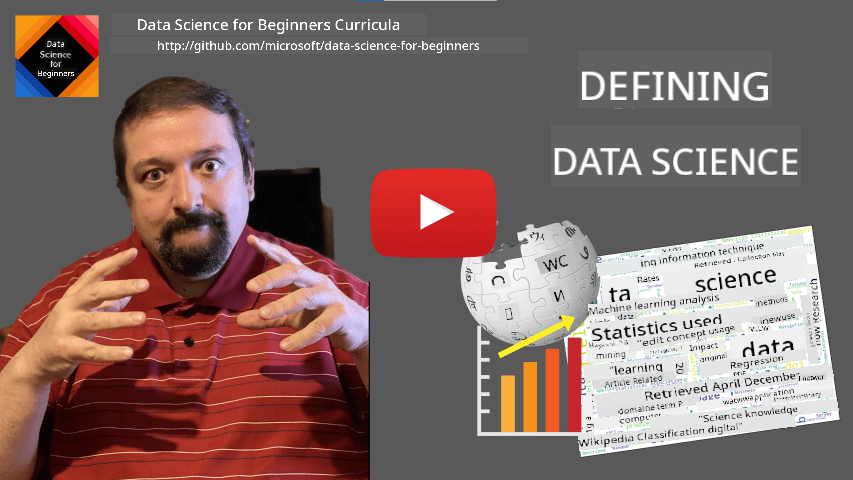

<!--
CO_OP_TRANSLATOR_METADATA:
{
  "original_hash": "43212cc1ac137b7bb1dcfb37ca06b0f4",
  "translation_date": "2025-10-25T18:32:23+00:00",
  "source_file": "1-Introduction/01-defining-data-science/README.md",
  "language_code": "en"
}
-->
# Defining Data Science

|  ](../../sketchnotes/01-Definitions.png) |
| :----------------------------------------------------------------------------------------------------: |
|              Defining Data Science - _Sketchnote by [@nitya](https://twitter.com/nitya)_               |

---

## [Pre-lecture quiz](https://ff-quizzes.netlify.app/en/ds/quiz/0)

## What is Data?
In our daily lives, we are constantly surrounded by data. The text you are reading right now is data. The list of your friends' phone numbers stored in your smartphone is data, as well as the current time displayed on your watch. As humans, we naturally interact with data, whether it's counting money or writing letters to friends.

However, data became significantly more important with the advent of computers. The primary function of computers is to perform computations, but they require data to operate. Therefore, it's essential to understand how computers store and process data.

With the rise of the Internet, the role of computers as tools for handling data has grown exponentially. If you think about it, we now use computers more for data processing and communication than for actual computations. Writing an email to a friend or searching for information online essentially involves creating, storing, transmitting, and manipulating data.
> Can you recall the last time you used a computer to actually perform a calculation?

## What is Data Science?

According to [Wikipedia](https://en.wikipedia.org/wiki/Data_science), **Data Science** is defined as *a scientific field that uses scientific methods to extract knowledge and insights from structured and unstructured data, and apply knowledge and actionable insights from data across a broad range of application domains*. 

This definition emphasizes several key aspects of data science:

* The primary goal of data science is to **extract knowledge** from data, which means understanding the data, uncovering hidden relationships, and building a **model**.
* Data science employs **scientific methods**, such as probability and statistics. When the term *data science* was first introduced, some argued it was merely a new, trendy name for statistics. Today, it's clear that the field encompasses much more.
* The knowledge gained should lead to **actionable insights**, which are practical insights that can be applied to real-world business scenarios.
* Data scientists must work with both **structured** and **unstructured** data. We'll explore these different types of data later in the course.
* The **application domain** is crucial, as data scientists often need some level of expertise in the specific field they are working in, such as finance, medicine, or marketing.

> Another important aspect of Data Science is studying how data can be collected, stored, and processed using computers. While statistics provide the mathematical foundation, data science applies these concepts to extract insights from data.

One perspective (attributed to [Jim Gray](https://en.wikipedia.org/wiki/Jim_Gray_(computer_scientist))) is to view data science as a distinct paradigm of science:
* **Empirical**, relying primarily on observations and experimental results
* **Theoretical**, where new concepts are derived from existing scientific knowledge
* **Computational**, discovering new principles through computational experiments
* **Data-Driven**, focusing on uncovering relationships and patterns within data  

## Other Related Fields

Since data is everywhere, data science is a broad field that intersects with many other disciplines.

<dl>
<dt>Databases</dt>
<dd>
A key consideration is <b>how to store</b> data, i.e., structuring it for efficient processing. There are various types of databases for storing structured and unstructured data, which <a href="../../2-Working-With-Data/README.md">we will explore in our course</a>.
</dd>
<dt>Big Data</dt>
<dd>
Sometimes, we need to store and process massive amounts of data with relatively simple structures. Special tools and approaches are used to store this data in a distributed manner across computer clusters and process it efficiently.
</dd>
<dt>Machine Learning</dt>
<dd>
One way to understand data is by <b>building a model</b> that can predict desired outcomes. Developing models from data is known as <b>machine learning</b>. You can explore our <a href="https://aka.ms/ml-beginners">Machine Learning for Beginners</a> Curriculum to learn more.
</dd>
<dt>Artificial Intelligence</dt>
<dd>
A branch of machine learning, artificial intelligence (AI), also relies on data. It involves creating complex models that mimic human thought processes. AI methods often help transform unstructured data (e.g., natural language) into structured insights. 
</dd>
<dt>Visualization</dt>
<dd>
Large amounts of data can be overwhelming for humans, but effective visualizations can make the data more comprehensible and help draw conclusions. Knowing various visualization techniques is crucial, and we'll cover this in <a href="../../3-Data-Visualization/README.md">Section 3</a> of our course. Related fields include <b>Infographics</b> and <b>Human-Computer Interaction</b>.
</dd>
</dl>

## Types of Data

As mentioned earlier, data is everywhere. We just need to capture it effectively! It's helpful to differentiate between **structured** and **unstructured** data. Structured data is typically organized in a clear format, such as tables, while unstructured data consists of unorganized files. There's also **semi-structured** data, which has some level of organization but varies significantly.

| Structured                                                                   | Semi-structured                                                                                | Unstructured                            |
| ---------------------------------------------------------------------------- | ---------------------------------------------------------------------------------------------- | --------------------------------------- |
| List of people with their phone numbers                                      | Wikipedia pages with links                                                                     | Text of Encyclopedia Britannica        |
| Temperature in all rooms of a building at every minute for the last 20 years | Collection of scientific papers in JSON format with authors, date of publication, and abstract | File share with corporate documents     |
| Data for age and gender of all people entering the building                  | Internet pages                                                                                 | Raw video feed from surveillance camera |

## Where to get Data

There are countless sources of data, and listing them all would be impossible! However, here are some common places to find data:

* **Structured**
  - **Internet of Things** (IoT), including data from various sensors like temperature or pressure sensors, provides valuable data. For instance, IoT sensors in an office building can help optimize heating and lighting to reduce costs. 
  - **Surveys** conducted after a purchase or website visit can provide structured data.
  - **Behavior analysis** can help understand user engagement with a website, such as how far they navigate and why they leave.
* **Unstructured**
  - **Texts** can offer insights like overall **sentiment scores** or extracted keywords and semantic meanings.
  - **Images** or **Video**. Surveillance camera footage can be analyzed to estimate road traffic and inform drivers about potential congestion.
  - Web server **Logs** can reveal which pages on a website are most visited and for how long.
* Semi-structured
  - **Social Network** graphs can provide data about user behavior and their effectiveness in spreading information.
  - A collection of party photos can be analyzed to extract **Group Dynamics** data by mapping interactions between individuals in the images.

By understanding these data sources, you can brainstorm scenarios where data science techniques can be applied to gain insights and improve business processes.

## What you can do with Data

In Data Science, we focus on the following steps in the data journey:

<dl>
<dt>1) Data Acquisition</dt>
<dd>
The first step is collecting data. While this can be straightforward in some cases, such as data automatically entering a database from a web application, it can also require specialized techniques. For instance, data from IoT sensors can be overwhelming, so using buffering endpoints like IoT Hub to collect data before processing is a good practice.
</dd>
<dt>2) Data Storage</dt>
<dd>
Storing data can be challenging, especially when dealing with large datasets. When deciding how to store data, it's important to consider how you plan to query it in the future. There are several storage options:
<ul>
<li>A relational database organizes data into tables and uses SQL for querying. Tables are often grouped into schemas, and data may need to be converted to fit the schema.</li>
<li><a href="https://en.wikipedia.org/wiki/NoSQL">NoSQL</a> databases, such as <a href="https://azure.microsoft.com/services/cosmos-db/?WT.mc_id=academic-77958-bethanycheum">CosmosDB</a>, allow for storing complex data like hierarchical JSON documents or graphs without enforcing schemas. However, they lack the rich querying capabilities of SQL and do not enforce referential integrity.</li>
<li><a href="https://en.wikipedia.org/wiki/Data_lake">Data Lake</a> storage is used for large collections of raw, unstructured data. Data lakes are often paired with big data, where data is stored and processed across server clusters. <a href="https://en.wikipedia.org/wiki/Apache_Parquet">Parquet</a> is a common format used with big data.</li> 
</ul>
</dd>
<dt>3) Data Processing</dt>
<dd>
This is the most exciting part of the data journey, where data is transformed from its original form into a format suitable for visualization or model training. For unstructured data like text or images, AI techniques may be used to extract <b>features</b>, converting it into structured data.
</dd>
<dt>4) Visualization / Human Insights</dt>
<dd>
To understand data, visualization is often necessary. With a variety of visualization techniques available, we can find the best way to uncover insights. Data scientists frequently "play with data," creating multiple visualizations to identify relationships. Statistical methods can also be used to test hypotheses or establish correlations between data points.   
</dd>
<dt>5) Training a predictive model</dt>
<dd>
The ultimate goal of data science is to make informed decisions based on data. Using <a href="http://github.com/microsoft/ml-for-beginners">Machine Learning</a> techniques, we can build predictive models to make forecasts using new datasets with similar structures.
</dd>
</dl>

Of course, depending on the specific data, some steps may be skipped (e.g., if the data is already stored in a database or if model training isn't necessary), or some steps may be repeated multiple times (e.g., during data processing).

## Digitalization and Digital Transformation

Over the past decade, businesses have increasingly recognized the importance of data in decision-making. To apply data science principles to business operations, the first step is to collect data, which involves converting business processes into digital formats—a process known as **digitalization**. Using data science techniques on this data to inform decisions can lead to significant productivity improvements or even a complete business transformation, known as **digital transformation**.

Let's consider an example. Suppose we have an online data science course (like this one) and want to use data science to improve it. How can we achieve this?

We can start by asking, "What can be digitized?" The simplest approach might be to measure the time each student takes to complete each module and assess their knowledge through a multiple-choice test at the end of each module. By averaging the completion times across all students, we can identify which modules are the most challenging and work on simplifying them.
> You might argue that this approach isn't ideal, as modules can vary in length. It would likely be fairer to divide the time by the module's length (in terms of the number of characters) and compare those values instead.

When we begin analyzing the results of multiple-choice tests, we can attempt to identify the concepts that students struggle to understand and use that information to improve the content. To achieve this, we need to design tests so that each question corresponds to a specific concept or piece of knowledge.

If we want to delve deeper, we can plot the time taken for each module against the students' age categories. This might reveal that certain age groups take an excessively long time to complete the module or that students drop out before finishing it. Such insights can help us provide age recommendations for the module and reduce dissatisfaction caused by mismatched expectations.

## 🚀 Challenge

In this challenge, we will aim to identify concepts relevant to the field of Data Science by analyzing texts. We'll use a Wikipedia article on Data Science, download and process the text, and then create a word cloud like this one:

Check out [`notebook.ipynb`](../../../../1-Introduction/01-defining-data-science/notebook.ipynb ':ignore') to explore the code. You can also run the code and observe how it performs all the data transformations in real time.

> If you're unfamiliar with running code in a Jupyter Notebook, take a look at [this article](https://soshnikov.com/education/how-to-execute-notebooks-from-github/).

## [Post-lecture quiz](https://ff-quizzes.netlify.app/en/ds/quiz/1)

## Assignments

* **Task 1**: Modify the code above to identify related concepts for the fields of **Big Data** and **Machine Learning**.
* **Task 2**: [Think About Data Science Scenarios](assignment.md)

## Credits

This lesson was created with ♥️ by [Dmitry Soshnikov](http://soshnikov.com)

---

**Disclaimer**:  
This document has been translated using the AI translation service [Co-op Translator](https://github.com/Azure/co-op-translator). While we aim for accuracy, please note that automated translations may include errors or inaccuracies. The original document in its native language should be regarded as the authoritative source. For critical information, professional human translation is advised. We are not responsible for any misunderstandings or misinterpretations resulting from the use of this translation.