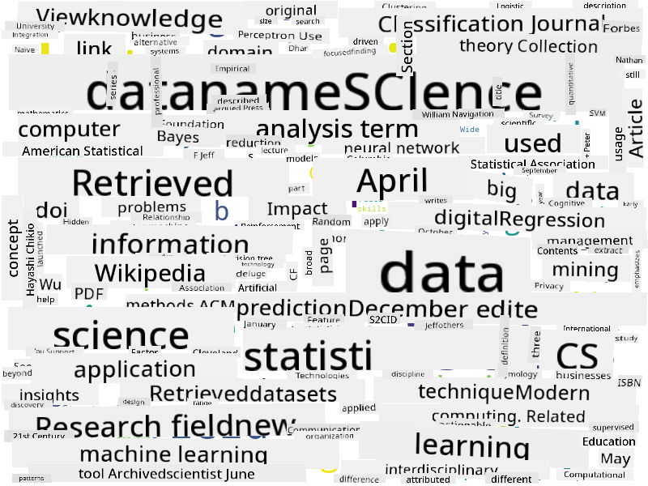

<!--
CO_OP_TRANSLATOR_METADATA:
{
  "original_hash": "8141e7195841682914be03ef930fe43d",
  "translation_date": "2025-09-03T19:56:26+00:00",
  "source_file": "1-Introduction/01-defining-data-science/README.md",
  "language_code": "en"
}
-->
Of course, we can go further. For example, we could analyze the test results to identify which specific questions are most often answered incorrectly. This could help us pinpoint areas where the material might need to be clarified or expanded. Additionally, we could track how students navigate through the course, such as which sections they revisit or skip, to better understand their learning patterns.

By collecting and analyzing this data, we can make informed decisions to improve the course structure, content, and delivery. This is a simple example of how digitalization (collecting data about the course) and digital transformation (using that data to improve the course) can work together to enhance outcomes.

## Summary

Data is everywhere, and its importance has grown significantly with the advent of computers and the Internet. Data science is the field that helps us extract knowledge and actionable insights from data, using scientific methods and computational tools. It operates on structured, semi-structured, and unstructured data, and spans a wide range of application domains.

Understanding the types of data, where to find it, and how to use it effectively is key to leveraging data science. By applying these principles, businesses and individuals can make better decisions, optimize processes, and even transform the way they operate.
You might argue that this approach isn't perfect, as modules can vary in length. It would probably be fairer to divide the time by the module's length (measured in the number of characters) and compare those values instead.
When analyzing the results of multiple-choice tests, we can identify concepts that students struggle to understand and use this information to improve the content. To achieve this, tests should be designed so that each question corresponds to a specific concept or piece of knowledge.

For a more advanced approach, we can compare the time taken to complete each module with the age group of the students. This might reveal that certain age groups take an unusually long time to finish a module or that students drop out before completing it. Such insights can help us recommend appropriate age groups for the module and reduce dissatisfaction caused by mismatched expectations.

## 🚀 Challenge

In this challenge, we will identify concepts related to the field of Data Science by analyzing texts. We'll use a Wikipedia article on Data Science, download and process the text, and then create a word cloud similar to this one:

Check out [`notebook.ipynb`](../../../../../../../../../1-Introduction/01-defining-data-science/notebook.ipynb ':ignore') to explore the code. You can also run the code to see how it performs all data transformations in real time.

> If you're unfamiliar with running code in a Jupyter Notebook, refer to [this article](https://soshnikov.com/education/how-to-execute-notebooks-from-github/).

## [Post-lecture quiz](https://ff-quizzes.netlify.app/en/ds/)

## Assignments

* **Task 1**: Modify the code above to identify related concepts for the fields of **Big Data** and **Machine Learning**.
* **Task 2**: [Think About Data Science Scenarios](assignment.md)

## Credits

This lesson was created with ♥️ by [Dmitry Soshnikov](http://soshnikov.com)

---

**Disclaimer**:  
This document has been translated using the AI translation service [Co-op Translator](https://github.com/Azure/co-op-translator). While we aim for accuracy, please note that automated translations may include errors or inaccuracies. The original document in its native language should be regarded as the authoritative source. For critical information, professional human translation is advised. We are not responsible for any misunderstandings or misinterpretations resulting from the use of this translation.