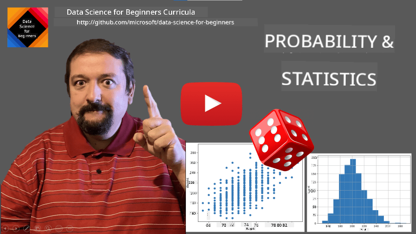
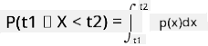
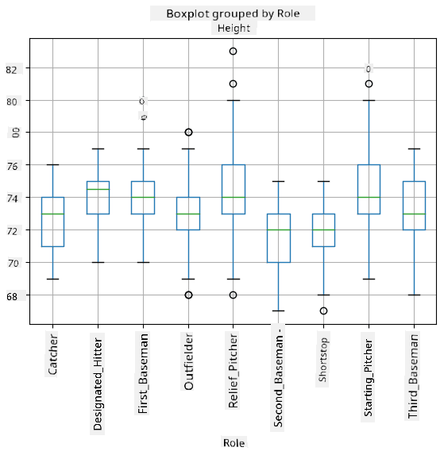
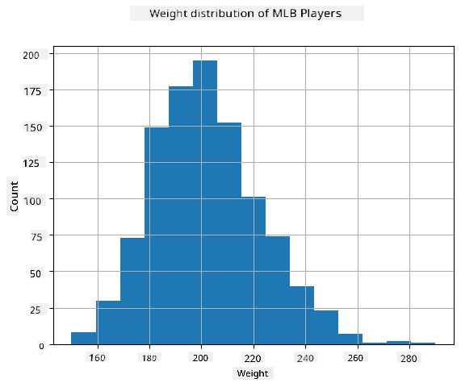
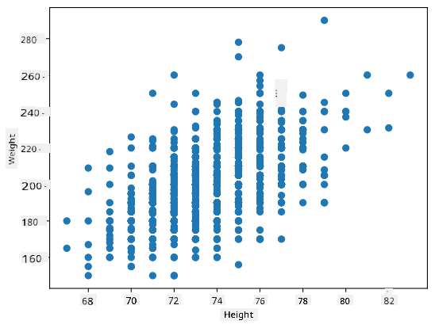

<!--
CO_OP_TRANSLATOR_METADATA:
{
  "original_hash": "1cf49f029ba1f25a54f0d5bc2fa575fc",
  "translation_date": "2025-09-06T10:12:05+00:00",
  "source_file": "1-Introduction/04-stats-and-probability/README.md",
  "language_code": "en"
}
-->
# A Brief Introduction to Statistics and Probability

| ](../../sketchnotes/04-Statistics-Probability.png)|
|:---:|
| Statistics and Probability - _Sketchnote by [@nitya](https://twitter.com/nitya)_ |

Statistics and Probability Theory are two closely related branches of Mathematics that are highly relevant to Data Science. While you can work with data without a deep understanding of mathematics, it's still beneficial to grasp some basic concepts. Here, we'll provide a brief introduction to help you get started.

[](https://youtu.be/Z5Zy85g4Yjw)

## [Pre-lecture quiz](https://ff-quizzes.netlify.app/en/ds/quiz/6)

## Probability and Random Variables

**Probability** is a number between 0 and 1 that represents how likely an **event** is to occur. It is calculated as the number of favorable outcomes (leading to the event) divided by the total number of possible outcomes, assuming all outcomes are equally likely. For example, when rolling a die, the probability of getting an even number is 3/6 = 0.5.

When discussing events, we use **random variables**. For instance, the random variable representing the number rolled on a die can take values from 1 to 6. The set of numbers from 1 to 6 is called the **sample space**. We can talk about the probability of a random variable taking a specific value, such as P(X=3)=1/6.

The random variable in the example above is called **discrete** because its sample space consists of countable values that can be listed. In other cases, the sample space might be a range of real numbers or the entire set of real numbers. Such variables are called **continuous**. A good example is the time a bus arrives.

## Probability Distribution

For discrete random variables, it's straightforward to describe the probability of each event using a function P(X). For each value *s* in the sample space *S*, the function assigns a number between 0 and 1, ensuring that the sum of all P(X=s) values equals 1.

The most well-known discrete distribution is the **uniform distribution**, where the sample space consists of N elements, each with an equal probability of 1/N.

Describing the probability distribution of a continuous variable, with values drawn from an interval [a,b] or the entire set of real numbers ℝ, is more complex. Consider the case of bus arrival times. For any exact arrival time *t*, the probability of the bus arriving at that precise moment is actually 0!

> Now you know that events with 0 probability can happen—and they happen quite often! For example, every time the bus arrives!

Instead, we talk about the probability of a variable falling within a range of values, such as P(t<sub>1</sub>≤X<t<sub>2</sub>). In this case, the probability distribution is described by a **probability density function** p(x), such that:



A continuous analog of the uniform distribution is called **continuous uniform distribution**, which is defined over a finite interval. The probability that the value X falls within an interval of length l is proportional to l and increases up to 1.

Another important distribution is the **normal distribution**, which we'll discuss in more detail later.

## Mean, Variance, and Standard Deviation

Suppose we draw a sequence of n samples from a random variable X: x<sub>1</sub>, x<sub>2</sub>, ..., x<sub>n</sub>. The **mean** (or **arithmetic average**) of the sequence is calculated as (x<sub>1</sub>+x<sub>2</sub>+...+x<sub>n</sub>)/n. As the sample size grows (i.e., as n approaches infinity), the mean converges to the **expectation** of the distribution, denoted as **E**(x).

> For any discrete distribution with values {x<sub>1</sub>, x<sub>2</sub>, ..., x<sub>N</sub>} and corresponding probabilities p<sub>1</sub>, p<sub>2</sub>, ..., p<sub>N</sub>, the expectation is given by E(X)=x<sub>1</sub>p<sub>1</sub>+x<sub>2</sub>p<sub>2</sub>+...+x<sub>N</sub>p<sub>N</sub>.

To measure how spread out the values are, we calculate the variance σ<sup>2</sup> = ∑(x<sub>i</sub> - μ)<sup>2</sup>/n, where μ is the mean of the sequence. The square root of the variance, σ, is called the **standard deviation**, and σ<sup>2</sup> is the **variance**.

## Mode, Median, and Quartiles

Sometimes, the mean doesn't adequately represent the "typical" value of the data. For example, extreme values can skew the mean. A better indicator in such cases is the **median**, which is the value that divides the data into two halves—one half below it and the other half above it.

To better understand the distribution of data, we use **quartiles**:

* The first quartile (Q1) is the value below which 25% of the data falls.
* The third quartile (Q3) is the value below which 75% of the data falls.

The relationship between the median and quartiles can be visualized using a **box plot**:


We also calculate the **interquartile range** (IQR=Q3-Q1) and identify **outliers**—values that fall outside the range [Q1-1.5*IQR, Q3+1.5*IQR].

For distributions with a small number of possible values, the most frequent value is a good "typical" value, called the **mode**. Mode is often used for categorical data, such as colors. For example, if two groups of people strongly prefer red and blue, the mean of their preferences might fall somewhere in the orange-green spectrum, which doesn't represent either group's preference. However, the mode would correctly identify the most popular colors. If two colors are equally popular, the sample is called **multimodal**.

## Real-world Data

When analyzing real-world data, the values often aren't random variables in the strict sense, as they don't result from experiments with unknown outcomes. For example, consider a baseball team and their physical attributes like height, weight, and age. These numbers aren't truly random, but we can still apply mathematical concepts. For instance, the sequence of players' weights can be treated as values drawn from a random variable. Below is the sequence of weights for actual baseball players from [Major League Baseball](http://mlb.mlb.com/index.jsp), taken from [this dataset](http://wiki.stat.ucla.edu/socr/index.php/SOCR_Data_MLB_HeightsWeights) (only the first 20 values are shown for convenience):

```
[180.0, 215.0, 210.0, 210.0, 188.0, 176.0, 209.0, 200.0, 231.0, 180.0, 188.0, 180.0, 185.0, 160.0, 180.0, 185.0, 197.0, 189.0, 185.0, 219.0]
```

> **Note**: To see an example of working with this dataset, check out the [accompanying notebook](notebook.ipynb). There are also challenges throughout this lesson that you can complete by adding code to the notebook. If you're unsure how to work with data, don't worry—we'll revisit data manipulation using Python later. If you don't know how to run code in Jupyter Notebook, check out [this article](https://soshnikov.com/education/how-to-execute-notebooks-from-github/).

Here's a box plot showing the mean, median, and quartiles for the data:


Since the data includes information about different player **roles**, we can create box plots by role to see how the values differ across roles. This time, we'll consider height:



This diagram suggests that, on average, first basemen are taller than second basemen. Later in this lesson, we'll learn how to formally test this hypothesis and demonstrate statistical significance.

> When working with real-world data, we assume that all data points are samples drawn from a probability distribution. This assumption allows us to apply machine learning techniques and build predictive models.

To visualize the distribution of the data, we can create a **histogram**. The x-axis represents weight intervals (or **bins**), and the y-axis shows the frequency of values within each interval.



From this histogram, you can see that most values cluster around a certain mean weight, and the further you move from the mean, the less frequent those values become. This indicates that extreme weights are less likely. The variance shows how much the weights deviate from the mean.

> If we analyzed weights of people outside the baseball league, the distribution might differ. However, the general shape of the distribution would remain the same, with changes to the mean and variance. Training a model on baseball players might yield inaccurate results when applied to university students, as the underlying distribution differs.

## Normal Distribution

The weight distribution we observed above is very common, and many real-world measurements follow the same type of distribution, albeit with different means and variances. This distribution is called the **normal distribution**, and it plays a crucial role in statistics.

Using a normal distribution is a valid way to generate random weights for potential baseball players. Once we know the mean weight `mean` and standard deviation `std`, we can generate 1000 weight samples as follows:

```python
samples = np.random.normal(mean,std,1000)
``` 

If we plot a histogram of the generated samples, it will resemble the one shown earlier. Increasing the number of samples and bins will produce a graph closer to the ideal normal distribution:


*Normal Distribution with mean=0 and std.dev=1*

## Confidence Intervals

When discussing baseball players' weights, we assume there is a **random variable W** representing the ideal probability distribution of weights for all baseball players (the **population**). Our sequence of weights corresponds to a subset of players, called a **sample**. A key question is whether we can determine the parameters of W's distribution, such as the population mean and variance.

The simplest approach is to calculate the sample's mean and variance. However, the sample might not perfectly represent the population. This is where **confidence intervals** come into play.

> **Confidence interval** refers to the range within which the true population mean is likely to fall, with a certain probability (or **level of confidence**).

Suppose we have a sample X...
<sub>
1<sub>1</sub>, ..., X<sub>n</sub> from our distribution. Each time we draw a sample from our distribution, we would end up with a different mean value μ. Thus, μ can be considered a random variable. A **confidence interval** with confidence p is a pair of values (L<sub>p</sub>, R<sub>p</sub>), such that **P**(L<sub>p</sub> ≤ μ ≤ R<sub>p</sub>) = p, meaning the probability of the measured mean value falling within the interval equals p.

It goes beyond the scope of this brief introduction to discuss in detail how these confidence intervals are calculated. More information can be found [on Wikipedia](https://en.wikipedia.org/wiki/Confidence_interval). In short, we define the distribution of the computed sample mean relative to the true mean of the population, which is called the **Student distribution**.

> **Interesting fact**: The Student distribution is named after mathematician William Sealy Gosset, who published his paper under the pseudonym "Student." He worked at the Guinness brewery, and, according to one version, his employer did not want the public to know they were using statistical tests to assess the quality of raw materials.

If we want to estimate the mean μ of our population with confidence p, we need to take the *(1-p)/2-th percentile* of a Student distribution A, which can either be taken from tables or computed using built-in functions in statistical software (e.g., Python, R, etc.). Then the interval for μ would be given by X ± A * D / √n, where X is the obtained mean of the sample, and D is the standard deviation.

> **Note**: We also omit the discussion of an important concept called [degrees of freedom](https://en.wikipedia.org/wiki/Degrees_of_freedom_(statistics)), which is relevant to the Student distribution. You can refer to more comprehensive books on statistics to explore this concept further.

An example of calculating confidence intervals for weights and heights is provided in the [accompanying notebooks](notebook.ipynb).

| p    | Weight mean   |
|------|---------------|
| 0.85 | 201.73 ± 0.94 |
| 0.90 | 201.73 ± 1.08 |
| 0.95 | 201.73 ± 1.28 |

Notice that the higher the confidence probability, the wider the confidence interval.

## Hypothesis Testing

In our baseball players dataset, there are different player roles, summarized below (refer to the [accompanying notebook](notebook.ipynb) to see how this table is calculated):

| Role              | Height     | Weight     | Count |
|-------------------|------------|------------|-------|
| Catcher           | 72.723684  | 204.328947 | 76    |
| Designated_Hitter | 74.222222  | 220.888889 | 18    |
| First_Baseman     | 74.000000  | 213.109091 | 55    |
| Outfielder        | 73.010309  | 199.113402 | 194   |
| Relief_Pitcher    | 74.374603  | 203.517460 | 315   |
| Second_Baseman    | 71.362069  | 184.344828 | 58    |
| Shortstop         | 71.903846  | 182.923077 | 52    |
| Starting_Pitcher  | 74.719457  | 205.163636 | 221   |
| Third_Baseman     | 73.044444  | 200.955556 | 45    |

We can observe that the mean height of first basemen is greater than that of second basemen. This might lead us to conclude that **first basemen are taller than second basemen**.

> This statement is called **a hypothesis**, as we do not know whether the fact is actually true or not.

However, it is not always clear whether we can make this conclusion. From the discussion above, we know that each mean has an associated confidence interval, and this difference could simply be a statistical error. We need a more formal method to test our hypothesis.

Let’s compute confidence intervals separately for the heights of first and second basemen:

| Confidence | First Basemen   | Second Basemen  |
|------------|-----------------|-----------------|
| 0.85       | 73.62..74.38   | 71.04..71.69    |
| 0.90       | 73.56..74.44   | 70.99..71.73    |
| 0.95       | 73.47..74.53   | 70.92..71.81    |

We can see that under no confidence level do the intervals overlap. This supports our hypothesis that first basemen are taller than second basemen.

More formally, the problem we are solving is to determine whether **two probability distributions are the same**, or at least have the same parameters. Depending on the distribution, different tests are required. If we know our distributions are normal, we can apply the **[Student t-test](https://en.wikipedia.org/wiki/Student%27s_t-test)**.

In the Student t-test, we compute the **t-value**, which measures the difference between means while accounting for variance. It has been shown that the t-value follows the **Student distribution**, allowing us to determine the threshold value for a given confidence level **p** (this can be computed or looked up in numerical tables). We then compare the t-value to this threshold to accept or reject the hypothesis.

In Python, we can use the **SciPy** package, which includes the `ttest_ind` function (along with many other useful statistical functions!). This function computes the t-value for us and performs the reverse lookup of the confidence p-value, enabling us to draw conclusions directly from the confidence level.

For example, comparing the heights of first and second basemen yields the following results:
```python
from scipy.stats import ttest_ind

tval, pval = ttest_ind(df.loc[df['Role']=='First_Baseman',['Height']], df.loc[df['Role']=='Designated_Hitter',['Height']],equal_var=False)
print(f"T-value = {tval[0]:.2f}\nP-value: {pval[0]}")
```
```
T-value = 7.65
P-value: 9.137321189738925e-12
```
In this case, the p-value is very low, indicating strong evidence that first basemen are taller.

There are other types of hypotheses we might want to test, such as:
* Verifying that a given sample follows a specific distribution. For instance, we assumed that heights are normally distributed, but this requires formal statistical validation.
* Testing whether the mean value of a sample corresponds to a predefined value.
* Comparing the means of multiple samples (e.g., differences in happiness levels across age groups).

## Law of Large Numbers and Central Limit Theorem

One reason the normal distribution is so important is the **central limit theorem**. Suppose we have a large sample of independent N values X<sub>1</sub>, ..., X<sub>N</sub>, drawn from any distribution with mean μ and variance σ<sup>2</sup>. Then, for sufficiently large N (i.e., as N→∞), the mean Σ<sub>i</sub>X<sub>i</sub> will be normally distributed, with mean μ and variance σ<sup>2</sup>/N.

> Another interpretation of the central limit theorem is that regardless of the original distribution, the mean of a sum of random variable values will follow a normal distribution.

The central limit theorem also implies that as N→∞, the probability of the sample mean equaling μ approaches 1. This is known as the **law of large numbers**.

## Covariance and Correlation

One of the goals of data science is to identify relationships between data. Two sequences are said to **correlate** when they exhibit similar behavior simultaneously—either rising/falling together or one rising while the other falls, and vice versa. In other words, there appears to be some connection between the two sequences.

> Correlation does not necessarily imply a causal relationship between two sequences. Sometimes both variables depend on an external factor, or the correlation may occur purely by chance. However, strong mathematical correlation is a good indicator that two variables are somehow related.

Mathematically, the concept that quantifies the relationship between two random variables is **covariance**, calculated as Cov(X, Y) = **E**\[(X - **E**(X))(Y - **E**(Y))\]. This involves computing the deviation of both variables from their mean values and then multiplying these deviations. If both variables deviate together, the product will always be positive, resulting in positive covariance. If the variables deviate out of sync (e.g., one falls below average while the other rises above average), the product will be negative, leading to negative covariance. If the deviations are independent, the covariance will be approximately zero.

The absolute value of covariance does not indicate the strength of the correlation, as it depends on the magnitude of the values. To normalize it, we divide the covariance by the standard deviation of both variables, yielding **correlation**. Correlation always falls within the range [-1, 1], where 1 indicates strong positive correlation, -1 indicates strong negative correlation, and 0 indicates no correlation (independence).

**Example**: We can compute the correlation between the weights and heights of baseball players from the dataset mentioned earlier:
```python
print(np.corrcoef(weights,heights))
```
This results in a **correlation matrix** like the following:
```
array([[1.        , 0.52959196],
       [0.52959196, 1.        ]])
```

> A correlation matrix C can be computed for any number of input sequences S<sub>1</sub>, ..., S<sub>n</sub>. The value of C<sub>ij</sub> represents the correlation between S<sub>i</sub> and S<sub>j</sub>, and diagonal elements are always 1 (self-correlation of S<sub>i</sub>).

In this case, the value 0.53 indicates some correlation between a person’s weight and height. We can also create a scatter plot to visualize the relationship:



> More examples of correlation and covariance can be found in the [accompanying notebook](notebook.ipynb).

## Conclusion

In this section, we have learned:
* Basic statistical properties of data, such as mean, variance, mode, and quartiles.
* Different distributions of random variables, including the normal distribution.
* How to identify correlations between different properties.
* How to use mathematical and statistical tools to validate hypotheses.
* How to compute confidence intervals for random variables based on data samples.

While this is not an exhaustive list of topics in probability and statistics, it provides a solid foundation for this course.

## 🚀 Challenge

Use the sample code in the notebook to test the following hypotheses:
1. First basemen are older than second basemen.
2. First basemen are taller than third basemen.
3. Shortstops are taller than second basemen.

## [Post-lecture quiz](https://ff-quizzes.netlify.app/en/ds/quiz/7)

## Review & Self Study

Probability and statistics is a vast field that warrants its own course. If you wish to delve deeper into the theory, consider exploring the following resources:

1. [Carlos Fernandez-Granda](https://cims.nyu.edu/~cfgranda/) from New York University offers excellent lecture notes: [Probability and Statistics for Data Science](https://cims.nyu.edu/~cfgranda/pages/stuff/probability_stats_for_DS.pdf) (available online).
2. [Peter and Andrew Bruce. Practical Statistics for Data Scientists.](https://www.oreilly.com/library/view/practical-statistics-for/9781491952955/) [[Sample code in R](https://github.com/andrewgbruce/statistics-for-data-scientists)].
3. [James D. Miller. Statistics for Data Science](https://www.packtpub.com/product/statistics-for-data-science/9781788290678) [[Sample code in R](https://github.com/PacktPublishing/Statistics-for-Data-Science)].

## Assignment

[Small Diabetes Study](assignment.md)

## Credits

This lesson was created with ♥️ by [Dmitry Soshnikov](http://soshnikov.com).

---

**Disclaimer**:  
This document has been translated using the AI translation service [Co-op Translator](https://github.com/Azure/co-op-translator). While we aim for accuracy, please note that automated translations may include errors or inaccuracies. The original document in its native language should be regarded as the authoritative source. For critical information, professional human translation is advised. We are not responsible for any misunderstandings or misinterpretations resulting from the use of this translation.