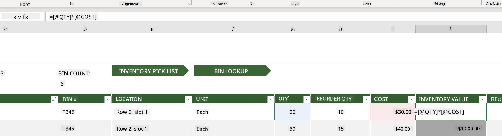
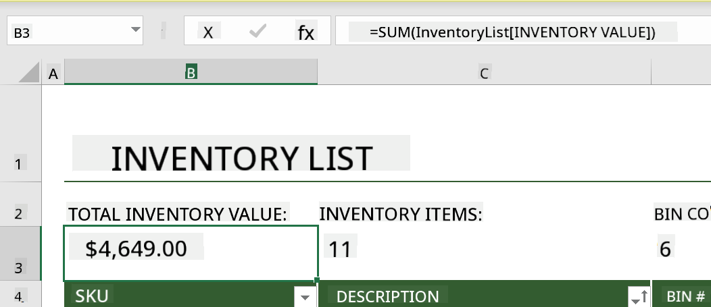
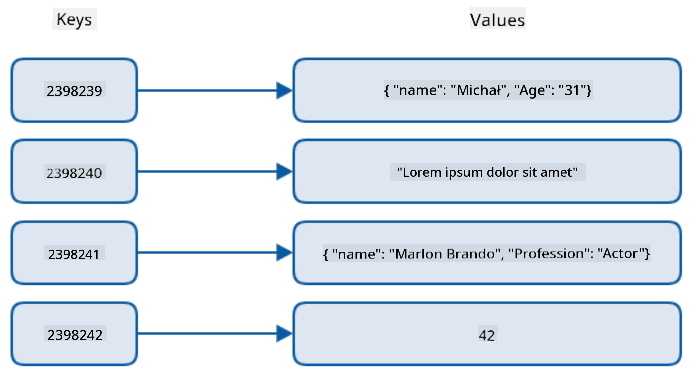
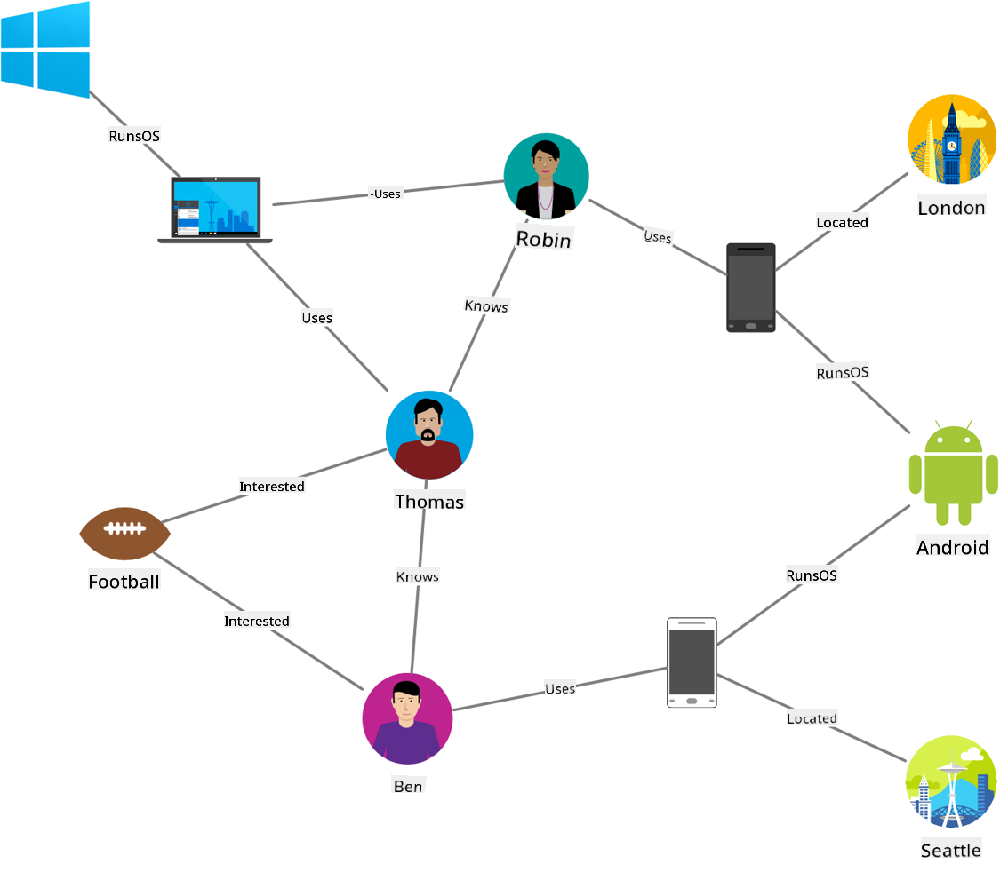
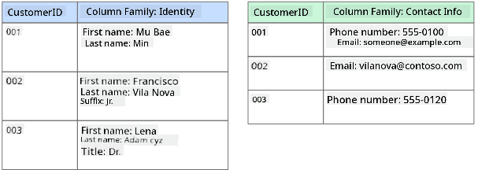
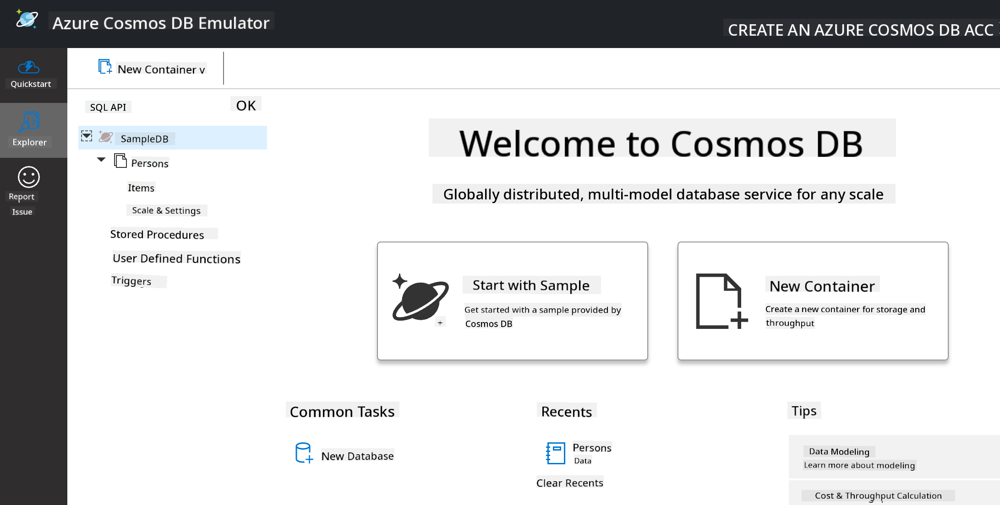
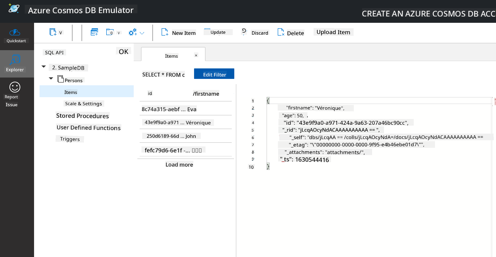
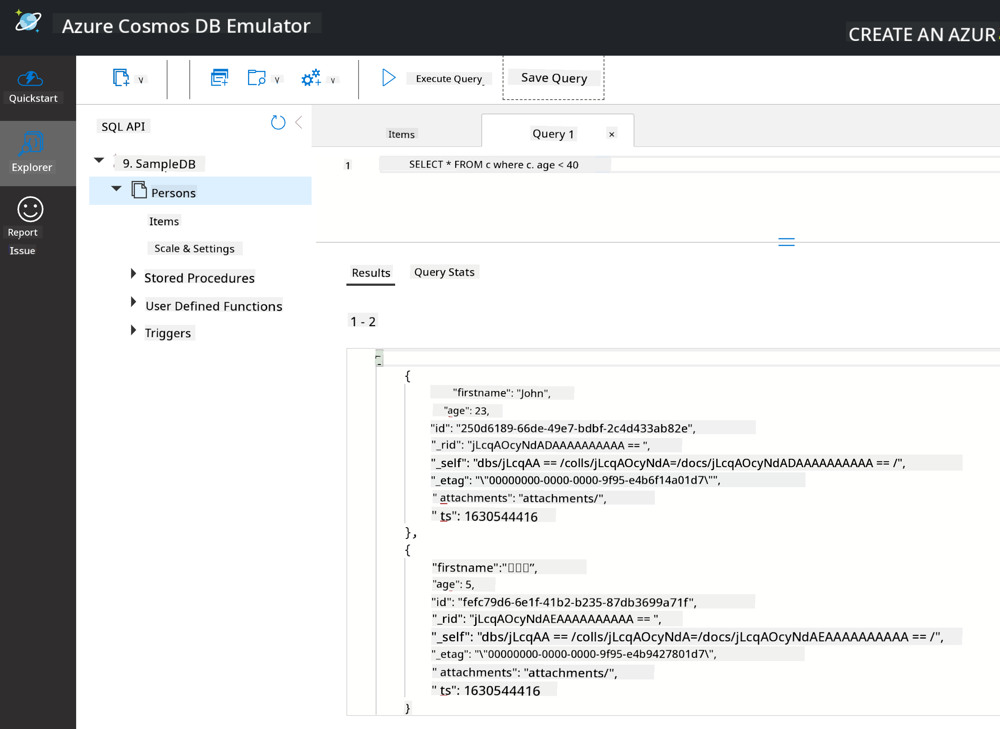

<!--
CO_OP_TRANSLATOR_METADATA:
{
  "original_hash": "c182e87f9f80be7e7cdffc7b40bbfccf",
  "translation_date": "2025-09-06T10:05:27+00:00",
  "source_file": "2-Working-With-Data/06-non-relational/README.md",
  "language_code": "en"
}
-->
# Working with Data: Non-Relational Data

| ](../../sketchnotes/06-NoSQL.png)|
|:---:|
|Working with NoSQL Data - _Sketchnote by [@nitya](https://twitter.com/nitya)_ |

## [Pre-Lecture Quiz](https://ff-quizzes.netlify.app/en/ds/quiz/10)

Data isn't limited to relational databases. This lesson focuses on non-relational data and introduces the basics of spreadsheets and NoSQL.

## Spreadsheets

Spreadsheets are a widely used tool for storing and analyzing data because they are easy to set up and use. In this lesson, you'll learn the fundamental components of a spreadsheet, along with formulas and functions. The examples will use Microsoft Excel, but most spreadsheet software has similar features and terminology.


A spreadsheet is a file that can be accessed on a computer, device, or cloud-based file system. The software itself might be browser-based or require installation as an application or app. In Excel, these files are referred to as **workbooks**, and this term will be used throughout the lesson.

A workbook contains one or more **worksheets**, which are labeled with tabs. Each worksheet consists of rectangles called **cells**, where the actual data is stored. A cell is the intersection of a row and column, with columns labeled alphabetically and rows labeled numerically. Some spreadsheets include headers in the first few rows to describe the data in the cells.

Using these basic elements of an Excel workbook, we'll explore an example from [Microsoft Templates](https://templates.office.com/) focused on inventory management to demonstrate additional spreadsheet features.

### Managing an Inventory 

The spreadsheet file named "InventoryExample" is a formatted inventory sheet containing three worksheets, with tabs labeled "Inventory List," "Inventory Pick List," and "Bin Lookup." Row 4 of the Inventory List worksheet serves as the header, describing the value of each cell in the corresponding column.



Sometimes, a cell's value depends on other cells to calculate its value. For example, the Inventory List spreadsheet tracks the cost of each item, but what if we need to calculate the total value of the inventory? [**Formulas**](https://support.microsoft.com/en-us/office/overview-of-formulas-34519a4e-1e8d-4f4b-84d4-d642c4f63263) perform operations on cell data, and in this case, a formula is used in the Inventory Value column to calculate the value of each item by multiplying the quantity (under the QTY header) by the cost (under the COST header). Double-clicking or highlighting a cell reveals the formula. Formulas always start with an equals sign, followed by the calculation or operation.



To find the total inventory value, we can use another formula to sum up all the values in the Inventory Value column. While adding each cell manually is possible, it would be tedious. Excel provides [**functions**](https://support.microsoft.com/en-us/office/sum-function-043e1c7d-7726-4e80-8f32-07b23e057f89), which are predefined formulas for performing calculations. Functions require arguments, which are the values needed for the calculation. If a function requires multiple arguments, they must be listed in the correct order to ensure accurate results. In this example, the SUM function is used to add up the values in the Inventory Value column, with the total displayed in row 3, column B (B3).

## NoSQL

NoSQL is a broad term for various methods of storing non-relational data. It can mean "non-SQL," "non-relational," or "not only SQL." These database systems are generally categorized into four types.


> Source from [Michał Białecki Blog](https://www.michalbialecki.com/2018/03/18/azure-cosmos-db-key-value-database-cloud/)

[Key-value](https://docs.microsoft.com/en-us/azure/architecture/data-guide/big-data/non-relational-data#keyvalue-data-stores) databases store data as pairs of unique keys and their associated values. These pairs are organized using a [hash table](https://www.hackerearth.com/practice/data-structures/hash-tables/basics-of-hash-tables/tutorial/) with a suitable hashing function.


> Source from [Microsoft](https://docs.microsoft.com/en-us/azure/cosmos-db/graph/graph-introduction#graph-database-by-example)

[Graph](https://docs.microsoft.com/en-us/azure/architecture/data-guide/big-data/non-relational-data#graph-data-stores) databases represent relationships between data as nodes and edges. A node represents an entity, such as a student or a bank statement, while edges represent the relationships between entities. Both nodes and edges have properties that provide additional information.



[Columnar](https://docs.microsoft.com/en-us/azure/architecture/data-guide/big-data/non-relational-data#columnar-data-stores) data stores organize data into rows and columns, similar to relational databases. However, columns are grouped into column families, where all data within a column family is related and can be retrieved or modified as a single unit.

### Document Data Stores with the Azure Cosmos DB 

[Document](https://docs.microsoft.com/en-us/azure/architecture/data-guide/big-data/non-relational-data#document-data-stores) data stores expand on the concept of key-value stores by using fields and objects. This section explores document databases using the Cosmos DB emulator.

Cosmos DB fits the "Not Only SQL" definition, as its document database uses SQL for querying data. The [previous lesson](../05-relational-databases/README.md) on SQL covers the basics of the language, and we'll apply similar queries to a document database here. The Cosmos DB Emulator allows you to create and explore a document database locally. Learn more about the Emulator [here](https://docs.microsoft.com/en-us/azure/cosmos-db/local-emulator?tabs=ssl-netstd21).

A document consists of fields and object values, where fields describe the object values. Below is an example of a document.

```json
{
    "firstname": "Eva",
    "age": 44,
    "id": "8c74a315-aebf-4a16-bb38-2430a9896ce5",
    "_rid": "bHwDAPQz8s0BAAAAAAAAAA==",
    "_self": "dbs/bHwDAA==/colls/bHwDAPQz8s0=/docs/bHwDAPQz8s0BAAAAAAAAAA==/",
    "_etag": "\"00000000-0000-0000-9f95-010a691e01d7\"",
    "_attachments": "attachments/",
    "_ts": 1630544034
}
```

Key fields in this document include `firstname`, `id`, and `age`. The other fields with underscores are automatically generated by Cosmos DB.

#### Exploring Data with the Cosmos DB Emulator

You can download and install the emulator [for Windows here](https://aka.ms/cosmosdb-emulator). For macOS and Linux, refer to this [documentation](https://docs.microsoft.com/en-us/azure/cosmos-db/local-emulator?tabs=ssl-netstd21#run-on-linux-macos).

The Emulator opens in a browser window, where the Explorer view lets you navigate documents.



If you're following along, click "Start with Sample" to generate a sample database called SampleDB. Expanding SampleDB reveals a container named `Persons`. A container holds a collection of items, which are the documents within it. You can explore the four individual documents under `Items`.



#### Querying Document Data with the Cosmos DB Emulator

You can query the sample data by clicking the "New SQL Query" button (second button from the left).

`SELECT * FROM c` retrieves all documents in the container. To find everyone younger than 40, add a WHERE clause:

`SELECT * FROM c where c.age < 40`

 

The query returns two documents, both with age values less than 40.

#### JSON and Documents

If you're familiar with JavaScript Object Notation (JSON), you'll notice that documents resemble JSON. A `PersonsData.json` file in this directory contains additional data that you can upload to the Persons container in the Emulator using the `Upload Item` button.

In many cases, APIs that return JSON data can directly store this data in document databases. Below is another document, representing tweets from the Microsoft Twitter account. This data was retrieved using the Twitter API and inserted into Cosmos DB.

```json
{
    "created_at": "2021-08-31T19:03:01.000Z",
    "id": "1432780985872142341",
    "text": "Blank slate. Like this tweet if you’ve ever painted in Microsoft Paint before. https://t.co/cFeEs8eOPK",
    "_rid": "dhAmAIUsA4oHAAAAAAAAAA==",
    "_self": "dbs/dhAmAA==/colls/dhAmAIUsA4o=/docs/dhAmAIUsA4oHAAAAAAAAAA==/",
    "_etag": "\"00000000-0000-0000-9f84-a0958ad901d7\"",
    "_attachments": "attachments/",
    "_ts": 1630537000
```

Key fields in this document include `created_at`, `id`, and `text`.

## 🚀 Challenge

A `TwitterData.json` file is available for upload to the SampleDB database. It's recommended to add it to a separate container. To do this:

1. Click the "New Container" button in the top right.
2. Select the existing database (SampleDB), create a container ID for the new container.
3. Set the partition key to `/id`.
4. Click OK (you can ignore the other settings since this is a small dataset running locally).
5. Open your new container and upload the Twitter Data file using the `Upload Item` button.

Try running a few SELECT queries to find documents containing "Microsoft" in the text field. Hint: Use the [LIKE keyword](https://docs.microsoft.com/en-us/azure/cosmos-db/sql/sql-query-keywords#using-like-with-the--wildcard-character).

## [Post-lecture quiz](https://ff-quizzes.netlify.app/en/ds/quiz/11)

## Review & Self Study

- This lesson doesn't cover all the formatting and features available in spreadsheets. Microsoft offers a [comprehensive library of documentation and videos](https://support.microsoft.com/excel) for those interested in learning more about Excel.

- This architectural documentation explains the characteristics of different types of non-relational data: [Non-relational Data and NoSQL](https://docs.microsoft.com/en-us/azure/architecture/data-guide/big-data/non-relational-data).

- Cosmos DB is a cloud-based non-relational database that supports the NoSQL types discussed in this lesson. Learn more in this [Cosmos DB Microsoft Learn Module](https://docs.microsoft.com/en-us/learn/paths/work-with-nosql-data-in-azure-cosmos-db/).

## Assignment

[Soda Profits](assignment.md)

---

**Disclaimer**:  
This document has been translated using the AI translation service [Co-op Translator](https://github.com/Azure/co-op-translator). While we strive for accuracy, please note that automated translations may contain errors or inaccuracies. The original document in its native language should be regarded as the authoritative source. For critical information, professional human translation is recommended. We are not responsible for any misunderstandings or misinterpretations resulting from the use of this translation.