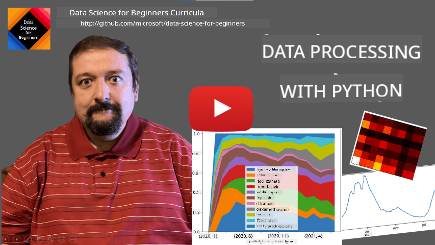
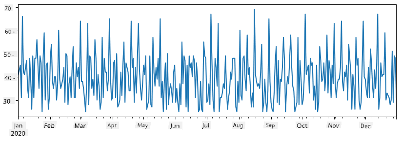
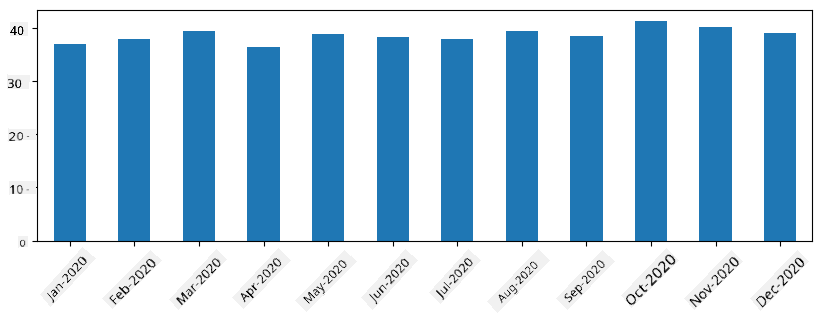

<!--
CO_OP_TRANSLATOR_METADATA:
{
  "original_hash": "577a611517482c3ceaf76d3d8142cba9",
  "translation_date": "2025-09-06T10:05:49+00:00",
  "source_file": "2-Working-With-Data/07-python/README.md",
  "language_code": "en"
}
-->
# Working with Data: Python and the Pandas Library

|  ](../../sketchnotes/07-WorkWithPython.png) |
| :-------------------------------------------------------------------------------------------------------: |
|                 Working With Python - _Sketchnote by [@nitya](https://twitter.com/nitya)_                 |

[](https://youtu.be/dZjWOGbsN4Y)

Databases provide efficient ways to store and query data using query languages, but the most flexible method for processing data is writing your own program to manipulate it. Often, database queries are more effective, but in cases where complex data processing is required, SQL may not be sufficient. 

Data processing can be done in any programming language, but some languages are better suited for working with data. Data scientists typically use one of the following:

* **[Python](https://www.python.org/)**: A general-purpose programming language known for its simplicity, making it ideal for beginners. Python has numerous libraries that can help solve practical problems, such as extracting data from ZIP archives or converting images to grayscale. Beyond data science, Python is widely used for web development.
* **[R](https://www.r-project.org/)**: A specialized tool designed for statistical data processing. It has a vast library repository (CRAN), making it a strong choice for data analysis. However, R is not a general-purpose language and is rarely used outside the data science domain.
* **[Julia](https://julialang.org/)**: A language specifically developed for data science, offering better performance than Python. It is particularly useful for scientific experiments.

In this lesson, we will focus on Python for basic data processing, assuming you have a foundational understanding of the language. For a deeper dive into Python, consider these resources:

* [Learn Python in a Fun Way with Turtle Graphics and Fractals](https://github.com/shwars/pycourse) - A quick GitHub-based introduction to Python programming.
* [Take your First Steps with Python](https://docs.microsoft.com/en-us/learn/paths/python-first-steps/?WT.mc_id=academic-77958-bethanycheum) - A learning path on [Microsoft Learn](http://learn.microsoft.com/?WT.mc_id=academic-77958-bethanycheum).

Data can exist in various formats. In this lesson, we will focus on three types: **tabular data**, **text**, and **images**.

Rather than covering all related libraries, we will explore a few examples of data processing to give you a sense of what's possible. This approach will help you understand where to find solutions when needed.

> **Best advice**: If you're unsure how to perform a specific data operation, search online. [Stackoverflow](https://stackoverflow.com/) often has useful Python code samples for common tasks.

## [Pre-lecture quiz](https://ff-quizzes.netlify.app/en/ds/quiz/12)

## Tabular Data and Dataframes

You’ve already encountered tabular data when learning about relational databases. When dealing with large datasets stored in multiple linked tables, SQL is the best tool for the job. However, there are situations where you have a single table of data and need to derive **insights** or **understanding**—such as analyzing distributions or correlations. In data science, transforming and visualizing data are common tasks, and Python makes these steps straightforward.

Two key Python libraries for working with tabular data are:

* **[Pandas](https://pandas.pydata.org/)**: Enables manipulation of **DataFrames**, which are similar to relational tables. You can work with named columns and perform operations on rows, columns, or entire DataFrames.
* **[Numpy](https://numpy.org/)**: A library for handling **tensors**, or multi-dimensional **arrays**. Arrays contain values of the same type and are simpler than DataFrames, offering more mathematical operations with less overhead.

Other useful libraries include:

* **[Matplotlib](https://matplotlib.org/)**: Used for data visualization and graph plotting.
* **[SciPy](https://www.scipy.org/)**: Provides additional scientific functions. You may recall this library from discussions on probability and statistics.

Here’s a typical code snippet for importing these libraries at the start of a Python program:
```python
import numpy as np
import pandas as pd
import matplotlib.pyplot as plt
from scipy import ... # you need to specify exact sub-packages that you need
``` 

Pandas revolves around a few core concepts.

### Series 

A **Series** is a sequence of values, similar to a list or numpy array. The key difference is that a Series has an **index**, which is considered during operations (e.g., addition). The index can be as simple as an integer row number (default when creating a Series from a list or array) or more complex, like a date range.

> **Note**: Introductory Pandas code is available in the accompanying notebook [`notebook.ipynb`](notebook.ipynb). While we outline some examples here, feel free to explore the full notebook.

Example: Let’s analyze sales at an ice cream shop. We’ll generate a Series of daily sales numbers over a period of time:

```python
start_date = "Jan 1, 2020"
end_date = "Mar 31, 2020"
idx = pd.date_range(start_date,end_date)
print(f"Length of index is {len(idx)}")
items_sold = pd.Series(np.random.randint(25,50,size=len(idx)),index=idx)
items_sold.plot()
```


Suppose we host weekly parties and take an additional 10 packs of ice cream for each event. We can create another Series, indexed by week, to represent this:
```python
additional_items = pd.Series(10,index=pd.date_range(start_date,end_date,freq="W"))
```
Adding the two Series gives us the total number:
```python
total_items = items_sold.add(additional_items,fill_value=0)
total_items.plot()
```


> **Note**: We don’t use the simple syntax `total_items + additional_items`. Doing so would result in many `NaN` (*Not a Number*) values in the resulting Series because missing values in the `additional_items` index lead to `NaN` when added. To avoid this, we specify the `fill_value` parameter during addition.

With time series, we can also **resample** data at different intervals. For instance, to calculate average monthly sales:
```python
monthly = total_items.resample("1M").mean()
ax = monthly.plot(kind='bar')
```


### DataFrame

A DataFrame is essentially a collection of Series with the same index. Multiple Series can be combined into a DataFrame:
```python
a = pd.Series(range(1,10))
b = pd.Series(["I","like","to","play","games","and","will","not","change"],index=range(0,9))
df = pd.DataFrame([a,b])
```
This creates a horizontal table like this:
|     | 0   | 1    | 2   | 3   | 4      | 5   | 6      | 7    | 8    |
| --- | --- | ---- | --- | --- | ------ | --- | ------ | ---- | ---- |
| 0   | 1   | 2    | 3   | 4   | 5      | 6   | 7      | 8    | 9    |
| 1   | I   | like | to  | use | Python | and | Pandas | very | much |

Alternatively, Series can be used as columns, with column names specified via a dictionary:
```python
df = pd.DataFrame({ 'A' : a, 'B' : b })
```
This produces the following table:

|     | A   | B      |
| --- | --- | ------ |
| 0   | 1   | I      |
| 1   | 2   | like   |
| 2   | 3   | to     |
| 3   | 4   | use    |
| 4   | 5   | Python |
| 5   | 6   | and    |
| 6   | 7   | Pandas |
| 7   | 8   | very   |
| 8   | 9   | much   |

**Note**: This table layout can also be achieved by transposing the previous table using:
```python
df = pd.DataFrame([a,b]).T..rename(columns={ 0 : 'A', 1 : 'B' })
```
Here, `.T` transposes the DataFrame (swapping rows and columns), and `rename` allows column renaming to match the previous example.

Key operations on DataFrames include:

**Column selection**: Select individual columns with `df['A']` (returns a Series) or a subset of columns with `df[['B','A']]` (returns another DataFrame).

**Filtering rows**: Filter rows based on criteria, e.g., `df[df['A']>5]` selects rows where column `A` is greater than 5.

> **Note**: Filtering works by creating a boolean Series (e.g., `df['A']<5`), which is then used as an index to return matching rows. Avoid using standard Python boolean expressions like `df[df['A']>5 and df['A']<7]`. Instead, use `&` for boolean Series: `df[(df['A']>5) & (df['A']<7)]` (*brackets are required*).

**Creating new columns**: Add new columns with expressions like:
```python
df['DivA'] = df['A']-df['A'].mean() 
``` 
This calculates the divergence of `A` from its mean value. However, avoid operations incompatible with Series, such as:
```python
# Wrong code -> df['ADescr'] = "Low" if df['A'] < 5 else "Hi"
df['LenB'] = len(df['B']) # <- Wrong result
``` 
This example assigns the length of Series `B` to all values in the column, not the length of individual elements.

For complex expressions, use the `apply` function:
```python
df['LenB'] = df['B'].apply(lambda x : len(x))
# or 
df['LenB'] = df['B'].apply(len)
```

After these operations, the resulting DataFrame looks like this:

|     | A   | B      | DivA | LenB |
| --- | --- | ------ | ---- | ---- |
| 0   | 1   | I      | -4.0 | 1    |
| 1   | 2   | like   | -3.0 | 4    |
| 2   | 3   | to     | -2.0 | 2    |
| 3   | 4   | use    | -1.0 | 3    |
| 4   | 5   | Python | 0.0  | 6    |
| 5   | 6   | and    | 1.0  | 3    |
| 6   | 7   | Pandas | 2.0  | 6    |
| 7   | 8   | very   | 3.0  | 4    |
| 8   | 9   | much   | 4.0  | 4    |

**Selecting rows by index**: Use `iloc` to select rows by position, e.g., the first 5 rows:
```python
df.iloc[:5]
```

**Grouping**: Similar to Excel pivot tables, grouping allows calculations like the mean of column `A` for each unique `LenB` value:
```python
df.groupby(by='LenB').mean()
```
For more complex aggregations (e.g., mean and count), use the `aggregate` function:
```python
df.groupby(by='LenB') \
 .aggregate({ 'DivA' : len, 'A' : lambda x: x.mean() }) \
 .rename(columns={ 'DivA' : 'Count', 'A' : 'Mean'})
```
This produces the following table:

| LenB | Count | Mean     |
| ---- | ----- | -------- |
| 1    | 1     | 1.000000 |
| 2    | 1     | 3.000000 |
| 3    | 2     | 5.000000 |
| 4    | 3     | 6.333333 |
| 6    | 2     | 6.000000 |

### Getting Data
We have seen how simple it is to create Series and DataFrames from Python objects. However, data is often stored in text files or Excel tables. Fortunately, Pandas provides an easy way to load data from disk. For instance, reading a CSV file is as straightforward as this:  
```python
df = pd.read_csv('file.csv')
```  
We will explore more examples of loading data, including retrieving it from external websites, in the "Challenge" section.

### Printing and Plotting

A Data Scientist frequently needs to explore data, so being able to visualize it is crucial. When working with large DataFrames, we often want to ensure everything is functioning correctly by printing the first few rows. This can be done using `df.head()`. If you run this in Jupyter Notebook, it will display the DataFrame in a neat tabular format.

We’ve also seen how to use the `plot` function to visualize specific columns. While `plot` is highly versatile and supports various graph types via the `kind=` parameter, you can always use the raw `matplotlib` library for more complex visualizations. We will delve deeper into data visualization in separate course lessons.

This overview covers the key concepts of Pandas, but the library is incredibly rich, offering endless possibilities! Let’s now apply this knowledge to solve specific problems.

## 🚀 Challenge 1: Analyzing COVID Spread

The first problem we’ll tackle is modeling the spread of the COVID-19 epidemic. To do this, we’ll use data on the number of infected individuals across different countries, provided by the [Center for Systems Science and Engineering](https://systems.jhu.edu/) (CSSE) at [Johns Hopkins University](https://jhu.edu/). The dataset is available in [this GitHub Repository](https://github.com/CSSEGISandData/COVID-19).

To demonstrate how to work with data, we encourage you to open [`notebook-covidspread.ipynb`](notebook-covidspread.ipynb) and go through it from start to finish. You can also execute the cells and try out some challenges we’ve included at the end.


> If you’re unfamiliar with running code in Jupyter Notebook, check out [this article](https://soshnikov.com/education/how-to-execute-notebooks-from-github/).

## Working with Unstructured Data

While data often comes in tabular form, there are cases where we need to handle less structured data, such as text or images. In these situations, to apply the data processing techniques we’ve discussed, we need to **extract** structured data. Here are a few examples:

* Extracting keywords from text and analyzing their frequency
* Using neural networks to identify objects in images
* Detecting emotions in video camera feeds

## 🚀 Challenge 2: Analyzing COVID Papers

In this challenge, we’ll continue exploring the COVID pandemic by focusing on processing scientific papers on the topic. The [CORD-19 Dataset](https://www.kaggle.com/allen-institute-for-ai/CORD-19-research-challenge) contains over 7,000 papers (at the time of writing) on COVID, along with metadata and abstracts (and full text for about half of them).

A complete example of analyzing this dataset using the [Text Analytics for Health](https://docs.microsoft.com/azure/cognitive-services/text-analytics/how-tos/text-analytics-for-health/?WT.mc_id=academic-77958-bethanycheum) cognitive service is described [in this blog post](https://soshnikov.com/science/analyzing-medical-papers-with-azure-and-text-analytics-for-health/). We’ll discuss a simplified version of this analysis.

> **NOTE**: This repository does not include a copy of the dataset. You may need to download the [`metadata.csv`](https://www.kaggle.com/allen-institute-for-ai/CORD-19-research-challenge?select=metadata.csv) file from [this Kaggle dataset](https://www.kaggle.com/allen-institute-for-ai/CORD-19-research-challenge). Registration with Kaggle may be required. Alternatively, you can download the dataset without registration [from here](https://ai2-semanticscholar-cord-19.s3-us-west-2.amazonaws.com/historical_releases.html), which includes all full texts in addition to the metadata file.

Open [`notebook-papers.ipynb`](notebook-papers.ipynb) and go through it from start to finish. You can also execute the cells and try out some challenges we’ve included at the end.


## Processing Image Data

Recently, powerful AI models have been developed to analyze images. Many tasks can be accomplished using pre-trained neural networks or cloud services. Examples include:

* **Image Classification**, which categorizes images into predefined classes. You can train your own classifiers using services like [Custom Vision](https://azure.microsoft.com/services/cognitive-services/custom-vision-service/?WT.mc_id=academic-77958-bethanycheum).
* **Object Detection**, which identifies various objects in an image. Services like [computer vision](https://azure.microsoft.com/services/cognitive-services/computer-vision/?WT.mc_id=academic-77958-bethanycheum) can detect common objects, and you can train [Custom Vision](https://azure.microsoft.com/services/cognitive-services/custom-vision-service/?WT.mc_id=academic-77958-bethanycheum) models to detect specific objects of interest.
* **Face Detection**, including age, gender, and emotion recognition. This can be achieved using [Face API](https://azure.microsoft.com/services/cognitive-services/face/?WT.mc_id=academic-77958-bethanycheum).

These cloud services can be accessed via [Python SDKs](https://docs.microsoft.com/samples/azure-samples/cognitive-services-python-sdk-samples/cognitive-services-python-sdk-samples/?WT.mc_id=academic-77958-bethanycheum), making it easy to integrate them into your data exploration workflow.

Here are some examples of working with image data sources:
* In the blog post [How to Learn Data Science without Coding](https://soshnikov.com/azure/how-to-learn-data-science-without-coding/), we analyze Instagram photos to understand what makes people like a photo more. We extract information from images using [computer vision](https://azure.microsoft.com/services/cognitive-services/computer-vision/?WT.mc_id=academic-77958-bethanycheum) and use [Azure Machine Learning AutoML](https://docs.microsoft.com/azure/machine-learning/concept-automated-ml/?WT.mc_id=academic-77958-bethanycheum) to build an interpretable model.
* In [Facial Studies Workshop](https://github.com/CloudAdvocacy/FaceStudies), we use [Face API](https://azure.microsoft.com/services/cognitive-services/face/?WT.mc_id=academic-77958-bethanycheum) to analyze emotions in event photographs to understand what makes people happy.

## Conclusion

Whether you’re working with structured or unstructured data, Python allows you to perform all steps related to data processing and analysis. It’s one of the most flexible tools for data processing, which is why most data scientists use Python as their primary tool. If you’re serious about pursuing data science, learning Python in depth is highly recommended!

## [Post-lecture quiz](https://ff-quizzes.netlify.app/en/ds/quiz/13)

## Review & Self Study

**Books**  
* [Wes McKinney. Python for Data Analysis: Data Wrangling with Pandas, NumPy, and IPython](https://www.amazon.com/gp/product/1491957662)

**Online Resources**  
* Official [10 minutes to Pandas](https://pandas.pydata.org/pandas-docs/stable/user_guide/10min.html) tutorial  
* [Documentation on Pandas Visualization](https://pandas.pydata.org/pandas-docs/stable/user_guide/visualization.html)

**Learning Python**  
* [Learn Python in a Fun Way with Turtle Graphics and Fractals](https://github.com/shwars/pycourse)  
* [Take your First Steps with Python](https://docs.microsoft.com/learn/paths/python-first-steps/?WT.mc_id=academic-77958-bethanycheum) Learning Path on [Microsoft Learn](http://learn.microsoft.com/?WT.mc_id=academic-77958-bethanycheum)

## Assignment

[Perform more detailed data study for the challenges above](assignment.md)

## Credits

This lesson was created with ♥️ by [Dmitry Soshnikov](http://soshnikov.com)

---

**Disclaimer**:  
This document has been translated using the AI translation service [Co-op Translator](https://github.com/Azure/co-op-translator). While we strive for accuracy, please note that automated translations may contain errors or inaccuracies. The original document in its native language should be regarded as the authoritative source. For critical information, professional human translation is recommended. We are not responsible for any misunderstandings or misinterpretations resulting from the use of this translation.