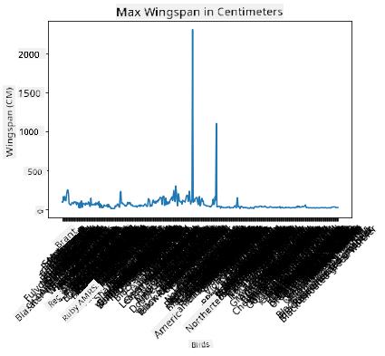
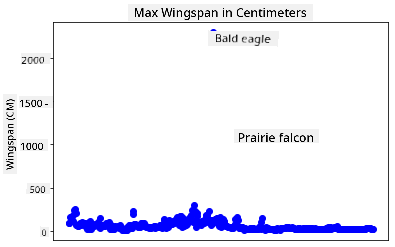
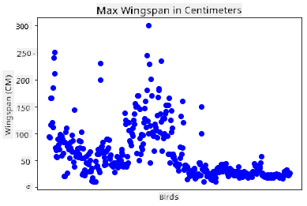
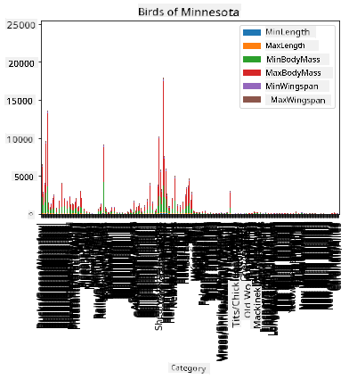
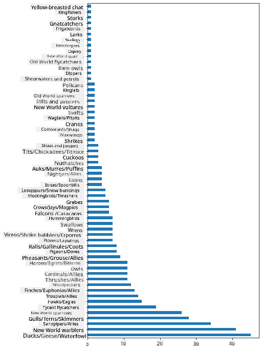
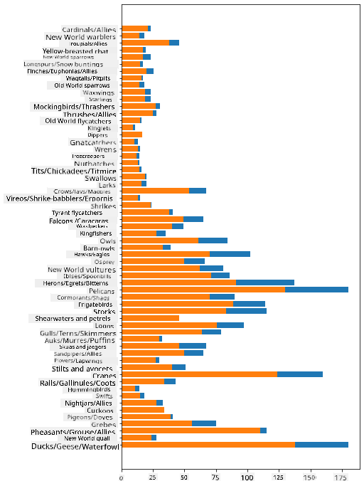

<!--
CO_OP_TRANSLATOR_METADATA:
{
  "original_hash": "a49d78e32e280c410f04e5f2a2068e77",
  "translation_date": "2025-09-06T10:09:46+00:00",
  "source_file": "3-Data-Visualization/09-visualization-quantities/README.md",
  "language_code": "en"
}
-->
# Visualizing Quantities

| ](../../sketchnotes/09-Visualizing-Quantities.png)|
|:---:|
| Visualizing Quantities - _Sketchnote by [@nitya](https://twitter.com/nitya)_ |

In this lesson, you'll learn how to use one of the many Python libraries available to create engaging visualizations focused on the concept of quantity. Using a cleaned dataset about the birds of Minnesota, you can uncover fascinating insights about local wildlife.

## [Pre-lecture quiz](https://ff-quizzes.netlify.app/en/ds/quiz/16)

## Observe wingspan with Matplotlib

A great library for creating both simple and complex plots and charts is [Matplotlib](https://matplotlib.org/stable/index.html). Generally, the process of plotting data with these libraries involves identifying the parts of your dataframe to target, performing any necessary transformations, assigning x and y axis values, choosing the type of plot, and then displaying it. Matplotlib offers a wide range of visualizations, but for this lesson, we'll focus on those best suited for visualizing quantities: line charts, scatterplots, and bar plots.

> ✅ Choose the chart type that best fits your data structure and the story you want to tell.  
> - To analyze trends over time: line  
> - To compare values: bar, column, pie, scatterplot  
> - To show how parts relate to a whole: pie  
> - To show data distribution: scatterplot, bar  
> - To show trends: line, column  
> - To show relationships between values: line, scatterplot, bubble  

If you have a dataset and need to determine how much of a specific item is included, one of your first tasks will be to inspect its values.

✅ There are excellent 'cheat sheets' for Matplotlib available [here](https://matplotlib.org/cheatsheets/cheatsheets.pdf).

## Build a line plot about bird wingspan values

Open the `notebook.ipynb` file located in the root of this lesson folder and add a cell.

> Note: The data is stored in the root of this repository in the `/data` folder.

```python
import pandas as pd
import matplotlib.pyplot as plt
birds = pd.read_csv('../../data/birds.csv')
birds.head()
```  
This data contains a mix of text and numbers:

|      | Name                         | ScientificName         | Category              | Order        | Family   | Genus       | ConservationStatus | MinLength | MaxLength | MinBodyMass | MaxBodyMass | MinWingspan | MaxWingspan |
| ---: | :--------------------------- | :--------------------- | :-------------------- | :----------- | :------- | :---------- | :----------------- | --------: | --------: | ----------: | ----------: | ----------: | ----------: |
|    0 | Black-bellied whistling-duck | Dendrocygna autumnalis | Ducks/Geese/Waterfowl | Anseriformes | Anatidae | Dendrocygna | LC                 |        47 |        56 |         652 |        1020 |          76 |          94 |
|    1 | Fulvous whistling-duck       | Dendrocygna bicolor    | Ducks/Geese/Waterfowl | Anseriformes | Anatidae | Dendrocygna | LC                 |        45 |        53 |         712 |        1050 |          85 |          93 |
|    2 | Snow goose                   | Anser caerulescens     | Ducks/Geese/Waterfowl | Anseriformes | Anatidae | Anser       | LC                 |        64 |        79 |        2050 |        4050 |         135 |         165 |
|    3 | Ross's goose                 | Anser rossii           | Ducks/Geese/Waterfowl | Anseriformes | Anatidae | Anser       | LC                 |      57.3 |        64 |        1066 |        1567 |         113 |         116 |
|    4 | Greater white-fronted goose  | Anser albifrons        | Ducks/Geese/Waterfowl | Anseriformes | Anatidae | Anser       | LC                 |        64 |        81 |        1930 |        3310 |         130 |         165 |

Let's start by plotting some of the numeric data using a basic line plot. Suppose you wanted to visualize the maximum wingspan of these fascinating birds.

```python
wingspan = birds['MaxWingspan'] 
wingspan.plot()
```  


What stands out immediately? There seems to be at least one outlier—what a wingspan! A 2300-centimeter wingspan equals 23 meters—are there Pterodactyls in Minnesota? Let's investigate.

While you could quickly sort the data in Excel to find these outliers (likely typos), continue the visualization process by working directly within the plot.

Add labels to the x-axis to show the types of birds in question:

```
plt.title('Max Wingspan in Centimeters')
plt.ylabel('Wingspan (CM)')
plt.xlabel('Birds')
plt.xticks(rotation=45)
x = birds['Name'] 
y = birds['MaxWingspan']

plt.plot(x, y)

plt.show()
```  


Even with the labels rotated 45 degrees, there are too many to read. Let's try a different approach: label only the outliers and set the labels within the chart. You can use a scatter chart to make room for the labeling:

```python
plt.title('Max Wingspan in Centimeters')
plt.ylabel('Wingspan (CM)')
plt.tick_params(axis='both',which='both',labelbottom=False,bottom=False)

for i in range(len(birds)):
    x = birds['Name'][i]
    y = birds['MaxWingspan'][i]
    plt.plot(x, y, 'bo')
    if birds['MaxWingspan'][i] > 500:
        plt.text(x, y * (1 - 0.05), birds['Name'][i], fontsize=12)
    
plt.show()
```  
What's happening here? You used `tick_params` to hide the bottom labels and then looped through your bird dataset. By plotting the chart with small round blue dots (`bo`), you checked for any bird with a maximum wingspan over 500 and displayed its label next to the dot. You offset the labels slightly on the y-axis (`y * (1 - 0.05)`) and used the bird name as the label.

What did you discover?



## Filter your data

Both the Bald Eagle and the Prairie Falcon, while likely large birds, appear to be mislabeled with an extra `0` added to their maximum wingspan. It's unlikely you'll encounter a Bald Eagle with a 25-meter wingspan, but if you do, let us know! Let's create a new dataframe without these two outliers:

```python
plt.title('Max Wingspan in Centimeters')
plt.ylabel('Wingspan (CM)')
plt.xlabel('Birds')
plt.tick_params(axis='both',which='both',labelbottom=False,bottom=False)
for i in range(len(birds)):
    x = birds['Name'][i]
    y = birds['MaxWingspan'][i]
    if birds['Name'][i] not in ['Bald eagle', 'Prairie falcon']:
        plt.plot(x, y, 'bo')
plt.show()
```  

By filtering out the outliers, your data becomes more cohesive and easier to understand.



Now that we have a cleaner dataset, at least in terms of wingspan, let's explore more about these birds.

While line and scatter plots can display information about data values and their distributions, we want to focus on the values inherent in this dataset. You could create visualizations to answer questions about quantity, such as:

> How many categories of birds are there, and what are their numbers?  
> How many birds are extinct, endangered, rare, or common?  
> How many birds belong to various genera and orders in Linnaeus's classification?

## Explore bar charts

Bar charts are useful for showing groupings of data. Let's explore the bird categories in this dataset to see which is the most common.

In the notebook file, create a basic bar chart.

✅ Note: You can either filter out the two outlier birds identified earlier, correct the typo in their wingspan, or leave them in for these exercises, which don't depend on wingspan values.

To create a bar chart, select the data you want to focus on. Bar charts can be created from raw data:

```python
birds.plot(x='Category',
        kind='bar',
        stacked=True,
        title='Birds of Minnesota')

```  


This bar chart, however, is hard to read because the data isn't grouped. You need to select only the data you want to plot, so let's look at the bird categories based on their count.

Filter your data to include only the bird categories.

✅ Notice how you use Pandas to manage the data and let Matplotlib handle the charting.

Since there are many categories, display this chart vertically and adjust its height to fit all the data:

```python
category_count = birds.value_counts(birds['Category'].values, sort=True)
plt.rcParams['figure.figsize'] = [6, 12]
category_count.plot.barh()
```  


This bar chart provides a clear view of the number of birds in each category. At a glance, you can see that the largest number of birds in this region belong to the Ducks/Geese/Waterfowl category. Given that Minnesota is the "land of 10,000 lakes," this isn't surprising!

✅ Try counting other attributes in this dataset. Do any results surprise you?

## Comparing data

You can compare grouped data by creating new axes. For example, compare the MaxLength of birds based on their category:

```python
maxlength = birds['MaxLength']
plt.barh(y=birds['Category'], width=maxlength)
plt.rcParams['figure.figsize'] = [6, 12]
plt.show()
```  


Nothing surprising here: hummingbirds have the smallest MaxLength compared to pelicans or geese. It's reassuring when data aligns with logic!

You can create more engaging bar chart visualizations by overlaying data. Let's overlay Minimum and Maximum Length for each bird category:

```python
minLength = birds['MinLength']
maxLength = birds['MaxLength']
category = birds['Category']

plt.barh(category, maxLength)
plt.barh(category, minLength)

plt.show()
```  
In this plot, you can see the range of Minimum and Maximum Length for each bird category. You can confidently say that, based on this data, larger birds tend to have a wider length range. Fascinating!



## 🚀 Challenge

This bird dataset offers a wealth of information about different bird types within a specific ecosystem. Search online for other bird-related datasets and practice building charts and graphs to uncover surprising facts.

## [Post-lecture quiz](https://ff-quizzes.netlify.app/en/ds/quiz/17)

## Review & Self Study

This lesson introduced you to using Matplotlib for visualizing quantities. Research other ways to work with datasets for visualization. [Plotly](https://github.com/plotly/plotly.py) is one library we won't cover in these lessons, so explore its features.

## Assignment

[Lines, Scatters, and Bars](assignment.md)

---

**Disclaimer**:  
This document has been translated using the AI translation service [Co-op Translator](https://github.com/Azure/co-op-translator). While we strive for accuracy, please note that automated translations may contain errors or inaccuracies. The original document in its native language should be regarded as the authoritative source. For critical information, professional human translation is recommended. We are not responsible for any misunderstandings or misinterpretations resulting from the use of this translation.