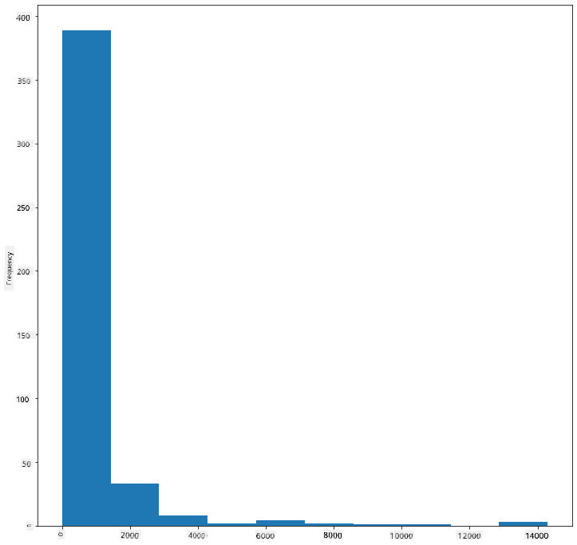

<!--
CO_OP_TRANSLATOR_METADATA:
{
  "original_hash": "80a20467e046d312809d008395051fc7",
  "translation_date": "2025-09-06T10:10:54+00:00",
  "source_file": "3-Data-Visualization/10-visualization-distributions/README.md",
  "language_code": "en"
}
-->
# Visualizing Distributions

| ](../../sketchnotes/10-Visualizing-Distributions.png)|
|:---:|
| Visualizing Distributions - _Sketchnote by [@nitya](https://twitter.com/nitya)_ |

In the previous lesson, you explored a dataset about the birds of Minnesota. You identified some erroneous data by visualizing outliers and examined differences between bird categories based on their maximum length.

## [Pre-lecture quiz](https://ff-quizzes.netlify.app/en/ds/quiz/18)
## Explore the birds dataset

Another way to analyze data is by examining its distribution, or how the data is spread along an axis. For instance, you might want to understand the general distribution of maximum wingspan or maximum body mass for the birds of Minnesota in this dataset.

Let’s uncover some insights about the distributions in this dataset. In the _notebook.ipynb_ file located in the root of this lesson folder, import Pandas, Matplotlib, and your data:

```python
import pandas as pd
import matplotlib.pyplot as plt
birds = pd.read_csv('../../data/birds.csv')
birds.head()
```

|      | Name                         | ScientificName         | Category              | Order        | Family   | Genus       | ConservationStatus | MinLength | MaxLength | MinBodyMass | MaxBodyMass | MinWingspan | MaxWingspan |
| ---: | :--------------------------- | :--------------------- | :-------------------- | :----------- | :------- | :---------- | :----------------- | --------: | --------: | ----------: | ----------: | ----------: | ----------: |
|    0 | Black-bellied whistling-duck | Dendrocygna autumnalis | Ducks/Geese/Waterfowl | Anseriformes | Anatidae | Dendrocygna | LC                 |        47 |        56 |         652 |        1020 |          76 |          94 |
|    1 | Fulvous whistling-duck       | Dendrocygna bicolor    | Ducks/Geese/Waterfowl | Anseriformes | Anatidae | Dendrocygna | LC                 |        45 |        53 |         712 |        1050 |          85 |          93 |
|    2 | Snow goose                   | Anser caerulescens     | Ducks/Geese/Waterfowl | Anseriformes | Anatidae | Anser       | LC                 |        64 |        79 |        2050 |        4050 |         135 |         165 |
|    3 | Ross's goose                 | Anser rossii           | Ducks/Geese/Waterfowl | Anseriformes | Anatidae | Anser       | LC                 |      57.3 |        64 |        1066 |        1567 |         113 |         116 |
|    4 | Greater white-fronted goose  | Anser albifrons        | Ducks/Geese/Waterfowl | Anseriformes | Anatidae | Anser       | LC                 |        64 |        81 |        1930 |        3310 |         130 |         165 |

In general, you can quickly examine how data is distributed by using a scatter plot, as demonstrated in the previous lesson:

```python
birds.plot(kind='scatter',x='MaxLength',y='Order',figsize=(12,8))

plt.title('Max Length per Order')
plt.ylabel('Order')
plt.xlabel('Max Length')

plt.show()
```


This provides an overview of the general distribution of body length per bird Order, but it’s not the best way to display true distributions. That’s where histograms come in.

## Working with histograms

Matplotlib provides excellent tools for visualizing data distributions using histograms. This type of chart resembles a bar chart, where the rise and fall of the bars represent the distribution. To create a histogram, you need numeric data. You can plot a histogram by specifying the chart type as 'hist'. This chart shows the distribution of MaxBodyMass across the dataset’s numeric range. By dividing the data into smaller bins, it reveals the distribution of values:

```python
birds['MaxBodyMass'].plot(kind = 'hist', bins = 10, figsize = (12,12))
plt.show()
```


As you can see, most of the 400+ birds in this dataset have a Max Body Mass under 2000. You can gain more insight by increasing the `bins` parameter to a higher number, such as 30:

```python
birds['MaxBodyMass'].plot(kind = 'hist', bins = 30, figsize = (12,12))
plt.show()
```


This chart provides a more detailed view of the distribution. To create a chart that’s less skewed to the left, you can filter the data to include only birds with a body mass under 60 and display 40 `bins`:

```python
filteredBirds = birds[(birds['MaxBodyMass'] > 1) & (birds['MaxBodyMass'] < 60)]      
filteredBirds['MaxBodyMass'].plot(kind = 'hist',bins = 40,figsize = (12,12))
plt.show()     
```


✅ Experiment with other filters and data points. To view the full distribution of the data, remove the `['MaxBodyMass']` filter to display labeled distributions.

Histograms also allow for color and labeling enhancements:

Create a 2D histogram to compare the relationship between two distributions. For example, compare `MaxBodyMass` vs. `MaxLength`. Matplotlib provides a built-in method to show convergence using brighter colors:

```python
x = filteredBirds['MaxBodyMass']
y = filteredBirds['MaxLength']

fig, ax = plt.subplots(tight_layout=True)
hist = ax.hist2d(x, y)
```
There seems to be a predictable correlation between these two elements along a specific axis, with one particularly strong point of convergence:


Histograms work well for numeric data by default. But what if you need to analyze distributions based on text data?

## Explore the dataset for distributions using text data 

This dataset also contains valuable information about bird categories, genus, species, family, and conservation status. Let’s explore the conservation status data. What is the distribution of birds based on their conservation status?

> ✅ In the dataset, several acronyms are used to describe conservation status. These acronyms are derived from the [IUCN Red List Categories](https://www.iucnredlist.org/), an organization that tracks species' statuses.
> 
> - CR: Critically Endangered
> - EN: Endangered
> - EX: Extinct
> - LC: Least Concern
> - NT: Near Threatened
> - VU: Vulnerable

Since these are text-based values, you’ll need to transform the data to create a histogram. Using the filteredBirds dataframe, display its conservation status alongside its Minimum Wingspan. What do you observe?

```python
x1 = filteredBirds.loc[filteredBirds.ConservationStatus=='EX', 'MinWingspan']
x2 = filteredBirds.loc[filteredBirds.ConservationStatus=='CR', 'MinWingspan']
x3 = filteredBirds.loc[filteredBirds.ConservationStatus=='EN', 'MinWingspan']
x4 = filteredBirds.loc[filteredBirds.ConservationStatus=='NT', 'MinWingspan']
x5 = filteredBirds.loc[filteredBirds.ConservationStatus=='VU', 'MinWingspan']
x6 = filteredBirds.loc[filteredBirds.ConservationStatus=='LC', 'MinWingspan']

kwargs = dict(alpha=0.5, bins=20)

plt.hist(x1, **kwargs, color='red', label='Extinct')
plt.hist(x2, **kwargs, color='orange', label='Critically Endangered')
plt.hist(x3, **kwargs, color='yellow', label='Endangered')
plt.hist(x4, **kwargs, color='green', label='Near Threatened')
plt.hist(x5, **kwargs, color='blue', label='Vulnerable')
plt.hist(x6, **kwargs, color='gray', label='Least Concern')

plt.gca().set(title='Conservation Status', ylabel='Min Wingspan')
plt.legend();
```


There doesn’t appear to be a strong correlation between minimum wingspan and conservation status. Test other elements of the dataset using this method. Try different filters as well. Do you find any correlations?

## Density plots

You may have noticed that the histograms we’ve examined so far are 'stepped' and don’t flow smoothly. To create a smoother density chart, you can use a density plot.

To work with density plots, familiarize yourself with a new plotting library, [Seaborn](https://seaborn.pydata.org/generated/seaborn.kdeplot.html). 

Load Seaborn and try creating a basic density plot:

```python
import seaborn as sns
import matplotlib.pyplot as plt
sns.kdeplot(filteredBirds['MinWingspan'])
plt.show()
```


This plot mirrors the previous one for Minimum Wingspan data but is smoother. According to Seaborn’s documentation, "Relative to a histogram, KDE can produce a plot that is less cluttered and more interpretable, especially when drawing multiple distributions. But it has the potential to introduce distortions if the underlying distribution is bounded or not smooth. Like a histogram, the quality of the representation also depends on the selection of good smoothing parameters." [source](https://seaborn.pydata.org/generated/seaborn.kdeplot.html) In other words, outliers can still negatively impact your charts.

If you want to revisit the jagged MaxBodyMass line from the second chart you created, you can smooth it out using this method:

```python
sns.kdeplot(filteredBirds['MaxBodyMass'])
plt.show()
```


If you prefer a smooth but not overly smooth line, adjust the `bw_adjust` parameter:

```python
sns.kdeplot(filteredBirds['MaxBodyMass'], bw_adjust=.2)
plt.show()
```


✅ Explore the available parameters for this type of plot and experiment!

This type of chart provides visually appealing and explanatory visualizations. For example, with just a few lines of code, you can display the max body mass density per bird Order:

```python
sns.kdeplot(
   data=filteredBirds, x="MaxBodyMass", hue="Order",
   fill=True, common_norm=False, palette="crest",
   alpha=.5, linewidth=0,
)
```


You can also map the density of multiple variables in one chart. Compare the MaxLength and MinLength of a bird to its conservation status:

```python
sns.kdeplot(data=filteredBirds, x="MinLength", y="MaxLength", hue="ConservationStatus")
```


It might be worth investigating whether the cluster of 'Vulnerable' birds based on their lengths has any significance.

## 🚀 Challenge

Histograms are a more advanced type of chart compared to basic scatterplots, bar charts, or line charts. Search online for examples of histograms. How are they used, what do they demonstrate, and in which fields or areas of study are they commonly applied?

## [Post-lecture quiz](https://ff-quizzes.netlify.app/en/ds/quiz/19)

## Review & Self Study

In this lesson, you used Matplotlib and began working with Seaborn to create more advanced charts. Research `kdeplot` in Seaborn, which generates a "continuous probability density curve in one or more dimensions." Read through [the documentation](https://seaborn.pydata.org/generated/seaborn.kdeplot.html) to understand how it works.

## Assignment

[Apply your skills](assignment.md)

---

**Disclaimer**:  
This document has been translated using the AI translation service [Co-op Translator](https://github.com/Azure/co-op-translator). While we aim for accuracy, please note that automated translations may include errors or inaccuracies. The original document in its native language should be regarded as the authoritative source. For critical information, professional human translation is advised. We are not responsible for any misunderstandings or misinterpretations resulting from the use of this translation.