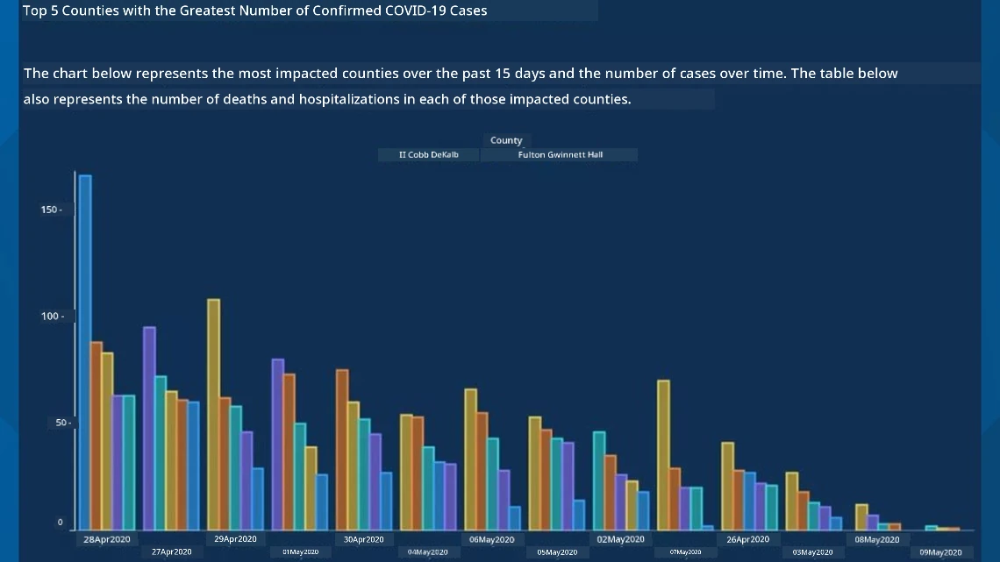
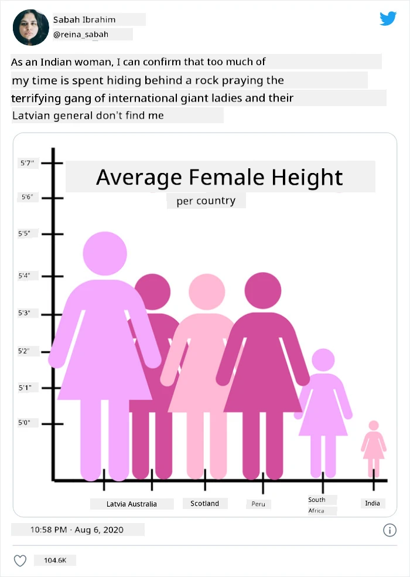
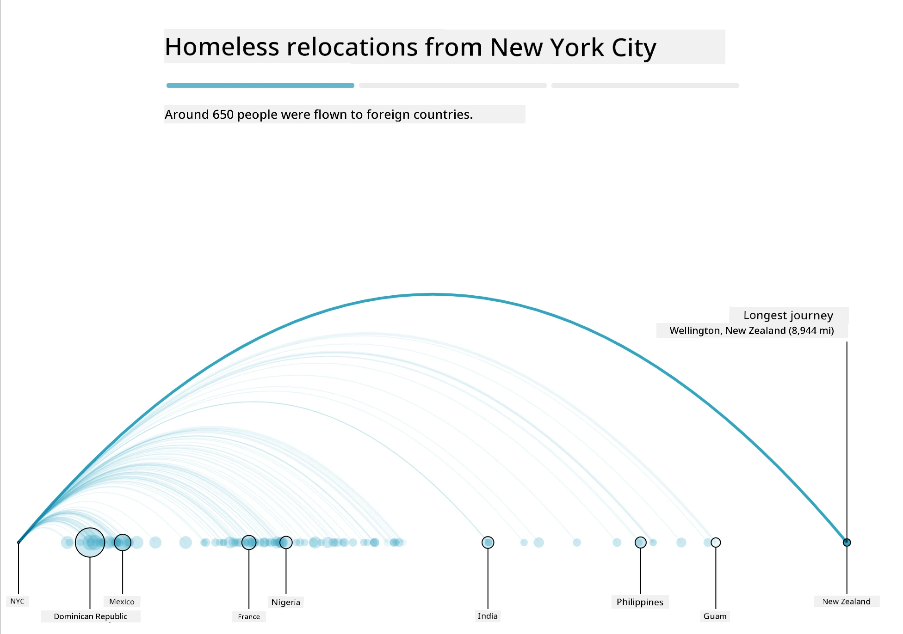
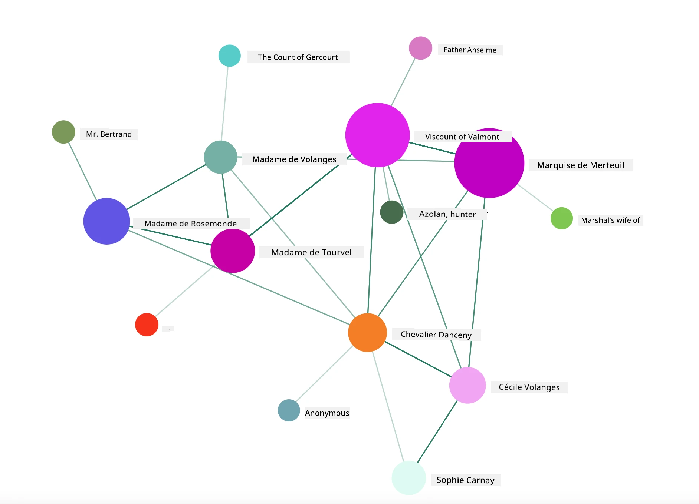

<!--
CO_OP_TRANSLATOR_METADATA:
{
  "original_hash": "cfb068050337a36e348debaa502a24fa",
  "translation_date": "2025-09-06T10:10:07+00:00",
  "source_file": "3-Data-Visualization/13-meaningful-visualizations/README.md",
  "language_code": "en"
}
-->
# Making Meaningful Visualizations

| ](../../sketchnotes/13-MeaningfulViz.png)|
|:---:|
| Meaningful Visualizations - _Sketchnote by [@nitya](https://twitter.com/nitya)_ |

> "If you torture the data long enough, it will confess to anything" -- [Ronald Coase](https://en.wikiquote.org/wiki/Ronald_Coase)

One of the essential skills for a data scientist is the ability to create meaningful data visualizations that help answer specific questions. Before visualizing your data, you need to ensure it has been cleaned and prepared, as you learned in previous lessons. Once that's done, you can start deciding how best to present the data.

In this lesson, you will explore:

1. How to select the appropriate chart type
2. How to avoid misleading visualizations
3. How to use color effectively
4. How to style charts for better readability
5. How to create animated or 3D visualizations
6. How to design creative visualizations

## [Pre-Lecture Quiz](https://ff-quizzes.netlify.app/en/ds/quiz/24)

## Choose the right chart type

In earlier lessons, you experimented with creating various data visualizations using Matplotlib and Seaborn. Generally, you can select the [appropriate chart type](https://chartio.com/learn/charts/how-to-select-a-data-vizualization/) based on the question you're trying to answer using this table:

| Task                        | Recommended Chart Type          |
| -------------------------- | ------------------------------- |
| Show data trends over time | Line                            |
| Compare categories         | Bar, Pie                        |
| Compare totals             | Pie, Stacked Bar                |
| Show relationships         | Scatter, Line, Facet, Dual Line |
| Show distributions         | Scatter, Histogram, Box         |
| Show proportions           | Pie, Donut, Waffle              |

> ✅ Depending on the structure of your data, you may need to convert it from text to numeric format to make it compatible with certain chart types.

## Avoid deception

Even when a data scientist carefully selects the right chart for the data, there are many ways data can be presented misleadingly to support a particular narrative, often at the expense of the data's integrity. There are numerous examples of deceptive charts and infographics!

[](https://www.youtube.com/watch?v=oX74Nge8Wkw "How charts lie")

> 🎥 Click the image above to watch a conference talk about misleading charts.

This chart reverses the X-axis to present the opposite of the truth based on the dates:


[This chart](https://media.firstcoastnews.com/assets/WTLV/images/170ae16f-4643-438f-b689-50d66ca6a8d8/170ae16f-4643-438f-b689-50d66ca6a8d8_1140x641.jpg) is even more misleading, as the eye is drawn to the right, suggesting that COVID cases have declined over time in various counties. However, upon closer inspection of the dates, you'll notice they have been rearranged to create a deceptive downward trend.



This infamous example uses both color and a flipped Y-axis to mislead viewers. Instead of showing that gun deaths increased after the passage of gun-friendly legislation, the chart tricks the eye into believing the opposite:


This peculiar chart demonstrates how proportions can be manipulated, often to humorous effect:



Another deceptive tactic is comparing things that are not comparable. There is a [fascinating website](https://tylervigen.com/spurious-correlations) dedicated to 'spurious correlations,' showcasing absurd 'facts' like the correlation between Maine's divorce rate and margarine consumption. A Reddit group also collects [examples of poor data usage](https://www.reddit.com/r/dataisugly/top/?t=all).

It's crucial to understand how easily the eye can be tricked by misleading charts. Even with good intentions, a poor choice of chart type—like a pie chart with too many categories—can lead to confusion.

## Color

The 'Florida gun violence' chart above illustrates how color can add another layer of meaning to visualizations, especially when charts are not created using libraries like Matplotlib or Seaborn, which offer pre-designed color palettes. If you're designing a chart manually, take some time to study [color theory](https://colormatters.com/color-and-design/basic-color-theory).

> ✅ Keep in mind that accessibility is a key aspect of visualization design. Some users may be colorblind—does your chart work well for those with visual impairments?

Be cautious when selecting colors for your chart, as they can convey unintended meanings. For example, the 'pink ladies' in the 'height' chart above add a distinctly 'feminine' connotation, which contributes to the chart's oddness.

While [color meanings](https://colormatters.com/color-symbolism/the-meanings-of-colors) can vary across cultures and change depending on the shade, general associations include:

| Color  | Meaning             |
| ------ | ------------------- |
| red    | power               |
| blue   | trust, loyalty      |
| yellow | happiness, caution  |
| green  | ecology, luck, envy |
| purple | happiness           |
| orange | vibrance            |

If you're tasked with creating a chart with custom colors, ensure that your design is both accessible and that the chosen colors align with the intended message.

## Styling your charts for readability

Charts lose their value if they aren't easy to read! Take time to adjust the width and height of your chart to ensure it scales well with your data. For example, if you need to display all 50 states, consider showing them vertically on the Y-axis to avoid a horizontally scrolling chart.

Label your axes, include a legend if necessary, and provide tooltips for better data comprehension.

If your data includes verbose text on the X-axis, you can angle the text for improved readability. [Matplotlib](https://matplotlib.org/stable/tutorials/toolkits/mplot3d.html) also supports 3D plotting if your data is suitable for it. Advanced visualizations can be created using `mpl_toolkits.mplot3d`.


## Animation and 3D chart display

Some of the most engaging data visualizations today are animated. Shirley Wu has created stunning examples using D3, such as '[film flowers](http://bl.ocks.org/sxywu/raw/d612c6c653fb8b4d7ff3d422be164a5d/),' where each flower represents a movie. Another example is 'Bussed Out,' an interactive experience for the Guardian that combines visualizations with Greensock and D3, along with a scrollytelling article format, to illustrate how NYC addresses homelessness by bussing people out of the city.



> "Bussed Out: How America Moves its Homeless" from [the Guardian](https://www.theguardian.com/us-news/ng-interactive/2017/dec/20/bussed-out-america-moves-homeless-people-country-study). Visualizations by Nadieh Bremer & Shirley Wu

While this lesson doesn't delve deeply into these powerful visualization libraries, you can experiment with D3 in a Vue.js app to create a visualization of the book "Dangerous Liaisons" as an animated social network.

> "Les Liaisons Dangereuses" is an epistolary novel, presented as a series of letters. Written in 1782 by Choderlos de Laclos, it tells the story of the morally corrupt social maneuvers of two French aristocrats, the Vicomte de Valmont and the Marquise de Merteuil. Both meet their downfall, but not before causing significant social damage. The novel unfolds through letters written to various individuals in their circles, plotting revenge or simply stirring trouble. Create a visualization of these letters to identify the key players in the narrative, visually.

You will complete a web app that displays an animated view of this social network. It uses a library designed to create a [network visualization](https://github.com/emiliorizzo/vue-d3-network) using Vue.js and D3. When the app is running, you can drag the nodes around the screen to rearrange the data.



## Project: Build a chart to show a network using D3.js

> This lesson folder includes a `solution` folder where you can find the completed project for reference.

1. Follow the instructions in the README.md file in the starter folder's root. Ensure you have NPM and Node.js installed on your machine before setting up the project's dependencies.

2. Open the `starter/src` folder. Inside, you'll find an `assets` folder containing a .json file with all the letters from the novel, numbered, with 'to' and 'from' annotations.

3. Complete the code in `components/Nodes.vue` to enable the visualization. Locate the method called `createLinks()` and add the following nested loop.

Loop through the .json object to extract the 'to' and 'from' data for the letters and build the `links` object for the visualization library:

```javascript
//loop through letters
      let f = 0;
      let t = 0;
      for (var i = 0; i < letters.length; i++) {
          for (var j = 0; j < characters.length; j++) {
              
            if (characters[j] == letters[i].from) {
              f = j;
            }
            if (characters[j] == letters[i].to) {
              t = j;
            }
        }
        this.links.push({ sid: f, tid: t });
      }
  ```

Run your app from the terminal (npm run serve) and enjoy the visualization!

## 🚀 Challenge

Explore the internet to find examples of misleading visualizations. How does the author mislead the viewer, and is it intentional? Try correcting the visualizations to show how they should appear.

## [Post-lecture quiz](https://ff-quizzes.netlify.app/en/ds/quiz/25)

## Review & Self Study

Here are some articles about misleading data visualizations:

https://gizmodo.com/how-to-lie-with-data-visualization-1563576606

http://ixd.prattsi.org/2017/12/visual-lies-usability-in-deceptive-data-visualizations/

Check out these interesting visualizations of historical assets and artifacts:

https://handbook.pubpub.org/

Read this article on how animation can enhance visualizations:

https://medium.com/@EvanSinar/use-animation-to-supercharge-data-visualization-cd905a882ad4

## Assignment

[Build your own custom visualization](assignment.md)

---

**Disclaimer**:  
This document has been translated using the AI translation service [Co-op Translator](https://github.com/Azure/co-op-translator). While we aim for accuracy, please note that automated translations may include errors or inaccuracies. The original document in its native language should be regarded as the authoritative source. For critical information, professional human translation is advised. We are not responsible for any misunderstandings or misinterpretations resulting from the use of this translation.