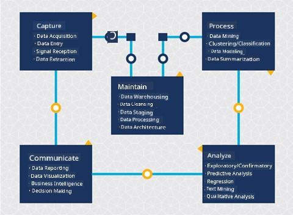
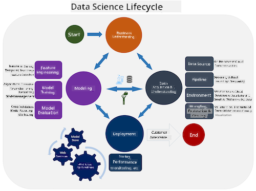
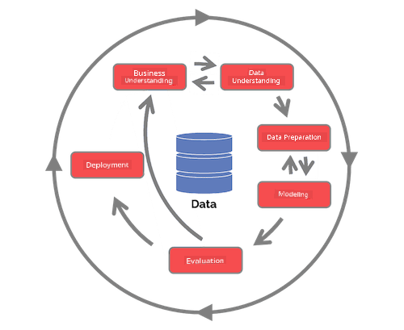

<!--
CO_OP_TRANSLATOR_METADATA:
{
  "original_hash": "07478c2092203a69087b9c76b1f4dd56",
  "translation_date": "2025-09-06T10:08:05+00:00",
  "source_file": "4-Data-Science-Lifecycle/14-Introduction/README.md",
  "language_code": "en"
}
-->
# Introduction to the Data Science Lifecycle

| ](../../sketchnotes/14-DataScience-Lifecycle.png)|
|:---:|
| Introduction to the Data Science Lifecycle - _Sketchnote by [@nitya](https://twitter.com/nitya)_ |

## [Pre-Lecture Quiz](https://ff-quizzes.netlify.app/en/ds/quiz/26)

By now, you’ve likely realized that data science is a process. This process can be divided into five stages:

- Capturing
- Processing
- Analysis
- Communication
- Maintenance

This lesson focuses on three parts of the lifecycle: capturing, processing, and maintenance.

> Image by [Berkeley School of Information](https://ischoolonline.berkeley.edu/data-science/what-is-data-science/)

## Capturing

The first stage of the lifecycle is crucial because the subsequent stages depend on it. It essentially combines two steps: acquiring the data and defining the purpose and problems to be addressed.  
Defining the project’s goals requires a deeper understanding of the problem or question. First, we need to identify and engage with those whose problem needs solving. These could be stakeholders in a business or project sponsors who can help determine who or what will benefit from the project, as well as what they need and why. A well-defined goal should be measurable and quantifiable to establish a clear definition of success.

Questions a data scientist might ask:
- Has this problem been tackled before? What was discovered?
- Do all involved parties understand the purpose and goal?
- Is there any ambiguity, and how can it be reduced?
- What are the constraints?
- What might the end result look like?
- What resources (time, people, computational) are available?

Next, we identify, collect, and explore the data needed to achieve these defined goals. During the acquisition step, data scientists must also evaluate the quantity and quality of the data. This involves some data exploration to ensure that the acquired data will support achieving the desired outcome.

Questions a data scientist might ask about the data:
- What data is already available to me?
- Who owns this data?
- What are the privacy concerns?
- Do I have enough data to solve this problem?
- Is the data of sufficient quality for this problem?
- If additional insights are discovered through this data, should we consider revising or redefining the goals?

## Processing

The processing stage of the lifecycle focuses on uncovering patterns in the data and building models. Some techniques used in this stage involve statistical methods to identify patterns. For large datasets, this would typically be a tedious task for a human, so computers are used to handle the heavy lifting and speed up the process. This stage is also where data science and machine learning intersect. As you learned in the first lesson, machine learning involves building models to understand the data. Models represent the relationships between variables in the data and help predict outcomes.

Common techniques used in this stage are covered in the ML for Beginners curriculum. Follow the links to learn more about them:

- [Classification](https://github.com/microsoft/ML-For-Beginners/tree/main/4-Classification): Organizing data into categories for more efficient use.
- [Clustering](https://github.com/microsoft/ML-For-Beginners/tree/main/5-Clustering): Grouping data into similar clusters.
- [Regression](https://github.com/microsoft/ML-For-Beginners/tree/main/2-Regression): Determining relationships between variables to predict or forecast values.

## Maintaining

In the lifecycle diagram, you may have noticed that maintenance sits between capturing and processing. Maintenance is an ongoing process of managing, storing, and securing the data throughout the project and should be considered throughout the entire lifecycle.

### Storing Data

Decisions about how and where data is stored can impact storage costs and the performance of data access. These decisions are unlikely to be made by a data scientist alone, but they may influence how the data scientist works with the data based on its storage.

Here are some aspects of modern data storage systems that can affect these decisions:

**On-premise vs. off-premise vs. public or private cloud**

On-premise refers to hosting and managing data on your own equipment, such as owning a server with hard drives to store the data. Off-premise relies on equipment you don’t own, such as a data center. The public cloud is a popular choice for storing data, requiring no knowledge of how or where the data is stored. Public refers to a shared underlying infrastructure used by all cloud users. Some organizations have strict security policies requiring complete control over the equipment where the data is hosted, so they rely on a private cloud that provides dedicated cloud services. You’ll learn more about data in the cloud in [later lessons](https://github.com/microsoft/Data-Science-For-Beginners/tree/main/5-Data-Science-In-Cloud).

**Cold vs. hot data**

When training your models, you may need more training data. Once your model is finalized, additional data will still arrive for the model to fulfill its purpose. In either case, the cost of storing and accessing data will increase as more data accumulates. Separating rarely used data (cold data) from frequently accessed data (hot data) can be a more cost-effective storage solution, whether through hardware or software services. However, accessing cold data may take longer compared to hot data.

### Managing Data

As you work with data, you may find that some of it needs cleaning using techniques covered in the lesson on [data preparation](https://github.com/microsoft/Data-Science-For-Beginners/tree/main/2-Working-With-Data/08-data-preparation) to build accurate models. When new data arrives, it will require similar processing to maintain quality consistency. Some projects use automated tools for cleansing, aggregation, and compression before moving the data to its final location. Azure Data Factory is an example of such a tool.

### Securing the Data

One of the main goals of securing data is ensuring that those working with it have control over what is collected and how it is used. Keeping data secure involves limiting access to only those who need it, adhering to local laws and regulations, and maintaining ethical standards, as discussed in the [ethics lesson](https://github.com/microsoft/Data-Science-For-Beginners/tree/main/1-Introduction/02-ethics).

Here are some steps a team might take to ensure data security:
- Ensure all data is encrypted.
- Provide customers with information about how their data is used.
- Remove data access for individuals who have left the project.
- Restrict data modification to specific project members.

## 🚀 Challenge

There are many versions of the Data Science Lifecycle, where each step may have different names and numbers of stages but still include the same processes discussed in this lesson.

Explore the [Team Data Science Process lifecycle](https://docs.microsoft.com/en-us/azure/architecture/data-science-process/lifecycle) and the [Cross-industry standard process for data mining](https://www.datascience-pm.com/crisp-dm-2/). Identify three similarities and differences between the two.

|Team Data Science Process (TDSP)|Cross-industry standard process for data mining (CRISP-DM)|
|--|--|
| |  |
| Image by [Microsoft](https://docs.microsoft.comazure/architecture/data-science-process/lifecycle) | Image by [Data Science Process Alliance](https://www.datascience-pm.com/crisp-dm-2/) |

## [Post-lecture quiz](https://ff-quizzes.netlify.app/en/ds/quiz/27)

## Review & Self Study

Applying the Data Science Lifecycle involves multiple roles and tasks, with some focusing on specific parts of each stage. The Team Data Science Process provides resources that explain the roles and tasks involved in a project.

* [Team Data Science Process roles and tasks](https://docs.microsoft.com/en-us/azure/architecture/data-science-process/roles-tasks)
* [Execute data science tasks: exploration, modeling, and deployment](https://docs.microsoft.com/en-us/azure/architecture/data-science-process/execute-data-science-tasks)

## Assignment

[Assessing a Dataset](assignment.md)

---

**Disclaimer**:  
This document has been translated using the AI translation service [Co-op Translator](https://github.com/Azure/co-op-translator). While we strive for accuracy, please note that automated translations may contain errors or inaccuracies. The original document in its native language should be regarded as the authoritative source. For critical information, professional human translation is recommended. We are not responsible for any misunderstandings or misinterpretations resulting from the use of this translation.