<!--
CO_OP_TRANSLATOR_METADATA:
{
  "original_hash": "bd4da10766c64fce4294a98f6479dfb0",
  "translation_date": "2025-09-06T10:03:50+00:00",
  "source_file": "5-Data-Science-In-Cloud/18-Low-Code/README.md",
  "language_code": "en"
}
-->
# Data Science in the Cloud: The "Low code/No code" way 

| ](../../sketchnotes/18-DataScience-Cloud.png)|
|:---:|
| Data Science In The Cloud: Low Code - _Sketchnote by [@nitya](https://twitter.com/nitya)_ |

Table of contents:

- [Data Science in the Cloud: The "Low code/No code" way](../../../../5-Data-Science-In-Cloud/18-Low-Code)
  - [Pre-Lecture quiz](../../../../5-Data-Science-In-Cloud/18-Low-Code)
  - [1. Introduction](../../../../5-Data-Science-In-Cloud/18-Low-Code)
    - [1.1 What is Azure Machine Learning?](../../../../5-Data-Science-In-Cloud/18-Low-Code)
    - [1.2 The Heart Failure Prediction Project:](../../../../5-Data-Science-In-Cloud/18-Low-Code)
    - [1.3 The Heart Failure Dataset:](../../../../5-Data-Science-In-Cloud/18-Low-Code)
  - [2. Low code/No code training of a model in Azure ML Studio](../../../../5-Data-Science-In-Cloud/18-Low-Code)
    - [2.1 Create an Azure ML workspace](../../../../5-Data-Science-In-Cloud/18-Low-Code)
    - [2.2 Compute Resources](../../../../5-Data-Science-In-Cloud/18-Low-Code)
      - [2.2.1 Choosing the right options for your compute resources](../../../../5-Data-Science-In-Cloud/18-Low-Code)
      - [2.2.2 Creating a compute cluster](../../../../5-Data-Science-In-Cloud/18-Low-Code)
    - [2.3 Loading the Dataset](../../../../5-Data-Science-In-Cloud/18-Low-Code)
    - [2.4 Low code/No Code training with AutoML](../../../../5-Data-Science-In-Cloud/18-Low-Code)
  - [3. Low code/No Code model deployment and endpoint consumption](../../../../5-Data-Science-In-Cloud/18-Low-Code)
    - [3.1 Model deployment](../../../../5-Data-Science-In-Cloud/18-Low-Code)
    - [3.2 Endpoint consumption](../../../../5-Data-Science-In-Cloud/18-Low-Code)
  - [🚀 Challenge](../../../../5-Data-Science-In-Cloud/18-Low-Code)
  - [Post-Lecture Quiz](../../../../5-Data-Science-In-Cloud/18-Low-Code)
  - [Review & Self Study](../../../../5-Data-Science-In-Cloud/18-Low-Code)
  - [Assignment](../../../../5-Data-Science-In-Cloud/18-Low-Code)
  
## [Pre-Lecture quiz](https://ff-quizzes.netlify.app/en/ds/quiz/34)

## 1. Introduction
### 1.1 What is Azure Machine Learning?

The Azure cloud platform offers over 200 products and services designed to help you create innovative solutions. Data scientists spend a significant amount of time exploring and preparing data, as well as testing various model-training algorithms to achieve accurate results. These tasks can be time-intensive and often lead to inefficient use of costly compute resources.

[Azure ML](https://docs.microsoft.com/azure/machine-learning/overview-what-is-azure-machine-learning?WT.mc_id=academic-77958-bethanycheum&ocid=AID3041109) is a cloud-based platform for developing and managing machine learning solutions in Azure. It provides a variety of tools and features to help data scientists prepare data, train models, deploy predictive services, and monitor their usage. Most importantly, it automates many of the time-consuming tasks involved in model training and allows for scalable cloud-based compute resources, enabling efficient handling of large datasets while incurring costs only when resources are used.

Azure ML offers a comprehensive suite of tools for developers and data scientists, including:

- **Azure Machine Learning Studio**: A web-based portal for low-code and no-code options for model training, deployment, automation, tracking, and asset management. It integrates seamlessly with the Azure Machine Learning SDK.
- **Jupyter Notebooks**: For quickly prototyping and testing machine learning models.
- **Azure Machine Learning Designer**: A drag-and-drop interface for building experiments and deploying pipelines in a low-code environment.
- **Automated machine learning UI (AutoML)**: Automates repetitive tasks in model development, enabling high-scale, efficient, and productive model creation while maintaining quality.
- **Data Labeling**: A tool that assists in automatically labeling data.
- **Machine learning extension for Visual Studio Code**: A full-featured development environment for managing machine learning projects.
- **Machine learning CLI**: Command-line tools for managing Azure ML resources.
- **Integration with open-source frameworks**: Compatibility with PyTorch, TensorFlow, Scikit-learn, and more for end-to-end machine learning processes.
- **MLflow**: An open-source library for managing the lifecycle of machine learning experiments. **MLFlow Tracking** logs and tracks metrics and artifacts from training runs, regardless of the experiment's environment.

### 1.2 The Heart Failure Prediction Project:

Building projects is one of the best ways to test your skills and knowledge. In this lesson, we will explore two approaches to creating a data science project for predicting heart failure in Azure ML Studio: the Low code/No code method and the Azure ML SDK method, as illustrated in the following diagram:


Each approach has its advantages and disadvantages. The Low code/No code method is beginner-friendly, as it relies on a graphical user interface (GUI) and requires no prior coding knowledge. This method is ideal for quickly testing a project's feasibility and creating a Proof of Concept (POC). However, as the project scales and requires production-level readiness, relying solely on the GUI becomes impractical. At this stage, programmatic automation of tasks—such as resource creation and model deployment—becomes essential, making the Azure ML SDK a critical tool.

|                   | Low code/No code | Azure ML SDK              |
|-------------------|------------------|---------------------------|
| Expertise in code | Not required     | Required                  |
| Time to develop   | Fast and easy    | Depends on code expertise |
| Production ready  | No               | Yes                       |

### 1.3 The Heart Failure Dataset: 

Cardiovascular diseases (CVDs) are the leading cause of death worldwide, accounting for 31% of all global deaths. Factors such as tobacco use, unhealthy diets, obesity, physical inactivity, and excessive alcohol consumption can serve as features for predictive models. Estimating the likelihood of developing CVDs can be instrumental in preventing heart attacks among high-risk individuals.

Kaggle provides a publicly available [Heart Failure dataset](https://www.kaggle.com/andrewmvd/heart-failure-clinical-data), which we will use for this project. You can download the dataset now. It is a tabular dataset with 13 columns (12 features and 1 target variable) and 299 rows.

|    | Variable name             | Type            | Description                                               | Example           |
|----|---------------------------|-----------------|-----------------------------------------------------------|-------------------|
| 1  | age                       | numerical       | Age of the patient                                        | 25                |
| 2  | anaemia                   | boolean         | Decrease in red blood cells or hemoglobin                 | 0 or 1            |
| 3  | creatinine_phosphokinase  | numerical       | Level of CPK enzyme in the blood                          | 542               |
| 4  | diabetes                  | boolean         | Whether the patient has diabetes                          | 0 or 1            |
| 5  | ejection_fraction         | numerical       | Percentage of blood leaving the heart per contraction     | 45                |
| 6  | high_blood_pressure       | boolean         | Whether the patient has hypertension                      | 0 or 1            |
| 7  | platelets                 | numerical       | Platelet count in the blood                               | 149000            |
| 8  | serum_creatinine          | numerical       | Level of serum creatinine in the blood                    | 0.5               |
| 9  | serum_sodium              | numerical       | Level of serum sodium in the blood                        | 137               |
| 10 | sex                       | boolean         | Gender (0 for female, 1 for male)                         | 0 or 1            |
| 11 | smoking                   | boolean         | Whether the patient smokes                                | 0 or 1            |
| 12 | time                      | numerical       | Follow-up period (in days)                                | 4                 |
|----|---------------------------|-----------------|-----------------------------------------------------------|-------------------|
| 13 | DEATH_EVENT [Target]      | boolean         | Whether the patient died during the follow-up period      | 0 or 1            |

Once you have the dataset, we can begin the project in Azure.

## 2. Low code/No code training of a model in Azure ML Studio
### 2.1 Create an Azure ML workspace
To train a model in Azure ML, you first need to create an Azure ML workspace. The workspace is the central resource for Azure Machine Learning, where you can manage all the artifacts created during your machine learning workflows. It keeps a record of all training runs, including logs, metrics, outputs, and snapshots of your scripts. This information helps you identify which training run produced the best model. [Learn more](https://docs.microsoft.com/azure/machine-learning/concept-workspace?WT.mc_id=academic-77958-bethanycheum&ocid=AID3041109)

It is recommended to use the latest browser version compatible with your operating system. Supported browsers include:

- Microsoft Edge (latest version, not legacy)
- Safari (latest version, Mac only)
- Chrome (latest version)
- Firefox (latest version)

To use Azure Machine Learning, create a workspace in your Azure subscription. This workspace will allow you to manage data, compute resources, code, models, and other artifacts related to your machine learning projects.

> **_NOTE:_** Your Azure subscription will incur a small charge for data storage as long as the Azure Machine Learning workspace exists. It is recommended to delete the workspace when it is no longer needed.

1. Sign in to the [Azure portal](https://ms.portal.azure.com/) using the Microsoft credentials associated with your Azure subscription.
2. Select **＋Create a resource**.
   
   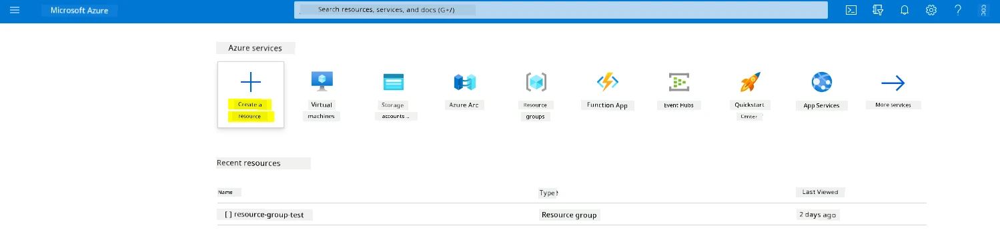

   Search for Machine Learning and select the Machine Learning tile.

   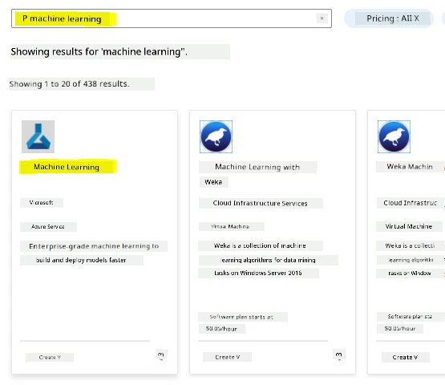

   Click the create button.

   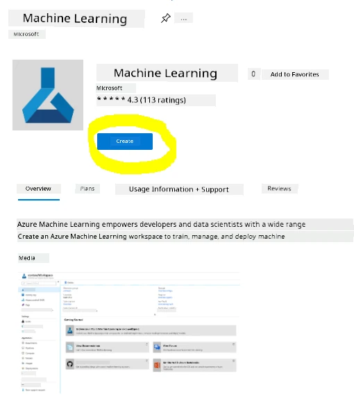

   Fill in the settings as follows:
   - Subscription: Your Azure subscription
   - Resource group: Create or select a resource group
   - Workspace name: Enter a unique name for your workspace
   - Region: Select the geographical region closest to you
   - Storage account: Note the default new storage account that will be created for your workspace
   - Key vault: Note the default new key vault that will be created for your workspace
   - Application insights: Note the default new application insights resource that will be created for your workspace
   - Container registry: None (one will be created automatically the first time you deploy a model to a container)

    

   - Click **Review + create**, then click the **Create** button.
3. Wait for your workspace to be created (this may take a few minutes). Once ready, navigate to it in the portal. You can find it under the Machine Learning Azure service.
4. On the Overview page for your workspace, launch Azure Machine Learning Studio (or open a new browser tab and go to https://ml.azure.com). Sign in using your Microsoft account. If prompted, select your Azure directory, subscription, and workspace.
   
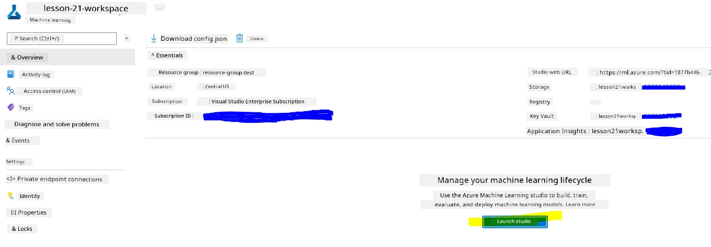

5. In Azure Machine Learning Studio, click the ☰ icon at the top left to explore the various pages in the interface. These pages allow you to manage the resources in your workspace.


While you can manage your workspace through the Azure portal, Azure Machine Learning Studio provides a more user-friendly interface tailored for data scientists and machine learning engineers.

### 2.2 Compute Resources

Compute resources are cloud-based environments where you can run model training and data exploration tasks. There are four types of compute resources you can create:

- **Compute Instances**: Development workstations for data scientists to work with data and models. This involves creating a Virtual Machine (VM) and launching a notebook instance. Models can then be trained by calling a compute cluster from the notebook.
- **Compute Clusters**: Scalable clusters of VMs for running experiment code on demand. These are essential for model training and can include specialized GPU or CPU resources.
- **Inference Clusters**: Deployment targets for predictive services using trained models.
- **Attached Compute**: Links to existing Azure compute resources, such as Virtual Machines or Azure Databricks clusters.

#### 2.2.1 Choosing the right options for your compute resources

There are several important factors to consider when creating a compute resource, and these choices can be critical decisions.

**Do you need CPU or GPU?**

A CPU (Central Processing Unit) is the electronic circuitry that executes instructions in a computer program. A GPU (Graphics Processing Unit) is a specialized electronic circuit designed to execute graphics-related code at a very high rate.

The main difference between CPU and GPU architecture is that a CPU is optimized for handling a wide range of tasks quickly (as measured by CPU clock speed), but it has limited concurrency for running tasks. GPUs, on the other hand, are designed for parallel computing and are much better suited for deep learning tasks.

| CPU                                     | GPU                         |
|-----------------------------------------|-----------------------------|
| Less expensive                          | More expensive              |
| Lower level of concurrency              | Higher level of concurrency |
| Slower in training deep learning models | Optimal for deep learning   |

**Cluster Size**

Larger clusters are more expensive but provide better responsiveness. If you have time but limited funds, start with a small cluster. Conversely, if you have funds but limited time, opt for a larger cluster.

**VM Size**

Depending on your time and budget constraints, you can adjust the size of your RAM, disk, number of cores, and clock speed. Increasing these parameters will be more expensive but will result in better performance.

**Dedicated or Low-Priority Instances?**

A low-priority instance is interruptible, meaning Microsoft Azure can reassign those resources to another task, interrupting your job. A dedicated instance, or non-interruptible instance, ensures your job will not be terminated without your permission. This is another consideration of time versus cost, as interruptible instances are less expensive than dedicated ones.

#### 2.2.2 Creating a compute cluster

In the [Azure ML workspace](https://ml.azure.com/) we created earlier, navigate to the "Compute" section to view the different compute resources we discussed (e.g., compute instances, compute clusters, inference clusters, and attached compute). For this project, we need a compute cluster for model training. In the Studio, click on the "Compute" menu, then the "Compute cluster" tab, and click the "+ New" button to create a compute cluster.


1. Choose your options: Dedicated vs Low priority, CPU or GPU, VM size, and core number (you can keep the default settings for this project).
2. Click the "Next" button.

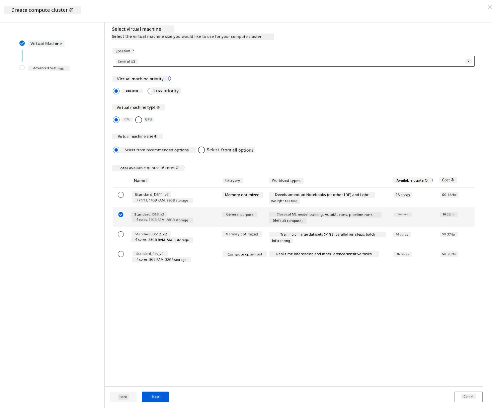

3. Assign a name to the cluster.
4. Choose your options: Minimum/Maximum number of nodes, idle seconds before scale-down, SSH access. Note that setting the minimum number of nodes to 0 will save money when the cluster is idle. A higher maximum number of nodes will shorten training time. The recommended maximum number of nodes is 3.  
5. Click the "Create" button. This step may take a few minutes.

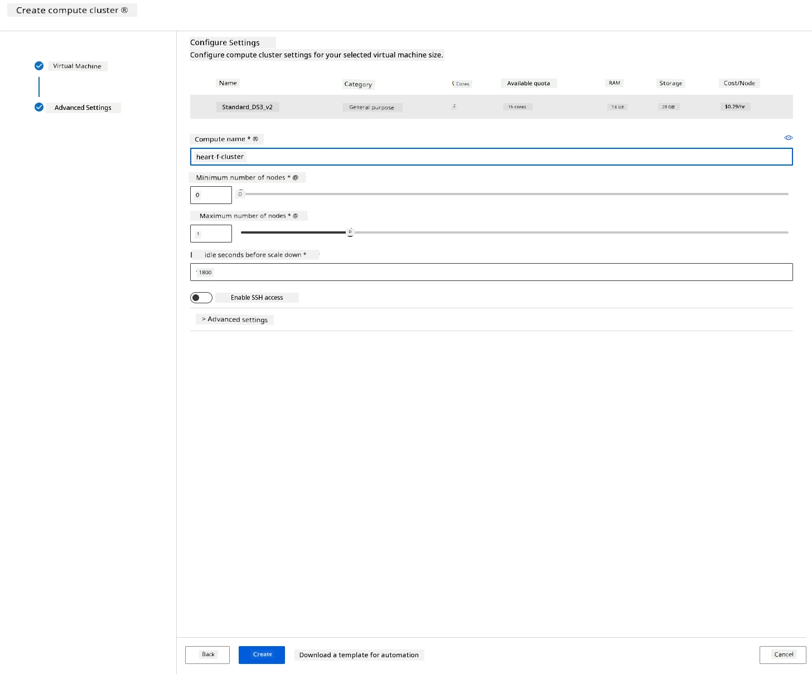

Great! Now that we have a compute cluster, we need to load the data into Azure ML Studio.

### 2.3 Loading the Dataset

1. In the [Azure ML workspace](https://ml.azure.com/) we created earlier, click on "Datasets" in the left menu and then click the "+ Create dataset" button to create a dataset. Choose the "From local files" option and select the Kaggle dataset we downloaded earlier.
   
   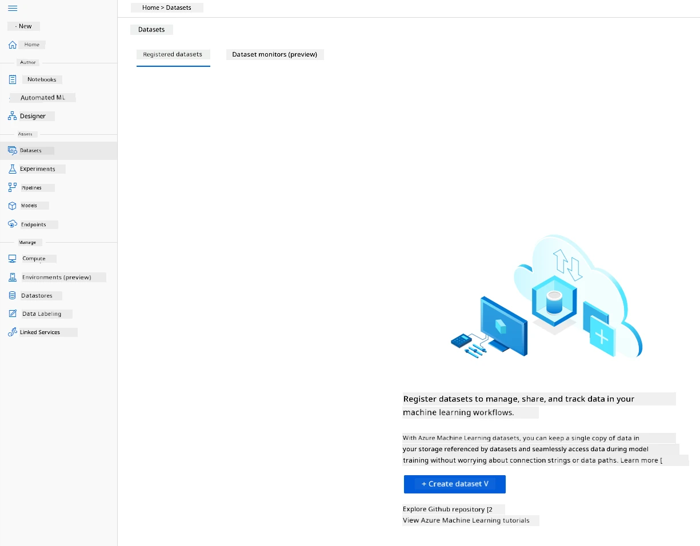

2. Assign a name, type, and description to your dataset. Click "Next." Upload the data from files. Click "Next."
   
   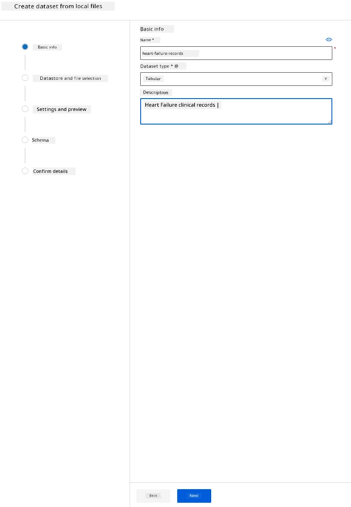

3. In the Schema section, change the data type to Boolean for the following features: anaemia, diabetes, high blood pressure, sex, smoking, and DEATH_EVENT. Click "Next" and then "Create."
   
   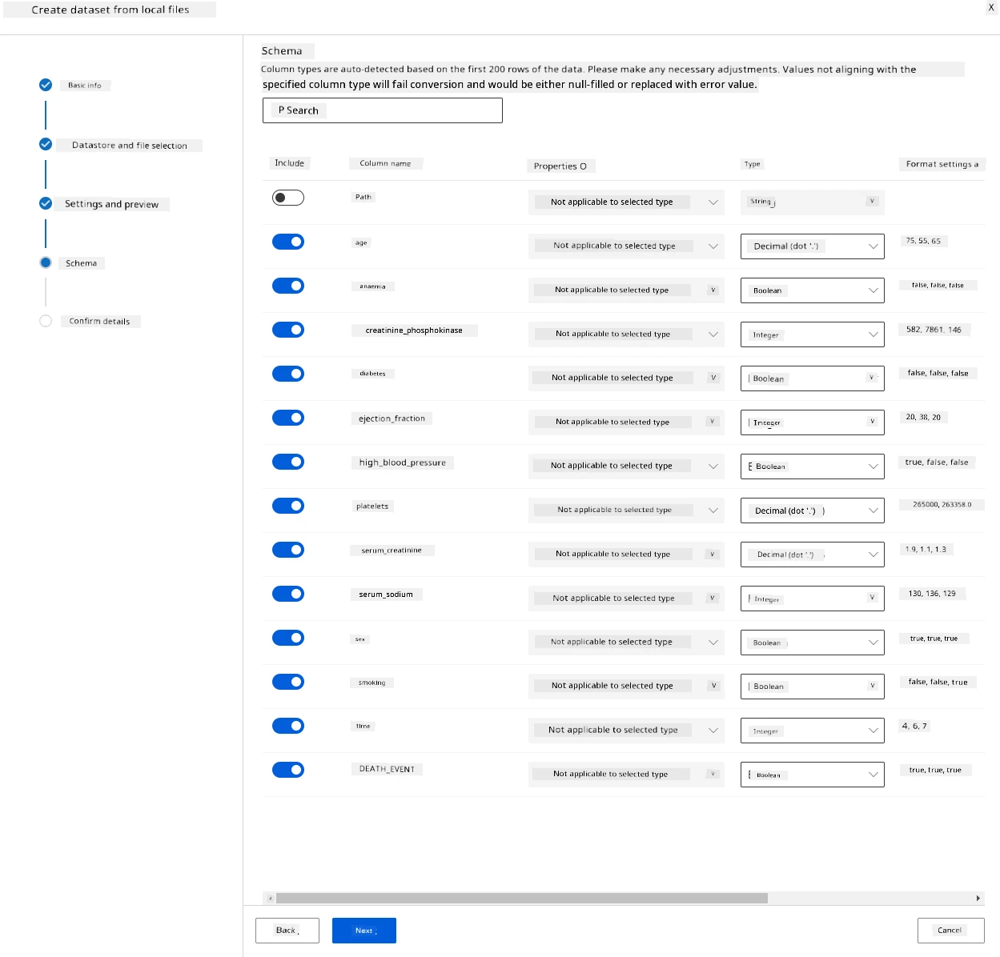

Fantastic! Now that the dataset is ready and the compute cluster is created, we can start training the model!

### 2.4 Low code/No Code training with AutoML 

Traditional machine learning model development is resource-intensive, requiring significant domain knowledge and time to produce and compare dozens of models. Automated machine learning (AutoML) automates the time-consuming, iterative tasks of machine learning model development. It enables data scientists, analysts, and developers to build ML models at scale, efficiently, and productively, while maintaining model quality. AutoML reduces the time needed to create production-ready ML models with ease and efficiency. [Learn more](https://docs.microsoft.com/azure/machine-learning/concept-automated-ml?WT.mc_id=academic-77958-bethanycheum&ocid=AID3041109)

1. In the [Azure ML workspace](https://ml.azure.com/) we created earlier, click on "Automated ML" in the left menu and select the dataset you just uploaded. Click "Next."

   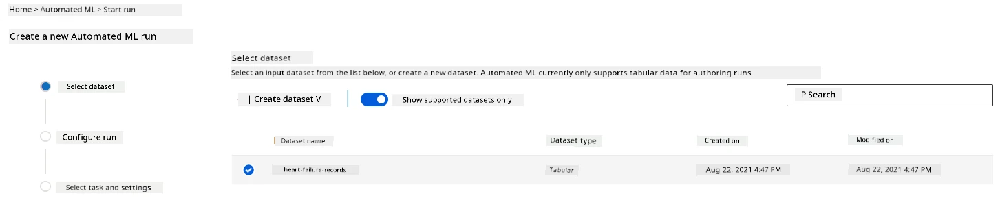

2. Enter a new experiment name, the target column (DEATH_EVENT), and the compute cluster we created. Click "Next."
   
   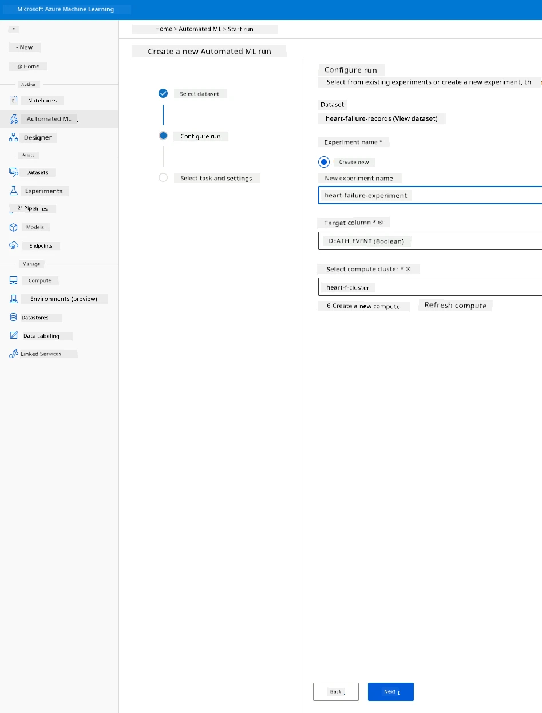

3. Choose "Classification" and click "Finish." This step may take between 30 minutes to 1 hour, depending on your compute cluster size.
    
    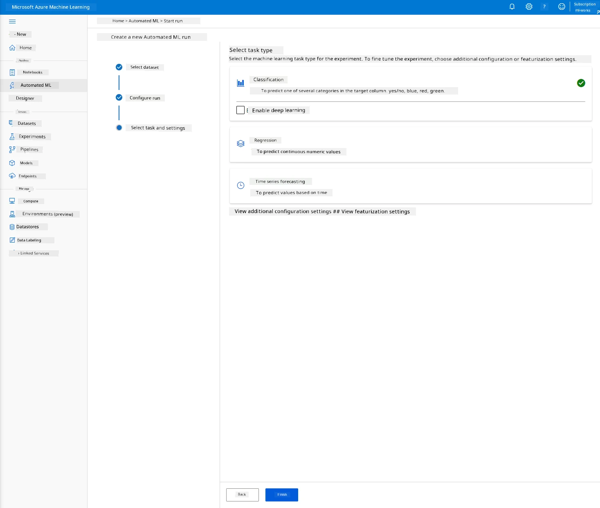

4. Once the run is complete, click on the "Automated ML" tab, select your run, and click on the algorithm in the "Best model summary" card.
    
    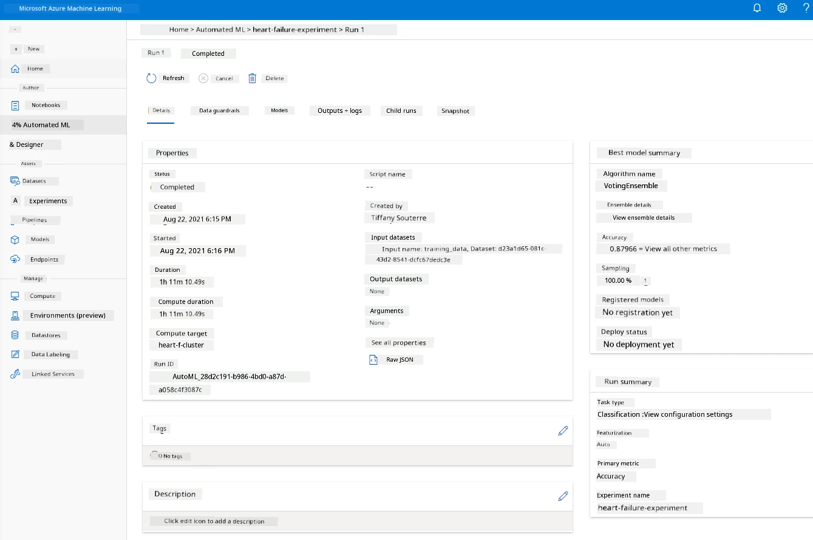

Here, you can view a detailed description of the best model AutoML generated. You can also explore other models in the "Models" tab. Take a few minutes to explore the models in the "Explanations (preview)" section. Once you've chosen the model you want to use (in this case, we'll select the best model chosen by AutoML), we'll proceed to deploy it.

## 3. Low code/No Code model deployment and endpoint consumption
### 3.1 Model deployment

The automated machine learning interface allows you to deploy the best model as a web service in just a few steps. Deployment integrates the model so it can make predictions based on new data and identify potential opportunities. For this project, deploying to a web service means medical applications can use the model to make live predictions about patients' risk of heart failure.

In the best model description, click the "Deploy" button.
    


15. Assign a name, description, compute type (Azure Container Instance), enable authentication, and click "Deploy." This step may take about 20 minutes to complete. The deployment process involves several steps, including registering the model, generating resources, and configuring them for the web service. A status message appears under "Deploy status." Select "Refresh" periodically to check the deployment status. The status will show "Healthy" once the deployment is complete and running.

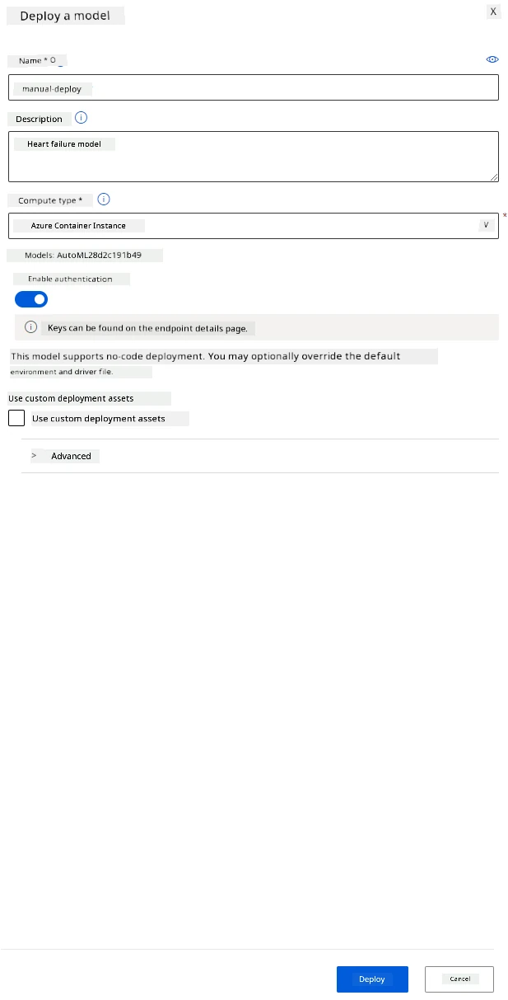

16. Once deployed, click on the "Endpoint" tab and select the endpoint you just deployed. Here, you can find all the details about the endpoint.

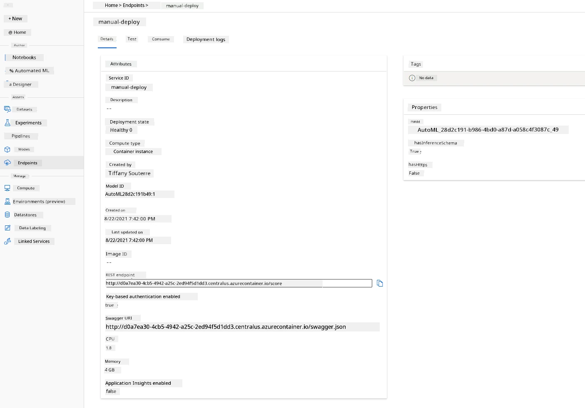

Amazing! Now that the model is deployed, we can start consuming the endpoint.

### 3.2 Endpoint consumption

Click on the "Consume" tab. Here, you'll find the REST endpoint and a Python script in the consumption section. Take some time to review the Python code.

This script can be run directly from your local machine to consume your endpoint.

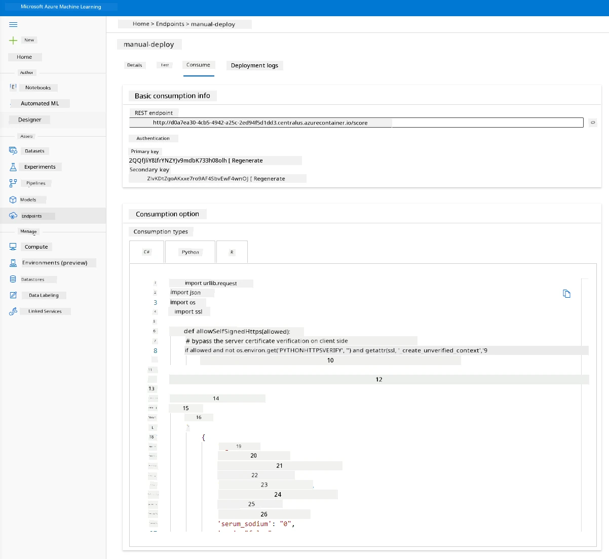

Take a moment to review these two lines of code: 

```python
url = 'http://98e3715f-xxxx-xxxx-xxxx-9ec22d57b796.centralus.azurecontainer.io/score'
api_key = '' # Replace this with the API key for the web service
```
The `url` variable contains the REST endpoint found in the "Consume" tab, and the `api_key` variable contains the primary key also found in the "Consume" tab (only if authentication is enabled). This is how the script consumes the endpoint.

18. Running the script should produce the following output:
    ```python
    b'"{\\"result\\": [true]}"'
    ```
This indicates that the prediction of heart failure for the given data is true. This makes sense because, by default, all values in the script are set to 0 and false. You can modify the data using the following input sample:

```python
data = {
    "data":
    [
        {
            'age': "0",
            'anaemia': "false",
            'creatinine_phosphokinase': "0",
            'diabetes': "false",
            'ejection_fraction': "0",
            'high_blood_pressure': "false",
            'platelets': "0",
            'serum_creatinine': "0",
            'serum_sodium': "0",
            'sex': "false",
            'smoking': "false",
            'time': "0",
        },
        {
            'age': "60",
            'anaemia': "false",
            'creatinine_phosphokinase': "500",
            'diabetes': "false",
            'ejection_fraction': "38",
            'high_blood_pressure': "false",
            'platelets': "260000",
            'serum_creatinine': "1.40",
            'serum_sodium': "137",
            'sex': "false",
            'smoking': "false",
            'time': "130",
        },
    ],
}
```
The script should return:
    ```python
    b'"{\\"result\\": [true, false]}"'
    ```

Congratulations! You've successfully consumed the deployed model and trained it on Azure ML!

> **_NOTE:_** Once you're done with the project, don't forget to delete all the resources.

## 🚀 Challenge

Examine the model explanations and details AutoML generated for the top models. Try to understand why the best model outperformed the others. What algorithms were compared? What are the differences between them? Why is the best model performing better in this case?

## [Post-lecture quiz](https://ff-quizzes.netlify.app/en/ds/quiz/35)

## Review & Self Study

In this lesson, you learned how to train, deploy, and consume a model to predict heart failure risk using a Low code/No code approach in the cloud. If you haven't already, dive deeper into the model explanations AutoML generated for the top models and try to understand why the best model is better than the others.

Explore more about Low code/No code AutoML by reading this [documentation](https://docs.microsoft.com/azure/machine-learning/tutorial-first-experiment-automated-ml?WT.mc_id=academic-77958-bethanycheum&ocid=AID3041109).

## Assignment

[Low code/No code Data Science project on Azure ML](assignment.md)

---

**Disclaimer**:  
This document has been translated using the AI translation service [Co-op Translator](https://github.com/Azure/co-op-translator). While we strive for accuracy, please note that automated translations may contain errors or inaccuracies. The original document in its native language should be regarded as the authoritative source. For critical information, professional human translation is recommended. We are not responsible for any misunderstandings or misinterpretations resulting from the use of this translation.