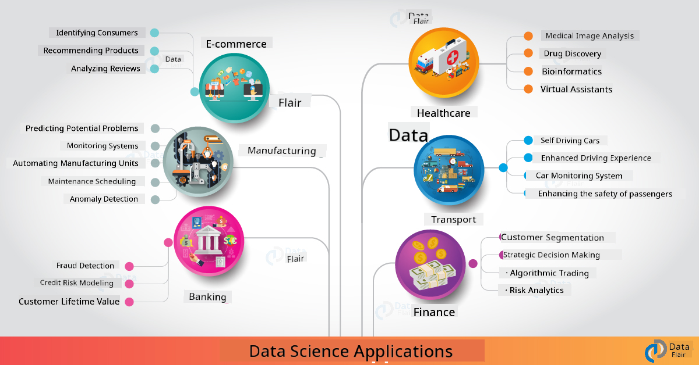

<!--
CO_OP_TRANSLATOR_METADATA:
{
  "original_hash": "06bac7959b46b6e8aedcae014278c476",
  "translation_date": "2025-09-06T10:14:29+00:00",
  "source_file": "6-Data-Science-In-Wild/20-Real-World-Examples/README.md",
  "language_code": "en"
}
-->
# Data Science in the Real World

|  ](../../sketchnotes/20-DataScience-RealWorld.png) |
| :--------------------------------------------------------------------------------------------------------------: |
|               Data Science In The Real World - _Sketchnote by [@nitya](https://twitter.com/nitya)_               |

We're nearing the end of this learning journey!

We began by defining data science and ethics, explored various tools and techniques for data analysis and visualization, reviewed the data science lifecycle, and examined how to scale and automate workflows using cloud computing services. Now, you might be wondering: _"How do I apply all these learnings to real-world scenarios?"_

In this lesson, we'll delve into real-world applications of data science across industries and explore specific examples in research, digital humanities, and sustainability. We'll also discuss student project opportunities and wrap up with resources to help you continue your learning journey.

## Pre-Lecture Quiz

## [Pre-lecture quiz](https://ff-quizzes.netlify.app/en/ds/quiz/38)

## Data Science + Industry

The democratization of AI has made it easier for developers to design and integrate AI-driven decision-making and data-driven insights into user experiences and development workflows. Here are some examples of how data science is applied in real-world industry contexts:

 * [Google Flu Trends](https://www.wired.com/2015/10/can-learn-epic-failure-google-flu-trends/) used data science to correlate search terms with flu trends. Although the approach had flaws, it highlighted the potential (and challenges) of data-driven healthcare predictions.

 * [UPS Routing Predictions](https://www.technologyreview.com/2018/11/21/139000/how-ups-uses-ai-to-outsmart-bad-weather/) - explains how UPS uses data science and machine learning to predict optimal delivery routes, factoring in weather conditions, traffic patterns, delivery deadlines, and more.

 * [NYC Taxicab Route Visualization](http://chriswhong.github.io/nyctaxi/) - data obtained through [Freedom Of Information Laws](https://chriswhong.com/open-data/foil_nyc_taxi/) was used to visualize a day in the life of NYC cabs, providing insights into navigation patterns, earnings, and trip durations over a 24-hour period.

 * [Uber Data Science Workbench](https://eng.uber.com/dsw/) - leverages data from millions of daily Uber trips (pickup/dropoff locations, trip durations, preferred routes, etc.) to build analytics tools for pricing, safety, fraud detection, and navigation decisions.

 * [Sports Analytics](https://towardsdatascience.com/scope-of-analytics-in-sports-world-37ed09c39860) - focuses on _predictive analytics_ (team and player analysis, like [Moneyball](https://datasciencedegree.wisconsin.edu/blog/moneyball-proves-importance-big-data-big-ideas/), and fan management) and _data visualization_ (team dashboards, fan engagement, etc.) with applications in talent scouting, sports betting, and venue management.

 * [Data Science in Banking](https://data-flair.training/blogs/data-science-in-banking/) - showcases the role of data science in finance, including risk modeling, fraud detection, customer segmentation, real-time predictions, and recommender systems. Predictive analytics also drive critical metrics like [credit scores](https://dzone.com/articles/using-big-data-and-predictive-analytics-for-credit).

 * [Data Science in Healthcare](https://data-flair.training/blogs/data-science-in-healthcare/) - highlights applications such as medical imaging (MRI, X-Ray, CT-Scan), genomics (DNA sequencing), drug development (risk assessment, success prediction), predictive analytics (patient care and logistics), disease tracking, and prevention.

 Image Credit: [Data Flair: 6 Amazing Data Science Applications ](https://data-flair.training/blogs/data-science-applications/)

The figure illustrates other domains and examples of applying data science techniques. Interested in exploring more applications? Check out the [Review & Self Study](../../../../6-Data-Science-In-Wild/20-Real-World-Examples) section below.

## Data Science + Research

|  ](../../sketchnotes/20-DataScience-Research.png) |
| :---------------------------------------------------------------------------------------------------------------: |
|              Data Science & Research - _Sketchnote by [@nitya](https://twitter.com/nitya)_              |

While industry applications often focus on large-scale use cases, research projects can be valuable for two reasons:

* _Innovation opportunities_ - enable rapid prototyping of advanced concepts and testing of user experiences for next-generation applications.
* _Deployment challenges_ - investigate potential harms or unintended consequences of data science technologies in real-world scenarios.

For students, research projects offer learning and collaboration opportunities that deepen understanding and foster connections with experts or teams working in areas of interest. So, what do research projects look like, and how can they make an impact?

Consider the [MIT Gender Shades Study](http://gendershades.org/overview.html) by Joy Buolamwini (MIT Media Labs) and Timnit Gebru (then at Microsoft Research), which produced a [signature research paper](http://proceedings.mlr.press/v81/buolamwini18a/buolamwini18a.pdf):

 * **What:** The study aimed to _evaluate bias in automated facial analysis algorithms and datasets_ based on gender and skin type.
 * **Why:** Facial analysis is used in contexts like law enforcement, airport security, and hiring systems, where inaccurate classifications (e.g., due to bias) can lead to economic and social harm. Addressing bias is crucial for fairness.
 * **How:** Researchers noted that existing benchmarks predominantly featured lighter-skinned subjects. They curated a new dataset (1000+ images) balanced by gender and skin type, which was used to assess the accuracy of three gender classification products (Microsoft, IBM, Face++).

Results revealed that while overall accuracy was good, error rates varied significantly across subgroups, with **misgendering** being higher for females and individuals with darker skin tones, indicating bias.

**Key Outcomes:** The study underscored the need for more _representative datasets_ (balanced subgroups) and _inclusive teams_ (diverse backgrounds) to identify and address biases early in AI solutions. Such research also informs principles and practices for _responsible AI_ to enhance fairness in AI products and processes.

**Want to learn about relevant research efforts at Microsoft?**

* Explore [Microsoft Research Projects](https://www.microsoft.com/research/research-area/artificial-intelligence/?facet%5Btax%5D%5Bmsr-research-area%5D%5B%5D=13556&facet%5Btax%5D%5Bmsr-content-type%5D%5B%5D=msr-project) on Artificial Intelligence.
* Check out student projects from [Microsoft Research Data Science Summer School](https://www.microsoft.com/en-us/research/academic-program/data-science-summer-school/).
* Learn about the [Fairlearn](https://fairlearn.org/) project and [Responsible AI](https://www.microsoft.com/en-us/ai/responsible-ai?activetab=pivot1%3aprimaryr6) initiatives.

## Data Science + Humanities

|  ](../../sketchnotes/20-DataScience-Humanities.png) |
| :---------------------------------------------------------------------------------------------------------------: |
|              Data Science & Digital Humanities - _Sketchnote by [@nitya](https://twitter.com/nitya)_              |

Digital Humanities [is defined](https://digitalhumanities.stanford.edu/about-dh-stanford) as "a collection of practices and approaches combining computational methods with humanistic inquiry." [Stanford projects](https://digitalhumanities.stanford.edu/projects) like _"rebooting history"_ and _"poetic thinking"_ demonstrate the connection between [Digital Humanities and Data Science](https://digitalhumanities.stanford.edu/digital-humanities-and-data-science), emphasizing techniques like network analysis, information visualization, spatial analysis, and text analysis to revisit historical and literary datasets for new insights.

*Want to explore and extend a project in this field?*

Check out ["Emily Dickinson and the Meter of Mood"](https://gist.github.com/jlooper/ce4d102efd057137bc000db796bfd671) by [Jen Looper](https://twitter.com/jenlooper), which uses data science to reinterpret familiar poetry and examine its meaning in new contexts. For example, _can we predict the season in which a poem was written by analyzing its tone or sentiment?_ What does this reveal about the author's mindset during that time?

To answer this, follow the steps of the data science lifecycle:
 * [`Data Acquisition`](https://gist.github.com/jlooper/ce4d102efd057137bc000db796bfd671#acquiring-the-dataset) - collect a relevant dataset for analysis using APIs (e.g., [Poetry DB API](https://poetrydb.org/index.html)) or web scraping tools (e.g., [Project Gutenberg](https://www.gutenberg.org/files/12242/12242-h/12242-h.htm)).
 * [`Data Cleaning`](https://gist.github.com/jlooper/ce4d102efd057137bc000db796bfd671#clean-the-data) - format, sanitize, and simplify text using tools like Visual Studio Code and Microsoft Excel.
 * [`Data Analysis`](https://gist.github.com/jlooper/ce4d102efd057137bc000db796bfd671#working-with-the-data-in-a-notebook) - import the dataset into "Notebooks" for analysis using Python packages (e.g., pandas, numpy, matplotlib) to organize and visualize the data.
 * [`Sentiment Analysis`](https://gist.github.com/jlooper/ce4d102efd057137bc000db796bfd671#sentiment-analysis-using-cognitive-services) - integrate cloud services like Text Analytics and use low-code tools like [Power Automate](https://flow.microsoft.com/en-us/) for automated workflows.

This workflow allows you to explore seasonal impacts on poem sentiment and develop your own interpretations of the author. Try it yourself, then extend the notebook to ask new questions or visualize the data differently!

> Use tools from the [Digital Humanities toolkit](https://github.com/Digital-Humanities-Toolkit) to pursue these inquiries.

## Data Science + Sustainability

|  ](../../sketchnotes/20-DataScience-Sustainability.png) |
| :---------------------------------------------------------------------------------------------------------------: |
|              Data Science & Sustainability - _Sketchnote by [@nitya](https://twitter.com/nitya)_              |

The [2030 Agenda For Sustainable Development](https://sdgs.un.org/2030agenda), adopted by all United Nations members in 2015, outlines 17 goals, including those aimed at **Protecting the Planet** from degradation and climate change. The [Microsoft Sustainability](https://www.microsoft.com/en-us/sustainability) initiative supports these goals by exploring technology solutions to build a more sustainable future, focusing on [four key objectives](https://dev.to/azure/a-visual-guide-to-sustainable-software-engineering-53hh): being carbon negative, water positive, zero waste, and bio-diverse by 2030.

Addressing these challenges at scale requires cloud-scale thinking and large datasets. The [Planetary Computer](https://planetarycomputer.microsoft.com/) initiative offers four components to assist data scientists and developers:

 * [Data Catalog](https://planetarycomputer.microsoft.com/catalog) - provides petabytes of Earth Systems data (free and Azure-hosted).
 * [Planetary API](https://planetarycomputer.microsoft.com/docs/reference/stac/) - enables users to search for relevant data across space and time.
 * [Hub](https://planetarycomputer.microsoft.com/docs/overview/environment/) - a managed environment for processing massive geospatial datasets.
 * [Applications](https://planetarycomputer.microsoft.com/applications) - showcases use cases and tools for sustainability insights.
**The Planetary Computer Project is currently in preview (as of Sep 2021)** - here's how you can start contributing to sustainability solutions using data science.

* [Request access](https://planetarycomputer.microsoft.com/account/request) to begin exploring and connect with others.
* [Explore documentation](https://planetarycomputer.microsoft.com/docs/overview/about) to learn about supported datasets and APIs.
* Check out applications like [Ecosystem Monitoring](https://analytics-lab.org/ecosystemmonitoring/) for inspiration on project ideas.

Consider how you can use data visualization to highlight or amplify insights related to issues like climate change and deforestation. Or think about how these insights can be leveraged to design new user experiences that encourage behavioral changes for more sustainable living.

## Data Science + Students

We've discussed real-world applications in industry and research, and looked at examples of data science applications in digital humanities and sustainability. So how can you develop your skills and share your knowledge as beginners in data science?

Here are some examples of student data science projects to inspire you:

 * [MSR Data Science Summer School](https://www.microsoft.com/en-us/research/academic-program/data-science-summer-school/#!projects) with GitHub [projects](https://github.com/msr-ds3) exploring topics such as:
    - [Racial Bias in Police Use of Force](https://www.microsoft.com/en-us/research/video/data-science-summer-school-2019-replicating-an-empirical-analysis-of-racial-differences-in-police-use-of-force/) | [Github](https://github.com/msr-ds3/stop-question-frisk)
    - [Reliability of NYC Subway System](https://www.microsoft.com/en-us/research/video/data-science-summer-school-2018-exploring-the-reliability-of-the-nyc-subway-system/) | [Github](https://github.com/msr-ds3/nyctransit)
 * [Digitizing Material Culture: Exploring socio-economic distributions in Sirkap](https://claremont.maps.arcgis.com/apps/Cascade/index.html?appid=bdf2aef0f45a4674ba41cd373fa23afc) - by [Ornella Altunyan](https://twitter.com/ornelladotcom) and her team at Claremont, using [ArcGIS StoryMaps](https://storymaps.arcgis.com/).

## 🚀 Challenge

Look for articles that suggest beginner-friendly data science projects - like [these 50 topic areas](https://www.upgrad.com/blog/data-science-project-ideas-topics-beginners/), [these 21 project ideas](https://www.intellspot.com/data-science-project-ideas), or [these 16 projects with source code](https://data-flair.training/blogs/data-science-project-ideas/) that you can analyze and adapt. And don't forget to blog about your learning experiences and share your insights with the community.

## Post-Lecture Quiz

## [Post-lecture quiz](https://ff-quizzes.netlify.app/en/ds/quiz/39)

## Review & Self Study

Want to dive deeper into use cases? Here are some relevant articles:
 * [17 Data Science Applications and Examples](https://builtin.com/data-science/data-science-applications-examples) - Jul 2021
 * [11 Breathtaking Data Science Applications in Real World](https://myblindbird.com/data-science-applications-real-world/) - May 2021
 * [Data Science In The Real World](https://towardsdatascience.com/data-science-in-the-real-world/home) - Article Collection
 * Data Science In: [Education](https://data-flair.training/blogs/data-science-in-education/), [Agriculture](https://data-flair.training/blogs/data-science-in-agriculture/), [Finance](https://data-flair.training/blogs/data-science-in-finance/), [Movies](https://data-flair.training/blogs/data-science-at-movies/) & more.

## Assignment

[Explore A Planetary Computer Dataset](assignment.md)

---

**Disclaimer**:  
This document has been translated using the AI translation service [Co-op Translator](https://github.com/Azure/co-op-translator). While we aim for accuracy, please note that automated translations may include errors or inaccuracies. The original document in its native language should be regarded as the authoritative source. For critical information, professional human translation is advised. We are not responsible for any misunderstandings or misinterpretations resulting from the use of this translation.