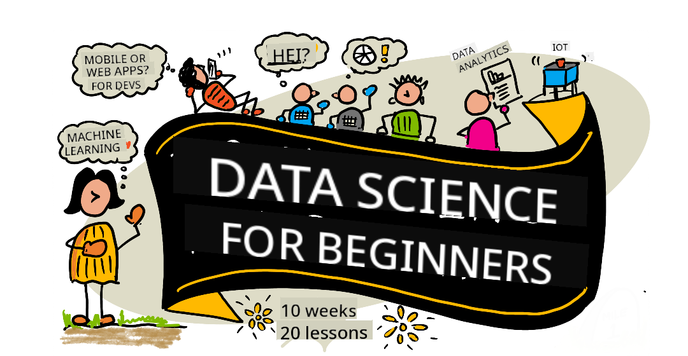

<!--
CO_OP_TRANSLATOR_METADATA:
{
  "original_hash": "7c31d1a22c746b1d0f0582d4f54702ba",
  "translation_date": "2025-12-24T22:30:45+00:00",
  "source_file": "README.md",
  "language_code": "en"
}
-->
# Data Science for Beginners - A Curriculum

Azure Cloud Advocates at Microsoft are pleased to offer a 10-week, 20-lesson curriculum all about Data Science. Each lesson includes pre-lesson and post-lesson quizzes, written instructions to complete the lesson, a solution, and an assignment. Our project-based pedagogy allows you to learn while building, a proven way for new skills to 'stick'.

**Hearty thanks to our authors:** [Jasmine Greenaway](https://www.twitter.com/paladique), [Dmitry Soshnikov](http://soshnikov.com), [Nitya Narasimhan](https://twitter.com/nitya), [Jalen McGee](https://twitter.com/JalenMcG), [Jen Looper](https://twitter.com/jenlooper), [Maud Levy](https://twitter.com/maudstweets), [Tiffany Souterre](https://twitter.com/TiffanySouterre), [Christopher Harrison](https://www.twitter.com/geektrainer).

**🙏 Special thanks 🙏 to our [Microsoft Student Ambassador](https://studentambassadors.microsoft.com/) authors, reviewers and content contributors,** notably Aaryan Arora, [Aditya Garg](https://github.com/AdityaGarg00), [Alondra Sanchez](https://www.linkedin.com/in/alondra-sanchez-molina/), [Ankita Singh](https://www.linkedin.com/in/ankitasingh007), [Anupam Mishra](https://www.linkedin.com/in/anupam--mishra/), [Arpita Das](https://www.linkedin.com/in/arpitadas01/), ChhailBihari Dubey, [Dibri Nsofor](https://www.linkedin.com/in/dibrinsofor), [Dishita Bhasin](https://www.linkedin.com/in/dishita-bhasin-7065281bb), [Majd Safi](https://www.linkedin.com/in/majd-s/), [Max Blum](https://www.linkedin.com/in/max-blum-6036a1186/), [Miguel Correa](https://www.linkedin.com/in/miguelmque/), [Mohamma Iftekher (Iftu) Ebne Jalal](https://twitter.com/iftu119), [Nawrin Tabassum](https://www.linkedin.com/in/nawrin-tabassum), [Raymond Wangsa Putra](https://www.linkedin.com/in/raymond-wp/), [Rohit Yadav](https://www.linkedin.com/in/rty2423), Samridhi Sharma, [Sanya Sinha](https://www.linkedin.com/mwlite/in/sanya-sinha-13aab1200),
[Sheena Narula](https://www.linkedin.com/in/sheena-narua-n/), [Tauqeer Ahmad](https://www.linkedin.com/in/tauqeerahmad5201/), Yogendrasingh Pawar , [Vidushi Gupta](https://www.linkedin.com/in/vidushi-gupta07/), [Jasleen Sondhi](https://www.linkedin.com/in/jasleen-sondhi/)

||
|:---:|
| Data Science For Beginners - _Sketchnote by [@nitya](https://twitter.com/nitya)_ |

### 🌐 Multi-Language Support

#### Supported via GitHub Action (Automated & Always Up-to-Date)

<!-- CO-OP TRANSLATOR LANGUAGES TABLE START -->
[Arabic](../ar/README.md) | [Bengali](../bn/README.md) | [Bulgarian](../bg/README.md) | [Burmese (Myanmar)](../my/README.md) | [Chinese (Simplified)](../zh/README.md) | [Chinese (Traditional, Hong Kong)](../hk/README.md) | [Chinese (Traditional, Macau)](../mo/README.md) | [Chinese (Traditional, Taiwan)](../tw/README.md) | [Croatian](../hr/README.md) | [Czech](../cs/README.md) | [Danish](../da/README.md) | [Dutch](../nl/README.md) | [Estonian](../et/README.md) | [Finnish](../fi/README.md) | [French](../fr/README.md) | [German](../de/README.md) | [Greek](../el/README.md) | [Hebrew](../he/README.md) | [Hindi](../hi/README.md) | [Hungarian](../hu/README.md) | [Indonesian](../id/README.md) | [Italian](../it/README.md) | [Japanese](../ja/README.md) | [Kannada](../kn/README.md) | [Korean](../ko/README.md) | [Lithuanian](../lt/README.md) | [Malay](../ms/README.md) | [Malayalam](../ml/README.md) | [Marathi](../mr/README.md) | [Nepali](../ne/README.md) | [Nigerian Pidgin](../pcm/README.md) | [Norwegian](../no/README.md) | [Persian (Farsi)](../fa/README.md) | [Polish](../pl/README.md) | [Portuguese (Brazil)](../br/README.md) | [Portuguese (Portugal)](../pt/README.md) | [Punjabi (Gurmukhi)](../pa/README.md) | [Romanian](../ro/README.md) | [Russian](../ru/README.md) | [Serbian (Cyrillic)](../sr/README.md) | [Slovak](../sk/README.md) | [Slovenian](../sl/README.md) | [Spanish](../es/README.md) | [Swahili](../sw/README.md) | [Swedish](../sv/README.md) | [Tagalog (Filipino)](../tl/README.md) | [Tamil](../ta/README.md) | [Telugu](../te/README.md) | [Thai](../th/README.md) | [Turkish](../tr/README.md) | [Ukrainian](../uk/README.md) | [Urdu](../ur/README.md) | [Vietnamese](../vi/README.md)
<!-- CO-OP TRANSLATOR LANGUAGES TABLE END -->

**If you wish to have additional translations languages supported are listed [here](https://github.com/Azure/co-op-translator/blob/main/getting_started/supported-languages.md)**

#### Join Our Community 

We have a Discord learn with AI series ongoing, learn more and join us at [Learn with AI Series](https://aka.ms/learnwithai/discord) from 18 - 30 September, 2025. You will get tips and tricks of using GitHub Copilot for Data Science.

# Are you a student?

Get started with the following resources:

- [Student Hub page](https://docs.microsoft.com/en-gb/learn/student-hub?WT.mc_id=academic-77958-bethanycheum) In this page, you will find beginner resources, Student packs and even ways to get a free cert voucher. This is one page you want to bookmark and check from time to time as we switch out content at least monthly.
- [Microsoft Learn Student Ambassadors](https://studentambassadors.microsoft.com?WT.mc_id=academic-77958-bethanycheum) Join a global community of student ambassadors, this could be your way into Microsoft.

# Getting Started

## 📚 Documentation

- **[Installation Guide](INSTALLATION.md)** - Step-by-step setup instructions for beginners
- **[Usage Guide](USAGE.md)** - Examples and common workflows
- **[Troubleshooting](TROUBLESHOOTING.md)** - Solutions to common issues
- **[Contributing Guide](CONTRIBUTING.md)** - How to contribute to this project
- **[For Teachers](for-teachers.md)** - Teaching guidance and classroom resources

## 👨‍🎓 For Students
> **Complete Beginners**: New to data science? Start with our [beginner-friendly examples](examples/README.md)! These simple, well-commented examples will help you understand the basics before diving into the full curriculum.
> **[Students](https://aka.ms/student-page)**: to use this curriculum on your own, fork the entire repo and complete the exercises on your own, starting with a pre-lecture quiz.  Then read the lecture and complete the rest of the activities. Try to create the projects by comprehending the lessons rather than copying the solution code; however, that code is available in the /solutions folders in each project-oriented lesson. Another idea would be to form a study group with friends and go through the content together. For further study, we recommend [Microsoft Learn](https://docs.microsoft.com/en-us/users/jenlooper-2911/collections/qprpajyoy3x0g7?WT.mc_id=academic-77958-bethanycheum).

**Quick Start:**
1. Check the [Installation Guide](INSTALLATION.md) to set up your environment
2. Review the [Usage Guide](USAGE.md) to learn how to work with the curriculum
3. Start with Lesson 1 and work through sequentially
4. Join our [Discord community](https://aka.ms/ds4beginners/discord) for support

## 👩‍🏫 For Teachers

> **Teachers**: we have [included some suggestions](for-teachers.md) on how to use this curriculum.  We'd love your feedback [in our discussion forum](https://github.com/microsoft/Data-Science-For-Beginners/discussions)!

## Meet the Team

**Gif by** [Mohit Jaisal](https://www.linkedin.com/in/mohitjaisal)
> 🎥 Click the image above for a video about the project  the folks who created it!

## Pedagogy

We have chosen two pedagogical tenets while building this curriculum: ensuring that it is project-based and that it includes frequent quizzes. By the end of this series, students will have learned basic principles of data science, including ethical concepts, data preparation, different ways of working with data, data visualization, data analysis, real-world use cases of data science, and more.

In addition, a low-stakes quiz before a class sets the intention of the student towards learning a topic, while a second quiz after class ensures further retention. This curriculum was designed to be flexible and fun and can be taken in whole or in part. The projects start small and become increasingly complex by the end of the 10 week cycle.

> Find our [Code of Conduct](CODE_OF_CONDUCT.md), [Contributing](CONTRIBUTING.md),  [Translation](TRANSLATIONS.md) guidelines. We welcome your constructive feedback!

## Each lesson includes:

- Optional sketchnote
- Optional supplemental video
- Pre-lesson warmup quiz
- Written lesson
- For project-based lessons, step-by-step guides on how to build the project
- Knowledge checks
- A challenge
- Supplemental reading
- Assignment
- [Post-lesson quiz](https://ff-quizzes.netlify.app/en/)

> **A note about quizzes**: All quizzes are contained in the Quiz-App folder, for 40 total quizzes of three questions each. They are linked from within the lessons, but the quiz app can be run locally or deployed to Azure; follow the instruction in the `quiz-app` folder. They are gradually being localized.

## 🎓 Beginner-Friendly Examples

**New to Data Science?** We've created a special [examples directory](examples/README.md) with simple, well-commented code to help you get started:

- 🌟 **Hello World** - Your first data science program
- 📂 **Loading Data** - Learn to read and explore datasets
- 📊 **Simple Analysis** - Calculate statistics and find patterns
- 📈 **Basic Visualization** - Create charts and graphs
- 🔬 **Real-World Project** - Complete workflow from start to finish

Each example includes detailed comments explaining every step, making it perfect for absolute beginners!

👉 **[Start with the examples](examples/README.md)** 👈

## Lessons

||
|:---:|
| Data Science For Beginners: Roadmap - _Sketchnote by [@nitya](https://twitter.com/nitya)_ |

| Lesson Number | Topic | Lesson Grouping | Learning Objectives | Linked Lesson | Author |
| :-----------: | :----------------------------------------: | :--------------------------------------------------: | :-----------------------------------------------------------------------------------------------------------------------------------------------------------------------: | :---------------------------------------------------------------------: | :----: |
| 01 | Defining Data Science | [Introduction](1-Introduction/README.md) | Learn the basic concepts behind data science and how it’s related to artificial intelligence, machine learning, and big data. | [lesson](1-Introduction/01-defining-data-science/README.md) [video](https://youtu.be/beZ7Mb_oz9I) | [Dmitry](http://soshnikov.com) |
| 02 | Data Science Ethics | [Introduction](1-Introduction/README.md) | Data Ethics Concepts, Challenges & Frameworks. | [lesson](1-Introduction/02-ethics/README.md) | [Nitya](https://twitter.com/nitya) |
| 03 | Defining Data | [Introduction](1-Introduction/README.md) | How data is classified and its common sources. | [lesson](1-Introduction/03-defining-data/README.md) | [Jasmine](https://www.twitter.com/paladique) |
| 04 | Introduction to Statistics & Probability | [Introduction](1-Introduction/README.md) | The mathematical techniques of probability and statistics to understand data. | [lesson](1-Introduction/04-stats-and-probability/README.md) [video](https://youtu.be/Z5Zy85g4Yjw) | [Dmitry](http://soshnikov.com) |
| 05 | Working with Relational Data | [Working With Data](2-Working-With-Data/README.md) | Introduction to relational data and the basics of exploring and analyzing relational data with the Structured Query Language, also known as SQL (pronounced “see-quell”). | [lesson](2-Working-With-Data/05-relational-databases/README.md) | [Christopher](https://www.twitter.com/geektrainer) | | |
| 06 | Working with NoSQL Data | [Working With Data](2-Working-With-Data/README.md) | Introduction to non-relational data, its various types and the basics of exploring and analyzing document databases. | [lesson](2-Working-With-Data/06-non-relational/README.md) | [Jasmine](https://twitter.com/paladique)|
| 07 | Working with Python | [Working With Data](2-Working-With-Data/README.md) | Basics of using Python for data exploration with libraries such as Pandas. Foundational understanding of Python programming is recommended. | [lesson](2-Working-With-Data/07-python/README.md) [video](https://youtu.be/dZjWOGbsN4Y) | [Dmitry](http://soshnikov.com) |
| 08 | Data Preparation | [Working With Data](2-Working-With-Data/README.md) | Topics on data techniques for cleaning and transforming the data to handle challenges of missing, inaccurate, or incomplete data. | [lesson](2-Working-With-Data/08-data-preparation/README.md) | [Jasmine](https://www.twitter.com/paladique) |
| 09 | Visualizing Quantities | [Data Visualization](3-Data-Visualization/README.md) | Learn how to use Matplotlib to visualize bird data 🦆 | [lesson](3-Data-Visualization/09-visualization-quantities/README.md) | [Jen](https://twitter.com/jenlooper) |
| 10 | Visualizing Distributions of Data | [Data Visualization](3-Data-Visualization/README.md) | Visualizing observations and trends within an interval. | [lesson](3-Data-Visualization/10-visualization-distributions/README.md) | [Jen](https://twitter.com/jenlooper) |
| 11 | Visualizing Proportions | [Data Visualization](3-Data-Visualization/README.md) | Visualizing discrete and grouped percentages. | [lesson](3-Data-Visualization/11-visualization-proportions/README.md) | [Jen](https://twitter.com/jenlooper) |
| 12 | Visualizing Relationships | [Data Visualization](3-Data-Visualization/README.md) | Visualizing connections and correlations between sets of data and their variables. | [lesson](3-Data-Visualization/12-visualization-relationships/README.md) | [Jen](https://twitter.com/jenlooper) |
| 13 | Meaningful Visualizations | [Data Visualization](3-Data-Visualization/README.md) | Techniques and guidance for making your visualizations valuable for effective problem solving and insights. | [lesson](3-Data-Visualization/13-meaningful-visualizations/README.md) | [Jen](https://twitter.com/jenlooper) |
| 14 | Introduction to the Data Science lifecycle | [Lifecycle](4-Data-Science-Lifecycle/README.md) | Introduction to the data science lifecycle and its first step of acquiring and extracting data. | [lesson](4-Data-Science-Lifecycle/14-Introduction/README.md) | [Jasmine](https://twitter.com/paladique) |
| 15 | Analyzing | [Lifecycle](4-Data-Science-Lifecycle/README.md) | This phase of the data science lifecycle focuses on techniques to analyze data. | [lesson](4-Data-Science-Lifecycle/15-analyzing/README.md) | [Jasmine](https://twitter.com/paladique) | | |
| 16 | Communication | [Lifecycle](4-Data-Science-Lifecycle/README.md) | This phase of the data science lifecycle focuses on presenting the insights from the data in a way that makes it easier for decision makers to understand. | [lesson](4-Data-Science-Lifecycle/16-communication/README.md) | [Jalen](https://twitter.com/JalenMcG) | | |
| 17 | Data Science in the Cloud | [Cloud Data](5-Data-Science-In-Cloud/README.md) | This series of lessons introduces data science in the cloud and its benefits. | [lesson](5-Data-Science-In-Cloud/17-Introduction/README.md) | [Tiffany](https://twitter.com/TiffanySouterre) and [Maud](https://twitter.com/maudstweets) |
| 18 | Data Science in the Cloud | [Cloud Data](5-Data-Science-In-Cloud/README.md) | Training models using Low Code tools. |[lesson](5-Data-Science-In-Cloud/18-Low-Code/README.md) | [Tiffany](https://twitter.com/TiffanySouterre) and [Maud](https://twitter.com/maudstweets) |
| 19 | Data Science in the Cloud | [Cloud Data](5-Data-Science-In-Cloud/README.md) | Deploying models with Azure Machine Learning Studio. | [lesson](5-Data-Science-In-Cloud/19-Azure/README.md)| [Tiffany](https://twitter.com/TiffanySouterre) and [Maud](https://twitter.com/maudstweets) |
| 20 | Data Science in the Wild | [In the Wild](6-Data-Science-In-Wild/README.md) | Data science driven projects in the real world. | [lesson](6-Data-Science-In-Wild/20-Real-World-Examples/README.md) | [Nitya](https://twitter.com/nitya) |

## GitHub Codespaces

Follow these steps to open this sample in a Codespace:
1. Click the Code drop-down menu and select the Open with Codespaces option.
2. Select + New codespace at the bottom on the pane.
For more info, check out the [GitHub documentation](https://docs.github.com/en/codespaces/developing-in-codespaces/creating-a-codespace-for-a-repository#creating-a-codespace).

## VSCode Remote - Containers
Follow these steps to open this repo in a container using your local machine and VSCode using  the VS Code Remote - Containers extension:

1. If this is your first time using a development container, please ensure your system meets the pre-reqs (i.e. have Docker installed) in [the getting started documentation](https://code.visualstudio.com/docs/devcontainers/containers#_getting-started).

To use this repository, you can either open the repository in an isolated Docker volume:

**Note**: Under the hood, this will use the Remote-Containers: **Clone Repository in Container Volume...** command to clone the source code in a Docker volume instead of the local filesystem. [Volumes](https://docs.docker.com/storage/volumes/) are the preferred mechanism for persisting container data.

Or open a locally cloned or downloaded version of the repository:

- Clone this repository to your local filesystem.
- Press F1 and select the **Remote-Containers: Open Folder in Container...** command.
- Select the cloned copy of this folder, wait for the container to start, and try things out.

## Offline access

You can run this documentation offline by using [Docsify](https://docsify.js.org/#/). Fork this repo, [install Docsify](https://docsify.js.org/#/quickstart) on your local machine,  then in the root folder of this repo, type `docsify serve`. The website will be served on port 3000 on your localhost: `localhost:3000`.

> Note, notebooks will not be rendered via Docsify, so when you need to run a notebook, do that separately in VS Code running a Python kernel.

## Other Curricula

Our team produces other curricula! Check out:

<!-- CO-OP TRANSLATOR OTHER COURSES START -->
### LangChain

---

### Azure / Edge / MCP / Agents

---
 
### Generative AI Series

[-9333EA?style=for-the-badge&labelColor=E5E7EB&color=9333EA)](https://github.com/microsoft/Generative-AI-for-beginners-dotnet?WT.mc_id=academic-105485-koreyst)
[-C084FC?style=for-the-badge&labelColor=E5E7EB&color=C084FC)](https://github.com/microsoft/generative-ai-for-beginners-java?WT.mc_id=academic-105485-koreyst)
[-E879F9?style=for-the-badge&labelColor=E5E7EB&color=E879F9)](https://github.com/microsoft/generative-ai-with-javascript?WT.mc_id=academic-105485-koreyst)

---
 
### Core Learning

---
 
### Copilot Series

<!-- CO-OP TRANSLATOR OTHER COURSES END -->

## Getting Help

**Encountering issues?** Check our [Troubleshooting Guide](TROUBLESHOOTING.md) for solutions to common problems.

If you get stuck or have any questions about building AI apps. Join fellow learners and experienced developers in discussions about MCP. It's a supportive community where questions are welcome and knowledge is shared freely.

If you have product feedback or errors while building visit:

---

<!-- CO-OP TRANSLATOR DISCLAIMER START -->
Disclaimer:
This document has been translated using the AI translation service Co-op Translator (https://github.com/Azure/co-op-translator). While we strive for accuracy, please be aware that automated translations may contain errors or inaccuracies. The original document in its native language should be considered the authoritative source. For critical information, professional human translation is recommended. We are not liable for any misunderstandings or misinterpretations arising from the use of this translation.
<!-- CO-OP TRANSLATOR DISCLAIMER END -->