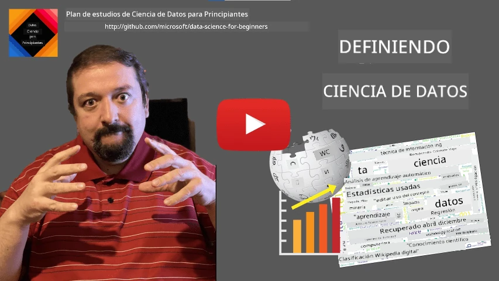
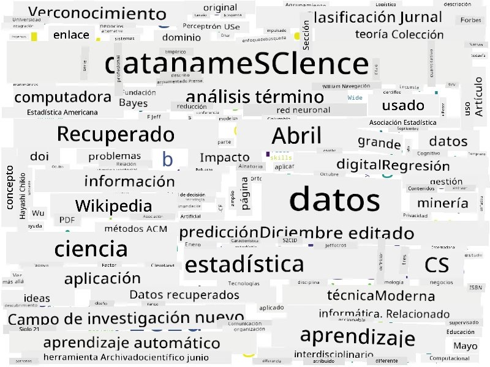

<!--
CO_OP_TRANSLATOR_METADATA:
{
  "original_hash": "43212cc1ac137b7bb1dcfb37ca06b0f4",
  "translation_date": "2025-10-25T18:33:46+00:00",
  "source_file": "1-Introduction/01-defining-data-science/README.md",
  "language_code": "es"
}
-->
# Definiendo Ciencia de Datos

|  ](../../sketchnotes/01-Definitions.png) |
| :----------------------------------------------------------------------------------------------------: |
|              Definiendo Ciencia de Datos - _Sketchnote por [@nitya](https://twitter.com/nitya)_        |

---

## [Cuestionario previo a la clase](https://ff-quizzes.netlify.app/en/ds/quiz/0)

## ¿Qué es un dato?
En nuestra vida cotidiana, estamos constantemente rodeados de datos. El texto que estás leyendo ahora es un dato. La lista de números de teléfono de tus amigos en tu smartphone es un dato, al igual que la hora actual que muestra tu reloj. Como seres humanos, naturalmente operamos con datos al contar el dinero que tenemos o al escribir cartas a nuestros amigos.

Sin embargo, los datos se volvieron mucho más críticos con la creación de las computadoras. El rol principal de las computadoras es realizar cálculos, pero necesitan datos para operar. Por lo tanto, necesitamos entender cómo las computadoras almacenan y procesan datos.

Con la aparición de Internet, el rol de las computadoras como dispositivos de manejo de datos aumentó. Si lo piensas, ahora usamos las computadoras cada vez más para procesar y comunicar datos, en lugar de realizar cálculos reales. Cuando escribimos un correo electrónico a un amigo o buscamos información en Internet, esencialmente estamos creando, almacenando, transmitiendo y manipulando datos.
> ¿Recuerdas la última vez que usaste una computadora para realmente calcular algo?

## ¿Qué es la Ciencia de Datos?

En [Wikipedia](https://en.wikipedia.org/wiki/Data_science), **Ciencia de Datos** se define como *un campo científico que utiliza métodos científicos para extraer conocimiento e ideas de datos estructurados y no estructurados, y aplicar conocimiento e ideas accionables de los datos en una amplia gama de dominios de aplicación*.

Esta definición resalta los siguientes aspectos importantes de la ciencia de datos:

* El objetivo principal de la ciencia de datos es **extraer conocimiento** de los datos, en otras palabras, **entender** los datos, encontrar relaciones ocultas y construir un **modelo**.
* La ciencia de datos utiliza **métodos científicos**, como la probabilidad y la estadística. De hecho, cuando se introdujo el término *ciencia de datos*, algunas personas argumentaron que era solo un nombre nuevo y elegante para la estadística. Hoy en día, es evidente que el campo es mucho más amplio.
* El conocimiento obtenido debe aplicarse para producir **ideas accionables**, es decir, ideas prácticas que se puedan aplicar a situaciones reales de negocio.
* Debemos ser capaces de operar tanto con datos **estructurados** como **no estructurados**. Volveremos a discutir los diferentes tipos de datos más adelante en el curso.
* El **dominio de aplicación** es un concepto importante, y los científicos de datos a menudo necesitan al menos cierto grado de experiencia en el dominio del problema, por ejemplo: finanzas, medicina, marketing, etc.

> Otro aspecto importante de la Ciencia de Datos es que estudia cómo los datos pueden ser recopilados, almacenados y operados utilizando computadoras. Mientras que la estadística nos proporciona fundamentos matemáticos, la ciencia de datos aplica conceptos matemáticos para realmente obtener ideas de los datos.

Una de las formas (atribuida a [Jim Gray](https://en.wikipedia.org/wiki/Jim_Gray_(computer_scientist))) de ver la ciencia de datos es considerarla como un paradigma separado de la ciencia:
* **Empírico**, en el que nos basamos principalmente en observaciones y resultados de experimentos.
* **Teórico**, donde surgen nuevos conceptos a partir del conocimiento científico existente.
* **Computacional**, donde descubrimos nuevos principios basados en algunos experimentos computacionales.
* **Basado en Datos**, basado en descubrir relaciones y patrones en los datos.

## Otros Campos Relacionados

Dado que los datos son omnipresentes, la ciencia de datos en sí misma también es un campo amplio que toca muchas otras disciplinas.

<dl>
<dt>Bases de Datos</dt>
<dd>
Una consideración crítica es <b>cómo almacenar</b> los datos, es decir, cómo estructurarlos de manera que permita un procesamiento más rápido. Hay diferentes tipos de bases de datos que almacenan datos estructurados y no estructurados, que <a href="../../2-Working-With-Data/README.md">consideraremos en nuestro curso</a>.
</dd>
<dt>Big Data</dt>
<dd>
A menudo necesitamos almacenar y procesar grandes cantidades de datos con una estructura relativamente simple. Existen enfoques y herramientas especiales para almacenar esos datos de manera distribuida en un clúster de computadoras y procesarlos de manera eficiente.
</dd>
<dt>Aprendizaje Automático</dt>
<dd>
Una forma de entender los datos es <b>construir un modelo</b> que pueda predecir un resultado deseado. Desarrollar modelos a partir de datos se llama <b>aprendizaje automático</b>. Puedes echar un vistazo a nuestro <a href="https://aka.ms/ml-beginners">Currículo de Aprendizaje Automático para Principiantes</a> para aprender más sobre esto.
</dd>
<dt>Inteligencia Artificial</dt>
<dd>
Un área del aprendizaje automático conocida como inteligencia artificial (IA) también se basa en datos, e implica construir modelos de alta complejidad que imitan los procesos de pensamiento humano. Los métodos de IA a menudo nos permiten convertir datos no estructurados (por ejemplo, lenguaje natural) en ideas estructuradas.
</dd>
<dt>Visualización</dt>
<dd>
Grandes cantidades de datos son incomprensibles para un ser humano, pero una vez que creamos visualizaciones útiles utilizando esos datos, podemos entenderlos mejor y sacar conclusiones. Por lo tanto, es importante conocer muchas formas de visualizar información, algo que cubriremos en la <a href="../../3-Data-Visualization/README.md">Sección 3</a> de nuestro curso. Los campos relacionados también incluyen <b>Infografías</b> y <b>Interacción Humano-Computadora</b> en general.
</dd>
</dl>

## Tipos de Datos

Como ya hemos mencionado, los datos están en todas partes. ¡Solo necesitamos capturarlos de la manera correcta! Es útil distinguir entre datos **estructurados** y **no estructurados**. Los primeros suelen estar representados en alguna forma bien estructurada, a menudo como una tabla o varias tablas, mientras que los segundos son solo una colección de archivos. A veces también podemos hablar de datos **semi-estructurados**, que tienen algún tipo de estructura que puede variar mucho.

| Estructurados                                                              | Semi-estructurados                                                                            | No estructurados                        |
| -------------------------------------------------------------------------- | -------------------------------------------------------------------------------------------- | --------------------------------------- |
| Lista de personas con sus números de teléfono                              | Páginas de Wikipedia con enlaces                                                             | Texto de la Enciclopedia Británica      |
| Temperatura en todas las habitaciones de un edificio cada minuto durante los últimos 20 años | Colección de artículos científicos en formato JSON con autores, fecha de publicación y resumen | Archivos compartidos con documentos corporativos |
| Datos de edad y género de todas las personas que ingresan al edificio      | Páginas de Internet                                                                          | Video sin procesar de cámaras de vigilancia |

## Dónde obtener Datos

Existen muchas fuentes posibles de datos, ¡y sería imposible enumerarlas todas! Sin embargo, mencionemos algunos de los lugares típicos donde puedes obtener datos:

* **Estructurados**
  - **Internet de las Cosas** (IoT), incluyendo datos de diferentes sensores, como sensores de temperatura o presión, proporciona muchos datos útiles. Por ejemplo, si un edificio de oficinas está equipado con sensores IoT, podemos controlar automáticamente la calefacción y la iluminación para minimizar costos.
  - **Encuestas** que pedimos a los usuarios completar después de una compra o después de visitar un sitio web.
  - **Análisis de comportamiento** puede, por ejemplo, ayudarnos a entender qué tan profundamente un usuario navega en un sitio y cuál es la razón típica para abandonar el sitio.
* **No estructurados**
  - **Textos** pueden ser una rica fuente de ideas, como un **puntaje de sentimiento** general o la extracción de palabras clave y significado semántico.
  - **Imágenes** o **Videos**. Un video de una cámara de vigilancia puede usarse para estimar el tráfico en la carretera e informar a las personas sobre posibles atascos.
  - **Registros de servidores web** pueden usarse para entender qué páginas de nuestro sitio son las más visitadas y por cuánto tiempo.
* Semi-estructurados
  - Los gráficos de **Redes Sociales** pueden ser excelentes fuentes de datos sobre las personalidades de los usuarios y la efectividad potencial para difundir información.
  - Cuando tenemos un montón de fotografías de una fiesta, podemos intentar extraer datos de **Dinámicas de Grupo** construyendo un gráfico de personas que se toman fotos juntas.

Conociendo las diferentes posibles fuentes de datos, puedes intentar pensar en diferentes escenarios donde las técnicas de ciencia de datos pueden aplicarse para entender mejor la situación y mejorar los procesos empresariales.

## Qué puedes hacer con los Datos

En la Ciencia de Datos, nos enfocamos en los siguientes pasos del recorrido de los datos:

<dl>
<dt>1) Adquisición de Datos</dt>
<dd>
El primer paso es recopilar los datos. Aunque en muchos casos puede ser un proceso sencillo, como los datos que llegan a una base de datos desde una aplicación web, a veces necesitamos usar técnicas especiales. Por ejemplo, los datos de sensores IoT pueden ser abrumadores, y es una buena práctica usar puntos de almacenamiento intermedio como IoT Hub para recopilar todos los datos antes de procesarlos.
</dd>
<dt>2) Almacenamiento de Datos</dt>
<dd>
Almacenar datos puede ser un desafío, especialmente si estamos hablando de grandes volúmenes de datos. Al decidir cómo almacenar los datos, tiene sentido anticipar la forma en que te gustaría consultarlos en el futuro. Hay varias formas en que los datos pueden ser almacenados:
<ul>
<li>Una base de datos relacional almacena una colección de tablas y utiliza un lenguaje especial llamado SQL para consultarlas. Por lo general, las tablas se organizan en diferentes grupos llamados esquemas. En muchos casos, necesitamos convertir los datos de su forma original para que se ajusten al esquema.</li>
<li><a href="https://en.wikipedia.org/wiki/NoSQL">Una base de datos NoSQL</a>, como <a href="https://azure.microsoft.com/services/cosmos-db/?WT.mc_id=academic-77958-bethanycheum">CosmosDB</a>, no impone esquemas en los datos y permite almacenar datos más complejos, por ejemplo, documentos JSON jerárquicos o gráficos. Sin embargo, las bases de datos NoSQL no tienen las capacidades de consulta ricas de SQL y no pueden imponer integridad referencial, es decir, reglas sobre cómo se estructuran los datos en tablas y las relaciones entre ellas.</li>
<li>El almacenamiento en <a href="https://en.wikipedia.org/wiki/Data_lake">Data Lake</a> se utiliza para grandes colecciones de datos en forma cruda y no estructurada. Los Data Lakes se utilizan a menudo con big data, donde todos los datos no pueden caber en una sola máquina y deben ser almacenados y procesados por un clúster de servidores. <a href="https://en.wikipedia.org/wiki/Apache_Parquet">Parquet</a> es el formato de datos que se utiliza a menudo en conjunto con big data.</li>
</ul>
</dd>
<dt>3) Procesamiento de Datos</dt>
<dd>
Esta es la parte más emocionante del recorrido de los datos, que implica convertir los datos de su forma original en una forma que pueda ser utilizada para visualización/entrenamiento de modelos. Cuando se trata de datos no estructurados como texto o imágenes, es posible que necesitemos usar algunas técnicas de IA para extraer <b>características</b> de los datos, convirtiéndolos así en una forma estructurada.
</dd>
<dt>4) Visualización / Ideas Humanas</dt>
<dd>
A menudo, para entender los datos, necesitamos visualizarlos. Al tener muchas técnicas de visualización diferentes en nuestro repertorio, podemos encontrar la vista adecuada para obtener una idea. A menudo, un científico de datos necesita "jugar con los datos", visualizándolos muchas veces y buscando algunas relaciones. También podemos usar técnicas estadísticas para probar una hipótesis o demostrar una correlación entre diferentes piezas de datos.
</dd>
<dt>5) Entrenamiento de un modelo predictivo</dt>
<dd>
Debido a que el objetivo final de la ciencia de datos es poder tomar decisiones basadas en datos, es posible que queramos usar las técnicas de <a href="http://github.com/microsoft/ml-for-beginners">Aprendizaje Automático</a> para construir un modelo predictivo. Luego podemos usar esto para hacer predicciones utilizando nuevos conjuntos de datos con estructuras similares.
</dd>
</dl>

Por supuesto, dependiendo de los datos reales, algunos pasos podrían faltar (por ejemplo, cuando ya tenemos los datos en la base de datos o cuando no necesitamos entrenar un modelo), o algunos pasos podrían repetirse varias veces (como el procesamiento de datos).

## Digitalización y Transformación Digital

En la última década, muchas empresas comenzaron a entender la importancia de los datos al tomar decisiones empresariales. Para aplicar los principios de la ciencia de datos a la gestión de un negocio, primero se necesita recopilar algunos datos, es decir, traducir los procesos empresariales a forma digital. Esto se conoce como **digitalización**. Aplicar técnicas de ciencia de datos a estos datos para guiar decisiones puede llevar a aumentos significativos en la productividad (o incluso a un cambio de rumbo empresarial), llamado **transformación digital**.

Consideremos un ejemplo. Supongamos que tenemos un curso de ciencia de datos (como este) que impartimos en línea a los estudiantes, y queremos usar la ciencia de datos para mejorarlo. ¿Cómo podemos hacerlo?

Podemos comenzar preguntándonos "¿Qué se puede digitalizar?" La forma más sencilla sería medir el tiempo que cada estudiante tarda en completar cada módulo y medir el conocimiento adquirido mediante un examen de opción múltiple al final de cada módulo. Al promediar el tiempo de finalización entre todos los estudiantes, podemos descubrir qué módulos causan más dificultades y trabajar en simplificarlos.
> Podrías argumentar que este enfoque no es ideal, porque los módulos pueden tener diferentes longitudes. Probablemente sea más justo dividir el tiempo por la longitud del módulo (en número de caracteres) y comparar esos valores en su lugar.

Cuando comenzamos a analizar los resultados de pruebas de opción múltiple, podemos intentar determinar qué conceptos les resultan difíciles de entender a los estudiantes y usar esa información para mejorar el contenido. Para ello, necesitamos diseñar las pruebas de manera que cada pregunta se relacione con un concepto o fragmento de conocimiento específico.

Si queremos complicarlo aún más, podemos graficar el tiempo que toma cada módulo en función de la categoría de edad de los estudiantes. Podríamos descubrir que para algunas categorías de edad toma un tiempo excesivamente largo completar el módulo, o que los estudiantes abandonan antes de terminarlo. Esto puede ayudarnos a proporcionar recomendaciones de edad para el módulo y minimizar la insatisfacción de las personas debido a expectativas equivocadas.

## 🚀 Desafío

En este desafío, intentaremos encontrar conceptos relevantes para el campo de la Ciencia de Datos analizando textos. Tomaremos un artículo de Wikipedia sobre Ciencia de Datos, descargaremos y procesaremos el texto, y luego construiremos una nube de palabras como esta:

Visita [`notebook.ipynb`](../../../../1-Introduction/01-defining-data-science/notebook.ipynb ':ignore') para leer el código. También puedes ejecutar el código y ver cómo realiza todas las transformaciones de datos en tiempo real.

> Si no sabes cómo ejecutar código en un Jupyter Notebook, consulta [este artículo](https://soshnikov.com/education/how-to-execute-notebooks-from-github/).

## [Cuestionario post-lectura](https://ff-quizzes.netlify.app/en/ds/quiz/1)

## Tareas

* **Tarea 1**: Modifica el código anterior para encontrar conceptos relacionados con los campos de **Big Data** y **Machine Learning**.
* **Tarea 2**: [Reflexiona sobre escenarios de Ciencia de Datos](assignment.md)

## Créditos

Esta lección ha sido creada con ♥️ por [Dmitry Soshnikov](http://soshnikov.com)

---

**Descargo de responsabilidad**:  
Este documento ha sido traducido utilizando el servicio de traducción automática [Co-op Translator](https://github.com/Azure/co-op-translator). Si bien nos esforzamos por lograr precisión, tenga en cuenta que las traducciones automáticas pueden contener errores o imprecisiones. El documento original en su idioma nativo debe considerarse la fuente autorizada. Para información crítica, se recomienda una traducción profesional realizada por humanos. No nos hacemos responsables de malentendidos o interpretaciones erróneas que surjan del uso de esta traducción.