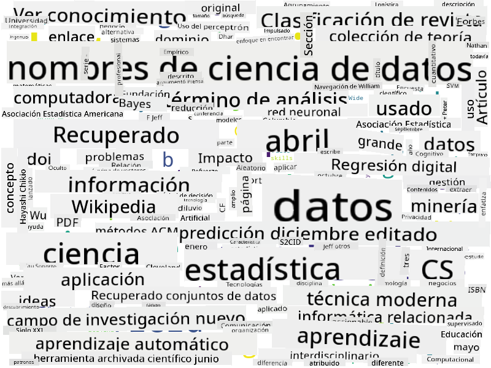

<!--
CO_OP_TRANSLATOR_METADATA:
{
  "original_hash": "a76ab694b1534fa57981311975660bfe",
  "translation_date": "2025-09-06T12:00:33+00:00",
  "source_file": "1-Introduction/01-defining-data-science/README.md",
  "language_code": "es"
}
-->
## Tipos de Datos

Como ya hemos mencionado, los datos están en todas partes. ¡Solo necesitamos capturarlos de la manera correcta! Es útil distinguir entre datos **estructurados** y **no estructurados**. Los primeros suelen estar representados en una forma bien organizada, a menudo como una tabla o varias tablas, mientras que los segundos son simplemente una colección de archivos. A veces también podemos hablar de datos **semi-estructurados**, que tienen algún tipo de estructura que puede variar considerablemente.

| Estructurados                                                               | Semi-estructurados                                                                            | No estructurados                        |
| ---------------------------------------------------------------------------- | ---------------------------------------------------------------------------------------------- | --------------------------------------- |
| Lista de personas con sus números de teléfono                               | Páginas de Wikipedia con enlaces                                                              | Texto de la Enciclopedia Británica      |
| Temperatura en todas las habitaciones de un edificio cada minuto durante los últimos 20 años | Colección de artículos científicos en formato JSON con autores, fecha de publicación y resumen | Carpeta compartida con documentos corporativos |
| Datos de edad y género de todas las personas que ingresan al edificio       | Páginas de Internet                                                                           | Vídeo sin procesar de una cámara de vigilancia |

## Dónde obtener Datos

Existen muchas fuentes posibles de datos, ¡y sería imposible enumerarlas todas! Sin embargo, mencionemos algunos de los lugares típicos donde puedes obtener datos:

* **Estructurados**
  - **Internet de las Cosas** (IoT), incluyendo datos de diferentes sensores, como sensores de temperatura o presión, que proporcionan muchos datos útiles. Por ejemplo, si un edificio de oficinas está equipado con sensores IoT, podemos controlar automáticamente la calefacción y la iluminación para minimizar costos.
  - **Encuestas** que pedimos a los usuarios completar después de una compra o tras visitar un sitio web.
  - **Análisis de comportamiento** puede, por ejemplo, ayudarnos a entender qué tan profundamente un usuario navega en un sitio y cuál es la razón típica para abandonar el sitio.
* **No estructurados**
  - **Textos** pueden ser una rica fuente de información, como un puntaje general de **sentimiento**, o la extracción de palabras clave y significado semántico.
  - **Imágenes** o **Vídeos**. Un vídeo de una cámara de vigilancia puede ser usado para estimar el tráfico en la carretera e informar a las personas sobre posibles atascos.
  - **Registros** de servidores web pueden ser utilizados para entender qué páginas de nuestro sitio son las más visitadas y durante cuánto tiempo.
* **Semi-estructurados**
  - Los gráficos de **Redes Sociales** pueden ser excelentes fuentes de datos sobre personalidades de los usuarios y la posible efectividad en la difusión de información.
  - Cuando tenemos un montón de fotografías de una fiesta, podemos intentar extraer datos sobre **Dinámicas de Grupo** construyendo un gráfico de personas que se toman fotos juntas.

Conociendo las diferentes fuentes posibles de datos, puedes pensar en distintos escenarios donde las técnicas de ciencia de datos pueden ser aplicadas para comprender mejor la situación y mejorar los procesos empresariales.

## Qué puedes hacer con los Datos

En Ciencia de Datos, nos enfocamos en los siguientes pasos del recorrido de los datos:

Por supuesto, dependiendo de los datos específicos, algunos pasos pueden faltar (por ejemplo, cuando ya tenemos los datos en la base de datos o cuando no necesitamos entrenar un modelo), o algunos pasos pueden repetirse varias veces (como el procesamiento de datos).

## Digitalización y Transformación Digital

En la última década, muchas empresas han comenzado a entender la importancia de los datos al tomar decisiones empresariales. Para aplicar los principios de la ciencia de datos a la gestión de un negocio, primero se necesita recopilar algunos datos, es decir, traducir los procesos empresariales a forma digital. Esto se conoce como **digitalización**. Aplicar técnicas de ciencia de datos a estos datos para guiar decisiones puede llevar a aumentos significativos en la productividad (o incluso a un cambio de rumbo en el negocio), lo que se denomina **transformación digital**.

Consideremos un ejemplo. Supongamos que tenemos un curso de ciencia de datos (como este) que impartimos en línea a estudiantes, y queremos usar la ciencia de datos para mejorarlo. 쮺칩mo podemos hacerlo?

Podemos empezar preguntando "쯈ué se puede digitalizar?" La forma más sencilla sería medir el tiempo que cada estudiante tarda en completar cada módulo y evaluar el conocimiento adquirido mediante un examen de opción múltiple al final de cada módulo. Promediando el tiempo de finalización entre todos los estudiantes, podemos identificar qué módulos presentan más dificultades y trabajar en simplificarlos.
> Podrías argumentar que este enfoque no es ideal, porque los módulos pueden tener longitudes diferentes. Probablemente sea más justo dividir el tiempo por la longitud del módulo (en número de caracteres) y comparar esos valores en su lugar.
Cuando comenzamos a analizar los resultados de pruebas de opción múltiple, podemos intentar determinar qué conceptos les resultan difíciles de entender a los estudiantes y usar esa información para mejorar el contenido. Para lograrlo, necesitamos diseñar las pruebas de manera que cada pregunta se asocie con un concepto o fragmento de conocimiento específico.

Si queremos complicarlo aún más, podemos graficar el tiempo que toma cada módulo en relación con la categoría de edad de los estudiantes. Podríamos descubrir que para algunas categorías de edad, completar el módulo lleva un tiempo excesivamente largo o que los estudiantes abandonan antes de terminarlo. Esto puede ayudarnos a proporcionar recomendaciones de edad para el módulo y minimizar la insatisfacción de las personas debido a expectativas incorrectas.

## 🚀 Desafío

En este desafío, intentaremos encontrar conceptos relevantes para el campo de la Ciencia de Datos analizando textos. Tomaremos un artículo de Wikipedia sobre Ciencia de Datos, descargaremos y procesaremos el texto, y luego construiremos una nube de palabras como esta:

Visita [`notebook.ipynb`](../../../../1-Introduction/01-defining-data-science/notebook.ipynb ':ignore') para leer el código. También puedes ejecutar el código y ver cómo realiza todas las transformaciones de datos en tiempo real.

> Si no sabes cómo ejecutar código en un Jupyter Notebook, consulta [este artículo](https://soshnikov.com/education/how-to-execute-notebooks-from-github/).

## [Cuestionario posterior a la clase](https://ff-quizzes.netlify.app/en/ds/quiz/1)

## Tareas

* **Tarea 1**: Modifica el código anterior para encontrar conceptos relacionados con los campos de **Big Data** y **Machine Learning**.
* **Tarea 2**: [Reflexiona sobre escenarios de Ciencia de Datos](assignment.md)

## Créditos

Esta lección ha sido creada con ♥️ por [Dmitry Soshnikov](http://soshnikov.com)

---

**Descargo de responsabilidad**:  
Este documento ha sido traducido utilizando el servicio de traducción automática [Co-op Translator](https://github.com/Azure/co-op-translator). Si bien nos esforzamos por lograr precisión, tenga en cuenta que las traducciones automáticas pueden contener errores o imprecisiones. El documento original en su idioma nativo debe considerarse como la fuente autorizada. Para información crítica, se recomienda una traducción profesional realizada por humanos. No nos hacemos responsables de malentendidos o interpretaciones erróneas que puedan surgir del uso de esta traducción.