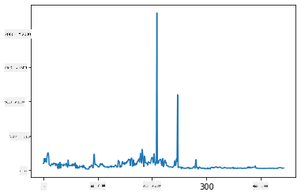
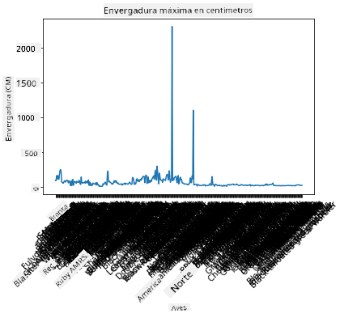
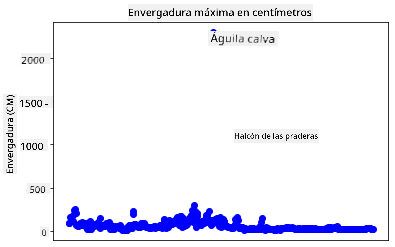
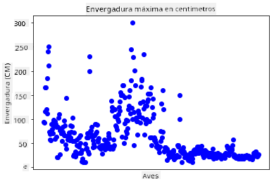
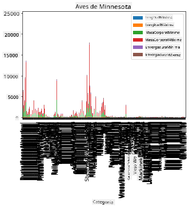
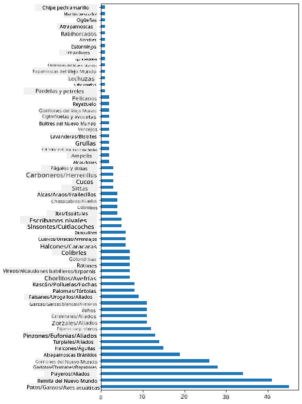
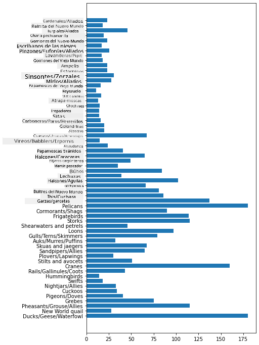
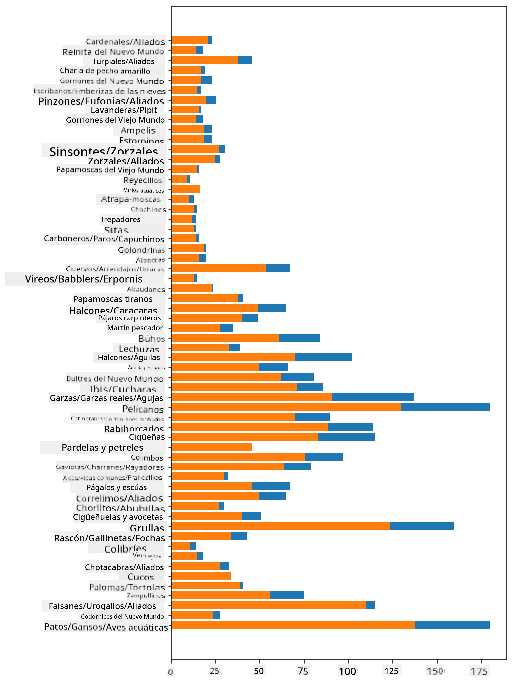

<!--
CO_OP_TRANSLATOR_METADATA:
{
  "original_hash": "43c402d9d90ae6da55d004519ada5033",
  "translation_date": "2025-08-24T23:00:19+00:00",
  "source_file": "3-Data-Visualization/09-visualization-quantities/README.md",
  "language_code": "es"
}
-->
# Visualizando Cantidades

| ](../../sketchnotes/09-Visualizing-Quantities.png)|
|:---:|
| Visualizando Cantidades - _Sketchnote por [@nitya](https://twitter.com/nitya)_ |

En esta lección explorarás cómo usar una de las muchas bibliotecas disponibles de Python para aprender a crear visualizaciones interesantes en torno al concepto de cantidad. Usando un conjunto de datos limpio sobre las aves de Minnesota, puedes aprender muchos datos interesantes sobre la fauna local.  
## [Cuestionario previo a la lección](https://purple-hill-04aebfb03.1.azurestaticapps.net/quiz/16)

## Observa la envergadura con Matplotlib

Una excelente biblioteca para crear gráficos y diagramas, tanto simples como sofisticados, de varios tipos es [Matplotlib](https://matplotlib.org/stable/index.html). En términos generales, el proceso de graficar datos usando estas bibliotecas incluye identificar las partes de tu dataframe que deseas analizar, realizar las transformaciones necesarias en esos datos, asignar valores a los ejes x e y, decidir qué tipo de gráfico mostrar y luego mostrar el gráfico. Matplotlib ofrece una gran variedad de visualizaciones, pero para esta lección, enfoquémonos en las más apropiadas para visualizar cantidades: gráficos de líneas, diagramas de dispersión y gráficos de barras.

> ✅ Usa el mejor gráfico que se adapte a la estructura de tus datos y a la historia que deseas contar.  
> - Para analizar tendencias a lo largo del tiempo: línea  
> - Para comparar valores: barra, columna, pastel, dispersión  
> - Para mostrar cómo las partes se relacionan con el todo: pastel  
> - Para mostrar la distribución de datos: dispersión, barra  
> - Para mostrar tendencias: línea, columna  
> - Para mostrar relaciones entre valores: línea, dispersión, burbuja  

Si tienes un conjunto de datos y necesitas descubrir cuánto de un elemento dado está incluido, una de las primeras tareas será inspeccionar sus valores.  

✅ Hay excelentes 'hojas de referencia' disponibles para Matplotlib [aquí](https://matplotlib.org/cheatsheets/cheatsheets.pdf).

## Construye un gráfico de líneas sobre los valores de envergadura de las aves

Abre el archivo `notebook.ipynb` en la raíz de esta carpeta de lección y agrega una celda.

> Nota: los datos están almacenados en la raíz de este repositorio en la carpeta `/data`.

```python
import pandas as pd
import matplotlib.pyplot as plt
birds = pd.read_csv('../../data/birds.csv')
birds.head()
```  
Estos datos son una mezcla de texto y números:

|      | Nombre                        | NombreCientífico       | Categoría             | Orden        | Familia  | Género      | EstadoConservación  | MinLongitud | MaxLongitud | MinMasaCorporal | MaxMasaCorporal | MinEnvergadura | MaxEnvergadura |
| ---: | :---------------------------- | :--------------------- | :-------------------- | :----------- | :------- | :---------- | :------------------ | -----------:| -----------:| ---------------:| ---------------:| --------------:| --------------:|
|    0 | Pato silbador vientre negro   | Dendrocygna autumnalis | Patos/Gansos/Aves acuáticas | Anseriformes | Anatidae | Dendrocygna | LC                  |        47    |        56    |         652      |        1020      |          76     |          94     |
|    1 | Pato silbador fulvo           | Dendrocygna bicolor    | Patos/Gansos/Aves acuáticas | Anseriformes | Anatidae | Dendrocygna | LC                  |        45    |        53    |         712      |        1050      |          85     |          93     |
|    2 | Ganso de las nieves           | Anser caerulescens     | Patos/Gansos/Aves acuáticas | Anseriformes | Anatidae | Anser       | LC                  |        64    |        79    |        2050      |        4050      |         135     |         165     |
|    3 | Ganso de Ross                 | Anser rossii           | Patos/Gansos/Aves acuáticas | Anseriformes | Anatidae | Anser       | LC                  |      57.3    |        64    |        1066      |        1567      |         113     |         116     |
|    4 | Ganso de frente blanca mayor  | Anser albifrons        | Patos/Gansos/Aves acuáticas | Anseriformes | Anatidae | Anser       | LC                  |        64    |        81    |        1930      |        3310      |         130     |         165     |

Comencemos graficando algunos de los datos numéricos usando un gráfico de líneas básico. Supongamos que quieres ver la envergadura máxima de estas interesantes aves.

```python
wingspan = birds['MaxWingspan'] 
wingspan.plot()
```  


¿Qué notas de inmediato? Parece haber al menos un valor atípico: ¡esa es una envergadura impresionante! Una envergadura de 2300 centímetros equivale a 23 metros: ¿hay pterodáctilos rondando Minnesota? Vamos a investigar.

Aunque podrías hacer un ordenamiento rápido en Excel para encontrar esos valores atípicos, que probablemente sean errores tipográficos, continúa el proceso de visualización trabajando desde el gráfico.

Agrega etiquetas al eje x para mostrar qué tipo de aves están en cuestión:

```
plt.title('Max Wingspan in Centimeters')
plt.ylabel('Wingspan (CM)')
plt.xlabel('Birds')
plt.xticks(rotation=45)
x = birds['Name'] 
y = birds['MaxWingspan']

plt.plot(x, y)

plt.show()
```  


Incluso con la rotación de las etiquetas configurada a 45 grados, hay demasiadas para leer. Probemos una estrategia diferente: etiqueta solo esos valores atípicos y coloca las etiquetas dentro del gráfico. Puedes usar un gráfico de dispersión para hacer más espacio para el etiquetado:

```python
plt.title('Max Wingspan in Centimeters')
plt.ylabel('Wingspan (CM)')
plt.tick_params(axis='both',which='both',labelbottom=False,bottom=False)

for i in range(len(birds)):
    x = birds['Name'][i]
    y = birds['MaxWingspan'][i]
    plt.plot(x, y, 'bo')
    if birds['MaxWingspan'][i] > 500:
        plt.text(x, y * (1 - 0.05), birds['Name'][i], fontsize=12)
    
plt.show()
```  
¿Qué está pasando aquí? Usaste `tick_params` para ocultar las etiquetas inferiores y luego creaste un bucle sobre tu conjunto de datos de aves. Graficando el gráfico con pequeños puntos redondos azules usando `bo`, verificaste si alguna ave tenía una envergadura máxima superior a 500 y, si era así, mostrabas su etiqueta junto al punto. Desplazaste las etiquetas un poco en el eje y (`y * (1 - 0.05)`) y usaste el nombre del ave como etiqueta.

¿Qué descubriste?

  
## Filtra tus datos

Tanto el Águila Calva como el Halcón de las Praderas, aunque probablemente sean aves muy grandes, parecen estar mal etiquetados, con un `0` extra añadido a su envergadura máxima. Es poco probable que encuentres un Águila Calva con una envergadura de 25 metros, pero si lo haces, ¡por favor avísanos! Creemos un nuevo dataframe sin esos dos valores atípicos:

```python
plt.title('Max Wingspan in Centimeters')
plt.ylabel('Wingspan (CM)')
plt.xlabel('Birds')
plt.tick_params(axis='both',which='both',labelbottom=False,bottom=False)
for i in range(len(birds)):
    x = birds['Name'][i]
    y = birds['MaxWingspan'][i]
    if birds['Name'][i] not in ['Bald eagle', 'Prairie falcon']:
        plt.plot(x, y, 'bo')
plt.show()
```  

Al filtrar los valores atípicos, tus datos ahora son más coherentes y comprensibles.

  

Ahora que tenemos un conjunto de datos más limpio al menos en términos de envergadura, descubramos más sobre estas aves.

Aunque los gráficos de líneas y dispersión pueden mostrar información sobre los valores de los datos y sus distribuciones, queremos pensar en los valores inherentes a este conjunto de datos. Podrías crear visualizaciones para responder las siguientes preguntas sobre cantidad:

> ¿Cuántas categorías de aves hay y cuáles son sus números?  
> ¿Cuántas aves están extintas, en peligro, son raras o comunes?  
> ¿Cuántas hay de los diversos géneros y órdenes en la terminología de Linneo?  
## Explora gráficos de barras

Los gráficos de barras son prácticos cuando necesitas mostrar agrupaciones de datos. Exploremos las categorías de aves que existen en este conjunto de datos para ver cuál es la más común por número.

En el archivo del notebook, crea un gráfico de barras básico.

✅ Nota, puedes filtrar las dos aves atípicas que identificamos en la sección anterior, editar el error tipográfico en su envergadura o dejarlas para estos ejercicios que no dependen de los valores de envergadura.

Si deseas crear un gráfico de barras, puedes seleccionar los datos en los que deseas enfocarte. Los gráficos de barras pueden crearse a partir de datos sin procesar:

```python
birds.plot(x='Category',
        kind='bar',
        stacked=True,
        title='Birds of Minnesota')

```  
  

Este gráfico de barras, sin embargo, es ilegible porque hay demasiados datos no agrupados. Necesitas seleccionar solo los datos que deseas graficar, así que veamos la longitud de las aves según su categoría.

Filtra tus datos para incluir solo la categoría de las aves.

✅ Nota que usas Pandas para gestionar los datos y luego dejas que Matplotlib haga el gráfico.

Dado que hay muchas categorías, puedes mostrar este gráfico verticalmente y ajustar su altura para incluir todos los datos:

```python
category_count = birds.value_counts(birds['Category'].values, sort=True)
plt.rcParams['figure.figsize'] = [6, 12]
category_count.plot.barh()
```  
  

Este gráfico de barras muestra una buena vista del número de aves en cada categoría. De un vistazo, ves que el mayor número de aves en esta región pertenece a la categoría de Patos/Gansos/Aves acuáticas. Minnesota es la 'tierra de los 10,000 lagos', ¡así que esto no es sorprendente!

✅ Prueba algunos otros conteos en este conjunto de datos. ¿Hay algo que te sorprenda?

## Comparando datos

Puedes intentar diferentes comparaciones de datos agrupados creando nuevos ejes. Prueba una comparación de la MaxLongitud de un ave, basada en su categoría:

```python
maxlength = birds['MaxLength']
plt.barh(y=birds['Category'], width=maxlength)
plt.rcParams['figure.figsize'] = [6, 12]
plt.show()
```  
  

Nada sorprendente aquí: los colibríes tienen la menor MaxLongitud en comparación con los pelícanos o los gansos. ¡Es bueno cuando los datos tienen sentido lógico!

Puedes crear visualizaciones más interesantes de gráficos de barras superponiendo datos. Superpongamos la Longitud Mínima y Máxima en una categoría de aves dada:

```python
minLength = birds['MinLength']
maxLength = birds['MaxLength']
category = birds['Category']

plt.barh(category, maxLength)
plt.barh(category, minLength)

plt.show()
```  
En este gráfico, puedes ver el rango por categoría de aves de la Longitud Mínima y Máxima. Puedes decir con seguridad que, según estos datos, cuanto más grande es el ave, mayor es su rango de longitud. ¡Fascinante!

  

## 🚀 Desafío

Este conjunto de datos de aves ofrece una gran cantidad de información sobre diferentes tipos de aves dentro de un ecosistema particular. Busca en internet y ve si puedes encontrar otros conjuntos de datos orientados a aves. Practica construyendo gráficos y diagramas sobre estas aves para descubrir datos que no conocías.  
## [Cuestionario posterior a la lección](https://purple-hill-04aebfb03.1.azurestaticapps.net/quiz/17)

## Revisión y Autoestudio

Esta primera lección te ha dado información sobre cómo usar Matplotlib para visualizar cantidades. Investiga otras formas de trabajar con conjuntos de datos para visualización. [Plotly](https://github.com/plotly/plotly.py) es una que no cubriremos en estas lecciones, así que échale un vistazo a lo que puede ofrecer.  
## Tarea

[Líneas, Dispersión y Barras](assignment.md)  

**Descargo de responsabilidad**:  
Este documento ha sido traducido utilizando el servicio de traducción automática [Co-op Translator](https://github.com/Azure/co-op-translator). Si bien nos esforzamos por lograr precisión, tenga en cuenta que las traducciones automáticas pueden contener errores o imprecisiones. El documento original en su idioma nativo debe considerarse como la fuente autorizada. Para información crítica, se recomienda una traducción profesional realizada por humanos. No nos hacemos responsables de malentendidos o interpretaciones erróneas que puedan surgir del uso de esta traducción.