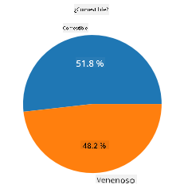
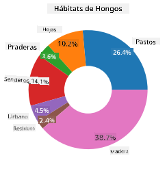
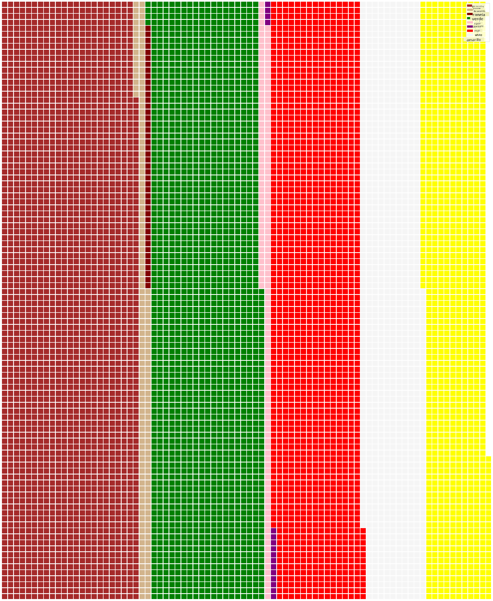

<!--
CO_OP_TRANSLATOR_METADATA:
{
  "original_hash": "af6a12015c6e250e500b570a9fa42593",
  "translation_date": "2025-08-24T23:04:31+00:00",
  "source_file": "3-Data-Visualization/11-visualization-proportions/README.md",
  "language_code": "es"
}
-->
# Visualizando Proporciones

| ](../../sketchnotes/11-Visualizing-Proportions.png)|
|:---:|
|Visualizando Proporciones - _Sketchnote por [@nitya](https://twitter.com/nitya)_ |

En esta lección, usarás un conjunto de datos enfocado en la naturaleza para visualizar proporciones, como cuántos tipos diferentes de hongos están presentes en un conjunto de datos sobre setas. Vamos a explorar estos fascinantes hongos utilizando un conjunto de datos obtenido de Audubon que detalla 23 especies de hongos con laminillas de las familias Agaricus y Lepiota. Experimentarás con visualizaciones interesantes como:

- Gráficos de pastel 🥧
- Gráficos de dona 🍩
- Gráficos de waffle 🧇

> 💡 Un proyecto muy interesante llamado [Charticulator](https://charticulator.com) de Microsoft Research ofrece una interfaz gratuita de arrastrar y soltar para visualizaciones de datos. ¡En uno de sus tutoriales también usan este conjunto de datos de hongos! Así que puedes explorar los datos y aprender a usar la biblioteca al mismo tiempo: [Tutorial de Charticulator](https://charticulator.com/tutorials/tutorial4.html).

## [Cuestionario previo a la lección](https://purple-hill-04aebfb03.1.azurestaticapps.net/quiz/20)

## Conoce tus hongos 🍄

Los hongos son muy interesantes. Importemos un conjunto de datos para estudiarlos:

```python
import pandas as pd
import matplotlib.pyplot as plt
mushrooms = pd.read_csv('../../data/mushrooms.csv')
mushrooms.head()
```
Se imprime una tabla con datos excelentes para analizar:


| clase      | forma-sombrero | superficie-sombrero | color-sombrero | magulladuras | olor     | unión-laminillas | espaciado-laminillas | tamaño-laminillas | color-laminillas | forma-tallo | raíz-tallo | superficie-tallo-encima-anillo | superficie-tallo-debajo-anillo | color-tallo-encima-anillo | color-tallo-debajo-anillo | tipo-velo | color-velo | número-anillos | tipo-anillo | color-esporas | población   | hábitat |
| ---------- | -------------- | ------------------- | -------------- | ------------ | -------- | ---------------- | -------------------- | ----------------- | ---------------- | ----------- | ---------- | ----------------------------- | ----------------------------- | ------------------------- | ------------------------- | --------- | ---------- | -------------- | ----------- | ------------- | ----------- | ------- |
| Venenoso   | Convexo        | Liso               | Marrón         | Magulladuras | Punzante | Libre            | Cerrado              | Estrecho          | Negro            | Ensanchado  | Igual      | Liso                        | Liso                        | Blanco                  | Blanco                  | Parcial   | Blanco     | Uno            | Colgante    | Negro         | Disperso    | Urbano  |
| Comestible | Convexo        | Liso               | Amarillo       | Magulladuras | Almendra | Libre            | Cerrado              | Ancho             | Negro            | Ensanchado  | Club       | Liso                        | Liso                        | Blanco                  | Blanco                  | Parcial   | Blanco     | Uno            | Colgante    | Marrón        | Numeroso    | Pastos  |
| Comestible | Campana        | Liso               | Blanco         | Magulladuras | Anís     | Libre            | Cerrado              | Ancho             | Marrón           | Ensanchado  | Club       | Liso                        | Liso                        | Blanco                  | Blanco                  | Parcial   | Blanco     | Uno            | Colgante    | Marrón        | Numeroso    | Praderas |
| Venenoso   | Convexo        | Escamoso           | Blanco         | Magulladuras | Punzante | Libre            | Cerrado              | Estrecho          | Marrón           | Ensanchado  | Igual      | Liso                        | Liso                        | Blanco                  | Blanco                  | Parcial   | Blanco     | Uno            | Colgante    | Negro         | Disperso    | Urbano  |

De inmediato, notas que todos los datos son textuales. Tendrás que convertir estos datos para poder usarlos en un gráfico. De hecho, la mayoría de los datos están representados como un objeto:

```python
print(mushrooms.select_dtypes(["object"]).columns)
```

El resultado es:

```output
Index(['class', 'cap-shape', 'cap-surface', 'cap-color', 'bruises', 'odor',
       'gill-attachment', 'gill-spacing', 'gill-size', 'gill-color',
       'stalk-shape', 'stalk-root', 'stalk-surface-above-ring',
       'stalk-surface-below-ring', 'stalk-color-above-ring',
       'stalk-color-below-ring', 'veil-type', 'veil-color', 'ring-number',
       'ring-type', 'spore-print-color', 'population', 'habitat'],
      dtype='object')
```
Toma estos datos y convierte la columna 'class' en una categoría:

```python
cols = mushrooms.select_dtypes(["object"]).columns
mushrooms[cols] = mushrooms[cols].astype('category')
```

```python
edibleclass=mushrooms.groupby(['class']).count()
edibleclass
```

Ahora, si imprimes los datos de los hongos, puedes ver que se han agrupado en categorías según la clase venenoso/comestible:


|           | forma-sombrero | superficie-sombrero | color-sombrero | magulladuras | olor | unión-laminillas | espaciado-laminillas | tamaño-laminillas | color-laminillas | forma-tallo | ... | superficie-tallo-debajo-anillo | color-tallo-encima-anillo | color-tallo-debajo-anillo | tipo-velo | color-velo | número-anillos | tipo-anillo | color-esporas | población | hábitat |
| --------- | -------------- | ------------------- | -------------- | ------------ | ---- | ---------------- | -------------------- | ----------------- | ---------------- | ----------- | --- | ----------------------------- | ------------------------- | ------------------------- | --------- | ---------- | -------------- | ----------- | ------------- | --------- | ------- |
| clase     |                |                     |                |              |      |                  |                      |                   |                  |             |     |                               |                         |                         |           |            |                |             |               |           |         |
| Comestible| 4208           | 4208                | 4208           | 4208         | 4208 | 4208             | 4208                 | 4208              | 4208             | 4208        | ... | 4208                        | 4208                    | 4208                    | 4208      | 4208       | 4208           | 4208        | 4208          | 4208      | 4208    |
| Venenoso  | 3916           | 3916                | 3916           | 3916         | 3916 | 3916             | 3916                 | 3916              | 3916             | 3916        | ... | 3916                        | 3916                    | 3916                    | 3916      | 3916       | 3916           | 3916        | 3916          | 3916      | 3916    |

Si sigues el orden presentado en esta tabla para crear las etiquetas de la categoría 'class', puedes construir un gráfico de pastel:

## ¡Pastel!

```python
labels=['Edible','Poisonous']
plt.pie(edibleclass['population'],labels=labels,autopct='%.1f %%')
plt.title('Edible?')
plt.show()
```
Voilà, un gráfico de pastel que muestra las proporciones de estos datos según estas dos clases de hongos. Es muy importante obtener el orden correcto de las etiquetas, especialmente aquí, así que asegúrate de verificar el orden con el que se construye el arreglo de etiquetas.



## ¡Donas!

Un gráfico de dona, que es un gráfico de pastel con un agujero en el medio, es una forma visualmente más interesante de mostrar los datos. Veamos nuestros datos usando este método.

Observa los diversos hábitats donde crecen los hongos:

```python
habitat=mushrooms.groupby(['habitat']).count()
habitat
```
Aquí, estás agrupando tus datos por hábitat. Hay 7 listados, así que usa esos como etiquetas para tu gráfico de dona:

```python
labels=['Grasses','Leaves','Meadows','Paths','Urban','Waste','Wood']

plt.pie(habitat['class'], labels=labels,
        autopct='%1.1f%%', pctdistance=0.85)
  
center_circle = plt.Circle((0, 0), 0.40, fc='white')
fig = plt.gcf()

fig.gca().add_artist(center_circle)
  
plt.title('Mushroom Habitats')
  
plt.show()
```



Este código dibuja un gráfico y un círculo central, luego agrega ese círculo central al gráfico. Edita el ancho del círculo central cambiando `0.40` por otro valor.

Los gráficos de dona se pueden ajustar de varias maneras para cambiar las etiquetas. Las etiquetas, en particular, se pueden resaltar para mejorar la legibilidad. Aprende más en los [documentos](https://matplotlib.org/stable/gallery/pie_and_polar_charts/pie_and_donut_labels.html?highlight=donut).

Ahora que sabes cómo agrupar tus datos y luego mostrarlos como un gráfico de pastel o de dona, puedes explorar otros tipos de gráficos. Prueba un gráfico de waffle, que es solo una forma diferente de explorar cantidades.
## ¡Waffles!

Un gráfico tipo 'waffle' es una forma diferente de visualizar cantidades como una matriz 2D de cuadrados. Intenta visualizar las diferentes cantidades de colores de sombreros de hongos en este conjunto de datos. Para hacerlo, necesitas instalar una biblioteca auxiliar llamada [PyWaffle](https://pypi.org/project/pywaffle/) y usar Matplotlib:

```python
pip install pywaffle
```

Selecciona un segmento de tus datos para agrupar:

```python
capcolor=mushrooms.groupby(['cap-color']).count()
capcolor
```

Crea un gráfico de waffle creando etiquetas y luego agrupando tus datos:

```python
import pandas as pd
import matplotlib.pyplot as plt
from pywaffle import Waffle
  
data ={'color': ['brown', 'buff', 'cinnamon', 'green', 'pink', 'purple', 'red', 'white', 'yellow'],
    'amount': capcolor['class']
     }
  
df = pd.DataFrame(data)
  
fig = plt.figure(
    FigureClass = Waffle,
    rows = 100,
    values = df.amount,
    labels = list(df.color),
    figsize = (30,30),
    colors=["brown", "tan", "maroon", "green", "pink", "purple", "red", "whitesmoke", "yellow"],
)
```

Usando un gráfico de waffle, puedes ver claramente las proporciones de colores de sombreros en este conjunto de datos de hongos. Curiosamente, ¡hay muchos hongos con sombreros verdes!



✅ PyWaffle admite íconos dentro de los gráficos que usan cualquier ícono disponible en [Font Awesome](https://fontawesome.com/). Haz algunos experimentos para crear un gráfico de waffle aún más interesante usando íconos en lugar de cuadrados.

En esta lección, aprendiste tres formas de visualizar proporciones. Primero, necesitas agrupar tus datos en categorías y luego decidir cuál es la mejor manera de mostrar los datos: pastel, dona o waffle. Todos son deliciosos y ofrecen al usuario una instantánea instantánea de un conjunto de datos.

## 🚀 Desafío

Intenta recrear estos gráficos deliciosos en [Charticulator](https://charticulator.com).
## [Cuestionario posterior a la lección](https://purple-hill-04aebfb03.1.azurestaticapps.net/quiz/21)

## Revisión y Autoestudio

A veces no es obvio cuándo usar un gráfico de pastel, dona o waffle. Aquí hay algunos artículos para leer sobre este tema:

https://www.beautiful.ai/blog/battle-of-the-charts-pie-chart-vs-donut-chart

https://medium.com/@hypsypops/pie-chart-vs-donut-chart-showdown-in-the-ring-5d24fd86a9ce

https://www.mit.edu/~mbarker/formula1/f1help/11-ch-c6.htm

https://medium.datadriveninvestor.com/data-visualization-done-the-right-way-with-tableau-waffle-chart-fdf2a19be402

Investiga más para encontrar información adicional sobre esta decisión.

## Tarea

[Prueba en Excel](assignment.md)

**Descargo de responsabilidad**:  
Este documento ha sido traducido utilizando el servicio de traducción automática [Co-op Translator](https://github.com/Azure/co-op-translator). Aunque nos esforzamos por garantizar la precisión, tenga en cuenta que las traducciones automatizadas pueden contener errores o imprecisiones. El documento original en su idioma nativo debe considerarse la fuente autorizada. Para información crítica, se recomienda una traducción profesional realizada por humanos. No nos hacemos responsables de malentendidos o interpretaciones erróneas que puedan surgir del uso de esta traducción.