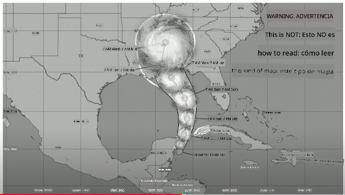
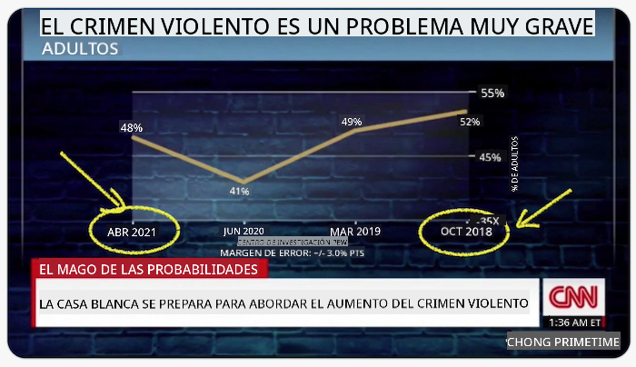
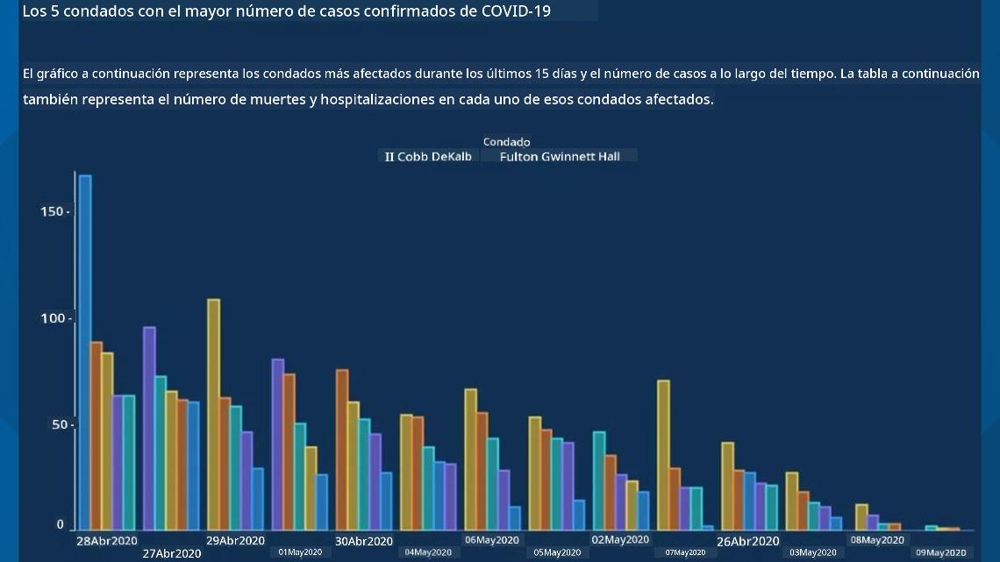
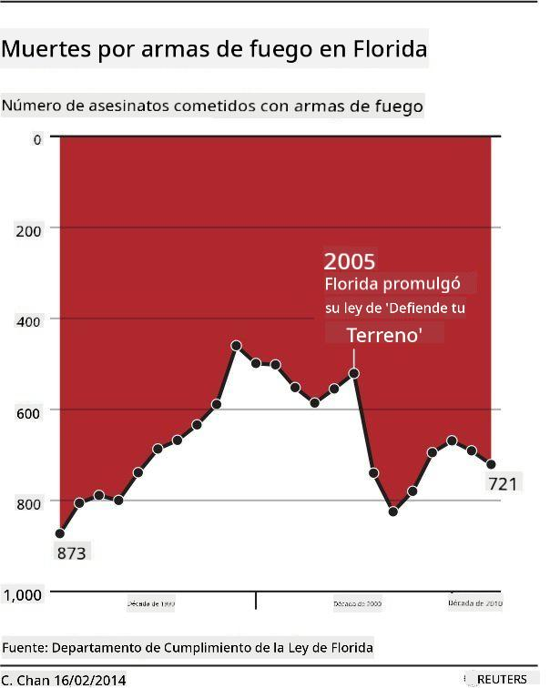
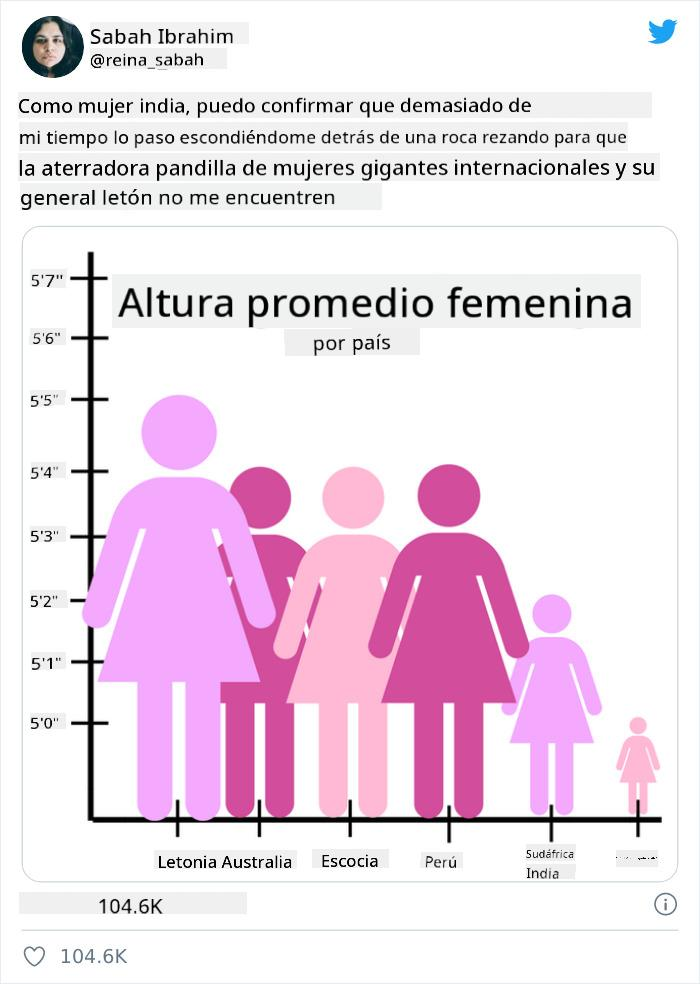
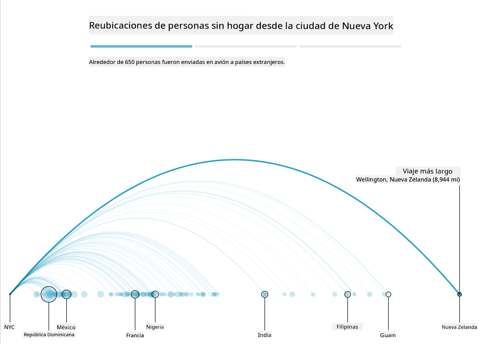
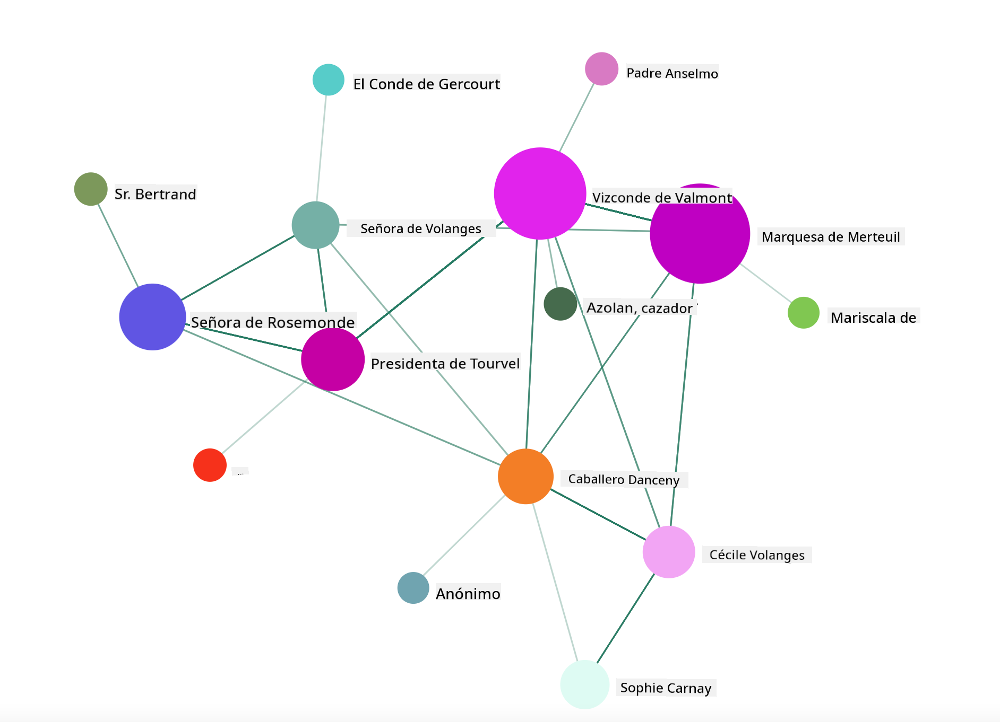

<!--
CO_OP_TRANSLATOR_METADATA:
{
  "original_hash": "0b380bb6d34102bb061eb41de23d9834",
  "translation_date": "2025-09-04T13:59:42+00:00",
  "source_file": "3-Data-Visualization/13-meaningful-visualizations/README.md",
  "language_code": "es"
}
-->
# Creando Visualizaciones Significativas

| ](../../sketchnotes/13-MeaningfulViz.png)|
|:---:|
| Visualizaciones Significativas - _Sketchnote por [@nitya](https://twitter.com/nitya)_ |

> "Si torturas los datos lo suficiente, confesarán cualquier cosa" -- [Ronald Coase](https://en.wikiquote.org/wiki/Ronald_Coase)

Una de las habilidades básicas de un científico de datos es la capacidad de crear una visualización de datos significativa que ayude a responder preguntas. Antes de visualizar tus datos, debes asegurarte de que hayan sido limpiados y preparados, como hiciste en lecciones anteriores. Después de eso, puedes comenzar a decidir cómo presentar mejor los datos.

En esta lección, revisarás:

1. Cómo elegir el tipo de gráfico adecuado
2. Cómo evitar gráficos engañosos
3. Cómo trabajar con el color
4. Cómo estilizar tus gráficos para mejorar la legibilidad
5. Cómo construir soluciones de gráficos animados o en 3D
6. Cómo crear una visualización creativa

## [Cuestionario previo a la lección](https://purple-hill-04aebfb03.1.azurestaticapps.net/quiz/24)

## Elegir el tipo de gráfico adecuado

En lecciones anteriores, experimentaste con la creación de todo tipo de visualizaciones de datos interesantes utilizando Matplotlib y Seaborn para gráficos. En general, puedes seleccionar el [tipo de gráfico adecuado](https://chartio.com/learn/charts/how-to-select-a-data-vizualization/) para la pregunta que estás haciendo utilizando esta tabla:

| Necesitas:                 | Deberías usar:                  |
| -------------------------- | ------------------------------- |
| Mostrar tendencias en el tiempo | Línea                          |
| Comparar categorías         | Barra, Pastel                   |
| Comparar totales            | Pastel, Barra apilada           |
| Mostrar relaciones          | Dispersión, Línea, Faceta, Línea dual |
| Mostrar distribuciones      | Dispersión, Histograma, Caja    |
| Mostrar proporciones        | Pastel, Donut, Waffle           |

> ✅ Dependiendo de la composición de tus datos, es posible que necesites convertirlos de texto a numérico para que un gráfico determinado los soporte.

## Evitar el engaño

Incluso si un científico de datos es cuidadoso al elegir el gráfico adecuado para los datos correctos, hay muchas formas en que los datos pueden ser mostrados para probar un punto, a menudo a costa de socavar los datos mismos. ¡Existen muchos ejemplos de gráficos e infografías engañosos!

[](https://www.youtube.com/watch?v=oX74Nge8Wkw "Cómo los gráficos engañan")

> 🎥 Haz clic en la imagen de arriba para ver una charla sobre gráficos engañosos

Este gráfico invierte el eje X para mostrar lo opuesto a la verdad, basado en la fecha:



[Este gráfico](https://media.firstcoastnews.com/assets/WTLV/images/170ae16f-4643-438f-b689-50d66ca6a8d8/170ae16f-4643-438f-b689-50d66ca6a8d8_1140x641.jpg) es aún más engañoso, ya que el ojo se dirige hacia la derecha para concluir que, con el tiempo, los casos de COVID han disminuido en los diversos condados. De hecho, si miras de cerca las fechas, encontrarás que han sido reorganizadas para dar esa engañosa tendencia descendente.



Este ejemplo notorio utiliza color Y un eje Y invertido para engañar: en lugar de concluir que las muertes por armas aumentaron después de la aprobación de legislación favorable a las armas, de hecho el ojo es engañado para pensar que lo opuesto es cierto:



Este extraño gráfico muestra cómo la proporción puede ser manipulada, con un efecto hilarante:



Comparar lo incomparable es otra táctica dudosa. Hay un [sitio web maravilloso](https://tylervigen.com/spurious-correlations) dedicado a 'correlaciones espurias' que muestra 'hechos' correlacionando cosas como la tasa de divorcio en Maine y el consumo de margarina. Un grupo de Reddit también recopila los [usos feos](https://www.reddit.com/r/dataisugly/top/?t=all) de los datos.

Es importante entender lo fácil que es engañar al ojo con gráficos engañosos. Incluso si la intención del científico de datos es buena, la elección de un mal tipo de gráfico, como un gráfico de pastel que muestra demasiadas categorías, puede ser engañosa.

## Color

Viste en el gráfico de 'violencia con armas en Florida' cómo el color puede proporcionar una capa adicional de significado a los gráficos, especialmente aquellos que no están diseñados utilizando bibliotecas como Matplotlib y Seaborn, que vienen con diversas bibliotecas y paletas de colores verificadas. Si estás creando un gráfico manualmente, estudia un poco sobre [teoría del color](https://colormatters.com/color-and-design/basic-color-theory).

> ✅ Ten en cuenta, al diseñar gráficos, que la accesibilidad es un aspecto importante de la visualización. Algunos de tus usuarios podrían ser daltónicos: ¿tu gráfico se muestra bien para usuarios con discapacidades visuales?

Ten cuidado al elegir colores para tu gráfico, ya que el color puede transmitir un significado que no pretendes. Las 'damas rosadas' en el gráfico de 'altura' arriba transmiten un significado claramente 'femenino' que añade a lo extraño del gráfico en sí.

Aunque el [significado del color](https://colormatters.com/color-symbolism/the-meanings-of-colors) puede ser diferente en distintas partes del mundo y tiende a cambiar según su tono, generalmente los significados de los colores incluyen:

| Color  | Significado         |
| ------ | ------------------- |
| rojo   | poder               |
| azul   | confianza, lealtad  |
| amarillo | felicidad, precaución |
| verde  | ecología, suerte, envidia |
| púrpura | felicidad           |
| naranja | vitalidad           |

Si se te asigna la tarea de construir un gráfico con colores personalizados, asegúrate de que tus gráficos sean accesibles y que el color que elijas coincida con el significado que intentas transmitir.

## Estilizar tus gráficos para mejorar la legibilidad

Los gráficos no son significativos si no son legibles. Tómate un momento para considerar el estilo del ancho y la altura de tu gráfico para que se ajusten bien a tus datos. Si una variable (como los 50 estados) necesita ser mostrada, muéstralos verticalmente en el eje Y si es posible para evitar un gráfico con desplazamiento horizontal.

Etiqueta tus ejes, proporciona una leyenda si es necesario y ofrece información emergente para una mejor comprensión de los datos.

Si tus datos son textuales y extensos en el eje X, puedes inclinar el texto para mejorar la legibilidad. [Matplotlib](https://matplotlib.org/stable/tutorials/toolkits/mplot3d.html) ofrece gráficos en 3D, si tus datos lo permiten. Se pueden producir visualizaciones de datos sofisticadas utilizando `mpl_toolkits.mplot3d`.


## Animación y visualización de gráficos en 3D

Algunas de las mejores visualizaciones de datos hoy en día son animadas. Shirley Wu tiene ejemplos increíbles hechos con D3, como '[film flowers](http://bl.ocks.org/sxywu/raw/d612c6c653fb8b4d7ff3d422be164a5d/)', donde cada flor es una visualización de una película. Otro ejemplo para el Guardian es 'bussed out', una experiencia interactiva que combina visualizaciones con Greensock y D3 más un formato de artículo narrativo para mostrar cómo NYC maneja su problema de personas sin hogar enviándolas fuera de la ciudad.



> "Bussed Out: Cómo Estados Unidos mueve a sus personas sin hogar" del [Guardian](https://www.theguardian.com/us-news/ng-interactive/2017/dec/20/bussed-out-america-moves-homeless-people-country-study). Visualizaciones por Nadieh Bremer & Shirley Wu

Aunque esta lección no es suficiente para profundizar en estas poderosas bibliotecas de visualización, intenta usar D3 en una aplicación Vue.js utilizando una biblioteca para mostrar una visualización del libro "Las Relaciones Peligrosas" como una red social animada.

> "Les Liaisons Dangereuses" es una novela epistolar, o una novela presentada como una serie de cartas. Escrita en 1782 por Choderlos de Laclos, cuenta la historia de las maniobras sociales viciosas y moralmente corruptas de dos protagonistas enfrentados de la aristocracia francesa del siglo XVIII, el Vizconde de Valmont y la Marquesa de Merteuil. Ambos encuentran su final, pero no sin causar un gran daño social. La novela se desarrolla como una serie de cartas escritas a varias personas en sus círculos, tramando venganzas o simplemente causando problemas. Crea una visualización de estas cartas para descubrir los principales personajes de la narrativa, visualmente.

Completarás una aplicación web que mostrará una vista animada de esta red social. Utiliza una biblioteca que fue creada para generar una [visualización de una red](https://github.com/emiliorizzo/vue-d3-network) usando Vue.js y D3. Cuando la aplicación esté funcionando, puedes mover los nodos en la pantalla para reorganizar los datos.



## Proyecto: Construir un gráfico para mostrar una red usando D3.js

> Esta carpeta de lección incluye una carpeta `solution` donde puedes encontrar el proyecto completo como referencia.

1. Sigue las instrucciones en el archivo README.md en la raíz de la carpeta de inicio. Asegúrate de tener NPM y Node.js funcionando en tu máquina antes de instalar las dependencias de tu proyecto.

2. Abre la carpeta `starter/src`. Descubrirás una carpeta `assets` donde puedes encontrar un archivo .json con todas las cartas de la novela, numeradas, con una anotación de 'para' y 'de'.

3. Completa el código en `components/Nodes.vue` para habilitar la visualización. Busca el método llamado `createLinks()` y añade el siguiente bucle anidado.

Recorre el objeto .json para capturar los datos de 'para' y 'de' de las cartas y construye el objeto `links` para que la biblioteca de visualización pueda consumirlo:

```javascript
//loop through letters
      let f = 0;
      let t = 0;
      for (var i = 0; i < letters.length; i++) {
          for (var j = 0; j < characters.length; j++) {
              
            if (characters[j] == letters[i].from) {
              f = j;
            }
            if (characters[j] == letters[i].to) {
              t = j;
            }
        }
        this.links.push({ sid: f, tid: t });
      }
  ```

Ejecuta tu aplicación desde la terminal (npm run serve) y disfruta de la visualización.

## 🚀 Desafío

Haz un recorrido por internet para descubrir visualizaciones engañosas. ¿Cómo engaña el autor al usuario y es intencional? Intenta corregir las visualizaciones para mostrar cómo deberían verse.

## [Cuestionario posterior a la lección](https://ff-quizzes.netlify.app/en/ds/)

## Revisión y estudio personal

Aquí hay algunos artículos para leer sobre visualización de datos engañosa:

https://gizmodo.com/how-to-lie-with-data-visualization-1563576606

http://ixd.prattsi.org/2017/12/visual-lies-usability-in-deceptive-data-visualizations/

Echa un vistazo a estas visualizaciones interesantes de activos y artefactos históricos:

https://handbook.pubpub.org/

Revisa este artículo sobre cómo la animación puede mejorar tus visualizaciones:

https://medium.com/@EvanSinar/use-animation-to-supercharge-data-visualization-cd905a882ad4

## Tarea

[Construye tu propia visualización personalizada](assignment.md)

---

**Descargo de responsabilidad**:  
Este documento ha sido traducido utilizando el servicio de traducción automática [Co-op Translator](https://github.com/Azure/co-op-translator). Si bien nos esforzamos por garantizar la precisión, tenga en cuenta que las traducciones automatizadas pueden contener errores o imprecisiones. El documento original en su idioma nativo debe considerarse la fuente autorizada. Para información crítica, se recomienda una traducción profesional realizada por humanos. No nos hacemos responsables de malentendidos o interpretaciones erróneas que puedan surgir del uso de esta traducción.