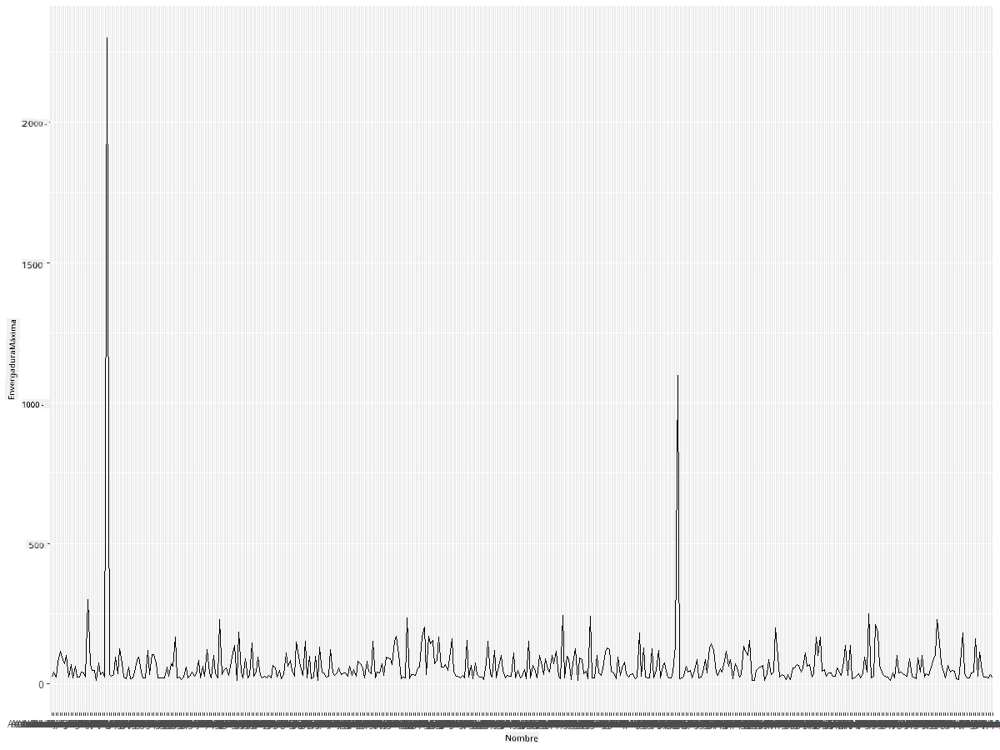
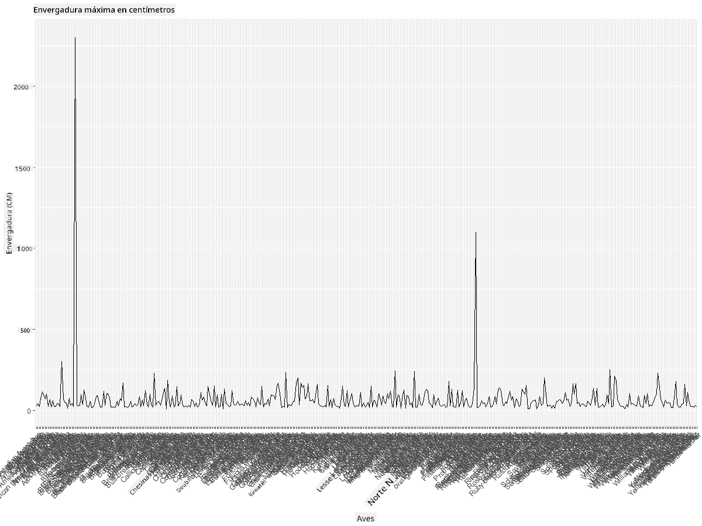
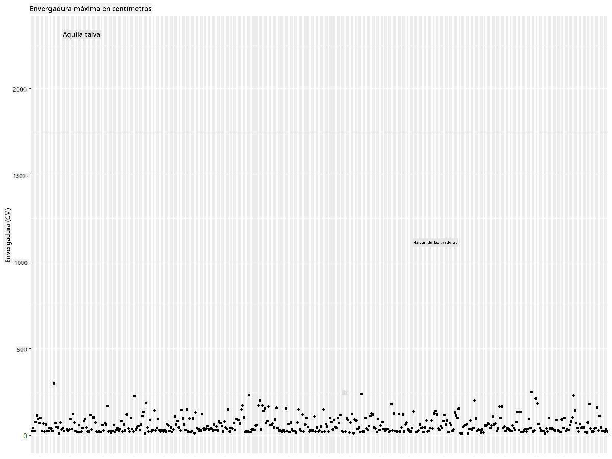
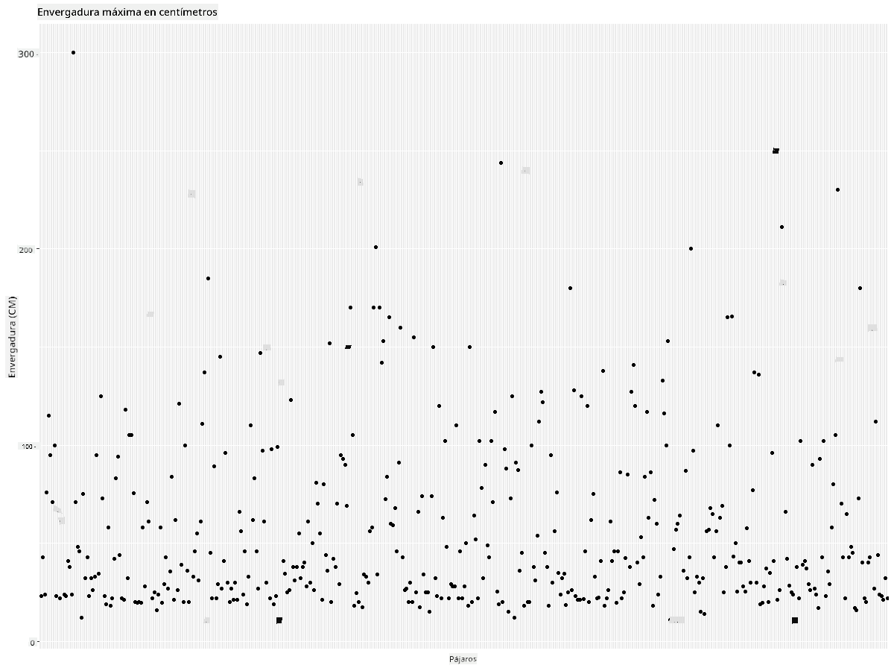
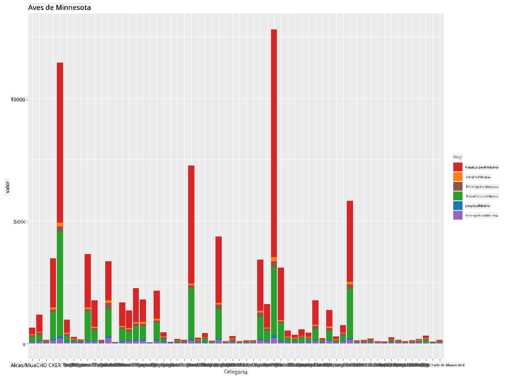
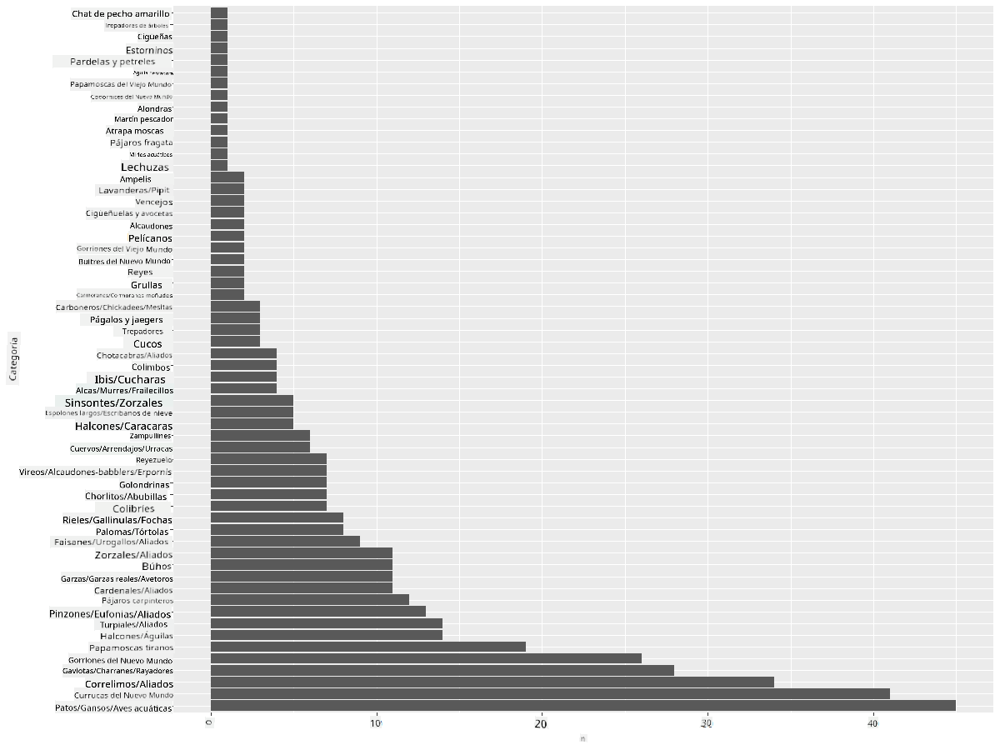
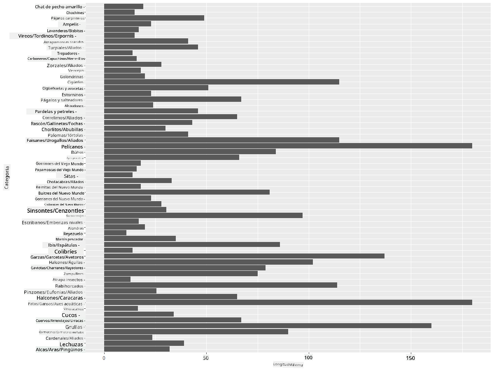
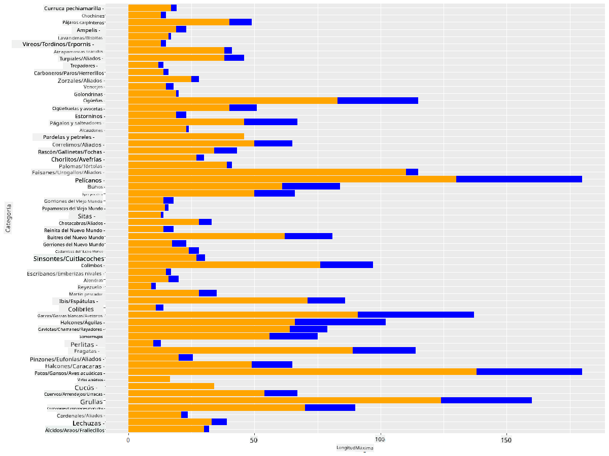

<!--
CO_OP_TRANSLATOR_METADATA:
{
  "original_hash": "22acf28f518a4769ea14fa42f4734b9f",
  "translation_date": "2025-08-24T22:49:32+00:00",
  "source_file": "3-Data-Visualization/R/09-visualization-quantities/README.md",
  "language_code": "es"
}
-->
# Visualizando Cantidades
| ](https://github.com/microsoft/Data-Science-For-Beginners/blob/main/sketchnotes/09-Visualizing-Quantities.png)|
|:---:|
| Visualizando Cantidades - _Sketchnote por [@nitya](https://twitter.com/nitya)_ |

En esta lección explorarás cómo usar algunas de las muchas bibliotecas de paquetes disponibles en R para aprender a crear visualizaciones interesantes en torno al concepto de cantidad. Usando un conjunto de datos limpio sobre las aves de Minnesota, puedes aprender muchos datos interesantes sobre la fauna local.  
## [Cuestionario previo a la lección](https://purple-hill-04aebfb03.1.azurestaticapps.net/quiz/16)

## Observa la envergadura con ggplot2
Una biblioteca excelente para crear gráficos y diagramas, tanto simples como sofisticados, de varios tipos es [ggplot2](https://cran.r-project.org/web/packages/ggplot2/index.html). En términos generales, el proceso de graficar datos usando estas bibliotecas incluye identificar las partes de tu dataframe que deseas analizar, realizar las transformaciones necesarias en esos datos, asignar valores a los ejes x e y, decidir qué tipo de gráfico mostrar y luego mostrar el gráfico.

`ggplot2` es un sistema para crear gráficos de manera declarativa, basado en The Grammar of Graphics. La [Gramática de los Gráficos](https://en.wikipedia.org/wiki/Ggplot2) es un esquema general para la visualización de datos que divide los gráficos en componentes semánticos como escalas y capas. En otras palabras, la facilidad para crear gráficos y diagramas para datos univariados o multivariados con poco código hace que `ggplot2` sea el paquete más popular para visualizaciones en R. El usuario indica a `ggplot2` cómo mapear las variables a las estéticas, los elementos gráficos a usar, y `ggplot2` se encarga del resto.

> ✅ Gráfico = Datos + Estéticas + Geometría  
> - Los datos se refieren al conjunto de datos  
> - Las estéticas indican las variables a estudiar (variables x e y)  
> - La geometría se refiere al tipo de gráfico (gráfico de líneas, gráfico de barras, etc.)  

Elige la mejor geometría (tipo de gráfico) según tus datos y la historia que deseas contar a través del gráfico.  

> - Para analizar tendencias: línea, columna  
> - Para comparar valores: barra, columna, pastel, dispersión  
> - Para mostrar cómo las partes se relacionan con el todo: pastel  
> - Para mostrar la distribución de datos: dispersión, barra  
> - Para mostrar relaciones entre valores: línea, dispersión, burbuja  

✅ También puedes consultar este descriptivo [cheatsheet](https://nyu-cdsc.github.io/learningr/assets/data-visualization-2.1.pdf) para ggplot2.

## Construye un gráfico de líneas sobre los valores de envergadura de las aves

Abre la consola de R e importa el conjunto de datos.  
> Nota: El conjunto de datos está almacenado en la raíz de este repositorio en la carpeta `/data`.

Importemos el conjunto de datos y observemos las primeras filas (top 5) de los datos.

```r
birds <- read.csv("../../data/birds.csv",fileEncoding="UTF-8-BOM")
head(birds)
```  
Las primeras filas de los datos tienen una mezcla de texto y números:

|      | Nombre                        | NombreCientífico       | Categoría             | Orden        | Familia  | Género      | EstadoConservación | MinLongitud | MaxLongitud | MinMasaCorporal | MaxMasaCorporal | MinEnvergadura | MaxEnvergadura |
| ---: | :---------------------------- | :--------------------- | :-------------------- | :----------- | :------- | :---------- | :----------------- | -----------:| -----------:| ---------------:| ---------------:| ---------------:| ---------------:|
|    0 | Pato silbador vientre negro   | Dendrocygna autumnalis | Patos/Gansos/Aves acuáticas | Anseriformes | Anatidae | Dendrocygna | LC                 |        47    |        56    |         652      |        1020      |          76     |          94     |
|    1 | Pato silbador fulvo           | Dendrocygna bicolor    | Patos/Gansos/Aves acuáticas | Anseriformes | Anatidae | Dendrocygna | LC                 |        45    |        53    |         712      |        1050      |          85     |          93     |
|    2 | Ganso de las nieves           | Anser caerulescens     | Patos/Gansos/Aves acuáticas | Anseriformes | Anatidae | Anser       | LC                 |        64    |        79    |        2050      |        4050      |         135     |         165     |
|    3 | Ganso de Ross                 | Anser rossii           | Patos/Gansos/Aves acuáticas | Anseriformes | Anatidae | Anser       | LC                 |      57.3    |        64    |        1066      |        1567      |         113     |         116     |
|    4 | Ganso de frente blanca mayor  | Anser albifrons        | Patos/Gansos/Aves acuáticas | Anseriformes | Anatidae | Anser       | LC                 |        64    |        81    |        1930      |        3310      |         130     |         165     |

Comencemos graficando algunos de los datos numéricos usando un gráfico de líneas básico. Supongamos que deseas ver la envergadura máxima de estas interesantes aves.

```r
install.packages("ggplot2")
library("ggplot2")
ggplot(data=birds, aes(x=Name, y=MaxWingspan,group=1)) +
  geom_line() 
```  
Aquí, instalas el paquete `ggplot2` y luego lo importas al espacio de trabajo usando el comando `library("ggplot2")`. Para graficar cualquier gráfico en ggplot, se utiliza la función `ggplot()` y especificas el conjunto de datos, las variables x e y como atributos. En este caso, usamos la función `geom_line()` ya que buscamos graficar un gráfico de líneas.



¿Qué notas de inmediato? Parece haber al menos un valor atípico: ¡vaya envergadura! Una envergadura de más de 2000 centímetros equivale a más de 20 metros: ¿hay pterodáctilos rondando Minnesota? Investiguemos.

Aunque podrías hacer un ordenamiento rápido en Excel para encontrar esos valores atípicos, que probablemente sean errores tipográficos, continúa el proceso de visualización trabajando desde el gráfico.

Agrega etiquetas al eje x para mostrar qué tipo de aves están en cuestión:

```r
ggplot(data=birds, aes(x=Name, y=MaxWingspan,group=1)) +
  geom_line() +
  theme(axis.text.x = element_text(angle = 45, hjust=1))+
  xlab("Birds") +
  ylab("Wingspan (CM)") +
  ggtitle("Max Wingspan in Centimeters")
```  
Especificamos el ángulo en el `theme` y especificamos las etiquetas de los ejes x e y en `xlab()` y `ylab()` respectivamente. El `ggtitle()` da un nombre al gráfico.



Incluso con la rotación de las etiquetas configurada a 45 grados, hay demasiadas para leer. Probemos una estrategia diferente: etiquetar solo los valores atípicos y establecer las etiquetas dentro del gráfico. Puedes usar un gráfico de dispersión para hacer más espacio para el etiquetado:

```r
ggplot(data=birds, aes(x=Name, y=MaxWingspan,group=1)) +
  geom_point() +
  geom_text(aes(label=ifelse(MaxWingspan>500,as.character(Name),'')),hjust=0,vjust=0) + 
  theme(axis.title.x=element_blank(), axis.text.x=element_blank(), axis.ticks.x=element_blank())
  ylab("Wingspan (CM)") +
  ggtitle("Max Wingspan in Centimeters") + 
```  
¿Qué está pasando aquí? Usaste la función `geom_point()` para graficar puntos de dispersión. Con esto, agregaste etiquetas para las aves que tenían su `MaxWingspan > 500` y también ocultaste las etiquetas en el eje x para despejar el gráfico.

¿Qué descubres?



## Filtra tus datos

Tanto el Águila Calva como el Halcón de las Praderas, aunque probablemente sean aves muy grandes, parecen estar mal etiquetados, con un cero extra agregado a su envergadura máxima. Es poco probable que encuentres un Águila Calva con una envergadura de 25 metros, pero si lo haces, ¡por favor avísanos! Creemos un nuevo dataframe sin esos dos valores atípicos:

```r
birds_filtered <- subset(birds, MaxWingspan < 500)

ggplot(data=birds_filtered, aes(x=Name, y=MaxWingspan,group=1)) +
  geom_point() +
  ylab("Wingspan (CM)") +
  xlab("Birds") +
  ggtitle("Max Wingspan in Centimeters") + 
  geom_text(aes(label=ifelse(MaxWingspan>500,as.character(Name),'')),hjust=0,vjust=0) +
  theme(axis.text.x=element_blank(), axis.ticks.x=element_blank())
```  
Creamos un nuevo dataframe `birds_filtered` y luego graficamos un gráfico de dispersión. Al filtrar los valores atípicos, tus datos ahora son más cohesivos y comprensibles.



Ahora que tenemos un conjunto de datos más limpio al menos en términos de envergadura, descubramos más sobre estas aves.

Mientras que los gráficos de líneas y dispersión pueden mostrar información sobre los valores de los datos y sus distribuciones, queremos pensar en los valores inherentes a este conjunto de datos. Podrías crear visualizaciones para responder las siguientes preguntas sobre cantidad:

> ¿Cuántas categorías de aves hay y cuáles son sus números?  
> ¿Cuántas aves están extintas, en peligro, son raras o comunes?  
> ¿Cuántas hay de los diversos géneros y órdenes en la terminología de Linneo?  

## Explora gráficos de barras

Los gráficos de barras son prácticos cuando necesitas mostrar agrupaciones de datos. Exploremos las categorías de aves que existen en este conjunto de datos para ver cuál es la más común por número.  
Creemos un gráfico de barras con datos filtrados.

```r
install.packages("dplyr")
install.packages("tidyverse")

library(lubridate)
library(scales)
library(dplyr)
library(ggplot2)
library(tidyverse)

birds_filtered %>% group_by(Category) %>%
  summarise(n=n(),
  MinLength = mean(MinLength),
  MaxLength = mean(MaxLength),
  MinBodyMass = mean(MinBodyMass),
  MaxBodyMass = mean(MaxBodyMass),
  MinWingspan=mean(MinWingspan),
  MaxWingspan=mean(MaxWingspan)) %>% 
  gather("key", "value", - c(Category, n)) %>%
  ggplot(aes(x = Category, y = value, group = key, fill = key)) +
  geom_bar(stat = "identity") +
  scale_fill_manual(values = c("#D62728", "#FF7F0E", "#8C564B","#2CA02C", "#1F77B4", "#9467BD")) +                   
  xlab("Category")+ggtitle("Birds of Minnesota")

```  
En el siguiente fragmento, instalamos los paquetes [dplyr](https://www.rdocumentation.org/packages/dplyr/versions/0.7.8) y [lubridate](https://www.rdocumentation.org/packages/lubridate/versions/1.8.0) para ayudar a manipular y agrupar datos con el fin de graficar un gráfico de barras apiladas. Primero, agrupas los datos por la `Categoría` de ave y luego resumes las columnas `MinLength`, `MaxLength`, `MinBodyMass`, `MaxBodyMass`, `MinWingspan`, `MaxWingspan`. Luego, graficas el gráfico de barras usando el paquete `ggplot2` y especificas los colores para las diferentes categorías y las etiquetas.



Este gráfico de barras, sin embargo, es ilegible porque hay demasiados datos no agrupados. Necesitas seleccionar solo los datos que deseas graficar, así que veamos la longitud de las aves según su categoría.

Filtra tus datos para incluir solo la categoría de las aves.

Dado que hay muchas categorías, puedes mostrar este gráfico verticalmente y ajustar su altura para incluir todos los datos:

```r
birds_count<-dplyr::count(birds_filtered, Category, sort = TRUE)
birds_count$Category <- factor(birds_count$Category, levels = birds_count$Category)
ggplot(birds_count,aes(Category,n))+geom_bar(stat="identity")+coord_flip()
```  
Primero cuentas los valores únicos en la columna `Category` y luego los ordenas en un nuevo dataframe `birds_count`. Estos datos ordenados se factorizan en el mismo nivel para que se grafiquen de manera ordenada. Usando `ggplot2` luego graficas los datos en un gráfico de barras. El `coord_flip()` grafica barras horizontales.



Este gráfico de barras muestra una buena vista del número de aves en cada categoría. De un vistazo, ves que el mayor número de aves en esta región pertenece a la categoría de Patos/Gansos/Aves acuáticas. Minnesota es la 'tierra de los 10,000 lagos', ¡así que esto no es sorprendente!

✅ Prueba algunos otros conteos en este conjunto de datos. ¿Hay algo que te sorprenda?

## Comparando datos

Puedes probar diferentes comparaciones de datos agrupados creando nuevos ejes. Prueba una comparación de la MaxLength de un ave, basada en su categoría:

```r
birds_grouped <- birds_filtered %>%
  group_by(Category) %>%
  summarise(
  MaxLength = max(MaxLength, na.rm = T),
  MinLength = max(MinLength, na.rm = T)
           ) %>%
  arrange(Category)
  
ggplot(birds_grouped,aes(Category,MaxLength))+geom_bar(stat="identity")+coord_flip()
```  
Agrupamos los datos `birds_filtered` por `Category` y luego graficamos un gráfico de barras.



Nada sorprendente aquí: los colibríes tienen la menor MaxLength en comparación con los pelícanos o los gansos. ¡Es bueno cuando los datos tienen sentido lógico!

Puedes crear visualizaciones más interesantes de gráficos de barras superponiendo datos. Superpongamos la Longitud Mínima y Máxima en una categoría de ave dada:

```r
ggplot(data=birds_grouped, aes(x=Category)) +
  geom_bar(aes(y=MaxLength), stat="identity", position ="identity",  fill='blue') +
  geom_bar(aes(y=MinLength), stat="identity", position="identity", fill='orange')+
  coord_flip()
```  


## 🚀 Desafío

Este conjunto de datos de aves ofrece una gran cantidad de información sobre diferentes tipos de aves dentro de un ecosistema particular. Busca en internet y ve si puedes encontrar otros conjuntos de datos orientados a aves. Practica construyendo gráficos y diagramas sobre estas aves para descubrir datos que no conocías.  
## [Cuestionario posterior a la lección](https://purple-hill-04aebfb03.1.azurestaticapps.net/quiz/17)

## Revisión y Autoestudio

Esta primera lección te ha dado información sobre cómo usar `ggplot2` para visualizar cantidades. Investiga otras formas de trabajar con conjuntos de datos para visualización. Investiga y busca conjuntos de datos que puedas visualizar usando otros paquetes como [Lattice](https://stat.ethz.ch/R-manual/R-devel/library/lattice/html/Lattice.html) y [Plotly](https://github.com/plotly/plotly.R#readme).

## Tarea  
[Gráficos de Líneas, Dispersión y Barras](assignment.md)

**Descargo de responsabilidad**:  
Este documento ha sido traducido utilizando el servicio de traducción automática [Co-op Translator](https://github.com/Azure/co-op-translator). Aunque nos esforzamos por garantizar la precisión, tenga en cuenta que las traducciones automatizadas pueden contener errores o imprecisiones. El documento original en su idioma nativo debe considerarse como la fuente autorizada. Para información crítica, se recomienda una traducción profesional realizada por humanos. No nos hacemos responsables de malentendidos o interpretaciones erróneas que puedan surgir del uso de esta traducción.