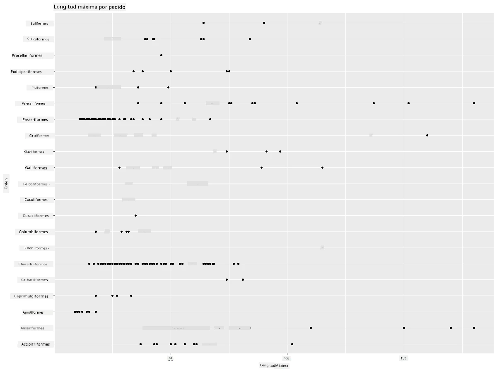
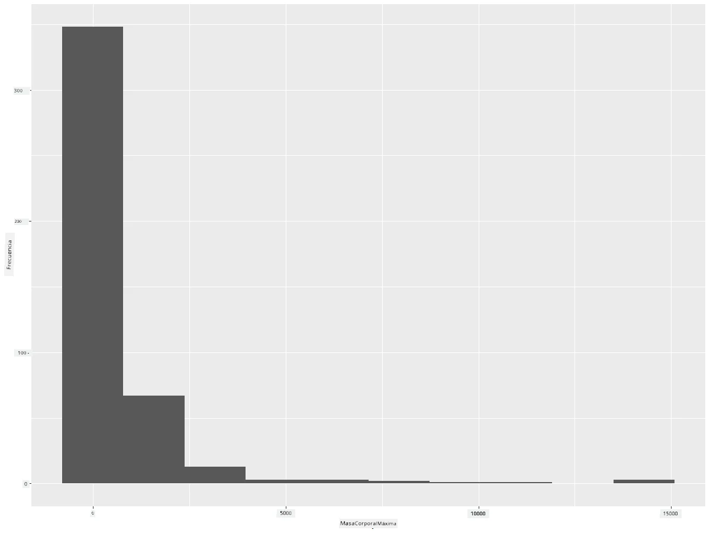
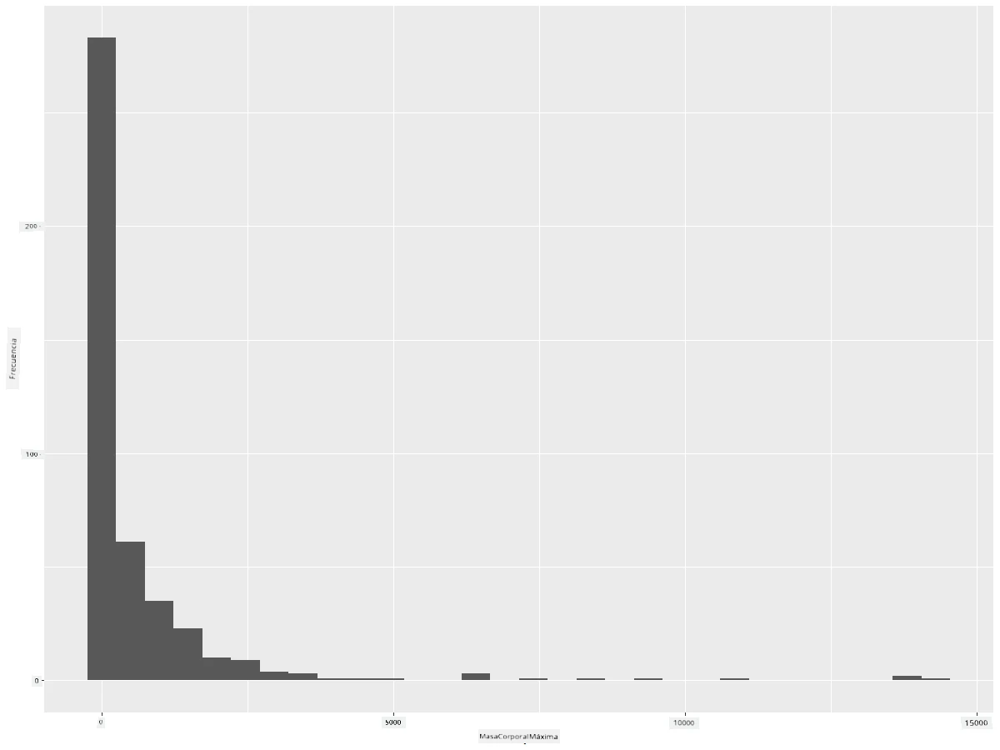
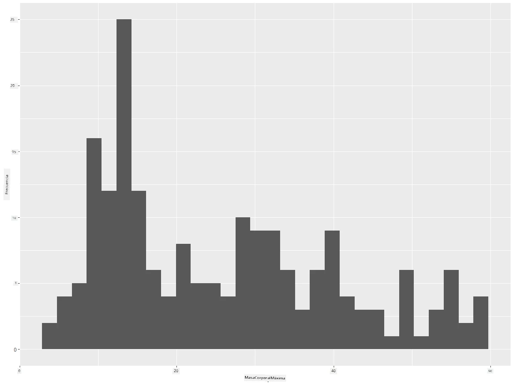
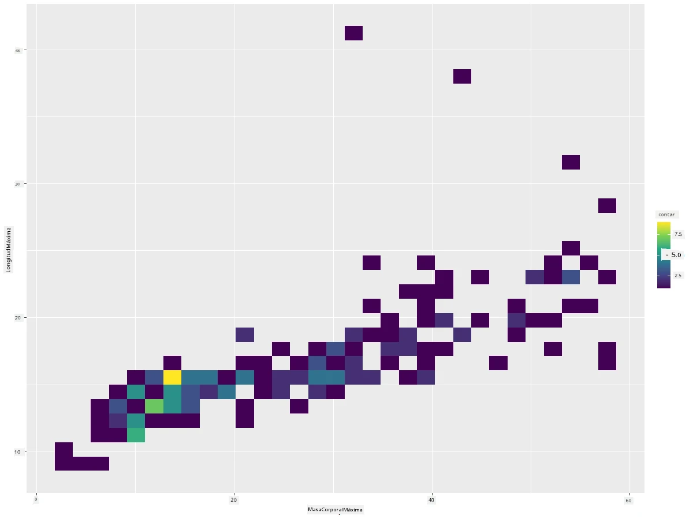
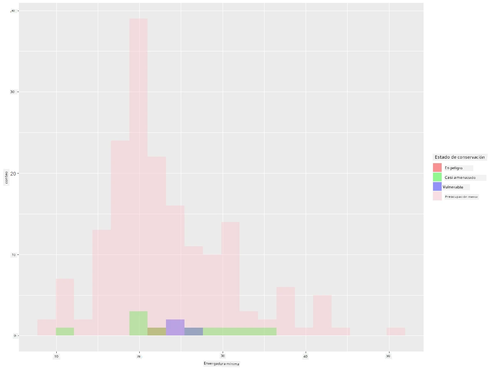
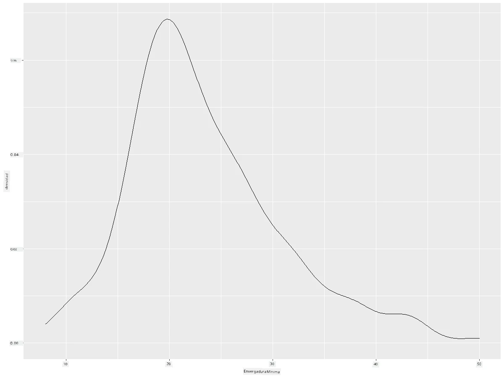
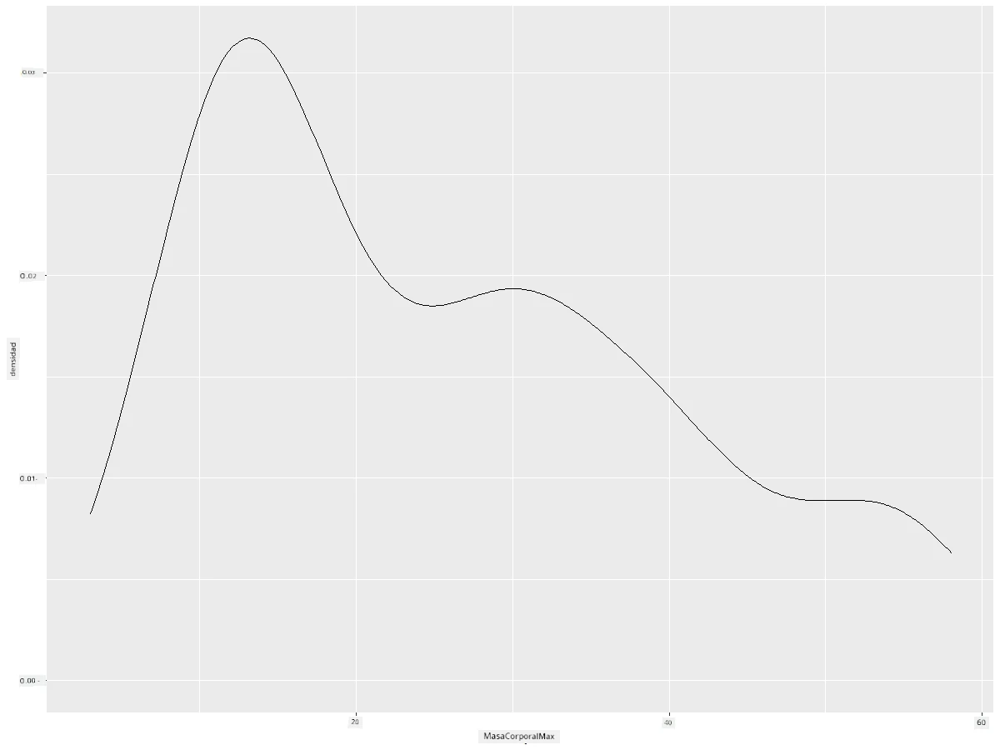
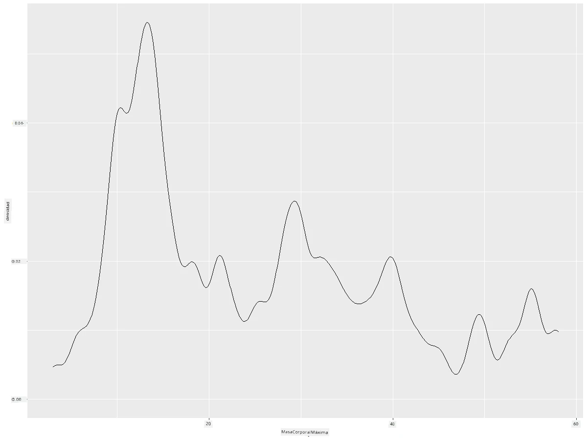
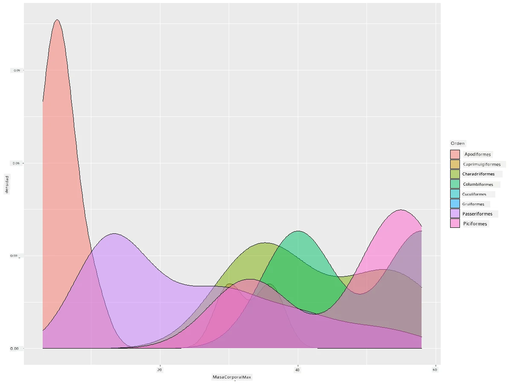

<!--
CO_OP_TRANSLATOR_METADATA:
{
  "original_hash": "ea67c0c40808fd723594de6896c37ccf",
  "translation_date": "2025-08-24T22:42:56+00:00",
  "source_file": "3-Data-Visualization/R/10-visualization-distributions/README.md",
  "language_code": "es"
}
-->
# Visualizando Distribuciones

| ](https://github.com/microsoft/Data-Science-For-Beginners/blob/main/sketchnotes/10-Visualizing-Distributions.png)|
|:---:|
| Visualizando Distribuciones - _Sketchnote por [@nitya](https://twitter.com/nitya)_ |

En la lección anterior, aprendiste algunos datos interesantes sobre un conjunto de datos acerca de las aves de Minnesota. Encontraste datos erróneos visualizando valores atípicos y observaste las diferencias entre las categorías de aves según su longitud máxima.

## [Cuestionario previo a la lección](https://purple-hill-04aebfb03.1.azurestaticapps.net/quiz/18)
## Explora el conjunto de datos de aves

Otra forma de analizar los datos es observando su distribución, o cómo los datos están organizados a lo largo de un eje. Tal vez, por ejemplo, te gustaría aprender sobre la distribución general, para este conjunto de datos, de la envergadura máxima o la masa corporal máxima de las aves de Minnesota.

Descubramos algunos datos sobre las distribuciones de los datos en este conjunto. En tu consola de R, importa `ggplot2` y la base de datos. Elimina los valores atípicos de la base de datos tal como hiciste en el tema anterior.

```r
library(ggplot2)

birds <- read.csv("../../data/birds.csv",fileEncoding="UTF-8-BOM")

birds_filtered <- subset(birds, MaxWingspan < 500)
head(birds_filtered)
```
|      | Nombre                       | NombreCientífico       | Categoría             | Orden        | Familia  | Género      | EstadoConservación  | MinLongitud | MaxLongitud | MinMasaCorporal | MaxMasaCorporal | MinEnvergadura | MaxEnvergadura |
| ---: | :--------------------------- | :--------------------- | :-------------------- | :----------- | :------- | :---------- | :------------------ | -----------:| -----------:| ---------------:| ---------------:| ---------------:| ---------------:|
|    0 | Pato silbador vientre negro  | Dendrocygna autumnalis | Patos/Gansos/Aves acuáticas | Anseriformes | Anatidae | Dendrocygna | LC                  |        47    |        56    |         652      |        1020      |          76     |          94     |
|    1 | Pato silbador fulvo          | Dendrocygna bicolor    | Patos/Gansos/Aves acuáticas | Anseriformes | Anatidae | Dendrocygna | LC                  |        45    |        53    |         712      |        1050      |          85     |          93     |
|    2 | Ganso de las nieves          | Anser caerulescens     | Patos/Gansos/Aves acuáticas | Anseriformes | Anatidae | Anser       | LC                  |        64    |        79    |        2050      |        4050      |         135     |         165     |
|    3 | Ganso de Ross                | Anser rossii           | Patos/Gansos/Aves acuáticas | Anseriformes | Anatidae | Anser       | LC                  |      57.3    |        64    |        1066      |        1567      |         113     |         116     |
|    4 | Ganso de frente blanca mayor | Anser albifrons        | Patos/Gansos/Aves acuáticas | Anseriformes | Anatidae | Anser       | LC                  |        64    |        81    |        1930      |        3310      |         130     |         165     |

En general, puedes observar rápidamente cómo se distribuyen los datos utilizando un gráfico de dispersión como hicimos en la lección anterior:

```r
ggplot(data=birds_filtered, aes(x=Order, y=MaxLength,group=1)) +
  geom_point() +
  ggtitle("Max Length per order") + coord_flip()
```


Esto da una visión general de la distribución de la longitud corporal por Orden de aves, pero no es la forma óptima de mostrar distribuciones reales. Esa tarea generalmente se realiza creando un Histograma.

## Trabajando con histogramas

`ggplot2` ofrece muy buenas formas de visualizar la distribución de datos utilizando Histogramas. Este tipo de gráfico es como un gráfico de barras donde la distribución se puede observar a través del aumento y la caída de las barras. Para construir un histograma, necesitas datos numéricos. Para construir un Histograma, puedes graficar un gráfico definiendo el tipo como 'hist' para Histograma. Este gráfico muestra la distribución de MaxBodyMass para el rango completo de datos numéricos del conjunto de datos. Dividiendo el conjunto de datos en intervalos más pequeños, puede mostrar la distribución de los valores de los datos:

```r
ggplot(data = birds_filtered, aes(x = MaxBodyMass)) + 
  geom_histogram(bins=10)+ylab('Frequency')
```


Como puedes ver, la mayoría de las más de 400 aves en este conjunto de datos caen en el rango de menos de 2000 para su Masa Corporal Máxima. Obtén más información sobre los datos cambiando el parámetro `bins` a un número mayor, algo como 30:

```r
ggplot(data = birds_filtered, aes(x = MaxBodyMass)) + geom_histogram(bins=30)+ylab('Frequency')
```



Este gráfico muestra la distribución de manera un poco más detallada. Un gráfico menos sesgado hacia la izquierda podría crearse asegurándote de seleccionar solo datos dentro de un rango dado:

Filtra tus datos para obtener solo aquellas aves cuya masa corporal sea menor a 60, y muestra 30 `bins`:

```r
birds_filtered_1 <- subset(birds_filtered, MaxBodyMass > 1 & MaxBodyMass < 60)
ggplot(data = birds_filtered_1, aes(x = MaxBodyMass)) + 
  geom_histogram(bins=30)+ylab('Frequency')
```



✅ Prueba algunos otros filtros y puntos de datos. Para ver la distribución completa de los datos, elimina el filtro `['MaxBodyMass']` para mostrar distribuciones etiquetadas.

El histograma ofrece algunas mejoras agradables de color y etiquetado para probar también:

Crea un histograma 2D para comparar la relación entre dos distribuciones. Comparemos `MaxBodyMass` vs. `MaxLength`. `ggplot2` ofrece una forma integrada de mostrar convergencia utilizando colores más brillantes:

```r
ggplot(data=birds_filtered_1, aes(x=MaxBodyMass, y=MaxLength) ) +
  geom_bin2d() +scale_fill_continuous(type = "viridis")
```
Parece haber una correlación esperada entre estos dos elementos a lo largo de un eje esperado, con un punto particularmente fuerte de convergencia:



Los histogramas funcionan bien por defecto para datos numéricos. ¿Qué pasa si necesitas ver distribuciones según datos de texto? 

## Explora el conjunto de datos para distribuciones usando datos de texto 

Este conjunto de datos también incluye buena información sobre la categoría de las aves y su género, especie y familia, así como su estado de conservación. Exploremos esta información de conservación. ¿Cuál es la distribución de las aves según su estado de conservación?

> ✅ En el conjunto de datos, se utilizan varios acrónimos para describir el estado de conservación. Estos acrónimos provienen de las [Categorías de la Lista Roja de la UICN](https://www.iucnredlist.org/), una organización que cataloga el estado de las especies.
> 
> - CR: En Peligro Crítico
> - EN: En Peligro
> - EX: Extinto
> - LC: Preocupación Menor
> - NT: Casi Amenazado
> - VU: Vulnerable

Estos son valores basados en texto, por lo que necesitarás hacer una transformación para crear un histograma. Usando el dataframe filteredBirds, muestra su estado de conservación junto con su Envergadura Mínima. ¿Qué observas?

```r
birds_filtered_1$ConservationStatus[birds_filtered_1$ConservationStatus == 'EX'] <- 'x1' 
birds_filtered_1$ConservationStatus[birds_filtered_1$ConservationStatus == 'CR'] <- 'x2'
birds_filtered_1$ConservationStatus[birds_filtered_1$ConservationStatus == 'EN'] <- 'x3'
birds_filtered_1$ConservationStatus[birds_filtered_1$ConservationStatus == 'NT'] <- 'x4'
birds_filtered_1$ConservationStatus[birds_filtered_1$ConservationStatus == 'VU'] <- 'x5'
birds_filtered_1$ConservationStatus[birds_filtered_1$ConservationStatus == 'LC'] <- 'x6'

ggplot(data=birds_filtered_1, aes(x = MinWingspan, fill = ConservationStatus)) +
  geom_histogram(position = "identity", alpha = 0.4, bins = 20) +
  scale_fill_manual(name="Conservation Status",values=c("red","green","blue","pink"),labels=c("Endangered","Near Threathened","Vulnerable","Least Concern"))
```



No parece haber una buena correlación entre la envergadura mínima y el estado de conservación. Prueba otros elementos del conjunto de datos utilizando este método. También puedes probar diferentes filtros. ¿Encuentras alguna correlación?

## Gráficos de densidad

Es posible que hayas notado que los histogramas que hemos visto hasta ahora son 'escalonados' y no fluyen suavemente en un arco. Para mostrar un gráfico de densidad más suave, puedes probar un gráfico de densidad.

¡Trabajemos ahora con gráficos de densidad!

```r
ggplot(data = birds_filtered_1, aes(x = MinWingspan)) + 
  geom_density()
```


Puedes ver cómo el gráfico refleja el anterior para los datos de Envergadura Mínima; es solo un poco más suave. Si quisieras revisar esa línea irregular de MaxBodyMass en el segundo gráfico que construiste, podrías suavizarla muy bien recreándola usando este método:

```r
ggplot(data = birds_filtered_1, aes(x = MaxBodyMass)) + 
  geom_density()
```


Si quisieras una línea suave, pero no demasiado suave, edita el parámetro `adjust`: 

```r
ggplot(data = birds_filtered_1, aes(x = MaxBodyMass)) + 
  geom_density(adjust = 1/5)
```


✅ Lee sobre los parámetros disponibles para este tipo de gráfico y experimenta.

Este tipo de gráfico ofrece visualizaciones explicativas muy atractivas. Con unas pocas líneas de código, por ejemplo, puedes mostrar la densidad de masa corporal máxima por Orden de aves:

```r
ggplot(data=birds_filtered_1,aes(x = MaxBodyMass, fill = Order)) +
  geom_density(alpha=0.5)
```


## 🚀 Desafío

Los histogramas son un tipo de gráfico más sofisticado que los gráficos de dispersión, gráficos de barras o gráficos de líneas básicos. Busca en internet buenos ejemplos del uso de histogramas. ¿Cómo se utilizan, qué demuestran y en qué campos o áreas de investigación tienden a utilizarse?

## [Cuestionario posterior a la lección](https://purple-hill-04aebfb03.1.azurestaticapps.net/quiz/19)

## Repaso y Autoestudio

En esta lección, utilizaste `ggplot2` y comenzaste a trabajar para mostrar gráficos más sofisticados. Investiga sobre `geom_density_2d()`, una "curva de densidad de probabilidad continua en una o más dimensiones". Lee la [documentación](https://ggplot2.tidyverse.org/reference/geom_density_2d.html) para entender cómo funciona.

## Tarea

[Aplica tus habilidades](assignment.md)

**Descargo de responsabilidad**:  
Este documento ha sido traducido utilizando el servicio de traducción automática [Co-op Translator](https://github.com/Azure/co-op-translator). Aunque nos esforzamos por garantizar la precisión, tenga en cuenta que las traducciones automatizadas pueden contener errores o imprecisiones. El documento original en su idioma nativo debe considerarse la fuente autorizada. Para información crítica, se recomienda una traducción profesional realizada por humanos. No nos hacemos responsables de malentendidos o interpretaciones erróneas que puedan surgir del uso de esta traducción.