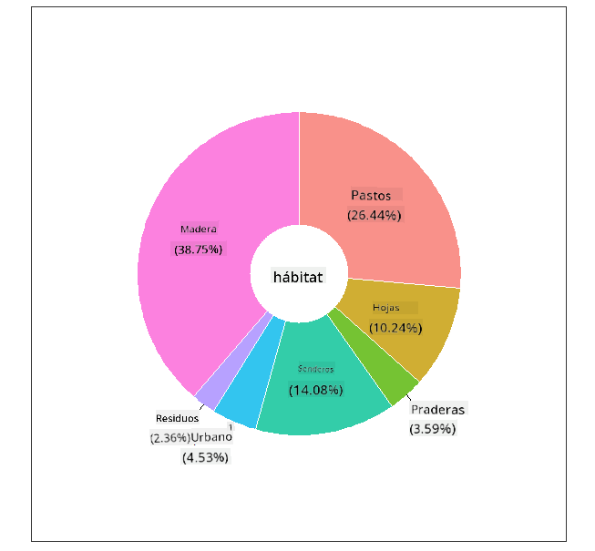
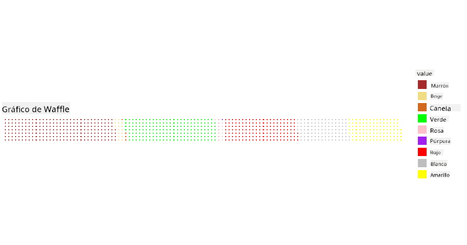

<!--
CO_OP_TRANSLATOR_METADATA:
{
  "original_hash": "47028abaaafa2bcb1079702d20569066",
  "translation_date": "2025-08-24T22:57:47+00:00",
  "source_file": "3-Data-Visualization/R/11-visualization-proportions/README.md",
  "language_code": "es"
}
-->
# Visualizando Proporciones

| ](../../../sketchnotes/11-Visualizing-Proportions.png)|
|:---:|
|Visualizando Proporciones - _Sketchnote por [@nitya](https://twitter.com/nitya)_ |

En esta lección, usarás un conjunto de datos enfocado en la naturaleza para visualizar proporciones, como cuántos tipos diferentes de hongos se encuentran en un conjunto de datos sobre setas. Vamos a explorar estos fascinantes hongos utilizando un conjunto de datos obtenido de Audubon que detalla 23 especies de hongos con branquias de las familias Agaricus y Lepiota. Experimentarás con visualizaciones interesantes como:

- Gráficos de pastel 🥧
- Gráficos de dona 🍩
- Gráficos de waffle 🧇

> 💡 Un proyecto muy interesante llamado [Charticulator](https://charticulator.com) de Microsoft Research ofrece una interfaz gratuita de arrastrar y soltar para visualizaciones de datos. En uno de sus tutoriales también utilizan este conjunto de datos de hongos. Así que puedes explorar los datos y aprender la biblioteca al mismo tiempo: [Tutorial de Charticulator](https://charticulator.com/tutorials/tutorial4.html).

## [Cuestionario previo a la lección](https://purple-hill-04aebfb03.1.azurestaticapps.net/quiz/20)

## Conoce tus hongos 🍄

Los hongos son muy interesantes. Importemos un conjunto de datos para estudiarlos:

```r
mushrooms = read.csv('../../data/mushrooms.csv')
head(mushrooms)
```
Se imprime una tabla con algunos datos excelentes para análisis:


| clase     | forma del sombrero | superficie del sombrero | color del sombrero | magulladuras | olor    | unión de las branquias | espacio entre branquias | tamaño de las branquias | color de las branquias | forma del tallo | raíz del tallo | superficie del tallo sobre el anillo | superficie del tallo bajo el anillo | color del tallo sobre el anillo | color del tallo bajo el anillo | tipo de velo | color del velo | número de anillos | tipo de anillo | color de impresión de esporas | población | hábitat |
| --------- | ------------------ | ----------------------- | ------------------ | ------------ | ------- | ---------------------- | ----------------------- | ----------------------- | ---------------------- | --------------- | ------------- | ---------------------------------- | ---------------------------------- | ------------------------------ | ------------------------------ | ----------- | ------------- | ----------------- | ------------- | ---------------------------- | ---------- | ------- |
| Venenoso  | Convexo            | Liso                   | Marrón            | Magulladuras | Pungente | Libre                 | Cerrado                | Estrecho               | Negro                 | Ensanchado       | Igual         | Liso                             | Liso                             | Blanco                          | Blanco                          | Parcial     | Blanco        | Uno               | Colgante      | Negro                       | Disperso   | Urbano  |
| Comestible| Convexo            | Liso                   | Amarillo          | Magulladuras | Almendra| Libre                 | Cerrado                | Ancho                 | Negro                 | Ensanchado       | Club          | Liso                             | Liso                             | Blanco                          | Blanco                          | Parcial     | Blanco        | Uno               | Colgante      | Marrón                     | Numeroso   | Pastos  |
| Comestible| Campana            | Liso                   | Blanco            | Magulladuras | Anís    | Libre                 | Cerrado                | Ancho                 | Marrón                | Ensanchado       | Club          | Liso                             | Liso                             | Blanco                          | Blanco                          | Parcial     | Blanco        | Uno               | Colgante      | Marrón                     | Numeroso   | Praderas|
| Venenoso  | Convexo            | Escamoso               | Blanco            | Magulladuras | Pungente | Libre                 | Cerrado                | Estrecho              | Marrón                | Ensanchado       | Igual         | Liso                             | Liso                             | Blanco                          | Blanco                          | Parcial     | Blanco        | Uno               | Colgante      | Negro                       | Disperso   | Urbano  |
| Comestible| Convexo            | Liso                   | Verde             | Sin magulladuras| Ninguno| Libre                 | Aglomerado             | Ancho                 | Negro                 | Estrechado       | Igual         | Liso                             | Liso                             | Blanco                          | Blanco                          | Parcial     | Blanco        | Uno               | Evanescente   | Marrón                     | Abundante  | Pastos  |
| Comestible| Convexo            | Escamoso               | Amarillo          | Magulladuras | Almendra| Libre                 | Cerrado                | Ancho                 | Marrón                | Ensanchado       | Club          | Liso                             | Liso                             | Blanco                          | Blanco                          | Parcial     | Blanco        | Uno               | Colgante      | Negro                       | Numeroso   | Pastos  |

De inmediato, notas que todos los datos son textuales. Tendrás que convertir estos datos para poder usarlos en un gráfico. De hecho, la mayoría de los datos están representados como un objeto:

```r
names(mushrooms)
```

El resultado es:

```output
[1] "class"                    "cap.shape"               
 [3] "cap.surface"              "cap.color"               
 [5] "bruises"                  "odor"                    
 [7] "gill.attachment"          "gill.spacing"            
 [9] "gill.size"                "gill.color"              
[11] "stalk.shape"              "stalk.root"              
[13] "stalk.surface.above.ring" "stalk.surface.below.ring"
[15] "stalk.color.above.ring"   "stalk.color.below.ring"  
[17] "veil.type"                "veil.color"              
[19] "ring.number"              "ring.type"               
[21] "spore.print.color"        "population"              
[23] "habitat"            
```
Toma estos datos y convierte la columna 'clase' en una categoría:

```r
library(dplyr)
grouped=mushrooms %>%
  group_by(class) %>%
  summarise(count=n())
```

Ahora, si imprimes los datos de los hongos, puedes ver que se han agrupado en categorías según la clase venenoso/comestible:
```r
View(grouped)
```

| clase | cantidad |
| --------- | --------- |
| Comestible | 4208 |
| Venenoso   | 3916 |

Si sigues el orden presentado en esta tabla para crear tus etiquetas de categoría de clase, puedes construir un gráfico de pastel.

## ¡Pastel!

```r
pie(grouped$count,grouped$class, main="Edible?")
```
Voila, un gráfico de pastel que muestra las proporciones de estos datos según estas dos clases de hongos. Es bastante importante obtener el orden correcto de las etiquetas, especialmente aquí, así que asegúrate de verificar el orden con el que se construye el arreglo de etiquetas.


## ¡Donas!

Un gráfico de pastel algo más visualmente interesante es un gráfico de dona, que es un gráfico de pastel con un agujero en el medio. Veamos nuestros datos usando este método.

Observa los diversos hábitats donde crecen los hongos:

```r
library(dplyr)
habitat=mushrooms %>%
  group_by(habitat) %>%
  summarise(count=n())
View(habitat)
```
El resultado es:
| hábitat | cantidad |
| --------- | --------- |
| Pastos    | 2148 |
| Hojas     | 832 |
| Praderas  | 292 |
| Caminos   | 1144 |
| Urbano    | 368 |
| Residuos  | 192 |
| Madera    | 3148 |

Aquí, estás agrupando tus datos por hábitat. Hay 7 listados, así que usa esos como etiquetas para tu gráfico de dona:

```r
library(ggplot2)
library(webr)
PieDonut(habitat, aes(habitat, count=count))
```



Este código utiliza dos bibliotecas: ggplot2 y webr. Usando la función PieDonut de la biblioteca webr, podemos crear un gráfico de dona fácilmente.

Los gráficos de dona en R también se pueden hacer usando solo la biblioteca ggplot2. Puedes aprender más sobre esto [aquí](https://www.r-graph-gallery.com/128-ring-or-donut-plot.html) y probarlo tú mismo.

Ahora que sabes cómo agrupar tus datos y luego mostrarlos como un gráfico de pastel o dona, puedes explorar otros tipos de gráficos. Prueba un gráfico de waffle, que es solo una forma diferente de explorar cantidades.

## ¡Waffles!

Un gráfico tipo 'waffle' es una forma diferente de visualizar cantidades como una matriz 2D de cuadrados. Intenta visualizar las diferentes cantidades de colores de sombrero de hongos en este conjunto de datos. Para hacerlo, necesitas instalar una biblioteca auxiliar llamada [waffle](https://cran.r-project.org/web/packages/waffle/waffle.pdf) y usarla para generar tu visualización:

```r
install.packages("waffle", repos = "https://cinc.rud.is")
```

Selecciona un segmento de tus datos para agrupar:

```r
library(dplyr)
cap_color=mushrooms %>%
  group_by(cap.color) %>%
  summarise(count=n())
View(cap_color)
```

Crea un gráfico de waffle creando etiquetas y luego agrupando tus datos:

```r
library(waffle)
names(cap_color$count) = paste0(cap_color$cap.color)
waffle((cap_color$count/10), rows = 7, title = "Waffle Chart")+scale_fill_manual(values=c("brown", "#F0DC82", "#D2691E", "green", 
                                                                                     "pink", "purple", "red", "grey", 
                                                                                     "yellow","white"))
```

Usando un gráfico de waffle, puedes ver claramente las proporciones de colores de sombrero en este conjunto de datos de hongos. Curiosamente, ¡hay muchos hongos con sombreros verdes!



En esta lección, aprendiste tres formas de visualizar proporciones. Primero, necesitas agrupar tus datos en categorías y luego decidir cuál es la mejor manera de mostrar los datos: pastel, dona o waffle. Todos son deliciosos y gratifican al usuario con una instantánea instantánea de un conjunto de datos.

## 🚀 Desafío

Intenta recrear estos gráficos deliciosos en [Charticulator](https://charticulator.com).

## [Cuestionario posterior a la lección](https://purple-hill-04aebfb03.1.azurestaticapps.net/quiz/21)

## Revisión y Autoestudio

A veces no es obvio cuándo usar un gráfico de pastel, dona o waffle. Aquí hay algunos artículos para leer sobre este tema:

https://www.beautiful.ai/blog/battle-of-the-charts-pie-chart-vs-donut-chart

https://medium.com/@hypsypops/pie-chart-vs-donut-chart-showdown-in-the-ring-5d24fd86a9ce

https://www.mit.edu/~mbarker/formula1/f1help/11-ch-c6.htm

https://medium.datadriveninvestor.com/data-visualization-done-the-right-way-with-tableau-waffle-chart-fdf2a19be402

Investiga un poco para encontrar más información sobre esta decisión complicada.

## Tarea

[Inténtalo en Excel](assignment.md)

**Descargo de responsabilidad**:  
Este documento ha sido traducido utilizando el servicio de traducción automática [Co-op Translator](https://github.com/Azure/co-op-translator). Aunque nos esforzamos por garantizar la precisión, tenga en cuenta que las traducciones automatizadas pueden contener errores o imprecisiones. El documento original en su idioma nativo debe considerarse como la fuente autorizada. Para información crítica, se recomienda una traducción profesional realizada por humanos. No nos hacemos responsables de malentendidos o interpretaciones erróneas que puedan surgir del uso de esta traducción.